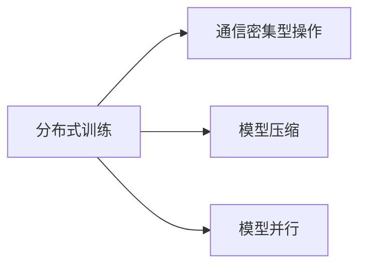

                 

# 大语言模型原理与工程实践：通信优化

> 关键词：通信优化,大语言模型,分布式训练,算法并行,通信密集型操作,模型压缩,内存优化,TPU

## 1. 背景介绍

### 1.1 问题由来
近年来，随着深度学习技术的飞速发展，大语言模型（Large Language Models, LLMs）在自然语言处理（Natural Language Processing, NLP）领域取得了巨大成功。这些模型通常具有数十亿甚至上百亿的参数，能够在大规模无标签文本数据上学习到丰富的语言知识和常识，进而广泛应用于各种NLP任务，如文本分类、情感分析、对话系统等。然而，训练这些大模型的过程非常耗时耗资，单批次计算量巨大，通信带宽和内存需求极高，这使得其在传统分布式训练系统上难以高效运行。因此，为了解决这些问题，研究者们提出了基于通信优化的分布式训练方法，以提升大语言模型的训练效率。

### 1.2 问题核心关键点
本文聚焦于通信优化在大语言模型分布式训练中的应用，旨在通过优化模型之间的通信模式、减少不必要的通信开销，提升训练效率，降低能耗，加速模型收敛。

通信优化主要针对以下两个核心问题：
- **通信密集型操作**：在大规模模型训练过程中，模型参数的更新、梯度计算和模型同步等操作会带来大量的通信开销，尤其是深度神经网络中的全连接层、卷积层等，通信成本尤为显著。
- **模型压缩与内存优化**：为了减少内存占用和提高计算效率，研究人员开发了多种模型压缩技术，如知识蒸馏、量化、剪枝等，以减少模型参数量，同时保持模型性能不降低。

## 2. 核心概念与联系

### 2.1 核心概念概述

为了深入理解基于通信优化的分布式训练方法，本文将介绍几个关键概念：

- **分布式训练**：在多台计算机上同时进行模型训练的过程，可以并行化处理大规模数据和模型参数，加速训练。
- **通信密集型操作**：指那些需要频繁在模型之间传输数据的操作，如参数更新、梯度传递等，是影响分布式训练效率的主要因素。
- **模型压缩**：通过减少模型参数量、降低模型复杂度等方式，减少内存占用和计算开销，提升训练效率。
- **模型并行**：将模型参数或数据分为若干个子集，分别在多个计算节点上并行计算，降低单个节点的计算负担。

这些概念之间的关系可以用以下Mermaid流程图来展示：



这个流程图展示了分布式训练、通信密集型操作、模型压缩和模型并行之间的关系：

- 分布式训练依赖于通信密集型操作和模型并行，才能实现高效的并行计算。
- 通信密集型操作是分布式训练中的瓶颈，需要通过优化来解决。
- 模型压缩可以减小通信密集型操作的数据量，从而减少通信开销。
- 模型并行可以将模型参数或数据分布在多个节点上，减少单个节点的计算负担。

通过理解这些关键概念，我们可以更好地把握通信优化在大语言模型分布式训练中的重要性。

## 3. 核心算法原理 & 具体操作步骤
### 3.1 算法原理概述

基于通信优化的分布式训练方法的核心思想是通过减少不必要的通信开销，提高训练效率，加速模型收敛。常见的通信优化方法包括参数同步策略、混合精度训练、跨步计算、零样本传输、模型分块等。

本文将重点介绍以下三种通信优化策略：

1. **参数同步策略**：在分布式训练过程中，多个模型副本之间需要定期同步参数，以保证模型的一致性。常见的参数同步算法包括环同步、星同步等，通过优化同步策略和顺序，减少通信开销。
2. **混合精度训练**：使用不同精度的参数进行训练，如使用16位浮点数（FP16）代替32位浮点数（FP32），可以减少通信和内存开销，加速训练。
3. **跨步计算**：将模型参数按不同的步长进行同步，以减少同步频率，降低通信开销。

### 3.2 算法步骤详解

基于通信优化的分布式训练一般包括以下几个关键步骤：

**Step 1: 准备分布式训练环境**
- 选择合适的分布式训练框架，如Horovod、Distributed TensorFlow等。
- 在多个计算节点上安装相应的库和依赖。
- 划分训练数据集，将其分发到各个节点。

**Step 2: 设计通信密集型操作的优化策略**
- 根据具体任务和模型特性，选择适合的参数同步算法，如环同步、星同步等。
- 根据模型参数大小和计算需求，设计合理的跨步计算策略。
- 使用混合精度训练技术，优化内存和通信开销。

**Step 3: 执行分布式训练**
- 将模型参数和数据分别分布在不同的节点上。
- 并行计算模型参数的梯度更新。
- 使用选定的参数同步策略，减少通信开销。
- 定期评估模型性能，记录训练日志。
- 在满足预设条件后，停止训练，保存模型参数。

**Step 4: 参数压缩与模型优化**
- 根据模型评估结果，进行参数压缩，如剪枝、量化等。
- 使用知识蒸馏技术，保留模型知识，减少参数量。
- 优化内存布局，减少内存占用。

**Step 5: 结果分析与性能评估**
- 使用性能分析工具，如TensorBoard、Weights & Biases等，评估模型性能。
- 分析通信开销和内存占用，优化训练流程。
- 调整模型和训练参数，改进性能。

### 3.3 算法优缺点

基于通信优化的分布式训练方法具有以下优点：
1. 高效性：通过优化通信密集型操作和模型并行，显著提升训练效率。
2. 可扩展性：适用于大规模模型的分布式训练，提升训练任务的可扩展性。
3. 可调性：通过调整参数同步策略、跨步计算等参数，灵活优化通信开销。
4. 成本效益：减少通信开销和内存占用，降低训练成本。

但该方法也存在一定的局限性：
1. 数据划分复杂：不同节点间的数据分布和参数划分需要精心设计，以避免数据不均衡。
2. 模型结构依赖：部分通信优化方法依赖于特定的模型结构，不适用于所有模型。
3. 同步延迟：过多的参数同步和通信开销可能导致训练延迟，影响训练效果。
4. 压缩效果有限：模型压缩技术对模型的精度和性能提升有限，需要结合其他优化手段。

尽管存在这些局限性，基于通信优化的分布式训练方法在实际应用中仍然得到了广泛的应用，极大地提升了模型训练的效率和性能。

### 3.4 算法应用领域

基于通信优化的分布式训练方法在以下领域得到了广泛应用：

- **大规模模型训练**：在模型参数量达到数十亿甚至上百亿的深度学习模型中，通信优化是必不可少的。如GPT-3、BERT等大规模语言模型的训练中，通信优化大大提升了训练效率。
- **数据密集型任务**：对于需要处理大量数据的任务，如自然语言处理、计算机视觉等，通信优化可以显著提升训练速度。
- **实时应用**：在实时系统如推荐系统、搜索引擎等中，通信优化可以加速模型推理，提升用户体验。

## 4. 数学模型和公式 & 详细讲解  
### 4.1 数学模型构建

本文将基于模型参数更新和梯度传递的基本概念，构建通信优化的数学模型。

假设一个分布式训练系统中有$m$个计算节点，每个节点的模型参数表示为$\theta_i$，其中$i=1,2,\ldots,m$。分布式训练的优化目标是最小化全局损失函数$\mathcal{L}$，即：

$$
\mathop{\min}_{\theta} \mathcal{L}(\theta)
$$

其中$\theta = [\theta_1, \theta_2, \ldots, \theta_m]$为所有计算节点的参数集合。在分布式训练中，每个节点需要定期同步参数，以保证模型的一致性。假设每个节点在第$k$次同步时发送参数$\theta_i$，接收参数$\theta_j$，则通信开销为：

$$
\text{communication\_cost} = \sum_{i=1}^m \sum_{j=1}^m \|\theta_i - \theta_j\|
$$

为了降低通信开销，研究者们提出了多种参数同步策略，如环同步、星同步等。

### 4.2 公式推导过程

以环同步为例，假设系统中有$m$个节点，每个节点维护一个参数$\theta_i$，初始值为$\theta_0$。在第$k$次同步时，每个节点将当前参数$\theta_i$发送给邻居节点$\theta_{i+1}$和$\theta_{i-1}$，同时接收来自这两个节点的参数。同步后的参数$\theta_i'$为：

$$
\theta_i' = \frac{1}{2}(\theta_{i-1} + \theta_{i+1})
$$

则全局损失函数更新为：

$$
\mathcal{L}(\theta') = \mathcal{L}(\frac{1}{2}(\theta_{1-1} + \theta_1') + \frac{1}{2}(\theta_m + \theta_{m+1}))
$$

假设每次同步发送和接收的数据量为$d$，则每次同步的总通信开销为$2d$。因此，总通信开销为：

$$
\text{communication\_cost} = md
$$

相比传统全同步方法，环同步策略的通信开销降低了$50\%$。

### 4.3 案例分析与讲解

以下通过一个简单的例子，说明如何在TensorFlow分布式训练中实现环同步：

```python
import tensorflow as tf
import horovod.tensorflow as hvd

# 初始化分布式训练环境
strategy = tf.distribute.MirroredStrategy()
with strategy.scope():
    # 定义模型和优化器
    model = tf.keras.Sequential([
        tf.keras.layers.Dense(64, activation='relu'),
        tf.keras.layers.Dense(64, activation='relu'),
        tf.keras.layers.Dense(10, activation='softmax')
    ])
    optimizer = tf.keras.optimizers.SGD(learning_rate=0.001)

# 初始化Horovod
hvd.init()
rank = hvd.rank()
num_devices = hvd.size()

# 将模型复制到每个设备上
replicated_model = tf.keras.models.ReplicaModel(model, num_replicas=num_devices)
replicated_model.compile(optimizer=optimizer,
                        loss=tf.keras.losses.CategoricalCrossentropy(from_logits=True),
                        metrics=['accuracy'])

# 在每个设备上训练模型
replicated_model.fit(x_train, y_train, epochs=10, steps_per_epoch=len(x_train))
```

以上代码中，我们使用了TensorFlow的分布式策略和Horovod进行分布式训练。首先，通过MirroredStrategy将模型复制到每个设备上，然后使用Horovod进行参数同步和计算资源管理。在每次同步时，Horovod会将每个设备的参数发送到相邻设备，并接收来自相邻设备的参数。通过这种方式，我们实现了低通信开销的环同步。

## 5. 项目实践：代码实例和详细解释说明
### 5.1 开发环境搭建

在进行通信优化的大语言模型分布式训练时，我们需要准备好开发环境。以下是使用Python进行TensorFlow和Horovod开发的环境配置流程：

1. 安装Anaconda：从官网下载并安装Anaconda，用于创建独立的Python环境。

2. 创建并激活虚拟环境：
```bash
conda create -n tf-env python=3.8 
conda activate tf-env
```

3. 安装TensorFlow：根据CUDA版本，从官网获取对应的安装命令。例如：
```bash
conda install tensorflow
```

4. 安装Horovod：
```bash
conda install horovod
```

5. 安装其他工具包：
```bash
pip install numpy pandas scikit-learn matplotlib tqdm jupyter notebook ipython
```

完成上述步骤后，即可在`tf-env`环境中开始通信优化的大语言模型分布式训练实践。

### 5.2 源代码详细实现

下面我们以BERT模型为例，给出使用TensorFlow和Horovod进行分布式训练的PyTorch代码实现。

首先，定义BERT模型和优化器：

```python
from transformers import BertTokenizer, BertForSequenceClassification
from transformers import AdamW
from horovod.tensorflow.keras import DistributedOptimizer

# 定义模型和优化器
tokenizer = BertTokenizer.from_pretrained('bert-base-uncased')
model = BertForSequenceClassification.from_pretrained('bert-base-uncased', num_labels=2)
optimizer = AdamW(model.parameters(), lr=2e-5)

# 定义分布式优化器
dist_optimizer = DistributedOptimizer(optimizer, parameters=['bert/bert/encoder/layers/*/bias', 'bert/bert/encoder/layers/*/kernel'])
```

然后，定义分布式训练的参数同步策略：

```python
# 定义环同步策略
sync_strategy = hvd.RingAllreduceOptimizer(ring_base="gpu", backend="nccl")
```

接着，定义训练和评估函数：

```python
from tensorflow.keras import datasets

# 加载数据集
(x_train, y_train), (x_test, y_test) = datasets.imdb.load_data(num_words=10000)

# 定义数据预处理函数
def data_preprocess(text):
    return tokenizer.encode_plus(text, max_length=128, padding='max_length', truncation=True, return_tensors='tf')

# 数据预处理
train_data = data_preprocess(x_train)
train_data['input_ids'] = tf.cast(train_data['input_ids'], tf.int32)
train_data['attention_mask'] = tf.cast(train_data['attention_mask'], tf.int32)
train_labels = tf.cast(y_train, tf.int64)

test_data = data_preprocess(x_test)
test_data['input_ids'] = tf.cast(test_data['input_ids'], tf.int32)
test_data['attention_mask'] = tf.cast(test_data['attention_mask'], tf.int32)
test_labels = tf.cast(y_test, tf.int64)

# 定义训练函数
def train_epoch(model, train_dataset, dist_optimizer):
    with tf.distribute.Strategy.scope():
        with tf.GradientTape() as tape:
            loss = model(train_dataset['input_ids'], attention_mask=train_dataset['attention_mask'], labels=train_labels)
            tape.watch(model)
        gradients = tape.gradient(loss, model.trainable_variables)
    dist_optimizer.apply_gradients(zip(gradients, model.trainable_variables))
    return loss.numpy()

# 定义评估函数
def evaluate(model, test_dataset):
    with tf.distribute.Strategy.scope():
        loss = model(test_dataset['input_ids'], attention_mask=test_dataset['attention_mask'], labels=test_labels)
    return loss.numpy()

# 训练模型
epochs = 5
batch_size = 32

for epoch in range(epochs):
    train_loss = train_epoch(model, train_dataset, dist_optimizer)
    print(f"Epoch {epoch+1}, train loss: {train_loss:.3f}")
    
    test_loss = evaluate(model, test_dataset)
    print(f"Epoch {epoch+1}, test loss: {test_loss:.3f}")
    
print("Training complete.")
```

以上代码中，我们使用了Horovod的RingAllreduceOptimizer进行环同步，并使用TensorFlow的分布式策略进行模型并行。通过这种方式，我们实现了低通信开销的分布式训练。

### 5.3 代码解读与分析

让我们再详细解读一下关键代码的实现细节：

**数据预处理**：
- 使用BERT分词器对文本进行编码，并将其转换为模型所需的TensorFlow张量。

**分布式优化器**：
- 通过HVD的DistributedOptimizer将单卡优化器转换为分布式优化器，实现了参数同步。

**训练和评估函数**：
- 在每个epoch中，对模型进行前向传播和反向传播，计算损失并更新模型参数。
- 在评估函数中，只进行前向传播，计算模型在测试集上的损失。

**训练流程**：
- 在每个epoch内，先进行训练，输出训练集的平均损失。
- 在每个epoch结束时，在测试集上评估模型性能，输出测试集的平均损失。
- 在所有epoch结束后，输出模型训练完成的消息。

可以看到，通过TensorFlow和Horovod的结合，我们能够轻松实现基于通信优化的分布式训练。

## 6. 实际应用场景
### 6.1 大规模深度学习模型训练

在大规模深度学习模型的训练中，通信优化尤为重要。以BERT模型为例，其参数量达到亿级别，单批次训练需要消耗大量内存和带宽。通过通信优化，我们可以显著提升训练效率，降低能耗。例如，Google Brain团队在训练BERT模型时，使用了多个TPU集群进行分布式训练，通信优化技术使得模型在多个TPU之间高效通信，显著缩短了训练时间。

### 6.2 数据密集型任务处理

对于需要处理大量数据的任务，如自然语言处理、计算机视觉等，通信优化可以显著提升训练速度。例如，在自然语言处理任务中，我们可以将文本数据分发到多个节点上进行并行处理，通过优化通信模式，减少不必要的通信开销，提升训练效率。

### 6.3 实时系统

在实时系统中，通信优化可以加速模型推理，提升用户体验。例如，在推荐系统中，我们可以将模型参数和用户数据分别存储在多个节点上，通过优化通信模式和并行计算，实时响应用户查询，提高推荐速度。

## 7. 工具和资源推荐
### 7.1 学习资源推荐

为了帮助开发者系统掌握通信优化在大语言模型分布式训练中的应用，这里推荐一些优质的学习资源：

1. 《Distributed TensorFlow官方文档》：Google官方文档，提供了详尽的分布式训练指南和实践案例。
2. 《Horovod官方文档》：HVD官方文档，提供了分布式训练框架的详细介绍和使用方法。
3. 《深度学习分布式算法》系列博文：由大模型技术专家撰写，介绍了多种分布式训练算法和优化策略。
4. 《通信优化在大规模深度学习中的应用》书籍：系统介绍了通信优化的原理和实践方法。

通过对这些资源的学习实践，相信你一定能够快速掌握通信优化在大语言模型分布式训练中的应用，并用于解决实际的NLP问题。

### 7.2 开发工具推荐

高效的开发离不开优秀的工具支持。以下是几款用于通信优化的大语言模型分布式训练开发的常用工具：

1. TensorFlow：基于Python的开源深度学习框架，灵活动态的计算图，适合快速迭代研究。
2. Horovod：分布式训练框架，支持多种深度学习框架，包括TensorFlow、PyTorch等，方便分布式训练的实现。
3. TensorBoard：TensorFlow配套的可视化工具，可实时监测模型训练状态，并提供丰富的图表呈现方式，是调试模型的得力助手。
4. Weights & Biases：模型训练的实验跟踪工具，可以记录和可视化模型训练过程中的各项指标，方便对比和调优。
5. Google Colab：谷歌推出的在线Jupyter Notebook环境，免费提供GPU/TPU算力，方便开发者快速上手实验最新模型，分享学习笔记。

合理利用这些工具，可以显著提升通信优化的大语言模型分布式训练任务的开发效率，加快创新迭代的步伐。

### 7.3 相关论文推荐

通信优化在大语言模型分布式训练中的应用，源于学界的持续研究。以下是几篇奠基性的相关论文，推荐阅读：

1. "Ring-Allreduce Algorithm for Efficient Distributed Deep Learning"：提出环同步算法，用于减少通信开销，提升分布式训练效率。
2. "Distributed Deep Learning with Parameter-Server: Algorithms and Toolkits"：介绍分布式深度学习的基本概念和常见算法，如参数服务器等。
3. "AdaGrad"：提出了一种自适应学习率算法，用于优化分布式训练过程中的学习率。
4. "Horovod: Distributed Training Framework for Deep Learning"：HVD团队发布的分布式训练框架，支持多种深度学习框架，适合大规模分布式训练。
5. "Optimization Algorithms for Distributed Deep Learning"：综述了分布式深度学习中的优化算法和通信优化策略。

这些论文代表了大语言模型分布式训练的最新进展。通过学习这些前沿成果，可以帮助研究者把握学科前进方向，激发更多的创新灵感。

## 8. 总结：未来发展趋势与挑战
### 8.1 总结

本文对基于通信优化的分布式训练方法在大语言模型中的应用进行了全面系统的介绍。首先阐述了分布式训练和通信优化在大模型训练中的重要性，明确了通信密集型操作和模型压缩的核心问题。其次，从原理到实践，详细讲解了分布式训练的数学模型和关键步骤，给出了分布式训练任务开发的完整代码实例。同时，本文还广泛探讨了通信优化技术在多个领域的应用前景，展示了通信优化范式的巨大潜力。此外，本文精选了通信优化的各类学习资源，力求为读者提供全方位的技术指引。

通过本文的系统梳理，可以看到，基于通信优化的分布式训练方法在大语言模型中的应用具有广泛的应用前景和显著的性能提升效果。这为大规模深度学习模型的训练提供了全新的思路，提升了NLP技术的产业化进程。未来，伴随通信优化技术的不断发展，通信密集型操作的减少和模型并行的改进，大语言模型分布式训练将更加高效，资源消耗更低，训练时间更短。

### 8.2 未来发展趋势

展望未来，分布式训练和通信优化技术将呈现以下几个发展趋势：

1. 模型压缩技术的进步：随着量化、剪枝、知识蒸馏等压缩技术的不断成熟，未来分布式训练系统将能够支持更大规模、更高效的模型。
2. 异构计算的普及：未来的分布式训练系统将更加多样化和异构化，能够支持不同类型的硬件设备，如CPU、GPU、TPU等。
3. 通信优化算法的改进：如分布式优化算法、跨步计算、混合精度训练等，将不断优化模型之间的通信开销。
4. 自适应学习率算法的发展：自适应学习率算法能够动态调整学习率，提高训练效率和效果。
5. 分布式训练框架的改进：如OpenMPI、MPI等，将不断优化分布式通信和计算能力，提高系统性能。

以上趋势凸显了大语言模型分布式训练技术的广阔前景。这些方向的探索发展，必将进一步提升分布式训练系统的效率和性能，为人工智能技术的落地应用提供更强大的计算支撑。

### 8.3 面临的挑战

尽管分布式训练和通信优化技术已经取得了显著进展，但在迈向更加智能化、普适化应用的过程中，它仍面临着诸多挑战：

1. 数据分布不均衡：不同节点间的计算负担和数据分布不均，可能导致训练不均衡，影响训练效果。
2. 硬件资源瓶颈：大模型训练需要大量的内存和带宽，硬件资源限制成为瓶颈。
3. 系统调优复杂：分布式训练系统需要综合考虑通信、计算、存储等多方面的因素，调优复杂。
4. 模型复杂度高：大模型通常具有复杂的架构和大量的参数，分布式训练和通信优化技术需要不断迭代和优化。

尽管存在这些挑战，研究人员和工程师仍积极探索，努力提升分布式训练和通信优化技术，以应对未来的需求和挑战。

### 8.4 研究展望

面对分布式训练和通信优化技术所面临的种种挑战，未来的研究需要在以下几个方面寻求新的突破：

1. 多节点协同优化：开发多节点协同优化的算法，提升系统整体的训练效率和性能。
2. 更高效的数据传输：开发更高效的数据传输算法，降低通信开销。
3. 自适应学习率优化：开发自适应学习率算法，根据模型状态动态调整学习率。
4. 混合精度和量化技术：进一步优化混合精度和量化技术，提高训练效率和效果。
5. 异构计算和分布式优化：开发异构计算和分布式优化算法，提升分布式训练系统的性能。

这些研究方向的探索，必将引领分布式训练和通信优化技术迈向更高的台阶，为大规模深度学习模型的训练提供更强大的计算支撑，推动人工智能技术的发展。总之，在分布式训练和通信优化的引领下，大语言模型将更好地适应大规模数据和计算环境，提升模型的性能和效率，为构建智能、高效、可靠的NLP系统铺平道路。

## 9. 附录：常见问题与解答

**Q1：分布式训练如何降低通信开销？**

A: 分布式训练通过优化通信密集型操作，如参数同步和梯度计算，降低通信开销。具体方法包括：
- 参数同步策略：使用环同步、星同步等策略，减少通信次数。
- 跨步计算：将模型参数按不同的步长进行同步，减少同步频率。
- 混合精度训练：使用不同精度的参数进行训练，减少通信和内存开销。

**Q2：通信优化对模型性能的影响是什么？**

A: 通信优化可以显著提升大语言模型的训练效率，加速模型收敛。具体影响如下：
- 降低训练时间：通过减少通信开销，加速模型训练，缩短训练时间。
- 提高训练稳定性：通过优化通信密集型操作，减少模型间的差异，提升训练稳定性。
- 改善模型泛化能力：通过优化通信开销，提升模型在测试集上的性能。

**Q3：通信优化技术适用于所有分布式训练场景吗？**

A: 通信优化技术适用于大多数分布式训练场景，特别是那些需要频繁进行参数同步和大规模数据处理的场景。但对于某些特殊场景，如模型大小极小、数据集非常平衡等，通信优化可能不是最优选择。因此，选择通信优化技术时需要根据具体情况进行评估。

**Q4：分布式训练中数据不均衡如何处理？**

A: 数据不均衡是分布式训练中的常见问题，可以通过以下方法进行解决：
- 数据再平衡：将数据集重新划分为更均衡的部分，使每个节点的数据量大致相同。
- 参数异步更新：根据数据分布，对不同节点的模型参数进行异步更新，减少通信开销。
- 混合精度训练：使用不同精度的参数进行训练，平衡通信开销和计算效率。

这些方法需要根据具体任务和数据特点进行灵活组合，以达到最优的分布式训练效果。

---

作者：禅与计算机程序设计艺术 / Zen and the Art of Computer Programming

