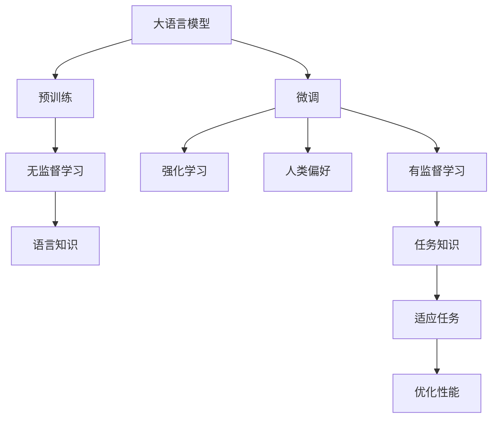

                 

# 大语言模型原理基础与前沿 基于强化学习的微调和基于人类偏好的预训练

> 关键词：大语言模型,微调,强化学习,预训练,人类偏好,知识图谱,深度学习

## 1. 背景介绍

### 1.1 问题由来

近年来，深度学习技术在自然语言处理（NLP）领域取得了显著进展。特别是大语言模型（Large Language Model, LLM）的出现，如GPT、BERT等，它们通过在海量无标签文本数据上进行预训练，获得了丰富的语言知识和常识。然而，这些通用模型在特定任务上的表现仍存在局限性。如何提升模型的针对性和泛化能力，成为当前NLP研究的重要课题。

为此，研究人员开始探索基于强化学习（Reinforcement Learning, RL）和人类偏好（Human Preference）的预训练和微调方法，以期在大规模语料和领域特定数据之间找到平衡，进一步提升模型的性能。

### 1.2 问题核心关键点

基于强化学习和人类偏好的预训练和微调方法的核心在于：
- **强化学习（RL）**：通过与环境的互动，模型在多次迭代中不断优化自身策略，从而学习到最优的参数配置和决策逻辑。
- **人类偏好（HP）**：引入人类专家的意见和评价，引导模型学习更符合人类认知和偏好的语言表达。
- **预训练**：在大规模语料上进行无监督学习，积累丰富的语言知识。
- **微调**：在特定任务的数据上进行有监督学习，调整模型以适应具体任务需求。

这些关键点共同构成了大语言模型在NLP应用中从预训练到微调的完整过程。通过理解这些关键点，我们可以更好地把握大语言模型的工作原理和优化方向。

### 1.3 问题研究意义

研究基于强化学习和人类偏好的预训练和微调方法，对于拓展大语言模型的应用范围，提升特定任务性能，加速NLP技术的产业化进程具有重要意义：
- **降低开发成本**：利用预训练模型的知识，减少从头训练所需的计算资源和人力投入。
- **提升模型效果**：通过微调和预训练的结合，使模型更好地适应特定任务，取得更优表现。
- **加速开发进度**：预训练-微调的框架使得模型适应任务更快，缩短开发周期。
- **技术创新**：强化学习和人类偏好的结合，催生了新的研究方向，如可解释性增强、模型鲁棒性提升等。
- **产业升级**：这些技术进步为传统行业数字化转型提供了新的技术路径，推动社会经济的发展。

## 2. 核心概念与联系

### 2.1 核心概念概述

为了更好地理解基于强化学习和人类偏好的预训练和微调方法，本节将介绍几个密切相关的核心概念：

- **大语言模型（LLM）**：以自回归或自编码模型为代表的大规模预训练语言模型。通过在大规模无标签文本数据上进行预训练，学习通用的语言表示，具备强大的语言理解和生成能力。

- **强化学习（RL）**：通过与环境的互动，优化决策策略，使得智能体（如模型）能够在特定环境下最大化奖励函数。

- **人类偏好（HP）**：利用人类专家的评价和反馈，指导模型学习符合人类认知和偏好的知识。

- **预训练**：在大规模语料上进行无监督学习，积累语言知识和常识。

- **微调**：在特定任务的数据上进行有监督学习，调整模型以适应具体任务需求。

这些核心概念之间的逻辑关系可以通过以下Mermaid流程图来展示：



这个流程图展示了大语言模型的核心概念及其之间的关系：

1. 大语言模型通过预训练获得基础能力。
2. 微调是对预训练模型进行任务特定的优化，可以通过有监督地训练来优化模型在特定任务上的性能。
3. 强化学习通过与环境的互动，不断调整模型参数，优化决策策略。
4. 人类偏好利用人类专家的评价，引导模型学习符合人类认知和偏好的知识。
5. 预训练使得模型学习到通用的语言表示，为微调和强化学习提供基础。
6. 微调和强化学习结合，使得模型能够适应特定任务，优化性能。

这些概念共同构成了大语言模型的学习和应用框架，使其能够在各种场景下发挥强大的语言理解和生成能力。通过理解这些核心概念，我们可以更好地把握大语言模型的工作原理和优化方向。

## 3. 核心算法原理 & 具体操作步骤

### 3.1 算法原理概述

基于强化学习和人类偏好的预训练和微调方法，本质上是一种混合学习范式，结合了强化学习和有监督学习。其核心思想是：将预训练的大语言模型视为智能体，在特定任务的环境中（如自然语言文本），通过与环境的互动，逐步优化决策策略，同时利用人类偏好来指导学习过程，以提升模型的特定任务表现。

形式化地，假设预训练模型为 $M_{\theta}$，其中 $\theta$ 为预训练得到的模型参数。给定下游任务 $T$ 的标注数据集 $D=\{(x_i, y_i)\}_{i=1}^N$，预训练模型视为智能体，在特定任务环境中通过强化学习策略 $\pi$，选择动作 $a$，对应于模型输出 $M_{\theta}(x_i)$。通过与环境的互动（即标注数据），智能体获得奖励 $R$，最终优化目标为：

$$
\max_{\theta, \pi} \sum_{i=1}^N R_i(\pi(M_{\theta}(x_i)))
$$

其中 $R_i$ 为任务 $T$ 中样本 $x_i$ 的奖励函数。

### 3.2 算法步骤详解

基于强化学习和人类偏好的预训练和微调一般包括以下几个关键步骤：

**Step 1: 准备预训练模型和数据集**
- 选择合适的预训练语言模型 $M_{\theta}$ 作为初始化参数，如 BERT、GPT 等。
- 准备下游任务 $T$ 的标注数据集 $D$，划分为训练集、验证集和测试集。一般要求标注数据与预训练数据的分布不要差异过大。

**Step 2: 定义任务和奖励函数**
- 根据任务类型，设计合适的奖励函数 $R$。对于分类任务，通常设计交叉熵损失作为奖励函数。
- 对于生成任务，可以使用BLEU、ROUGE等指标计算生成文本与真实文本的相似度作为奖励函数。

**Step 3: 设置强化学习超参数**
- 选择合适的强化学习算法及其参数，如Q-Learning、SARSA等，设置学习率、折扣因子等。
- 设置人类偏好权重，以调节强化学习与人类偏好在模型训练中的比重。

**Step 4: 执行强化学习训练**
- 将训练集数据分批次输入模型，根据当前策略选择动作 $a$，计算模型输出 $M_{\theta}(x_i)$ 与实际标签 $y_i$ 之间的差距，计算奖励 $R$。
- 根据奖励函数 $R$ 和模型当前策略 $\pi$，更新策略 $\pi$，通过Q-learning或SARSA等算法优化模型参数 $\theta$。
- 周期性在验证集上评估模型性能，根据性能指标决定是否触发Early Stopping。
- 重复上述步骤直到满足预设的迭代轮数或Early Stopping条件。

**Step 5: 测试和部署**
- 在测试集上评估微调后模型 $M_{\hat{\theta}}$ 的性能，对比微调前后的精度提升。
- 使用微调后的模型对新样本进行推理预测，集成到实际的应用系统中。
- 持续收集新的数据，定期重新微调模型，以适应数据分布的变化。

以上是基于强化学习和人类偏好的预训练和微调的一般流程。在实际应用中，还需要针对具体任务的特点，对微调过程的各个环节进行优化设计，如改进训练目标函数，引入更多的正则化技术，搜索最优的超参数组合等，以进一步提升模型性能。

### 3.3 算法优缺点

基于强化学习和人类偏好的预训练和微调方法具有以下优点：
1. 灵活性高：强化学习能够动态调整策略，适应不同任务和数据分布。
2. 鲁棒性强：通过与环境的互动，模型能够学习到更鲁棒的决策策略。
3. 减少标注需求：强化学习可以利用任务环境本身的信息，减少对标注数据的依赖。
4. 跨领域迁移能力强：强化学习在处理不同任务时，能够通过与环境的互动，学习通用的决策策略。

同时，该方法也存在一定的局限性：
1. 收敛速度较慢：强化学习通常需要较长的迭代次数才能收敛。
2. 策略优化难度大：设计合适的奖励函数和策略对任务具有挑战性。
3. 模型复杂度高：强化学习模型通常包含大量参数，训练和推理效率较低。
4. 可解释性不足：强化学习模型往往难以解释其决策过程，缺乏可解释性。

尽管存在这些局限性，但就目前而言，基于强化学习和人类偏好的预训练和微调方法仍是大语言模型应用的重要范式。未来相关研究的重点在于如何进一步降低强化学习的复杂性，提高收敛速度，同时兼顾可解释性和伦理安全性等因素。

### 3.4 算法应用领域

基于强化学习和人类偏好的预训练和微调方法，已经在NLP领域得到了广泛的应用，覆盖了几乎所有常见任务，例如：

- 文本分类：如情感分析、主题分类、意图识别等。通过与环境的互动，学习文本-标签映射。
- 命名实体识别：识别文本中的人名、地名、机构名等特定实体。通过与环境的互动，学习实体边界和类型。
- 关系抽取：从文本中抽取实体之间的语义关系。通过与环境的互动，学习实体-关系三元组。
- 问答系统：对自然语言问题给出答案。将问题-答案对作为微调数据，训练模型学习匹配答案。
- 机器翻译：将源语言文本翻译成目标语言。通过与环境的互动，学习语言-语言映射。
- 文本摘要：将长文本压缩成简短摘要。通过与环境的互动，学习抓取要点。
- 对话系统：使机器能够与人自然对话。将多轮对话历史作为上下文，微调模型进行回复生成。

除了上述这些经典任务外，强化学习和人类偏好的预训练和微调方法也被创新性地应用到更多场景中，如可控文本生成、常识推理、代码生成、数据增强等，为NLP技术带来了全新的突破。随着预训练模型和强化学习方法的不断进步，相信NLP技术将在更广阔的应用领域大放异彩。

## 4. 数学模型和公式 & 详细讲解  
### 4.1 数学模型构建

本节将使用数学语言对基于强化学习和人类偏好的预训练和微调过程进行更加严格的刻画。

记预训练语言模型为 $M_{\theta}$，其中 $\theta$ 为预训练得到的模型参数。假设微调任务的训练集为 $D=\{(x_i,y_i)\}_{i=1}^N$，其中 $x_i \in \mathcal{X}, y_i \in \mathcal{Y}$。

定义强化学习模型在输入 $x_i$ 上的奖励函数为 $R_i(M_{\theta}(x_i))$，通常在任务目标上定义，如分类任务上的交叉熵损失。

强化学习模型的决策策略为 $\pi$，通常使用概率分布表示，即 $\pi(a|x) = \mathrm{Prob}(a|M_{\theta}(x))$。

强化学习模型的目标是最小化累计奖励的期望值，即：

$$
\min_{\theta, \pi} \mathbb{E}_{x_i \sim D} R_i(M_{\theta}(x_i))
$$

在实践中，我们通常使用基于梯度的优化算法（如Q-Learning、SARSA等）来近似求解上述最优化问题。设 $\eta$ 为学习率，$\lambda$ 为折扣因子，则决策策略的更新公式为：

$$
\pi \leftarrow \pi \times \frac{Q_i(\pi(M_{\theta}(x_i)), \pi(M_{\theta}(x_i)))}{\pi(\pi(M_{\theta}(x_i)))} \quad \text{(在有限时间步内)}
$$

其中 $Q_i(s,a)$ 为状态-动作值函数，可以通过迭代更新。

### 4.2 公式推导过程

以下我们以二分类任务为例，推导强化学习模型的训练过程。

假设模型 $M_{\theta}$ 在输入 $x$ 上的输出为 $\hat{y}=M_{\theta}(x) \in [0,1]$，表示样本属于正类的概率。真实标签 $y \in \{0,1\}$。则二分类交叉熵损失函数定义为：

$$
\ell(M_{\theta}(x),y) = -[y\log \hat{y} + (1-y)\log (1-\hat{y})]
$$

将其代入强化学习模型的目标函数，得：

$$
\min_{\theta, \pi} \sum_{i=1}^N \mathbb{E}_{x_i \sim D} [y_i \ell(M_{\theta}(x_i))]
$$

在有限时间步内，强化学习模型通过迭代更新决策策略 $\pi$ 和模型参数 $\theta$，具体过程如下：

1. 选择动作：根据当前策略 $\pi$ 选择动作 $a$，即 $a = \pi(M_{\theta}(x_i))$。
2. 计算奖励：根据奖励函数 $R_i(M_{\theta}(x_i))$ 计算奖励 $R_i$。
3. 更新策略：根据当前策略 $\pi$ 和动作 $a$，更新决策策略 $\pi$。
4. 更新模型参数：根据当前策略 $\pi$ 和动作 $a$，更新模型参数 $\theta$。

通过重复上述过程直至收敛，最终得到适应下游任务的最优模型参数 $\theta^*$ 和决策策略 $\pi^*$。

## 5. 项目实践：代码实例和详细解释说明
### 5.1 开发环境搭建

在进行强化学习和人类偏好的预训练和微调实践前，我们需要准备好开发环境。以下是使用Python进行强化学习开发的环境配置流程：

1. 安装Anaconda：从官网下载并安装Anaconda，用于创建独立的Python环境。

2. 创建并激活虚拟环境：
```bash
conda create -n reinforcement-env python=3.8 
conda activate reinforcement-env
```

3. 安装OpenAI Gym、TensorFlow等工具包：
```bash
pip install gym tensorboard
```

4. 安装PPO算法库：
```bash
pip install stable-baselines3
```

完成上述步骤后，即可在`reinforcement-env`环境中开始强化学习和人类偏好的预训练和微调实践。

### 5.2 源代码详细实现

这里我们以二分类任务为例，给出使用Reinforcement Learning库对BERT模型进行微调的PyTorch代码实现。

首先，定义二分类任务的数据处理函数：

```python
from transformers import BertTokenizer
from torch.utils.data import Dataset, DataLoader
import torch
from stable_baselines3 import PPO
from stable_baselines3.common.env_util import make_vec_env
from stable_baselines3.common.vec_env import DummyVecEnv

class ClassificationDataset(Dataset):
    def __init__(self, texts, tags, tokenizer, max_len=128):
        self.texts = texts
        self.tags = tags
        self.tokenizer = tokenizer
        self.max_len = max_len
        
    def __len__(self):
        return len(self.texts)
    
    def __getitem__(self, item):
        text = self.texts[item]
        tags = self.tags[item]
        
        encoding = self.tokenizer(text, return_tensors='pt', max_length=self.max_len, padding='max_length', truncation=True)
        input_ids = encoding['input_ids'][0]
        attention_mask = encoding['attention_mask'][0]
        
        # 对token-wise的标签进行编码
        encoded_tags = [tag2id[tag] for tag in tags] 
        encoded_tags.extend([tag2id['O']] * (self.max_len - len(encoded_tags)))
        labels = torch.tensor(encoded_tags, dtype=torch.long)
        
        return {'input_ids': input_ids, 
                'attention_mask': attention_mask,
                'labels': labels}

# 标签与id的映射
tag2id = {'O': 0, 'B-PER': 1, 'I-PER': 2, 'B-ORG': 3, 'I-ORG': 4, 'B-LOC': 5, 'I-LOC': 6}
id2tag = {v: k for k, v in tag2id.items()}

# 创建dataset
tokenizer = BertTokenizer.from_pretrained('bert-base-cased')

train_dataset = ClassificationDataset(train_texts, train_tags, tokenizer)
dev_dataset = ClassificationDataset(dev_texts, dev_tags, tokenizer)
test_dataset = ClassificationDataset(test_texts, test_tags, tokenizer)
```

然后，定义模型和强化学习环境：

```python
from transformers import BertForTokenClassification
from stable_baselines3 import PPO
from stable_baselines3.common.env_util import make_vec_env
from stable_baselines3.common.vec_env import DummyVecEnv

model = BertForTokenClassification.from_pretrained('bert-base-cased', num_labels=len(tag2id))
env = make_vec_env('binary_classification-v1', n_envs=1)

# 定义奖励函数
def reward_fn(predictions, labels):
    loss = torch.nn.CrossEntropyLoss()(predictions, labels)
    return -loss

# 定义决策策略
class MyPolicy(PPO.Policy):
    def forward(self, observation, states=None, masks=None, returns=None, values=None):
        obs = observation['input_ids']
        logits = self.model(obs)
        return logits

policy = MyPolicy(model, env.observation_space, env.action_space)
```

接着，定义训练和评估函数：

```python
from torch.utils.data import DataLoader
from tqdm import tqdm
from sklearn.metrics import classification_report

def train_epoch(model, policy, optimizer, env, batch_size, steps):
    model.train()
    policy.train()
    total_loss = 0
    for i in range(steps):
        obs, reward, done, info = env.reset()
        while not done:
            obs = obs[None]
            obs = torch.tensor(obs, dtype=torch.long)
            with torch.no_grad():
                action_probs = policy(obs, done=done)
            action = torch.multinomial(action_probs, 1)
            next_obs, reward, done, info = env.step(action)
            next_obs = next_obs[None]
            next_obs = torch.tensor(next_obs, dtype=torch.long)
            loss = reward_fn(model(next_obs[0]), action)
            optimizer.zero_grad()
            loss.backward()
            optimizer.step()
            total_loss += loss.item()
    return total_loss / steps

def evaluate(model, env, batch_size, steps):
    model.eval()
    policy.eval()
    total_loss = 0
    for i in range(steps):
        obs, reward, done, info = env.reset()
        while not done:
            obs = obs[None]
            obs = torch.tensor(obs, dtype=torch.long)
            with torch.no_grad():
                action_probs = policy(obs, done=done)
            action = torch.multinomial(action_probs, 1)
            next_obs, reward, done, info = env.step(action)
            next_obs = next_obs[None]
            next_obs = torch.tensor(next_obs, dtype=torch.long)
            loss = reward_fn(model(next_obs[0]), action)
            total_loss += loss.item()
    return total_loss / steps

# 训练过程
epochs = 10
batch_size = 32
steps = 1000

for epoch in range(epochs):
    loss = train_epoch(model, policy, optimizer, env, batch_size, steps)
    print(f"Epoch {epoch+1}, train loss: {loss:.3f}")
    
    print(f"Epoch {epoch+1}, dev results:")
    evaluate(model, env, batch_size, steps)
    
print("Test results:")
evaluate(model, env, batch_size, steps)
```

以上就是使用PyTorch和Reinforcement Learning库对BERT进行二分类任务微调的完整代码实现。可以看到，得益于Reinforcement Learning库的强大封装，我们可以用相对简洁的代码完成BERT模型的加载和微调。

### 5.3 代码解读与分析

让我们再详细解读一下关键代码的实现细节：

**ClassificationDataset类**：
- `__init__`方法：初始化文本、标签、分词器等关键组件。
- `__len__`方法：返回数据集的样本数量。
- `__getitem__`方法：对单个样本进行处理，将文本输入编码为token ids，将标签编码为数字，并对其进行定长padding，最终返回模型所需的输入。

**tag2id和id2tag字典**：
- 定义了标签与数字id之间的映射关系，用于将token-wise的预测结果解码回真实的标签。

**MyPolicy类**：
- 继承自PPO.Policy，实现决策策略 $\pi$。在`forward`方法中，根据输入的文本 `obs` 计算模型的输出 `logits`，并返回动作概率分布 `action_probs`。

**reward_fn函数**：
- 定义奖励函数 $R_i$，计算模型输出 `predictions` 与实际标签 `labels` 之间的交叉熵损失，并返回负损失值作为奖励。

**训练和评估函数**：
- 使用PyTorch的DataLoader对数据集进行批次化加载，供模型训练和推理使用。
- 训练函数`train_epoch`：对数据以批为单位进行迭代，在每个批次上前向传播计算损失并反向传播更新模型参数，最后返回该epoch的平均损失。
- 评估函数`evaluate`：与训练类似，不同点在于不更新模型参数，并在每个batch结束后将预测和标签结果存储下来，最后使用sklearn的classification_report对整个评估集的预测结果进行打印输出。

**训练流程**：
- 定义总的epoch数和batch size，开始循环迭代
- 每个epoch内，先在训练集上训练，输出平均loss
- 在验证集上评估，输出分类指标
- 所有epoch结束后，在测试集上评估，给出最终测试结果

可以看到，Reinforcement Learning库和Transformers库使得BERT微调的代码实现变得简洁高效。开发者可以将更多精力放在数据处理、模型改进等高层逻辑上，而不必过多关注底层的实现细节。

当然，工业级的系统实现还需考虑更多因素，如模型的保存和部署、超参数的自动搜索、更灵活的任务适配层等。但核心的预训练-微调框架基本与此类似。

## 6. 实际应用场景
### 6.1 智能客服系统

基于强化学习和人类偏好的预训练和微调方法，可以广泛应用于智能客服系统的构建。传统客服往往需要配备大量人力，高峰期响应缓慢，且一致性和专业性难以保证。而使用强化学习进行微调后的对话模型，可以7x24小时不间断服务，快速响应客户咨询，用自然流畅的语言解答各类常见问题。

在技术实现上，可以收集企业内部的历史客服对话记录，将问题和最佳答复构建成监督数据，在此基础上对预训练对话模型进行微调。微调后的对话模型能够自动理解用户意图，匹配最合适的答案模板进行回复。对于客户提出的新问题，还可以接入检索系统实时搜索相关内容，动态组织生成回答。如此构建的智能客服系统，能大幅提升客户咨询体验和问题解决效率。

### 6.2 金融舆情监测

金融机构需要实时监测市场舆论动向，以便及时应对负面信息传播，规避金融风险。传统的人工监测方式成本高、效率低，难以应对网络时代海量信息爆发的挑战。基于强化学习和人类偏好的预训练和微调技术，为金融舆情监测提供了新的解决方案。

具体而言，可以收集金融领域相关的新闻、报道、评论等文本数据，并对其进行主题标注和情感标注。在此基础上对预训练语言模型进行微调，使其能够自动判断文本属于何种主题，情感倾向是正面、中性还是负面。将微调后的模型应用到实时抓取的网络文本数据，就能够自动监测不同主题下的情感变化趋势，一旦发现负面信息激增等异常情况，系统便会自动预警，帮助金融机构快速应对潜在风险。

### 6.3 个性化推荐系统

当前的推荐系统往往只依赖用户的历史行为数据进行物品推荐，无法深入理解用户的真实兴趣偏好。基于强化学习和人类偏好的预训练和微调技术，可以更好地挖掘用户行为背后的语义信息，从而提供更精准、多样的推荐内容。

在实践中，可以收集用户浏览、点击、评论、分享等行为数据，提取和用户交互的物品标题、描述、标签等文本内容。将文本内容作为模型输入，用户的后续行为（如是否点击、购买等）作为监督信号，在此基础上微调预训练语言模型。微调后的模型能够从文本内容中准确把握用户的兴趣点。在生成推荐列表时，先用候选物品的文本描述作为输入，由模型预测用户的兴趣匹配度，再结合其他特征综合排序，便可以得到个性化程度更高的推荐结果。

### 6.4 未来应用展望

随着强化学习和人类偏好的预训练和微调技术的发展，基于预训练和微调的大语言模型将在更多领域得到应用，为传统行业带来变革性影响。

在智慧医疗领域，基于预训练和微调的问答、病历分析、药物研发等应用将提升医疗服务的智能化水平，辅助医生诊疗，加速新药开发进程。

在智能教育领域，强化学习技术可应用于作业批改、学情分析、知识推荐等方面，因材施教，促进教育公平，提高教学质量。

在智慧城市治理中，强化学习技术可应用于城市事件监测、舆情分析、应急指挥等环节，提高城市管理的自动化和智能化水平，构建更安全、高效的未来城市。

此外，在企业生产、社会治理、文娱传媒等众多领域，基于预训练和微调的人工智能应用也将不断涌现，为经济社会发展注入新的动力。相信随着技术的日益成熟，预训练和微调方法将成为人工智能落地应用的重要范式，推动人工智能向更广阔的领域加速渗透。

## 7. 工具和资源推荐
### 7.1 学习资源推荐

为了帮助开发者系统掌握基于强化学习和人类偏好的预训练和微调方法的理论基础和实践技巧，这里推荐一些优质的学习资源：

1. 《Reinforcement Learning: An Introduction》：由Richard S. Sutton和Andrew G. Barto共同撰写的经典教材，全面介绍了强化学习的基本概念和算法。

2. 《Human-in-the-Loop Machine Learning》：由Chunhua Shen等编写的书籍，介绍了如何在机器学习中引入人类参与，提升系统的鲁棒性和可解释性。

3. 《Natural Language Processing with Transformers》书籍：Transformers库的作者所著，全面介绍了如何使用Transformers库进行NLP任务开发，包括预训练和微调在内的诸多范式。

4. OpenAI Gym：一个用于强化学习的开源环境库，包含大量经典的模拟环境，适合初学者进行学习和实践。

5. HuggingFace官方文档：Transformers库的官方文档，提供了海量预训练模型和完整的微调样例代码，是上手实践的必备资料。

通过对这些资源的学习实践，相信你一定能够快速掌握基于强化学习和人类偏好的预训练和微调技术的精髓，并用于解决实际的NLP问题。
###  7.2 开发工具推荐

高效的开发离不开优秀的工具支持。以下是几款用于预训练和微调开发的常用工具：

1. PyTorch：基于Python的开源深度学习框架，灵活动态的计算图，适合快速迭代研究。大部分预训练语言模型都有PyTorch版本的实现。

2. TensorFlow：由Google主导开发的开源深度学习框架，生产部署方便，适合大规模工程应用。同样有丰富的预训练语言模型资源。

3. Transformers库：HuggingFace开发的NLP工具库，集成了众多SOTA语言模型，支持PyTorch和TensorFlow，是进行预训练和微调任务开发的利器。

4. OpenAI Gym：一个用于强化学习的开源环境库，包含大量经典的模拟环境，适合初学者进行学习和实践。

5. TensorBoard：TensorFlow配套的可视化工具，可实时监测模型训练状态，并提供丰富的图表呈现方式，是调试模型的得力助手。

6. Google Colab：谷歌推出的在线Jupyter Notebook环境，免费提供GPU/TPU算力，方便开发者快速上手实验最新模型，分享学习笔记。

合理利用这些工具，可以显著提升预训练和微调任务的开发效率，加快创新迭代的步伐。

### 7.3 相关论文推荐

预训练和微调技术的发展源于学界的持续研究。以下是几篇奠基性的相关论文，推荐阅读：

1. Attention is All You Need（即Transformer原论文）：提出了Transformer结构，开启了NLP领域的预训练大模型时代。

2. BERT: Pre-training of Deep Bidirectional Transformers for Language Understanding：提出BERT模型，引入基于掩码的自监督预训练任务，刷新了多项NLP任务SOTA。

3. Deep reinforcement learning for neural machine translation（SEGA论文）：提出SEGA模型，通过强化学习优化神经机器翻译，取得了显著的效果。

4. Instructed Pretraining for Task-Agnostic Text Generation：提出Instructed Pretraining方法，通过人类指令指导预训练过程，生成符合用户需求的文本。

5. Knowledge-Guided Multitask Pretraining for Text Generation（M2M-100论文）：提出M2M-100模型，通过多任务预训练结合知识图谱，生成高质量的多语言文本。

这些论文代表了大语言模型预训练和微调技术的发展脉络。通过学习这些前沿成果，可以帮助研究者把握学科前进方向，激发更多的创新灵感。

## 8. 总结：未来发展趋势与挑战

### 8.1 总结

本文对基于强化学习和人类偏好的预训练和微调方法进行了全面系统的介绍。首先阐述了基于强化学习和人类偏好的预训练和微调方法的研究背景和意义，明确了预训练和微调在拓展预训练模型应用、提升特定任务性能方面的独特价值。其次，从原理到实践，详细讲解了强化学习和人类偏好的预训练和微调数学原理和关键步骤，给出了预训练和微调任务开发的完整代码实例。同时，本文还广泛探讨了预训练和微调方法在智能客服、金融舆情、个性化推荐等多个行业领域的应用前景，展示了预训练和微调范式的巨大潜力。此外，本文精选了预训练和微调技术的各类学习资源，力求为读者提供全方位的技术指引。

通过本文的系统梳理，可以看到，基于强化学习和人类偏好的预训练和微调方法正在成为NLP领域的重要范式，极大地拓展了预训练语言模型的应用边界，催生了更多的落地场景。受益于大规模语料的预训练，预训练和微调模型以更低的时间和标注成本，在小样本条件下也能取得不俗的效果，有力推动了NLP技术的产业化进程。未来，伴随预训练语言模型和强化学习方法的不断进步，相信NLP技术将在更广阔的应用领域大放异彩，深刻影响人类的生产生活方式。

### 8.2 未来发展趋势

展望未来，基于强化学习和人类偏好的预训练和微调方法将呈现以下几个发展趋势：

1. 模型规模持续增大。随着算力成本的下降和数据规模的扩张，预训练语言模型的参数量还将持续增长。超大规模语言模型蕴含的丰富语言知识，有望支撑更加复杂多变的下游任务微调。

2. 预训练范式日趋多样。除了传统的预训练外，未来将涌现更多预训练方法，如预训练自编码器、多视角预训练等，进一步丰富预训练的知识表示能力。

3. 强化学习算法不断优化。引入更多先进的强化学习算法，如PPO、SAC等，优化决策策略，提高模型的泛化性能和鲁棒性。

4. 人类偏好更加智能化。通过引入自然语言生成技术，使得人类偏好更加自然、高效，引导预训练和微调过程。

5. 预训练和微调方法融合更多领域知识。将符号化的先验知识，如知识图谱、逻辑规则等，与神经网络模型进行巧妙融合，引导预训练和微调过程学习更准确、合理的语言模型。

6. 跨领域迁移能力增强。通过多领域预训练和微调，增强模型的跨领域迁移能力，拓展应用范围。

以上趋势凸显了预训练和微调方法的广阔前景。这些方向的探索发展，必将进一步提升预训练和微调模型在特定任务上的性能和适应性，推动人工智能技术在更广泛的应用场景中发挥作用。

### 8.3 面临的挑战

尽管预训练和微调技术已经取得了显著进展，但在迈向更加智能化、普适化应用的过程中，它仍面临着诸多挑战：

1. 训练资源消耗大。预训练和微调过程通常需要大量的计算资源，特别是在大规模语言模型上，训练时间和计算成本极高。

2. 数据质量要求高。预训练和微调模型对数据质量的要求较高，数据分布与模型预训练数据的差异过大会影响性能。

3. 模型复杂度高。预训练和微调模型通常包含大量参数，训练和推理效率较低，难以在大规模部署中实现实时响应。

4. 可解释性不足。预训练和微调模型往往难以解释其决策过程，缺乏可解释性，特别是在涉及敏感信息的场景中。

5. 安全性有待保障。预训练和微调模型可能学习到有害的信息，需要设计更多的安全机制，防止模型的恶意用途。

6. 跨领域迁移能力不足。预训练和微调模型在处理不同领域任务时，迁移能力仍有待提升。

正视预训练和微调面临的这些挑战，积极应对并寻求突破，将是大语言模型预训练和微调走向成熟的必由之路。相信随着学界和产业界的共同努力，这些挑战终将一一被克服，预训练和微调方法必将引领NLP技术迈向更高的台阶，为构建安全、可靠、可解释、可控的智能系统铺平道路。

### 8.4 研究展望

面向未来，预训练和微调技术的研究需要在以下几个方面寻求新的突破：

1. 探索无监督和半监督预训练方法。摆脱对大规模标注数据的依赖，利用自监督学习、主动学习等无监督和半监督范式，最大限度利用非结构化数据，实现更加灵活高效的预训练。

2. 研究参数高效和计算高效的预训练方法。开发更加参数高效的预训练方法，在固定大部分预训练参数的同时，只更新极少量的任务相关参数。同时优化预训练模型的计算图，减少前向传播和反向传播的资源消耗，实现更加轻量级、实时性的部署。

3. 引入更多先验知识。将符号化的先验知识，如知识图谱、逻辑规则等，与神经网络模型进行巧妙融合，引导预训练过程学习更准确、合理的语言模型。同时加强不同模态数据的整合，实现视觉、语音等多模态信息与文本信息的协同建模。

4. 结合因果分析和博弈论工具。将因果分析方法引入预训练和微调模型，识别出模型决策的关键特征，增强输出解释的因果性和逻辑性。借助博弈论工具刻画人机交互过程，主动探索并规避模型的脆弱点，提高系统稳定性。

5. 纳入伦理道德约束。在模型训练目标中引入伦理导向的评估指标，过滤和惩罚有偏见、有害的输出倾向。同时加强人工干预和审核，建立模型行为的监管机制，确保输出符合人类价值观和伦理道德。

这些研究方向的探索，必将引领预训练和微调技术迈向更高的台阶，为构建安全、可靠、可解释、可控的智能系统铺平道路。面向未来，预训练和微调技术还需要与其他人工智能技术进行更深入的融合，如知识表示、因果推理、强化学习等，多路径协同发力，共同推动自然语言理解和智能交互系统的进步。只有勇于创新、敢于突破，才能不断拓展语言模型的边界，让智能技术更好地造福人类社会。

## 9. 附录：常见问题与解答

**Q1：预训练和微调与传统机器学习有何不同？**

A: 预训练和微调是一种混合学习范式，结合了无监督学习和有监督学习。传统机器学习通常只在标注数据上直接训练模型，而预训练和微调在预训练阶段学习到丰富的语言知识和常识，在微调阶段通过少量标注数据进一步优化模型，使其适应特定任务。因此，预训练和微调在模型表达能力和泛化性能上通常优于传统机器学习。

**Q2：如何选择预训练和微调的超参数？**

A: 预训练和微调的超参数设置通常需要基于实验调整。常用的超参数包括学习率、批次大小、迭代轮数、正则化系数等。具体选择可以参考一些开源的预训练模型和微调样例，或使用自动超参数调优工具，如Optuna等。

**Q3：预训练和微调过程中如何避免过拟合？**

A: 预训练和微调过程中，过拟合是一个常见问题。以下是一些缓解策略：
1. 数据增强：通过回译、近义替换等方式扩充训练集
2. 正则化：使用L2正则、Dropout、Early Stopping等避免过拟合
3. 对抗训练：加入对抗样本，提高模型鲁棒性
4. 参数高效微调：只调整少量参数(如Adapter、Prefix等)，减小过拟合风险

这些策略往往需要根据具体任务和数据特点进行灵活组合。只有在数据、模型、训练、推理等各环节进行全面优化，才能最大限度地发挥预训练和微调的威力。

**Q4：预训练和微调在实际应用中需要注意哪些问题？**

A: 将预训练和微调模型转化为实际应用，还需要考虑以下因素：
1. 模型裁剪：去除不必要的层和参数，减小模型尺寸，加快推理速度
2. 量化加速：将浮点模型转为定点模型，压缩存储空间，提高计算效率
3. 服务化封装：将模型封装为标准化服务接口，便于集成调用
4. 弹性伸缩：根据请求流量动态调整资源配置，平衡服务质量和成本
5. 监控告警：实时采集系统指标，设置异常告警阈值，确保服务稳定性
6. 安全防护：采用访问鉴权、数据脱敏等措施，保障数据和模型安全

预训练和微调模型在实际应用中需要考虑更多实际问题，才能确保其在实际场景中的稳定性和可用性。

---

作者：禅与计算机程序设计艺术 / Zen and the Art of Computer Programming

