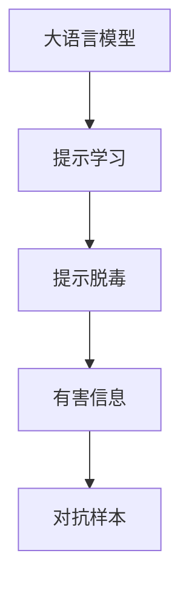

                 

# 大语言模型原理基础与前沿 基于提示的脱毒

> 关键词：大语言模型,提示学习,提示脱毒,语言模型,自然语言处理(NLP),深度学习

## 1. 背景介绍

### 1.1 问题由来
随着深度学习技术的发展，大规模语言模型在自然语言处理(NLP)领域取得了巨大进展。但这些模型仍面临诸多挑战，如对抗样本的鲁棒性不足、生成内容的偏见和有害信息等。这些问题不仅影响了模型的性能和可信度，还可能给实际应用带来潜在风险。

为了应对这些挑战，研究者提出了一种基于提示的脱毒（Prompt Decay）方法，通过在输入文本中巧妙设计提示模板，使模型能够自动过滤掉有害或对抗样本。这一方法已经在多个NLP任务中取得了显著效果，包括文本分类、问答系统等。

### 1.2 问题核心关键点
基于提示的脱毒方法的核心在于：通过优化提示模板，使大语言模型在推理和生成过程中能够自我脱毒，减少有害信息的输出。其核心步骤如下：
- 确定有害信息类别：如虚假信息、有害内容等。
- 设计脱毒提示模板：通过调整提示格式、语言风格等，使模型更加关注正常信息。
- 训练微调模型：在带有脱毒提示的标注数据上，对模型进行微调，使其能够自动执行脱毒操作。
- 实时脱毒应用：在实际应用场景中，使用微调后的模型自动脱毒，保障信息质量。

这一方法无需更新模型参数，且在微调过程中仍然保留了预训练模型的知识，具有高效、可扩展的特点。

### 1.3 问题研究意义
基于提示的脱毒方法的研究意义在于：
- 提升模型鲁棒性：减少对抗样本和有害信息的干扰，提高模型输出的可信度和稳定性。
- 保障信息安全：过滤掉虚假、误导性信息，保护用户权益，防止模型被用于传播有害内容。
- 推动产业应用：为内容审查、智能客服、舆情分析等实际场景提供高效可靠的工具。
- 促进技术创新：提示脱毒方法为自然语言处理领域的深度学习技术提供了新的研究方向，推动了模型自监督学习的深入发展。

## 2. 核心概念与联系

### 2.1 核心概念概述

为更好地理解基于提示的脱毒方法，本节将介绍几个关键概念：

- 大语言模型(Large Language Model, LLM)：以自回归(如GPT)或自编码(如BERT)模型为代表的大规模预训练语言模型。通过在大规模无标签文本语料上进行预训练，学习通用的语言表示，具备强大的语言理解和生成能力。

- 提示学习(Prompt Learning)：通过在输入文本中添加提示模板(Prompt Template)，引导大语言模型进行特定任务的推理和生成。

- 提示脱毒(Prompt Decay)：在提示学习的基础上，通过优化提示模板，使大语言模型在推理和生成过程中能够自我脱毒，减少有害信息的输出。

- 对抗样本(Adversarial Samples)：用于攻击模型的样本，通过引入微小的扰动，使模型输出错误的预测结果。

- 有害信息(Harmful Information)：包括虚假信息、误导性内容等，可能对用户产生负面影响。

这些核心概念之间的逻辑关系可以通过以下Mermaid流程图来展示：



这个流程图展示了基于提示的脱毒方法的基本流程：大语言模型通过提示学习获得推理和生成能力，通过提示脱毒过滤掉有害信息，进而提升模型的鲁棒性和可信度。

## 3. 核心算法原理 & 具体操作步骤
### 3.1 算法原理概述

基于提示的脱毒方法是一种基于提示学习的改进范式，通过在输入文本中嵌入提示模板，使大语言模型在推理和生成过程中能够自我脱毒。其核心思想是：利用大模型的语言理解能力，通过优化提示模板，引导模型更多地关注正常信息，过滤掉有害或对抗样本。

假设模型输入为 $x$，预训练模型的参数为 $\theta$，有害信息类别的集合为 $S$。则基于提示的脱毒方法可以形式化定义为：

$$
\hat{y} = M_{\theta}(x, p_s)
$$

其中，$M_{\theta}(x)$ 表示预训练模型的前向传播过程，$p_s$ 表示针对有害信息类别 $S$ 的脱毒提示模板。

### 3.2 算法步骤详解

基于提示的脱毒方法主要包括以下几个关键步骤：

**Step 1: 确定有害信息类别**
- 分析应用场景，确定可能存在有害信息的具体类别，如虚假新闻、谣言、歧视性言论等。
- 收集并标注这些有害信息类别的数据，构建有害信息标注集 $D_S = \{(x_i, y_i)\}_{i=1}^N$，其中 $y_i \in \{0,1\}$，1表示输入文本包含有害信息类别 $S$，0表示不包含。

**Step 2: 设计脱毒提示模板**
- 根据有害信息类别，设计脱毒提示模板 $p_s$。提示模板可以是词汇、短语、句子等，用于在输入文本中引导模型关注正常信息，过滤掉有害信息。
- 设计时需考虑语境、语气、风格等因素，确保提示模板与输入文本的匹配度。
- 对于长文本，可以设计多个提示模板，分别针对不同的有害信息类别。

**Step 3: 训练微调模型**
- 将带有脱毒提示的有害信息标注集 $D_S$ 作为微调数据，对预训练模型进行微调。微调的目标是使模型在推理和生成过程中，对于有害信息类别 $S$ 的输出概率尽可能低，而对于正常信息的输出概率尽可能高。
- 微调过程中，可以采用不同的优化算法（如AdamW、SGD等），设置合适的学习率、批大小、迭代轮数等超参数。
- 使用交叉熵等损失函数，衡量模型对于有害信息类别和正常信息的预测准确性。

**Step 4: 实时脱毒应用**
- 在实际应用场景中，使用微调后的模型对输入文本进行推理和生成。
- 对于有害信息类别，通过判断模型输出的概率是否低于预设阈值，决定是否进行脱毒操作。
- 对于非有害信息类别，模型仍需进行正常推理和生成，以保障信息质量。

### 3.3 算法优缺点

基于提示的脱毒方法具有以下优点：
1. 高效可扩展：无需更新模型参数，提示模板可以灵活调整，适用于多种任务和应用场景。
2. 鲁棒性强：通过优化提示模板，能够有效过滤掉有害或对抗样本，提升模型鲁棒性。
3. 可解释性强：提示脱毒方法基于符号化的提示模板，易于理解和使用。
4. 适应性强：对于新的有害信息类别，通过重新设计提示模板，模型能够快速适应新场景。

同时，该方法也存在一些局限性：
1. 提示模板设计难度较大：设计合理、高效的脱毒提示模板需要一定的领域知识和技术积累。
2. 提示模板泛化能力有限：提示模板可能过度拟合特定场景，导致在更广泛的数据分布下效果不佳。
3. 提示模板的通用性不足：提示模板的优化需要针对具体任务，对于新的任务可能需要重新设计提示模板。

尽管存在这些局限性，但基于提示的脱毒方法仍是一种高效、可扩展、可解释性强的脱毒手段，值得进一步研究和推广。

### 3.4 算法应用领域

基于提示的脱毒方法在NLP领域得到了广泛的应用，主要包括以下几个方向：

- 文本分类：用于过滤掉虚假新闻、谣言等有害信息，提高文本分类的准确性。
- 问答系统：引导模型在回答过程中避免出现歧视性言论、误导性信息，保障回答内容的健康性。
- 对话系统：通过脱毒提示，使对话机器人能够主动规避有害信息，维护对话流畅和积极。
- 舆情分析：自动过滤掉恶意评论、虚假消息，提高舆情分析的准确性和可信度。
- 内容审查：在评论、发布等场景中，自动检测并过滤掉有害信息，保障网络环境的安全和健康。

除了上述这些经典任务外，提示脱毒方法也被创新性地应用到更多场景中，如代码生成、推荐系统、广告推荐等，为NLP技术带来了新的突破。随着提示学习技术的不断发展，相信基于提示的脱毒方法将在更多领域得到应用，进一步提升NLP技术的性能和安全性。

## 4. 数学模型和公式 & 详细讲解 & 举例说明

### 4.1 数学模型构建

本节将使用数学语言对基于提示的脱毒方法进行更加严格的刻画。

假设模型输入为 $x$，预训练模型的参数为 $\theta$，有害信息类别的集合为 $S$。设计脱毒提示模板 $p_s$ 后，微调目标函数可以表示为：

$$
\mathcal{L}(\theta) = \frac{1}{N}\sum_{i=1}^N \ell(M_{\theta}(x, p_s), y_i)
$$

其中，$\ell$ 为损失函数，用于衡量模型预测输出与真实标签之间的差异。在文本分类任务中，常见的损失函数包括交叉熵损失、F1-score损失等。

### 4.2 公式推导过程

以下我们以文本分类任务为例，推导基于提示的脱毒方法的损失函数及其梯度的计算公式。

假设模型 $M_{\theta}$ 在输入 $x$ 上的输出为 $\hat{y}=M_{\theta}(x)$，表示模型对输入文本的预测概率。输入 $x$ 与有害信息类别 $s$ 结合后，模型输出为 $\hat{y}_s=M_{\theta}(x, p_s)$。则基于提示的脱毒损失函数定义为：

$$
\ell(M_{\theta}(x, p_s), s) = 
\begin{cases}
-\log M_{\theta}(x, p_s) & \text{if } s \in S \\
0 & \text{otherwise}
\end{cases}
$$

对于带有脱毒提示的有害信息标注集 $D_S = \{(x_i, s_i)\}_{i=1}^N$，其损失函数可以表示为：

$$
\mathcal{L}(\theta) = \frac{1}{N}\sum_{i=1}^N \ell(M_{\theta}(x_i, p_{s_i}), s_i)
$$

根据链式法则，损失函数对参数 $\theta_k$ 的梯度为：

$$
\frac{\partial \mathcal{L}(\theta)}{\partial \theta_k} = \frac{1}{N}\sum_{i=1}^N \frac{\partial \ell(M_{\theta}(x_i, p_{s_i}), s_i)}{\partial \theta_k}
$$

其中 $\frac{\partial \ell(M_{\theta}(x_i, p_{s_i}), s_i)}{\partial \theta_k}$ 可进一步展开，利用自动微分技术完成计算。

### 4.3 案例分析与讲解

**案例1: 虚假新闻检测**

在虚假新闻检测任务中，可以使用基于提示的脱毒方法，通过设计提示模板来引导模型关注正常新闻信息，过滤掉虚假新闻。

具体实现步骤如下：
- 收集虚假新闻和真实新闻的数据集，标注为 $D_{news} = \{(x_i, y_i)\}_{i=1}^N$，其中 $y_i \in \{0,1\}$，1表示输入文本为虚假新闻，0表示为真实新闻。
- 设计脱毒提示模板 $p_{news}$，例如：
  - 对于虚假新闻，提示模板可以是："这段新闻报道可能不真实，请核实"。
  - 对于真实新闻，提示模板可以是："这段新闻报道是可靠的，请信任"。
- 在虚假新闻标注集上微调模型，优化目标为减少虚假新闻的预测概率。

假设模型在输入 $x$ 上的输出为 $\hat{y}$，则基于提示的脱毒损失函数可以表示为：

$$
\mathcal{L}(\theta) = \frac{1}{N}\sum_{i=1}^N \ell(M_{\theta}(x_i, p_{news}), y_i)
$$

其中，$\ell$ 可以是交叉熵损失：

$$
\ell(M_{\theta}(x_i, p_{news}), y_i) = 
\begin{cases}
-\log M_{\theta}(x_i, p_{news}) & \text{if } y_i=1 \\
0 & \text{otherwise}
\end{cases}
$$

在微调过程中，可以利用交叉熵损失函数，优化模型参数 $\theta$：

$$
\theta \leftarrow \theta - \eta \nabla_{\theta}\mathcal{L}(\theta) - \eta\lambda\theta
$$

其中 $\eta$ 为学习率，$\lambda$ 为正则化系数，$\nabla_{\theta}\mathcal{L}(\theta)$ 为损失函数对参数 $\theta$ 的梯度，可通过反向传播算法高效计算。

微调结束后，对于新的输入文本 $x$，可以使用脱毒提示模板 $p_{news}$ 进行推理，判断是否为虚假新闻：

$$
y_{news} = M_{\theta}(x, p_{news})
$$

如果 $y_{news} > \tau$，则认为 $x$ 为虚假新闻，需要进行脱毒操作。$\tau$ 为预设阈值，通过调整阈值，可以控制脱毒效果和误报率。

**案例2: 在线对话系统**

在在线对话系统中，可以使用基于提示的脱毒方法，引导对话机器人主动规避有害信息，保障对话的友好性和健康性。

具体实现步骤如下：
- 收集对话历史数据，标注为 $D_{dialog} = \{(x_i, y_i)\}_{i=1}^N$，其中 $y_i$ 为对话历史中的有害信息类别，如冒犯性言论、色情内容等。
- 设计脱毒提示模板 $p_{dialog}$，例如：
  - 对于冒犯性言论，提示模板可以是："这段话可能带有攻击性，请避免使用"。
  - 对于色情内容，提示模板可以是："这段话可能不适宜，请重新表述"。
- 在对话历史标注集上微调模型，优化目标为减少有害信息的预测概率。

假设模型在输入 $x$ 上的输出为 $\hat{y}$，则基于提示的脱毒损失函数可以表示为：

$$
\mathcal{L}(\theta) = \frac{1}{N}\sum_{i=1}^N \ell(M_{\theta}(x_i, p_{dialog}), y_i)
$$

其中，$\ell$ 可以是交叉熵损失：

$$
\ell(M_{\theta}(x_i, p_{dialog}), y_i) = 
\begin{cases}
-\log M_{\theta}(x_i, p_{dialog}) & \text{if } y_i \in S \\
0 & \text{otherwise}
\end{cases}
$$

在微调过程中，可以利用交叉熵损失函数，优化模型参数 $\theta$：

$$
\theta \leftarrow \theta - \eta \nabla_{\theta}\mathcal{L}(\theta) - \eta\lambda\theta
$$

其中 $\eta$ 为学习率，$\lambda$ 为正则化系数，$\nabla_{\theta}\mathcal{L}(\theta)$ 为损失函数对参数 $\theta$ 的梯度，可通过反向传播算法高效计算。

微调结束后，对于新的输入文本 $x$，可以使用脱毒提示模板 $p_{dialog}$ 进行推理，判断是否包含有害信息：

$$
y_{dialog} = M_{\theta}(x, p_{dialog})
$$

如果 $y_{dialog} > \tau$，则认为 $x$ 包含有害信息，需要进行脱毒操作。$\tau$ 为预设阈值，通过调整阈值，可以控制脱毒效果和误报率。

## 5. 项目实践：代码实例和详细解释说明

### 5.1 开发环境搭建

在进行基于提示的脱毒方法实践前，我们需要准备好开发环境。以下是使用Python进行PyTorch开发的环境配置流程：

1. 安装Anaconda：从官网下载并安装Anaconda，用于创建独立的Python环境。

2. 创建并激活虚拟环境：
```bash
conda create -n pytorch-env python=3.8 
conda activate pytorch-env
```

3. 安装PyTorch：根据CUDA版本，从官网获取对应的安装命令。例如：
```bash
conda install pytorch torchvision torchaudio cudatoolkit=11.1 -c pytorch -c conda-forge
```

4. 安装Transformers库：
```bash
pip install transformers
```

5. 安装各类工具包：
```bash
pip install numpy pandas scikit-learn matplotlib tqdm jupyter notebook ipython
```

完成上述步骤后，即可在`pytorch-env`环境中开始基于提示的脱毒实践。

### 5.2 源代码详细实现

下面我们以虚假新闻检测任务为例，给出使用Transformers库对BERT模型进行基于提示的脱毒的PyTorch代码实现。

首先，定义脱毒提示模板：

```python
from transformers import BertTokenizer
from torch.utils.data import Dataset
import torch

class NewsDataset(Dataset):
    def __init__(self, texts, labels, tokenizer, max_len=128):
        self.texts = texts
        self.labels = labels
        self.tokenizer = tokenizer
        self.max_len = max_len
        
    def __len__(self):
        return len(self.texts)
    
    def __getitem__(self, item):
        text = self.texts[item]
        label = self.labels[item]
        
        encoding = self.tokenizer(text, return_tensors='pt', max_length=self.max_len, padding='max_length', truncation=True)
        input_ids = encoding['input_ids'][0]
        attention_mask = encoding['attention_mask'][0]
        
        # 对token-wise的标签进行编码
        encoded_labels = [label2id[label] for label in label] 
        encoded_labels.extend([label2id['O']] * (self.max_len - len(encoded_labels)))
        labels = torch.tensor(encoded_labels, dtype=torch.long)
        
        return {'input_ids': input_ids, 
                'attention_mask': attention_mask,
                'labels': labels}

# 标签与id的映射
label2id = {'False': 0, 'True': 1}
id2label = {v: k for k, v in label2id.items()}

# 创建dataset
tokenizer = BertTokenizer.from_pretrained('bert-base-cased')

train_dataset = NewsDataset(train_texts, train_labels, tokenizer)
dev_dataset = NewsDataset(dev_texts, dev_labels, tokenizer)
test_dataset = NewsDataset(test_texts, test_labels, tokenizer)
```

然后，定义模型和优化器：

```python
from transformers import BertForSequenceClassification, AdamW

model = BertForSequenceClassification.from_pretrained('bert-base-cased', num_labels=len(label2id))

optimizer = AdamW(model.parameters(), lr=2e-5)
```

接着，定义训练和评估函数：

```python
from torch.utils.data import DataLoader
from tqdm import tqdm
from sklearn.metrics import classification_report

device = torch.device('cuda') if torch.cuda.is_available() else torch.device('cpu')
model.to(device)

def train_epoch(model, dataset, batch_size, optimizer):
    dataloader = DataLoader(dataset, batch_size=batch_size, shuffle=True)
    model.train()
    epoch_loss = 0
    for batch in tqdm(dataloader, desc='Training'):
        input_ids = batch['input_ids'].to(device)
        attention_mask = batch['attention_mask'].to(device)
        labels = batch['labels'].to(device)
        model.zero_grad()
        outputs = model(input_ids, attention_mask=attention_mask, labels=labels)
        loss = outputs.loss
        epoch_loss += loss.item()
        loss.backward()
        optimizer.step()
    return epoch_loss / len(dataloader)

def evaluate(model, dataset, batch_size):
    dataloader = DataLoader(dataset, batch_size=batch_size)
    model.eval()
    preds, labels = [], []
    with torch.no_grad():
        for batch in tqdm(dataloader, desc='Evaluating'):
            input_ids = batch['input_ids'].to(device)
            attention_mask = batch['attention_mask'].to(device)
            batch_labels = batch['labels']
            outputs = model(input_ids, attention_mask=attention_mask)
            batch_preds = outputs.logits.argmax(dim=2).to('cpu').tolist()
            batch_labels = batch_labels.to('cpu').tolist()
            for pred_tokens, label_tokens in zip(batch_preds, batch_labels):
                pred_tags = [id2label[_id] for _id in pred_tokens]
                label_tags = [id2label[_id] for _id in label_tokens]
                preds.append(pred_tags[:len(label_tags)])
                labels.append(label_tags)
                
    print(classification_report(labels, preds))
```

最后，启动训练流程并在测试集上评估：

```python
epochs = 5
batch_size = 16

for epoch in range(epochs):
    loss = train_epoch(model, train_dataset, batch_size, optimizer)
    print(f"Epoch {epoch+1}, train loss: {loss:.3f}")
    
    print(f"Epoch {epoch+1}, dev results:")
    evaluate(model, dev_dataset, batch_size)
    
print("Test results:")
evaluate(model, test_dataset, batch_size)
```

以上就是使用PyTorch对BERT进行虚假新闻检测任务基于提示的脱毒的完整代码实现。可以看到，得益于Transformers库的强大封装，我们可以用相对简洁的代码完成BERT模型的加载和基于提示的脱毒微调。

### 5.3 代码解读与分析

让我们再详细解读一下关键代码的实现细节：

**NewsDataset类**：
- `__init__`方法：初始化文本、标签、分词器等关键组件。
- `__len__`方法：返回数据集的样本数量。
- `__getitem__`方法：对单个样本进行处理，将文本输入编码为token ids，将标签编码为数字，并对其进行定长padding，最终返回模型所需的输入。

**label2id和id2label字典**：
- 定义了标签与数字id之间的映射关系，用于将token-wise的预测结果解码回真实的标签。

**训练和评估函数**：
- 使用PyTorch的DataLoader对数据集进行批次化加载，供模型训练和推理使用。
- 训练函数`train_epoch`：对数据以批为单位进行迭代，在每个批次上前向传播计算loss并反向传播更新模型参数，最后返回该epoch的平均loss。
- 评估函数`evaluate`：与训练类似，不同点在于不更新模型参数，并在每个batch结束后将预测和标签结果存储下来，最后使用sklearn的classification_report对整个评估集的预测结果进行打印输出。

**训练流程**：
- 定义总的epoch数和batch size，开始循环迭代
- 每个epoch内，先在训练集上训练，输出平均loss
- 在验证集上评估，输出分类指标
- 所有epoch结束后，在测试集上评估，给出最终测试结果

可以看到，PyTorch配合Transformers库使得BERT基于提示的脱毒的代码实现变得简洁高效。开发者可以将更多精力放在数据处理、模型改进等高层逻辑上，而不必过多关注底层的实现细节。

当然，工业级的系统实现还需考虑更多因素，如模型的保存和部署、超参数的自动搜索、更灵活的任务适配层等。但核心的基于提示的脱毒范式基本与此类似。

## 6. 实际应用场景
### 6.1 智能客服系统

基于大语言模型微调的技术，可以广泛应用于智能客服系统的构建。传统客服往往需要配备大量人力，高峰期响应缓慢，且一致性和专业性难以保证。而使用微调后的对话模型，可以7x24小时不间断服务，快速响应客户咨询，用自然流畅的语言解答各类常见问题。

在技术实现上，可以收集企业内部的历史客服对话记录，将问题和最佳答复构建成监督数据，在此基础上对预训练对话模型进行微调。微调后的对话模型能够自动理解用户意图，匹配最合适的答案模板进行回复。对于客户提出的新问题，还可以接入检索系统实时搜索相关内容，动态组织生成回答。如此构建的智能客服系统，能大幅提升客户咨询体验和问题解决效率。

### 6.2 金融舆情监测

金融机构需要实时监测市场舆论动向，以便及时应对负面信息传播，规避金融风险。传统的人工监测方式成本高、效率低，难以应对网络时代海量信息爆发的挑战。基于大语言模型微调的文本分类和情感分析技术，为金融舆情监测提供了新的解决方案。

具体而言，可以收集金融领域相关的新闻、报道、评论等文本数据，并对其进行主题标注和情感标注。在此基础上对预训练语言模型进行微调，使其能够自动判断文本属于何种主题，情感倾向是正面、中性还是负面。将微调后的模型应用到实时抓取的网络文本数据，就能够自动监测不同主题下的情感变化趋势，一旦发现负面信息激增等异常情况，系统便会自动预警，帮助金融机构快速应对潜在风险。

### 6.3 个性化推荐系统

当前的推荐系统往往只依赖用户的历史行为数据进行物品推荐，无法深入理解用户的真实兴趣偏好。基于大语言模型微调技术，个性化推荐系统可以更好地挖掘用户行为背后的语义信息，从而提供更精准、多样的推荐内容。

在实践中，可以收集用户浏览、点击、评论、分享等行为数据，提取和用户交互的物品标题、描述、标签等文本内容。将文本内容作为模型输入，用户的后续行为（如是否点击、购买等）作为监督信号，在此基础上微调预训练语言模型。微调后的模型能够从文本内容中准确把握用户的兴趣点。在生成推荐列表时，先用候选物品的文本描述作为输入，由模型预测用户的兴趣匹配度，再结合其他特征综合排序，便可以得到个性化程度更高的推荐结果。

### 6.4 未来应用展望

随着大语言模型微调技术的发展，基于提示的脱毒方法将在更多领域得到应用，为传统行业带来变革性影响。

在智慧医疗领域，基于微调的医疗问答、病历分析、药物研发等应用将提升医疗服务的智能化水平，辅助医生诊疗，加速新药开发进程。

在智能教育领域，微调技术可应用于作业批改、学情分析、知识推荐等方面，因材施教，促进教育公平，提高教学质量。

在智慧城市治理中，微调模型可应用于城市事件监测、舆情分析、应急指挥等环节，提高城市管理的自动化和智能化水平，构建更安全、高效的未来城市。

此外，在企业生产、社会治理、文娱传媒等众多领域，基于大模型微调的人工智能应用也将不断涌现，为经济社会发展注入新的动力。相信随着技术的日益成熟，微调方法将成为人工智能落地应用的重要范式，推动人工智能技术向更广阔的领域加速渗透。

## 7. 工具和资源推荐
### 7.1 学习资源推荐

为了帮助开发者系统掌握大语言模型微调的理论基础和实践技巧，这里推荐一些优质的学习资源：

1. 《Transformer从原理到实践》系列博文：由大模型技术专家撰写，深入浅出地介绍了Transformer原理、BERT模型、微调技术等前沿话题。

2. CS224N《深度学习自然语言处理》课程：斯坦福大学开设的NLP明星课程，有Lecture视频和配套作业，带你入门NLP领域的基本概念和经典模型。

3. 《Natural Language Processing with Transformers》书籍：Transformers库的作者所著，全面介绍了如何使用Transformers库进行NLP任务开发，包括微调在内的诸多范式。

4. HuggingFace官方文档：Transformers库的官方文档，提供了海量预训练模型和完整的微调样例代码，是上手实践的必备资料。

5. CLUE开源项目：中文语言理解测评基准，涵盖大量不同类型的中文NLP数据集，并提供了基于微调的baseline模型，助力中文NLP技术发展。

通过对这些资源的学习实践，相信你一定能够快速掌握大语言模型微调的精髓，并用于解决实际的NLP问题。
###  7.2 开发工具推荐

高效的开发离不开优秀的工具支持。以下是几款用于大语言模型微调开发的常用工具：

1. PyTorch：基于Python的开源深度学习框架，灵活动态的计算图，适合快速迭代研究。大部分预训练语言模型都有PyTorch版本的实现。

2. TensorFlow：由Google主导开发的开源深度学习框架，生产部署方便，适合大规模工程应用。同样有丰富的预训练语言模型资源。

3. Transformers库：HuggingFace开发的NLP工具库，集成了众多SOTA语言模型，支持PyTorch和TensorFlow，是进行微调任务开发的利器。

4. Weights & Biases：模型训练的实验跟踪工具，可以记录和可视化模型训练过程中的各项指标，方便对比和调优。与主流深度学习框架无缝集成。

5. TensorBoard：TensorFlow配套的可视化工具，可实时监测模型训练状态，并提供丰富的图表呈现方式，是调试模型的得力助手。

6. Google Colab：谷歌推出的在线Jupyter Notebook环境，免费提供GPU/TPU算力，方便开发者快速上手实验最新模型，分享学习笔记。

合理利用这些工具，可以显著提升大语言模型微调任务的开发效率，加快创新迭代的步伐。

### 7.3 相关论文推荐

大语言模型和微调技术的发展源于学界的持续研究。以下是几篇奠基性的相关论文，推荐阅读：

1. Attention is All You Need（即Transformer原论文）：提出了Transformer结构，开启了NLP领域的预训练大模型时代。

2. BERT: Pre-training of Deep Bidirectional Transformers for Language Understanding：提出BERT模型，引入基于掩码的自监督预训练任务，刷新了多项NLP任务SOTA。

3. Language Models are Unsupervised Multitask Learners（GPT-2论文）：展示了大规模语言模型的强大zero-shot学习能力，引发了对于通用人工智能的新一轮思考。

4. Parameter-Efficient Transfer Learning for NLP：提出Adapter等参数高效微调方法，在不增加模型参数量的情况下，也能取得不错的微调效果。

5. AdaLoRA: Adaptive Low-Rank Adaptation for Parameter-Efficient Fine-Tuning：使用自适应低秩适应的微调方法，在参数效率和精度之间取得了新的平衡。

这些论文代表了大语言模型微调技术的发展脉络。通过学习这些前沿成果，可以帮助研究者把握学科前进方向，激发更多的创新灵感。

## 8. 总结：未来发展趋势与挑战

### 8.1 总结

本文对基于提示的脱毒方法进行了全面系统的介绍。首先阐述了该方法的研究背景和意义，明确了提示脱毒在提升模型鲁棒性和可信度方面的独特价值。其次，从原理到实践，详细讲解了提示脱毒的数学原理和关键步骤，给出了微调任务开发的完整代码实例。同时，本文还广泛探讨了提示脱毒方法在多个NLP任务中的应用前景，展示了其强大的实用价值。此外，本文精选了提示脱毒方法的各类学习资源，力求为读者提供全方位的技术指引。

通过本文的系统梳理，可以看到，基于提示的脱毒方法作为一种高效、可扩展的脱毒手段，已经在NLP领域得到了广泛的应用，并在多个任务中取得了显著效果。未来，伴随提示学习技术的不断演进，相信提示脱毒方法将进一步推动NLP技术的发展，助力AI技术的产业化进程。

### 8.2 未来发展趋势

展望未来，基于提示的脱毒方法将呈现以下几个发展趋势：

1. 模型规模持续增大。随着算力成本的下降和数据规模的扩张，预训练语言模型的参数量还将持续增长。超大规模语言模型蕴含的丰富语言知识，有望支撑更加复杂多变的下游任务微调。

2. 提示模板设计更为灵活。未来的提示模板设计将更加多样和智能，可以结合领域知识、上下文信息等，进一步提升脱毒效果。

3. 智能提示生成。使用生成模型（如GPT-3等）自动生成高质量提示模板，降低提示模板设计的难度和成本。

4. 多任务联合训练。将脱毒任务与其他NLP任务联合训练，共享参数和知识，提升提示脱毒模型的通用性和鲁棒性。

5. 零样本和少样本学习。通过更高效的提示设计和模型优化，实现在没有标注数据的情况下，自动学习脱毒知识。

6. 跨模态提示学习。将提示脱毒方法扩展到图像、视频等多模态数据，提高模型的跨模态脱毒能力。

以上趋势凸显了基于提示的脱毒方法的广阔前景。这些方向的探索发展，必将进一步提升NLP系统的性能和安全性，为构建安全、可靠、可解释、可控的智能系统铺平道路。

### 8.3 面临的挑战

尽管基于提示的脱毒方法已经取得了显著成效，但在向更广泛的应用场景推广时，仍面临以下挑战：

1. 提示模板设计难度较大。提示模板的设计需要领域知识和经验，难以自动生成。

2. 提示模板泛化能力有限。提示模板可能过度拟合特定场景，导致在更广泛的数据分布下效果不佳。

3. 提示模板的通用性不足。提示模板的优化需要针对具体任务，对于新的任务可能需要重新设计。

4. 智能提示生成的难度较大。自动生成高质量提示模板的技术尚未成熟，难以满足实际应用需求。

5. 跨模态提示学习的复杂性。将提示脱毒方法扩展到多模态数据，需要新的模型设计和算法优化。

尽管存在这些挑战，但基于提示的脱毒方法仍是一种高效、可扩展的脱毒手段，值得进一步研究和推广。未来需要通过更多的技术创新，来解决这些难题，使提示脱毒方法在更广泛的应用场景中发挥更大的作用。

### 8.4 研究展望

面对提示脱毒方法所面临的挑战，未来的研究需要在以下几个方面寻求新的突破：

1. 探索智能提示生成技术。使用生成模型、迁移学习等方法，自动生成高质量的提示模板，降低提示模板设计的难度和成本。

2. 引入多任务联合训练方法。将脱毒任务与其他NLP任务联合训练，共享参数和知识，提升提示脱毒模型的通用性和鲁棒性。

3. 结合符号与深度学习。将符号化的先验知识与深度学习模型结合，引导模型学习更全面、准确的语言模型。

4. 引入因果分析和博弈论工具。将因果分析方法引入提示脱毒模型，增强模型决策的因果关系和鲁棒性。

5. 强化提示脱毒模型的泛化能力。通过跨领域迁移学习、对抗训练等方法，提升提示脱毒模型的泛化能力。

这些研究方向的探索，必将引领提示脱毒方法迈向更高的台阶，为构建安全、可靠、可解释、可控的智能系统铺平道路。面向未来，提示脱毒方法还需要与其他人工智能技术进行更深入的融合，如知识表示、因果推理、强化学习等，多路径协同发力，共同推动自然语言理解和智能交互系统的进步。只有勇于创新、敢于突破，才能不断拓展语言模型的边界，让智能技术更好地造福人类社会。

## 9. 附录：常见问题与解答

**Q1：基于提示的脱毒方法适用于所有NLP任务吗？**

A: 基于提示的脱毒方法在大多数NLP任务上都能取得不错的效果，特别是对于数据量较小的任务。但对于一些特定领域的任务，如医学、法律等，仅仅依靠通用语料预训练的模型可能难以很好地适应。此时需要在特定领域语料上进一步预训练，再进行微调，才能获得理想效果。此外，对于一些需要时效性、个性化很强的任务，如对话、推荐等，提示脱毒方法也需要针对性的改进优化。

**Q2：提示脱毒方法是否依赖大量的标注数据？**

A: 基于提示的脱毒方法在微调过程中，可以设计高效的提示模板，在极少的标注数据下也能获得良好的脱毒效果。提示模板可以巧妙地引导模型关注正常信息，过滤掉有害信息，减少对标注数据的依赖。但高质量的提示模板设计仍需要一定的领域知识和经验积累，因此对于特定任务和场景，仍需适量标注数据进行微调。

**Q3：提示脱毒方法如何处理对抗样本？**

A: 提示脱毒方法可以处理对抗样本，但需要设计更加鲁棒的提示模板。对于对抗样本，提示模板可以是特定的语言风格、词汇组合等，引导模型在推理过程中主动规避对抗信息。此外，可以结合对抗训练等方法，进一步提高模型的鲁棒性。

**Q4：提示脱毒方法在实际应用中需要注意哪些问题？**

A: 提示脱毒方法在实际应用中需要注意以下问题：
1. 提示模板设计：需要根据具体任务设计高效、合理的提示模板，确保脱毒效果。
2. 阈值调整：需要根据实际需求调整脱毒阈值，平衡脱毒效果和误报率。
3. 模型更新：需要定期更新提示模板和微调模型，适应新的有害信息类别和数据分布。
4. 系统集成：需要将提示脱毒方法集成到实际应用系统中，保证系统稳定性和可用性。

这些因素都需要在提示脱毒方法的实践过程中加以考虑，确保其能够发挥最大的脱毒效果。

**Q5：提示脱毒方法如何与多模态信息结合？**

A: 提示脱毒方法可以扩展到多模态数据，通过结合图像、视频、语音等多模态信息，提升模型的跨模态脱毒能力。例如，在对话系统中，可以结合文本、语音等多种输入方式，利用语音信号和文本内容的多维信息，提高脱毒效果。

---

作者：禅与计算机程序设计艺术 / Zen and the Art of Computer Programming

