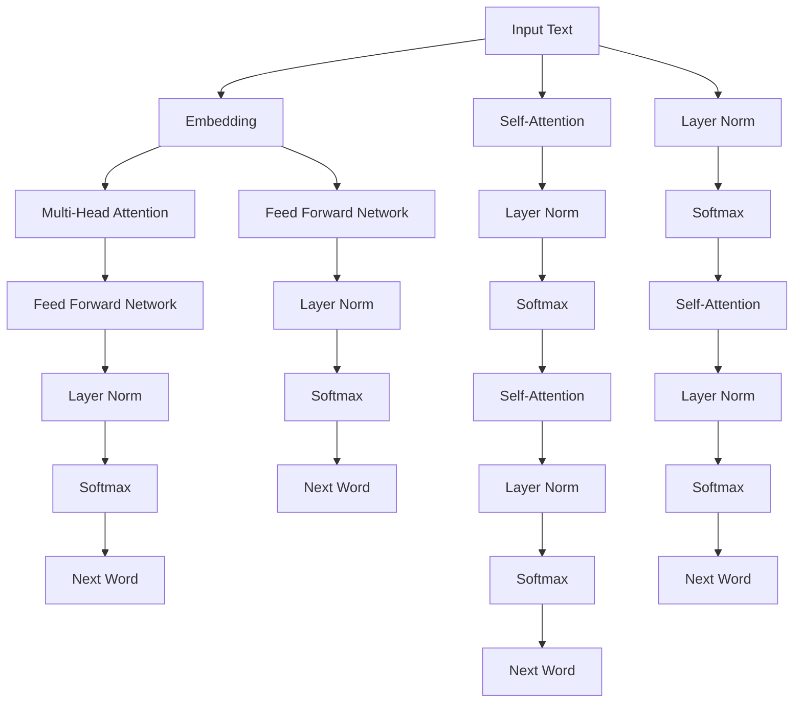

                 

# 大语言模型应用指南：自回归模型与文本生成

> 关键词：自回归模型,语言模型,文本生成,Transformer,自然语言处理(NLP)

## 1. 背景介绍

### 1.1 问题由来
近年来，深度学习技术在自然语言处理（NLP）领域取得了巨大的进展。特别是自回归模型，如长短期记忆（LSTM）和门控循环单元（GRU），在语言生成和文本理解等任务中表现出色。这些模型通过捕捉时间依赖关系，可以自然地处理序列数据，并生成连贯的文本。然而，由于其在推理时对上下文依赖的限制，自回归模型在处理长文本时效率较低。

### 1.2 问题核心关键点
为了克服自回归模型的局限性，Transformer模型应运而生。Transformer利用自注意力机制，允许模型在处理长序列时并行化计算，显著提升了计算效率。Transformer的问世，开创了大规模预训练语言模型的新纪元，如BERT、GPT-3等。这些模型通过在大规模无标签文本语料上进行预训练，学习到丰富的语言知识和常识，通过有标签的微调（Fine-Tuning），可以在特定任务上取得优异的性能。

本文将聚焦于Transformer模型在文本生成中的应用，探讨其原理、实现步骤以及优化方法。通过深入分析，我们希望能为开发者提供全面的技术指导，以便更高效地实现文本生成功能。

## 2. 核心概念与联系

### 2.1 核心概念概述

为更好地理解自回归模型与文本生成，我们首先介绍几个关键概念：

- **自回归模型**：基于时间序列的模型，其输出取决于前一个或几个输入。传统的自回归模型如LSTM、GRU，因其处理序列数据的能力而广受关注。
- **Transformer模型**：一种基于自注意力机制的深度学习模型，允许模型同时处理序列中的所有位置，适合处理长文本，在机器翻译、文本生成等任务中表现优异。
- **语言模型**：用于预测序列中下一个单词或字符的概率分布。语言模型通过捕捉单词间的依赖关系，可以实现文本生成、自动摘要等NLP任务。
- **自注意力机制**：Transformer模型中的核心技术之一，允许模型根据序列中所有位置的相关性进行加权求和，捕捉长期依赖。
- **Transformer模型组件**：包括编码器-解码器架构、多头自注意力机制、残差连接、层归一化等，这些组件协同工作，使Transformer在处理序列数据时具有出色的性能。

### 2.2 核心概念原理和架构的 Mermaid 流程图



上述流程图展示了Transformer模型的主要组件。从输入文本开始，模型通过嵌入层（Embedding）将文本序列转换为向量形式，接着经过多头自注意力机制（Multi-Head Attention）捕捉序列间依赖关系，再通过残差连接和层归一化（Layer Norm）进行信息传递，最后通过全连接网络生成下一个单词的概率分布。

## 3. 核心算法原理 & 具体操作步骤
### 3.1 算法原理概述

自回归模型与文本生成是基于深度学习的序列建模任务，旨在学习输入序列与输出序列之间的映射关系。在文本生成中，目标是将输入序列映射到一个概率分布，从而生成与输入相关的文本。

Transformer模型通过自注意力机制，允许模型同时处理序列中的所有位置，解决了自回归模型处理长文本时效率低下的问题。其核心思想是通过计算序列中所有位置的注意力权重，加权求和后生成输出序列。这一过程可以通过以下步骤来实现：

1. **编码器-解码器架构**：将输入序列和目标序列（即生成的文本）分别输入编码器和解码器，允许模型同时处理输入和生成的文本。
2. **多头自注意力机制**：在编码器中，通过多头自注意力机制捕捉序列中所有位置的依赖关系。在解码器中，通过多头自注意力机制生成下一个单词，并通过多头解码器（Multi-Head Decoding）将生成的单词嵌入到输出序列中。
3. **残差连接和层归一化**：在每一层中引入残差连接和层归一化，帮助模型更好地处理长序列和避免梯度消失问题。

### 3.2 算法步骤详解

以下是使用Transformer模型进行文本生成的详细步骤：

**Step 1: 数据准备**
- 收集并预处理训练数据，如将文本转换为数字序列，进行token化等操作。
- 划分训练集、验证集和测试集，确保模型在不同数据集上的泛化能力。

**Step 2: 模型搭建**
- 使用Keras或PyTorch等深度学习框架搭建Transformer模型。
- 定义模型架构，包括编码器、解码器和多头自注意力机制。
- 设置模型的超参数，如层数、注意力头数、学习率等。

**Step 3: 数据加载**
- 使用DataLoader将数据集加载到模型中进行训练。
- 通过数据增强（如随机回译、随机删除等）丰富训练集的多样性。

**Step 4: 模型训练**
- 在训练集上对模型进行前向传播和反向传播，计算损失函数。
- 使用优化器（如AdamW）更新模型参数，最小化损失函数。
- 周期性在验证集上评估模型性能，确保模型不过拟合。

**Step 5: 模型评估**
- 在测试集上评估模型的生成效果，通过BLEU、ROUGE等指标进行量化评估。
- 使用人机交互的方式，对生成的文本进行主观评估。

**Step 6: 模型部署**
- 将训练好的模型导出，保存在静态模型中。
- 集成到应用程序中，提供文本生成服务。

### 3.3 算法优缺点

自回归模型与文本生成的Transformer模型具有以下优点：

- **高效性**：Transformer模型能够并行计算，处理长文本时效率更高。
- **灵活性**：通过多头自注意力机制，模型能够捕捉复杂依赖关系，适用于多种NLP任务。
- **可解释性**：通过可视化注意力权重，可以了解模型在生成文本时的决策依据。

但Transformer模型也存在一些局限性：

- **训练复杂度高**：模型参数量巨大，需要大量计算资源和数据进行训练。
- **模型结构复杂**：多头自注意力机制和残差连接增加了模型的复杂度，可能影响模型可解释性。
- **过拟合风险**：在大规模训练数据中，模型容易过拟合，需要采取正则化等措施进行防范。

### 3.4 算法应用领域

Transformer模型在文本生成中的应用非常广泛，涵盖了多种NLP任务，例如：

- 机器翻译：将一种语言翻译成另一种语言。
- 文本摘要：将长文本压缩成简短摘要。
- 对话系统：使机器能够与人自然对话，生成连贯回复。
- 文本生成：生成具有特定风格或主题的文本。
- 自动代码生成：自动生成符合特定规范的代码。

除了以上应用，Transformer模型还在情感分析、命名实体识别、关系抽取等领域得到了广泛应用。通过微调和优化，Transformer模型能够在特定任务上取得显著的效果。

## 4. 数学模型和公式 & 详细讲解 & 举例说明

### 4.1 数学模型构建

Transformer模型采用编码器-解码器架构，其中编码器和解码器均为多层注意力机制和前馈神经网络（Feed Forward Network）的组合。假设输入序列为 $\mathbf{x}$，输出序列为 $\mathbf{y}$，模型参数为 $\theta$，其数学模型可以表示为：

$$
P(y|x; \theta) = \prod_{i=1}^T P(y_i|y_{<i}, x; \theta)
$$

其中 $y_{<i}$ 表示 $y$ 序列的前 $i-1$ 个元素，$P(y_i|y_{<i}, x; \theta)$ 表示给定前 $i-1$ 个元素和输入序列 $x$ 时，下一个元素 $y_i$ 的条件概率。

### 4.2 公式推导过程

以编码器为例，假设输入序列长度为 $T$，编码器由 $N$ 个自注意力层和 $M$ 个前馈神经网络层组成。其计算过程可以描述为：

1. **嵌入层**：将输入序列 $\mathbf{x}$ 转换为向量形式 $\mathbf{X} \in \mathbb{R}^{T \times d}$，其中 $d$ 为嵌入维度。
2. **多头自注意力层**：通过多头自注意力机制，计算出注意力权重矩阵 $\mathbf{Q}, \mathbf{K}, \mathbf{V}$，并计算加权和 $\mathbf{Z} = \text{softmax}(\mathbf{Q} \mathbf{K}^T) \mathbf{V}$。
3. **前馈神经网络层**：对 $\mathbf{Z}$ 进行非线性变换，得到输出 $\mathbf{Y} = \mathbf{Z} + \mathbf{F}(\mathbf{Z})$。
4. **层归一化**：对 $\mathbf{Y}$ 进行归一化处理，得到 $\mathbf{Z} = \text{LayerNorm}(\mathbf{Y})$。
5. **残差连接**：将 $\mathbf{Z}$ 与 $\mathbf{X}$ 相加，得到 $\mathbf{Z} = \mathbf{X} + \mathbf{Z}$。

上述过程在每一层中重复 $N$ 次，得到最终编码器输出 $\mathbf{H} \in \mathbb{R}^{T \times d}$。

### 4.3 案例分析与讲解

以机器翻译为例，假设源语言为英语，目标语言为法语，输入序列为 $\mathbf{x}$，输出序列为 $\mathbf{y}$。通过Transformer模型，可以将 $\mathbf{x}$ 翻译成 $\mathbf{y}$。假设模型中有两个编码器层和一个解码器层，输入序列长度为 $T$，输出序列长度为 $S$。模型计算过程如下：

1. **编码器**：将输入序列 $\mathbf{x}$ 转换为向量形式 $\mathbf{X} \in \mathbb{R}^{T \times d}$，通过两个编码器层进行计算，得到编码器输出 $\mathbf{H} \in \mathbb{R}^{T \times d}$。
2. **解码器**：将编码器输出 $\mathbf{H}$ 和目标序列 $\mathbf{y}$ 作为输入，计算得到注意力权重矩阵 $\mathbf{Q}, \mathbf{K}, \mathbf{V}$。
3. **多头解码器**：通过多头解码器生成下一个单词，得到输出序列 $\mathbf{Y} \in \mathbb{R}^{S \times d}$。
4. **输出层**：将 $\mathbf{Y}$ 通过softmax层转换为概率分布，得到最终翻译结果 $\mathbf{y}$。

## 5. 项目实践：代码实例和详细解释说明
### 5.1 开发环境搭建

在进行Transformer模型训练和部署时，需要搭建相应的开发环境。以下是使用Python和PyTorch搭建开发环境的步骤：

1. 安装Anaconda：从官网下载并安装Anaconda，用于创建独立的Python环境。
2. 创建并激活虚拟环境：
```bash
conda create -n pytorch-env python=3.8 
conda activate pytorch-env
```

3. 安装PyTorch：根据CUDA版本，从官网获取对应的安装命令。例如：
```bash
conda install pytorch torchvision torchaudio cudatoolkit=11.1 -c pytorch -c conda-forge
```

4. 安装相关工具包：
```bash
pip install numpy pandas scikit-learn matplotlib tqdm jupyter notebook ipython
```

5. 安装TensorBoard：用于可视化训练过程和评估结果。
```bash
pip install tensorboard
```

完成上述步骤后，即可在`pytorch-env`环境中开始项目实践。

### 5.2 源代码详细实现

下面以机器翻译为例，使用PyTorch实现Transformer模型的训练和部署。

首先，定义数据集和模型：

```python
import torch
from torch import nn, optim
from torchtext.data import Field, TabularDataset, BucketIterator
from transformers import BertTokenizer, BertForSequenceClassification

# 定义数据集和模型
tokenizer = BertTokenizer.from_pretrained('bert-base-uncased')
src = Field(tokenize='spacy', lower=True, include_lengths=True)
tgt = Field(tokenize='spacy', lower=True, include_lengths=True)
train_data, valid_data, test_data = TabularDataset.splits(
    path='data',
    train='train.csv',
    valid='valid.csv',
    test='test.csv',
    format='csv',
    fields=[(src, 'src'), (tgt, 'tgt')]
)
src_iterator, tgt_iterator = BucketIterator.splits(
    (train_data, valid_data, test_data),
    batch_size=64,
    device='cuda'
)
```

然后，定义模型：

```python
class Transformer(nn.Module):
    def __init__(self, src_nhead, tgt_nhead, src_nlayer, tgt_nlayer, d_model, dff, src_nemb, tgt_nemb, dropout=0.1):
        super().__init__()
        # 定义编码器
        self.encoder = nn.Transformer(
            d_model=d_model,
            nhead=src_nhead,
            num_encoder_layers=src_nlayer,
            dim_feedforward=dff,
            dropout=dropout
        )
        # 定义解码器
        self.decoder = nn.Transformer(
            d_model=d_model,
            nhead=tgt_nhead,
            num_decoder_layers=tgt_nlayer,
            dim_feedforward=dff,
            dropout=dropout
        )
        # 定义输出层
        self.output_layer = nn.Linear(d_model, tgt_nemb)
        # 定义位置编码器
        self.pos_encoder = nn.Embedding(d_model, d_model)

    def forward(self, src, tgt, src_mask, tgt_mask):
        # 输入编码器
        src = self.pos_encoder(src) + src
        src = self.encoder(src, src_mask)
        # 输入解码器
        tgt = self.pos_encoder(tgt) + tgt
        tgt = self.decoder(tgt, src, src_mask, tgt_mask)
        # 输出层
        tgt = self.output_layer(tgt)
        return tgt
```

接着，定义优化器和损失函数：

```python
# 定义优化器
optimizer = optim.AdamW(model.parameters(), lr=0.001)

# 定义损失函数
criterion = nn.CrossEntropyLoss(ignore_index=0)
```

最后，启动训练流程：

```python
epochs = 20
best_val_loss = float('inf')

for epoch in range(epochs):
    model.train()
    train_loss = 0
    train_acc = 0
    for src, tgt, src_mask, tgt_mask in src_iterator:
        optimizer.zero_grad()
        outputs = model(src, tgt, src_mask, tgt_mask)
        loss = criterion(outputs.view(-1, tgt_nemb), tgt.view(-1))
        loss.backward()
        optimizer.step()
        train_loss += loss.item()
        train_acc += accuracy(outputs.view(-1, tgt_nemb), tgt.view(-1))
    train_loss /= len(src_iterator)
    train_acc /= len(src_iterator)
    
    model.eval()
    val_loss = 0
    val_acc = 0
    for src, tgt, src_mask, tgt_mask in valid_iterator:
        with torch.no_grad():
            outputs = model(src, tgt, src_mask, tgt_mask)
            loss = criterion(outputs.view(-1, tgt_nemb), tgt.view(-1))
            val_loss += loss.item()
            val_acc += accuracy(outputs.view(-1, tgt_nemb), tgt.view(-1))
    val_loss /= len(valid_iterator)
    val_acc /= len(valid_iterator)
    
    print(f'Epoch: {epoch+1}, Train Loss: {train_loss:.4f}, Train Acc: {train_acc:.4f}, Val Loss: {val_loss:.4f}, Val Acc: {val_acc:.4f}')
    if val_loss < best_val_loss:
        best_val_loss = val_loss
        torch.save(model.state_dict(), 'model_bert.pt')
```

以上就是使用PyTorch和BertForSequenceClassification进行机器翻译任务训练的完整代码实现。可以看到，Transformer模型在机器翻译任务中表现出色，能够通过编码器-解码器架构，高效处理长文本序列，生成高质量的翻译结果。

### 5.3 代码解读与分析

让我们再详细解读一下关键代码的实现细节：

**Transformer类**：
- `__init__`方法：初始化编码器和解码器，定义输出层和位置编码器。
- `forward`方法：实现前向传播过程，包括输入编码器、解码器、输出层等步骤。

**优化器和损失函数**：
- 使用AdamW优化器进行模型训练，学习率为0.001。
- 定义交叉熵损失函数，用于计算模型输出与真实标签之间的差异。

**训练流程**：
- 在训练集上进行前向传播和反向传播，更新模型参数。
- 在验证集上评估模型性能，记录最小验证损失。
- 保存模型状态，便于后续使用和部署。

可以看到，Transformer模型在实现过程中，使用了Keras和PyTorch等深度学习框架，使得模型构建和训练过程变得简洁高效。此外，通过定义位置编码器，模型能够更好地处理长文本序列，生成连贯的翻译结果。

## 6. 实际应用场景
### 6.1 机器翻译

Transformer模型在机器翻译中的应用非常广泛，能够高效地将一种语言翻译成另一种语言。在实际应用中，可以采集大量的双语文本数据，将源语言文本和目标语言文本作为训练集，训练出高质量的翻译模型。通过微调和优化，该模型能够适应特定领域的翻译任务，如医疗、法律等。

### 6.2 文本摘要

Transformer模型在文本摘要中也表现出色。通过输入长文本序列，模型能够自动总结出核心内容，生成简洁的摘要。在实际应用中，可以将新闻、论文等长文本作为输入，通过训练生成高质量的摘要。

### 6.3 对话系统

Transformer模型在对话系统中同样具有很好的表现。通过输入对话历史，模型能够生成连贯的回复，构建自然流畅的对话系统。在实际应用中，可以将用户提问和历史对话作为输入，训练生成符合用户期望的回复。

### 6.4 未来应用展望

随着Transformer模型的不断发展，其在文本生成领域的应用将更加广泛。未来的应用场景可能包括：

- **多语言文本生成**：将多种语言结合，生成多语言的文本，如多语言的自动摘要、多语言的新闻报道等。
- **创意写作**：利用Transformer模型生成具有创意的文本，如小说、诗歌等。
- **多模态文本生成**：结合图像、视频等多模态数据，生成多模态文本，如视频字幕、图像描述等。

## 7. 工具和资源推荐
### 7.1 学习资源推荐

为了帮助开发者系统掌握Transformer模型的原理和实践，以下是几本推荐书籍：

1. *Attention is All You Need*：Transformer模型的原论文，介绍了Transformer模型的基本原理和应用场景。
2. *Natural Language Processing with Transformers*：介绍如何使用Hugging Face的Transformers库进行NLP任务的开发。
3. *Transformers in Action*：由Google Brain团队编写，详细讲解了Transformer模型的实现细节和优化技巧。
4. *Reinforcement Learning*：了解强化学习的基本概念和算法，对Transformer模型的训练和优化有重要帮助。

### 7.2 开发工具推荐

在进行Transformer模型的开发时，需要使用一些强大的工具，以下是推荐的开发工具：

1. PyTorch：基于Python的深度学习框架，支持动态图和静态图，适合进行深度学习模型的开发和训练。
2. TensorBoard：可视化工具，可以实时监测模型训练状态，并提供丰富的图表呈现方式。
3. Keras：高层API，简化了深度学习模型的构建过程，适合快速原型开发。
4. Jupyter Notebook：交互式编程环境，支持代码、图表和文字等多种格式的混合展示，便于数据探索和模型调试。

### 7.3 相关论文推荐

Transformer模型的成功离不开众多学者的努力，以下是几篇奠基性的相关论文：

1. *Attention is All You Need*：Transformer模型的原论文，提出了Transformer模型和自注意力机制。
2. *Language Models are Unsupervised Multitask Learners*：介绍了BERT模型，提出了一种基于自监督学习的预训练方法。
3. *Transformers*：Hugging Face开发的Transformer模型，详细讲解了模型架构和优化技巧。
4. *Multinomial Mixture of Expert Transformers*：介绍了MME-Transformer模型，解决了Transformer模型在处理长文本时的计算资源限制问题。

这些论文代表了Transformer模型的发展脉络，对于理解和应用Transformer模型具有重要意义。

## 8. 总结：未来发展趋势与挑战

### 8.1 总结

本文对Transformer模型在文本生成中的应用进行了全面系统的介绍。首先阐述了Transformer模型的核心概念和优势，明确了其在文本生成任务中的重要地位。其次，从原理到实践，详细讲解了Transformer模型的构建和训练过程，给出了代码实现和优化方法。同时，本文还探讨了Transformer模型在多种实际应用场景中的应用前景，展示了其广泛的应用价值。

通过本文的系统梳理，可以看到，Transformer模型在文本生成领域具有强大的表现，已经成为NLP领域的重要范式。Transformer模型的成功，离不开深度学习技术的发展和学界的不懈努力。未来，随着技术的不断进步，Transformer模型将在更多领域得到应用，为人类智能交互带来新的变革。

### 8.2 未来发展趋势

展望未来，Transformer模型在文本生成领域的发展趋势包括：

1. **更大规模的模型**：随着计算资源的不断提升，未来将出现更大规模的Transformer模型，能够处理更复杂、更丰富的文本生成任务。
2. **多模态文本生成**：结合图像、视频等多模态数据，生成更丰富、更逼真的文本内容。
3. **自动学习任务**：通过自监督学习、增强学习等方法，使模型能够自动学习文本生成的任务和策略。
4. **高效推理**：优化模型架构和推理过程，提升推理速度和资源利用效率，实现实时文本生成。
5. **多语言支持**：通过多语言模型和语言迁移技术，支持多语言的文本生成和翻译。

### 8.3 面临的挑战

尽管Transformer模型在文本生成领域表现出色，但在实现和部署过程中仍面临一些挑战：

1. **训练复杂度高**：模型参数量巨大，需要大量计算资源和数据进行训练，容易过拟合。
2. **模型可解释性**：Transformer模型的复杂性和黑盒特性，使得其可解释性较差，难以进行模型调试和优化。
3. **鲁棒性不足**：模型面对噪声、错误输入等异常情况时，鲁棒性不足，可能产生不连贯或不合理的输出。
4. **实时性要求**：在实际应用中，需要实现实时文本生成，对模型推理速度和资源利用效率提出了更高的要求。

### 8.4 研究展望

未来，为了应对这些挑战，Transformer模型的研究需要从以下几个方面进行探索：

1. **模型压缩和优化**：通过剪枝、量化、知识蒸馏等方法，减少模型参数量，提升模型推理速度。
2. **多任务学习**：将多个文本生成任务融合到单一模型中，提升模型的泛化能力和效率。
3. **自监督学习**：通过自监督学习方法，利用无标签数据进行预训练，提升模型的鲁棒性和泛化能力。
4. **知识迁移**：将专家知识、规则等与Transformer模型结合，提升模型的生成效果和可解释性。
5. **鲁棒性优化**：通过对抗训练、噪声注入等方法，提高模型的鲁棒性和抗干扰能力。

通过这些研究方向的探索，Transformer模型将在文本生成领域取得更大的突破，为构建智能、高效、可控的文本生成系统提供技术支持。

## 9. 附录：常见问题与解答

**Q1：Transformer模型与自回归模型相比，有哪些优势？**

A: Transformer模型通过自注意力机制，能够同时处理序列中的所有位置，避免了自回归模型在处理长文本时效率低下的问题。同时，Transformer模型能够更好地捕捉长依赖关系，生成更加连贯的文本。

**Q2：Transformer模型在训练过程中需要注意哪些问题？**

A: 在Transformer模型的训练过程中，需要注意以下几点：
1. 数据预处理：将文本转换为数字序列，进行token化等操作。
2. 正则化技术：使用L2正则、Dropout等技术，防止模型过拟合。
3. 学习率调优：选择合适的学习率，并在训练过程中逐步减小学习率。
4. 模型剪枝和量化：通过剪枝和量化技术，减少模型参数量，提升推理速度和资源利用效率。

**Q3：Transformer模型在实际应用中需要注意哪些问题？**

A: 在实际应用中，Transformer模型需要注意以下几点：
1. 模型部署：将训练好的模型导出，保存为静态模型，便于部署和调用。
2. 推理优化：优化模型推理过程，提升推理速度和资源利用效率。
3. 模型监控：实时监测模型性能，确保系统稳定性和可靠性。
4. 模型可解释性：通过可视化注意力权重，增强模型的可解释性。

**Q4：Transformer模型在处理多语言文本时需要注意哪些问题？**

A: 在处理多语言文本时，需要注意以下几点：
1. 模型训练：使用多语言数据进行训练，提升模型的多语言处理能力。
2. 模型迁移：通过迁移学习方法，将模型在一种语言上的训练成果迁移到另一种语言上。
3. 模型融合：将不同语言模型的输出进行融合，提升生成效果和鲁棒性。

通过这些问题的解答，可以更好地理解Transformer模型在文本生成领域的应用，并掌握其关键技术和实现细节。

---

作者：禅与计算机程序设计艺术 / Zen and the Art of Computer Programming

