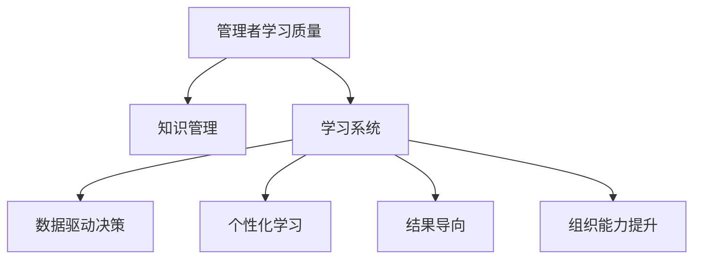

                 

# 大量输出:管理者学习质量的保证

> 关键词：管理者学习质量，知识管理，学习系统，数据驱动，个性化学习，结果导向，组织能力提升

## 1. 背景介绍

### 1.1 问题由来
在当前这个信息爆炸的时代，管理者面临的环境日益复杂，需要不断适应各种变化。如何保证管理者的学习质量，帮助他们在不断变化的环境中保持竞争力，是每一个组织都非常关心的问题。

传统的管理者培训方式，如企业内部的培训课程、研讨会、在线课程等，存在着诸多问题：

- **知识更新慢**：课程内容可能滞后于最新管理实践和趋势。
- **学习效果差**：传统的学习方式往往是单向的知识灌输，难以激发学习者的兴趣和参与度。
- **学习过程难以追踪**：缺乏有效的学习效果评估和反馈机制，难以对学习效果进行监控和改进。
- **个性化需求难以满足**：统一的标准化课程难以满足不同管理者的个性化学习需求。

为了解决这些问题，越来越多的组织开始关注数据驱动、个性化、结果导向的管理者学习质量保证方法。

### 1.2 问题核心关键点
管理者学习质量保证的核心在于如何通过高效、个性化的学习方式，利用数据驱动的决策机制，帮助管理者提升实际工作能力，并最终转化为组织能力的提升。

关键点包括：
1. **数据驱动决策**：通过数据分析来评估学习效果，识别学习需求，定制学习内容。
2. **个性化学习路径**：根据管理者的知识水平、经验背景、兴趣偏好等，定制个性化学习路径。
3. **结果导向**：学习内容和过程应紧密结合实际工作中的关键问题，确保学习效果能够转化为实际工作能力。
4. **组织能力提升**：通过管理者学习质量保证，促进组织内知识共享，提升整体组织能力。

## 2. 核心概念与联系

### 2.1 核心概念概述

为更好地理解管理者学习质量保证的方法，本节将介绍几个密切相关的核心概念：

- **管理者学习质量**：指管理者通过学习活动获得的能力提升程度和学习效果的总体评估。
- **知识管理**：通过规划、创造、分享、整合和应用知识，提高组织中知识的获取和利用效率。
- **学习系统**：用于支持学习者自主学习的技术平台，包括在线课程、学习管理系统、知识管理系统等。
- **数据驱动决策**：基于数据和分析结果，进行科学的决策和优化，以提高管理者的学习效果。
- **个性化学习**：根据学习者的特定需求和偏好，提供定制化的学习内容和方法。
- **结果导向**：以学习成果转化为实际工作能力的为导向，确保学习活动的有效性。
- **组织能力提升**：通过管理者学习质量保证，促进组织内知识共享和应用，提升整体组织能力。

这些核心概念之间的逻辑关系可以通过以下Mermaid流程图来展示：



这个流程图展示了一系列核心概念的联系：

1. 管理者学习质量是最终目标，通过知识管理、学习系统等手段实现。
2. 数据驱动决策和个性化学习是实现手段，直接影响学习效果。
3. 结果导向是最终目的，确保学习活动能够转化为实际工作能力。
4. 组织能力提升是整体目标，通过学习质量的提升，带动组织能力的整体提升。

## 3. 核心算法原理 & 具体操作步骤
### 3.1 算法原理概述

管理者学习质量保证的方法，本质上是一个基于数据的决策优化过程。其核心思想是：利用数据分析和机器学习算法，对管理者的学习过程进行监测和评估，进而提出个性化的学习建议，提升学习效果。

形式化地，假设管理者的知识水平为 $K$，学习目标为 $T$，通过学习活动获得的能力提升为 $P$。管理者学习质量保证的目标是最大化 $P$，即：

$$
\max_{K, T, P} P
$$

其中 $P$ 可以表示为学习内容、学习时间和学习方式等因素的综合函数。管理者学习质量保证的方法，可以通过以下几个步骤来实现：

1. 收集和管理者的学习数据。
2. 分析数据，评估管理者的学习效果和需求。
3. 根据评估结果，定制个性化的学习计划。
4. 监测和调整学习过程，确保学习效果最大化。
5. 评估学习成果，优化后续学习活动。

### 3.2 算法步骤详解

管理者学习质量保证的一般流程包括以下关键步骤：

**Step 1: 收集和管理者的学习数据**
- 收集管理者的基本信息，如职位、部门、经验背景等。
- 收集学习行为数据，如学习时间、学习内容、学习方式等。
- 收集学习效果数据，如学习成果测试、实际工作表现等。

**Step 2: 分析学习数据**
- 利用数据分析工具，评估管理者的学习效果。
- 识别管理者的知识盲区和需求点。
- 分析管理者的学习行为模式，找出潜在的学习障碍。

**Step 3: 定制个性化学习计划**
- 根据学习效果评估和需求分析，定制个性化的学习目标和内容。
- 设计个性化的学习路径和建议，如推荐的学习资源、学习方式等。
- 确定学习时间表和评估标准，确保学习活动的有序进行。

**Step 4: 监测和调整学习过程**
- 实时监测学习活动，收集反馈数据。
- 根据学习反馈，调整学习内容和方式。
- 及时解决学习过程中出现的问题，确保学习顺利进行。

**Step 5: 评估学习成果**
- 通过学习成果测试和实际工作表现，评估学习效果。
- 分析学习成果转化为实际工作能力的程度。
- 根据评估结果，优化后续学习活动，提升学习质量。

### 3.3 算法优缺点

管理者学习质量保证方法具有以下优点：
1. 数据驱动决策：通过数据分析，可以科学地评估和管理者的学习效果，避免主观偏差。
2. 个性化学习：根据管理者的特定需求和偏好，提供定制化的学习内容和方法，提高学习效果。
3. 结果导向：以学习成果转化为实际工作能力为导向，确保学习活动的有效性。
4. 实时监测和调整：通过实时监测和调整，可以及时发现和解决问题，确保学习活动的顺利进行。

同时，该方法也存在一些局限性：
1. 数据获取难度大：管理者的学习数据往往难以系统收集，需要一定的技术和管理支持。
2. 模型复杂度高：个性化的学习计划需要复杂的算法和模型支持，计算成本较高。
3. 学习内容定制难度大：需要结合管理者的具体工作需求和学习习惯，定制化程度较高。
4. 学习效果评估难度大：学习效果的评估往往需要结合实际工作表现，难以量化和标准化。

尽管存在这些局限性，但就目前而言，基于数据的决策优化方法是管理者学习质量保证的主流范式。未来相关研究的重点在于如何进一步降低数据获取难度，提高模型的个性化和可解释性，同时兼顾学习效果的量化评估。

### 3.4 算法应用领域

管理者学习质量保证方法在多个领域得到了广泛应用，例如：

- **企业培训**：通过数据分析和个性化学习，提升企业员工的管理能力和工作表现。
- **政府部门**：利用学习质量保证方法，提升公务员的管理水平和行政效率。
- **教育机构**：为教师提供个性化的学习资源和策略，提升教学效果和专业发展。
- **非营利组织**：通过学习质量保证，提升员工的管理能力和组织影响力。

除了上述这些经典应用外，学习质量保证方法也在医疗、农业、文化等多个领域得到应用，为各行业的知识管理提供了新的思路。随着技术的不断进步和应用场景的不断拓展，管理者学习质量保证方法必将在更多领域大放异彩。

## 4. 数学模型和公式 & 详细讲解  
### 4.1 数学模型构建

本节将使用数学语言对管理者学习质量保证的过程进行更加严格的刻画。

假设管理者学习效果 $P$ 由学习内容 $C$、学习时间 $T$、学习方式 $M$ 和外部环境因素 $E$ 共同决定，可以表示为：

$$
P = f(C, T, M, E)
$$

其中 $f$ 为非线性函数，反映了学习效果与学习内容、时间、方式、环境之间的关系。

管理者学习质量保证的目标是最大化学习效果 $P$，即：

$$
\max_{C, T, M, E} P
$$

在实践中，我们通常使用机器学习算法，如回归模型、决策树、随机森林等，来近似求解上述最优化问题。设 $\theta$ 为模型参数，则有：

$$
\theta = \mathop{\arg\min}_{\theta} \| P - f_{\theta}(C, T, M, E) \|
$$

其中 $f_{\theta}$ 为参数化的学习效果评估模型，$\| \cdot \|$ 为损失函数。

### 4.2 公式推导过程

以下我们以线性回归模型为例，推导学习效果的评估公式及其梯度计算公式。

假设管理者学习效果 $P$ 与学习内容 $C$、学习时间 $T$、学习方式 $M$ 之间的关系可以表示为线性模型：

$$
P = \alpha_0 + \alpha_1 C + \alpha_2 T + \alpha_3 M + \epsilon
$$

其中 $\alpha_0, \alpha_1, \alpha_2, \alpha_3$ 为线性模型的系数，$\epsilon$ 为随机误差项。

根据最小二乘法的原理，回归模型的参数估计公式为：

$$
\hat{\alpha} = \mathop{\arg\min}_{\alpha} \frac{1}{N}\sum_{i=1}^N (y_i - f_{\alpha}(x_i))^2
$$

其中 $x_i = (C_i, T_i, M_i)$，$y_i = P_i$。

对上述目标函数求导，得到梯度公式：

$$
\frac{\partial \mathcal{L}(\alpha)}{\partial \alpha_j} = \frac{2}{N} \sum_{i=1}^N (y_i - f_{\alpha}(x_i))x_{ij}
$$

其中 $x_{ij}$ 为特征 $x_i$ 的第 $j$ 个元素。

在得到参数梯度后，即可带入梯度下降等优化算法，完成模型参数的迭代更新，最小化学习效果与实际值之间的差异，得到最优的线性模型参数 $\hat{\alpha}$。

## 5. 项目实践：代码实例和详细解释说明
### 5.1 开发环境搭建

在进行学习质量保证的实践前，我们需要准备好开发环境。以下是使用Python进行机器学习开发的环境配置流程：

1. 安装Anaconda：从官网下载并安装Anaconda，用于创建独立的Python环境。

2. 创建并激活虚拟环境：
```bash
conda create -n manager_learning_env python=3.8 
conda activate manager_learning_env
```

3. 安装必要的Python库：
```bash
pip install numpy pandas scikit-learn scikit-learn
```

4. 安装机器学习框架：
```bash
pip install scikit-learn
```

5. 安装数据分析工具：
```bash
pip install pandas
```

6. 安装可视化工具：
```bash
pip install matplotlib seaborn
```

完成上述步骤后，即可在`manager_learning_env`环境中开始学习质量保证的实践。

### 5.2 源代码详细实现

下面我们以管理者学习效果评估为例，给出使用Scikit-learn库进行线性回归模型的PyTorch代码实现。

首先，定义线性回归模型和评估函数：

```python
from sklearn.linear_model import LinearRegression
from sklearn.metrics import mean_squared_error

class ManagerQualityEvaluation:
    def __init__(self, data, target):
        self.model = LinearRegression()
        self.target = target
        self.data = data
        
    def fit(self):
        self.model.fit(self.data, self.target)
        
    def predict(self, X):
        return self.model.predict(X)
    
    def evaluate(self, X, y):
        y_pred = self.predict(X)
        return mean_squared_error(y, y_pred)
```

然后，定义数据准备函数：

```python
import pandas as pd
import numpy as np

def load_data():
    data = pd.read_csv('manager_learning_data.csv')
    target = data['P']
    X = data[['C', 'T', 'M']]
    return X, target
```

接着，定义模型训练和评估函数：

```python
def train_model(model, X, y, batch_size=32, epochs=100, learning_rate=0.01):
    model.fit(X, y, batch_size=batch_size, epochs=epochs, learning_rate=learning_rate)
    
    evaluation = model.evaluate(X, y)
    print(f'Mean Squared Error: {evaluation:.4f}')
```

最后，启动训练流程：

```python
X, target = load_data()

model = ManagerQualityEvaluation(X, target)
train_model(model, X, target)
```

以上就是使用Scikit-learn进行管理者学习效果评估的完整代码实现。可以看到，使用Scikit-learn库，我们可以用相对简洁的代码完成线性回归模型的训练和评估。

### 5.3 代码解读与分析

让我们再详细解读一下关键代码的实现细节：

**ManagerQualityEvaluation类**：
- `__init__`方法：初始化模型、目标值和学习数据。
- `fit`方法：使用线性回归模型拟合数据。
- `predict`方法：根据学习数据预测管理者学习效果。
- `evaluate`方法：评估模型在测试数据上的预测效果。

**load_data函数**：
- 从CSV文件中加载数据，提取学习内容、时间、方式和目标值。
- 将学习内容和目标值作为特征和目标，模型将进行回归拟合。

**train_model函数**：
- 使用线性回归模型拟合训练数据，设置批大小、迭代次数和学习率。
- 在训练完成后，评估模型的预测效果，输出均方误差。

**代码执行流程**：
1. 加载数据集。
2. 创建线性回归模型，初始化数据和目标值。
3. 使用训练数据拟合模型。
4. 评估模型在测试数据上的预测效果，输出均方误差。

可以看出，使用Scikit-learn库进行学习质量保证的实践，相对简单和高效。但工业级的系统实现还需考虑更多因素，如模型的保存和部署、超参数的自动搜索、更灵活的评估指标等。但核心的学习质量保证方法基本与此类似。

## 6. 实际应用场景
### 6.1 企业培训

企业培训是管理者学习质量保证的一个重要应用场景。通过分析员工的学习行为和效果，企业可以定制个性化的培训计划，提升员工的管理能力和工作表现。

具体而言，可以收集企业内部的培训数据，包括员工的培训时间、培训内容、培训方式等，以及培训后的实际工作表现。基于这些数据，使用机器学习模型进行学习效果评估，找出培训中的薄弱环节，优化培训内容和方式。

例如，可以采用A/B测试，比较不同培训方式的效果，找出最有效的培训方法。同时，可以结合员工的个性化需求，定制个性化的学习路径，提高培训的针对性和有效性。

### 6.2 政府部门

政府部门的管理者学习质量保证，可以提升公务员的管理水平和行政效率。通过分析公务员的学习数据，识别学习需求，定制个性化的学习计划。

例如，可以基于公务员的职位、部门和工作内容，定制针对性的培训课程。同时，利用数据分析工具，评估培训效果，优化培训内容和方法，确保公务员能够真正掌握新知识和技能。

### 6.3 教育机构

教育机构的管理者学习质量保证，可以提升教师的管理能力和专业发展。通过分析教师的学习行为和效果，提供个性化的学习建议和资源。

例如，可以基于教师的教学经验、课堂表现和学习偏好，定制个性化的学习路径和资源。同时，利用数据分析工具，评估学习效果，优化教学方法和培训内容，提升教师的教学水平和专业发展。

### 6.4 未来应用展望

随着学习质量保证技术的不断发展，其在更多领域的应用前景将更加广阔。

在智慧医疗领域，通过学习质量保证，提升医护人员的管理水平和医疗质量，确保医疗服务的标准化和高质量。

在智能教育领域，通过学习质量保证，提升教师的教学效果和学生的学习成果，促进教育公平和高质量教育的发展。

在智慧城市治理中，通过学习质量保证，提升城市管理者的管理能力，提高城市治理的智能化水平。

此外，在企业生产、社会治理、文娱传媒等众多领域，学习质量保证技术也将不断拓展应用场景，为社会进步和经济社会发展提供新的动力。

## 7. 工具和资源推荐
### 7.1 学习资源推荐

为了帮助开发者系统掌握管理者学习质量保证的理论基础和实践技巧，这里推荐一些优质的学习资源：

1. 《数据科学基础》系列博文：由数据科学专家撰写，深入浅出地介绍了数据科学的基础概念和核心算法，包括回归分析、分类算法、聚类算法等。

2. 《机器学习实战》书籍：由机器学习实战专家撰写，全面介绍了机器学习算法的实现过程和实际应用，适合初学者入门。

3. 《Python数据分析》书籍：由数据分析专家撰写，系统介绍了Python数据处理和分析的常用技术和方法，适合进阶学习。

4. 《Scikit-learn官方文档》：Scikit-learn库的官方文档，提供了丰富的学习资源和示例代码，是Scikit-learn学习的必备资料。

5. Coursera《数据科学基础》课程：斯坦福大学开设的数据科学课程，由知名教授讲解，系统介绍了数据科学的基础知识和实践技能。

通过对这些资源的学习实践，相信你一定能够快速掌握管理者学习质量保证的精髓，并用于解决实际的组织管理问题。

### 7.2 开发工具推荐

高效的开发离不开优秀的工具支持。以下是几款用于管理者学习质量保证开发的常用工具：

1. Python：作为数据科学和机器学习的主流编程语言，Python提供了丰富的数据处理和分析工具，如Pandas、NumPy等。

2. Scikit-learn：用于机器学习的开源库，提供了丰富的回归、分类、聚类等算法，适合构建学习效果评估模型。

3. TensorFlow：由Google主导开发的深度学习框架，适合构建复杂的学习效果评估模型，支持GPU加速。

4. Jupyter Notebook：开源的交互式编程环境，适合进行数据处理和模型构建，可以实时显示代码执行结果。

5. Tableau：数据可视化工具，可以将学习数据分析结果以图表形式呈现，帮助管理者直观了解学习效果和需求。

合理利用这些工具，可以显著提升管理者学习质量保证的开发效率，加快创新迭代的步伐。

### 7.3 相关论文推荐

管理者学习质量保证的研究源于学界的持续研究。以下是几篇奠基性的相关论文，推荐阅读：

1. "Machine Learning for Employee Performance Improvement: A Case Study"：探讨了机器学习在员工绩效提升中的应用，提供了实用的案例和分析方法。

2. "A Data-Driven Approach to Management Training"：提出了一种基于数据分析的管理者培训方法，通过机器学习模型进行学习效果评估和个性化培训。

3. "Personalized Learning in the Workplace: A Survey"：总结了当前研究中关于个性化学习方法的最新进展，为管理者学习质量保证提供了理论基础。

4. "Learning Analytics in Management Education: An Exploratory Study"：研究了学习分析在管理教育中的应用，为学习质量保证提供了实际案例。

5. "Predictive Analytics in Management Training: A Framework for Success"：提出了一种基于预测分析的管理者培训方法，通过机器学习模型进行学习效果预测和个性化培训。

这些论文代表了大规模管理学习质量保证的研究方向，通过学习这些前沿成果，可以帮助研究者把握学科前进方向，激发更多的创新灵感。

## 8. 总结：未来发展趋势与挑战
### 8.1 总结

本文对管理者学习质量保证的方法进行了全面系统的介绍。首先阐述了管理者学习质量保证的研究背景和意义，明确了学习质量保证在提升管理者能力、优化学习效果方面的独特价值。其次，从原理到实践，详细讲解了数据驱动、个性化、结果导向的学习质量保证方法，给出了学习质量保证任务开发的完整代码实例。同时，本文还广泛探讨了学习质量保证方法在企业培训、政府部门、教育机构等多个领域的应用前景，展示了学习质量保证范式的巨大潜力。

通过本文的系统梳理，可以看到，基于数据的决策优化方法是管理者学习质量保证的主流范式，极大地提升了管理者的学习效果和实际工作能力。未来，伴随技术的不断进步和应用场景的不断拓展，管理者学习质量保证方法必将在更多领域大放异彩。

### 8.2 未来发展趋势

展望未来，管理者学习质量保证技术将呈现以下几个发展趋势：

1. 数据驱动决策：数据驱动将成为学习质量保证的核心方法，利用大数据和先进算法，进行科学的决策和优化。

2. 个性化学习：个性化学习路径将更加多样和灵活，能够更好地满足管理者的个性化需求。

3. 结果导向：学习效果的评估将更加全面和科学，能够更好地转化为实际工作能力。

4. 实时监测和调整：学习过程的实时监测和调整将更加高效，能够及时发现和解决问题。

5. 多模态学习：结合视觉、听觉等多模态数据，提升学习效果和质量保证的准确性。

6. 自动化和智能化：学习质量保证将进一步自动化和智能化，减少人工干预，提高效率和效果。

以上趋势凸显了管理者学习质量保证技术的广阔前景。这些方向的探索发展，必将进一步提升学习质量保证的效果，为管理者提供更加科学、个性化的学习路径，促进管理者的全面发展和组织的整体进步。

### 8.3 面临的挑战

尽管管理者学习质量保证技术已经取得了瞩目成就，但在迈向更加智能化、普适化应用的过程中，它仍面临着诸多挑战：

1. 数据获取难度大：管理者的学习数据往往难以系统收集，需要一定的技术和管理支持。

2. 模型复杂度高：个性化学习路径需要复杂的算法和模型支持，计算成本较高。

3. 学习内容定制难度大：需要结合管理者的具体工作需求和学习习惯，定制化程度较高。

4. 学习效果评估难度大：学习效果的评估往往需要结合实际工作表现，难以量化和标准化。

5. 学习内容的实用性和针对性不足：学习内容往往难以紧密结合实际工作需求，导致学习效果的转化率较低。

6. 学习路径的灵活性和可扩展性不足：学习路径的制定和调整相对固定，难以根据环境和需求变化进行灵活调整。

尽管存在这些挑战，但通过技术进步和应用实践，管理者学习质量保证方法将不断优化，更好地服务于管理者的学习和发展。

### 8.4 研究展望

未来，管理者学习质量保证的研究将更加深入和全面，涵盖以下方向：

1. 智能推荐系统：结合机器学习和大数据分析，为管理者推荐个性化的学习资源和路径。

2. 实时学习分析：利用实时数据分析，及时调整学习路径和内容，确保学习效果最大化。

3. 学习效果量化评估：开发更加全面和科学的学习效果评估方法，提高学习效果的可量化性和可比性。

4. 跨领域知识整合：将知识图谱、规则库等外部知识与学习系统结合，提升学习效果和质量保证的准确性。

5. 知识传播与共享：构建知识传播与共享平台，促进组织内部知识的流动和应用。

6. 学习效果反馈与改进：建立学习效果反馈机制，不断优化学习路径和内容，提升学习质量。

这些研究方向的探索，必将引领管理者学习质量保证技术迈向更高的台阶，为管理者的学习和发展提供更加科学、全面、高效的支持。面向未来，管理者学习质量保证技术需要与其他人工智能技术进行更深入的融合，如知识表示、因果推理、强化学习等，多路径协同发力，共同推动管理者学习质量保证技术的进步。只有勇于创新、敢于突破，才能不断拓展学习质量保证的边界，让管理者学习和发展更加高效、科学。

## 9. 附录：常见问题与解答

**Q1：学习质量保证是否适用于所有管理者？**

A: 学习质量保证方法在绝大多数管理者中都有效，但对于一些特殊职位的管理者，如高层领导，可能需要结合具体的组织文化和战略需求，进行个性化的调整和优化。

**Q2：如何评估学习效果？**

A: 学习效果的评估可以通过多种方式进行，如问卷调查、绩效评估、实际工作表现等。对于企业内部培训，可以使用KPI指标（如销售额、客户满意度等）来评估学习效果。

**Q3：如何构建个性化学习路径？**

A: 构建个性化学习路径需要结合管理者的具体需求和偏好，通过数据分析和机器学习模型，找出管理者的知识盲区和需求点，定制个性化的学习目标和内容。同时，需要结合管理者的学习时间和方式，制定灵活的学习计划。

**Q4：学习质量保证在实施过程中需要注意哪些问题？**

A: 学习质量保证在实施过程中，需要注意以下问题：
1. 数据隐私和安全：确保管理者的学习数据安全，避免数据泄露和滥用。
2. 学习者的参与和反馈：鼓励管理者积极参与学习，并收集反馈意见，持续改进学习内容和方法。
3. 学习效果的可量化：建立科学的学习效果评估方法，量化评估学习效果，确保学习效果的客观性和可比性。
4. 学习路径的灵活性：学习路径需要根据环境和需求变化进行调整，保持灵活性和可扩展性。

**Q5：学习质量保证的未来发展方向是什么？**

A: 学习质量保证的未来发展方向包括：
1. 智能化和自动化：学习质量保证将进一步智能化和自动化，减少人工干预，提高效率和效果。
2. 多模态学习：结合视觉、听觉等多模态数据，提升学习效果和质量保证的准确性。
3. 知识传播与共享：构建知识传播与共享平台，促进组织内部知识的流动和应用。
4. 学习效果反馈与改进：建立学习效果反馈机制，不断优化学习路径和内容，提升学习质量。

这些方向将推动学习质量保证技术的不断进步，为管理者的学习和发展提供更加科学、全面、高效的支持。

---

作者：禅与计算机程序设计艺术 / Zen and the Art of Computer Programming

