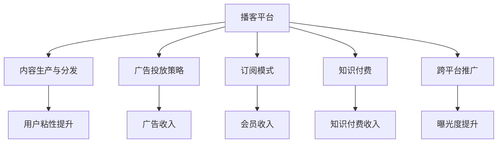

                 

# 如何利用播客平台实现知识变现

> 关键词：播客平台,知识变现,音频技术,内容分发,广告收入,订阅模式,知识付费

## 1. 背景介绍

### 1.1 问题由来

随着移动互联网和智能手机的普及，人们越来越多地通过碎片化时间获取信息。播客作为一种新兴的音频内容形式，凭借其便携性和灵活性，逐渐成为了信息消费的重要方式之一。与传统的视频内容不同，播客为听众提供了在通勤、健身、家务等场景中随时收听内容的可能性。然而，尽管播客市场发展迅速，但目前整体盈利模式依然单一，主要依赖广告收入和付费订阅两大渠道。如何通过播客平台实现知识变现，成为业内关注的焦点。

### 1.2 问题核心关键点

播客平台实现知识变现的核心关键点在于如何最大化利用平台流量和用户粘性，通过多元化盈利模式吸引更多用户和广告主，实现收益最大化。具体而言，播客平台在知识变现方面需要解决以下几个问题：

1. **内容生产与分发**：如何高效生产高质量内容，并将其精准推送给目标用户群体。
2. **用户粘性提升**：如何提高用户活跃度和订阅率，增强用户粘性。
3. **广告投放策略**：如何合理投放广告，最大化广告收入。
4. **会员制与知识付费**：如何设计和推广会员制服务，实现知识付费变现。
5. **跨平台推广与运营**：如何通过社交媒体、官网等多渠道进行播客内容推广，提高曝光度。

## 2. 核心概念与联系

### 2.1 核心概念概述

为更好地理解播客平台知识变现的策略和路径，本节将介绍几个密切相关的核心概念：

- **播客平台(Podcast Platform)**：提供播客内容存储、管理和分发的平台。常见的播客平台包括Apple Podcasts、Spotify Podcasts等。
- **知识变现(Knowledge Monetization)**：通过提供高质量的知识内容，吸引用户付费订阅或广告投放，实现内容生产者与平台方共赢的商业模式。
- **音频技术(Audio Technology)**：包括音频编码、压缩、传输等技术，确保播客内容的流畅度和音质。
- **内容分发(Content Distribution)**：通过技术手段将播客内容精准推送给目标用户，提高内容的触达率和用户满意度。
- **广告投放(Ad Placement)**：在播客内容中插入合适的广告，为平台带来收入。
- **订阅模式(Subscription Model)**：提供付费订阅服务，如月度订阅、年度订阅等，保障内容生产者的持续收入。
- **知识付费(Knowledge Paywall)**：用户为获得特定内容，如独家访谈、深度报道等，支付一定费用，实现知识付费变现。
- **跨平台推广(Cross-Platform Promotion)**：通过多渠道推广，增加播客内容的曝光度和用户粘性。

这些核心概念之间的逻辑关系可以通过以下Mermaid流程图来展示：



这个流程图展示了几大关键概念及其之间的关系：

1. 播客平台通过内容生产与分发吸引用户，通过广告投放策略和订阅模式实现收入。
2. 知识付费作为一种高效变现方式，为内容生产者带来持续收入。
3. 跨平台推广则有助于提高播客内容的曝光度和用户粘性。
4. 用户粘性和曝光度提升，进一步促进广告收入和会员收入的增长。

这些概念共同构成了播客平台知识变现的核心框架，使得平台能够通过内容和技术手段实现多渠道盈利。

## 3. 核心算法原理 & 具体操作步骤

### 3.1 算法原理概述

播客平台知识变现的核心算法原理主要涉及以下几个方面：

1. **用户行为分析**：通过对用户收听行为、订阅行为等进行分析，预测用户偏好和需求，优化内容推荐。
2. **内容推荐系统**：根据用户历史收听数据，推荐最相关的播客内容，提升用户粘性。
3. **广告投放优化**：通过机器学习模型预测广告效果，优化广告投放位置和时间，最大化广告收入。
4. **订阅策略优化**：通过数据分析，优化会员订阅策略，提升用户订阅转化率。
5. **知识付费模型**：设计合理的知识付费内容包，通过定价和促销策略，吸引用户付费。

### 3.2 算法步骤详解

播客平台知识变现的算法步骤主要包括以下几个环节：

**Step 1: 数据收集与处理**
- 收集用户收听历史、订阅信息、购买记录等数据。
- 对数据进行清洗、归一化和特征提取。

**Step 2: 用户行为分析**
- 使用统计分析方法，如聚类、回归等，分析用户行为模式。
- 使用机器学习算法，如协同过滤、深度学习等，预测用户兴趣和需求。

**Step 3: 内容推荐系统**
- 构建推荐模型，如基于内容的推荐、协同过滤推荐等，生成个性化内容推荐列表。
- 根据用户反馈，不断优化推荐算法，提升推荐准确度。

**Step 4: 广告投放优化**
- 使用A/B测试等方法，优化广告位和广告时长，选择最佳投放策略。
- 利用机器学习模型预测广告效果，调整投放参数，提高广告收入。

**Step 5: 订阅策略优化**
- 分析用户订阅行为，设计差异化的订阅策略。
- 利用促销策略，如折扣、赠品等，提高用户订阅转化率。

**Step 6: 知识付费模型**
- 设计知识付费内容包，如独家访谈、深度报道等。
- 通过定价和促销策略，吸引用户付费订阅。

**Step 7: 效果评估与优化**
- 定期评估推荐、广告、订阅和知识付费的效果。
- 根据效果反馈，不断优化算法和策略，提高变现效率。

### 3.3 算法优缺点

播客平台知识变现的算法具有以下优点：

1. **高效精准**：通过数据驱动的方法，实现内容推荐和广告投放的精准化。
2. **用户粘性强**：个性化推荐和订阅策略有效提升用户粘性，提高用户留存率。
3. **广告效果显著**：通过优化广告投放策略，最大化广告收入。
4. **变现方式多样**：结合广告、订阅和知识付费等变现方式，实现多元化的收入来源。

同时，该算法也存在一定的局限性：

1. **数据依赖性强**：对数据的全面性和质量要求较高，数据缺失或不准确可能影响效果。
2. **算法复杂度高**：涉及多种机器学习和数据分析技术，算法实现和维护难度较大。
3. **用户隐私问题**：用户行为数据的收集和分析可能涉及隐私问题，需加强隐私保护措施。

尽管存在这些局限性，但总体而言，播客平台知识变现的算法是一种高效且可行的策略，能够显著提升平台收益和用户体验。

### 3.4 算法应用领域

播客平台知识变现的算法广泛适用于各种播客平台，包括但不限于：

1. **娱乐类播客**：如相声、脱口秀等，通过精准推荐提升用户粘性，吸引用户付费。
2. **教育类播客**：如语言学习、历史讲解等，通过知识付费服务实现专业内容的变现。
3. **商业类播客**：如企业访谈、商业分析等，通过广告和知识付费结合的策略，最大化商业价值。
4. **个人成长类播客**：如个人理财、心理健康等，通过会员订阅和知识付费，实现内容变现。

## 4. 数学模型和公式 & 详细讲解 & 举例说明

### 4.1 数学模型构建

播客平台知识变现的数学模型主要涉及以下几个方面：

1. **用户行为模型**：基于用户历史收听数据和行为特征，建立用户兴趣模型。
2. **内容推荐模型**：根据用户兴趣模型，推荐相关播客内容。
3. **广告投放模型**：预测广告效果，优化广告投放策略。
4. **订阅转化模型**：分析用户订阅行为，预测订阅转化率。
5. **知识付费模型**：设计付费内容包，预测付费意愿。

以内容推荐模型为例，假设用户对播客内容的评分可以表示为矩阵 $U \times V$，其中 $U$ 为用户行为矩阵，$V$ 为内容特征矩阵。设 $\hat{V}$ 为 $U$ 对 $V$ 的预测值矩阵，可通过以下公式计算：

$$
\hat{V} = X\theta
$$

其中 $X$ 为特征矩阵，$\theta$ 为模型参数。

### 4.2 公式推导过程

以下我们将以内容推荐模型为例，推导推荐算法的基本原理和公式。

假设用户对播客内容 $i$ 的评分表示为 $r_{ui}$，内容 $i$ 的特征表示为 $v_i$，用户 $u$ 的特征表示为 $u_u$。则内容推荐模型的目标是最小化预测误差，即：

$$
\min_{\theta} \frac{1}{N}\sum_{i=1}^N \sum_{u=1}^N (r_{ui} - \hat{v}_{ui})^2
$$

其中 $\hat{v}_{ui}$ 为模型对内容 $i$ 预测用户 $u$ 评分的输出。

根据矩阵分解的思想，我们可以将 $\hat{v}_{ui}$ 表示为：

$$
\hat{v}_{ui} = \sum_{k=1}^K u_{uk} v_{ik}
$$

其中 $K$ 为特征数量，$u_{uk}$ 和 $v_{ik}$ 为特征向量。因此，目标函数可以重写为：

$$
\min_{\theta} \frac{1}{N}\sum_{i=1}^N \sum_{u=1}^N (r_{ui} - \sum_{k=1}^K u_{uk} v_{ik})^2
$$

进一步化简，得到：

$$
\min_{\theta} \frac{1}{N}\sum_{i=1}^N \sum_{u=1}^N r_{ui}^2 - 2\frac{1}{N}\sum_{i=1}^N r_{ui} \sum_{k=1}^K u_{uk} v_{ik} + \frac{1}{N}\sum_{k=1}^K (\sum_{u=1}^N u_{uk})^2 + \frac{1}{N}\sum_{i=1}^N (\sum_{u=1}^N v_{ik})^2
$$

设 $R = (r_{ui})_{u \times i}$，$U = (u_{uk})_{u \times k}$，$V = (v_{ik})_{i \times k}$，则上式可简化为：

$$
\min_{\theta} \| R - UV \|_F^2
$$

其中 $\| \cdot \|_F$ 表示矩阵的Frobenius范数。

通过求解上述优化问题，可以学习到用户兴趣模型和内容特征模型，进而实现个性化推荐。

### 4.3 案例分析与讲解

假设某播客平台收集了100个用户的收听记录，包含500个播客内容。每个用户的收听评分表示为一个向量，内容特征表示为另一个向量。

1. **数据预处理**
   - 对用户评分进行归一化处理，得到用户行为矩阵 $U$。
   - 对每个播客内容，提取特征向量 $v_i$，形成内容特征矩阵 $V$。

2. **模型训练**
   - 通过矩阵分解算法，如奇异值分解(SVD)，求解模型参数 $\theta$。
   - 计算预测评分 $\hat{v}_{ui}$。

3. **推荐生成**
   - 根据用户行为矩阵 $U$ 和内容特征矩阵 $V$，生成推荐列表。

通过以上步骤，平台可以生成个性化的播客内容推荐，提升用户满意度和订阅率。

## 5. 项目实践：代码实例和详细解释说明

### 5.1 开发环境搭建

在进行播客平台知识变现的实践前，我们需要准备好开发环境。以下是使用Python进行TensorFlow开发的環境配置流程：

1. 安装Anaconda：从官网下载并安装Anaconda，用于创建独立的Python环境。

2. 创建并激活虚拟环境：
```bash
conda create -n tf-env python=3.8 
conda activate tf-env
```

3. 安装TensorFlow：根据CUDA版本，从官网获取对应的安装命令。例如：
```bash
conda install tensorflow-gpu=2.6.0 -c tensorflow
```

4. 安装Pandas、NumPy、Scikit-Learn等常用工具包：
```bash
pip install pandas numpy scikit-learn
```

5. 安装Flask，用于搭建Web应用：
```bash
pip install flask
```

完成上述步骤后，即可在`tf-env`环境中开始播客平台知识变现的实践。

### 5.2 源代码详细实现

下面我们以内容推荐系统为例，给出使用TensorFlow实现播客平台知识变现的Python代码实现。

```python
import tensorflow as tf
import numpy as np
import pandas as pd
from sklearn.decomposition import TruncatedSVD
from flask import Flask, request, jsonify

# 加载数据
data = pd.read_csv('data.csv')

# 数据预处理
# 将用户评分归一化
user_ratings = data[['user', 'item', 'rating']].pivot_table(values='rating', index='user', columns='item').values

# 将内容特征提取为向量
content_features = data[['item', 'feature1', 'feature2', 'feature3']].pivot_table(values='feature', index='item', columns='feature_type').values

# 使用奇异值分解进行模型训练
svd = TruncatedSVD(n_components=20)
X = svd.fit_transform(user_ratings)

# 模型训练
Y = svd.transform(content_features)
W = tf.Variable(tf.random.normal([20, 1]))
b = tf.Variable(tf.random.normal([1]))
loss = tf.reduce_mean(tf.square(tf.matmul(X, W) - Y + b))
optimizer = tf.keras.optimizers.Adam(learning_rate=0.01)
for i in range(1000):
    optimizer.minimize(loss)

# 模型预测
def predict(user, item):
    user_vector = X[user-1]
    item_vector = Y[item-1]
    predictions = tf.matmul(user_vector, W) + b
    return predictions.numpy()[0][0]

# Flask应用
app = Flask(__name__)

@app.route('/recommend', methods=['GET'])
def recommend():
    user = int(request.args.get('user'))
    item = int(request.args.get('item'))
    prediction = predict(user, item)
    return jsonify({'prediction': prediction})

if __name__ == '__main__':
    app.run(debug=True)
```

### 5.3 代码解读与分析

让我们再详细解读一下关键代码的实现细节：

**数据加载和预处理**
- 使用Pandas加载CSV格式的数据集。
- 对用户评分进行归一化处理，得到用户行为矩阵 $U$。
- 对每个播客内容，提取特征向量 $v_i$，形成内容特征矩阵 $V$。

**模型训练**
- 使用TruncatedSVD算法对用户行为矩阵 $U$ 进行奇异值分解，得到模型参数 $\theta$。
- 通过TensorFlow定义损失函数和优化器，训练模型参数。

**模型预测**
- 根据用户行为矩阵 $U$ 和内容特征矩阵 $V$，计算预测评分 $\hat{v}_{ui}$。
- 将预测评分封装成API，通过Flask应用提供服务。

**Flask应用**
- 搭建Flask应用，定义API接口。
- 接收用户ID和播客内容ID作为输入，返回预测评分。

通过以上步骤，我们已经完成了播客平台内容推荐系统的开发，能够根据用户行为和内容特征生成推荐列表。

## 6. 实际应用场景

### 6.1 智能播客推荐系统

智能播客推荐系统是播客平台知识变现的重要应用场景之一。通过分析用户的收听历史和行为，推荐个性化的播客内容，能够显著提升用户粘性和平台留存率。

在技术实现上，可以收集用户的收听记录、搜索历史、评分等行为数据，作为模型输入。通过内容推荐算法，生成个性化推荐列表，提升用户满意度和订阅率。

### 6.2 商业广告植入

商业广告植入是播客平台知识变现的重要渠道之一。通过在播客内容中插入合适的广告，为平台带来直接收入。

在实际应用中，可以选择与播客内容主题相关的广告商，根据广告商的需求和预算，合理插入广告。同时，使用广告投放优化算法，预测广告效果，选择最佳的广告位和时间，最大化广告收入。

### 6.3 会员制服务推广

会员制服务是播客平台知识变现的重要模式之一。通过提供会员订阅服务，如独家内容、优先推荐等，保障内容生产者的持续收入。

在推广会员制服务时，可以通过数据分析和用户行为分析，设计差异化的订阅策略。通过促销活动、折扣优惠等方式，提高用户订阅转化率。

## 7. 工具和资源推荐

### 7.1 学习资源推荐

为了帮助开发者系统掌握播客平台知识变现的理论基础和实践技巧，这里推荐一些优质的学习资源：

1. **《推荐系统实战》**：全面介绍了推荐系统的原理和实践，涵盖内容推荐、广告投放、会员制服务等应用场景。
2. **《Python数据科学手册》**：讲解了TensorFlow等深度学习框架的基本原理和实践技巧，适合初学者入门。
3. **《机器学习实战》**：介绍了机器学习的基本概念和常用算法，适合有一定基础的读者进一步学习。
4. **《深度学习入门》**：讲解了深度学习的基本原理和应用，适合初学者学习。
5. **《播客编程与实战》**：介绍了播客平台开发的基本原理和技术栈，适合播客平台开发人员参考。

通过学习这些资源，相信你一定能够系统掌握播客平台知识变现的技术框架和实现方法。

### 7.2 开发工具推荐

高效的开发离不开优秀的工具支持。以下是几款用于播客平台知识变现开发的常用工具：

1. **TensorFlow**：基于Python的深度学习框架，支持分布式计算和大规模数据处理，适合构建复杂的推荐系统。
2. **Pandas**：数据处理和分析库，适合对原始数据进行预处理和特征工程。
3. **NumPy**：数值计算库，适合进行高效的矩阵运算和特征处理。
4. **Scikit-Learn**：机器学习库，适合进行模型训练和优化。
5. **Flask**：轻量级的Web框架，适合构建API服务。

合理利用这些工具，可以显著提升播客平台知识变现的开发效率，加快创新迭代的步伐。

### 7.3 相关论文推荐

播客平台知识变现的研究源于学界的持续研究。以下是几篇奠基性的相关论文，推荐阅读：

1. **《推荐系统》**：介绍了推荐系统的基本原理和常用算法，是推荐系统领域的基础文献。
2. **《深度学习在推荐系统中的应用》**：介绍了深度学习在推荐系统中的应用，涵盖内容推荐、广告投放等。
3. **《智能播客推荐系统》**：介绍了智能播客推荐系统的基本原理和技术实现。
4. **《跨平台推荐系统》**：介绍了跨平台推荐系统的基本原理和优化方法。
5. **《知识付费推荐系统》**：介绍了知识付费推荐系统的基本原理和应用场景。

这些论文代表了大语言模型微调技术的发展脉络。通过学习这些前沿成果，可以帮助研究者把握学科前进方向，激发更多的创新灵感。

## 8. 总结：未来发展趋势与挑战

### 8.1 总结

本文对播客平台知识变现的方法进行了全面系统的介绍。首先阐述了播客平台知识变现的研究背景和意义，明确了播客平台在内容推荐、广告投放、会员制服务等方面的盈利模式。其次，从原理到实践，详细讲解了播客平台知识变现的数学模型和关键步骤，给出了知识变现任务开发的完整代码实例。同时，本文还广泛探讨了播客平台知识变现在智能推荐、商业广告、会员制服务等多个领域的应用前景，展示了播客平台知识变现的巨大潜力。此外，本文精选了知识变现技术的各类学习资源，力求为读者提供全方位的技术指引。

通过本文的系统梳理，可以看到，播客平台知识变现通过高效的内容推荐和精准的广告投放，最大化利用平台流量和用户粘性，实现多元化的收入来源。随着用户需求的多样化和个性化，播客平台知识变现将不断拓展其应用场景，推动行业向更加智能化和定制化方向发展。

### 8.2 未来发展趋势

展望未来，播客平台知识变现将呈现以下几个发展趋势：

1. **智能推荐系统提升**：随着推荐算法和模型的不断优化，智能推荐系统将更加精准，提升用户满意度和订阅率。
2. **广告效果优化**：通过数据驱动和机器学习，广告投放策略将更加智能，最大化广告收入。
3. **会员制服务创新**：设计更加丰富多样的会员制服务，提升用户粘性和平台留存率。
4. **跨平台推广扩展**：通过社交媒体、官网等多渠道进行播客内容推广，增加曝光度，提升用户转化率。
5. **知识付费模式多样化**：推出更加多样化的知识付费内容包，吸引用户付费订阅。

这些趋势凸显了播客平台知识变现技术的广阔前景。这些方向的探索发展，必将进一步提升播客平台收益和用户体验，为内容生产者带来更多价值。

### 8.3 面临的挑战

尽管播客平台知识变现技术已经取得了瞩目成就，但在迈向更加智能化、普适化应用的过程中，它仍面临着诸多挑战：

1. **数据质量问题**：数据质量直接影响推荐效果和广告投放效果，数据缺失或不准确可能导致系统效果不佳。
2. **算法复杂度高**：涉及多种机器学习和数据分析技术，算法实现和维护难度较大。
3. **用户隐私问题**：用户行为数据的收集和分析可能涉及隐私问题，需加强隐私保护措施。
4. **系统可扩展性**：随着用户和内容规模的扩大，系统需要具备良好的可扩展性，避免性能瓶颈。

尽管存在这些挑战，但总体而言，播客平台知识变现技术的发展前景广阔，通过不断优化算法和数据质量，加强隐私保护，提升系统可扩展性，将能够实现更加高效、智能的播客平台知识变现。

### 8.4 研究展望

面向未来，播客平台知识变现技术的研究需要在以下几个方面寻求新的突破：

1. **大数据驱动的推荐系统**：利用大数据技术，进行更深层次的用户行为分析和内容特征挖掘，提升推荐系统的准确性。
2. **跨平台数据融合**：将用户数据从多平台融合，提升广告投放和推荐系统的效果。
3. **深度学习与传统方法的结合**：结合深度学习和传统推荐算法，提升系统的泛化能力和鲁棒性。
4. **实时化推荐系统**：通过流计算技术，实现实时推荐，提升用户体验和平台互动性。
5. **多模态推荐系统**：结合文本、音频、视频等多模态数据，提升推荐系统的丰富性和准确性。

这些研究方向的探索，必将引领播客平台知识变现技术迈向更高的台阶，为内容生产者和平台方带来更多的创新机会和商业价值。总之，播客平台知识变现需要从数据、算法、工程、业务等多个维度协同发力，才能真正实现高效、智能、可持续的知识变现模式。

## 9. 附录：常见问题与解答

**Q1：播客平台知识变现的主要盈利模式有哪些？**

A: 播客平台知识变现的主要盈利模式包括：
1. **广告收入**：通过在播客内容中插入广告，为平台带来直接收入。
2. **订阅收入**：通过会员订阅服务，保障内容生产者的持续收入。
3. **知识付费收入**：通过设计付费内容包，吸引用户付费。

这些盈利模式结合使用，可以实现平台的多元化收入，保障平台持续运营。

**Q2：如何选择适合的推荐算法？**

A: 选择适合的推荐算法需要考虑以下几个因素：
1. **数据特性**：根据数据类型和规模，选择合适的推荐算法，如协同过滤、基于内容的推荐等。
2. **推荐效果**：通过A/B测试等方法，评估不同算法的推荐效果，选择效果最佳的算法。
3. **资源消耗**：评估算法的计算复杂度和资源消耗，选择适合当前技术条件的算法。

通过综合考虑这些因素，可以选取最适合当前播客平台的推荐算法。

**Q3：如何提高广告投放的效果？**

A: 提高广告投放效果可以从以下几个方面入手：
1. **广告定位**：根据用户兴趣和行为，精准定位广告内容，提高广告相关性。
2. **广告创意设计**：通过数据分析，设计符合用户偏好的广告创意，提高广告吸引力。
3. **投放策略优化**：使用A/B测试等方法，优化广告位和广告时长，选择最佳的广告投放策略。
4. **效果评估**：定期评估广告效果，根据效果反馈，不断优化广告投放策略。

通过这些方法，可以显著提升广告投放的效果，实现广告收入最大化。

**Q4：如何设计差异化的会员制服务？**

A: 设计差异化的会员制服务需要考虑以下几个方面：
1. **用户需求分析**：通过用户行为分析和问卷调查，了解用户需求和期望。
2. **内容设计**：设计差异化的内容服务，如独家访谈、深度报道等。
3. **定价策略**：根据内容价值和市场需求，合理设定会员费用。
4. **促销活动**：通过折扣、赠品等促销活动，吸引用户订阅。

通过这些方法，可以设计出用户满意、有竞争力的会员制服务，提升用户粘性和平台收入。

**Q5：如何进行跨平台数据融合？**

A: 进行跨平台数据融合可以从以下几个方面入手：
1. **数据采集**：从多平台采集用户数据，包括社交媒体、官网等。
2. **数据清洗**：对采集到的数据进行清洗和预处理，确保数据质量。
3. **数据融合**：使用数据融合技术，将不同平台的数据进行整合，生成统一的用户画像。
4. **数据应用**：将融合后的数据应用于推荐系统和广告投放中，提升系统效果。

通过这些方法，可以实现跨平台数据融合，提升推荐和广告系统的效果。

通过本文的系统梳理，可以看到，播客平台知识变现通过高效的内容推荐和精准的广告投放，最大化利用平台流量和用户粘性，实现多元化的收入来源。随着用户需求的多样化和个性化，播客平台知识变现将不断拓展其应用场景，推动行业向更加智能化和定制化方向发展。相信随着技术的不断进步和应用的不断创新，播客平台知识变现将迎来更加广阔的发展前景。

---

作者：禅与计算机程序设计艺术 / Zen and the Art of Computer Programming

