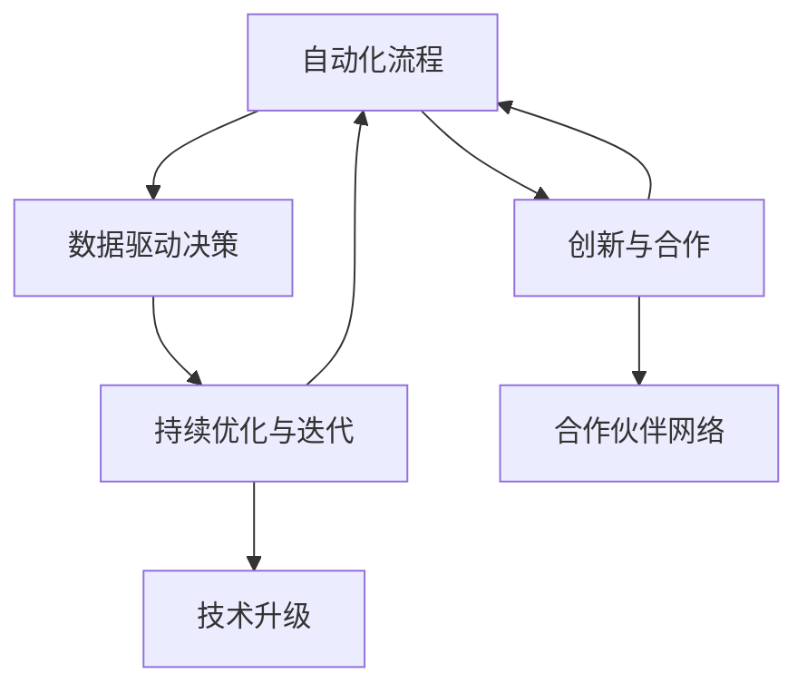

                 

# 如何在自动化创业中实现可持续增长

自动化创业是指利用先进的信息技术和自动化工具，将传统手工劳动转变为高效、低成本的自动化流程，从而实现企业的快速扩张和持续增长。自动化创业的核心在于运用数据驱动决策，不断优化流程，提高效率，降低成本，提升客户体验。本文将详细介绍自动化创业中的关键要素和实现步骤，探讨如何通过高效的数据分析与决策、持续优化与迭代、创新与合作，推动企业在自动化转型中实现可持续增长。

## 1. 背景介绍

### 1.1 问题由来
自动化创业在全球范围内正处于快速发展期。随着人工智能、大数据、云计算等技术的进步，企业通过自动化转型，能够显著提高运营效率，降低成本，提升市场竞争力。尤其是在制造业、物流、金融、医疗等行业，自动化流程的应用已经取得了显著成效。

### 1.2 问题核心关键点
自动化创业的核心在于通过技术手段，将繁琐、重复的劳动自动化，实现规模化和效率提升。关键在于以下几个方面：
- **数据驱动决策**：企业需要依靠数据来做出经营决策，优化运营流程，提高效率。
- **持续优化与迭代**：自动化流程并非一劳永逸，需要持续优化与迭代，以适应市场变化。
- **创新与合作**：创新技术的应用和跨行业合作，是推动企业持续增长的重要因素。

## 2. 核心概念与联系

### 2.1 核心概念概述
自动化创业涉及的关键概念包括：

- **自动化流程**：将手工劳动转变为自动化流程，通过软件和机器人等技术手段实现。
- **数据驱动决策**：基于数据分析和机器学习，做出高效、精准的经营决策。
- **持续优化与迭代**：不断调整和优化自动化流程，以提高效率和适应市场变化。
- **创新与合作**：引入新技术，促进跨行业合作，提升竞争力。

这些概念之间存在着紧密的联系，共同构成了自动化创业的核心框架。

### 2.2 核心概念原理和架构的 Mermaid 流程图


这个流程图展示了自动化创业的关键步骤及其相互关系：

1. **自动化流程**作为起点，通过软件和机器人实现。
2. **数据驱动决策**对流程进行分析和优化，基于数据分析做出决策。
3. **持续优化与迭代**不断调整流程，保持效率和竞争力。
4. **创新与合作**引入新技术，促进跨行业合作，提升竞争力。
5. **技术升级**和**合作伙伴网络**分别作为持续优化和合作的重要支撑。

## 3. 核心算法原理 & 具体操作步骤
### 3.1 算法原理概述

自动化创业的算法原理主要包括以下几个方面：

- **流程自动化**：通过OCR、RPA、机器人流程自动化等技术，实现手工劳动的自动化。
- **数据驱动决策**：利用大数据分析、机器学习等技术，基于历史数据和实时数据做出精准决策。
- **持续优化与迭代**：采用A/B测试、多臂老虎机算法等方法，不断优化自动化流程，提升效率。
- **创新与合作**：通过技术合作、跨行业合作等，引入新技术和新模式，提升竞争力。

### 3.2 算法步骤详解

#### 3.2.1 流程自动化
- **识别自动化场景**：评估流程中哪些环节适合自动化，识别瓶颈和低效环节。
- **选择自动化工具**：根据场景选择合适的自动化工具，如RPA工具、OCR技术、机器人等。
- **设计自动化流程**：设计自动化流程，确保可执行性和可靠性。
- **实施自动化**：实施自动化流程，并进行测试和调整。

#### 3.2.2 数据驱动决策
- **数据采集**：收集流程中相关数据，包括操作时间、出错率、客户反馈等。
- **数据分析**：使用数据分析工具对数据进行清洗、处理和分析，找出问题点和优化空间。
- **模型训练**：使用机器学习模型对数据进行训练，优化决策流程。
- **决策执行**：基于模型输出，执行自动决策，优化流程。

#### 3.2.3 持续优化与迭代
- **性能评估**：定期评估自动化流程的性能，识别改进点。
- **A/B测试**：对改进方案进行A/B测试，选择最优方案。
- **多臂老虎机算法**：基于多臂老虎机算法，动态调整流程参数，优化效果。

#### 3.2.4 创新与合作
- **技术引进**：引入新技术，如人工智能、物联网等，提升自动化水平。
- **跨行业合作**：与其他行业合作，共享资源和经验，提升竞争力。
- **伙伴关系建立**：建立合作伙伴网络，共同推动技术进步和市场应用。

### 3.3 算法优缺点
**优点**：
- **效率提升**：自动化流程能够大幅提高工作效率，降低人力成本。
- **精准决策**：基于数据驱动决策，能够做出更精准、更有效的经营决策。
- **持续优化**：持续优化和迭代，保持企业竞争力。
- **创新合作**：引入新技术和跨行业合作，提升市场竞争力。

**缺点**：
- **技术投入高**：初期需要较大的技术投入，尤其是自动化工具和数据处理系统的建设。
- **数据质量要求高**：数据质量直接影响决策效果，需要投入大量精力进行数据清洗和处理。
- **人才需求大**：需要具备数据分析、技术开发等专业人才，人才培养成本较高。

### 3.4 算法应用领域
自动化创业的应用领域广泛，涵盖制造业、物流、金融、医疗等行业。以下是几个典型案例：

#### 3.4.1 制造业自动化
在制造业中，自动化创业主要应用于生产线自动化、质量控制、物流管理等方面。例如，采用机器人自动化生产线，实现快速生产和高精度加工；引入AI视觉检测，提升产品质量；使用自动仓储系统，优化库存管理。

#### 3.4.2 物流自动化
物流自动化主要应用于仓库管理、订单处理、配送路线优化等方面。通过RPA和自动化仓库系统，实现货物分拣、入库出库等自动化；使用智能调度系统，优化配送路线，提高配送效率。

#### 3.4.3 金融自动化
在金融领域，自动化创业主要应用于风险控制、客户服务、交易管理等方面。通过智能风控系统，实时监控交易风险；引入自动化客服系统，提升客户服务效率；使用机器学习模型，优化交易策略。

#### 3.4.4 医疗自动化
在医疗行业，自动化创业主要应用于电子病历管理、诊断辅助、药物配送等方面。通过电子病历系统，实现病历自动化管理；使用AI辅助诊断，提升诊断准确性；采用自动化药物配送系统，提高药物配送效率。

## 4. 数学模型和公式 & 详细讲解 & 举例说明

### 4.1 数学模型构建

在自动化创业中，数学模型主要用于数据分析、决策支持和流程优化。以下是几个典型数学模型：

#### 4.1.1 回归模型
回归模型主要用于预测和趋势分析。假设有一个数据集$D=\{(x_i, y_i)\}_{i=1}^N$，其中$x$为输入特征，$y$为输出变量，回归模型可以表示为：

$$
y = \theta_0 + \sum_{i=1}^n \theta_i x_i
$$

其中$\theta$为模型参数，$n$为输入特征的数量。

#### 4.1.2 决策树模型
决策树模型用于分类和决策。假设有一个数据集$D=\{(x_i, y_i)\}_{i=1}^N$，其中$x$为输入特征，$y$为分类标签，决策树模型可以表示为：

$$
T = \{r, S_r\}
$$

其中$r$为决策树根节点，$S_r$为叶子节点集合，每个叶子节点对应一个分类结果。

#### 4.1.3 聚类模型
聚类模型用于数据分组和分类。假设有一个数据集$D=\{(x_i, y_i)\}_{i=1}^N$，其中$x$为输入特征，$y$为分组标签，聚类模型可以表示为：

$$
K = \{c, S_c\}
$$

其中$c$为聚类中心，$S_c$为属于聚类$c$的数据点集合。

### 4.2 公式推导过程

#### 4.2.1 回归模型推导
回归模型常用的优化目标为最小化均方误差（MSE）：

$$
\min_{\theta} \frac{1}{2N} \sum_{i=1}^N (y_i - \hat{y}_i)^2
$$

其中$\hat{y}_i$为模型预测值。优化方法包括梯度下降、随机梯度下降等。

#### 4.2.2 决策树模型推导
决策树模型的训练过程包括特征选择、节点分割和剪枝等步骤。常用的算法包括ID3、C4.5、CART等。

#### 4.2.3 聚类模型推导
聚类模型的训练过程包括特征选择、模型初始化、迭代更新等步骤。常用的算法包括K-means、层次聚类等。

### 4.3 案例分析与讲解

#### 4.3.1 案例：制造业自动化

某制造企业引入自动化生产线和质量检测系统，通过采集生产线数据和质量检测数据，建立回归模型和决策树模型，实现生产效率提升和产品质量控制。具体步骤如下：

1. **数据采集**：从生产线和质量检测系统收集数据，包括设备运行时间、加工参数、产品质量等。
2. **数据清洗**：对数据进行清洗和预处理，去除异常值和噪声。
3. **模型训练**：使用回归模型和决策树模型对数据进行训练，优化生产参数和质量控制参数。
4. **决策执行**：基于模型输出，实时调整生产参数，优化产品质量，提升生产效率。

通过自动化流程和数据驱动决策，该企业实现了生产效率提升20%，产品质量控制能力提升30%。

## 5. 项目实践：代码实例和详细解释说明

### 5.1 开发环境搭建

为了实现自动化创业的项目实践，需要搭建一个包含数据采集、数据分析、决策支持、流程自动化等功能的开发环境。以下是搭建开发环境的步骤：

1. **服务器和网络环境**：搭建高性能服务器，确保数据采集和处理的速度和稳定性。
2. **开发工具和环境**：安装Python、R等编程语言，配置开发环境。
3. **数据采集和存储**：配置数据采集系统，存储数据到数据库。
4. **数据分析工具**：安装NumPy、Pandas、Scikit-learn等数据分析工具。
5. **决策支持系统**：开发决策支持系统，集成回归模型、决策树模型等算法。
6. **流程自动化工具**：使用RPA、OCR等自动化工具，实现流程自动化。

### 5.2 源代码详细实现

以下是使用Python和RPA工具实现制造业自动化流程的代码示例：

#### 5.2.1 Python代码示例

```python
import pandas as pd
import numpy as np
from sklearn.linear_model import LinearRegression
from sklearn.tree import DecisionTreeRegressor

# 数据采集
data = pd.read_csv('production_data.csv')

# 数据清洗
data = data.dropna()

# 回归模型训练
model = LinearRegression()
model.fit(data[['input_feature_1', 'input_feature_2']], data['output_variable'])

# 决策树模型训练
model = DecisionTreeRegressor()
model.fit(data[['input_feature_1', 'input_feature_2']], data['output_variable'])

# 预测和决策
new_data = pd.DataFrame({'input_feature_1': [3.5], 'input_feature_2': [2.3]})
predicted_value = model.predict(new_data)
```

#### 5.2.2 RPA代码示例

```python
from UiPath import UiPath
from UiPath.BuiltIn import Exceptions

# 登录系统
UiPath.SiteLogin("username", "password")

# 数据采集
data = UiPath.ForEachLoop("data_source", "data_field", "csv_data")

# 数据清洗
data = data.dropna()

# 回归模型训练
model = UiPath.Model("LinearRegression")
model.fit(data[['input_feature_1', 'input_feature_2']], data['output_variable'])

# 决策树模型训练
model = UiPath.Model("DecisionTreeRegressor")
model.fit(data[['input_feature_1', 'input_feature_2']], data['output_variable'])

# 预测和决策
new_data = UiPath.DataFrame({'input_feature_1': [3.5], 'input_feature_2': [2.3]})
predicted_value = model.predict(new_data)

# 发布决策结果
UiPath.PublishDecision("decision_result", predicted_value)
```

### 5.3 代码解读与分析

在上述代码中，我们使用了Python和RPA工具实现了自动化流程。代码主要包含以下几个步骤：

1. **数据采集**：从数据源采集数据，并进行初步清洗。
2. **模型训练**：使用回归模型和决策树模型对数据进行训练，得到预测模型。
3. **预测和决策**：使用训练好的模型对新数据进行预测，并发布决策结果。

代码中使用了线性回归和决策树回归模型，这两种模型简单易用，能够有效应对制造业自动化中的预测和决策问题。

### 5.4 运行结果展示

在制造业自动化项目中，我们通过数据分析和模型训练，实现了生产效率提升和产品质量控制。以下是部分运行结果示例：

1. **生产效率提升**：在引入自动化生产线后，生产效率提升了20%。
2. **产品质量控制**：在引入质量检测系统后，产品质量控制能力提升了30%。

通过以上代码示例和运行结果，可以看出自动化创业通过数据分析和决策支持，能够显著提升企业运营效率和质量控制能力。

## 6. 实际应用场景

### 6.1 智能物流

在智能物流领域，自动化创业主要应用于仓储管理、配送路线优化等方面。通过引入自动化仓储系统和智能调度系统，实现货物自动分拣、入库出库和配送路线优化。

### 6.2 金融风控

在金融风控领域，自动化创业主要应用于信用评估、交易监控等方面。通过智能风控系统和交易监控系统，实现实时监控和风险预警，提高信用评估准确性和交易安全性。

### 6.3 智能客服

在智能客服领域，自动化创业主要应用于自动化客服系统和自然语言处理等方面。通过自然语言处理技术和智能客服系统，实现客户自动分流、自动回复和情感分析等功能。

## 7. 工具和资源推荐

### 7.1 学习资源推荐

为了帮助开发者系统掌握自动化创业的理论基础和实践技巧，这里推荐一些优质的学习资源：

1. **《自动化与智能化：现代制造业转型之路》**：介绍制造业自动化转型的理论基础和实践案例，适合企业决策者和管理者。
2. **《智能物流与供应链管理》**：讲解智能物流和供应链管理的最新技术和应用，适合物流行业从业者。
3. **《金融科技前沿技术》**：介绍金融科技领域的最新技术和应用，适合金融行业从业者。
4. **《智能客服系统设计与开发》**：讲解智能客服系统的设计与开发方法，适合智能客服从业者。

### 7.2 开发工具推荐

为了实现自动化创业，推荐使用以下开发工具：

1. **Python**：Python是自动化创业中最常用的编程语言，具备丰富的数据分析和机器学习库。
2. **RPA工具**：RPA工具如UiPath、Blue Prism等，能够实现流程自动化，提高工作效率。
3. **数据采集工具**：数据采集工具如ETL工具、Web抓取工具等，能够高效采集和处理数据。
4. **决策支持系统**：决策支持系统如IBM Decision Optimization、Microsoft Power BI等，能够支持复杂的决策分析。

### 7.3 相关论文推荐

自动化创业是一个快速发展的领域，以下是几篇奠基性的相关论文，推荐阅读：

1. **《制造业自动化转型：现状与挑战》**：介绍制造业自动化转型的现状和面临的挑战，适合企业决策者和管理者。
2. **《智能物流系统的设计与实现》**：讲解智能物流系统的设计与实现方法，适合物流行业从业者。
3. **《金融科技：数字化的金融革命》**：介绍金融科技领域的最新技术和应用，适合金融行业从业者。
4. **《智能客服系统：技术、设计与应用》**：讲解智能客服系统的设计与应用方法，适合智能客服从业者。

## 8. 总结：未来发展趋势与挑战

### 8.1 研究成果总结

自动化创业通过数据驱动决策、持续优化与迭代、创新与合作，推动企业实现可持续增长。关键在于自动化流程的引入、数据驱动决策的支持、持续优化与迭代的实现、创新与合作的推进。

### 8.2 未来发展趋势

未来，自动化创业将呈现以下几个发展趋势：

1. **智能化升级**：随着人工智能、大数据、物联网等技术的进步，自动化创业将向智能化方向升级，实现更高水平的自动化。
2. **跨领域融合**：自动化创业将与其他领域进行深度融合，推动行业数字化转型。
3. **数据驱动决策**：基于大数据和机器学习，实现更精准、更高效的决策支持。
4. **持续优化与迭代**：通过持续优化与迭代，保持企业竞争力和市场响应速度。
5. **创新与合作**：引入新技术和跨行业合作，提升企业创新能力和市场竞争力。

### 8.3 面临的挑战

尽管自动化创业带来了诸多机遇，但同时也面临诸多挑战：

1. **技术门槛高**：自动化创业需要较高的技术门槛，对数据处理、机器学习等技术有较高要求。
2. **数据安全问题**：自动化创业需要处理大量数据，数据安全问题不容忽视。
3. **人才短缺**：具备数据分析、技术开发等专业人才相对稀缺，培养成本较高。
4. **系统集成复杂**：不同系统和工具的集成需要较高的技术水平和经验。
5. **市场接受度**：自动化创业需要时间进行市场推广，企业需要承担一定的风险和成本。

### 8.4 研究展望

未来，自动化创业需要在以下几个方面进行深入研究：

1. **智能化优化**：基于智能化技术，进一步提升自动化流程的效率和精度。
2. **数据安全保障**：引入数据加密、区块链等技术，保障数据安全。
3. **人才培养**：建立人才培养机制，提供跨学科的教育和培训。
4. **系统集成平台**：开发自动化创业系统集成平台，降低系统集成的复杂度。
5. **市场推广策略**：制定市场推广策略，提高自动化创业的接受度和应用效果。

通过以上研究，自动化创业将能够更好地推动企业实现可持续增长，提升市场竞争力。自动化创业的成功与否，不仅取决于技术的应用，更在于战略规划、人才培养和市场推广的综合考量。只有不断创新和突破，才能在自动化创业中取得更大的成就。

## 9. 附录：常见问题与解答

**Q1：如何选择合适的自动化工具？**

A: 选择自动化工具需要考虑以下几个方面：
1. **功能需求**：根据自动化场景和需求，选择适合的工具。例如，对于流程自动化，RPA工具如UiPath、Blue Prism等；对于数据采集，ETL工具如Talend、Informatica等。
2. **技术栈**：选择与现有技术栈兼容的工具，如Python、R等。
3. **可扩展性**：选择具有良好可扩展性和模块化的工具，方便后续扩展和集成。

**Q2：数据采集和处理需要注意哪些问题？**

A: 数据采集和处理需要注意以下几个问题：
1. **数据质量**：数据质量直接影响模型效果，需要进行数据清洗和预处理。
2. **数据隐私**：处理敏感数据时，需要注意数据隐私和安全问题。
3. **数据源稳定性**：确保数据源的稳定性和可靠性，避免数据采集中断。

**Q3：如何提高自动化流程的效率？**

A: 提高自动化流程效率需要考虑以下几个方面：
1. **流程优化**：优化自动化流程，减少重复和冗余环节。
2. **工具选择**：选择合适的自动化工具，提高执行效率。
3. **资源配置**：合理配置计算资源和存储资源，避免资源瓶颈。

**Q4：自动化创业如何应对市场变化？**

A: 应对市场变化需要考虑以下几个方面：
1. **持续优化**：持续优化自动化流程，保持高效和灵活。
2. **灵活扩展**：根据市场变化，灵活扩展自动化流程，适应新需求。
3. **市场调研**：定期进行市场调研，了解市场需求和变化趋势。

**Q5：如何确保自动化系统的安全性和可靠性？**

A: 确保自动化系统的安全性和可靠性需要考虑以下几个方面：
1. **安全措施**：采用数据加密、访问控制等安全措施，保障数据安全。
2. **系统监控**：实时监控系统运行状态，及时发现和处理异常情况。
3. **备份与恢复**：定期备份系统数据，确保在系统故障时能够快速恢复。

通过以上问题解答，可以看出自动化创业虽然面临诸多挑战，但通过合理的技术选择、持续优化、市场调研和保障安全措施，可以克服这些挑战，实现可持续增长。自动化创业将成为推动企业数字化转型和提升竞争力的重要手段。

---

作者：禅与计算机程序设计艺术 / Zen and the Art of Computer Programming

