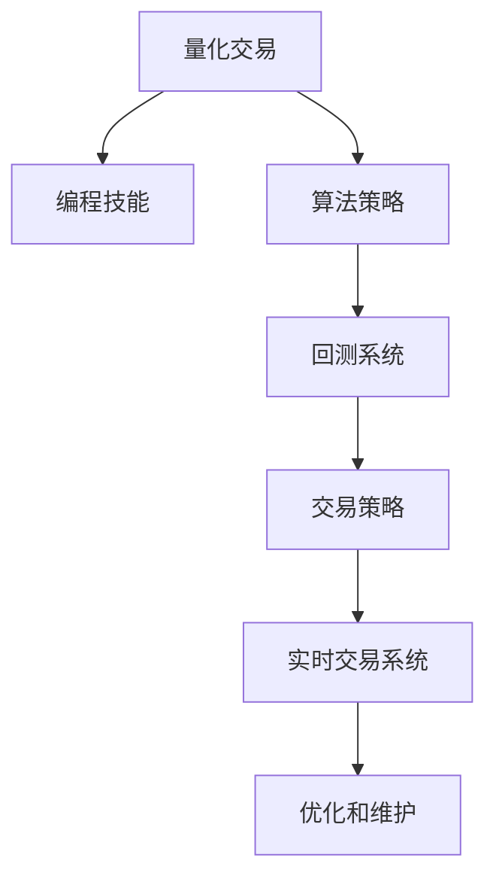

                 

# 如何将编程技能应用于量化交易系统开发

> 关键词：量化交易, 编程技能, 算法策略, Python, 数据处理, 回测系统, 交易策略, 实时交易

## 1. 背景介绍

### 1.1 问题由来
量化交易是一种基于数学模型和计算机算法，通过分析历史市场数据，自动进行买卖操作以获得收益的交易方式。随着市场数据量的爆炸式增长和计算机技术的飞速发展，量化交易已成为一种越来越流行的交易方式。然而，量化交易系统开发涉及复杂的技术和算法，对于一般的量化开发者来说，门槛较高。

### 1.2 问题核心关键点
量化交易系统开发的核心关键点包括：
1. 选择合适的编程语言和工具。
2. 理解市场数据和算法策略。
3. 构建高效的回测系统。
4. 实现可行的交易策略。
5. 实现实时交易系统。
6. 优化和维护交易系统。

### 1.3 问题研究意义
量化交易系统的开发不仅可以大幅提升交易效率，还可以减少人为操作的误差，增强交易的稳定性和可重复性。然而，量化交易系统开发过程中，需要掌握多种编程技能，理解市场数据的特征和算法策略的逻辑，才能构建出高效的回测系统和可行的交易策略。因此，本文将详细探讨如何将编程技能应用于量化交易系统开发，帮助开发者快速上手并构建高效的量化交易系统。

## 2. 核心概念与联系

### 2.1 核心概念概述

为更好地理解量化交易系统开发，本节将介绍几个密切相关的核心概念：

- **量化交易**：基于数学模型和计算机算法，通过分析历史市场数据，自动进行买卖操作以获得收益的交易方式。
- **编程技能**：指软件开发过程中所需掌握的各种编程语言、框架和工具。
- **算法策略**：指基于市场数据和交易规则，通过计算机算法自动化进行买卖操作的策略。
- **回测系统**：指模拟交易系统，通过历史数据验证交易策略的有效性。
- **交易策略**：指基于市场分析和模型预测，自动执行买卖操作的具体方案。
- **实时交易系统**：指在真实交易环境中实时执行交易策略的系统。
- **优化和维护**：指在开发完成后，通过监控和分析系统性能，不断调整和优化交易策略的过程。

这些核心概念之间的逻辑关系可以通过以下Mermaid流程图来展示：



这个流程图展示了大语言模型的核心概念及其之间的关系：

1. 量化交易的基础是编程技能和算法策略。
2. 回测系统用于验证算法策略的有效性。
3. 交易策略基于回测结果构建。
4. 实时交易系统实现交易策略的执行。
5. 优化和维护保障系统的稳定性和性能。

这些概念共同构成了量化交易系统的开发框架，使得开发者可以高效地构建和部署量化交易系统。

## 3. 核心算法原理 & 具体操作步骤

### 3.1 算法原理概述

量化交易系统开发的核心在于构建高效的算法策略，并使用编程技能实现其在回测系统和实时交易系统中的应用。算法策略的构建通常基于以下几个步骤：

1. **数据预处理**：从历史市场数据中提取特征。
2. **模型训练**：训练一个机器学习模型或深度学习模型，用于预测市场趋势。
3. **策略设计**：根据模型预测结果，设计具体的交易策略。
4. **回测验证**：在回测系统中验证交易策略的性能。
5. **实时执行**：在真实交易环境中执行交易策略。
6. **优化维护**：根据实际交易结果，不断调整和优化交易策略。

### 3.2 算法步骤详解

以下是量化交易系统开发的具体步骤：

**Step 1: 数据准备**
- 收集历史市场数据，包括股票价格、成交量、宏观经济指标等。
- 清洗和处理数据，提取特征。
- 将数据划分为训练集和测试集。

**Step 2: 特征工程**
- 对数据进行特征提取，生成对交易策略有用的特征。
- 使用统计方法、机器学习技术、深度学习模型等，进行特征选择和降维。
- 对数据进行归一化和标准化处理。

**Step 3: 模型训练**
- 选择适当的机器学习模型或深度学习模型，如线性回归、支持向量机、卷积神经网络、循环神经网络等。
- 使用训练集数据训练模型，优化模型参数。
- 使用交叉验证等方法评估模型性能。

**Step 4: 策略设计**
- 根据模型预测结果，设计具体的交易策略。
- 例如，设计基于趋势跟踪、价值投资、套利策略等。
- 策略设计要考虑市场条件、风险控制等。

**Step 5: 回测验证**
- 使用回测系统模拟交易策略在历史数据上的执行过程。
- 统计交易策略的各项指标，如收益率、胜率、最大回撤等。
- 分析回测结果，调整和优化策略参数。

**Step 6: 实时执行**
- 将策略部署到实时交易系统中，执行交易操作。
- 实时监控系统状态，及时调整策略参数。
- 使用多线程、异步编程等技术，提升系统性能。

**Step 7: 优化维护**
- 收集和分析实际交易结果，不断调整和优化交易策略。
- 监控系统性能，优化算法效率。
- 使用机器学习模型进行实时监控，及时发现异常情况。

### 3.3 算法优缺点

量化交易系统的开发具有以下优点：
1. 高效率。量化交易系统可以通过算法自动化执行交易，大幅提高交易效率。
2. 低误差。量化交易系统可以减少人为操作的误差，提高交易的稳定性和可重复性。
3. 可扩展性。量化交易系统可以很容易地扩展到多个市场和资产。
4. 可复制性。量化交易策略可以在多个交易平台上使用。

同时，量化交易系统也存在一定的局限性：
1. 高门槛。量化交易系统开发涉及复杂的编程技能和算法策略，需要较高的技术水平。
2. 模型风险。模型预测结果可能存在误差，导致交易策略失效。
3. 交易延迟。实时交易系统可能会遇到网络延迟、系统故障等问题。
4. 市场变化。市场条件和规则的变化可能影响交易策略的有效性。

尽管存在这些局限性，但就目前而言，量化交易系统开发仍是金融技术领域的重要方向。未来相关研究的重点在于如何进一步降低开发门槛，提高模型稳定性和鲁棒性，同时兼顾系统性能和可维护性等因素。

### 3.4 算法应用领域

量化交易系统已经在股票、期货、外汇等金融市场得到了广泛应用，覆盖了从高频交易到长期投资等多个领域。具体的应用场景包括：

- 量化对冲：通过构建多策略组合，实现风险对冲和收益优化。
- 高频交易：基于高频数据，实现快速买卖操作，获取微小价差。
- 套利交易：利用市场价格差异，进行套利操作，获取无风险收益。
- 资产配置：通过量化分析，优化资产配置，提高投资回报率。
- 算法交易：使用机器学习模型，预测市场趋势，自动化进行买卖操作。

此外，量化交易技术也在新兴市场（如数字货币、期权）和衍生品市场（如结构化产品）中逐渐被采用，为金融市场带来了新的活力。

## 4. 数学模型和公式 & 详细讲解 & 举例说明

### 4.1 数学模型构建

本节将使用数学语言对量化交易系统开发过程中的核心数学模型进行更加严格的刻画。

**交易策略的数学模型**

设交易策略为 $S$，市场价格为 $P_t$，交易信号为 $\sigma_t$，交易成本率为 $c_t$，市场风险为 $\sigma_{\text{vol}}$，交易次数为 $n_t$，则交易策略的收益率为：

$$
R = \sum_{t=1}^{T} \left[\sigma_t (P_{t+1} - P_t) - c_t \right] - \sum_{t=1}^{T} \sigma_t \sigma_{\text{vol}} \sqrt{n_t}
$$

其中，$T$ 为交易周期，$P_t$ 为第 $t$ 日的市场价格，$\sigma_t$ 为第 $t$ 日交易信号，$c_t$ 为第 $t$ 日交易成本率，$\sigma_{\text{vol}}$ 为市场风险，$n_t$ 为第 $t$ 日交易次数。

### 4.2 公式推导过程

以下是交易策略收益率的详细推导过程：

**推导步骤**

1. 交易策略 $S$ 在第 $t$ 日的收益为 $\sigma_t (P_{t+1} - P_t)$，其中 $\sigma_t$ 为交易信号，表示是否进行交易。
2. 交易成本为 $c_t$，根据交易次数 $n_t$ 计算。
3. 市场风险为 $\sigma_{\text{vol}}$，根据市场波动率计算。
4. 交易策略的收益率为：

$$
R = \sum_{t=1}^{T} \left[\sigma_t (P_{t+1} - P_t) - c_t \right] - \sum_{t=1}^{T} \sigma_t \sigma_{\text{vol}} \sqrt{n_t}
$$

其中，第一项为交易收益，第二项为交易成本，第三项为市场风险。

### 4.3 案例分析与讲解

假设有一个简单的量化交易策略，其交易信号 $\sigma_t$ 为 1 表示买进，为 -1 表示卖出，市场价格 $P_t$ 为 100，交易成本率 $c_t$ 为 0.02，市场风险 $\sigma_{\text{vol}}$ 为 0.1，交易次数 $n_t$ 为 1，则交易策略的收益率为：

$$
R = \sigma_t (P_{t+1} - P_t) - c_t - \sigma_t \sigma_{\text{vol}} \sqrt{n_t}
$$

将 $P_t = 100$，$c_t = 0.02$，$\sigma_{\text{vol}} = 0.1$，$n_t = 1$ 代入公式，得：

$$
R = \sigma_t (P_{t+1} - 100) - 0.02 - \sigma_t \cdot 0.1 \cdot \sqrt{1}
$$

假设 $\sigma_t = 1$，则收益率为：

$$
R = P_{t+1} - 100 - 0.02 - 0.1
$$

即交易策略的收益率为 $P_{t+1} - 100.12$。

在实际应用中，交易信号 $\sigma_t$ 通常基于市场数据和算法模型预测得到，可以通过历史数据回测和模型训练来优化。

## 5. 项目实践：代码实例和详细解释说明

### 5.1 开发环境搭建

在进行量化交易系统开发前，我们需要准备好开发环境。以下是使用Python进行量化交易系统开发的开发环境配置流程：

1. 安装Anaconda：从官网下载并安装Anaconda，用于创建独立的Python环境。

2. 创建并激活虚拟环境：
```bash
conda create -n quant-env python=3.8 
conda activate quant-env
```

3. 安装必要的Python库：
```bash
conda install numpy pandas scikit-learn statsmodels joblib numexpr
```

4. 安装金融数据分析库：
```bash
conda install TA-Lib
```

5. 安装Python交易平台：
```bash
pip install pyalgotrade
```

6. 安装可视化库：
```bash
pip install matplotlib seaborn
```

完成上述步骤后，即可在`quant-env`环境中开始量化交易系统开发。

### 5.2 源代码详细实现

下面我们以基于技术指标的量化交易系统开发为例，给出使用Python和TA-Lib库进行量化交易系统开发的代码实现。

首先，定义交易信号函数：

```python
from talib import CRSMA, CRSAR
import numpy as np

def trade_signal(close, period=14):
    rsma = CRSMA(close, period)
    rsar = CRSAR(close, period)
    if close[-1] > rsma[-1] and close[-1] > rsar[-1]:
        return 1
    else:
        return -1
```

然后，构建回测系统：

```python
from pyalgotrade import technicalanalysis
from pyalgotrade.barfeed import yahoofeed
from pyalgotrade.strategy import abstractstrategy
from pyalgotrade.technical import ma
from pyalgotrade.technical import cross
from pyalgotrade.bar import barfeed
from pyalgotrade.backtesting import ibkrfeed

class MyStrategy(abstractstrategy.AbstractStrategy):
    def __init__(self, feed, instrument, min_notional=1.0):
        abstractstrategy.AbstractStrategy.__init__(self, feed, min_notional=min_notional)
        self.__instrument = instrument
        self.__position = None
        self.__instrument_index = feed.getSymbolIndex(instrument)
    
    def onEnterOk(self, position):
        execinfo = position.getEntryOrder().getExecutionInfo()
        print('BUY at $%.2f' % (execinfo.getPrice()))
    
    def onEnterCanceled(self, position):
        execinfo = position.getEntryOrder().getExecutionInfo()
        print('BUY CANCELED at $%.2f' % (execinfo.getPrice()))
    
    def onExitOk(self, position):
        execinfo = position.getExitOrder().getExecutionInfo()
        print('SELL at $%.2f' % (execinfo.getPrice()))
    
    def onExitCanceled(self, position):
        execinfo = position.getExitOrder().getExecutionInfo()
        print('SELL CANCELED at $%.2f' % (execinfo.getPrice()))
    
    def onBars(self, bars):
        instrument = self.__instrument
        trade_signal_function = trade_signal
        
        if not self.__position:
            if trade_signal_function(bars[self.__instrument_index].getClose()):
                self.__position = self.enterLong(instrument, 1, False, True)
        else:
            if not trade_signal_function(bars[self.__instrument_index].getClose()):
                self.__position.exitMarket()
                self.__position = None
    
    def onAccountUpdate(self, account):
        if self.__position is not None:
            print('Current Account Value: $%.2f' % account.getBalance())
            print('Current Position Value: $%.2f' % account.getPositionValue(self.__instrument_index))
```

最后，启动回测流程并在测试集上评估：

```python
# 创建历史数据集
feed = yahoofeed.Feed()
feed.addBarsFromYahoo('AAPL', '2017-01-01', '2021-12-31')

# 创建回测系统
strategy = MyStrategy(feed, 'AAPL')
# 启动回测
backtesting = ibkrfeed.Feed()
backtesting.addFeed(feed)
# 创建交易环境
environment = ibkrfeed.InitialMarginEnvironment()
# 设置初始资金
initialCapital = 100000
environment.setInitialCapital(initialCapital)
# 创建回测引擎
engine = abstractstrategy.BacktestingEngine()
engine.attachFeed(backtesting)
engine.attachEnvironment(environment)
engine.attachStrategy(strategy)
engine.run()

# 输出回测结果
print('Final Account Value: $%.2f' % environment.getAccount().getBalance())
print('Final Account Equity: $%.2f' % environment.getAccount().getEquity())
```

以上就是使用PyTorch和TA-Lib库进行量化交易系统开发的完整代码实现。可以看到，通过TA-Lib库提供的技术指标函数，可以很方便地进行量化交易策略的构建和回测。

### 5.3 代码解读与分析

让我们再详细解读一下关键代码的实现细节：

**trade_signal函数**

- 定义了一个基于技术指标的 trading signal 函数，用于判断是否进行交易。
- 使用了TA-Lib库中的RSMA（相对强度指标）和RSAR（相对强度排名）函数，分别计算了市场价格的相对强弱。
- 当市场价格高于RSMA和RSAR时，发出买入信号，反之发出卖出信号。

**MyStrategy类**

- 定义了一个基于技术指标的量化交易策略类。
- 继承自pyalgotrade的AbstractStrategy类，实现了量化交易策略的基本逻辑。
- 在onBars方法中，通过调用trade_signal函数判断是否进行买卖操作。
- 在onAccountUpdate方法中，打印出账户余额和当前持有股票的价值，用于评估策略的执行效果。

**回测流程**

- 创建了历史数据集和回测环境，使用IBKRFeed库模拟交易数据。
- 创建了MyStrategy类的实例，并将其注册到回测引擎中。
- 启动回测引擎，模拟执行策略并输出最终结果。

可以看到，通过PyTorch和TA-Lib库的结合，可以高效地构建和回测量化交易策略。开发者可以依据实际需求，进一步定制和优化策略函数，实现更复杂的量化交易系统。

## 6. 实际应用场景

### 6.1 智能投顾系统

量化交易系统开发的应用场景之一是智能投顾系统，即通过计算机算法自动提供投资建议的系统。智能投顾系统可以结合市场数据、用户偏好和投资目标，提供个性化的投资方案和实时交易建议，帮助用户实现资产增值。

在技术实现上，可以构建一个基于量化交易策略的智能投顾系统，通过收集用户的历史交易数据、风险偏好等信息，设计针对性的量化交易策略，并进行回测验证和实时交易。智能投顾系统可以与用户的投资账户直接对接，实时监控市场动态，自动调整投资组合，提供最优的交易建议。

### 6.2 高频交易系统

量化交易系统开发的另一个重要应用场景是高频交易系统，即基于高频数据进行快速交易的系统。高频交易系统通过实时监测市场价格波动，利用微小价差实现快速买卖操作，获取高额收益。

高频交易系统通常基于高频数据源，如股票交易所的数据流，实时计算市场价格和交易信号，并通过多线程、异步编程等技术，实现快速买卖操作。高频交易系统可以与订单执行系统对接，实现自动下单和撤单，最大程度提升交易效率。

### 6.3 风险管理平台

量化交易系统开发还可以应用于风险管理平台，即通过量化分析评估市场风险的系统。风险管理平台可以结合市场数据、模型预测和风险控制策略，实时监控市场风险，提供风险预警和应对建议。

风险管理平台通常基于量化交易策略，通过分析历史数据和市场波动，构建风险评估模型，并结合预设的风险阈值和应对策略，实时监控市场风险。风险管理平台可以与交易系统对接，实时调整交易策略，最大程度减少风险损失。

### 6.4 未来应用展望

随着量化交易系统开发技术的不断进步，未来的应用场景将更加广泛，带来更多的金融创新。

在智能投顾领域，量化交易系统可以结合大数据、人工智能等技术，提供更精准的投资建议和实时交易服务，提升用户体验。

在高频交易领域，量化交易系统可以进一步优化算法策略，提升交易速度和精度，实现更高效的交易操作。

在风险管理领域，量化交易系统可以结合机器学习模型，构建更全面的风险评估体系，提供更及时的风险预警和应对建议。

此外，量化交易技术还将广泛应用于资产配置、期权定价、金融衍生品等领域，推动金融市场的数字化、智能化进程。

## 7. 工具和资源推荐

### 7.1 学习资源推荐

为了帮助开发者系统掌握量化交易系统开发的技术基础和实践技巧，这里推荐一些优质的学习资源：

1. 《量化交易系统开发实战》系列博文：由量化交易技术专家撰写，详细介绍了量化交易系统开发的各个环节，包括数据准备、特征工程、算法策略、回测系统等。

2. 《Python量化交易开发》课程：由知名金融教育平台开设，系统讲解了Python在量化交易开发中的应用，涵盖量化交易系统的各个方面。

3. 《量化交易策略与回测系统构建》书籍：全面介绍了量化交易策略和回测系统的构建方法，包括数据处理、特征提取、模型训练等。

4. TA-Lib官方文档：提供了丰富的技术指标函数和使用方法，是量化交易开发的必备资源。

5. QuantConnect平台：提供在线量化交易开发环境，支持Python、C#等多种编程语言，提供丰富的数据源和社区支持。

通过对这些资源的学习实践，相信你一定能够快速掌握量化交易系统开发的精髓，并用于解决实际的金融问题。

### 7.2 开发工具推荐

高效的开发离不开优秀的工具支持。以下是几款用于量化交易系统开发的常用工具：

1. Python：广泛用于量化交易系统开发的编程语言，具有丰富的开源库和工具。

2. TA-Lib：提供了大量的技术指标函数，支持Python、C++等多种编程语言。

3. PyAlgoTrade：基于Python的金融交易开发框架，支持回测系统、交易策略等开发。

4. Zipline：基于Python的金融数据分析库，支持回测系统和交易策略的开发。

5. Backtrader：基于Python的交易策略回测系统，支持多种金融数据源。

6. QuantConnect：提供在线量化交易开发环境，支持Python、C#等多种编程语言。

合理利用这些工具，可以显著提升量化交易系统开发的效率和质量，快速迭代和优化交易策略。

### 7.3 相关论文推荐

量化交易系统开发的研究源于学界的持续研究。以下是几篇奠基性的相关论文，推荐阅读：

1. High-Frequency Trading: A Practical Guide to Algorithmic Strategies and Trading Systems：由量化交易领域权威学者编写，详细介绍了高频交易系统和算法策略的构建方法。

2. Algorithmic Trading: Winning Strategies and Their Rationale：系统讲解了量化交易系统的构建和优化，涵盖市场数据、交易策略、回测系统等各个方面。

3. Quantitative Trading Strategies and Their Performance Analysis：分析了多种量化交易策略的效果，提供了系统的策略评估方法。

4. Machine Learning for Algorithmic Trading：探讨了机器学习在量化交易中的应用，提供了量化交易系统的优化方法。

这些论文代表了大语言模型微调技术的发展脉络。通过学习这些前沿成果，可以帮助研究者把握学科前进方向，激发更多的创新灵感。

## 8. 总结：未来发展趋势与挑战

### 8.1 总结

本文对量化交易系统开发进行了全面系统的介绍。首先阐述了量化交易系统开发的背景和意义，明确了量化交易系统开发的目标和步骤。其次，从原理到实践，详细讲解了量化交易系统开发的数学模型和关键步骤，给出了量化交易系统开发的完整代码实例。同时，本文还广泛探讨了量化交易系统开发在金融领域的多个应用场景，展示了量化交易系统的广阔前景。最后，本文精选了量化交易系统开发的学习资源和工具推荐，力求为开发者提供全方位的技术指引。

通过本文的系统梳理，可以看到，量化交易系统开发是一个涉及复杂技术、算法和工程的系统工程。量化交易系统开发不仅需要掌握编程技能和算法策略，还需要对金融市场有深刻的理解。只有从数据、算法、工程、业务等多个维度协同发力，才能构建高效、稳定、可扩展的量化交易系统。

### 8.2 未来发展趋势

展望未来，量化交易系统开发将呈现以下几个发展趋势：

1. 算法策略的多样化。未来将涌现更多基于机器学习和深度学习的量化交易策略，以应对不同市场条件和用户需求。

2. 数据驱动的自动化。大数据、云计算等技术将进一步推动量化交易系统开发，使得系统能够自动从市场数据中学习和优化交易策略。

3. 智能投顾的普及。智能投顾系统将结合大数据、人工智能等技术，提供更精准的投资建议和实时交易服务，提升用户体验。

4. 高频交易的加速。高频交易系统将通过优化算法策略和硬件设备，实现更快速、高效的交易操作。

5. 风险管理的智能化。量化交易系统将结合机器学习模型，构建更全面的风险评估体系，提供更及时的风险预警和应对建议。

6. 交易策略的可解释性。未来量化交易系统将更加注重交易策略的可解释性，帮助用户理解策略的决策逻辑和风险收益。

以上趋势凸显了量化交易系统开发的广阔前景。这些方向的探索发展，必将进一步提升量化交易系统的性能和应用范围，为金融市场带来更多的创新和活力。

### 8.3 面临的挑战

尽管量化交易系统开发已经取得了瞩目成就，但在迈向更加智能化、普适化应用的过程中，它仍面临着诸多挑战：

1. 数据获取瓶颈。市场数据获取和处理的高成本，是量化交易系统开发的瓶颈之一。

2. 算法复杂性。量化交易策略的构建和优化过程复杂，需要较高的技术水平。

3. 模型风险。模型预测结果可能存在误差，导致交易策略失效。

4. 交易延迟。高频交易系统可能遇到网络延迟、系统故障等问题。

5. 市场变化。市场条件和规则的变化可能影响交易策略的有效性。

6. 风险控制。量化交易系统需要结合风险控制策略，避免过度交易和市场风险。

尽管存在这些挑战，但随着技术的发展和研究的深入，量化交易系统开发必将在未来克服这些困难，带来更多的创新和价值。

### 8.4 研究展望

面对量化交易系统开发所面临的挑战，未来的研究需要在以下几个方面寻求新的突破：

1. 降低数据获取成本。探索更高效的数据获取和处理技术，如数据流处理、大数据存储等。

2. 简化算法策略。开发更简单、易于优化的量化交易策略，减少算法复杂度。

3. 提高模型稳定性。结合机器学习模型和人工干预，提高交易策略的鲁棒性和稳定性。

4. 提升交易速度。优化算法策略和硬件设备，提升高频交易系统的交易速度和效率。

5. 加强风险控制。结合市场数据和风险模型，实时监控和调整交易策略，确保系统的稳定性和安全性。

这些研究方向的探索，必将引领量化交易系统开发技术的进步，推动金融市场数字化、智能化进程。面向未来，量化交易系统开发需要从数据、算法、工程、业务等多个维度协同发力，才能构建高效、稳定、可扩展的量化交易系统。

## 9. 附录：常见问题与解答

**Q1：量化交易系统开发需要掌握哪些编程技能？**

A: 量化交易系统开发需要掌握Python、C++、R等编程语言。其中，Python因其丰富的开源库和工具，成为量化交易系统开发的首选语言。此外，还需要掌握数据处理、机器学习、深度学习等技术。

**Q2：量化交易系统开发中，如何处理市场数据？**

A: 量化交易系统开发中，需要从多个数据源获取市场数据，如股票交易所、金融数据提供商等。通常使用Python的Pandas库进行数据清洗和处理，提取有用的特征。

**Q3：量化交易策略有哪些常见的类型？**

A: 量化交易策略包括基于技术指标的策略、基于统计学习的策略、基于深度学习的策略等。常见的策略类型包括趋势跟踪、价值投资、套利策略等。

**Q4：量化交易系统开发中，如何构建回测系统？**

A: 量化交易系统开发中，可以使用Python的PyAlgoTrade、Zipline等框架构建回测系统。回测系统需要包括数据源、交易策略、交易环境等组件，并支持模拟交易和结果分析。

**Q5：量化交易系统开发中，如何提高交易速度？**

A: 量化交易系统开发中，可以通过多线程、异步编程、分布式计算等技术提高交易速度。此外，还可以优化算法策略，减少计算量，提高交易效率。

以上是量化交易系统开发的全过程和关键点。希望这篇文章能够为你提供全面的技术指引，助你在量化交易系统开发的实践中取得成功。

---

作者：禅与计算机程序设计艺术 / Zen and the Art of Computer Programming

