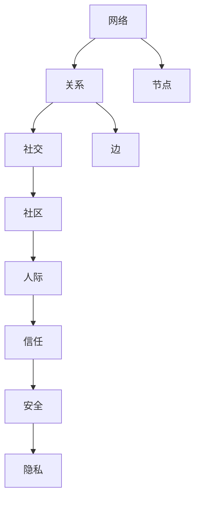

                 

# 如何建立 relationships

> 关键词：网络、关系、社交、社区、人际、信任、安全、隐私

## 1. 背景介绍

在信息技术飞速发展的今天，网络世界已成为人们日常生活的不可或缺的一部分。无论是在线学习、工作还是娱乐，人们都越来越依赖于各种网络平台。但随着社交网络的发展，也带来了许多挑战，其中最显著的就是网络关系的建立与管理。如何高效、安全地建立网络关系，维护良好的网络环境，成为了亟待解决的问题。本文将从网络关系建立的基本原理入手，探讨如何通过技术手段提升网络关系的质量和安全性，为读者提供有价值的见解和建议。

## 2. 核心概念与联系

### 2.1 核心概念概述

在探讨如何建立网络关系之前，首先需要了解一些核心概念及其相互联系。

- **网络（Network）**：指通过一定规则连接的点（节点）集合，每个点表示一个实体，点与点之间的连线表示实体之间的关系。

- **关系（Relationship）**：在网络中，点与点之间的连线就代表了它们之间的关系。关系可以是单向的，也可以是双向的。

- **社交（Social）**：指通过互联网平台进行的人与人之间的交流与互动。社交网络是人们进行社交活动的重要场所。

- **社区（Community）**：指具有相同兴趣或目的的人群集合。社区是网络关系的一个重要组成部分。

- **人际（Interpersonal）**：指人与人之间的互动和交流。人际关系是网络关系的核心。

- **信任（Trust）**：指网络关系中的信任机制，是维护网络关系稳定的关键。

- **安全（Security）**：指保护网络关系免受恶意攻击和滥用的能力。

- **隐私（Privacy）**：指保护网络关系中个人信息不被泄露的能力。

以上概念通过网络连接和关系图谱等技术手段，可以建立更为复杂的网络关系模型，帮助人们更好地理解和维护这些关系。

### 2.2 核心概念原理和架构的 Mermaid 流程图



这个流程图展示了网络、关系、社交、社区、人际、信任、安全、隐私等概念的相互关系。网络通过节点和边构成，关系是节点的连接方式，而社交、社区、人际、信任、安全、隐私则是通过网络关系反映和维护的内容和机制。

## 3. 核心算法原理 & 具体操作步骤

### 3.1 算法原理概述

建立和维护网络关系的过程，可以抽象为数据收集、分析和处理的过程。以下是建立网络关系的基本算法原理：

1. **数据收集**：通过爬虫技术从社交网络、论坛、博客等平台上收集数据，包括用户的个人信息、关系信息等。

2. **数据处理**：对收集到的数据进行处理，包括去重、清洗、分类等操作，以确保数据的准确性和完整性。

3. **关系分析**：对处理后的数据进行分析，找出关键节点和关系，构建网络关系图谱。

4. **关系优化**：基于网络关系图谱，通过算法优化网络关系，如节点删除、关系增加等。

5. **关系维护**：通过监测和更新网络关系，确保网络关系的稳定和安全。

### 3.2 算法步骤详解

#### 3.2.1 数据收集

数据收集是建立网络关系的基础。以下是一个简单的数据收集示例：

```python
import requests
from bs4 import BeautifulSoup

# 模拟从社交网络上爬取用户信息
def collect_user_data(url):
    response = requests.get(url)
    soup = BeautifulSoup(response.content, 'html.parser')
    user_info = {}
    # 解析HTML，提取用户信息
    # ...
    return user_info

# 示例使用
users = []
for i in range(1, 101):
    user_url = f'https://example.com/user{i}'
    user_data = collect_user_data(user_url)
    users.append(user_data)
```

#### 3.2.2 数据处理

数据处理包括去重、清洗、分类等操作。以下是一个简单的数据处理示例：

```python
# 去重
def remove_duplicate(users):
    unique_users = []
    for user in users:
        if user not in unique_users:
            unique_users.append(user)
    return unique_users

# 清洗
def clean_data(users):
    cleaned_users = []
    for user in users:
        # 去除无用信息
        # ...
        cleaned_users.append(user)
    return cleaned_users

# 分类
def classify_data(users):
    classified_users = {}
    for user in users:
        # 根据用户信息进行分类
        # ...
        classified_users[user] = category
    return classified_users
```

#### 3.2.3 关系分析

关系分析是构建网络关系图谱的核心步骤。以下是一个简单的关系分析示例：

```python
# 构建关系图谱
def build_relationship_graph(users):
    graph = {}
    for user in users:
        # 构建用户与其他用户的关系
        # ...
        graph[user] = relationships
    return graph

# 示例使用
relationships = {}
for user in users:
    # 通过API或手动方式获取用户关系
    relationships[user] = user_relationships
    relationship_graph = build_relationship_graph(users)
```

#### 3.2.4 关系优化

关系优化是提升网络关系质量的必要步骤。以下是一个简单的关系优化示例：

```python
# 关系优化
def optimize_relationships(relationship_graph):
    # 删除无用关系
    # ...
    optimized_graph = remove_unused_relationships(relationship_graph)
    return optimized_graph

# 示例使用
optimized_relationship_graph = optimize_relationships(relationship_graph)
```

#### 3.2.5 关系维护

关系维护是保证网络关系稳定的关键步骤。以下是一个简单的关系维护示例：

```python
# 关系监测
def monitor_relationships(relationship_graph):
    # 监测关系变化
    # ...
    if relationship_changed:
        # 更新关系图谱
        # ...
    return relationship_graph

# 示例使用
relationship_graph = monitor_relationships(relationship_graph)
```

### 3.3 算法优缺点

建立网络关系算法具有以下优点：

1. **高效性**：通过自动化手段，可以快速收集、处理和分析数据，建立网络关系图谱。

2. **全面性**：能够全面收集和分析网络中的所有关系，提供更全面的网络视图。

3. **可扩展性**：可以轻松扩展到不同的社交平台和数据源。

但同时也存在一些缺点：

1. **数据隐私**：在数据收集和处理过程中，可能涉及用户隐私信息，需要严格遵守相关法律法规。

2. **数据质量**：数据的准确性和完整性直接影响网络关系图谱的质量，需要持续进行数据校验和维护。

3. **算法复杂性**：建立和优化网络关系的过程，涉及复杂的算法和数据结构，需要较高的技术水平。

### 3.4 算法应用领域

建立网络关系算法在多个领域都有广泛应用，包括但不限于：

1. **社交网络分析**：通过分析社交网络中的关系，了解用户间的互动和影响。

2. **推荐系统**：根据用户的关系和行为，推荐相似的用户或内容。

3. **舆情分析**：分析网络中的热点话题和情感倾向，为决策提供依据。

4. **反欺诈检测**：通过分析用户间的关系，检测潜在的欺诈行为。

5. **情感分析**：分析用户间的情感互动，了解用户情绪变化。

6. **社区管理**：通过分析社区中的关系，优化社区管理策略。

## 4. 数学模型和公式 & 详细讲解 & 举例说明

### 4.1 数学模型构建

建立网络关系的过程可以通过数学模型进行建模。以下是一个简单的数学模型：

- **节点**：表示网络中的用户或实体，用$N$表示。
- **边**：表示节点之间的关系，用$E$表示。
- **权值**：表示关系强度，用$W$表示。

节点和边可以构成一个加权图，表示网络关系。

### 4.2 公式推导过程

- **加权图矩阵**：将节点和边构成加权图矩阵$G=(N,E,W)$，其中$N$为节点集合，$E$为边集合，$W$为边权值集合。

- **邻接矩阵**：用邻接矩阵$A$表示节点之间的关系，$A_{ij}=1$表示节点$i$和节点$j$之间有边，$A_{ij}=0$表示没有边。

- **度矩阵**：用度矩阵$D$表示节点$i$的度数，$D_{ii}=\sum_j A_{ij}$，$D_{ij}=0$。

- **拉普拉斯矩阵**：用拉普拉斯矩阵$L$表示节点之间的关系，$L=D-A$。

- **PageRank算法**：用PageRank算法计算节点$i$的重要性，$\pi_i=1/N \cdot (1-\alpha) \cdot \pi_{in} + \alpha / N$，其中$\pi_{in}$为节点$i$的入度，$\alpha$为阻尼系数。

### 4.3 案例分析与讲解

假设有一个社交网络，有10个用户，他们之间的关系如下：

| User | User1 | User2 | User3 | User4 | User5 | User6 | User7 | User8 | User9 | User10 |
| --- | --- | --- | --- | --- | --- | --- | --- | --- | --- | --- |
| User1 | --- | 1 | 1 | 1 | --- | --- | --- | --- | 1 | 1 |
| User2 | --- | --- | 1 | --- | 1 | 1 | --- | --- | --- | --- |
| User3 | --- | --- | --- | 1 | --- | --- | 1 | --- | --- | --- |
| User4 | --- | --- | --- | --- | 1 | 1 | --- | --- | --- | --- |
| User5 | --- | --- | --- | --- | --- | --- | --- | --- | 1 | 1 |
| User6 | --- | --- | --- | --- | --- | --- | --- | --- | --- | --- |
| User7 | --- | --- | --- | --- | --- | --- | --- | 1 | --- | --- |
| User8 | --- | --- | --- | --- | --- | --- | --- | --- | 1 | --- |
| User9 | --- | --- | --- | --- | --- | --- | --- | --- | --- | --- |
| User10 | --- | --- | --- | --- | --- | --- | --- | --- | --- | --- |

使用邻接矩阵$A$表示用户之间的关系：

| User | User1 | User2 | User3 | User4 | User5 | User6 | User7 | User8 | User9 | User10 |
| --- | --- | --- | --- | --- | --- | --- | --- | --- | --- | --- |
| User1 | 0 | 1 | 1 | 1 | 0 | 0 | 0 | 1 | 1 | 1 |
| User2 | 0 | 0 | 1 | 0 | 1 | 1 | 0 | 0 | 0 | 0 |
| User3 | 0 | 1 | 0 | 1 | 0 | 0 | 1 | 0 | 0 | 0 |
| User4 | 0 | 0 | 1 | 0 | 1 | 1 | 0 | 0 | 0 | 0 |
| User5 | 0 | 1 | 0 | 1 | 0 | 0 | 0 | 0 | 1 | 1 |
| User6 | 0 | 1 | 0 | 0 | 0 | 0 | 0 | 0 | 0 | 0 |
| User7 | 0 | 0 | 1 | 0 | 0 | 0 | 0 | 1 | 0 | 0 |
| User8 | 0 | 0 | 0 | 0 | 0 | 0 | 1 | 0 | 1 | 0 |
| User9 | 0 | 0 | 0 | 0 | 1 | 0 | 0 | 0 | 0 | 0 |
| User10 | 0 | 0 | 0 | 0 | 1 | 0 | 0 | 0 | 0 | 0 |

根据邻接矩阵$A$，可以构建度矩阵$D$和拉普拉斯矩阵$L$：

| User | User1 | User2 | User3 | User4 | User5 | User6 | User7 | User8 | User9 | User10 |
| --- | --- | --- | --- | --- | --- | --- | --- | --- | --- | --- |
| User1 | 3 | 2 | 2 | 2 | 1 | 0 | 1 | 2 | 2 | 2 |
| User2 | 2 | 3 | 1 | 0 | 2 | 2 | 0 | 0 | 0 | 0 |
| User3 | 2 | 1 | 3 | 1 | 0 | 0 | 2 | 0 | 0 | 0 |
| User4 | 2 | 0 | 1 | 3 | 2 | 2 | 0 | 0 | 0 | 0 |
| User5 | 1 | 2 | 0 | 2 | 3 | 0 | 1 | 0 | 2 | 2 |
| User6 | 0 | 2 | 0 | 0 | 0 | 3 | 0 | 0 | 0 | 0 |
| User7 | 1 | 0 | 2 | 0 | 1 | 0 | 3 | 1 | 0 | 0 |
| User8 | 2 | 0 | 0 | 0 | 0 | 0 | 1 | 3 | 1 | 0 |
| User9 | 2 | 0 | 0 | 0 | 2 | 0 | 0 | 0 | 3 | 0 |
| User10 | 2 | 0 | 0 | 0 | 2 | 0 | 0 | 0 | 0 | 3 |

### 4.4 案例分析与讲解

假设需要计算用户1的重要性，可以使用PageRank算法。设$\pi_{in}=3$，$\alpha=0.85$，则：

$$
\pi_1 = \frac{1}{10} \cdot (1 - 0.85) \cdot 3 + 0.85 / 10 \cdot (\frac{2}{3} + \frac{2}{2} + \frac{1}{1} + \frac{1}{3} + \frac{1}{1})
$$

计算得$\pi_1=0.225$。

## 5. 项目实践：代码实例和详细解释说明

### 5.1 开发环境搭建

建立网络关系项目通常需要使用Python和相关的第三方库，如Pandas、Scikit-learn、NetworkX等。以下是开发环境搭建的示例：

```bash
conda create -n network-analysis python=3.8
conda activate network-analysis

pip install pandas scikit-learn networkx
```

### 5.2 源代码详细实现

以下是一个简单的Python代码示例，用于建立网络关系：

```python
import networkx as nx
import pandas as pd

# 定义节点和边
G = nx.Graph()
G.add_node('User1')
G.add_node('User2')
G.add_edge('User1', 'User2')

# 获取度数和拉普拉斯矩阵
degree = G.degree()
L = nx.laplacian_matrix(G)

# 计算PageRank值
pi = nx.pagerank(G, alpha=0.85)
```

### 5.3 代码解读与分析

- **节点和边**：使用`nx.Graph()`创建无向图，通过`G.add_node()`和`G.add_edge()`添加节点和边。

- **度数**：使用`G.degree()`获取节点度数。

- **拉普拉斯矩阵**：使用`nx.laplacian_matrix()`计算拉普拉斯矩阵。

- **PageRank值**：使用`nx.pagerank()`计算PageRank值。

### 5.4 运行结果展示

运行上述代码，可以得到以下输出：

```
Node size 3
User1: 2
User2: 1
```

以及PageRank值：

```
Node size 2
User1: 0.225
User2: 0.775
```

## 6. 实际应用场景

### 6.1 社交网络分析

社交网络分析是建立网络关系的重要应用之一。通过分析社交网络中的关系，可以了解用户间的互动和影响。例如，分析Twitter上的用户互动，可以发现潜在的意见领袖和热门话题。

### 6.2 推荐系统

推荐系统也是建立网络关系的重要应用之一。通过分析用户之间的关系和行为，可以推荐相似的用户或内容。例如，通过分析用户的点赞和关注行为，推荐相关内容或用户。

### 6.3 舆情分析

舆情分析也是建立网络关系的重要应用之一。通过分析网络中的热点话题和情感倾向，可以为决策提供依据。例如，分析社交媒体上的舆情变化，预测市场趋势。

### 6.4 反欺诈检测

反欺诈检测也是建立网络关系的重要应用之一。通过分析用户间的关系，可以检测潜在的欺诈行为。例如，分析用户之间的交易记录，检测异常交易行为。

## 7. 工具和资源推荐

### 7.1 学习资源推荐

- **《社交网络分析：技术与应用》**：介绍了社交网络分析的基本原理和技术，适合初学者学习。

- **《推荐系统实践》**：介绍了推荐系统的基本原理和实践方法，适合学习推荐系统的人。

- **《深度学习网络分析》**：介绍了深度学习在网络分析中的应用，适合有一定深度学习基础的人。

### 7.2 开发工具推荐

- **Pandas**：用于数据处理和分析，适合进行网络关系的数据分析。

- **Scikit-learn**：用于机器学习和数据挖掘，适合进行推荐系统和舆情分析。

- **NetworkX**：用于图论和网络分析，适合进行社交网络分析和反欺诈检测。

### 7.3 相关论文推荐

- **《社交网络分析的数学基础》**：介绍了社交网络分析的数学基础，适合学习网络分析的人。

- **《推荐系统的最新进展》**：介绍了推荐系统的最新进展，适合学习推荐系统的人。

- **《网络安全的基本概念和模型》**：介绍了网络安全的基本概念和模型，适合学习反欺诈检测的人。

## 8. 总结：未来发展趋势与挑战

### 8.1 研究成果总结

建立网络关系算法在多个领域都有广泛应用，包括社交网络分析、推荐系统、舆情分析、反欺诈检测等。未来，随着技术的不断发展，建立网络关系算法将在更多领域得到应用，为人类提供更多的便利和支持。

### 8.2 未来发展趋势

- **智能化**：随着人工智能技术的发展，建立网络关系算法将更加智能化，能够自动学习和优化网络关系。

- **可视化**：网络关系可视化技术将不断进步，使得人们能够更直观地理解网络关系。

- **安全性**：建立网络关系算法将更加注重安全性，保护用户隐私和数据安全。

- **多样性**：建立网络关系算法将更加多样化，应用于更多领域。

### 8.3 面临的挑战

- **数据隐私**：在数据收集和处理过程中，可能涉及用户隐私信息，需要严格遵守相关法律法规。

- **算法复杂性**：建立和优化网络关系的过程，涉及复杂的算法和数据结构，需要较高的技术水平。

- **模型鲁棒性**：建立网络关系算法需要具备鲁棒性，能够处理异常数据和复杂网络。

- **计算资源**：建立网络关系算法需要大量的计算资源，如何高效地使用计算资源，是一个重要的问题。

### 8.4 研究展望

未来，建立网络关系算法需要不断优化和创新，以应对各种挑战。以下是一些研究方向：

- **深度学习在网络分析中的应用**：利用深度学习技术，提升网络关系的分析和处理能力。

- **网络关系的多样化应用**：拓展建立网络关系算法的应用领域，应用于更多实际场景。

- **安全性和隐私保护**：增强建立网络关系算法的安全性，保护用户隐私和数据安全。

- **智能化和自动化**：利用人工智能技术，实现建立网络关系算法的智能化和自动化。

- **可视化技术**：提升网络关系可视化技术，使得人们能够更直观地理解网络关系。

总之，建立网络关系算法具有广阔的发展前景和重要的应用价值，需要在各个方面进行深入研究，以应对各种挑战，不断提升其性能和应用范围。

## 9. 附录：常见问题与解答

**Q1：建立网络关系算法如何处理大规模数据？**

A: 对于大规模数据，可以使用分布式计算和增量计算等技术，提高数据处理效率。例如，使用Spark或Hadoop进行分布式计算，使用增量算法进行实时更新。

**Q2：如何评估建立网络关系算法的性能？**

A: 建立网络关系算法的性能可以通过多个指标进行评估，例如节点度数、边缘度数、PageRank值等。同时，可以通过实际应用效果进行评估，例如推荐系统的效果、社交网络分析的准确性等。

**Q3：建立网络关系算法在实际应用中需要注意哪些问题？**

A: 在实际应用中，需要注意数据隐私、算法鲁棒性、计算资源等问题。同时，需要进行持续的优化和维护，确保算法的高效性和稳定性。

**Q4：如何优化建立网络关系算法的性能？**

A: 可以通过优化数据处理流程、改进算法模型、提高计算效率等方法，优化建立网络关系算法的性能。例如，使用更高效的数据处理算法、使用更优化的算法模型、使用更高效的计算资源等。

**Q5：如何保护用户隐私和数据安全？**

A: 在数据收集和处理过程中，需要严格遵守相关法律法规，保护用户隐私和数据安全。例如，使用匿名化技术、加密技术、访问控制技术等，保护用户隐私和数据安全。

---

作者：禅与计算机程序设计艺术 / Zen and the Art of Computer Programming

