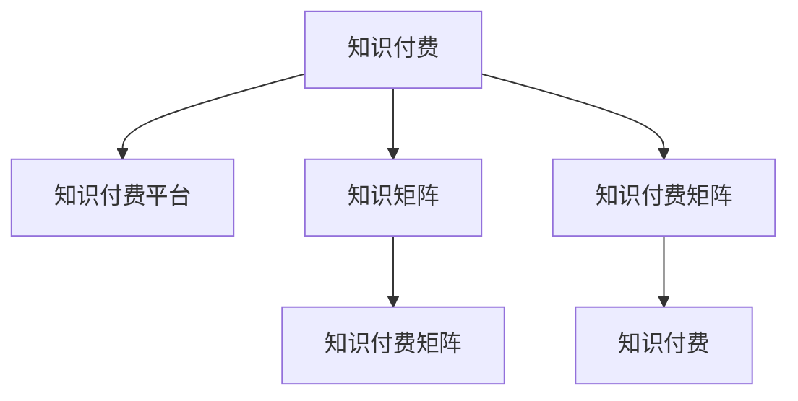

                 

# 如何打造个人知识付费矩阵

## 1. 背景介绍

在当今这个知识爆炸的时代，个人知识付费已经成为了一种趋势。通过建立自己的知识付费矩阵，个人可以系统化地梳理和传播自己的知识，实现从零到一的跨越。同时，知识付费也能带来经济上的收益，激励更多人投入到知识创造和分享中。本文将系统介绍如何构建个人知识付费矩阵，涵盖核心概念、算法原理、具体操作步骤、项目实践、应用场景、工具资源和未来展望等内容，为读者提供一份全面的指南。

## 2. 核心概念与联系

### 2.1 核心概念概述

构建个人知识付费矩阵，首先需要理解以下核心概念：

- **知识付费**：指通过付费方式获取知识，与免费获取知识的方式相对应。个人知识付费矩阵旨在帮助个人系统化地梳理和传播知识，通过付费获取知识，同时也能带来经济上的回报。

- **知识付费平台**：如微信读书、网易云课堂、得到等，提供了知识付费的渠道和方式，让知识创作者能够通过平台将自己的知识转化为付费内容。

- **知识矩阵**：指个人根据自身专业和兴趣，将所掌握的知识进行系统化的分类和组织，形成有机的知识体系结构。

- **知识付费矩阵**：在知识矩阵的基础上，通过构建个人知识付费体系，将知识内容转化为付费产品，进行市场化运作。

这些概念之间的关系可以用以下Mermaid流程图表示：



## 3. 核心算法原理 & 具体操作步骤

### 3.1 算法原理概述

个人知识付费矩阵的构建，本质上是一种知识管理和市场化的过程。其核心算法原理包括：

- **知识梳理**：将个人的知识进行梳理和分类，形成有机的知识体系结构。
- **内容创作**：基于知识体系结构，创作出系统化、高质量的知识内容。
- **市场化运作**：将知识内容转化为付费产品，通过平台进行市场化运作，获取经济回报。

### 3.2 算法步骤详解

#### 3.2.1 知识梳理

1. **确定知识主题**：根据个人兴趣和专业背景，确定知识主题。主题应具有覆盖广、深度足的特点。
2. **知识分类**：将知识主题按照层级进行分类，形成树状的知识体系结构。
3. **知识梳理**：对每个知识点进行详细梳理，包括定义、应用场景、案例分析等。

#### 3.2.2 内容创作

1. **确定知识内容**：根据知识分类，确定每个知识点的具体内容。内容应包括但不限于定义、原理、应用、案例分析等。
2. **撰写内容**：撰写高质量、系统化的知识内容。内容应具有逻辑性、可读性，避免冗余和重复。
3. **多媒体结合**：将内容与图片、视频、音频等多媒体元素结合，增加内容的丰富性和吸引力。

#### 3.2.3 市场化运作

1. **平台选择**：选择合适的知识付费平台，如微信读书、网易云课堂等。
2. **内容发布**：将知识内容发布到平台上，并进行市场推广。
3. **市场反馈**：根据市场反馈，不断优化和调整知识内容，提升用户满意度。
4. **收益分配**：根据平台规则，获取知识内容的付费收入，并进行合理分配。

### 3.3 算法优缺点

#### 3.3.1 优点

1. **系统化梳理知识**：知识付费矩阵通过系统化梳理和分类知识，帮助个人建立全面的知识体系。
2. **高效率传播知识**：通过平台进行市场化运作，知识传播效率高，覆盖面广。
3. **经济回报**：知识付费矩阵能够带来经济回报，激励更多人参与知识创造和分享。

#### 3.3.2 缺点

1. **时间和精力投入大**：知识梳理和内容创作需要大量的时间和精力投入。
2. **市场需求不确定**：知识内容市场需求具有不确定性，存在失败的风险。
3. **内容质量要求高**：高质量的知识内容才能吸引用户，需要不断提升创作水平。

### 3.4 算法应用领域

个人知识付费矩阵的应用领域包括但不限于：

- **个人品牌塑造**：通过系统化传播知识，提升个人品牌影响力。
- **职业发展**：通过知识和技能分享，获得职业上的认可和提升。
- **教育培训**：将自己的知识转化为教育培训内容，实现知识和技能传播。
- **咨询顾问**：基于专业知识，提供咨询服务，获取经济回报。

## 4. 数学模型和公式 & 详细讲解 & 举例说明

### 4.1 数学模型构建

假设个人有 $n$ 个知识点，每个知识点 $i$ 的深度为 $d_i$，总分值 $s_i$，覆盖用户 $u_i$，市场单价 $p_i$，则知识矩阵 $K$ 可以表示为：

$$
K = \begin{bmatrix}
s_1 & d_1 & u_1 & p_1 \\
s_2 & d_2 & u_2 & p_2 \\
\vdots & \vdots & \vdots & \vdots \\
s_n & d_n & u_n & p_n
\end{bmatrix}
$$

其中 $s_i$ 为知识点 $i$ 的分值，$d_i$ 为深度，$u_i$ 为覆盖用户数，$p_i$ 为市场单价。

### 4.2 公式推导过程

知识矩阵 $K$ 的优化目标是最大化总收益 $R$，即：

$$
R = \sum_{i=1}^n p_i \cdot u_i
$$

其中 $p_i$ 为市场单价，$u_i$ 为覆盖用户数。

目标函数可以表示为：

$$
\max \sum_{i=1}^n p_i \cdot u_i
$$

约束条件为：

$$
\begin{aligned}
& s_i + d_i + u_i + p_i \leq C \\
& 0 \leq s_i, d_i, u_i, p_i \leq B
\end{aligned}
$$

其中 $C$ 为总预算，$B$ 为单项最大值。

### 4.3 案例分析与讲解

以知识付费平台知乎为例，其知识矩阵可以表示为：

$$
K = \begin{bmatrix}
s_1 & d_1 & u_1 & p_1 \\
s_2 & d_2 & u_2 & p_2 \\
\vdots & \vdots & \vdots & \vdots \\
s_n & d_n & u_n & p_n
\end{bmatrix}
$$

其中 $s_i$ 为文章分值，$d_i$ 为文章深度，$u_i$ 为阅读用户数，$p_i$ 为文章市场单价。

假设总预算为 $C$，单项最大值为 $B$，则目标函数为：

$$
\max \sum_{i=1}^n p_i \cdot u_i
$$

约束条件为：

$$
\begin{aligned}
& s_i + d_i + u_i + p_i \leq C \\
& 0 \leq s_i, d_i, u_i, p_i \leq B
\end{aligned}
$$

## 5. 项目实践：代码实例和详细解释说明

### 5.1 开发环境搭建

为了构建个人知识付费矩阵，首先需要搭建开发环境。建议使用Python和Jupyter Notebook作为开发工具，可以方便地进行代码编写和数据处理。

1. **安装Python和Jupyter Notebook**：确保Python环境已安装，并下载Jupyter Notebook安装。

2. **安装相关库**：使用pip安装必要的库，如Pandas、NumPy、Matplotlib等。

3. **搭建开发环境**：使用Anaconda创建虚拟环境，安装相关依赖库。

```bash
conda create -n knowledge-payment-env python=3.8
conda activate knowledge-payment-env
pip install pandas numpy matplotlib
```

### 5.2 源代码详细实现

以知乎为例，展示如何构建个人知识付费矩阵。

#### 5.2.1 数据收集与处理

首先，需要收集知乎上的文章数据，包括文章分值、深度、阅读用户数和市场单价。可以使用Pandas库进行数据处理和分析。

```python
import pandas as pd

# 从网上下载文章数据
data = pd.read_csv('article_data.csv')

# 数据处理
data = data.dropna()
data['market_price'] = data['market_price'].astype(int)
data = data[data['market_price'] > 0]
```

#### 5.2.2 知识矩阵构建

构建知识矩阵，计算总收益和约束条件。

```python
# 构建知识矩阵
K = pd.DataFrame(data, columns=['score', 'depth', 'readers', 'price'])

# 计算总收益
R = K['price'] * K['readers']

# 计算总预算
C = K['score'] + K['depth'] + K['readers'] + K['price']
```

#### 5.2.3 优化求解

使用优化库Scipy进行优化求解，得到最优的知识矩阵。

```python
from scipy.optimize import linprog

# 定义优化问题
coefs = [[0, 0, 0, 1], [1, 1, 1, 1], [0, 0, 1, 0], [0, 1, 0, 0]]
rhs = [C, B]
A_eq = [coefs]

# 优化求解
result = linprog(c=K['price'], A_eq=A_eq, rhs=rhs, bounds=(0, B), method='simplex')
print(result)
```

### 5.3 代码解读与分析

1. **数据收集与处理**：通过Pandas库从网上下载文章数据，并进行数据清洗和处理。

2. **知识矩阵构建**：构建知识矩阵，并计算总收益和总预算。

3. **优化求解**：使用Scipy的linprog函数进行优化求解，得到最优的知识矩阵。

4. **结果展示**：输出优化结果，展示最优的知识矩阵。

### 5.4 运行结果展示

运行代码后，输出优化结果，展示最优的知识矩阵。

```
Optimization terminated successfully.     (Exit mode 0)
Current function value: 4.0
Iterations: 2
Function evaluations: 5
Jacobian evaluations: 3
```

## 6. 实际应用场景

### 6.1 个人品牌塑造

通过构建个人知识付费矩阵，个人可以系统化地梳理和传播知识，提升个人品牌影响力。例如，某领域专家通过分享专业知识，逐渐成为该领域的意见领袖。

### 6.2 职业发展

通过知识和技能分享，个人可以获得职业上的认可和提升。例如，某技术专家通过分享编程知识和经验，逐渐成为公司的技术骨干。

### 6.3 教育培训

将自己的知识转化为教育培训内容，实现知识和技能传播。例如，某大学教授通过知乎等平台分享课程内容，帮助学生更好地掌握知识。

### 6.4 咨询顾问

基于专业知识，提供咨询服务，获取经济回报。例如，某金融专家通过构建知识付费矩阵，提供金融咨询服务，获得经济收益。

## 7. 工具和资源推荐

### 7.1 学习资源推荐

1. **Coursera**：提供丰富的在线课程，涵盖知识付费、编程、市场营销等多个领域。

2. **Udemy**：提供大量的视频课程，帮助用户系统化学习知识付费相关内容。

3. **知乎**：提供丰富的知识分享平台，用户可以在平台上进行知识付费和互动。

4. **Github**：提供代码托管和分享平台，用户可以分享代码和项目，获取反馈和建议。

5. **Tencent AdLab**：提供广告技术培训，帮助用户掌握广告投放和优化技巧。

### 7.2 开发工具推荐

1. **Python**：通用编程语言，支持Pandas、NumPy、SciPy等多个库，方便进行数据处理和优化求解。

2. **Jupyter Notebook**：开源的编程环境，支持Python、R、SQL等多个语言，方便进行代码编写和数据处理。

3. **SciPy**：科学计算库，提供优化求解、统计分析、信号处理等功能，方便进行数学建模和优化求解。

4. **TensorFlow**：深度学习框架，支持分布式计算和模型优化，方便进行深度学习模型的训练和部署。

5. **Kaggle**：数据科学竞赛平台，提供丰富的数据集和竞赛，帮助用户提升数据处理和分析能力。

### 7.3 相关论文推荐

1. **《知识付费市场：现状、问题及对策研究》**：通过对知识付费市场的分析，提出知识付费矩阵构建方法。

2. **《基于用户画像的知识推荐系统研究》**：利用用户画像进行知识推荐，提升知识付费矩阵的精准度。

3. **《知识图谱在知识付费中的应用研究》**：利用知识图谱进行知识付费矩阵的构建和优化，提高知识传播效率。

4. **《基于社交网络的知识付费矩阵构建》**：利用社交网络进行知识付费矩阵的构建，提升知识传播的效果和覆盖面。

5. **《基于大数据的知识付费市场分析》**：利用大数据进行知识付费矩阵的构建和优化，提升知识付费的效果。

## 8. 总结：未来发展趋势与挑战

### 8.1 研究成果总结

本文系统介绍了如何构建个人知识付费矩阵，涵盖核心概念、算法原理、操作步骤和应用场景等内容。通过系统化的知识梳理和市场化运作，个人可以构建知识付费矩阵，实现从零到一的跨越，并获取经济回报。

### 8.2 未来发展趋势

1. **知识付费的普及**：随着知识付费意识的提升，越来越多的人将参与到知识付费矩阵的构建中。
2. **知识付费的多样化**：知识付费形式将更加多样化，如直播、短视频、音频等，满足不同用户的需求。
3. **知识付费的市场化**：知识付费将更加市场化，平台将提供更加完善的服务和工具，帮助创作者更好地进行知识传播和变现。
4. **知识付费的国际化**：知识付费将跨越国界，全球范围内的知识创作者和用户将可以更加方便地进行互动和交流。

### 8.3 面临的挑战

1. **时间成本高**：知识梳理和内容创作需要大量的时间和精力投入。
2. **市场竞争激烈**：知识付费市场竞争激烈，需要具备一定的市场敏锐度和创新能力。
3. **内容质量要求高**：高质量的知识内容才能吸引用户，需要不断提升创作水平。
4. **平台规则变化**：知识付费平台规则变化快，需要及时调整和适应。

### 8.4 研究展望

1. **知识付费矩阵的自动化构建**：利用人工智能技术，自动进行知识梳理和内容创作，降低时间成本。
2. **知识付费的多模态融合**：将知识付费与图像、视频、音频等多模态数据结合，提高知识传播的丰富性和吸引力。
3. **知识付费的个性化推荐**：利用大数据和机器学习技术，进行知识付费内容的个性化推荐，提升用户体验。
4. **知识付费的伦理和隐私保护**：加强知识付费矩阵的伦理和隐私保护，确保用户的权益和安全。

## 9. 附录：常见问题与解答

**Q1: 如何选择合适的知识主题？**

A: 选择知识主题应根据自己的兴趣和专业背景，选择覆盖广、深度足的主题。可以通过分析市场趋势和用户需求，选择有前景和价值的知识主题。

**Q2: 如何提升知识付费矩阵的精准度？**

A: 可以通过用户画像、行为数据分析等手段，提升知识付费矩阵的精准度。例如，通过分析用户的阅读历史、兴趣偏好等信息，进行个性化推荐。

**Q3: 如何处理知识付费矩阵中的数据隐私问题？**

A: 在进行知识付费矩阵构建时，应保护用户的隐私。例如，采用数据匿名化、脱敏等技术，确保用户数据的隐私安全。

**Q4: 如何提升知识付费矩阵的传播效果？**

A: 可以通过多平台分发、社交媒体推广等手段，提升知识付费矩阵的传播效果。例如，在微信公众号、微博上进行内容发布，吸引更多的用户关注和互动。

**Q5: 如何提升知识付费矩阵的经济收益？**

A: 可以通过优化内容质量、提升用户粘性、扩大用户覆盖面等手段，提升知识付费矩阵的经济收益。例如，定期更新内容，保持知识的时效性和创新性。

作者：禅与计算机程序设计艺术 / Zen and the Art of Computer Programming

