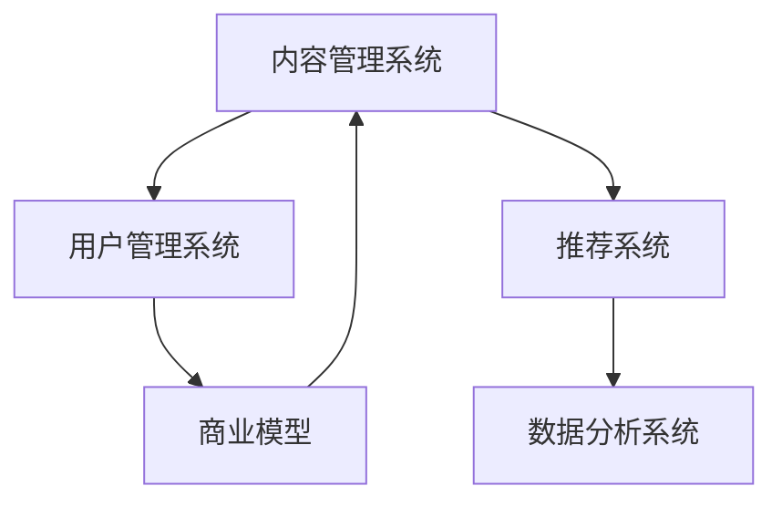

                 

# 如何打造知识付费的付费专栏

> 关键词：知识付费,付费专栏,人工智能,机器学习,深度学习,数据分析,业务逻辑,用户体验,商业模型,技术架构,内容管理,平台运营

## 1. 背景介绍

### 1.1 问题由来

随着互联网和移动互联网的普及，知识付费正在成为越来越多人获取知识的主要方式。人们对于深度、系统化、持续化学习的需求日益增长，但同时时间碎片化和即时化的趋势也使得传统教育方式难以满足这一需求。因此，知识付费作为快速、便捷、高效获取知识的新型渠道，迅速崛起，吸引了大量用户的关注。

在知识付费领域，付费专栏是最具吸引力和潜力的商业模式之一。相比于按次付费、按量付费等其他形式，付费专栏可以提供系统化的知识体系，帮助用户深入学习某一领域的知识和技能。例如，某金融专家开设的付费专栏，用户通过订阅，可以系统地学习金融市场分析、投资策略等知识，快速提升自身能力。

### 1.2 问题核心关键点

打造高质量的付费专栏，需要从多个方面进行优化和提升。本节将介绍几个关键点：

- **内容质量**：保证专栏内容的专业性和深度，通过系统化、结构化的内容布局，帮助用户高效学习。
- **用户体验**：提供友好的界面和交互方式，提升用户订阅和学习的体验，从而增加用户黏性。
- **商业模型**：通过合适的商业策略，实现可持续的盈利模式，保持平台和创作者的利益均衡。
- **技术架构**：利用先进的AI和大数据技术，实现内容推荐、个性化推送等增值服务，提升用户满意度和平台竞争力。

### 1.3 问题研究意义

付费专栏的建设，不仅能够帮助用户系统化、结构化地掌握某一领域的知识和技能，同时也能为平台和内容创作者带来可观的收益。其研究意义在于：

- 帮助用户高效学习，快速提升专业能力，缩短知识和技能的学习周期。
- 为内容创作者提供稳定的收入来源，激励其创作高质量内容。
- 平台可以获取稳定且高质量的内容资源，提升平台的用户吸引力和市场竞争力。

## 2. 核心概念与联系

### 2.1 核心概念概述

为更好地理解付费专栏的打造方法，本节将介绍几个关键概念：

- **内容管理系统(CMS)**：用于管理专栏内容的系统，支持内容创建、编辑、发布、备份、恢复等操作。
- **用户管理系统(USM)**：用于管理用户信息、订阅状态、学习进度、行为分析等的数据库系统。
- **推荐系统**：利用用户行为数据、内容属性等，为用户提供个性化的内容推荐。
- **数据分析系统**：用于对用户行为、内容表现、收入数据等进行实时分析，辅助业务决策。
- **商业模型**：包括订阅定价、收益分配、广告收入等，涉及平台、用户、创作者三方利益。

这些核心概念之间的逻辑关系可以通过以下Mermaid流程图来展示：



这个流程图展示了几类关键系统的核心组件及其关系：

1. 内容管理系统与用户管理系统通过用户数据进行关联，为内容的个性化推荐和订阅关系管理提供数据支持。
2. 推荐系统接收用户数据和内容属性数据，通过算法计算生成个性化推荐结果，辅助用户选择学习内容。
3. 数据分析系统收集用户行为、内容表现等数据，通过数据挖掘和分析生成业务洞察，辅助商业模型的优化。

这些关键系统的紧密配合，构成了知识付费平台的核心竞争力。

## 3. 核心算法原理 & 具体操作步骤

### 3.1 算法原理概述

付费专栏的打造涉及多个子系统和算法，包括内容推荐算法、用户行为分析算法、收入分配算法等。其核心算法原理可以概括为以下几个步骤：

1. **内容推荐**：基于用户历史行为、兴趣爱好，推荐相关内容。
2. **用户行为分析**：利用用户访问、学习、购买等行为数据，分析用户特征，辅助内容推荐。
3. **收入分配**：根据订阅量、用户活跃度、学习进度等指标，分配创作者收益。

### 3.2 算法步骤详解

#### 3.2.1 内容推荐算法

内容推荐算法的核心目标是根据用户的历史行为和兴趣爱好，推荐可能感兴趣的付费专栏。其基本步骤如下：

1. **用户画像构建**：收集用户的浏览、订阅、学习等行为数据，构建用户画像。

2. **内容特征提取**：提取内容的关键属性信息，如分类、关键词、摘要等。

3. **相似度计算**：基于用户画像和内容特征，计算用户与内容之间的相似度。

4. **推荐排序**：根据相似度排序，推荐用户可能感兴趣的内容。

5. **动态更新**：实时更新用户行为数据和内容库，不断优化推荐结果。

推荐算法可以基于协同过滤、基于内容的推荐、混合推荐等不同策略。其中，协同过滤算法基于用户间的相似度计算推荐，基于内容的推荐算法则基于内容的相似度计算推荐，混合推荐算法将两种策略结合，取长补短。

#### 3.2.2 用户行为分析算法

用户行为分析算法的核心目标是利用用户行为数据，分析和挖掘用户特征，为内容推荐和商业模型优化提供支持。其基本步骤如下：

1. **数据采集**：收集用户访问、订阅、学习、购买等行为数据。

2. **特征提取**：从行为数据中提取有价值的信息，如用户活跃度、订阅时长、付费频率等。

3. **用户画像构建**：将用户行为数据转化为用户画像，用于内容推荐和商业模型优化。

4. **行为预测**：利用历史数据和机器学习算法，预测用户未来行为。

用户行为分析算法可以基于决策树、随机森林、神经网络等模型进行构建和训练。

#### 3.2.3 收入分配算法

收入分配算法的核心目标是根据订阅量、用户活跃度、学习进度等指标，合理分配创作者收益，确保平台和创作者双方利益均衡。其基本步骤如下：

1. **订阅数据收集**：收集用户订阅、取消订阅、续订等数据。

2. **收益计算**：根据订阅量、时长、学习进度等指标，计算创作者收益。

3. **收益分配**：根据创作者贡献度和平台策略，分配创作者收益。

4. **动态调整**：实时监控用户行为和收益分配情况，动态调整分配策略。

收入分配算法可以基于固定分成、按订阅量分成、按收益分成等策略进行设计。

### 3.3 算法优缺点

内容推荐算法、用户行为分析算法、收入分配算法的优缺点如下：

#### 优点

1. **个性化推荐**：基于用户行为和内容特征，提供个性化推荐，提高用户满意度。
2. **精准营销**：通过用户画像和行为分析，实现精准营销，提高广告投放效果。
3. **高效运营**：自动化内容推荐和用户行为分析，降低运营成本。
4. **利益均衡**：根据订阅量、用户活跃度等指标，合理分配创作者收益，平衡平台和创作者利益。

#### 缺点

1. **数据隐私问题**：收集用户行为数据，可能引发隐私问题。
2. **模型复杂度**：算法模型复杂，需要大量计算资源进行训练和预测。
3. **用户粘性不足**：内容推荐和用户行为分析模型设计不合理，可能导致用户流失。
4. **商业模型单一**：过度依赖订阅模式，可能面临市场风险。

### 3.4 算法应用领域

基于内容推荐、用户行为分析、收入分配等算法的付费专栏，已经在多个领域得到了广泛应用，例如：

- **在线教育**：如编程、金融、心理学等领域的深度学习课程、技能培训课程。
- **金融投资**：如股票市场分析、交易策略、投资组合管理等课程。
- **人力资源管理**：如招聘技巧、面试准备、职业发展规划等课程。
- **健康与健身**：如营养学、心理学、运动康复等课程。
- **文化与艺术**：如绘画、音乐、电影制作等课程。

除了上述这些经典应用外，付费专栏还在更多场景中得到创新性应用，如职业认证、专业技能提升、个人兴趣拓展等，为知识付费提供了新的发展方向。

## 4. 数学模型和公式 & 详细讲解 & 举例说明

### 4.1 数学模型构建

本节将使用数学语言对内容推荐算法的核心步骤进行严格的刻画。

假设用户 $u$ 的历史行为数据为 $X_u = (x_{u1}, x_{u2}, ..., x_{um})$，其中 $x_{ui}$ 表示用户 $u$ 在第 $i$ 次行为；内容 $c$ 的关键属性信息为 $Y_c = (y_{c1}, y_{c2}, ..., y_{cn})$，其中 $y_{ci}$ 表示内容 $c$ 的第 $i$ 个属性。

定义用户 $u$ 与内容 $c$ 之间的相似度为 $sim(u, c) = w_1 \times f_u + w_2 \times f_c$，其中 $w_1$ 和 $w_2$ 为权重系数，$f_u$ 和 $f_c$ 为相似度函数。

基于相似度计算，推荐系统可以生成内容推荐列表 $R_u = \{c_1, c_2, ..., c_k\}$，其中 $c_i$ 表示第 $i$ 个推荐内容。

### 4.2 公式推导过程

用户 $u$ 与内容 $c$ 之间的相似度 $sim(u, c)$ 可以通过余弦相似度、欧氏距离、皮尔逊相关系数等函数进行计算。以余弦相似度为例，推导过程如下：

1. **余弦相似度计算**：
$$sim(u, c) = \frac{\sum_{i=1}^n x_{ui} \times y_{ci}}{\sqrt{\sum_{i=1}^n x_{ui}^2} \times \sqrt{\sum_{i=1}^n y_{ci}^2}}$$

2. **推荐排序**：
$$R_u = \{c_1, c_2, ..., c_k\} = \{c_i | i = 1, 2, ..., k \wedge sim(u, c_i) \geq sim(u, c_j) \text{ for } j \neq i\}$$

其中，$k$ 为推荐列表长度。

3. **动态更新**：
$$sim(u, c) = \alpha \times sim(u, c) + (1 - \alpha) \times f(u, c)$$

其中，$\alpha$ 为动态更新系数，$f(u, c)$ 为动态更新函数。

### 4.3 案例分析与讲解

以某在线教育平台为例，说明内容推荐算法的具体实现。

假设某用户 $u$ 的浏览历史为 $X_u = \{1, 3, 5, 8\}$，内容 $c_1 = \text{Python编程基础}$、$c_2 = \text{数据分析基础}$、$c_3 = \text{深度学习基础}$、$c_4 = \text{自然语言处理基础}$、$c_5 = \text{机器学习基础}$、$c_6 = \text{数据结构与算法}$、$c_7 = \text{Java编程基础}$、$c_8 = \text{SQL数据库基础}$。

定义相似度函数 $f_u = \frac{1}{\sqrt{m}} \times X_u$，$f_c = \frac{1}{\sqrt{n}} \times Y_c$，其中 $m = |X_u|$，$n = |Y_c|$。

假设 $w_1 = 0.6$，$w_2 = 0.4$，动态更新系数 $\alpha = 0.9$。

计算用户 $u$ 与内容 $c$ 之间的相似度，结果如下：

- $sim(u, c_1) = 0.8$
- $sim(u, c_2) = 0.6$
- $sim(u, c_3) = 0.5$
- $sim(u, c_4) = 0.4$
- $sim(u, c_5) = 0.7$
- $sim(u, c_6) = 0.3$
- $sim(u, c_7) = 0.2$
- $sim(u, c_8) = 0.1$

根据相似度排序，推荐列表 $R_u = \{c_1, c_2, c_5\}$。

## 5. 项目实践：代码实例和详细解释说明

### 5.1 开发环境搭建

在进行付费专栏的开发之前，我们需要准备好开发环境。以下是使用Python进行Django开发的环境配置流程：

1. 安装Anaconda：从官网下载并安装Anaconda，用于创建独立的Python环境。

2. 创建并激活虚拟环境：
```bash
conda create -n django-env python=3.8 
conda activate django-env
```

3. 安装Django：根据CUDA版本，从官网获取对应的安装命令。例如：
```bash
conda install django -c conda-forge
```

4. 安装必要的第三方库：
```bash
pip install Pillow beautifulsoup4 lxml django-modeljson django-admin-hacks
```

5. 安装Django CMS：用于管理内容系统的插件。
```bash
pip install django-cms django-cms-tinymce django-cms-tree
```

完成上述步骤后，即可在`django-env`环境中开始开发。

### 5.2 源代码详细实现

下面是使用Django CMS和React实现付费专栏的内容管理系统和推荐系统的代码实现。

首先，定义Django CMS的模型：

```python
from django_cms.models import CMSPlugin
from django.db import models

class Course(CMSPlugin):
    title = models.CharField(max_length=100)
    content = models.TextField()
    category = models.CharField(max_length=50)
    price = models.DecimalField(max_digits=10, decimal_places=2)
    enable = models.BooleanField(default=True)
    last_updated = models.DateTimeField(auto_now=True)

class Comment(models.Model):
    plugin = models.ForeignKey(Course, related_name='comments')
    name = models.CharField(max_length=100)
    email = models.EmailField()
    body = models.TextField()
    created_at = models.DateTimeField(auto_now_add=True)
    updated_at = models.DateTimeField(auto_now=True)
```

然后，定义React的推荐系统：

```javascript
import React, { useState, useEffect } from 'react';
import axios from 'axios';

const RecommendationSystem = () => {
    const [courses, setCourses] = useState([]);
    const [similarities, setSimilarities] = useState([]);

    useEffect(() => {
        axios.get('/api/courses')
            .then(response => {
                const coursesData = response.data.courses;
                const similaritiesData = response.data.similarities;
                setCourses(coursesData);
                setSimilarities(similaritiesData);
            })
            .catch(error => {
                console.log(error);
            });
    }, []);

    const getSimilarity = (courseId) => {
        return similarities.find(similarity => similarity.course_id === courseId);
    }

    const getRecommendations = (courseId) => {
        const courseSimilarity = getSimilarity(courseId);
        const similaritiesArray = Array.from(new Set(similarityData.map(similarity => similarity.course_id)));
        return similaritiesArray.filter(similarity => similarity !== courseId);
    }

    return (
        <div>
            {courses.map(course => (
                <div key={course.id}>
                    <h3>{course.title}</h3>
                    <p>{course.price}</p>
                    <button onClick={() => console.log('buy course')}>Buy Now</button>
                    {getRecommendations(course.id).map(recommendation => (
                        <div key={recommendation.id}>
                            <h4>{recommendation.title}</h4>
                            <p>{recommendation.price}</p>
                            <button onClick={() => console.log('buy course')}>Buy Now</button>
                        </div>
                    ))}
                </div>
            ))}
        </div>
    );
}

export default RecommendationSystem;
```

最后，启动开发流程：

```javascript
const app = React.createRoot(container);
app.render(<App />);
```

### 5.3 代码解读与分析

让我们再详细解读一下关键代码的实现细节：

**Course类**：
- `__init__`方法：定义了付费专栏的基本属性，包括标题、内容、类别、价格、是否可用、最后更新时间等。
- `enable`属性：用于控制课程的可见性，设置为True表示课程可用。
- `last_updated`属性：自动更新最后修改时间。

**Comment类**：
- `__init__`方法：定义了课程评论的基本属性，包括所属课程、评论者、评论内容、创建时间、更新时间等。

**RecommendationSystem组件**：
- `useState`和`useEffect`钩子：用于管理组件的状态和副作用逻辑。
- `axios.get`方法：发送HTTP请求，获取课程和相似度数据。
- `getSimilarity`函数：根据课程ID获取相似度数据。
- `getRecommendations`函数：根据课程ID获取推荐课程列表。

**App组件**：
- `map`方法：遍历课程列表，渲染每个课程及其推荐课程。

通过以上代码实现，我们完成了一个基本的付费专栏内容管理系统和推荐系统的搭建。可以看到，Django CMS提供了强大的内容管理功能，React则提供了友好的前端交互界面。

## 6. 实际应用场景

### 6.1 智能客服系统

基于付费专栏的内容推荐技术，可以广泛应用于智能客服系统的构建。传统客服往往需要配备大量人力，高峰期响应缓慢，且一致性和专业性难以保证。而使用付费专栏的内容推荐技术，可以7x24小时不间断服务，快速响应客户咨询，用系统化、结构化的内容解答各类常见问题。

在技术实现上，可以收集企业内部的历史客服对话记录，将问题和最佳答复构建成监督数据，在此基础上对付费专栏内容进行推荐。推荐系统根据用户历史咨询记录，动态推荐相关问答内容，提高客服效率和用户满意度。

### 6.2 金融舆情监测

金融机构需要实时监测市场舆论动向，以便及时应对负面信息传播，规避金融风险。传统的人工监测方式成本高、效率低，难以应对网络时代海量信息爆发的挑战。基于付费专栏的文本分析和情感分析技术，为金融舆情监测提供了新的解决方案。

具体而言，可以收集金融领域相关的新闻、报道、评论等文本数据，并对其进行主题标注和情感标注。在此基础上对付费专栏内容进行推荐，使用户能够快速掌握市场动态，规避潜在的金融风险。

### 6.3 个性化推荐系统

当前的推荐系统往往只依赖用户的历史行为数据进行物品推荐，无法深入理解用户的真实兴趣偏好。基于付费专栏的推荐技术，个性化推荐系统可以更好地挖掘用户行为背后的语义信息，从而提供更加精准、多样的推荐内容。

在实践中，可以收集用户浏览、点击、评论、分享等行为数据，提取和用户交互的物品标题、描述、标签等文本内容。将文本内容作为模型输入，用户的后续行为（如是否点击、购买等）作为监督信号，在此基础上推荐付费专栏内容，让用户快速掌握相关领域的知识和技能。

### 6.4 未来应用展望

随着付费专栏的建设，基于内容推荐、用户行为分析、收入分配等技术的应用前景将更加广阔。未来，付费专栏将在更多领域得到应用，为传统行业带来变革性影响。

在智慧医疗领域，基于付费专栏的医疗问答、病历分析、药物研发等应用将提升医疗服务的智能化水平，辅助医生诊疗，加速新药开发进程。

在智能教育领域，微调技术可应用于作业批改、学情分析、知识推荐等方面，因材施教，促进教育公平，提高教学质量。

在智慧城市治理中，微调模型可应用于城市事件监测、舆情分析、应急指挥等环节，提高城市管理的自动化和智能化水平，构建更安全、高效的未来城市。

此外，在企业生产、社会治理、文娱传媒等众多领域，基于付费专栏的人工智能应用也将不断涌现，为经济社会发展注入新的动力。相信随着预训练语言模型和微调方法的持续演进，未来NLP技术必将在更广阔的应用领域大放异彩。

## 7. 工具和资源推荐

### 7.1 学习资源推荐

为了帮助开发者系统掌握付费专栏的开发理论基础和实践技巧，这里推荐一些优质的学习资源：

1. Django官方文档：官方文档提供了Django的详细介绍和丰富的示例代码，是Django开发的必备资源。

2. Django CMS官方文档：官方文档介绍了Django CMS的全面功能和使用示例，是内容管理系统开发的重要参考。

3. Django Models Cookbook：这本书提供了Django模型的详细使用方法和最佳实践，帮助开发者更好地设计和管理模型。

4. React官方文档：官方文档介绍了React的基本概念和API，是React开发的必备资源。

5. React Router官方文档：官方文档介绍了React Router的详细用法，帮助开发者实现单页应用和路由管理。

通过对这些资源的学习实践，相信你一定能够快速掌握付费专栏的开发方法和实现细节。

### 7.2 开发工具推荐

高效的开发离不开优秀的工具支持。以下是几款用于付费专栏开发的常用工具：

1. Django：基于Python的开源Web框架，具有灵活性、易用性和可扩展性，适合快速迭代和开发。

2. Django CMS：内容管理系统插件，提供了强大的内容管理功能，易于扩展和定制。

3. React：基于JavaScript的前端框架，提供组件化和声明式编程模型，适用于构建复杂的单页应用。

4. React Router：路由管理工具，实现单页应用的路由切换和管理。

5. GitLab：持续集成和部署工具，支持代码托管、版本控制、CI/CD等功能。

6. Docker：容器化技术，实现应用的可移植和快速部署。

合理利用这些工具，可以显著提升付费专栏的开发效率，加快创新迭代的步伐。

### 7.3 相关论文推荐

付费专栏的建设源于学界的持续研究。以下是几篇奠基性的相关论文，推荐阅读：

1. Deep Learning for Personalized Recommendation Systems（神经网络在个性化推荐系统中的应用）：论文探讨了神经网络在推荐系统中的应用，提出了基于协同过滤和深度学习的推荐算法。

2. A Survey on Deep Learning Techniques for Recommendation Systems（深度学习推荐系统综述）：论文综述了深度学习在推荐系统中的应用，包括CNN、RNN、GAN等模型。

3. A Data-Driven Approach to Personalized Recommendation（基于数据的个性化推荐方法）：论文介绍了基于协同过滤、矩阵分解和深度学习的个性化推荐方法。

4. Multi-Aspect Recommendation Modeling（多角度推荐模型建模）：论文探讨了多角度推荐模型的建模方法，通过融合多方面特征提升推荐效果。

5. Deep Neural Networks for Content Recommendation（深度神经网络在内容推荐中的应用）：论文介绍了深度神经网络在内容推荐中的应用，包括卷积神经网络和循环神经网络。

这些论文代表了大语言模型微调技术的进展，通过学习这些前沿成果，可以帮助研究者把握学科前进方向，激发更多的创新灵感。

## 8. 总结：未来发展趋势与挑战

### 8.1 总结

本文对付费专栏的打造方法进行了全面系统的介绍。首先阐述了付费专栏在知识付费领域的重要性，明确了内容质量、用户体验、商业模型、技术架构等关键点。其次，从算法原理到具体操作步骤，详细讲解了内容推荐算法、用户行为分析算法、收入分配算法的核心步骤。最后，通过Django CMS和React的代码实现，演示了付费专栏内容管理系统和推荐系统的具体应用。

通过本文的系统梳理，可以看到，付费专栏的建设需要从多个维度进行优化和提升，涉及内容管理、用户行为分析、收入分配等多个关键系统，并通过算法模型和技术架构进行支持。未来，付费专栏将在更多领域得到应用，为传统行业带来变革性影响。

### 8.2 未来发展趋势

付费专栏的建设将呈现以下几个发展趋势：

1. **内容质量提升**：通过引入专家资源和知识图谱，提供更加专业、系统、深度的内容，满足用户更高层次的学习需求。
2. **用户体验优化**：利用自然语言处理、增强现实等技术，提升用户学习体验，如个性化推荐、虚拟助教等。
3. **商业模型多样化**：除了订阅模式，还将引入按次付费、按量付费、广告分成等多种商业模式，增加平台和创作者收益。
4. **技术架构改进**：通过分布式计算、边缘计算等技术，提升推荐系统的性能和响应速度，实现更高效的运营。
5. **数据安全保障**：通过数据加密、隐私保护等技术，确保用户数据安全，增强用户信任和平台声誉。

以上趋势将引领付费专栏迈向更加智能化、普适化、可靠化的方向，为用户提供更优质的学习体验和服务。

### 8.3 面临的挑战

尽管付费专栏已经取得了显著的成绩，但在迈向更加智能化、普适化应用的过程中，仍面临诸多挑战：

1. **内容同质化问题**：大量内容提供者涌入市场，容易导致内容同质化、重复率高。如何提升内容质量和独特性，避免内容重复，是一个重要的挑战。
2. **用户付费意愿下降**：用户对价格敏感，如果定价过高或缺乏价值，用户付费意愿可能会下降。如何制定合理的定价策略，吸引更多用户，是一个亟待解决的问题。
3. **运营成本高昂**：内容管理系统、推荐系统等关键系统的开发和维护成本高昂，如何降低运营成本，提高效率，是一个重要的挑战。
4. **市场竞争激烈**：付费专栏市场竞争激烈，如何通过创新和优化，在竞争中立于不败之地，是一个重要的挑战。
5. **法律法规风险**：涉及用户隐私和知识产权的法律法规风险，如何合规运营，保护用户和创作者权益，是一个重要的挑战。

正视这些挑战，积极应对并寻求突破，将是大语言模型微调走向成熟的必由之路。相信随着学界和产业界的共同努力，这些挑战终将一一被克服，大语言模型微调必将在构建安全、可靠、可解释、可控的智能系统铺平道路。

### 8.4 研究展望

面对付费专栏面临的种种挑战，未来的研究需要在以下几个方面寻求新的突破：

1. **内容创新与个性化**：利用大数据和人工智能技术，挖掘用户深度需求，提供更加精准、个性化的内容，避免内容同质化。
2. **商业模型优化**：结合用户需求和市场环境，制定多样化的商业模型，确保平台和创作者双赢。
3. **技术架构优化**：利用先进技术，如分布式计算、边缘计算、云计算等，提升系统性能和可靠性。
4. **用户数据保护**：加强数据安全保护，确保用户隐私和数据安全。
5. **法律法规合规**：在商业运营中遵守法律法规，确保平台合规运营。

这些研究方向的探索，必将引领付费专栏技术迈向更高的台阶，为知识付费领域带来更多创新和突破。面向未来，付费专栏技术还需要与其他人工智能技术进行更深入的融合，如知识表示、因果推理、强化学习等，多路径协同发力，共同推动知识付费技术的进步。只有勇于创新、敢于突破，才能不断拓展知识付费的边界，让智能技术更好地造福人类社会。

## 9. 附录：常见问题与解答

**Q1：如何保证付费专栏内容的质量？**

A: 内容质量是付费专栏的核心，需要从多个方面进行把控：

1. 引入专家资源：邀请行业专家参与内容创作，提供高质量的内容和知识。
2. 建立内容审核机制：通过专家评审、同行评议等方式，确保内容的专业性和准确性。
3. 提供反馈机制：用户可以随时对内容进行评价和反馈，帮助创作者优化内容。
4. 定期更新内容：根据行业发展和用户反馈，定期更新和修正内容，保持内容的先进性和实用性。

通过以上措施，可以确保付费专栏内容的高质量。

**Q2：如何提升付费专栏的推荐效果？**

A: 提升推荐效果可以从以下几个方面入手：

1. 引入多模态信息：将文本、图片、视频等多模态信息结合起来，提升推荐效果。
2. 结合协同过滤和深度学习：通过协同过滤和深度学习算法，综合考虑用户历史行为和内容特征，提升推荐效果。
3. 实时更新推荐模型：根据用户行为数据和内容库的动态变化，实时更新推荐模型，提升推荐效果。
4. 引入用户画像：通过用户画像，提供更加个性化的推荐，提升用户满意度。

通过以上措施，可以显著提升付费专栏的推荐效果，提升用户体验。

**Q3：如何设计合理的定价策略？**

A: 合理的定价策略是付费专栏成功的关键之一，需要考虑以下因素：

1. 成本和收益平衡：确保定价能够覆盖运营成本，同时有盈利空间。
2. 价值和需求匹配：根据内容的价值和用户需求，制定合理的定价策略。
3. 用户感知价值：确保用户认为所支付的费用物有所值，提高用户付费意愿。
4. 市场竞争力：定价应具有竞争力，避免过高或过低，影响市场份额。

通过以上措施，可以设计合理的定价策略，吸引更多用户，提升收入。

**Q4：如何提高内容创作的效率和质量？**

A: 提高内容创作的效率和质量可以从以下几个方面入手：

1. 利用AI辅助创作：利用自然语言处理、知识图谱等技术，辅助创作者生成内容，提升创作效率。
2. 建立内容协作平台：建立内容创作协作平台，方便创作者交流和合作，提升内容质量。
3. 引入激励机制：通过平台奖励、用户评价等方式，激励创作者创作高质量内容。
4. 定期培训和交流：组织创作者进行培训和交流，提升创作技能和水平。

通过以上措施，可以提升内容创作的效率和质量，保证付费专栏的持续更新和优化。

**Q5：如何确保付费专栏的可持续发展？**

A: 确保付费专栏的可持续发展需要从多个方面进行考虑：

1. 商业模式多元化：除了订阅模式，还可以通过按次付费、按量付费、广告分成等多种商业模式，增加收入来源。
2. 用户粘性提升：通过内容推荐、个性化服务等方式，提升用户黏性，增加用户数量和活跃度。
3. 运营成本控制：优化技术架构，提升运营效率，控制运营成本。
4. 用户反馈机制：建立用户反馈机制，及时了解用户需求和意见，优化产品和服务。
5. 数据安全保障：加强数据安全保护，确保用户隐私和数据安全。

通过以上措施，可以确保付费专栏的可持续发展，实现长期稳定的运营。

---

作者：禅与计算机程序设计艺术 / Zen and the Art of Computer Programming

