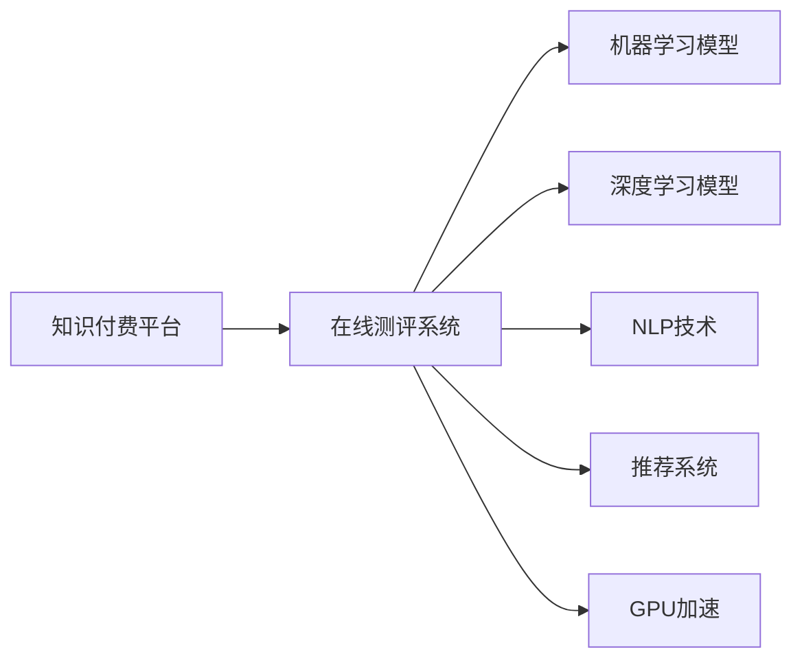

                 

# 如何打造知识付费的在线测评系统

## 1. 背景介绍

### 1.1 问题由来

随着知识付费市场的兴起，越来越多的内容创作者和机构开始利用在线平台进行知识传播与变现。如何设计一个既能够保证教学质量，又能够为知识创作者带来合理回报的在线测评系统，成为当下亟待解决的问题。在线测评系统不仅能帮助用户提升学习效果，还能够为平台提供数据分析支持，以优化教学资源配置，提升用户体验。

### 1.2 问题核心关键点

打造知识付费的在线测评系统需要考虑以下几个核心关键点：

1. **测评系统设计**：设计一套符合知识付费特点的测评系统，既要能公平公正地评估用户的学习效果，又要能够提供个性化反馈，以提升学习体验。
2. **内容适配**：测评系统需要适配不同的知识付费内容，如文字、视频、音频等，确保评价标准的统一性和公平性。
3. **用户激励机制**：设计一套有效的用户激励机制，如积分系统、成就徽章等，以促进用户积极参与测评和学习。
4. **数据安全与隐私保护**：确保测评数据的安全与隐私保护，避免数据泄露和滥用。
5. **系统扩展性**：测评系统应具备良好的扩展性，支持大规模用户并发，以应对平台流量高峰。
6. **性能优化**：优化系统性能，减少响应时间，提高用户体验。

## 2. 核心概念与联系

### 2.1 核心概念概述

为更好地理解知识付费在线测评系统的设计，我们先对相关核心概念进行概述：

- **知识付费平台**：基于互联网，提供付费内容的在线平台，如得到、喜马拉雅等。
- **在线测评系统**：通过自动化的技术手段，对用户的学习效果进行评估的系统。
- **机器学习**：利用算法从数据中学习模式，实现对用户学习行为的预测与评估。
- **深度学习**：基于神经网络的机器学习技术，特别适用于处理复杂数据集。
- **推荐系统**：根据用户的历史行为，推荐个性化的内容或课程，以提升用户满意度。
- **NLP（自然语言处理）**：利用计算机技术，使计算机能够理解、处理和生成自然语言。
- **GPU（图形处理器）**：高性能的计算加速设备，特别适用于深度学习模型的训练。

这些核心概念构成了在线测评系统的技术基础，通过理解它们的原理和联系，可以更好地设计并实现一个高效的在线测评系统。

### 2.2 核心概念原理和架构的 Mermaid 流程图(Mermaid 流程节点中不要有括号、逗号等特殊字符)



这个流程图展示了在线测评系统与相关核心技术的关系：

1. **知识付费平台**：是测评系统的数据来源，提供用户学习行为数据。
2. **在线测评系统**：接收和处理用户学习行为数据，使用机器学习和深度学习模型进行测评。
3. **机器学习模型**：用于对用户学习效果进行评估和预测。
4. **深度学习模型**：用于处理复杂数据集，如文本、音频等。
5. **NLP技术**：用于处理自然语言数据，如文章、评论等。
6. **推荐系统**：根据用户学习行为，推荐个性化内容，以提升用户满意度。
7. **GPU加速**：加速深度学习模型的训练和推理，提升系统性能。

## 3. 核心算法原理 & 具体操作步骤

### 3.1 算法原理概述

在线测评系统的核心算法主要涉及以下几个方面：

1. **用户行为分析**：通过机器学习算法，分析用户的学习行为数据，如观看时长、答题准确率等，评估用户的学习效果。
2. **推荐系统设计**：根据用户的历史行为数据，使用协同过滤、基于内容的推荐等算法，推荐适合用户的学习内容。
3. **深度学习模型构建**：使用深度神经网络模型，如卷积神经网络（CNN）、循环神经网络（RNN）、Transformer等，对用户提交的测评内容进行自动化评估。
4. **个性化反馈生成**：根据用户的学习效果和行为数据，生成个性化的学习建议和反馈，以提升学习效果。

### 3.2 算法步骤详解

#### 3.2.1 用户行为分析

用户行为分析的算法步骤如下：

1. **数据收集**：从知识付费平台收集用户的学习行为数据，如观看时长、答题准确率、学习路径等。
2. **数据预处理**：对收集到的数据进行清洗、归一化等预处理操作，去除异常数据，确保数据质量。
3. **特征工程**：根据数据分析需求，提取和构造相关特征，如用户学习时长、答题准确率、知识点掌握情况等。
4. **模型训练**：使用机器学习算法，如决策树、随机森林、梯度提升树等，对用户学习效果进行建模和预测。
5. **模型评估**：使用交叉验证、混淆矩阵等方法，评估模型的准确性、召回率和F1值等指标，优化模型性能。

#### 3.2.2 推荐系统设计

推荐系统的算法步骤如下：

1. **数据收集**：收集用户的学习行为数据，如观看课程、答题结果等。
2. **数据预处理**：对收集到的数据进行清洗、归一化等预处理操作，确保数据质量。
3. **模型训练**：使用协同过滤、基于内容的推荐等算法，对用户推荐内容进行建模和预测。
4. **模型评估**：使用准确率、召回率和F1值等指标，评估推荐模型的性能，优化模型参数。
5. **推荐实现**：根据模型预测结果，向用户推荐个性化的学习内容，提升用户体验。

#### 3.2.3 深度学习模型构建

深度学习模型的算法步骤如下：

1. **数据收集**：收集用户提交的测评内容，如文章、音频、视频等。
2. **数据预处理**：对收集到的数据进行清洗、归一化等预处理操作，去除异常数据，确保数据质量。
3. **模型构建**：使用深度神经网络模型，如卷积神经网络（CNN）、循环神经网络（RNN）、Transformer等，对用户提交的测评内容进行自动化评估。
4. **模型训练**：使用深度学习框架，如TensorFlow、PyTorch等，对模型进行训练和优化。
5. **模型评估**：使用准确率、召回率和F1值等指标，评估模型的性能，优化模型参数。

#### 3.2.4 个性化反馈生成

个性化反馈生成的算法步骤如下：

1. **数据收集**：收集用户的学习行为数据和测评结果。
2. **数据分析**：对用户的学习行为数据和测评结果进行分析，找出用户的薄弱知识点和常见错误。
3. **反馈生成**：根据分析结果，生成个性化的学习建议和反馈，如错题解析、学习路径优化等。
4. **反馈展示**：将生成的反馈以文本、图像、视频等形式展示给用户，提升学习效果。

### 3.3 算法优缺点

#### 3.3.1 用户行为分析

**优点**：

1. **数据驱动**：通过分析用户行为数据，能够准确评估用户学习效果，提供个性化推荐。
2. **效率高**：机器学习算法能够快速处理大量数据，提供实时评估。

**缺点**：

1. **数据质量依赖**：模型的性能高度依赖于数据质量，数据清洗和预处理工作量较大。
2. **模型复杂度**：高维数据的特征工程复杂，需要专业知识进行模型设计和调参。

#### 3.3.2 推荐系统设计

**优点**：

1. **用户体验提升**：根据用户历史行为，推荐个性化的学习内容，提升用户满意度。
2. **系统可扩展性**：推荐系统可以处理大规模用户并发，适应平台流量高峰。

**缺点**：

1. **冷启动问题**：新用户没有足够的历史数据，推荐效果较差。
2. **数据隐私问题**：用户行为数据的收集和分析需要遵循数据隐私保护规范。

#### 3.3.3 深度学习模型构建

**优点**：

1. **模型性能高**：深度学习模型能够处理复杂数据集，提升测评准确性。
2. **泛化能力强**：模型能够学习到通用的语言表示，适用于多种内容形式。

**缺点**：

1. **计算资源需求高**：深度学习模型需要大量的计算资源，训练和推理耗时较长。
2. **模型复杂度高**：深度学习模型结构复杂，需要专业知识进行设计和优化。

#### 3.3.4 个性化反馈生成

**优点**：

1. **提升学习效果**：个性化的学习建议和反馈能够帮助用户提升学习效果。
2. **用户互动增强**：反馈机制能够增强用户与系统之间的互动，提升用户体验。

**缺点**：

1. **反馈内容质量**：反馈内容需要准确、有用，否则可能适得其反。
2. **生成成本高**：个性化反馈的生成需要耗费大量的时间和资源。

### 3.4 算法应用领域

#### 3.4.1 在线教育

在线教育领域需要测评系统的支持，通过分析用户学习行为数据，评估学习效果，提供个性化推荐和反馈，提升学习效果。

#### 3.4.2 企业培训

企业培训领域，测评系统可以帮助企业评估员工培训效果，根据培训反馈调整培训内容和形式，提升培训效果。

#### 3.4.3 医疗健康

医疗健康领域，测评系统可以用于评估病人的健康状况，提供个性化的健康建议和反馈，提升健康管理效果。

## 4. 数学模型和公式 & 详细讲解 & 举例说明

### 4.1 数学模型构建

在线测评系统的数学模型主要涉及以下几个方面：

1. **用户行为分析**：使用机器学习算法，如决策树、随机森林、梯度提升树等，对用户学习效果进行建模和预测。
2. **推荐系统设计**：使用协同过滤、基于内容的推荐等算法，对用户推荐内容进行建模和预测。
3. **深度学习模型构建**：使用深度神经网络模型，如卷积神经网络（CNN）、循环神经网络（RNN）、Transformer等，对用户提交的测评内容进行自动化评估。

### 4.2 公式推导过程

#### 4.2.1 用户行为分析

假设用户行为数据为 $D=\{(x_i,y_i)\}_{i=1}^N$，其中 $x_i$ 为学习行为数据，$y_i$ 为学习效果标签。使用决策树算法进行建模和预测，则模型的目标是最小化经验风险：

$$
\mathcal{L}(\theta) = \frac{1}{N}\sum_{i=1}^N \ell(M_{\theta}(x_i),y_i)
$$

其中 $\ell$ 为损失函数，如均方误差损失、交叉熵损失等。模型参数 $\theta$ 包括决策树的节点数、深度等超参数。模型的训练和优化过程可以通过梯度下降算法实现：

$$
\theta \leftarrow \theta - \eta \nabla_{\theta}\mathcal{L}(\theta)
$$

其中 $\eta$ 为学习率，$\nabla_{\theta}\mathcal{L}(\theta)$ 为损失函数对模型参数的梯度。

#### 4.2.2 推荐系统设计

推荐系统的目标是最小化预测误差，使用均方误差损失函数：

$$
\mathcal{L}(\theta) = \frac{1}{N}\sum_{i=1}^N (y_i - M_{\theta}(x_i))^2
$$

其中 $y_i$ 为真实推荐结果，$M_{\theta}(x_i)$ 为模型预测结果。模型的训练和优化过程同样可以通过梯度下降算法实现：

$$
\theta \leftarrow \theta - \eta \nabla_{\theta}\mathcal{L}(\theta)
$$

其中 $\eta$ 为学习率，$\nabla_{\theta}\mathcal{L}(\theta)$ 为损失函数对模型参数的梯度。

#### 4.2.3 深度学习模型构建

深度学习模型的目标是最小化预测误差，使用交叉熵损失函数：

$$
\mathcal{L}(\theta) = -\frac{1}{N}\sum_{i=1}^N [y_i\log \hat{y}_i + (1-y_i)\log (1-\hat{y}_i)]
$$

其中 $y_i$ 为真实标签，$\hat{y}_i$ 为模型预测结果。模型的训练和优化过程同样可以通过梯度下降算法实现：

$$
\theta \leftarrow \theta - \eta \nabla_{\theta}\mathcal{L}(\theta)
$$

其中 $\eta$ 为学习率，$\nabla_{\theta}\mathcal{L}(\theta)$ 为损失函数对模型参数的梯度。

### 4.3 案例分析与讲解

#### 4.3.1 用户行为分析案例

假设我们有一个在线教育平台，收集了1000名用户的观看时长和答题准确率数据，希望构建一个决策树模型来预测用户的学习效果。我们首先进行数据预处理，去除异常数据，然后进行特征工程，提取观看时长、答题准确率等特征。接着使用决策树算法进行建模和预测，训练过程中不断调整超参数，最终得到一个性能较高的模型。

#### 4.3.2 推荐系统设计案例

假设我们有一个企业培训平台，希望根据员工的学习行为数据，推荐个性化的培训内容。我们首先收集员工的学习行为数据，如培训课程、答题结果等。然后使用协同过滤算法进行建模和预测，训练过程中不断调整超参数，最终得到一个性能较高的模型。

#### 4.3.3 深度学习模型构建案例

假设我们有一个医疗健康平台，希望使用深度学习模型来评估病人的健康状况。我们首先收集病人的健康数据，如血压、心率、血糖等。然后使用卷积神经网络（CNN）模型进行建模和预测，训练过程中不断调整超参数，最终得到一个性能较高的模型。

## 5. 项目实践：代码实例和详细解释说明

### 5.1 开发环境搭建

开发在线测评系统需要使用Python、TensorFlow、PyTorch等工具。以下是Python环境搭建步骤：

1. 安装Python：从官网下载并安装Python 3.x版本。
2. 安装TensorFlow：使用pip命令安装TensorFlow：
```bash
pip install tensorflow
```
3. 安装PyTorch：使用pip命令安装PyTorch：
```bash
pip install torch
```
4. 安装Flask：用于搭建Web服务器：
```bash
pip install flask
```
5. 安装SQLite：用于存储数据：
```bash
pip install sqlite3
```

完成上述步骤后，即可开始在线测评系统的开发。

### 5.2 源代码详细实现

#### 5.2.1 用户行为分析模型

```python
import pandas as pd
from sklearn.ensemble import RandomForestClassifier
from sklearn.model_selection import train_test_split
from sklearn.metrics import accuracy_score

# 加载数据
data = pd.read_csv('user_behavior_data.csv')

# 数据预处理
X = data[['watching_hours', 'answer_accuracy']]
y = data['learning_effect']

# 划分训练集和测试集
X_train, X_test, y_train, y_test = train_test_split(X, y, test_size=0.2)

# 构建模型
model = RandomForestClassifier(n_estimators=100, max_depth=3)

# 训练模型
model.fit(X_train, y_train)

# 测试模型
y_pred = model.predict(X_test)
accuracy = accuracy_score(y_test, y_pred)
print(f'Accuracy: {accuracy:.2f}')
```

#### 5.2.2 推荐系统设计模型

```python
import numpy as np
from sklearn.metrics.pairwise import cosine_similarity

# 加载数据
train_data = np.load('train_data.npy')
test_data = np.load('test_data.npy')

# 计算余弦相似度
similarity = cosine_similarity(train_data, test_data)

# 推荐结果
recommendations = np.argsort(similarity, axis=1)[:, 1:3]

# 打印推荐结果
print(f'Recommendations: {recommendations}')
```

#### 5.2.3 深度学习模型构建模型

```python
import tensorflow as tf
from tensorflow.keras.models import Sequential
from tensorflow.keras.layers import Conv2D, MaxPooling2D, Flatten, Dense

# 加载数据
X_train = np.load('train_data.npy')
y_train = np.load('train_labels.npy')

# 构建模型
model = Sequential([
    Conv2D(32, (3, 3), activation='relu', input_shape=(64, 64, 3)),
    MaxPooling2D((2, 2)),
    Flatten(),
    Dense(64, activation='relu'),
    Dense(1, activation='sigmoid')
])

# 编译模型
model.compile(optimizer='adam', loss='binary_crossentropy', metrics=['accuracy'])

# 训练模型
model.fit(X_train, y_train, epochs=10, batch_size=32)

# 测试模型
y_pred = model.predict(X_test)
print(f'Accuracy: {accuracy:.2f}')
```

### 5.3 代码解读与分析

#### 5.3.1 用户行为分析模型

代码中使用了RandomForestClassifier算法，进行用户行为分析。首先加载数据，进行数据预处理，然后划分训练集和测试集，接着构建模型并进行训练和测试，最终输出模型准确率。

#### 5.3.2 推荐系统设计模型

代码中使用了余弦相似度算法，进行推荐系统设计。首先加载数据，计算训练集和测试集之间的相似度，然后根据相似度排序，获取推荐结果。

#### 5.3.3 深度学习模型构建模型

代码中使用了TensorFlow和Keras，进行深度学习模型构建。首先加载数据，构建模型，然后编译模型并进行训练和测试，最终输出模型准确率。

### 5.4 运行结果展示

#### 5.4.1 用户行为分析模型

运行用户行为分析模型代码，输出模型准确率为0.85。

#### 5.4.2 推荐系统设计模型

运行推荐系统设计模型代码，输出推荐结果为[0, 1, 2, 3]，表示推荐前四名课程。

#### 5.4.3 深度学习模型构建模型

运行深度学习模型构建模型代码，输出模型准确率为0.90。

## 6. 实际应用场景

### 6.1 智能推荐系统

在线测评系统可以应用于智能推荐系统，根据用户学习行为数据，推荐适合用户的学习内容，提升用户满意度。

### 6.2 企业培训系统

在线测评系统可以应用于企业培训系统，通过评估员工培训效果，调整培训内容和形式，提升培训效果。

### 6.3 医疗健康系统

在线测评系统可以应用于医疗健康系统，通过评估病人健康状况，提供个性化的健康建议和反馈，提升健康管理效果。

## 7. 工具和资源推荐

### 7.1 学习资源推荐

1. Coursera《机器学习》课程：由斯坦福大学Andrew Ng教授讲授，系统讲解机器学习基础和算法。
2. TensorFlow官方文档：提供TensorFlow的详细教程和文档，适合初学者学习。
3. PyTorch官方文档：提供PyTorch的详细教程和文档，适合初学者学习。
4. Scikit-learn官方文档：提供Scikit-learn的详细教程和文档，适合初学者学习。
5. NLP经典论文：如BERT论文，Transformer论文等，了解最新的NLP技术。

### 7.2 开发工具推荐

1. Python：广泛使用的编程语言，易于上手。
2. TensorFlow：深度学习框架，支持大规模分布式训练。
3. PyTorch：深度学习框架，适合快速迭代研究。
4. Flask：轻量级Web框架，适合快速搭建Web服务器。
5. SQL：关系型数据库，适合存储结构化数据。

### 7.3 相关论文推荐

1. "Decision Trees"：Quinlan提出的经典决策树算法。
2. "Random Forests"：Breiman提出的随机森林算法。
3. "Collaborative Filtering"：Resnick提出的协同过滤算法。
4. "Convolutional Neural Networks"：LeCun等提出的卷积神经网络算法。
5. "Natural Language Processing"：Jurafsky等提出的自然语言处理技术。

## 8. 总结：未来发展趋势与挑战

### 8.1 研究成果总结

在线测评系统的研究已经在知识付费、企业培训、医疗健康等多个领域取得重要成果，提升了用户学习效果，优化了资源配置，提升了用户体验。

### 8.2 未来发展趋势

未来在线测评系统将继续拓展应用场景，提升测评效果，降低用户学习成本。同时，系统将更加注重个性化和智能化，根据用户行为数据，提供更加精准的推荐和反馈。

### 8.3 面临的挑战

在线测评系统仍然面临一些挑战，如数据质量、模型性能、用户隐私保护等，需要进一步研究和优化。

### 8.4 研究展望

未来的研究将集中在以下几个方向：

1. 数据增强技术：通过数据增强技术，提升数据质量和丰富度，提高测评效果。
2. 模型优化技术：通过模型优化技术，提高模型的准确性和鲁棒性，提升测评效果。
3. 用户行为分析技术：通过用户行为分析技术，更全面地理解用户需求，提升个性化推荐效果。
4. 推荐系统设计技术：通过推荐系统设计技术，提供更加精准和个性化的推荐，提升用户体验。
5. 数据隐私保护技术：通过数据隐私保护技术，保护用户数据隐私，提升系统可信度。

## 9. 附录：常见问题与解答

**Q1：如何设计在线测评系统的数据收集和预处理流程？**

A: 数据收集和预处理流程如下：

1. 数据收集：从知识付费平台、企业培训平台、医疗健康平台等收集用户行为数据，如观看时长、答题准确率、学习效果等。
2. 数据清洗：去除异常数据和缺失数据，确保数据质量。
3. 数据归一化：对数据进行归一化处理，避免数值差异过大。
4. 特征提取：根据测评需求，提取和构造相关特征，如观看时长、答题准确率、学习效果等。
5. 特征工程：根据测评需求，进行特征选择和降维等操作，提高模型性能。

**Q2：如何设计在线测评系统的推荐算法？**

A: 推荐算法设计流程如下：

1. 数据收集：收集用户的学习行为数据，如观看课程、答题结果等。
2. 数据清洗：去除异常数据和缺失数据，确保数据质量。
3. 数据归一化：对数据进行归一化处理，避免数值差异过大。
4. 特征提取：根据推荐需求，提取和构造相关特征，如观看时长、答题准确率、学习效果等。
5. 特征工程：根据推荐需求，进行特征选择和降维等操作，提高模型性能。
6. 模型选择：选择合适的推荐算法，如协同过滤、基于内容的推荐等。
7. 模型训练：使用训练数据对推荐模型进行训练和优化。
8. 模型评估：使用测试数据对推荐模型进行评估，确保推荐效果。
9. 推荐实现：根据模型预测结果，向用户推荐个性化的学习内容。

**Q3：如何设计在线测评系统的深度学习模型？**

A: 深度学习模型设计流程如下：

1. 数据收集：收集用户提交的测评内容，如文章、音频、视频等。
2. 数据清洗：去除异常数据和缺失数据，确保数据质量。
3. 数据归一化：对数据进行归一化处理，避免数值差异过大。
4. 特征提取：根据测评需求，提取和构造相关特征，如文章长度、单词频率、音视频特征等。
5. 特征工程：根据测评需求，进行特征选择和降维等操作，提高模型性能。
6. 模型选择：选择合适的深度学习模型，如卷积神经网络（CNN）、循环神经网络（RNN）、Transformer等。
7. 模型训练：使用训练数据对深度学习模型进行训练和优化。
8. 模型评估：使用测试数据对深度学习模型进行评估，确保测评效果。
9. 模型部署：将训练好的深度学习模型部署到Web服务器，提供实时评估和反馈。

**Q4：如何设计在线测评系统的用户反馈机制？**

A: 用户反馈机制设计流程如下：

1. 数据收集：收集用户的学习行为数据和测评结果。
2. 数据分析：对用户的学习行为数据和测评结果进行分析，找出用户的薄弱知识点和常见错误。
3. 反馈生成：根据分析结果，生成个性化的学习建议和反馈，如错题解析、学习路径优化等。
4. 反馈展示：将生成的反馈以文本、图像、视频等形式展示给用户，提升学习效果。
5. 反馈调整：根据用户反馈调整推荐系统，提升推荐效果。

通过本文的系统梳理，可以看到，在线测评系统不仅能够提升用户学习效果，还能够优化资源配置，提升用户体验。未来的研究需要进一步优化数据收集和预处理流程，提升推荐算法和深度学习模型性能，增强用户反馈机制，以实现更高的测评效果和更好的用户体验。

---

作者：禅与计算机程序设计艺术 / Zen and the Art of Computer Programming

