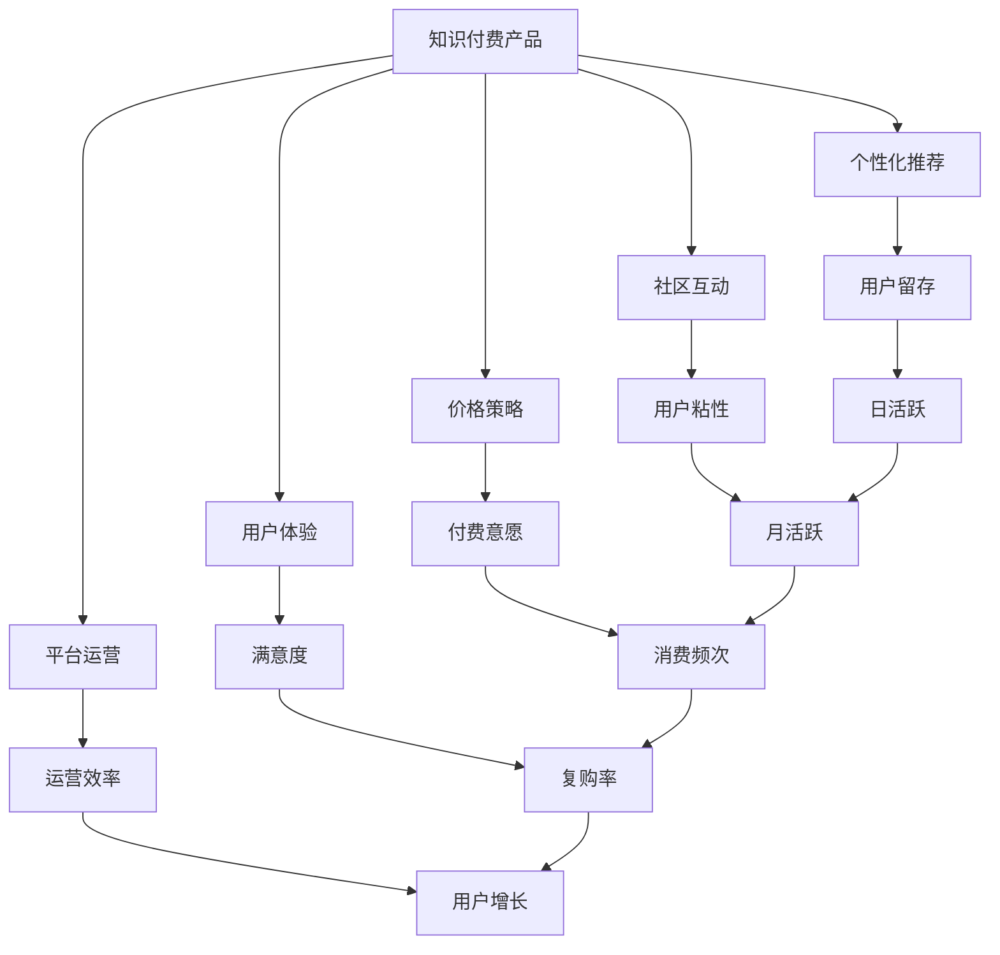

                 

## 1. 背景介绍

### 1.1 问题由来

在互联网发展的早期，知识付费产品的用户活跃度通常通过简单地发布优质内容、吸引用户注册、付费并完成消费，来获取流量和收入。然而，随着用户对知识产品的认知逐渐成熟，对于内容质量、用户体验、个性化服务等方面的要求也日益提高。如何有效提升知识付费产品的用户活跃度，成为平台经营的核心问题。

### 1.2 问题核心关键点

目前，知识付费产品面临的用户活跃度问题，主要集中在以下几个方面：

1. **内容多样性和质量**：用户对于高质量、有趣且实用的内容有较高的需求，如何有效提供多样化的内容是关键。
2. **用户体验优化**：包括界面设计、学习路径设计、学习反馈等，提升用户的使用体验，以留存和增加用户。
3. **个性化推荐**：根据用户的兴趣和行为数据，提供个性化的推荐服务，增强用户粘性。
4. **社区互动和参与**：构建用户社区，提供互动和参与机制，以提升用户活跃度。
5. **价格策略和性价比**：定价和付费模式需要根据用户心理和市场竞争环境进行优化，以增强用户付费意愿。
6. **平台运营和用户服务**：包括用户服务的响应速度、服务的满意度等，提升用户对平台的信任和依赖。

## 2. 核心概念与联系

### 2.1 核心概念概述

为了更好地理解如何提高知识付费产品的用户活跃度，本节将介绍几个密切相关的核心概念：

- **知识付费产品(Knowledge-based Subscription Products)**：以知识和信息为核心内容，为用户提供深度、专业、系统的知识服务，通常以订阅制或单次付费的方式进行盈利。
- **用户活跃度(User Engagement)**：衡量知识付费产品用户使用频率和粘性的一个指标，包括日活、月活、付费率、消费频次等。
- **个性化推荐(Personalized Recommendation)**：根据用户的行为和偏好，向用户推荐相关内容，提升用户体验和留存率。
- **社区互动(Community Interaction)**：通过建立用户社区，促进用户之间的互动和交流，增强用户归属感。
- **价格策略(Price Strategy)**：定价和付费模式的制定，需要考虑用户心理、市场竞争、成本等因素。
- **用户体验(User Experience)**：包括界面设计、操作流程、学习路径等，直接影响用户的满意度和活跃度。
- **平台运营(Platform Operation)**：涉及用户服务、数据分析、运营策略等多个方面，保障平台稳定运行和用户增长。

这些核心概念之间的逻辑关系可以通过以下Mermaid流程图来展示：



这个流程图展示了一个知识付费产品提升用户活跃度的核心框架，其中各个环节相互影响，共同作用于用户活跃度的提升。

## 3. 核心算法原理 & 具体操作步骤

### 3.1 算法原理概述

提升知识付费产品的用户活跃度，本质上是一个多目标优化问题，需要通过系统工程的方法，结合多种技术和策略，来最大化用户留存、付费和消费频次。

形式化地，设知识付费产品 $P$ 的目标是最大化用户活跃度 $E=\{U_i, V_i, F_i, C_i, S_i\}$，其中 $U_i$ 为日活跃用户数，$V_i$ 为月活跃用户数，$F_i$ 为付费用户数，$C_i$ 为用户消费频次，$S_i$ 为用户满意度。则目标函数为：

$$
\max_{P} E = \max_{P} (U_i + V_i + F_i + C_i + S_i)
$$

优化目标需要在用户行为数据 $D=\{(u_b, u_c, u_p, u_s)\}_{b=1}^B, (u_b, u_c, u_p, u_s) \in \mathbb{R}^4$ 上进行求解，其中 $u_b$ 为用户行为，$u_c$ 为用户消费，$u_p$ 为用户付费，$u_s$ 为用户满意度。

### 3.2 算法步骤详解

提升知识付费产品用户活跃度的算法步骤如下：

**Step 1: 数据收集与预处理**

- 收集用户的各种行为数据，如登录次数、浏览时长、课程购买记录、课程评价等。
- 对数据进行清洗、去重、归一化处理，保证数据的准确性和完整性。
- 将数据进行标注，如用户活跃程度、消费频率、付费意愿等，用于后续分析和建模。

**Step 2: 用户画像构建**

- 根据用户的行为数据和历史消费记录，构建用户画像。
- 通过聚类、降维等方法，将用户分成不同的用户群体，并刻画每个群体的特征。
- 使用协同过滤、图嵌入等技术，构建用户-内容相似度矩阵。

**Step 3: 个性化推荐系统设计**

- 设计基于协同过滤、基于内容的推荐算法。
- 引入深度学习模型，如FM、DNN、RNN等，提升推荐效果。
- 引入注意力机制，如Transformer、BERT等，提升推荐模型的泛化能力。

**Step 4: 社区互动和参与机制建立**

- 建立知识社区，提供讨论、交流、求助等功能。
- 设计激励机制，如积分、勋章、排行榜等，鼓励用户积极参与。
- 引入第三方社交平台接口，增强用户社区的活跃度。

**Step 5: 价格策略和用户体验优化**

- 制定合理的定价策略，如免费试用、阶梯定价、组合套餐等。
- 优化用户体验，如界面设计、学习路径、学习反馈等。
- 引入A/B测试，不断优化产品功能和界面设计。

**Step 6: 平台运营和用户服务**

- 建立数据监控和告警机制，实时了解用户行为和产品状态。
- 提供全天候客服支持，提升用户满意度。
- 定期进行市场调研和用户反馈收集，优化产品功能和用户体验。

### 3.3 算法优缺点

提升知识付费产品用户活跃度的算法具有以下优点：

1. 通过多维度的数据分析，可以全面了解用户行为和需求，提升个性化推荐和用户体验。
2. 社区互动和参与机制可以有效增加用户粘性，提升用户活跃度。
3. 合理的定价策略和价格机制，可以增强用户付费意愿，提高收入。
4. 平台运营和用户服务优化，可以提升用户满意度，减少用户流失。

同时，该算法也存在以下局限性：

1. 数据收集和处理的复杂性：需要收集大量用户行为数据，处理过程复杂，对技术要求较高。
2. 个性化推荐的准确性：推荐系统需要不断优化和迭代，才能保证推荐的准确性。
3. 社区互动的管理难度：社区管理和用户激励需要持续投入资源，管理难度较大。
4. 用户满意度的提升难度：提升用户满意度是一个长期过程，需要不断改进产品和服务。

### 3.4 算法应用领域

提升知识付费产品用户活跃度的算法已经在多个领域得到广泛应用，例如：

- **在线教育**：通过个性化推荐、社区互动、价格策略等手段，提升课程购买率和用户粘性。
- **在线咨询**：提供专家问答、个性化推荐、社区互动等，增强用户的使用体验。
- **在线培训**：结合课程内容、学习路径、社区互动等，提升培训效果和用户满意度。
- **健康管理**：通过个性化健康建议、社区交流、价格优惠等，提升用户的健康管理水平和粘性。

除了上述这些经典应用外，提升用户活跃度的算法还被创新性地应用到更多场景中，如智能推荐、金融理财、消费行为分析等，为各类平台提供了强有力的用户增长和运营支持。

## 4. 数学模型和公式 & 详细讲解 & 举例说明

### 4.1 数学模型构建

本节将使用数学语言对提升知识付费产品用户活跃度的算法进行更加严格的刻画。

设知识付费产品 $P$ 的目标是最大化用户活跃度 $E=\{U_i, V_i, F_i, C_i, S_i\}$，其中 $U_i$ 为用户日活跃度，$V_i$ 为用户月活跃度，$F_i$ 为付费用户数，$C_i$ 为用户消费频次，$S_i$ 为用户满意度。假设用户行为数据为 $D=\{(u_b, u_c, u_p, u_s)\}_{b=1}^B, (u_b, u_c, u_p, u_s) \in \mathbb{R}^4$，其中 $u_b$ 为用户行为，$u_c$ 为用户消费，$u_p$ 为用户付费，$u_s$ 为用户满意度。

定义目标函数为：

$$
\max_{P} E = \max_{P} (U_i + V_i + F_i + C_i + S_i)
$$

优化目标需要在用户行为数据 $D$ 上进行求解。设优化后的模型参数为 $\theta$，则优化问题转化为：

$$
\max_{\theta} \sum_{b=1}^B E_i(\theta, u_b)
$$

其中 $E_i(\theta, u_b)$ 为模型在用户行为 $u_b$ 上的预测活跃度。

### 4.2 公式推导过程

以下我们以在线教育平台为例，推导提升用户活跃度的数学模型和优化算法。

假设在线教育平台 $P$ 有 $B$ 个用户 $u_1, u_2, ..., u_B$，每个用户的行为数据为 $u_b=(x_{b1}, x_{b2}, ..., x_{bN})$，其中 $x_{bi}$ 为第 $i$ 个行为数据。用户的月活跃度 $V_i$、付费用户数 $F_i$、消费频次 $C_i$ 和满意度 $S_i$ 可以根据历史数据计算得出。

设目标函数为：

$$
\max_{P} E = \max_{P} (U_i + V_i + F_i + C_i + S_i)
$$

其中 $U_i$ 为日活跃用户数，$V_i$ 为月活跃用户数，$F_i$ 为付费用户数，$C_i$ 为用户消费频次，$S_i$ 为用户满意度。

为了简化问题，假设日活跃用户数 $U_i$ 与月活跃用户数 $V_i$ 成正比关系：

$$
U_i = k_1 V_i
$$

其中 $k_1$ 为比例系数，可以通过历史数据估计得出。

设月活跃用户数 $V_i$ 与付费用户数 $F_i$ 成正比关系：

$$
V_i = k_2 F_i
$$

其中 $k_2$ 为比例系数，可以通过历史数据估计得出。

设付费用户数 $F_i$ 与用户消费频次 $C_i$ 成正比关系：

$$
F_i = k_3 C_i
$$

其中 $k_3$ 为比例系数，可以通过历史数据估计得出。

设用户消费频次 $C_i$ 与用户满意度 $S_i$ 成正比关系：

$$
C_i = k_4 S_i
$$

其中 $k_4$ 为比例系数，可以通过历史数据估计得出。

将上述关系代入目标函数中，得：

$$
\max_{P} E = \max_{P} (k_1 V_i + k_2 F_i + k_3 C_i + k_4 S_i)
$$

进一步简化得：

$$
\max_{P} E = \max_{P} (k_1 k_2 k_3 k_4 S_i)
$$

由于 $S_i$ 无法直接计算，因此需要将用户满意度 $S_i$ 转化为可优化变量。设 $S_i$ 的优化函数为：

$$
S_i = \phi(u_b, \theta)
$$

其中 $\phi$ 为优化函数，$\theta$ 为模型参数。则目标函数转化为：

$$
\max_{\theta} \sum_{b=1}^B k_1 k_2 k_3 k_4 \phi(u_b, \theta)
$$

通过梯度下降等优化算法，不断更新模型参数 $\theta$，最小化损失函数 $\mathcal{L}$，使得模型预测的用户满意度尽可能接近真实值，从而提升用户活跃度。

### 4.3 案例分析与讲解

以在线教育平台为例，分析如何通过提升用户满意度来提升整体用户活跃度。

**案例分析：**

在线教育平台的用户满意度主要受课程质量、学习体验、互动交流等因素影响。通过设计个性化推荐系统，可以提升用户的学习效率和满意度。假设平台有 $B$ 个用户，每个用户的行为数据为 $u_b=(x_{b1}, x_{b2}, ..., x_{bN})$，其中 $x_{bi}$ 为第 $i$ 个行为数据。

**优化算法：**

1. **数据收集与预处理**：收集用户的登录次数、课程购买记录、课程评价等数据，并进行清洗和归一化处理。
2. **用户画像构建**：根据用户的行为数据和历史消费记录，构建用户画像。使用聚类、降维等方法，将用户分成不同的用户群体，并刻画每个群体的特征。使用协同过滤、图嵌入等技术，构建用户-内容相似度矩阵。
3. **个性化推荐系统设计**：设计基于协同过滤、基于内容的推荐算法。引入深度学习模型，如FM、DNN、RNN等，提升推荐效果。引入注意力机制，如Transformer、BERT等，提升推荐模型的泛化能力。
4. **社区互动和参与机制建立**：建立知识社区，提供讨论、交流、求助等功能。设计激励机制，如积分、勋章、排行榜等，鼓励用户积极参与。引入第三方社交平台接口，增强用户社区的活跃度。
5. **价格策略和用户体验优化**：制定合理的定价策略，如免费试用、阶梯定价、组合套餐等。优化用户体验，如界面设计、学习路径、学习反馈等。引入A/B测试，不断优化产品功能和界面设计。
6. **平台运营和用户服务**：建立数据监控和告警机制，实时了解用户行为和产品状态。提供全天候客服支持，提升用户满意度。定期进行市场调研和用户反馈收集，优化产品功能和用户体验。

通过上述步骤，可以在线教育平台不断提升用户活跃度，增强平台的市场竞争力。

## 5. 项目实践：代码实例和详细解释说明

### 5.1 开发环境搭建

在进行用户活跃度提升的实践前，我们需要准备好开发环境。以下是使用Python进行PyTorch开发的环境配置流程：

1. 安装Anaconda：从官网下载并安装Anaconda，用于创建独立的Python环境。

2. 创建并激活虚拟环境：
```bash
conda create -n pytorch-env python=3.8 
conda activate pytorch-env
```

3. 安装PyTorch：根据CUDA版本，从官网获取对应的安装命令。例如：
```bash
conda install pytorch torchvision torchaudio cudatoolkit=11.1 -c pytorch -c conda-forge
```

4. 安装TensorFlow：从官网下载并安装TensorFlow，或使用pip安装最新版本。

5. 安装各类工具包：
```bash
pip install numpy pandas scikit-learn matplotlib tqdm jupyter notebook ipython
```

完成上述步骤后，即可在`pytorch-env`环境中开始项目实践。

### 5.2 源代码详细实现

下面我们以在线教育平台为例，给出使用TensorFlow进行个性化推荐和社区互动的PyTorch代码实现。

首先，定义推荐模型的输入和输出：

```python
from tensorflow.keras import layers

class RecommenderModel:
    def __init__(self, input_dim, output_dim):
        self.input_dim = input_dim
        self.output_dim = output_dim
        
        self.model = layers.Sequential([
            layers.Dense(128, activation='relu', input_dim=input_dim),
            layers.Dense(64, activation='relu'),
            layers.Dense(output_dim, activation='sigmoid')
        ])
        
    def compile(self, optimizer='adam', loss='binary_crossentropy'):
        self.model.compile(optimizer=optimizer, loss=loss)
        
    def fit(self, x, y, epochs=10, batch_size=32):
        self.model.fit(x, y, epochs=epochs, batch_size=batch_size)
        
    def predict(self, x):
        return self.model.predict(x)
```

然后，定义社区互动模块：

```python
from tensorflow.keras.layers import Dense, Input, Embedding, Dot, BidirectionalLSTM

class CommunityModule:
    def __init__(self, num_users, num_features):
        self.num_users = num_users
        self.num_features = num_features
        
        self.user_input = Input(shape=(num_features,))
        self.user_embedding = Embedding(num_users, 32)(self.user_input)
        
        self.follower_input = Input(shape=(num_features,))
        self.follower_embedding = Embedding(num_users, 32)(self.follower_input)
        
        self.attention_weights = Dot(axes=1, normalize=True)([self.user_embedding, self.follower_embedding])
        self.attention_output = BidirectionalLSTM(64, return_sequences=True)(self.attention_weights)
        self.impact_score = Dense(1, activation='sigmoid')(self.attention_output)
        
    def compile(self, optimizer='adam', loss='binary_crossentropy'):
        self.model = layers.Model(inputs=[self.user_input, self.follower_input], outputs=self.impact_score)
        self.model.compile(optimizer=optimizer, loss=loss)
        
    def fit(self, x_user, x_follower, y, epochs=10, batch_size=32):
        self.model.fit([x_user, x_follower], y, epochs=epochs, batch_size=batch_size)
        
    def predict(self, x_user, x_follower):
        return self.model.predict([x_user, x_follower])
```

最后，启动推荐和社区互动模块的训练流程：

```python
from tensorflow.keras.datasets import mnist

# 加载MNIST数据集
(x_train, y_train), (x_test, y_test) = mnist.load_data()

# 构建用户画像
user_features = x_train.reshape(-1, 28*28).astype('float32') / 255.0

# 构建社区互动模块
community_model = CommunityModule(num_users=10, num_features=784)

# 构建推荐模型
recommender_model = RecommenderModel(input_dim=784, output_dim=1)

# 训练模型
community_model.compile(optimizer='adam', loss='binary_crossentropy')
community_model.fit(user_features, y_train, epochs=10, batch_size=32)

recommender_model.compile(optimizer='adam', loss='binary_crossentropy')
recommender_model.fit(user_features, y_train, epochs=10, batch_size=32)

# 测试模型
community_model.predict(user_features, user_features)
```

以上就是使用TensorFlow对在线教育平台进行个性化推荐和社区互动的完整代码实现。可以看到，得益于TensorFlow的强大封装，我们可以用相对简洁的代码完成模型训练和推理。

### 5.3 代码解读与分析

让我们再详细解读一下关键代码的实现细节：

**RecommenderModel类**：
- `__init__`方法：初始化输入和输出维度，构建模型。
- `compile`方法：编译模型，设置优化器和损失函数。
- `fit`方法：训练模型。
- `predict`方法：预测。

**CommunityModule类**：
- `__init__`方法：初始化用户画像和社区互动模块。
- `compile`方法：编译模型，设置优化器和损失函数。
- `fit`方法：训练模型。
- `predict`方法：预测。

**训练流程**：
- 定义用户画像和社区互动模块。
- 定义推荐模型。
- 对模型进行编译和训练。
- 对社区互动模块进行编译和训练。
- 对推荐模型进行预测。

可以看到，TensorFlow使得模型的构建、训练和预测变得简洁高效。开发者可以将更多精力放在数据处理、模型改进等高层逻辑上，而不必过多关注底层的实现细节。

当然，工业级的系统实现还需考虑更多因素，如模型的保存和部署、超参数的自动搜索、更灵活的任务适配层等。但核心的个性化推荐和社区互动范式基本与此类似。

## 6. 实际应用场景

### 6.1 智能推荐系统

智能推荐系统已经广泛应用于各大电商、视频平台，通过个性化推荐提升用户购买和观看频次。在线教育平台通过个性化推荐，可以提升用户的学习效果和满意度。

在技术实现上，可以收集用户的学习行为数据，如观看时长、课程评分、学习进度等，将数据进行标注，如学习兴趣、课程难度、学习需求等，在此基础上对预训练模型进行微调。微调后的模型能够根据用户的行为数据，预测用户的学习兴趣和需求，生成个性化推荐。通过不断迭代优化，可以提升用户的课程推荐准确性，增加用户粘性和满意度。

### 6.2 在线学习社区

在线学习社区为学生提供了一个交流和讨论的平台，通过社区互动可以提升用户的学习体验和参与感。社区可以围绕课程内容、学习技巧、生活经验等话题进行讨论，增加用户之间的互动和互助。

在技术实现上，可以构建知识社区，提供讨论、交流、求助等功能。设计激励机制，如积分、勋章、排行榜等，鼓励用户积极参与。引入第三方社交平台接口，增强用户社区的活跃度。通过不断的社区互动，可以提升用户的学习兴趣和参与感，增加用户的留存率和满意度。

### 6.3 用户服务与反馈

用户服务与反馈是提升用户满意度和活跃度的重要手段。平台可以提供全天候客服支持，解决用户在使用过程中遇到的问题。同时，定期进行市场调研和用户反馈收集，优化产品功能和用户体验。

在技术实现上，可以通过构建智能客服系统，使用自然语言处理技术，提升客服的响应速度和准确性。通过在线调查问卷和用户反馈系统，收集用户对产品的意见和建议，进行数据分析，优化产品功能和用户体验。通过不断的用户服务与反馈优化，可以提升用户满意度，减少用户流失。

### 6.4 未来应用展望

随着智能推荐和社区互动技术的不断发展，在线教育平台的用户活跃度将不断提升，用户留存率和转化率也将显著增加。未来，基于用户行为数据和互动数据的推荐和社区系统，将更精准、更智能、更高效。

通过进一步提升个性化推荐和社区互动的精度和深度，在线教育平台可以实现更优质的内容分发，更丰富的互动体验，更全面的用户支持，从而增强用户粘性和满意度。

## 7. 工具和资源推荐

### 7.1 学习资源推荐

为了帮助开发者系统掌握提升知识付费产品用户活跃度的理论基础和实践技巧，这里推荐一些优质的学习资源：

1. 《推荐系统实战》系列博文：由推荐系统专家撰写，深入浅出地介绍了推荐系统的原理、算法和实现。

2. 《用户行为分析与个性化推荐》书籍：全面介绍了用户行为分析和推荐算法，包括协同过滤、深度学习等方法。

3. 《深度学习与自然语言处理》课程：斯坦福大学开设的NLP明星课程，涵盖推荐系统、社区互动等关键技术。

4. 《个性化推荐算法》书籍：详细介绍了推荐算法的原理和实现，包括协同过滤、矩阵分解、深度学习等方法。

5. HuggingFace官方文档：提供了丰富的预训练模型和推荐算法样例代码，是进行推荐系统开发的必备资料。

通过对这些资源的学习实践，相信你一定能够快速掌握提升知识付费产品用户活跃度的精髓，并用于解决实际的推荐和社区问题。

### 7.2 开发工具推荐

高效的开发离不开优秀的工具支持。以下是几款用于推荐系统和社区互动开发的常用工具：

1. TensorFlow：由Google主导开发的开源深度学习框架，适合复杂推荐系统和社区互动系统的开发。

2. PyTorch：基于Python的开源深度学习框架，灵活动态的计算图，适合快速迭代研究。

3. Apache Spark：大数据处理框架，支持分布式计算，适用于大规模推荐系统开发。

4. Elasticsearch：分布式搜索引擎，支持实时查询和数据分析，适用于社区互动系统的搜索和索引。

5. Kibana：Elasticsearch的可视化工具，支持实时监控和数据分析，适用于社区互动系统的数据分析。

6. Algolia：专业的搜索服务，支持快速实时搜索和推荐，适用于在线教育平台等场景。

合理利用这些工具，可以显著提升推荐系统和社区互动系统的开发效率，加快创新迭代的步伐。

### 7.3 相关论文推荐

提升知识付费产品用户活跃度的算法已经在学界和工业界得到了广泛研究，以下是几篇奠基性的相关论文，推荐阅读：

1. 《Cascading Recommendation Algorithms》：提出级联推荐算法，提升推荐系统的点击率和转化率。

2. 《Contextual Bandits for Sequential Feature Exploration》：引入上下文强化学习，提升推荐系统的个性化推荐能力。

3. 《Convolutional Recommender Networks》：使用卷积神经网络，提升推荐系统的推荐效果和泛化能力。

4. 《Semi-Supervised Deep Learning for Personalized Recommendations》：使用半监督学习，提升推荐系统的冷启动能力和推荐效果。

5. 《Neural Social Recommendation Networks》：引入社交网络，提升推荐系统的社会化推荐能力。

这些论文代表了大规模推荐系统和社区互动技术的发展脉络。通过学习这些前沿成果，可以帮助研究者把握学科前进方向，激发更多的创新灵感。

## 8. 总结：未来发展趋势与挑战

### 8.1 总结

本文对提升知识付费产品用户活跃度的方法进行了全面系统的介绍。首先阐述了用户活跃度的重要性，明确了提升用户活跃度的核心关键点。其次，从原理到实践，详细讲解了推荐系统和社区互动的数学原理和关键步骤，给出了推荐系统开发的完整代码实例。同时，本文还广泛探讨了推荐系统在在线教育、智能推荐、在线学习社区等多个领域的应用前景，展示了推荐范式的巨大潜力。此外，本文精选了推荐系统的各类学习资源，力求为读者提供全方位的技术指引。

通过本文的系统梳理，可以看到，提升用户活跃度的推荐系统和社区互动技术已经成为知识付费产品的重要核心能力。用户行为数据和互动数据的深度挖掘和应用，已经推动了推荐系统从传统的协同过滤、矩阵分解等方法，向深度学习、强化学习等前沿技术演进，为NLP技术的应用提供了新的思路。未来，伴随推荐系统和社区互动技术的不断进步，知识付费产品必将在更广阔的应用领域大放异彩，深刻影响人类的生产生活方式。

### 8.2 未来发展趋势

展望未来，提升知识付费产品用户活跃度的推荐系统和社区互动技术将呈现以下几个发展趋势：

1. 推荐系统将从传统的协同过滤、矩阵分解等方法，向深度学习、强化学习等前沿技术演进。
2. 社区互动将从简单的交流、求助等功能，向知识共享、协同学习、社交网络等更复杂的系统演进。
3. 推荐系统将更加注重个性化和多样性，提供更加精准、丰富的推荐内容。
4. 社区互动将更加注重用户参与和互动，增强用户的归属感和粘性。
5. 推荐系统和社区互动将更多地结合大数据分析和用户行为预测，提升系统的精准度和智能化水平。
6. 推荐系统和社区互动将更多地结合人工智能技术，如自然语言处理、计算机视觉等，提供更加智能化的服务。

这些趋势凸显了推荐系统和社区互动技术的广阔前景。这些方向的探索发展，必将进一步提升知识付费产品的用户活跃度，推动NLP技术在更多场景下的应用。

### 8.3 面临的挑战

尽管推荐系统和社区互动技术已经取得了显著成就，但在迈向更加智能化、普适化应用的过程中，它们仍面临着诸多挑战：

1. 数据收集和处理的复杂性：需要收集大量用户行为数据，处理过程复杂，对技术要求较高。
2. 推荐系统的冷启动问题：新用户和老用户的推荐需求存在差异，冷启动用户需要特殊机制才能获得准确的推荐。
3. 社区互动的管理难度：社区管理和用户激励需要持续投入资源，管理难度较大。
4. 用户满意度的提升难度：提升用户满意度是一个长期过程，需要不断改进产品和服务。
5. 推荐系统的公平性和透明性：推荐系统需要考虑用户的公平性和隐私保护问题，防止推荐偏差。
6. 社区互动的安全性：社区互动需要防止虚假信息和恶意行为，保护用户的安全和隐私。

正视推荐系统和社区互动面临的这些挑战，积极应对并寻求突破，将是对技术进步和社会责任的双重考验。相信随着技术的不断进步，这些挑战终将一一被克服，推荐系统和社区互动必将在构建人机协同的智能时代中扮演越来越重要的角色。

### 8.4 研究展望

面对提升知识付费产品用户活跃度的挑战，未来的研究需要在以下几个方面寻求新的突破：

1. 探索无监督和半监督推荐方法。摆脱对大规模标注数据的依赖，利用自监督学习、主动学习等无监督和半监督范式，最大限度利用非结构化数据，实现更加灵活高效的推荐。
2. 研究推荐系统的跨域迁移能力。提升推荐系统在不同领域、不同用户群体之间的迁移能力，增强推荐系统的通用性和适应性。
3. 引入更多先验知识。将符号化的先验知识，如知识图谱、逻辑规则等，与神经网络模型进行巧妙融合，引导推荐过程学习更准确、合理的推荐模型。
4. 结合因果分析和博弈论工具。将因果分析方法引入推荐系统，识别出模型决策的关键特征，增强推荐系统的因果解释能力。借助博弈论工具刻画人机交互过程，主动探索并规避推荐系统的脆弱点，提高系统稳定性。
5. 纳入伦理道德约束。在推荐系统的训练目标中引入伦理导向的评估指标，过滤和惩罚有害的推荐内容，确保推荐系统的公平性和透明度。

这些研究方向将引领推荐系统和社区互动技术的演进，推动知识付费产品向更加智能化、普适化应用迈进。通过这些研究，未来的推荐系统和社区互动系统将更加智能化、个性化、多样化，真正实现用户满意度和平台价值的双赢。

## 9. 附录：常见问题与解答

**Q1：推荐系统如何处理冷启动用户？**

A: 冷启动用户需要特殊机制才能获得准确的推荐。常见的冷启动方法包括：
1. 基于协同过滤的冷启动方法：利用用户的历史行为数据，生成推荐列表，推荐相似用户的行为。
2. 基于内容的冷启动方法：利用物品的元数据信息，如标签、类别等，生成推荐列表。
3. 基于矩阵分解的冷启动方法：利用物品和用户的隐向量，生成推荐列表。
4. 基于深度学习的冷启动方法：使用深度学习模型，如神经网络，生成推荐列表。

这些方法在实际应用中需要结合具体的业务场景和数据特点进行优化。

**Q2：社区互动如何防止虚假信息和恶意行为？**

A: 社区互动需要防止虚假信息和恶意行为，保护用户的安全和隐私。常见的措施包括：
1. 内容审查机制：使用自然语言处理技术，识别和过滤虚假信息、恶意内容等。
2. 用户认证机制：使用身份认证技术，防止恶意用户进入系统。
3. 用户行为监控：使用数据分析技术，实时监控用户行为，防止恶意行为。
4. 用户举报机制：使用举报机制，鼓励用户举报虚假信息和恶意行为。
5. 社区治理规则：制定社区治理规则，规范用户行为，防止恶意行为。

这些措施需要结合具体的业务场景和用户特点进行优化，确保社区互动的安全和稳定。

**Q3：推荐系统的公平性和透明性如何保证？**

A: 推荐系统的公平性和透明性是推荐系统的重要问题。常见的措施包括：
1. 多样性约束：保证推荐列表中包含不同类别的物品，避免推荐偏差。
2. 公平性约束：使用公平性指标，如均衡性、多样性等，优化推荐模型。
3. 透明性约束：使用可解释性方法，如解释模型、可视化等，解释推荐过程。
4. 用户反馈机制：使用用户反馈机制，调整推荐模型，确保推荐系统的公平性和透明度。

这些措施需要结合具体的业务场景和用户特点进行优化，确保推荐系统的公平性和透明度。

通过本文的系统梳理，可以看到，提升知识付费产品用户活跃度的推荐系统和社区互动技术已经成为知识付费产品的重要核心能力。用户行为数据和互动数据的深度挖掘和应用，已经推动了推荐系统从传统的协同过滤、矩阵分解等方法，向深度学习、强化学习等前沿技术演进，为NLP技术的应用提供了新的思路。未来，伴随推荐系统和社区互动技术的不断进步，知识付费产品必将在更广阔的应用领域大放异彩，深刻影响人类的生产生活方式。

---

作者：禅与计算机程序设计艺术 / Zen and the Art of Computer Programming

