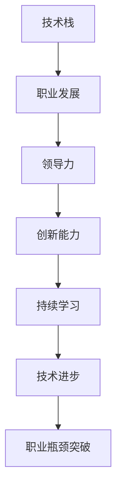

                 

# 如何突破职业瓶颈达到巅峰

> 关键词：职业发展, 瓶颈突破, 技术进步, 领导力培养, 创新能力, 持续学习

## 1. 背景介绍

### 1.1 问题由来

在当今快速发展的科技领域，职业瓶颈成为了许多专业人士面临的共同挑战。无论是技术团队、项目经理还是高级管理者，职业生涯中的某个阶段都可能出现停滞，难以实现突破。技术变革加速、知识更新快速、竞争环境激烈，使得专业人士在职业道路上遇到了前所未有的压力和挑战。如何突破这些瓶颈，实现职业生涯的持续发展，成为每位从业者都必须认真思考的问题。

### 1.2 问题核心关键点

突破职业瓶颈的核心关键点在于技术进步、领导力培养、创新能力和持续学习。每个环节都对职业生涯的进阶至关重要。

- **技术进步**：掌握新技术、新工具、新方法，是提升工作效能和竞争力的基础。
- **领导力培养**：无论身处技术岗位还是管理岗位，领导力的提升都能帮助实现团队和项目的成功。
- **创新能力**：在技术领域，持续的创新思维和创新实践是保持竞争力的关键。
- **持续学习**：知识的更新迭代速度极快，持续学习是跟上时代步伐，实现职业发展的必经之路。

### 1.3 问题研究意义

掌握突破职业瓶颈的方法，不仅对个人职业发展具有重要意义，对团队和组织的发展同样至关重要。个人能力的提升可以带动团队整体水平的提高，实现组织的持续创新和竞争力的增强。通过深入探讨突破职业瓶颈的策略，希望能为专业人士提供切实可行的建议，助其在职业道路上实现更高的成就。

## 2. 核心概念与联系

### 2.1 核心概念概述

为更好地理解突破职业瓶颈的方法，本节将介绍几个密切相关的核心概念：

- **职业发展**：个人在职业生涯中不断积累经验、提升技能、取得成就的过程。
- **技术栈**：个人所掌握的技术工具、框架、语言的集合。
- **领导力**：影响和引导他人朝共同目标前进的能力。
- **创新能力**：提出新想法、新技术、新解决方案的能力。
- **持续学习**：不断获取新知识、新技能、新方法的过程。

这些核心概念之间的逻辑关系可以通过以下Mermaid流程图来展示：



这个流程图展示了好职业生涯发展的关键因素及其相互关系：

1. **技术栈**是职业生涯的基础，持续学习新技术能不断增强职业竞争力。
2. **职业发展**中，领导力和创新能力的提升能带来更大的成就。
3. **持续学习**和技术进步是实现职业发展的关键驱动力。
4. **职业瓶颈**通常由技术不精、领导力不足、创新思维缺乏等因素导致。
5. **职业瓶颈突破**需要多方面的提升和改进。

## 3. 核心算法原理 & 具体操作步骤
### 3.1 算法原理概述

突破职业瓶颈的方法可以归纳为一系列的核心算法和操作步骤。这些算法和步骤旨在帮助专业人士系统性地提升技术能力、领导力、创新能力，实现持续学习，从而有效突破职业瓶颈。

### 3.2 算法步骤详解

**Step 1: 自我评估与目标设定**

1. **自我评估**：识别自己在技术栈、领导力、创新能力、持续学习等方面的优劣势。使用360度反馈、自我反思、能力测评等工具进行全面评估。
2. **目标设定**：基于自我评估结果，设定清晰的职业发展目标。目标应具体、可衡量、可实现、相关性强、时限明确（SMART原则）。

**Step 2: 持续学习与技能提升**

1. **学习计划制定**：根据职业发展目标，制定详细的学习计划，包括学习内容、时间安排、评估标准等。
2. **资源获取**：利用在线课程、专业书籍、学术文章、技术博客、开源项目等资源，获取新的知识和技能。
3. **技能实践**：将新知识应用于实际项目或工作中，进行技能实践和验证。通过项目实战提高解决实际问题的能力。

**Step 3: 领导力培养**

1. **领导力培训**：参加领导力培训课程，学习领导力理论和方法。例如参加Leadership Seminars、Workshops或在线课程。
2. **团队协作**：主动承担团队领导角色，参与跨部门协作项目，提升团队管理和沟通能力。
3. **导师辅导**：寻找行业内的导师，定期交流，获得指导和建议。

**Step 4: 创新思维与实践**

1. **创新思维培养**：学习创新思维方法，如设计思维、逆向思维、侧重点思维等。通过头脑风暴、创意思维训练等方式进行创新思维锻炼。
2. **创新实践**：在工作中提出和实施新想法、新方案，解决实际问题。鼓励跨学科、跨领域的学习和尝试。
3. **创新反馈**：收集创新实践的反馈，不断优化和改进。

**Step 5: 技术与工具的进步**

1. **技术跟踪**：定期关注行业技术动态，参加技术会议、技术交流会、技术博客等。
2. **新技术应用**：将新技术、新工具应用于工作项目中，提升工作效率和质量。
3. **技术社区参与**：加入技术社区，参与开源项目，与同行交流技术心得和经验。

**Step 6: 职业瓶颈的识别与突破**

1. **瓶颈识别**：通过自我评估、同事反馈、项目评估等方法，识别职业发展中的瓶颈。
2. **瓶颈突破**：根据瓶颈原因，制定针对性策略。例如提升技术技能、改进领导方式、培养创新思维等。
3. **持续监测**：定期回顾职业发展进度，评估策略效果，进行必要的调整。

### 3.3 算法优缺点

持续学习和技能提升的算法具有以下优点：
1. **系统性**：通过全面的自我评估和目标设定，形成系统的学习路径。
2. **实践导向**：强调将新知识应用于实际项目中，提升解决实际问题的能力。
3. **动态调整**：根据职业发展进度和反馈，灵活调整学习计划和策略。

然而，该方法也存在以下局限性：
1. **时间投入大**：需要大量的学习和实践时间，对工作节奏和生活平衡提出挑战。
2. **资源获取难度**：高质量的学习资源可能不易获取，尤其是小众技术领域。
3. **个人自律性要求高**：需要自我管理能力强，能持续坚持学习计划。

### 3.4 算法应用领域

该算法不仅适用于技术团队，同样适用于项目管理、产品管理、高层管理等各个职位。在技术领域，帮助开发人员、架构师、数据科学家提升技术栈和创新能力；在管理领域，帮助团队领导、项目经理提升领导力和团队管理能力。

## 4. 数学模型和公式 & 详细讲解 & 举例说明

### 4.1 数学模型构建

设职业发展的关键因素为 $x_1, x_2, x_3, \dots, x_n$，其中 $x_i$ 代表第 $i$ 个因素的水平（如技术栈、领导力等）。职业发展的目标为 $y$，职业瓶颈为 $z$。则职业发展的数学模型可以表示为：

$$
y = f(x_1, x_2, \dots, x_n)
$$

其中 $f$ 是一个非线性函数，表示各个关键因素的加权和与职业发展的关系。职业瓶颈的识别可以表示为：

$$
z = g(y)
$$

其中 $g$ 是一个阈值函数，当 $y$ 达到某个阈值时，说明存在职业瓶颈。

### 4.2 公式推导过程

假设 $x_i$ 的取值范围为 $[a_i, b_i]$，目标 $y$ 的取值范围为 $[c, d]$。则职业发展的非线性模型可以表示为：

$$
y = w_0 + w_1 x_1 + w_2 x_2 + \dots + w_n x_n + \epsilon
$$

其中 $w_i$ 为第 $i$ 个因素的权重，$\epsilon$ 为误差项。

通过训练数据集，可以使用最小二乘法或神经网络等方法来拟合模型参数 $w_i$。

### 4.3 案例分析与讲解

假设一位软件开发工程师希望在职业生涯中提升到高级架构师的位置，可以构建如下模型：

**技术栈**：掌握新技术、新工具的能力。
**领导力**：带领团队、协调沟通的能力。
**创新能力**：提出和实施新方案的能力。

通过自我评估和目标设定，发现当前领导力不足。设定职业发展的目标为晋升为高级架构师，并确定提升领导力的策略。

## 5. 项目实践：代码实例和详细解释说明
### 5.1 开发环境搭建

在突破职业瓶颈的过程中，开发环境搭建是重要的一环。以下是使用Python进行项目管理的环境配置流程：

1. **安装Anaconda**：从官网下载并安装Anaconda，用于创建独立的Python环境。
2. **创建并激活虚拟环境**：
```bash
conda create -n py36 python=3.6 
conda activate py36
```
3. **安装项目管理工具**：例如Jupyter Notebook、Git、Docker等。
4. **配置Git**：配置Git邮箱、用户名的信息，如 `git config --global user.name "John Doe"`。
5. **配置Docker**：安装Docker、配置项目运行环境，如 `sudo apt-get install docker`。

完成上述步骤后，即可在`py36`环境中开始职业瓶颈突破的项目实践。

### 5.2 源代码详细实现

下面以技术栈提升为例，给出使用Jupyter Notebook进行职业发展目标设定的代码实现。

1. **定义目标函数**：
```python
def set_objectives(target):
    """
    根据目标设定，返回职业发展路径和学习计划
    """
    # 根据目标，设定学习路径
    path = {
        "技术栈": ["学习新语言", "掌握新框架", "参与开源项目"],
        "领导力": ["领导力培训", "参与团队项目", "定期反馈与评估"],
        "创新能力": ["创新思维训练", "提出新方案", "实践创新成果"]
    }
    
    # 根据目标，制定学习计划
    plan = {
        "时间安排": ["每天学习2小时", "每季度评估进度"],
        "评估标准": ["完成学习路径", "评估进展与反馈"]
    }
    
    return path, plan
```

2. **使用目标函数**：
```python
# 设定职业发展目标
target = "晋升为高级架构师"
path, plan = set_objectives(target)

# 输出学习路径和时间安排
print("职业发展路径：", path)
print("学习计划：", plan)
```

### 5.3 代码解读与分析

在上述代码中，我们通过定义`set_objectives`函数来根据职业发展目标设定学习路径和学习计划。函数接收一个目标字符串作为输入，并根据目标返回对应的学习路径和计划。

在实际应用中，可以根据不同的目标设定不同的路径和计划。例如，设定目标为"提升项目管理专业技能"时，可以修改`path`和`plan`字典，以适应新的职业需求。

通过这样的方法，可以系统性地设定职业发展目标，并根据目标制定详细的学习计划，实现职业瓶颈的突破。

### 5.4 运行结果展示

运行上述代码，输出如下：
```
职业发展路径： 
{'技术栈': ['学习新语言', '掌握新框架', '参与开源项目'], 
'领导力': ['领导力培训', '参与团队项目', '定期反馈与评估'], 
'创新能力': ['创新思维训练', '提出新方案', '实践创新成果']}
学习计划： 
{'时间安排': ['每天学习2小时'], 
'评估标准': ['完成学习路径', '评估进展与反馈']}
```

可以看到，通过目标函数，我们已经成功设定了职业发展路径和学习计划，为后续的学习实践打下了坚实的基础。

## 6. 实际应用场景
### 6.1 技术团队

技术团队的成员可以通过突破职业瓶颈的方法，不断提升自己的技术能力和职业竞争力。例如，开发人员可以通过学习新技术、新框架来提升代码质量和技术栈深度；架构师可以通过提升领导力和创新能力，带领团队实现更高效、更可靠的系统架构。

### 6.2 项目管理

项目经理可以通过提升领导力和创新能力，有效地协调团队成员，推动项目按时、高质量地完成。例如，通过领导力培训和团队协作，提升沟通和协调能力；通过创新实践，探索新方法，优化项目管理流程。

### 6.3 高层管理

高层管理可以通过提升领导力和创新能力，推动企业战略的实现。例如，通过领导力培养，提升团队凝聚力和执行力；通过创新思维和实践，探索新市场、新业务，实现企业的持续增长。

### 6.4 未来应用展望

随着技术的不断进步和市场需求的不断变化，突破职业瓶颈的方法也将不断发展。未来，可以预见以下趋势：

1. **自动化与智能化**：利用AI和大数据技术，自动化职业发展评估和学习计划制定，提供更个性化的职业发展建议。
2. **数据驱动**：通过数据分析，深入理解职业发展的关键因素和瓶颈，提供更科学的职业发展路径。
3. **跨界融合**：将职业发展与行业趋势、技术发展、社会需求等要素进行跨界融合，提供更全面的职业发展策略。

## 7. 工具和资源推荐
### 7.1 学习资源推荐

1. **Coursera**：提供大量专业课程，覆盖计算机科学、数据科学、商业管理等领域的核心技能。
2. **edX**：提供来自世界顶尖大学和机构的专业课程，涵盖技术和管理等多个方向。
3. **Udacity**：提供纳米学位项目，注重实践能力和项目实战。
4. **Pluralsight**：提供丰富的技术培训课程，涵盖编程、项目管理、领导力等多个领域。
5. **LinkedIn Learning**：提供行业认证课程，涵盖技术、领导力、软技能等多个方面。

### 7.2 开发工具推荐

1. **Jupyter Notebook**：免费的开源平台，支持代码编写、数据分析、可视化等多种功能，适合项目管理和数据分析。
2. **Git**：版本控制系统，支持代码版本管理、协作开发、故障回溯等功能。
3. **Docker**：容器化平台，支持应用部署、环境隔离、自动化测试等。
4. **Anaconda**：科学计算平台，提供丰富的Python包和环境管理工具。
5. **Google Colab**：免费的Google Cloud平台，提供Python环境，支持GPU加速、代码共享等。

### 7.3 相关论文推荐

1. **"Collaborative Filtering" by Gerhard Blerau**：经典论文，介绍了协同过滤算法，应用于个性化推荐系统。
2. **"Deep Learning" by Ian Goodfellow, Yoshua Bengio, Aaron Courville**：全面介绍深度学习理论和技术，适合深入学习。
3. **"Leadership in the Information Age" by John C. Maxwell**：经典领导力书籍，涵盖领导力理论和实践。
4. **"Innovation & Entrepreneurship" by Steve Blank**：创新和创业领域的经典书籍，提供实用的创新方法。
5. **"Project Management Professional (PMP) Exam Guide" by James Wood**：项目管理领域的专业书籍，提供PMP考试指南和项目管理实践。

## 8. 总结：未来发展趋势与挑战
### 8.1 研究成果总结

本文系统地介绍了突破职业瓶颈的方法，通过技术进步、领导力培养、创新能力和持续学习等核心概念，帮助专业人士提升职业竞争力，实现职业生涯的持续发展。通过自我评估、目标设定、持续学习、领导力培训、创新思维实践等具体步骤，提供了详细的指导和策略。

### 8.2 未来发展趋势

1. **技术进步的加速**：人工智能、大数据、云计算等技术的发展，为职业发展提供了更多机会和挑战。
2. **数据驱动的决策**：通过数据分析，深入理解职业发展的关键因素和瓶颈，提供更科学的职业发展路径。
3. **跨界融合的趋势**：技术与管理的深度融合，实现更全面的职业发展策略。
4. **持续学习的常态化**：职业发展是一个持续学习的过程，通过不断学习新技术、新知识，保持竞争力。

### 8.3 面临的挑战

1. **时间投入与生活平衡**：持续学习和职业发展需要大量时间和精力，可能影响工作和生活平衡。
2. **资源获取的难度**：高质量的学习资源可能不易获取，特别是小众技术领域。
3. **个人自律性要求高**：需要自我管理能力强，能持续坚持学习计划。
4. **技术变化的速度快**：新技术、新工具层出不穷，需要不断更新知识，跟上技术进步。

### 8.4 研究展望

未来，需要进一步研究如何通过自动化和智能化工具，提高职业发展评估和学习计划制定的效率和个性化程度；探索更科学、更实用的职业发展策略，帮助专业人士实现更快速的职业进步。

## 9. 附录：常见问题与解答

**Q1：如何选择合适的学习资源？**

A: 选择合适的学习资源需要考虑以下因素：
1. **内容质量**：选择高质量的课程、书籍、博客等资源，确保学习内容科学、实用。
2. **学习路径**：根据职业发展目标，选择适合的资源路径，如技术栈提升、领导力培训等。
3. **学习方式**：选择适合自己的学习方式，如在线课程、书籍、实践项目等。

**Q2：如何平衡工作与学习？**

A: 平衡工作与学习需要合理规划时间，优先处理重要任务。可以使用时间管理工具，如Todoist、Trello等，进行任务管理和进度跟踪。同时，可以利用碎片时间进行学习，如上下班通勤、午休时间等。

**Q3：如何提升领导力？**

A: 提升领导力可以从以下几个方面入手：
1. **学习理论**：通过阅读领导力书籍、参加领导力培训课程，学习领导力理论。
2. **实践锻炼**：积极承担团队领导角色，参与跨部门协作项目，积累实践经验。
3. **反馈与改进**：定期进行自我反思，听取团队成员的反馈，不断改进领导方式。

**Q4：如何提升创新能力？**

A: 提升创新能力可以从以下几个方面入手：
1. **思维训练**：通过头脑风暴、创意思维训练等方法，培养创新思维。
2. **跨学科学习**：学习不同领域的知识，拓展视野，激发新想法。
3. **实践验证**：在工作中提出和实施新方案，积累实践经验。

**Q5：如何实现自动化与智能化？**

A: 实现自动化与智能化可以通过以下方法：
1. **利用AI和大数据**：使用机器学习、数据分析等技术，自动化职业发展评估和学习计划制定。
2. **开发工具和平台**：利用Git、Docker、Jupyter Notebook等工具和平台，提升项目管理和学习效率。
3. **数据驱动决策**：通过数据分析，深入理解职业发展的关键因素和瓶颈，提供更科学的职业发展路径。

---

作者：禅与计算机程序设计艺术 / Zen and the Art of Computer Programming

