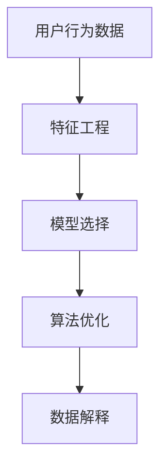

                 

# 如何进行有效的用户行为分析

> 关键词：用户行为分析, 数据处理, 机器学习, 算法优化, 行为预测

## 1. 背景介绍

### 1.1 问题由来

在数字化时代，用户行为数据正成为企业竞争力的重要来源。有效的用户行为分析不仅能洞察用户需求，指导产品迭代，还能优化用户体验，提升品牌忠诚度。然而，用户行为数据通常规模庞大、维度繁多，如何从中提取有价值的信息，成为了一个重要的挑战。传统的数据分析方法往往依赖人工提取特征、构建模型，耗时耗力，且容易忽略数据背后的复杂关联。

### 1.2 问题核心关键点

为了应对这一挑战，机器学习技术逐渐成为用户行为分析的新趋势。通过构建高效的算法模型，可以从用户行为数据中自动学习特征，识别行为模式，预测未来行为，极大地提高了数据处理的效率和准确性。但即使如此，用户行为分析仍面临诸多难点：

- 数据预处理：如何从原始数据中提取有效的特征，处理缺失值、异常值等问题。
- 模型选择：用户行为数据的维度高，建模时需要选择适合的算法，以避免过拟合或欠拟合。
- 数据解释：预测结果如何解释？如何判断模型的可信度？

## 2. 核心概念与联系

### 2.1 核心概念概述

在进行用户行为分析时，需要涉及以下核心概念：

- **用户行为数据**：用户在各个渠道（网站、App、社交媒体等）上的行为数据，如点击、浏览、购买、评价等。
- **特征工程**：将原始数据转换为可用于机器学习算法分析的特征。
- **模型选择**：根据数据特性选择合适的算法，如决策树、随机森林、神经网络等。
- **算法优化**：通过参数调优、特征选择、数据增强等手段，提高模型性能。
- **数据解释**：通过可视化、指标分析等手段，解释模型的预测结果，验证模型效果。

这些概念之间的逻辑关系可以通过以下Mermaid流程图来展示：



这个流程图展示了一系列用户行为分析的关键环节，每个环节都是不可或缺的。通过理解这些核心概念，我们可以更好地把握用户行为分析的工作流程和方法。

## 3. 核心算法原理 & 具体操作步骤
### 3.1 算法原理概述

用户行为分析的核心在于从原始数据中提取有用的特征，并构建算法模型对用户行为进行预测或分类。以下是几种常见的算法原理：

- **回归算法**：如线性回归、逻辑回归、随机森林等，用于预测连续型用户行为指标，如用户购买次数、评分等。
- **分类算法**：如决策树、支持向量机(SVM)、神经网络等，用于分类用户行为，如是否点击广告、是否卸载应用等。
- **聚类算法**：如K-means、层次聚类等，用于对用户行为进行分类，发现用户群体特征。
- **关联规则学习**：如Apriori算法，用于挖掘用户行为之间的关联，发现购物篮模型、用户偏好等。

### 3.2 算法步骤详解

用户行为分析的基本步骤包括：

1. **数据收集**：从网站、App、社交媒体等渠道收集用户行为数据，包括点击、浏览、购买、评价等信息。
2. **数据预处理**：清洗数据，处理缺失值、异常值，进行特征工程，如数据归一化、编码等。
3. **模型训练**：选择合适的算法，在训练集上训练模型，优化超参数。
4. **模型评估**：在验证集上评估模型性能，选择合适的模型。
5. **模型应用**：在测试集上应用模型，预测新用户的行为，并进行可视化分析。

### 3.3 算法优缺点

用户行为分析算法的主要优点包括：

- **自动化**：能够自动从大量数据中提取特征，选择模型，提高处理效率。
- **灵活性**：适用于多种类型的用户行为数据，如连续型、离散型、文本型等。
- **可解释性**：通过可视化工具，可以直观地展示模型预测结果和特征重要性。

但同时也存在一些缺点：

- **数据质量要求高**：需要高质量、完整的数据，否则模型效果不佳。
- **特征工程复杂**：需要专业知识来选择和构造特征，模型效果依赖于特征工程的质量。
- **模型复杂度**：某些高级算法模型可能过于复杂，难以解释和调试。

### 3.4 算法应用领域

用户行为分析在多个领域都有广泛应用：

- **电商领域**：通过用户点击、购买行为，预测购买意愿，优化推荐系统。
- **金融领域**：通过用户交易行为，预测信用风险，识别异常交易。
- **社交媒体**：通过用户互动行为，预测用户活跃度，优化社区内容。
- **移动应用**：通过用户使用行为，优化App功能，提升用户留存率。
- **医疗领域**：通过用户健康行为，预测疾病风险，制定个性化健康方案。

## 4. 数学模型和公式 & 详细讲解  
### 4.1 数学模型构建

用户行为分析通常需要构建预测模型。以下以回归模型为例，说明模型的构建过程。

假设用户行为数据为 $x_i$，对应的行为指标为 $y_i$，其中 $x_i$ 包含多个特征 $x_i^{(1)}, x_i^{(2)}, ..., x_i^{(n)}$，则回归模型的目标是找到最佳的权重向量 $\theta$，使得预测值 $\hat{y}_i$ 尽量接近真实值 $y_i$。数学模型可表示为：

$$
\hat{y}_i = \theta_0 + \theta_1 x_i^{(1)} + \theta_2 x_i^{(2)} + ... + \theta_n x_i^{(n)}
$$

其中 $\theta_0, \theta_1, ..., \theta_n$ 为模型参数，需要通过训练数据求解。

### 4.2 公式推导过程

回归模型常用的求解方法包括最小二乘法和梯度下降法。以下以梯度下降法为例，推导求解公式。

梯度下降法的基本思想是，通过迭代计算损失函数 $\mathcal{L}$ 的梯度，并不断更新参数 $\theta$，使得损失函数最小化。假设损失函数为均方误差，则梯度更新公式为：

$$
\theta_j = \theta_j - \alpha \frac{\partial \mathcal{L}}{\partial \theta_j}
$$

其中 $\alpha$ 为学习率，$\partial \mathcal{L} / \partial \theta_j$ 为损失函数对参数 $\theta_j$ 的偏导数。通过不断迭代更新参数 $\theta$，即可得到最终的模型预测值。

### 4.3 案例分析与讲解

假设有一家电商网站，收集了用户点击、购买、评价等行为数据。目标是根据用户行为数据，预测其购买次数。

1. **数据收集**：从网站后台收集用户行为数据，包括点击次数、购买金额、评价评分等。
2. **数据预处理**：处理缺失值，进行特征工程，如归一化、编码等。
3. **模型训练**：选择线性回归模型，在训练集上训练模型，优化超参数。
4. **模型评估**：在验证集上评估模型性能，选择最优模型。
5. **模型应用**：在测试集上应用模型，预测新用户的行为，并进行可视化分析。

## 5. 项目实践：代码实例和详细解释说明
### 5.1 开发环境搭建

在进行用户行为分析时，需要使用Python进行开发。以下是开发环境的搭建步骤：

1. 安装Python 3.x 和pip：
```
sudo apt-get install python3 python3-pip
```

2. 安装相关库：
```
pip install pandas numpy scikit-learn matplotlib seaborn jupyter notebook
```

3. 准备数据集：准备用户行为数据集，分为训练集、验证集和测试集。

### 5.2 源代码详细实现

以下是一个基于用户行为数据的回归分析示例代码：

```python
import pandas as pd
from sklearn.linear_model import LinearRegression
from sklearn.model_selection import train_test_split
from sklearn.metrics import mean_squared_error

# 读取数据集
data = pd.read_csv('user_behavior.csv')

# 数据预处理
data = data.dropna()
data = pd.get_dummies(data)

# 划分训练集和测试集
X = data.drop('purchase_count', axis=1)
y = data['purchase_count']
X_train, X_test, y_train, y_test = train_test_split(X, y, test_size=0.2, random_state=42)

# 模型训练
model = LinearRegression()
model.fit(X_train, y_train)

# 模型评估
y_pred = model.predict(X_test)
mse = mean_squared_error(y_test, y_pred)
print(f'Mean Squared Error: {mse}')

# 模型应用
new_data = pd.read_csv('new_user_behavior.csv')
new_data = new_data.dropna()
new_data = pd.get_dummies(new_data)
y_pred = model.predict(new_data)
print(f'Predicted Purchase Counts: {y_pred}')
```

### 5.3 代码解读与分析

**数据预处理**：
- 使用pandas库读取数据集，使用dropna方法去除缺失值，使用get_dummies方法将分类变量转换为哑变量。

**模型训练**：
- 使用sklearn库中的LinearRegression模型，使用fit方法训练模型。

**模型评估**：
- 使用mean_squared_error方法计算模型在测试集上的均方误差。

**模型应用**：
- 使用训练好的模型对新数据进行预测，并输出预测结果。

## 6. 实际应用场景
### 6.1 电商推荐系统

用户行为分析在电商推荐系统中的应用非常广泛。通过分析用户的历史购买、浏览行为，可以发现用户的偏好和需求，从而推荐个性化的商品。

例如，某电商网站收集了用户的浏览记录和购买记录，通过分析这些行为数据，可以发现用户对某类商品的偏好，从而推荐相似商品。这不仅提高了用户的购物体验，也提高了平台的转化率和销售额。

### 6.2 金融风控系统

金融风控系统需要实时监控用户的交易行为，识别异常交易，预防欺诈行为。通过分析用户的历史交易数据，可以构建异常检测模型，预测用户的交易行为，及时发现并制止潜在的欺诈行为。

例如，某银行收集了用户的交易记录，通过分析这些行为数据，可以发现用户的交易行为模式，从而预测用户是否存在欺诈行为。这不仅提高了金融系统的安全性，也增强了用户对银行的信任度。

### 6.3 社交媒体分析

社交媒体平台需要了解用户的活跃度、兴趣点，以优化内容推送和广告投放。通过分析用户的行为数据，可以构建用户画像，识别用户的兴趣点，从而推送个性化的内容。

例如，某社交媒体平台收集了用户的互动数据，通过分析这些行为数据，可以发现用户的兴趣点，从而推送相关的广告内容。这不仅提高了广告的点击率，也增强了用户的粘性。

### 6.4 移动应用优化

移动应用需要了解用户的使用行为，优化应用功能和用户体验。通过分析用户的使用数据，可以发现用户的常见操作，从而优化应用界面和功能。

例如，某手机应用收集了用户的使用数据，通过分析这些行为数据，可以发现用户常用的功能，从而优化应用的布局和功能。这不仅提高了用户的使用体验，也增强了用户的忠诚度。

## 7. 工具和资源推荐
### 7.1 学习资源推荐

以下是一些推荐的学习资源，帮助你更好地掌握用户行为分析：

1. 《Python数据科学手册》：介绍了Python在数据科学中的应用，包括数据预处理、模型训练等。

2. 《机器学习实战》：提供了多个机器学习算法的实现和应用案例，适合实践学习。

3. Kaggle：提供了丰富的数据集和比赛，可以帮助你练习数据预处理和模型构建。

4. Coursera上的机器学习课程：由斯坦福大学教授Andrew Ng讲授，系统介绍了机器学习的基础理论和实践技巧。

5. TensorFlow官方文档：提供了TensorFlow的详细使用方法和示例，适合深入学习。

### 7.2 开发工具推荐

以下是一些推荐的开发工具，帮助你高效地进行用户行为分析：

1. Jupyter Notebook：提供了交互式的代码编写和数据可视化功能，适合进行数据处理和模型训练。

2. Visual Studio Code：提供了丰富的扩展插件，支持多种编程语言和数据可视化工具。

3. Anaconda：提供了Python的虚拟环境管理工具，方便不同项目之间的切换和管理。

4. PyCharm：提供了智能的代码补全和调试功能，适合进行复杂的项目开发。

### 7.3 相关论文推荐

以下是一些推荐的相关论文，帮助你了解用户行为分析的前沿技术：

1. "The Elements of Statistical Learning"：提供了全面的机器学习理论和算法实现，适合深入学习。

2. "User Behavior Analysis in Online Shopping: A Survey"：介绍了用户行为分析在电商领域的应用现状和未来趋势。

3. "Anomaly Detection in Financial Transactions"：介绍了金融风控中的异常检测算法和实现方法。

4. "Social Media Sentiment Analysis: A Review"：介绍了社交媒体情感分析的研究现状和应用案例。

5. "Mobile Application User Behavior Analysis"：介绍了移动应用用户行为分析的研究方法和实际应用。

## 8. 总结：未来发展趋势与挑战
### 8.1 总结

用户行为分析是数字化时代的重要应用，通过构建高效的算法模型，可以从用户行为数据中自动学习特征，识别行为模式，预测未来行为，极大地提高了数据处理的效率和准确性。本文从数据预处理、模型选择、算法优化、数据解释等方面，详细介绍了用户行为分析的基本流程和常用方法。

### 8.2 未来发展趋势

展望未来，用户行为分析将呈现以下几个发展趋势：

1. **自动化程度提高**：随着机器学习技术的不断发展，用户行为分析将越来越自动化，减少人工干预。
2. **多模态数据融合**：用户行为数据不再局限于单一类型，更多地涉及文本、图像、视频等多种类型的数据。如何高效地融合这些数据，将成为新的研究方向。
3. **深度学习模型应用**：深度学习模型在用户行为分析中的应用将越来越广泛，如卷积神经网络(CNN)、循环神经网络(RNN)等。
4. **实时分析和预测**：用户行为分析将越来越多地涉及实时分析和预测，如实时异常检测、实时推荐系统等。
5. **隐私保护和伦理问题**：随着用户行为数据的不断增加，如何保护用户隐私和伦理问题将变得更为重要。

### 8.3 面临的挑战

尽管用户行为分析在各个领域都取得了一定的成果，但仍面临一些挑战：

1. **数据质量和数量**：高质量、大量化的用户行为数据是模型训练的基础，但数据的收集和处理往往需要耗费大量的时间和资源。
2. **模型复杂度**：深度学习模型的复杂度较高，模型训练和调试需要一定的专业知识，难以普及应用。
3. **模型可解释性**：深度学习模型的预测结果难以解释，模型的可信度需要进一步提高。
4. **实时处理能力**：用户行为数据的实时处理和预测需要强大的计算资源，如何提高实时处理能力是一个重要问题。

### 8.4 研究展望

未来的用户行为分析需要在以下几个方面进行深入研究：

1. **自动化特征工程**：研究自动化的特征工程方法，减少人工干预。
2. **多模态数据融合**：研究多模态数据的融合方法，提高数据的利用效率。
3. **轻量级模型**：研究轻量级的深度学习模型，降低计算资源的消耗。
4. **实时处理技术**：研究高效的实时处理技术，提高实时分析和预测的效率。
5. **隐私保护技术**：研究隐私保护技术，保护用户数据的安全性和隐私。

只有不断突破这些挑战，才能使用户行为分析技术更好地服务于各个领域，为用户提供更好的服务体验。

## 9. 附录：常见问题与解答

**Q1：用户行为数据的质量如何保证？**

A: 用户行为数据的质量是用户行为分析的基础，需要通过以下方法保证数据质量：

1. **数据清洗**：去除异常值、缺失值、重复数据等，保证数据的完整性和准确性。
2. **数据标注**：为数据添加标签，帮助模型更好地理解数据的含义。
3. **数据标准化**：对数据进行标准化处理，如归一化、编码等，保证数据的一致性。

**Q2：如何选择用户行为分析的算法？**

A: 选择用户行为分析的算法需要考虑多个因素，包括数据的类型、规模、目标等：

1. **数据类型**：如果数据是连续型，可以选择回归算法，如线性回归、决策树等；如果数据是离散型，可以选择分类算法，如逻辑回归、SVM等。
2. **数据规模**：如果数据规模较大，可以选择随机森林、神经网络等算法，如果数据规模较小，可以选择简单的线性回归、决策树等算法。
3. **目标**：如果目标是预测连续型指标，可以选择回归算法；如果目标是分类，可以选择分类算法。

**Q3：如何解释用户行为分析的模型结果？**

A: 解释用户行为分析的模型结果需要结合可视化工具和指标分析：

1. **可视化工具**：使用Matplotlib、Seaborn等可视化工具，展示模型的预测结果和特征重要性。
2. **指标分析**：使用混淆矩阵、ROC曲线等指标，分析模型的性能和泛化能力。
3. **可解释模型**：选择可解释性强的模型，如线性回归、决策树等，帮助解释模型的预测结果。

**Q4：用户行为分析的数据来源有哪些？**

A: 用户行为分析的数据来源多种多样，包括：

1. **网站和应用**：从网站和应用的日志中收集用户行为数据。
2. **社交媒体**：从社交媒体平台收集用户的互动数据。
3. **交易数据**：从金融机构的交易记录中收集用户的行为数据。
4. **调查问卷**：通过调查问卷收集用户的行为和偏好数据。

**Q5：用户行为分析的局限性有哪些？**

A: 用户行为分析虽然有很多优点，但也存在一些局限性，包括：

1. **数据隐私问题**：用户行为数据涉及隐私，需要采取合适的隐私保护措施。
2. **数据分布不均**：用户行为数据可能存在分布不均的问题，需要处理长尾数据。
3. **模型过拟合**：用户行为数据可能存在过拟合问题，需要选择适当的算法和模型。
4. **模型泛化能力**：用户行为分析的模型需要具有良好的泛化能力，以应对新的数据。

---

作者：禅与计算机程序设计艺术 / Zen and the Art of Computer Programming

