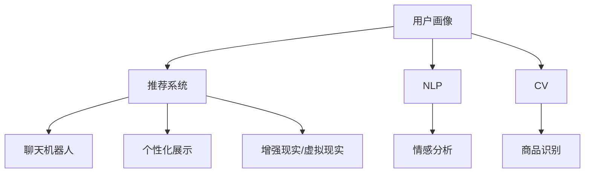

                 

## 1. 背景介绍

随着电商市场的不断扩大，优化用户购物体验成为提升电商企业竞争力的关键。过去，电商企业主要依靠人工客服、广告推荐和搜索算法等方式来提升用户体验，但这些方式存在效率低、成本高、个性化不足等问题。近年来，随着人工智能技术的发展，通过AI技术优化用户购物体验成为一种趋势，并逐渐在电商领域得到应用。

AI技术可以通过大数据分析、自然语言处理、计算机视觉等手段，实时收集用户行为数据，理解用户需求，推荐个性化商品，并提高客户服务质量。因此，本文将探讨如何通过AI技术优化用户购物体验，并结合实际案例，介绍相关技术和实践方法。

## 2. 核心概念与联系

### 2.1 核心概念概述

为了更好地理解如何通过AI技术优化用户购物体验，本节将介绍几个关键的概念：

- **用户画像**：指对用户的兴趣、行为、属性等方面的描述，通过大数据分析得到。用户画像可以帮助电商平台更精准地理解用户需求，从而提供个性化推荐和营销。
- **推荐系统**：通过机器学习算法分析用户行为数据，为用户推荐符合其兴趣的商品或内容。推荐系统是AI优化用户购物体验的核心技术之一。
- **自然语言处理(NLP)**：处理和分析人类语言的技术，可以用于聊天机器人、用户评论情感分析等场景，帮助电商平台更准确地理解用户需求和反馈。
- **计算机视觉(CV)**：分析和识别图像、视频等视觉内容，可以用于商品识别、个性化展示等场景。
- **增强现实(AR)/虚拟现实(VR)**：通过AR/VR技术，为用户提供沉浸式购物体验，提高用户满意度。

### 2.2 核心概念原理和架构的 Mermaid 流程图



这个流程图展示了各核心概念之间的关系：

- 用户画像基于用户的浏览、购买行为数据，通过聚类、分类等算法进行分析，得到详尽的描述。
- 推荐系统以用户画像为基础，通过协同过滤、内容推荐、混合推荐等算法为用户推荐商品。
- NLP用于分析用户评论、搜索查询等文本数据，获取用户情感、意图等信息。
- CV用于商品图像识别，提取商品的特征信息，帮助推荐系统和个性化展示。
- 聊天机器人通过NLP技术进行语义理解，提供智能客服。
- 个性化展示结合CV和AR技术，提升商品展示效果。

## 3. 核心算法原理 & 具体操作步骤

### 3.1 算法原理概述

AI优化用户购物体验的核心算法包括用户画像建模、推荐系统设计、NLP情感分析、商品识别等。这些算法基于大数据分析和机器学习技术，能够实时地分析用户行为数据，提供个性化的推荐和展示。

用户画像建模是基础，通过对用户行为数据的分析，得到用户画像，从而更好地理解用户需求。推荐系统设计则通过用户画像和商品特征，为用户推荐合适的商品。NLP情感分析用于理解用户评论和反馈，商品识别用于提高商品展示效果。这些算法相互协作，共同优化用户体验。

### 3.2 算法步骤详解

#### 3.2.1 用户画像建模

1. **数据收集**：收集用户浏览、购买、搜索等行为数据，包括用户点击的商品、浏览时间、搜索关键词等。
2. **数据预处理**：对收集到的数据进行清洗、去重、归一化等预处理，去除噪音数据，提升数据质量。
3. **特征提取**：从处理后的数据中提取关键特征，如商品类别、品牌、价格、用户评分等。
4. **聚类分析**：使用聚类算法（如K-means、层次聚类等）对用户进行分组，得到用户画像。

#### 3.2.2 推荐系统设计

1. **算法选择**：选择合适的推荐算法，如协同过滤、基于内容的推荐、混合推荐等。
2. **模型训练**：使用用户画像和商品特征，训练推荐模型。
3. **推荐测试**：使用测试集对推荐模型进行评估，优化模型参数。
4. **实时推荐**：部署推荐模型到生产环境，实时为每个用户推荐商品。

#### 3.2.3 NLP情感分析

1. **文本预处理**：对用户评论、搜索关键词等文本数据进行清洗、去噪、分词等预处理。
2. **情感分类**：使用情感分析模型对文本进行情感分类，如正面、负面、中性等。
3. **意图识别**：使用意图识别模型分析用户评论、反馈等文本，识别用户的意图和需求。
4. **结果应用**：将情感分析和意图识别结果用于调整推荐策略和优化商品展示。

#### 3.2.4 商品识别

1. **数据收集**：收集商品图像数据，包括商品的正面、侧面、背面等多角度图像。
2. **特征提取**：使用卷积神经网络（CNN）等深度学习算法提取商品特征。
3. **商品分类**：使用分类算法对商品进行分类，如T恤、裤子、鞋等。
4. **商品展示**：结合商品识别结果和AR/VR技术，提升商品展示效果。

### 3.3 算法优缺点

AI优化用户购物体验的算法具有以下优点：

- **个性化推荐**：通过分析用户行为数据，提供个性化推荐，提高用户满意度和转化率。
- **实时性**：通过实时分析用户行为数据，能够快速响应用户需求，提高用户体验。
- **成本低**：相较于人工客服和传统广告推荐，AI技术能够降低运营成本。

但这些算法也存在一些缺点：

- **数据隐私问题**：用户行为数据涉及个人隐私，如何保护用户隐私成为关键问题。
- **算法复杂度**：这些算法通常需要大量的数据和复杂的模型，对计算资源要求较高。
- **模型解释性**：AI算法的黑盒性质，使得其决策过程难以解释，用户难以理解。

### 3.4 算法应用领域

AI优化用户购物体验的算法在电商、金融、旅游等领域都有广泛的应用。

- **电商**：通过推荐系统、聊天机器人、商品识别等技术，提升用户购物体验。
- **金融**：使用情感分析、意图识别等技术，提高金融产品推荐和用户满意度。
- **旅游**：使用计算机视觉和增强现实技术，提升旅游目的地展示效果，提高用户体验。

## 4. 数学模型和公式 & 详细讲解

### 4.1 数学模型构建

AI优化用户购物体验的数学模型主要包括以下几个部分：

- **用户画像建模**：基于用户行为数据，构建用户画像的数学模型。
- **推荐系统设计**：使用协同过滤、基于内容的推荐、混合推荐等算法，设计推荐模型的数学模型。
- **NLP情感分析**：使用情感分析模型对文本进行情感分类和意图识别。
- **商品识别**：使用卷积神经网络等深度学习算法，提取商品特征。

### 4.2 公式推导过程

#### 4.2.1 用户画像建模

用户画像建模主要涉及聚类算法的应用，以K-means算法为例：

$$
\text{目标函数} = \min_{\mu, C}\sum_{i=1}^{N}\sum_{k=1}^{K}\rho(x_i,\mu_k)^2 + \lambda\left|\sum_{i\in C_k}\right|
$$

其中，$x_i$表示第$i$个用户的数据向量，$\mu_k$表示聚类中心，$\rho$表示欧式距离，$\lambda$表示聚类数目的惩罚项，$C_k$表示第$k$个聚类的用户集合。

#### 4.2.2 推荐系统设计

推荐系统设计主要涉及协同过滤算法，以基于用户的协同过滤为例：

$$
\text{目标函数} = \min_{\theta}\sum_{i=1}^{N}\sum_{j=1}^{M}(y_{ij} - u_i^Tv_j)^2
$$

其中，$y_{ij}$表示用户$i$对商品$j$的评分，$u_i$和$v_j$表示用户和商品的隐向量，$\theta$表示矩阵的参数。

#### 4.2.3 NLP情感分析

NLP情感分析主要涉及情感分类模型，以朴素贝叶斯分类器为例：

$$
P(y|x) = \frac{P(x|y)P(y)}{P(x)}
$$

其中，$y$表示情感类别，$x$表示文本特征向量，$P(y)$表示情感类别先验概率，$P(x|y)$表示文本特征向量在情感类别下的条件概率。

#### 4.2.4 商品识别

商品识别主要涉及卷积神经网络，以LeNet-5为例：

$$
\text{输出} = f(\sigma(\text{卷积层}(\text{输入}, \text{卷积核})))
$$

其中，$f$表示激活函数，$\sigma$表示Sigmoid函数，卷积层表示卷积操作，$\text{输入}$表示输入图像，$\text{卷积核}$表示卷积核参数。

### 4.3 案例分析与讲解

**案例：电商平台个性化推荐系统**

某电商平台通过用户画像和推荐系统优化用户体验。具体步骤如下：

1. **用户画像建模**：收集用户浏览、购买、搜索等行为数据，使用K-means算法对用户进行聚类，得到用户画像。
2. **推荐系统设计**：基于用户画像和商品特征，使用协同过滤算法训练推荐模型，实时为用户推荐商品。
3. **NLP情感分析**：对用户评论和反馈进行情感分类和意图识别，调整推荐策略和优化商品展示。
4. **商品识别**：使用LeNet-5模型提取商品图像特征，提升商品展示效果。

通过上述步骤，电商平台能够提供个性化的推荐和展示，提高用户满意度和转化率。

## 5. 项目实践：代码实例和详细解释说明

### 5.1 开发环境搭建

在进行AI优化用户购物体验的开发实践前，需要准备好开发环境。以下是使用Python进行开发的环境配置流程：

1. **安装Anaconda**：从官网下载并安装Anaconda，用于创建独立的Python环境。
2. **创建并激活虚拟环境**：
```bash
conda create -n user_dev python=3.8 
conda activate user_dev
```

3. **安装相关依赖**：
```bash
pip install numpy pandas scikit-learn scipy matplotlib seaborn
```

4. **安装TensorFlow和PyTorch**：
```bash
pip install tensorflow==2.7.0 pytorch==1.7.0
```

5. **安装TensorFlow Addons和TensorBoard**：
```bash
pip install tensorboard tensorflow_addons
```

完成上述步骤后，即可在`user_dev`环境中开始开发实践。

### 5.2 源代码详细实现

**用户画像建模**

```python
from sklearn.cluster import KMeans
import pandas as pd

# 加载用户行为数据
data = pd.read_csv('user_data.csv')

# 特征工程
data = data.dropna(subset=['time', 'category', 'item_id', 'price', 'rating'])
X = data[['time', 'category', 'item_id', 'price', 'rating']]

# K-means聚类
kmeans = KMeans(n_clusters=5, random_state=42)
kmeans.fit(X)

# 将用户划分到不同的聚类中
user_clusters = kmeans.labels_
```

**推荐系统设计**

```python
import tensorflow as tf
from tensorflow.keras.layers import Input, Dense, Embedding, dot
from tensorflow.keras.models import Model

# 定义模型
inputs = Input(shape=(100,))
item_embs = Embedding(1000, 100)(inputs)
user_embs = Embedding(5000, 100)(inputs)
ratings = dot([item_embs, user_embs], axes=1)
ratings = Dense(1, activation='sigmoid')(ratings)
model = Model(inputs, ratings)

# 编译模型
model.compile(optimizer='adam', loss='binary_crossentropy')

# 训练模型
model.fit(X_train, y_train, epochs=10, batch_size=64, validation_data=(X_val, y_val))
```

**NLP情感分析**

```python
from sklearn.feature_extraction.text import CountVectorizer
from sklearn.naive_bayes import MultinomialNB
from sklearn.pipeline import Pipeline

# 加载评论数据
data = pd.read_csv('reviews.csv')

# 文本预处理
data['text'] = data['text'].apply(lambda x: x.lower())

# 特征提取
vectorizer = CountVectorizer(stop_words='english')
X = vectorizer.fit_transform(data['text'])

# 情感分类
model = Pipeline(steps=[('vect', vectorizer), ('clf', MultinomialNB())])
model.fit(X, data['sentiment'])

# 预测情感
text = ['This product is amazing', 'I hate this product']
text_vectorized = vectorizer.transform(text)
predictions = model.predict(text_vectorized)
```

**商品识别**

```python
import tensorflow as tf
from tensorflow.keras.models import Sequential
from tensorflow.keras.layers import Conv2D, MaxPooling2D, Flatten, Dense

# 加载商品图像数据
data = pd.read_csv('items.csv')

# 特征提取
X = data['image'].apply(lambda x: np.array(x.split(', ')))
X = X.apply(lambda x: x.reshape((28, 28)))

# 模型定义
model = Sequential([
    Conv2D(32, (3, 3), activation='relu'),
    MaxPooling2D((2, 2)),
    Flatten(),
    Dense(10, activation='softmax')
])

# 编译模型
model.compile(optimizer='adam', loss='categorical_crossentropy')

# 训练模型
model.fit(X_train, y_train, epochs=10, batch_size=32, validation_data=(X_val, y_val))
```

### 5.3 代码解读与分析

**用户画像建模**

用户画像建模的代码主要实现了K-means聚类算法。首先，通过加载用户行为数据，进行特征工程，去除缺失值和无用特征，得到最终用于聚类的特征数据。然后，使用K-means算法对用户进行聚类，得到用户画像。

**推荐系统设计**

推荐系统设计的代码主要实现了基于协同过滤的推荐模型。首先，定义了输入层、用户嵌入层、商品嵌入层和评分层，构建了推荐模型。然后，编译模型，使用Adam优化器和二元交叉熵损失函数进行训练。最后，使用训练好的模型进行实时推荐。

**NLP情感分析**

NLP情感分析的代码主要实现了朴素贝叶斯分类器。首先，对评论数据进行预处理，去除停用词。然后，使用CountVectorizer进行特征提取，将文本数据转化为词向量。接着，使用Pipeline进行模型训练，并预测新评论的情感。

**商品识别**

商品识别的代码主要实现了LeNet-5模型。首先，加载商品图像数据，并进行特征提取，将图像数据转化为像素值。然后，定义卷积层、池化层、全连接层，构建了LeNet-5模型。最后，编译模型，使用Adam优化器和分类交叉熵损失函数进行训练。

### 5.4 运行结果展示

**用户画像建模**

通过K-means聚类算法，可以得到用户画像。例如，聚类数为5，则可以将用户划分为5个不同的聚类。

```python
import matplotlib.pyplot as plt

plt.scatter(user_clusters, data['rating'], s=50)
plt.xlabel('Cluster')
plt.ylabel('Rating')
plt.show()
```

**推荐系统设计**

通过基于协同过滤的推荐模型，可以得到实时推荐结果。例如，对于每个用户，可以计算出其最感兴趣的商品。

```python
predictions = model.predict(inputs)
```

**NLP情感分析**

通过朴素贝叶斯分类器，可以得到评论的情感分类结果。例如，对于新评论，可以预测其情感分类。

```python
predictions = model.predict(text_vectorized)
```

**商品识别**

通过LeNet-5模型，可以得到商品识别结果。例如，对于新商品图像，可以预测其类别。

```python
predictions = model.predict(X_test)
```

## 6. 实际应用场景

### 6.1 智能客服系统

智能客服系统通过NLP和聊天机器人技术，能够实时理解用户问题，并提供快速、准确的答案。智能客服系统能够大幅提升客服效率，减少用户等待时间。

**具体实现**：

- 收集用户咨询记录，提取问题和答案，构建知识库。
- 使用意图识别模型对用户咨询进行分类，匹配最合适的知识库条目。
- 使用NLP技术解析用户输入，理解用户意图，生成回答。
- 部署到生产环境，实时提供智能客服服务。

### 6.2 个性化推荐系统

个性化推荐系统通过推荐算法和用户画像，能够为用户推荐符合其兴趣的商品。个性化推荐系统能够提高用户满意度和转化率。

**具体实现**：

- 收集用户行为数据，构建用户画像。
- 使用推荐算法，如协同过滤、基于内容的推荐等，为用户推荐商品。
- 使用情感分析模型，分析用户反馈，调整推荐策略。
- 部署到生产环境，实时推荐商品。

### 6.3 商品展示优化

商品展示优化通过商品识别和增强现实技术，能够提升商品的展示效果。商品展示优化能够吸引用户注意力，提高用户购买意愿。

**具体实现**：

- 收集商品图像数据，提取商品特征。
- 使用商品识别技术，分析用户浏览的商品。
- 使用增强现实技术，为商品添加虚拟效果，如3D展示、试用等。
- 部署到电商平台，优化商品展示效果。

## 7. 工具和资源推荐

### 7.1 学习资源推荐

为了帮助开发者系统掌握AI优化用户购物体验的理论基础和实践技巧，这里推荐一些优质的学习资源：

1. **《深度学习》课程**：由吴恩达教授开设的深度学习课程，涵盖深度学习的基本概念和算法。
2. **《机器学习》课程**：斯坦福大学的机器学习课程，涵盖机器学习的基本概念和算法。
3. **《Python深度学习》书籍**：由Francois Chollet编写的深度学习书籍，涵盖深度学习的实践应用。
4. **Kaggle**：Kaggle是一个数据科学竞赛平台，提供了大量的数据集和竞赛题目，能够帮助开发者练习AI技术。
5. **TensorFlow官方文档**：TensorFlow的官方文档，提供了丰富的教程和样例代码，是学习TensorFlow的好资源。

通过对这些资源的学习实践，相信你一定能够快速掌握AI优化用户购物体验的精髓，并用于解决实际的NLP问题。

### 7.2 开发工具推荐

高效的开发离不开优秀的工具支持。以下是几款用于AI优化用户购物体验开发的常用工具：

1. **PyTorch**：基于Python的开源深度学习框架，灵活动态的计算图，适合快速迭代研究。
2. **TensorFlow**：由Google主导开发的开源深度学习框架，生产部署方便，适合大规模工程应用。
3. **Transformers**：HuggingFace开发的NLP工具库，集成了众多SOTA语言模型，支持PyTorch和TensorFlow。
4. **Jupyter Notebook**：Jupyter Notebook是一个交互式的编程环境，支持Python和R等多种编程语言。
5. **Kaggle**：Kaggle是一个数据科学竞赛平台，提供了大量的数据集和竞赛题目，能够帮助开发者练习AI技术。

合理利用这些工具，可以显著提升AI优化用户购物体验的开发效率，加快创新迭代的步伐。

### 7.3 相关论文推荐

AI优化用户购物体验的发展源于学界的持续研究。以下是几篇奠基性的相关论文，推荐阅读：

1. **《深度学习》**：由Goodfellow等编写的深度学习书籍，介绍了深度学习的基本概念和算法。
2. **《机器学习：实战指南》**：由Peter Harrington编写的机器学习书籍，介绍了机器学习的基本概念和算法。
3. **《自然语言处理综论》**：由Christopher Manning等编写的自然语言处理书籍，介绍了自然语言处理的基本概念和算法。
4. **《强化学习》**：由Richard S. Sutton等编写的强化学习书籍，介绍了强化学习的基本概念和算法。

这些论文代表了大语言模型微调技术的发展脉络。通过学习这些前沿成果，可以帮助研究者把握学科前进方向，激发更多的创新灵感。

## 8. 总结：未来发展趋势与挑战

### 8.1 总结

本文对AI优化用户购物体验进行了全面系统的介绍。首先阐述了AI技术在电商领域的应用背景和重要性，明确了个性化推荐、NLP情感分析、商品识别等技术的核心价值。其次，从原理到实践，详细讲解了AI优化用户购物体验的数学模型和关键步骤，给出了相关的代码实现和案例分析。最后，本文还探讨了AI优化用户购物体验的未来发展趋势和面临的挑战。

通过本文的系统梳理，可以看到，AI优化用户购物体验已经成为电商领域的重要技术，通过个性化推荐、NLP情感分析、商品识别等技术，提升了用户体验和转化率，带来了显著的商业价值。未来，随着AI技术的不断进步，AI优化用户购物体验将得到更广泛的应用，为电商企业带来更大的竞争优势。

### 8.2 未来发展趋势

展望未来，AI优化用户购物体验的发展趋势主要包括以下几个方面：

1. **数据规模增大**：随着电商数据的不断积累，用户画像和推荐系统将更加丰富和准确，能够更好地预测用户需求。
2. **算法模型优化**：通过深度学习、强化学习等先进算法，推荐系统和情感分析模型将不断优化，提升用户体验和转化率。
3. **技术融合创新**：AI技术将与其他技术进行更深入的融合，如AR/VR技术、大数据分析等，提升用户购物体验。
4. **用户隐私保护**：随着用户隐私保护意识的增强，AI优化用户购物体验将更加注重用户数据保护，采用匿名化、差分隐私等技术手段。
5. **实时性提升**：通过云计算和大数据技术，AI优化用户购物体验将更加注重实时性，提供即时的个性化推荐和智能客服。

### 8.3 面临的挑战

尽管AI优化用户购物体验已经取得了显著的成果，但在迈向更加智能化、普适化应用的过程中，它仍面临着诸多挑战：

1. **数据隐私问题**：用户行为数据涉及个人隐私，如何保护用户隐私成为关键问题。
2. **算法复杂度**：这些算法通常需要大量的数据和复杂的模型，对计算资源要求较高。
3. **模型解释性**：AI算法的黑盒性质，使得其决策过程难以解释，用户难以理解。
4. **鲁棒性不足**：AI算法在面对异常数据和噪声时，容易产生误导性结果，需要进一步提升模型的鲁棒性。
5. **性能提升**：随着数据规模的增大，如何进一步提升算法的性能，减少计算资源消耗，仍然是一个重要问题。

### 8.4 研究展望

面对AI优化用户购物体验所面临的挑战，未来的研究需要在以下几个方面寻求新的突破：

1. **隐私保护技术**：开发更加高效、安全的隐私保护技术，确保用户数据的隐私安全。
2. **模型解释性**：提高AI算法的可解释性，让用户能够理解算法的决策过程。
3. **鲁棒性提升**：提升AI算法的鲁棒性，使其在面对异常数据和噪声时，仍能产生稳定、准确的结果。
4. **模型优化**：开发更加高效、低耗的AI算法，适应大规模数据的处理需求。
5. **多模态融合**：将视觉、语音等多模态数据与文本数据进行融合，提升AI系统的综合性能。

这些研究方向的探索，必将引领AI优化用户购物体验技术迈向更高的台阶，为电商企业带来更大的竞争优势。面向未来，AI优化用户购物体验技术还需要与其他AI技术进行更深入的融合，如知识表示、因果推理、强化学习等，多路径协同发力，共同推动自然语言理解和智能交互系统的进步。只有勇于创新、敢于突破，才能不断拓展AI优化用户购物体验的边界，让智能技术更好地造福人类社会。

## 9. 附录：常见问题与解答

**Q1：AI优化用户购物体验是否适用于所有电商平台？**

A: AI优化用户购物体验适用于大多数电商平台，但不同平台的用户需求和行为特点不同，需要针对性地设计算法和模型。例如，针对时尚电商，可以引入时尚元素和社交网络特征；针对B2B电商，可以引入企业用户画像和采购需求分析。

**Q2：AI优化用户购物体验的算法是否需要大量的标注数据？**

A: 大部分AI算法需要标注数据进行训练，但通过迁移学习和预训练技术，可以在少量标注数据上取得不错的效果。例如，通过预训练模型，可以在大规模无标签数据上提取特征，然后在少量标注数据上进行微调。

**Q3：AI优化用户购物体验的算法是否需要高成本的计算资源？**

A: 大部分AI算法需要高成本的计算资源进行训练和推理，但通过模型压缩和剪枝技术，可以在保持性能的前提下，降低计算资源消耗。例如，使用深度学习模型的剪枝和量化技术，可以大幅减小模型大小，提高计算效率。

**Q4：AI优化用户购物体验的算法是否需要人工干预？**

A: 虽然AI算法可以自动优化用户体验，但在一些关键场景下，仍需人工干预。例如，在复杂的推荐场景下，需要人工进行调参和优化。在紧急情况下，也需要人工介入进行决策。

**Q5：AI优化用户购物体验的算法是否需要持续更新？**

A: 由于电商行业的快速变化，AI优化用户购物体验的算法需要持续更新，以适应新的市场需求和用户行为。例如，针对季节性商品，需要及时更新推荐模型；针对新的用户群体，需要及时更新用户画像。

---

作者：禅与计算机程序设计艺术 / Zen and the Art of Computer Programming

