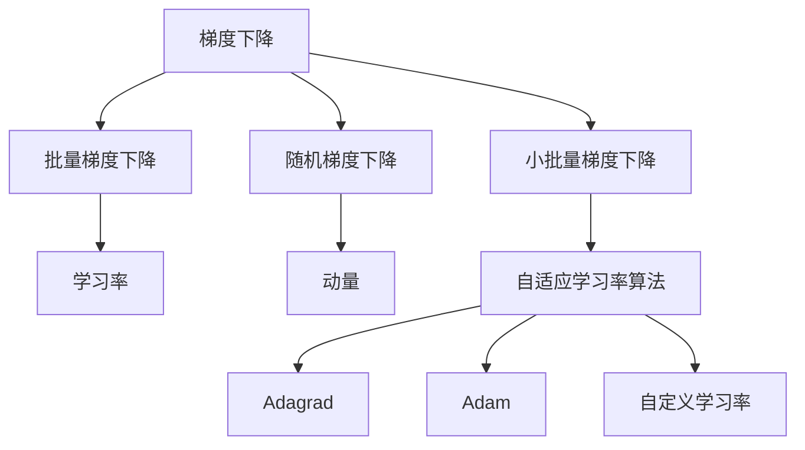

                 

# 学习率Learning Rate原理与代码实例讲解

> 关键词：学习率，梯度下降，梯度累积，动量，Adagrad，Adam，自定义学习率

## 1. 背景介绍

### 1.1 问题由来
在学习深度学习的过程中，我们会接触到各种各样的优化算法，其中最常见的是梯度下降(Gradient Descent)算法。学习率（Learning Rate）是梯度下降算法的一个重要参数，决定了模型参数更新的幅度，影响着模型的训练速度和最终性能。

学习率的选取非常关键，如果过大，可能会导致模型无法收敛，甚至发散；如果过小，模型更新缓慢，训练时间过长。因此，如何选择合适的学习率，以及如何动态调整学习率，成为了深度学习优化的核心问题之一。

### 1.2 问题核心关键点
学习率的选择和调整是一个复杂且具有挑战性的问题，涉及以下几个关键点：
- 学习率的选择方法：包括固定学习率、自适应学习率、动态学习率等。
- 学习率的调整策略：包括手动调整、自适应调整、基于梯度的调整等。
- 学习率对训练效果的影响：不同学习率对模型收敛速度、精度、稳定性等方面的影响。

## 2. 核心概念与联系

### 2.1 核心概念概述

为了更好地理解学习率在深度学习中的作用，我们需要先了解几个核心概念：

- 梯度下降(Gradient Descent)：是一种基于目标函数的最优化算法，通过不断调整模型参数，使得目标函数值最小化。梯度下降算法包括批量梯度下降(Batch Gradient Descent)、随机梯度下降(Stochastic Gradient Descent)、小批量梯度下降(Mini-batch Gradient Descent)等。
- 学习率(Learning Rate)：表示模型参数每次更新的幅度，学习率越大，模型更新越快，但可能导致无法收敛；学习率越小，模型更新越慢，但可以保证收敛。
- 动量(Momentum)：动量项可以加速梯度下降的过程，防止模型陷入局部最优。
- 自适应学习率算法：如Adagrad、Adam等，能够根据梯度的变化自动调整学习率，避免手动调整学习率所带来的困难。

这些核心概念之间有着紧密的联系，共同构成了深度学习模型的优化策略。学习率的选择和调整是优化过程中的关键环节，影响着模型的收敛速度、精度和稳定性。

### 2.2 核心概念原理和架构的 Mermaid 流程图



这个流程图展示了梯度下降算法、批量梯度下降、随机梯度下降、小批量梯度下降、学习率、动量、自适应学习率算法（包括Adagrad、Adam等）以及自定义学习率之间的关系。学习率作为梯度下降算法的一部分，通过不同的优化策略，选择合适的学习率，从而实现更高效的模型训练。

## 3. 核心算法原理 & 具体操作步骤

### 3.1 算法原理概述

学习率的选择和调整是深度学习优化的核心问题之一。以下是几种常用的学习率选择和调整策略的原理概述：

- **固定学习率**：在训练过程中保持学习率不变，适用于问题简单、数据规模小的场景。缺点是当数据规模较大、复杂度高时，容易陷入局部最优。
- **自适应学习率**：根据梯度的变化动态调整学习率，如Adagrad、Adam等。这些算法通过分析梯度的历史信息，自动调整学习率，避免手动调整带来的困难。
- **动态学习率**：在训练过程中动态调整学习率，如学习率衰减、学习率反弹等。这些方法通过调整学习率，避免模型过拟合或欠拟合。

### 3.2 算法步骤详解

下面我们详细讲解固定学习率、自适应学习率、动态学习率的具体操作步骤。

**固定学习率**：
1. 选择合适的初始学习率 $\eta_0$。
2. 在每次训练迭代中，更新模型参数 $\theta$：
   $$
   \theta_{t+1} = \theta_t - \eta_0 \nabla_{\theta}\mathcal{L}(\theta_t)
   $$
   其中 $\nabla_{\theta}\mathcal{L}(\theta_t)$ 为目标函数 $\mathcal{L}(\theta_t)$ 关于 $\theta$ 的梯度。

**自适应学习率**：
1. 选择合适的初始学习率 $\eta_0$。
2. 在每次训练迭代中，更新模型参数 $\theta$：
   $$
   \theta_{t+1} = \theta_t - \eta_t \nabla_{\theta}\mathcal{L}(\theta_t)
   $$
   其中 $\eta_t$ 是自适应学习率算法根据梯度的变化动态调整的学习率，如Adagrad、Adam等。

**动态学习率**：
1. 选择合适的初始学习率 $\eta_0$。
2. 在每次训练迭代中，更新模型参数 $\theta$：
   $$
   \eta_{t+1} = \eta_0 \cdot \gamma_t
   $$
   其中 $\gamma_t$ 是动态调整因子，可以是衰减因子、反弹因子等。

### 3.3 算法优缺点

- **固定学习率**：
  - 优点：简单直接，易于理解和实现。
  - 缺点：对数据规模、复杂度敏感，可能陷入局部最优，无法适应数据分布变化。
  
- **自适应学习率**：
  - 优点：能够根据梯度的变化自动调整学习率，适应数据分布变化，避免手动调整带来的困难。
  - 缺点：计算量较大，可能存在收敛速度慢的问题。
  
- **动态学习率**：
  - 优点：在训练过程中动态调整学习率，可以避免模型过拟合或欠拟合。
  - 缺点：需要手动调整调整因子，可能带来额外复杂性。

### 3.4 算法应用领域

学习率选择和调整的策略广泛应用于各种深度学习模型的训练过程中。例如：
- 图像分类：通过优化CNN模型，实现更高的图像分类精度。
- 自然语言处理：通过优化RNN或Transformer模型，实现更好的语言理解与生成。
- 推荐系统：通过优化神经网络模型，提高推荐精度，实现个性化推荐。
- 时间序列预测：通过优化LSTM或GRU模型，实现更准确的时间序列预测。

## 4. 数学模型和公式 & 详细讲解 & 举例说明

### 4.1 数学模型构建

本节将使用数学语言对学习率的计算方法进行更加严格的刻画。

记目标函数为 $\mathcal{L}(\theta)$，目标函数关于模型参数 $\theta$ 的梯度为 $\nabla_{\theta}\mathcal{L}(\theta)$，学习率为 $\eta$，则梯度下降算法的更新公式为：

$$
\theta_{t+1} = \theta_t - \eta \nabla_{\theta}\mathcal{L}(\theta_t)
$$

其中 $t$ 表示迭代次数。

### 4.2 公式推导过程

**固定学习率**：
$$
\theta_{t+1} = \theta_t - \eta_0 \nabla_{\theta}\mathcal{L}(\theta_t)
$$

**自适应学习率算法**：
1. **Adagrad**：
   $$
   \eta_t = \frac{\eta_0}{\sqrt{G_t} + \epsilon}
   $$
   其中 $G_t = \sum_{i=1}^t (\nabla_{\theta_i}\mathcal{L}(\theta_t))^2$，$\epsilon$ 是一个小量，防止分母为0。

2. **Adam**：
   $$
   m_t = \beta_1 m_{t-1} + (1-\beta_1)\nabla_{\theta}\mathcal{L}(\theta_t)
   $$
   $$
   v_t = \beta_2 v_{t-1} + (1-\beta_2)(\nabla_{\theta}\mathcal{L}(\theta_t))^2
   $$
   $$
   \hat{m}_t = \frac{m_t}{1-\beta_1^t}, \hat{v}_t = \frac{v_t}{1-\beta_2^t}
   $$
   $$
   \eta_t = \frac{\eta_0}{\sqrt{\hat{v}_t} + \epsilon}
   $$

### 4.3 案例分析与讲解

以MNIST数据集为例，展示如何选择合适的学习率和优化算法。

```python
import torch
import torch.nn as nn
import torch.optim as optim
from torchvision import datasets, transforms

# 定义模型
class Net(nn.Module):
    def __init__(self):
        super(Net, self).__init__()
        self.conv1 = nn.Conv2d(1, 6, 3, 1)
        self.pool = nn.MaxPool2d(2, 2)
        self.conv2 = nn.Conv2d(6, 16, 3, 1)
        self.fc1 = nn.Linear(16 * 4 * 4, 120)
        self.fc2 = nn.Linear(120, 84)
        self.fc3 = nn.Linear(84, 10)

    def forward(self, x):
        x = self.pool(F.relu(self.conv1(x)))
        x = self.pool(F.relu(self.conv2(x)))
        x = x.view(-1, 16 * 4 * 4)
        x = F.relu(self.fc1(x))
        x = F.relu(self.fc2(x))
        x = self.fc3(x)
        return x

# 定义数据加载器
train_loader = torch.utils.data.DataLoader(datasets.MNIST(root='data', train=True, download=True, transform=transforms.ToTensor()), batch_size=64, shuffle=True)
test_loader = torch.utils.data.DataLoader(datasets.MNIST(root='data', train=False, download=True, transform=transforms.ToTensor()), batch_size=64, shuffle=False)

# 定义模型、损失函数和优化器
net = Net()
criterion = nn.CrossEntropyLoss()
optimizer = optim.Adam(net.parameters(), lr=0.001)

# 训练模型
for epoch in range(10):
    running_loss = 0.0
    for i, data in enumerate(train_loader, 0):
        inputs, labels = data
        optimizer.zero_grad()
        outputs = net(inputs)
        loss = criterion(outputs, labels)
        loss.backward()
        optimizer.step()
        running_loss += loss.item()
    print(f'Epoch {epoch+1}, loss: {running_loss/len(train_loader):.3f}')
```

在上述代码中，我们使用了Adam优化器，学习率为0.001，训练了10个epoch。Adam优化器可以自动调整学习率，并且在训练过程中保持稳定，是深度学习中常用的优化器之一。

## 5. 项目实践：代码实例和详细解释说明

### 5.1 开发环境搭建

在进行深度学习项目的开发前，需要准备好开发环境。以下是使用Python进行PyTorch开发的环境配置流程：

1. 安装Anaconda：从官网下载并安装Anaconda，用于创建独立的Python环境。

2. 创建并激活虚拟环境：
```bash
conda create -n pytorch-env python=3.8 
conda activate pytorch-env
```

3. 安装PyTorch：根据CUDA版本，从官网获取对应的安装命令。例如：
```bash
conda install pytorch torchvision torchaudio cudatoolkit=11.1 -c pytorch -c conda-forge
```

4. 安装各类工具包：
```bash
pip install numpy pandas scikit-learn matplotlib tqdm jupyter notebook ipython
```

完成上述步骤后，即可在`pytorch-env`环境中开始深度学习项目的开发。

### 5.2 源代码详细实现

下面我们以手写数字识别为例，展示如何使用PyTorch实现固定学习率和自适应学习率（Adam）。

**固定学习率**：
```python
import torch
import torch.nn as nn
import torch.optim as optim

# 定义模型
class Net(nn.Module):
    def __init__(self):
        super(Net, self).__init__()
        self.conv1 = nn.Conv2d(1, 6, 3, 1)
        self.pool = nn.MaxPool2d(2, 2)
        self.conv2 = nn.Conv2d(6, 16, 3, 1)
        self.fc1 = nn.Linear(16 * 4 * 4, 120)
        self.fc2 = nn.Linear(120, 84)
        self.fc3 = nn.Linear(84, 10)

    def forward(self, x):
        x = self.pool(F.relu(self.conv1(x)))
        x = self.pool(F.relu(self.conv2(x)))
        x = x.view(-1, 16 * 4 * 4)
        x = F.relu(self.fc1(x))
        x = F.relu(self.fc2(x))
        x = self.fc3(x)
        return x

# 定义数据加载器
train_loader = torch.utils.data.DataLoader(datasets.MNIST(root='data', train=True, download=True, transform=transforms.ToTensor()), batch_size=64, shuffle=True)
test_loader = torch.utils.data.DataLoader(datasets.MNIST(root='data', train=False, download=True, transform=transforms.ToTensor()), batch_size=64, shuffle=False)

# 定义模型、损失函数和优化器
net = Net()
criterion = nn.CrossEntropyLoss()
optimizer = optim.SGD(net.parameters(), lr=0.1)

# 训练模型
for epoch in range(10):
    running_loss = 0.0
    for i, data in enumerate(train_loader, 0):
        inputs, labels = data
        optimizer.zero_grad()
        outputs = net(inputs)
        loss = criterion(outputs, labels)
        loss.backward()
        optimizer.step()
        running_loss += loss.item()
    print(f'Epoch {epoch+1}, loss: {running_loss/len(train_loader):.3f}')
```

**自适应学习率**：
```python
import torch
import torch.nn as nn
import torch.optim as optim

# 定义模型
class Net(nn.Module):
    def __init__(self):
        super(Net, self).__init__()
        self.conv1 = nn.Conv2d(1, 6, 3, 1)
        self.pool = nn.MaxPool2d(2, 2)
        self.conv2 = nn.Conv2d(6, 16, 3, 1)
        self.fc1 = nn.Linear(16 * 4 * 4, 120)
        self.fc2 = nn.Linear(120, 84)
        self.fc3 = nn.Linear(84, 10)

    def forward(self, x):
        x = self.pool(F.relu(self.conv1(x)))
        x = self.pool(F.relu(self.conv2(x)))
        x = x.view(-1, 16 * 4 * 4)
        x = F.relu(self.fc1(x))
        x = F.relu(self.fc2(x))
        x = self.fc3(x)
        return x

# 定义数据加载器
train_loader = torch.utils.data.DataLoader(datasets.MNIST(root='data', train=True, download=True, transform=transforms.ToTensor()), batch_size=64, shuffle=True)
test_loader = torch.utils.data.DataLoader(datasets.MNIST(root='data', train=False, download=True, transform=transforms.ToTensor()), batch_size=64, shuffle=False)

# 定义模型、损失函数和优化器
net = Net()
criterion = nn.CrossEntropyLoss()
optimizer = optim.Adam(net.parameters(), lr=0.001)

# 训练模型
for epoch in range(10):
    running_loss = 0.0
    for i, data in enumerate(train_loader, 0):
        inputs, labels = data
        optimizer.zero_grad()
        outputs = net(inputs)
        loss = criterion(outputs, labels)
        loss.backward()
        optimizer.step()
        running_loss += loss.item()
    print(f'Epoch {epoch+1}, loss: {running_loss/len(train_loader):.3f}')
```

### 5.3 代码解读与分析

让我们再详细解读一下关键代码的实现细节：

**Net类**：
- `__init__`方法：初始化模型的层结构。
- `forward`方法：定义前向传播过程。

**train_loader和test_loader**：
- 定义数据加载器，使用`datasets.MNIST`加载MNIST数据集，并进行预处理。

**optimizer**：
- 定义优化器，分别使用固定学习率和自适应学习率（Adam）进行训练。

**训练循环**：
- 遍历训练数据集，在每个batch上进行前向传播和反向传播，更新模型参数。

可以看到，PyTorch提供了丰富的优化器，包括固定学习率和自适应学习率（如SGD、Adam等），可以满足不同场景的需求。通过选择合适的优化器和调整学习率，可以有效提升模型的训练效果。

## 6. 实际应用场景

### 6.1 智能推荐系统

在智能推荐系统中，选择合适的学习率至关重要。通过优化推荐模型，可以实现更好的推荐效果，提高用户的满意度和粘性。

在推荐系统的训练过程中，可以使用固定学习率或自适应学习率（如Adam）进行训练。通过不断地调整学习率，可以在保证模型稳定性的前提下，快速收敛到最优解。此外，还可以使用学习率衰减策略，在训练后期降低学习率，避免模型过拟合。

### 6.2 自然语言处理

在自然语言处理中，优化语言模型和文本分类模型时，选择合适的学习率也是关键。例如，在语言模型训练中，可以使用自适应学习率（如Adam）进行优化，从而快速收敛到最优解。在文本分类模型训练中，可以通过固定学习率或自适应学习率（如Adagrad）进行优化，从而提高分类的准确性。

### 6.3 计算机视觉

在计算机视觉中，优化图像分类模型时，选择合适的学习率同样重要。通过优化卷积神经网络（CNN）模型，可以实现更高的图像分类精度。例如，在CNN模型训练中，可以使用自适应学习率（如Adam）进行优化，从而快速收敛到最优解。

## 7. 工具和资源推荐

### 7.1 学习资源推荐

为了帮助开发者系统掌握学习率的选择和调整理论，这里推荐一些优质的学习资源：

1. 《Deep Learning》（Ian Goodfellow、Yoshua Bengio、Aaron Courville）：全面介绍了深度学习的基本概念、算法和应用，包括梯度下降、自适应学习率等内容。
2. CS231n《Convolutional Neural Networks for Visual Recognition》课程：斯坦福大学开设的计算机视觉明星课程，详细介绍了卷积神经网络、优化算法等内容。
3. 《Hands-On Machine Learning with Scikit-Learn、Keras & TensorFlow》书籍：提供了丰富的深度学习实践案例，涵盖优化算法、学习率调整等内容。

### 7.2 开发工具推荐

高效的开发离不开优秀的工具支持。以下是几款用于深度学习项目开发的常用工具：

1. PyTorch：基于Python的开源深度学习框架，灵活动态的计算图，适合快速迭代研究。
2. TensorFlow：由Google主导开发的开源深度学习框架，生产部署方便，适合大规模工程应用。
3. Jupyter Notebook：交互式的编程环境，支持代码块的执行和显示，适合快速验证算法。
4. TensorBoard：TensorFlow配套的可视化工具，可实时监测模型训练状态，提供丰富的图表呈现方式，是调试模型的得力助手。
5. Weights & Biases：模型训练的实验跟踪工具，可以记录和可视化模型训练过程中的各项指标，方便对比和调优。

### 7.3 相关论文推荐

学习率选择和调整的研究源于学界的持续研究。以下是几篇奠基性的相关论文，推荐阅读：

1. RMSprop：由Geoffrey Hinton等人提出，通过自适应地调整学习率，快速收敛到最优解。
2. Adagrad：由Duchi等人提出，根据梯度的历史信息自适应地调整学习率，适用于稀疏数据集。
3. Adam：由Kingma等人提出，结合动量和自适应学习率的优点，成为目前最常用的优化器之一。
4. Learning Rate Schedules：由Larsen等人提出，通过动态调整学习率，避免模型过拟合或欠拟合。

这些论文代表了大语言模型微调技术的发展脉络。通过学习这些前沿成果，可以帮助研究者把握学科前进方向，激发更多的创新灵感。

## 8. 总结：未来发展趋势与挑战

### 8.1 总结

本文对学习率的选择和调整问题进行了全面系统的介绍。首先阐述了学习率在选择和调整过程中的核心关键点，明确了固定学习率、自适应学习率、动态学习率等方法的基本原理和操作步骤。其次，通过数学模型和公式，详细讲解了学习率的计算方法，并结合代码实例进行了展示。

通过本文的系统梳理，可以看到，学习率在选择和调整过程中，对深度学习模型的训练效果和最终性能有着至关重要的影响。选择合适的学习率，并在训练过程中动态调整，可以显著提升模型的收敛速度、精度和稳定性。

### 8.2 未来发展趋势

展望未来，学习率选择和调整技术将呈现以下几个发展趋势：

1. 自适应学习率算法将进一步优化，提高模型训练的效率和精度。
2. 动态学习率调整策略将更加丰富，如自适应衰减、随机反弹等，进一步提高模型的稳定性和鲁棒性。
3. 结合深度强化学习技术，探索更智能的学习率调整方法，如自适应梯度惩罚、逆变学习率等。
4. 引入多任务学习技术，优化多个任务的学习率调整，实现更高效的多任务学习。
5. 结合神经网络结构优化技术，如剪枝、量化等，进一步提高模型效率和训练速度。

以上趋势凸显了学习率选择和调整技术的广阔前景。这些方向的探索发展，必将进一步提升深度学习模型的训练效果，为机器学习和人工智能技术的发展提供新的动力。

### 8.3 面临的挑战

尽管学习率选择和调整技术已经取得了一定的进展，但在迈向更加智能化、普适化应用的过程中，它仍面临着诸多挑战：

1. 学习率的初始选择和动态调整需要大量实验和经验积累，难以直接应用到复杂、高维度的数据分布中。
2. 自适应学习率算法在处理极端情况（如梯度爆炸、梯度消失等）时，可能会出现不稳定或退化的情况。
3. 动态学习率调整策略的参数调节复杂，难以在实际应用中进行有效的调整。
4. 学习率调整算法需要与具体的深度学习模型、数据集和任务进行紧密结合，难以泛化到不同的应用场景中。

正视学习率选择和调整所面临的这些挑战，积极应对并寻求突破，将是大语言模型微调技术走向成熟的必由之路。相信随着学界和产业界的共同努力，这些挑战终将一一被克服，学习率选择和调整技术必将在深度学习优化领域发挥更大的作用。

### 8.4 研究展望

面对学习率选择和调整所面临的挑战，未来的研究需要在以下几个方面寻求新的突破：

1. 探索更智能的自适应学习率算法，如逆变学习率、自适应梯度惩罚等，进一步提高模型训练的效率和精度。
2. 结合深度强化学习技术，探索更智能的学习率调整方法，如自适应衰减、随机反弹等。
3. 结合神经网络结构优化技术，如剪枝、量化等，进一步提高模型效率和训练速度。
4. 引入多任务学习技术，优化多个任务的学习率调整，实现更高效的多任务学习。
5. 结合自监督学习和迁移学习技术，探索更智能的学习率调整方法，如基于自监督学习的学习率选择方法，基于迁移学习的学习率调整策略等。

这些研究方向的探索，必将引领学习率选择和调整技术迈向更高的台阶，为深度学习优化领域提供新的动力。面向未来，学习率选择和调整技术还需要与其他深度学习技术进行更深入的融合，多路径协同发力，共同推动深度学习技术的发展。

## 9. 附录：常见问题与解答

**Q1：固定学习率和自适应学习率的区别是什么？**

A: 固定学习率在每次迭代中保持不变，适用于简单问题，但需要手动调整学习率；自适应学习率根据梯度的变化动态调整学习率，适用于复杂问题，但计算量较大。

**Q2：如何选择合适的学习率？**

A: 选择合适的学习率需要根据具体问题和数据集进行调整。一般建议从0.001开始，逐步减小学习率，直至收敛。可以使用学习率衰减策略，在训练后期降低学习率，避免模型过拟合。

**Q3：学习率对训练效果有什么影响？**

A: 学习率的选择和调整对模型的训练效果有着至关重要的影响。学习率过大可能导致模型无法收敛，学习率过小可能导致模型训练时间过长。选择合适的学习率，并根据训练情况动态调整，可以有效提升模型的训练效果。

**Q4：如何避免学习率爆炸？**

A: 学习率爆炸是深度学习中常见的问题，可以使用梯度裁剪（gradient clipping）等方法进行避免。此外，选择合适的优化器和调整策略，如Adam、Adagrad等，也可以有效地防止学习率爆炸。

**Q5：学习率反弹和衰减策略有哪些？**

A: 学习率反弹指在训练过程中动态调整学习率，使其在初期快速下降，后期缓慢下降；学习率衰减策略包括指数衰减、余弦衰减等，在训练后期逐渐降低学习率，避免模型过拟合。

这些常见问题与解答，可以帮助读者更好地理解学习率选择和调整的基本原理和操作步骤，从而在深度学习项目中更加高效地进行优化。

---

作者：禅与计算机程序设计艺术 / Zen and the Art of Computer Programming

