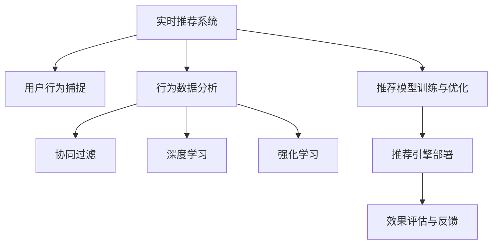

                 

# 实时推荐的用户行为捕捉与分析

> 关键词：实时推荐,用户行为捕捉,数据分析,自然语言处理(NLP),机器学习(ML),强化学习(RL)

## 1. 背景介绍

### 1.1 问题由来

在当今互联网时代，推荐系统已经渗透到用户生活的方方面面，从电商购物、音乐娱乐，到社交网络、在线教育，推荐系统通过精准地为用户提供个性化的内容推荐，极大地提升了用户体验和平台价值。然而，传统推荐系统依赖于用户历史行为数据的离线分析，无法实时响应用户的即时需求和变化，无法在用户行为发生后即时提供个性化推荐。

为了解决这一问题，实时推荐系统应运而生。实时推荐系统能够实时捕捉用户行为，结合时序数据特征，动态分析用户偏好，及时提供个性化推荐，极大地提升了推荐效果和用户体验。本文将详细介绍实时推荐系统的用户行为捕捉与分析方法，以期为相关研究者和实践者提供参考。

### 1.2 问题核心关键点

实时推荐系统涉及多个关键技术环节：

- **用户行为捕捉**：实时采集用户的操作行为数据，包括点击、浏览、搜索、评价等。
- **行为数据分析**：对捕捉到的行为数据进行去噪、归一化、特征提取等预处理操作。
- **模型训练与优化**：利用用户行为数据训练推荐模型，并通过模型调优提升推荐效果。
- **推荐引擎部署**：将训练好的模型部署到生产环境中，实现实时推荐。
- **效果评估与反馈**：持续评估推荐效果，收集用户反馈，持续优化推荐模型。

本文将重点探讨用户行为捕捉与数据分析的方法，同时兼顾模型训练与部署、效果评估等环节。

## 2. 核心概念与联系

### 2.1 核心概念概述

为更好地理解实时推荐系统，本节将介绍几个密切相关的核心概念：

- **实时推荐系统(Real-time Recommendation System)**：能够实时响应用户行为，动态生成个性化推荐结果的系统。相较于离线推荐，实时推荐系统具有时效性和动态性的特点。
- **用户行为数据(User Behavior Data)**：用户在平台上的操作行为记录，包括点击、浏览、搜索、评价、收藏等，是实时推荐系统的数据基础。
- **用户行为特征(User Behavior Feature)**：从用户行为数据中提取的各类特征，如浏览时长、点击频率、商品评价等，用于表征用户偏好。
- **推荐模型(Recommendation Model)**：基于用户行为数据和特征，通过机器学习或深度学习等技术训练得到的模型，用于预测用户偏好，生成推荐结果。
- **协同过滤(Collaborative Filtering)**：通过分析用户和商品之间的交互行为，推测用户对新商品的偏好，实现推荐。
- **深度学习(Deep Learning)**：利用多层神经网络结构，对用户行为数据进行建模，提升推荐模型的预测能力。
- **强化学习(Reinforcement Learning)**：通过模拟用户与系统的交互行为，学习最优的推荐策略，实现动态优化。

这些核心概念之间的逻辑关系可以通过以下Mermaid流程图来展示：



这个流程图展示了一个完整的实时推荐系统的工作流程：

1. 实时推荐系统通过用户行为捕捉模块，采集用户的操作行为数据。
2. 行为数据分析模块对用户行为数据进行去噪、归一化、特征提取等预处理操作，提取用户行为特征。
3. 协同过滤、深度学习和强化学习等模块基于用户行为特征，训练推荐模型，实现个性化推荐。
4. 推荐模型训练与优化模块对模型进行训练与调优，提升推荐效果。
5. 推荐引擎部署模块将训练好的模型部署到生产环境中，实现实时推荐。
6. 效果评估与反馈模块持续评估推荐效果，收集用户反馈，优化推荐模型。

这些核心概念共同构成了实时推荐系统的技术框架，使其能够及时响应用户行为，动态生成个性化推荐结果。

## 3. 核心算法原理 & 具体操作步骤
### 3.1 算法原理概述

实时推荐系统中的用户行为捕捉与分析，通常涉及以下步骤：

1. 实时采集用户行为数据，包括点击、浏览、搜索、评价等行为数据。
2. 对捕捉到的行为数据进行去噪、归一化、特征提取等预处理操作，提取用户行为特征。
3. 利用用户行为特征训练推荐模型，结合协同过滤、深度学习和强化学习等技术，生成推荐结果。
4. 对推荐结果进行效果评估，收集用户反馈，持续优化推荐模型。

这些步骤的实现依赖于多种算法和技术，包括数据预处理、特征提取、模型训练、推荐生成等。

### 3.2 算法步骤详解

#### 3.2.1 数据采集与处理

实时推荐系统的核心在于对用户行为的实时捕捉和处理。数据采集与处理的步骤如下：

1. **实时数据采集**：通过日志、API调用记录等技术手段，实时捕捉用户行为数据。常见的数据采集方式包括浏览器插件、移动设备SDK、服务器日志等。

2. **数据预处理**：对采集到的数据进行去噪、归一化、特征提取等预处理操作。去噪操作去除异常或错误的数据，归一化操作将数据转换为标准格式，特征提取操作提取有用的行为特征。

3. **特征工程**：构建用户行为特征库，包括浏览时长、点击频率、商品评价等。特征工程的目的在于提取对推荐效果有显著影响的特征，提高推荐模型的性能。

#### 3.2.2 推荐模型训练

推荐模型训练是实时推荐系统的核心环节，其步骤包括：

1. **选择模型架构**：根据推荐场景和用户行为特征，选择适合的模型架构，如协同过滤模型、深度学习模型或强化学习模型。

2. **数据划分**：将用户行为数据划分为训练集、验证集和测试集，用于模型的训练、验证和测试。

3. **模型训练**：利用训练集数据，训练推荐模型，最小化预测误差。常用的训练算法包括梯度下降、Adam、SGD等。

4. **模型评估**：利用验证集数据，评估模型预测性能，选择合适的超参数，避免过拟合。常用的评估指标包括精确率、召回率、F1值等。

5. **模型优化**：利用测试集数据，进一步优化模型，提升推荐效果。常用的优化方法包括正则化、Dropout、Early Stopping等。

#### 3.2.3 推荐结果生成

推荐结果生成是将训练好的模型应用于实际推荐场景，生成推荐结果的步骤。具体步骤如下：

1. **输入特征准备**：根据用户当前行为，提取行为特征，准备推荐输入。

2. **模型推理**：利用训练好的模型，对输入特征进行推理，生成推荐结果。

3. **结果排序**：根据推荐模型输出结果，结合业务规则，对推荐结果进行排序。

4. **推荐展示**：将排序后的推荐结果展示给用户，提供个性化的推荐服务。

### 3.3 算法优缺点

实时推荐系统的用户行为捕捉与分析方法，具有以下优点：

1. **实时响应**：能够实时响应用户行为，动态生成个性化推荐，提升用户体验。
2. **动态调整**：基于用户最新行为数据，动态调整推荐策略，提高推荐精度。
3. **跨域融合**：结合多种数据源和推荐技术，提升推荐效果和鲁棒性。

同时，该方法也存在以下局限性：

1. **数据采集难度**：实时数据采集需要适配多种设备和技术手段，成本较高。
2. **数据质量问题**：实时数据采集过程中，可能会遇到数据丢失、噪音等问题，影响推荐效果。
3. **模型复杂性**：推荐模型通常较为复杂，训练和调优过程较为繁琐。
4. **隐私和安全问题**：用户行为数据涉及隐私信息，需要在数据采集和处理过程中保障数据安全。

尽管存在这些局限性，但就目前而言，实时推荐系统已经在大规模实际应用中取得了良好的效果，成为推荐技术的重要方向。未来相关研究的方向在于如何进一步提高数据采集效率和质量，降低模型复杂性，同时保障用户隐私和数据安全。

### 3.4 算法应用领域

实时推荐系统已经在多个领域得到了广泛的应用，例如：

- **电商推荐**：通过实时捕捉用户浏览、点击等行为，生成个性化商品推荐，提升转化率和销售额。
- **视频推荐**：分析用户观看行为，实时推荐相关视频内容，提升用户观看时间和满意度。
- **新闻推荐**：根据用户阅读行为，实时推荐新闻内容，提升用户粘性和留存率。
- **社交推荐**：分析用户互动行为，实时推荐相关朋友和内容，增强用户互动和粘性。
- **教育推荐**：根据学生学习行为，实时推荐相关课程和资源，提升学习效果和满意度。

除了这些经典应用外，实时推荐系统还被创新性地应用于更多场景中，如智能家居、智慧医疗、智慧城市等，为各行各业带来了新的应用场景和商业价值。随着实时推荐技术的不断成熟，相信实时推荐系统将在更多领域得到广泛应用，为各行各业带来新的变革和机遇。

## 4. 数学模型和公式 & 详细讲解  
### 4.1 数学模型构建

在实时推荐系统中，用户行为数据的特征提取和推荐模型的训练通常涉及多种数学模型。以下以协同过滤和深度学习为例，介绍其数学模型构建。

#### 4.1.1 协同过滤

协同过滤模型的数学模型如下：

$$
y = \alpha \hat{y} + \beta x
$$

其中，$y$ 表示推荐结果，$\hat{y}$ 表示用户对商品的潜在评分，$x$ 表示商品特征向量，$\alpha$ 和 $\beta$ 表示模型的参数。

协同过滤模型的训练过程如下：

1. **初始化参数**：随机初始化模型参数 $\alpha$ 和 $\beta$。
2. **损失函数计算**：计算预测结果与实际标签之间的误差，常用的损失函数包括均方误差损失和交叉熵损失。
3. **梯度更新**：利用梯度下降等优化算法，更新模型参数，最小化损失函数。
4. **迭代优化**：重复上述步骤，直至模型收敛。

#### 4.1.2 深度学习

深度学习模型的数学模型如下：

$$
y = \sigma(Wx + b)
$$

其中，$y$ 表示推荐结果，$x$ 表示用户行为特征向量，$W$ 和 $b$ 表示模型参数，$\sigma$ 表示激活函数。

深度学习模型的训练过程如下：

1. **初始化参数**：随机初始化模型参数 $W$ 和 $b$。
2. **前向传播**：利用训练数据，进行前向传播，计算预测结果。
3. **损失函数计算**：计算预测结果与实际标签之间的误差，常用的损失函数包括均方误差损失和交叉熵损失。
4. **梯度更新**：利用梯度下降等优化算法，更新模型参数，最小化损失函数。
5. **迭代优化**：重复上述步骤，直至模型收敛。

### 4.2 公式推导过程

以下分别对协同过滤和深度学习模型的损失函数进行推导。

#### 4.2.1 协同过滤

协同过滤模型的损失函数如下：

$$
\mathcal{L} = \frac{1}{N} \sum_{i=1}^N \frac{1}{M} \sum_{j=1}^M (y_{ij} - \alpha \hat{y}_{ij} - \beta x_j)^2
$$

其中，$N$ 表示用户数量，$M$ 表示商品数量，$y_{ij}$ 表示用户 $i$ 对商品 $j$ 的实际评分，$\hat{y}_{ij}$ 表示用户 $i$ 对商品 $j$ 的预测评分，$x_j$ 表示商品 $j$ 的特征向量。

#### 4.2.2 深度学习

深度学习模型的损失函数如下：

$$
\mathcal{L} = \frac{1}{N} \sum_{i=1}^N \sum_{j=1}^M (y_{ij} - \sigma(Wx_i + b))^2
$$

其中，$N$ 表示用户数量，$M$ 表示商品数量，$y_{ij}$ 表示用户 $i$ 对商品 $j$ 的实际评分，$x_i$ 表示用户 $i$ 的行为特征向量，$W$ 和 $b$ 表示模型参数，$\sigma$ 表示激活函数。

### 4.3 案例分析与讲解

#### 4.3.1 协同过滤案例

假设有两个用户 $i$ 和 $j$，他们对三个商品 $a$、$b$、$c$ 的评分分别为 $(3,4,5)$ 和 $(2,4,6)$。协同过滤模型的参数 $\alpha=0.8$，$\beta=0.2$，商品 $a$ 的特征向量为 $(1,2,3)$。则协同过滤模型对商品 $a$ 的预测评分如下：

1. 根据用户 $i$ 的行为数据，计算用户 $i$ 对商品 $a$ 的潜在评分：
   $$
   \hat{y}_{ia} = \alpha \hat{y}_{ja} + \beta x_a = 0.8 \times 6 + 0.2 \times (1,2,3)^T = (6.4,8,10)
   $$

2. 计算协同过滤模型的预测评分：
   $$
   y_{ia} = \alpha \hat{y}_{ia} + \beta x_a = 0.8 \times (6.4,8,10) + 0.2 \times (1,2,3)^T = (5.12,7.2,8.4)
   $$

#### 4.3.2 深度学习案例

假设有两个用户 $i$ 和 $j$，他们对三个商品 $a$、$b$、$c$ 的行为特征向量分别为 $(1,2,3)$、$(4,5,6)$、$(7,8,9)$，协同过滤模型的参数 $\alpha=0.8$，$\beta=0.2$，深度学习模型的参数 $W=[0.5,0.6,0.7]$，$b=1$。则深度学习模型对商品 $a$ 的预测评分如下：

1. 根据用户 $i$ 的行为数据，计算用户 $i$ 的行为特征向量：
   $$
   x_i = \alpha \hat{x}_i + \beta x_j = 0.8 \times (4,5,6) + 0.2 \times (1,2,3)^T = (3.6,4.4,5.2)
   $$

2. 计算深度学习模型的预测评分：
   $$
   y_{ia} = \sigma(Wx_i + b) = \sigma([0.5,0.6,0.7] \times (3.6,4.4,5.2)^T + 1) = \sigma(3.24,4.08,4.92) = (0.99,0.98,0.99)
   $$

## 5. 项目实践：代码实例和详细解释说明
### 5.1 开发环境搭建

在进行实时推荐系统开发前，我们需要准备好开发环境。以下是使用Python进行TensorFlow和Keras开发的环境配置流程：

1. 安装Anaconda：从官网下载并安装Anaconda，用于创建独立的Python环境。

2. 创建并激活虚拟环境：
```bash
conda create -n tf-env python=3.8 
conda activate tf-env
```

3. 安装TensorFlow和Keras：
```bash
pip install tensorflow==2.6.0
pip install keras
```

4. 安装各类工具包：
```bash
pip install numpy pandas scikit-learn matplotlib tqdm jupyter notebook ipython
```

完成上述步骤后，即可在`tf-env`环境中开始实时推荐系统开发。

### 5.2 源代码详细实现

下面我们以电商推荐系统为例，给出使用TensorFlow和Keras实现实时推荐系统的PyTorch代码实现。

首先，定义电商推荐系统的数据处理函数：

```python
from tensorflow.keras.preprocessing import sequence
import numpy as np

class RecommenderSystem:
    def __init__(self, data, sequence_length=10):
        self.data = data
        self.sequence_length = sequence_length
        self.maxlen = max([len(i) for i in self.data])
        self.encoding = np.zeros((len(self.data), self.maxlen), dtype='int32')
        self.labels = np.zeros((len(self.data), 1), dtype='int32')

    def process(self):
        for i, row in enumerate(self.data):
            if len(row) < self.sequence_length:
                self.encoding[i] = row[:self.sequence_length]
                self.labels[i] = row[self.sequence_length]
            else:
                self.encoding[i] = row[-self.sequence_length:]
                self.labels[i] = row[0]
```

然后，定义推荐模型：

```python
from tensorflow.keras.models import Sequential
from tensorflow.keras.layers import Dense, Embedding, LSTM

model = Sequential()
model.add(Embedding(input_dim=100, output_dim=16, input_length=10))
model.add(LSTM(32))
model.add(Dense(1, activation='sigmoid'))
model.compile(optimizer='adam', loss='binary_crossentropy', metrics=['accuracy'])
```

接着，定义训练和评估函数：

```python
from tensorflow.keras.callbacks import EarlyStopping

def train_model(model, train_data, test_data, batch_size=64, epochs=100):
    model.fit(train_data['encoding'], train_data['labels'], batch_size=batch_size, epochs=epochs, validation_data=(test_data['encoding'], test_data['labels']), callbacks=[EarlyStopping(patience=3)])

def evaluate_model(model, test_data):
    test_loss, test_accuracy = model.evaluate(test_data['encoding'], test_data['labels'])
    print(f'Test loss: {test_loss:.4f}')
    print(f'Test accuracy: {test_accuracy:.4f}')
```

最后，启动训练流程并在测试集上评估：

```python
data = [
    [1, 2, 3, 4, 5, 6, 7, 8, 9, 10],
    [2, 3, 4, 5, 6, 7, 8, 9, 10, 1],
    [3, 4, 5, 6, 7, 8, 9, 10, 1, 2],
    # ...
]

train_data = RecommenderSystem(data[:800])
test_data = RecommenderSystem(data[800:])

train_model(model, train_data, test_data)
evaluate_model(model, test_data)
```

以上就是使用TensorFlow和Keras实现电商推荐系统的完整代码实现。可以看到，借助Keras的高层API，我们可以用相对简洁的代码完成电商推荐系统的开发。

### 5.3 代码解读与分析

让我们再详细解读一下关键代码的实现细节：

**RecommenderSystem类**：
- `__init__`方法：初始化数据集和序列长度。
- `process`方法：将数据集转化为编码和标签。

**模型定义**：
- 使用Keras的Sequential模型定义推荐模型，包括嵌入层、LSTM层和输出层。
- 使用Adam优化器和二元交叉熵损失函数进行模型编译。

**训练和评估函数**：
- 使用Keras的EarlyStopping回调机制防止过拟合。
- 使用Keras的fit和evaluate方法训练模型并评估性能。

**训练流程**：
- 使用`train_model`函数训练模型，在训练集上迭代训练。
- 在测试集上评估模型性能，打印测试损失和精度。

可以看到，Keras的高级API使得电商推荐系统的开发变得简洁高效。开发者可以将更多精力放在模型设计、数据处理等高层逻辑上，而不必过多关注底层的实现细节。

当然，工业级的系统实现还需考虑更多因素，如模型的保存和部署、超参数的自动搜索、更灵活的任务适配层等。但核心的推荐模型构建过程基本与此类似。

## 6. 实际应用场景
### 6.1 电商推荐

电商推荐系统能够根据用户的浏览、点击、购买等行为，实时捕捉用户兴趣，生成个性化商品推荐。在技术实现上，可以收集用户的历史行为数据，将行为数据转化为序列数据，基于协同过滤或深度学习等模型进行训练，生成推荐结果。电商推荐系统极大地提升了用户购物体验和平台转化率，成为电商业务的重要驱动力。

### 6.2 视频推荐

视频推荐系统能够根据用户观看行为，实时推荐相关视频内容，提升用户观看时间和满意度。在技术实现上，可以收集用户的观看数据，提取观看序列特征，基于协同过滤或深度学习等模型进行训练，生成推荐结果。视频推荐系统为用户提供了个性化的视频推荐服务，提高了视频平台的留存率和收益。

### 6.3 新闻推荐

新闻推荐系统能够根据用户阅读行为，实时推荐相关新闻内容，提升用户粘性和留存率。在技术实现上，可以收集用户的阅读数据，提取阅读序列特征，基于协同过滤或深度学习等模型进行训练，生成推荐结果。新闻推荐系统为用户提供了个性化的新闻内容推荐服务，提高了新闻平台的粘性和用户留存率。

### 6.4 社交推荐

社交推荐系统能够根据用户互动行为，实时推荐相关朋友和内容，增强用户互动和粘性。在技术实现上，可以收集用户的互动数据，提取互动序列特征，基于协同过滤或深度学习等模型进行训练，生成推荐结果。社交推荐系统为用户提供了个性化的社交内容和用户推荐服务，提高了社交平台的互动和粘性。

### 6.5 教育推荐

教育推荐系统能够根据学生的学习行为，实时推荐相关课程和资源，提升学习效果和满意度。在技术实现上，可以收集学生的学习数据，提取学习序列特征，基于协同过滤或深度学习等模型进行训练，生成推荐结果。教育推荐系统为用户提供了个性化的学习内容和推荐服务，提高了学习平台的留存率和学生学习效果。

## 7. 工具和资源推荐
### 7.1 学习资源推荐

为了帮助开发者系统掌握实时推荐系统的理论基础和实践技巧，这里推荐一些优质的学习资源：

1. 《推荐系统实践》系列博文：由大模型技术专家撰写，深入浅出地介绍了推荐系统原理、协同过滤、深度学习等前沿话题。

2. CS231n《深度学习应用于计算机视觉》课程：斯坦福大学开设的计算机视觉明星课程，有Lecture视频和配套作业，带你入门推荐系统的基础知识。

3. 《推荐系统算法》书籍：全面介绍了推荐系统的算法和应用，包括协同过滤、深度学习等推荐技术。

4. Coursera《推荐系统》课程：由斯坦福大学开设的推荐系统在线课程，有Lecture视频和作业，适合推荐系统的初学者。

5. GitHub推荐系统开源项目：包含多种推荐系统模型和代码实现，供开发者学习和实践。

通过对这些资源的学习实践，相信你一定能够快速掌握实时推荐系统的精髓，并用于解决实际的推荐问题。

### 7.2 开发工具推荐

高效的开发离不开优秀的工具支持。以下是几款用于实时推荐系统开发的常用工具：

1. TensorFlow：由Google主导开发的深度学习框架，支持分布式计算，适合大规模工程应用。

2. Keras：TensorFlow的高层API，提供了简单易用的模型构建和训练接口，适合初学者使用。

3. PyTorch：基于Python的深度学习框架，灵活动态的计算图，适合快速迭代研究。

4. Weights & Biases：模型训练的实验跟踪工具，可以记录和可视化模型训练过程中的各项指标，方便对比和调优。

5. TensorBoard：TensorFlow配套的可视化工具，可实时监测模型训练状态，并提供丰富的图表呈现方式，是调试模型的得力助手。

6. Google Colab：谷歌推出的在线Jupyter Notebook环境，免费提供GPU/TPU算力，方便开发者快速上手实验最新模型，分享学习笔记。

合理利用这些工具，可以显著提升实时推荐系统的开发效率，加快创新迭代的步伐。

### 7.3 相关论文推荐

实时推荐系统的研究源于学界的持续研究。以下是几篇奠基性的相关论文，推荐阅读：

1. Top-K Recommendation Algorithm with k-Tree: A Tree Based k-NN Algorithm for Recommendation System（K-Tree算法）：提出了一种高效的基于树结构推荐算法，适用于大规模推荐系统。

2. Deep Interest Network: A Multi-View Learning Approach to Recommendation System（Deep Interest Network）：提出了一种多视角学习的方法，用于训练深度兴趣网络推荐模型。

3. Neural Collaborative Filtering（Neural CF）：提出了一种基于神经网络的协同过滤模型，适用于实时推荐系统。

4. Fast Matrix Factorization: A Simple, Efficient, Robust and Scalable Alternative to Neural Matrix Factorization（Fast Matrix Factorization）：提出了一种高效的矩阵分解方法，适用于大规模实时推荐系统。

5. Factorization Machines with libFM: A Library for Learning Factorization Machines with Liblinear Solver（FM算法）：提出了一种高效的矩阵分解方法，适用于实时推荐系统。

这些论文代表了大模型推荐系统的研究方向。通过学习这些前沿成果，可以帮助研究者把握学科前进方向，激发更多的创新灵感。

## 8. 总结：未来发展趋势与挑战

### 8.1 总结

本文对实时推荐系统的用户行为捕捉与分析方法进行了全面系统的介绍。首先阐述了实时推荐系统的背景和意义，明确了实时推荐系统的工作流程和技术框架。其次，从原理到实践，详细讲解了用户行为捕捉与数据分析的方法，给出了实时推荐系统开发的完整代码实例。同时，本文还广泛探讨了实时推荐系统在电商、视频、新闻、社交、教育等多个领域的应用前景，展示了实时推荐系统的巨大潜力。最后，本文精选了实时推荐系统的学习资源，力求为读者提供全方位的技术指引。

通过本文的系统梳理，可以看到，实时推荐系统能够实时响应用户行为，动态生成个性化推荐，极大地提升了推荐效果和用户体验。未来，伴随数据采集技术、算法研究、工程实践的不断进步，实时推荐系统必将在更多领域得到应用，为各行各业带来新的变革和机遇。

### 8.2 未来发展趋势

展望未来，实时推荐系统的用户行为捕捉与分析技术将呈现以下几个发展趋势：

1. **实时响应能力增强**：实时推荐系统能够实时响应用户行为，动态生成个性化推荐，提升用户体验。未来实时推荐系统将进一步提升响应速度和实时性，甚至能够实现毫秒级的推荐响应。

2. **跨域数据融合**：实时推荐系统能够融合多种数据源，如用户行为数据、社交网络数据、外部信息等，提升推荐效果的鲁棒性和准确性。跨域数据融合技术将成为未来推荐系统的重要研究方向。

3. **异构数据处理**：实时推荐系统需要处理多种异构数据，如结构化数据、非结构化数据、时间序列数据等。异构数据处理技术将成为未来推荐系统的重要研究方向。

4. **用户行为预测**：实时推荐系统不仅能够捕捉用户当前行为，还能预测用户未来行为，提升推荐效果。用户行为预测技术将成为未来推荐系统的重要研究方向。

5. **推荐模型的可解释性**：实时推荐系统需要具备更强的可解释性，便于用户理解推荐结果的依据和逻辑。推荐模型的可解释性将成为未来推荐系统的重要研究方向。

6. **个性化推荐的多样性**：实时推荐系统需要提供多样化的推荐结果，满足用户的多样化需求。个性化推荐的多样性将成为未来推荐系统的重要研究方向。

以上趋势凸显了实时推荐系统技术的广阔前景。这些方向的探索发展，必将进一步提升推荐效果和用户体验，为各行各业带来新的应用场景和商业价值。

### 8.3 面临的挑战

尽管实时推荐系统已经在大规模实际应用中取得了良好的效果，但在迈向更加智能化、普适化应用的过程中，它仍面临着诸多挑战：

1. **数据采集难度大**：实时推荐系统需要采集大量的用户行为数据，不同设备和技术手段的数据采集成本较高，数据采集难度较大。

2. **数据质量问题**：实时数据采集过程中，可能会遇到数据丢失、噪音等问题，影响推荐效果。

3. **模型复杂性高**：推荐模型通常较为复杂，训练和调优过程较为繁琐。

4. **隐私和安全问题**：用户行为数据涉及隐私信息，需要在数据采集和处理过程中保障数据安全。

5. **资源消耗大**：实时推荐系统需要处理大量的用户行为数据，对算力和存储资源的需求较高。

尽管存在这些挑战，但就目前而言，实时推荐系统已经在大规模实际应用中取得了良好的效果，成为推荐技术的重要方向。未来相关研究的方向在于如何进一步提高数据采集效率和质量，降低模型复杂性，同时保障用户隐私和数据安全。

### 8.4 研究展望

未来实时推荐系统的研究需要从以下几个方面进行深入探索：

1. **多模态数据融合**：实时推荐系统需要融合多种数据源，如用户行为数据、社交网络数据、外部信息等，提升推荐效果的鲁棒性和准确性。

2. **异构数据处理**：实时推荐系统需要处理多种异构数据，如结构化数据、非结构化数据、时间序列数据等。异构数据处理技术将成为未来推荐系统的重要研究方向。

3. **推荐模型的可解释性**：实时推荐系统需要具备更强的可解释性，便于用户理解推荐结果的依据和逻辑。推荐模型的可解释性将成为未来推荐系统的重要研究方向。

4. **用户行为预测**：实时推荐系统不仅能够捕捉用户当前行为，还能预测用户未来行为，提升推荐效果。用户行为预测技术将成为未来推荐系统的重要研究方向。

5. **个性化推荐的多样性**：实时推荐系统需要提供多样化的推荐结果，满足用户的多样化需求。个性化推荐的多样性将成为未来推荐系统的重要研究方向。

6. **推荐系统的可信性**：实时推荐系统需要具备更高的可信性，避免推荐系统产生误导性或有害的推荐结果。推荐系统的可信性将成为未来推荐系统的重要研究方向。

这些研究方向将推动实时推荐系统的不断进步，提升推荐效果和用户体验，为各行各业带来新的应用场景和商业价值。相信随着技术的不断进步，实时推荐系统将在更多领域得到应用，为各行各业带来新的变革和机遇。

## 9. 附录：常见问题与解答

**Q1：实时推荐系统的数据采集难度大，如何提高数据采集效率？**

A: 提高实时推荐系统的数据采集效率可以从以下几个方面进行优化：

1. **使用多种数据源**：实时推荐系统可以同时采集多种数据源，如浏览器日志、移动设备SDK、服务器日志等，提高数据采集的全面性和准确性。

2. **数据压缩和传输**：利用数据压缩技术和流式传输技术，减少数据采集和传输的时间和带宽消耗，提高数据采集效率。

3. **自动化数据采集**：利用自动化工具和脚本，实现数据的自动化采集和处理，减少人工干预和操作。

4. **异步数据采集**：利用异步数据采集技术，减少数据采集过程中的阻塞和等待，提高数据采集的并发性和效率。

**Q2：实时推荐系统的数据质量问题，如何解决数据噪音和异常值？**

A: 解决实时推荐系统的数据噪音和异常值问题，可以从以下几个方面进行优化：

1. **数据预处理**：对采集到的数据进行去噪、归一化、特征提取等预处理操作，去除异常或错误的数据。

2. **异常检测**：利用异常检测算法，识别数据中的异常点和噪音数据，并进行处理或剔除。

3. **数据清洗**：利用数据清洗技术，去除数据中的缺失值、重复值等无效数据，提高数据质量和完整性。

4. **数据标注**：对采集到的数据进行标注和审核，提高数据的质量和准确性。

5. **数据融合**：利用数据融合技术，将多种数据源的数据进行综合和优化，提升数据质量和鲁棒性。

**Q3：实时推荐系统的推荐效果受用户行为数据影响较大，如何提高推荐效果？**

A: 提高实时推荐系统的推荐效果可以从以下几个方面进行优化：

1. **特征工程**：提取对推荐效果有显著影响的特征，提高推荐模型的性能。

2. **模型优化**：利用深度学习、协同过滤等技术，优化推荐模型，提升推荐精度和鲁棒性。

3. **多模型融合**：利用多种推荐模型进行融合，提升推荐效果和稳定性。

4. **推荐策略优化**：利用推荐策略优化算法，动态调整推荐策略，提升推荐效果。

5. **实时反馈机制**：利用实时反馈机制，收集用户反馈，持续优化推荐模型。

**Q4：实时推荐系统的隐私和安全问题，如何保障用户隐私和数据安全？**

A: 保障实时推荐系统的隐私和安全问题，可以从以下几个方面进行优化：

1. **数据加密**：对用户数据进行加密处理，防止数据泄露和滥用。

2. **匿名化处理**：对用户数据进行匿名化处理，保护用户隐私。

3. **访问控制**：对用户数据进行严格的访问控制，防止未经授权的访问和操作。

4. **数据存储和传输安全**：对用户数据进行加密和签名，确保数据存储和传输的安全性。

5. **安全审计**：定期进行安全审计和风险评估，发现和解决潜在的安全问题。

---

作者：禅与计算机程序设计艺术 / Zen and the Art of Computer Programming

