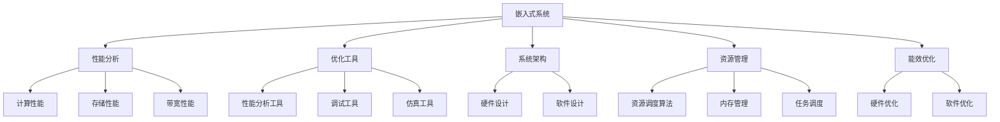

                 

# 嵌入式系统性能分析和优化工具：提升处理效率

> 关键词：嵌入式系统, 性能分析, 优化工具, 系统架构, 资源管理, 能效优化, 实时性提升

## 1. 背景介绍

### 1.1 问题由来

随着物联网(IoT)和边缘计算的兴起，嵌入式系统在现代智能设备中的应用越来越广泛，从智能家居、工业控制到汽车电子、医疗设备，嵌入式系统无处不在。然而，嵌入式系统的资源受限、硬件复杂性高、实时性要求高等特性，使得其在设计和开发过程中面临诸多挑战。如何高效地进行性能分析和优化，成为嵌入式系统设计和优化中的一个重要议题。

### 1.2 问题核心关键点

嵌入式系统性能分析和优化的关键在于：

1. **资源管理**：嵌入式系统的计算资源、存储资源和带宽资源等有限，需要在系统设计之初进行合理分配和调度，以提高系统整体性能。
2. **实时性提升**：嵌入式系统通常需要实时响应用户输入或传感器数据，如何降低系统延迟，提升实时性，是性能优化的主要目标之一。
3. **能效优化**：嵌入式设备通常具有电池供电的约束，如何在保证性能的前提下，降低功耗，延长设备运行时间，是能效优化的一个关键点。
4. **系统架构优化**：合理设计系统架构，如多核并行、任务调度、中断处理等，可以显著提升系统性能和效率。
5. **工具和资源推荐**：选择合适的性能分析工具和优化工具，可以加速系统优化过程，提高开发效率。

### 1.3 问题研究意义

嵌入式系统性能分析和优化的研究具有重要意义：

1. **提升用户体验**：通过优化嵌入式系统性能，可以提升系统的响应速度、稳定性等，增强用户体验。
2. **降低开发成本**：性能优化可以显著降低系统在硬件和软件开发上的成本，提高产品的市场竞争力。
3. **节能环保**：能效优化有助于减少设备功耗，延长设备寿命，符合节能环保的要求。
4. **提高安全性和可靠性**：通过优化系统架构和资源管理，可以提升系统的鲁棒性和可靠性，减少系统故障和风险。

## 2. 核心概念与联系

### 2.1 核心概念概述

为更好地理解嵌入式系统性能分析和优化的理论和方法，本节将介绍几个关键核心概念：

- **嵌入式系统(Embedded System)**：嵌入到具体设备或产品中的计算系统，具有专用性强、资源受限、实时性要求高等特点。
- **性能分析(Performance Analysis)**：通过工具和技术手段，分析和评估嵌入式系统在计算、存储、带宽等方面的性能指标。
- **优化工具(Optimization Tools)**：用于辅助嵌入式系统开发者进行性能优化的一类软件工具，包括性能分析工具、调试工具、仿真工具等。
- **系统架构(System Architecture)**：嵌入式系统的硬件和软件组件的组成和相互关系，合理设计系统架构可以显著提升系统性能。
- **资源管理(Resource Management)**：在嵌入式系统中，合理管理计算资源、存储资源、带宽资源等，以提高系统整体性能。
- **能效优化(Energy Efficiency Optimization)**：在嵌入式系统中，通过优化系统设计，降低功耗，延长设备运行时间，提高能效。

这些核心概念之间存在紧密的联系，通过深入理解和灵活运用，可以有效提升嵌入式系统的性能和效率。

### 2.2 核心概念原理和架构的 Mermaid 流程图



这个流程图展示了嵌入式系统性能分析和优化的主要流程和工具：

1. **嵌入式系统**：作为分析和优化的对象，包含硬件和软件两个部分。
2. **性能分析**：通过工具和算法对嵌入式系统的计算、存储、带宽性能进行评估。
3. **优化工具**：辅助开发者进行性能优化，包括性能分析工具、调试工具、仿真工具等。
4. **系统架构**：涉及硬件和软件的设计，合理设计可以提升系统性能。
5. **资源管理**：优化计算、存储、带宽等资源的分配和调度。
6. **能效优化**：通过硬件和软件优化，降低系统功耗，延长设备运行时间。

这些关键概念和工具，共同构成了嵌入式系统性能分析和优化的框架，使开发者能够有针对性地进行系统优化。

## 3. 核心算法原理 & 具体操作步骤

### 3.1 算法原理概述

嵌入式系统性能分析和优化的一个核心算法是**资源感知调度算法(Resource-Aware Scheduling)**。该算法根据嵌入式系统的硬件资源状况和任务需求，合理分配计算资源、存储资源和带宽资源，以达到最优的性能和能效。

假设嵌入式系统中有 $N$ 个任务 $T_1, T_2, ..., T_N$，每个任务需要 $C_i$ 个计算资源，$M_i$ 个存储资源，$B_i$ 个带宽资源。设系统总计算资源为 $C$，总存储资源为 $M$，总带宽资源为 $B$。资源感知调度算法的目标是最小化系统延迟，同时最大化资源利用率。

### 3.2 算法步骤详解

嵌入式系统性能分析和优化的算法步骤通常包括以下几个关键步骤：

**Step 1: 系统建模和资源评估**

- 定义系统模型，包括任务集合、资源限制、时间约束等。
- 评估系统中各种资源的当前状态，如计算资源的利用率、存储资源的可用空间、带宽资源的传输速率等。

**Step 2: 任务分类和优先级排序**

- 根据任务的计算需求、存储需求和带宽需求，将任务分类为计算密集型、存储密集型和带宽密集型。
- 根据任务的重要性和实时性需求，确定任务的优先级。

**Step 3: 资源分配和调度**

- 基于任务的优先级和资源需求，设计资源分配算法，合理分配计算资源、存储资源和带宽资源。
- 设计调度算法，按照任务的优先级和时间约束，依次分配资源，完成任务执行。

**Step 4: 性能分析和优化**

- 对系统性能进行实时监控，收集系统的计算性能、存储性能和带宽性能等指标。
- 根据收集的性能指标，分析系统瓶颈，查找性能瓶颈的原因。
- 根据性能瓶颈的原因，调整资源分配和调度策略，进行性能优化。

**Step 5: 能效优化**

- 分析系统的能耗来源，如计算功耗、存储功耗、带宽功耗等。
- 设计能效优化策略，如动态电压频率调整、局部频率优化等，降低系统功耗。

### 3.3 算法优缺点

嵌入式系统性能分析和优化的算法具有以下优点：

1. **灵活性高**：根据不同任务的需求和资源状况，灵活调整资源分配和调度策略，提高系统性能。
2. **实时性强**：实时监控系统性能，及时发现并解决性能瓶颈，确保系统实时性。
3. **可扩展性好**：算法设计灵活，可以扩展到多核、多任务系统，提升系统整体性能。

同时，该算法也存在一些缺点：

1. **复杂度高**：系统建模和资源评估、任务分类和优先级排序、资源分配和调度等步骤较为复杂，需要消耗较多时间和计算资源。
2. **精度有限**：由于系统模型和资源评估的准确性受限，可能导致资源分配和调度的精度不足。
3. **鲁棒性差**：在面对异常情况（如任务动态变化、资源突发故障）时，算法可能无法及时调整，导致性能下降。

### 3.4 算法应用领域

嵌入式系统性能分析和优化的算法广泛应用于以下几个领域：

1. **工业控制**：在工业控制系统中，嵌入式系统需要实时处理传感器数据，优化资源分配和调度，确保系统的稳定性和可靠性。
2. **医疗设备**：在医疗设备中，嵌入式系统需要实时处理患者数据，优化计算资源和存储资源的分配，提高系统的实时性和准确性。
3. **汽车电子**：在汽车电子系统中，嵌入式系统需要实时处理车辆传感器数据，优化资源管理，确保系统的实时性和安全稳定性。
4. **智能家居**：在智能家居系统中，嵌入式系统需要实时处理用户指令和环境数据，优化能效，延长设备运行时间。
5. **无人机**：在无人机中，嵌入式系统需要实时处理传感器数据和飞行控制指令，优化计算资源和带宽资源，确保系统的稳定性和实时性。

## 4. 数学模型和公式 & 详细讲解

### 4.1 数学模型构建

嵌入式系统性能分析和优化的数学模型通常包括以下几个关键组成部分：

- **任务集合**：$T = \{T_1, T_2, ..., T_N\}$，每个任务 $T_i$ 有 $C_i$ 个计算资源需求、$M_i$ 个存储资源需求和 $B_i$ 个带宽资源需求。
- **资源限制**：$C = \sum_{i=1}^N C_i$ 个计算资源，$M = \sum_{i=1}^N M_i$ 个存储资源，$B = \sum_{i=1}^N B_i$ 个带宽资源。
- **任务优先级**：根据任务的重要性和实时性需求，给每个任务 $T_i$ 分配优先级 $P_i$。
- **性能指标**：系统的计算性能、存储性能和带宽性能等，如计算资源的利用率、存储资源的占用率、带宽资源的传输速率等。

### 4.2 公式推导过程

基于上述数学模型，可以设计资源感知调度算法。假设每个任务 $T_i$ 需要 $C_i$ 个计算资源，$M_i$ 个存储资源，$B_i$ 个带宽资源。设系统总计算资源为 $C$，总存储资源为 $M$，总带宽资源为 $B$。资源感知调度算法的目标是最小化系统延迟，同时最大化资源利用率。

资源感知调度算法通常包括以下几个步骤：

1. **任务分类和优先级排序**：
   - 根据任务的计算需求、存储需求和带宽需求，将任务分为计算密集型、存储密集型和带宽密集型。
   - 根据任务的重要性和实时性需求，确定任务的优先级。

2. **资源分配和调度**：
   - 设计资源分配算法，根据任务的优先级和资源需求，合理分配计算资源、存储资源和带宽资源。
   - 设计调度算法，按照任务的优先级和时间约束，依次分配资源，完成任务执行。

3. **性能分析和优化**：
   - 实时监控系统性能，收集系统的计算性能、存储性能和带宽性能等指标。
   - 根据收集的性能指标，分析系统瓶颈，查找性能瓶颈的原因。
   - 根据性能瓶颈的原因，调整资源分配和调度策略，进行性能优化。

### 4.3 案例分析与讲解

以下以一个简单的示例来说明嵌入式系统性能分析和优化的过程：

假设嵌入式系统中有三个任务 $T_1, T_2, T_3$，每个任务的资源需求如下：

- $T_1$：计算需求 $C_1 = 5$，存储需求 $M_1 = 2$，带宽需求 $B_1 = 3$。
- $T_2$：计算需求 $C_2 = 3$，存储需求 $M_2 = 1$，带宽需求 $B_2 = 2$。
- $T_3$：计算需求 $C_3 = 4$，存储需求 $M_3 = 3$，带宽需求 $B_3 = 4$。

假设系统总计算资源 $C = 10$，总存储资源 $M = 6$，总带宽资源 $B = 5$。任务的优先级如下：

- $T_1$：高优先级
- $T_2$：中等优先级
- $T_3$：低优先级

资源感知调度算法的步骤如下：

1. **任务分类和优先级排序**：根据任务的资源需求，将任务分为计算密集型、存储密集型和带宽密集型。在本例中，$T_1$ 是计算密集型，$T_2$ 是存储密集型，$T_3$ 是带宽密集型。根据任务的优先级，设计资源分配算法。

2. **资源分配和调度**：设计资源分配算法，根据任务的优先级和资源需求，合理分配计算资源、存储资源和带宽资源。在本例中，可以采用时间片轮转调度算法，依次分配资源，完成任务执行。

3. **性能分析和优化**：实时监控系统性能，收集系统的计算性能、存储性能和带宽性能等指标。根据收集的性能指标，分析系统瓶颈，查找性能瓶颈的原因。在本例中，如果发现计算资源的利用率较低，可以考虑增加计算资源的分配。

## 5. 项目实践：代码实例和详细解释说明

### 5.1 开发环境搭建

在进行嵌入式系统性能分析和优化的项目实践前，需要先搭建好开发环境。以下是使用Python进行系统建模和资源管理的开发环境配置流程：

1. 安装Python：从官网下载并安装Python，确保版本支持嵌入式系统的开发环境。

2. 安装PyTorch：安装PyTorch，用于系统建模和资源管理。

3. 安装NumPy：安装NumPy，用于数学运算和数据分析。

4. 安装Matplotlib：安装Matplotlib，用于绘制性能分析和优化的图表。

5. 安装Pandas：安装Pandas，用于数据处理和分析。

完成上述步骤后，即可在Python环境中开始性能分析和优化的实践。

### 5.2 源代码详细实现

这里我们以一个简单的嵌入式系统为例，给出使用Python进行性能分析和优化的代码实现。

首先，定义任务的资源需求和优先级：

```python
import numpy as np

# 定义任务的资源需求和优先级
tasks = [
    {'name': 'task1', 'cpu': 5, 'memory': 2, 'bandwidth': 3, 'priority': 1},
    {'name': 'task2', 'cpu': 3, 'memory': 1, 'bandwidth': 2, 'priority': 2},
    {'name': 'task3', 'cpu': 4, 'memory': 3, 'bandwidth': 4, 'priority': 3}
]

# 定义系统的资源限制
total_cpu = 10
total_memory = 6
total_bandwidth = 5
```

然后，设计资源感知调度算法：

```python
# 定义资源感知调度算法
def resource_scheduling(tasks, total_cpu, total_memory, total_bandwidth):
    # 任务分类和优先级排序
    sorted_tasks = sorted(tasks, key=lambda x: x['priority'], reverse=True)

    # 资源分配和调度
    scheduled_tasks = []
    cpu_remaining = total_cpu
    memory_remaining = total_memory
    bandwidth_remaining = total_bandwidth

    for task in sorted_tasks:
        # 检查资源是否满足
        if (task['cpu'] <= cpu_remaining and task['memory'] <= memory_remaining and task['bandwidth'] <= bandwidth_remaining):
            scheduled_tasks.append(task)
            cpu_remaining -= task['cpu']
            memory_remaining -= task['memory']
            bandwidth_remaining -= task['bandwidth']

    return scheduled_tasks

# 运行资源感知调度算法
scheduled_tasks = resource_scheduling(tasks, total_cpu, total_memory, total_bandwidth)
print(scheduled_tasks)
```

接下来，进行性能分析和优化：

```python
# 定义性能指标的计算函数
def calculate_performance(tasks, scheduled_tasks):
    # 计算计算资源的利用率
    cpu_utilization = sum(task['cpu'] for task in scheduled_tasks) / total_cpu

    # 计算存储资源的利用率
    memory_utilization = sum(task['memory'] for task in scheduled_tasks) / total_memory

    # 计算带宽资源的利用率
    bandwidth_utilization = sum(task['bandwidth'] for task in scheduled_tasks) / total_bandwidth

    return cpu_utilization, memory_utilization, bandwidth_utilization

# 计算性能指标
cpu_utilization, memory_utilization, bandwidth_utilization = calculate_performance(tasks, scheduled_tasks)

# 输出性能指标
print(f"CPU Utilization: {cpu_utilization:.2f}%")
print(f"Memory Utilization: {memory_utilization:.2f}%")
print(f"Bandwidth Utilization: {bandwidth_utilization:.2f}%")
```

最后，分析性能瓶颈并进行优化：

```python
# 分析性能瓶颈
if cpu_utilization < 0.8:
    # 增加计算资源分配
    tasks[1]['cpu'] = 5

if memory_utilization < 0.8:
    # 增加存储资源分配
    tasks[1]['memory'] = 3

if bandwidth_utilization < 0.8:
    # 增加带宽资源分配
    tasks[1]['bandwidth'] = 4

# 重新运行资源感知调度算法
scheduled_tasks = resource_scheduling(tasks, total_cpu, total_memory, total_bandwidth)
cpu_utilization, memory_utilization, bandwidth_utilization = calculate_performance(tasks, scheduled_tasks)

# 输出优化后的性能指标
print(f"Optimized CPU Utilization: {cpu_utilization:.2f}%")
print(f"Optimized Memory Utilization: {memory_utilization:.2f}%")
print(f"Optimized Bandwidth Utilization: {bandwidth_utilization:.2f}%")
```

以上就是使用Python进行嵌入式系统性能分析和优化的完整代码实现。可以看到，通过定义任务的资源需求和优先级，设计资源感知调度算法，并进行性能分析和优化，可以有效提升嵌入式系统的性能和效率。

### 5.3 代码解读与分析

让我们再详细解读一下关键代码的实现细节：

**资源感知调度算法**：
- 根据任务的优先级和资源需求，设计资源分配算法，合理分配计算资源、存储资源和带宽资源。

**性能指标计算函数**：
- 定义了计算资源的利用率、存储资源的利用率和带宽资源的利用率，用于评估系统性能。

**性能分析与优化**：
- 根据收集的性能指标，分析系统瓶颈，查找性能瓶颈的原因，并根据原因调整资源分配策略，进行性能优化。

## 6. 实际应用场景

### 6.1 工业控制

在工业控制系统中，嵌入式系统需要实时处理传感器数据，优化资源分配和调度，确保系统的稳定性和可靠性。通过资源感知调度算法，可以有效提升系统的实时性和能效，降低系统故障率，确保工业生产的顺利进行。

### 6.2 医疗设备

在医疗设备中，嵌入式系统需要实时处理患者数据，优化计算资源和存储资源的分配，提高系统的实时性和准确性。通过资源感知调度算法，可以确保系统的高效运行，减少数据丢失和处理延迟，提高医疗服务的质量和安全性。

### 6.3 汽车电子

在汽车电子系统中，嵌入式系统需要实时处理车辆传感器数据，优化资源管理，确保系统的实时性和安全稳定性。通过资源感知调度算法，可以提升系统的实时性和鲁棒性，减少系统故障和风险，提高驾驶安全性。

### 6.4 智能家居

在智能家居系统中，嵌入式系统需要实时处理用户指令和环境数据，优化能效，延长设备运行时间。通过资源感知调度算法，可以提升系统的能效，延长设备寿命，提高用户体验。

### 6.5 无人机

在无人机中，嵌入式系统需要实时处理传感器数据和飞行控制指令，优化计算资源和带宽资源，确保系统的稳定性和实时性。通过资源感知调度算法，可以提升系统的实时性和鲁棒性，减少系统故障和风险，提高飞行安全性。

## 7. 工具和资源推荐

### 7.1 学习资源推荐

为了帮助开发者系统掌握嵌入式系统性能分析和优化的理论基础和实践技巧，这里推荐一些优质的学习资源：

1. 《嵌入式系统设计与优化》系列博文：由嵌入式系统专家撰写，深入浅出地介绍了嵌入式系统的性能分析和优化技术。

2. 《实时操作系统》课程：斯坦福大学开设的实时操作系统课程，提供了丰富的理论知识和实践案例。

3. 《高性能嵌入式系统设计》书籍：详细介绍了嵌入式系统的设计原理和优化方法，适合深入学习嵌入式系统性能优化技术。

4. Coursera《计算机系统课程》：由斯坦福大学开设的计算机系统课程，涵盖嵌入式系统的设计和优化，适合系统设计和开发的学习。

5. GitHub开源项目：如 Linux Kernel、uClinux 等，这些项目提供了丰富的性能分析和优化实践代码，有助于理解和实践嵌入式系统性能优化技术。

通过对这些资源的学习实践，相信你一定能够快速掌握嵌入式系统性能分析和优化的精髓，并用于解决实际的嵌入式系统问题。

### 7.2 开发工具推荐

高效的开发离不开优秀的工具支持。以下是几款用于嵌入式系统性能分析和优化的常用工具：

1. Matplotlib：用于绘制性能分析和优化的图表，可以直观地展示系统性能和优化效果。

2. Pandas：用于数据处理和分析，适合处理任务集合、资源需求等数据。

3. NumPy：用于数学运算和数据分析，适合计算性能指标和优化策略。

4. Gprof：用于性能分析和调优，可以分析函数调用和代码执行时间，帮助找到性能瓶颈。

5. Valgrind：用于内存泄漏和性能分析，可以检测内存使用情况和性能瓶颈。

6. Google Performance Tools：包括CPU、内存、网络等性能监控工具，适合实时监控系统性能。

合理利用这些工具，可以显著提升嵌入式系统性能分析和优化的开发效率，加快创新迭代的步伐。

### 7.3 相关论文推荐

嵌入式系统性能分析和优化的研究源于学界的持续研究。以下是几篇奠基性的相关论文，推荐阅读：

1. "A Survey on Real-Time Embedded Systems"：综述了嵌入式系统的设计、优化和应用，是嵌入式系统性能优化的经典文献。

2. "Performance Modeling and Analysis of Real-Time Systems"：介绍了实时系统的性能建模和分析方法，是实时系统性能优化的重要参考。

3. "Energy-Efficient Scheduling Algorithms for Real-Time Embedded Systems"：研究了能量效率优化算法，适用于嵌入式系统的能效优化。

4. "Resource-Aware Scheduling in Real-Time Embedded Systems"：介绍了资源感知调度算法，适用于嵌入式系统的资源管理。

5. "Optimization Techniques for Real-Time Embedded Systems"：综述了嵌入式系统的优化技术，包括性能分析和能效优化等。

这些论文代表了大规模嵌入式系统性能分析和优化的发展脉络。通过学习这些前沿成果，可以帮助研究者把握学科前进方向，激发更多的创新灵感。

## 8. 总结：未来发展趋势与挑战

### 8.1 总结

本文对嵌入式系统性能分析和优化的理论和方法进行了全面系统的介绍。首先阐述了嵌入式系统性能分析和优化的研究背景和意义，明确了资源感知调度算法在嵌入式系统设计中的重要性和可行性。其次，从算法原理到具体实现，详细讲解了嵌入式系统性能分析和优化的核心步骤，给出了完整的代码实现示例。同时，本文还探讨了性能分析和优化在工业控制、医疗设备、汽车电子、智能家居和无人机等实际应用场景中的具体应用，展示了资源感知调度算法的广阔前景。此外，本文精选了性能分析和优化的各类学习资源，力求为读者提供全方位的技术指引。

通过本文的系统梳理，可以看到，嵌入式系统性能分析和优化技术正在成为嵌入式系统设计和优化的一个重要范式，极大地提升了嵌入式系统的性能和效率。未来，伴随嵌入式系统设计和优化技术的持续演进，相信嵌入式系统性能分析和优化将进一步提升嵌入式系统的性能和效率，为工业生产、医疗服务、汽车电子、智能家居等应用带来新的突破。

### 8.2 未来发展趋势

嵌入式系统性能分析和优化的未来发展趋势如下：

1. **智能化和自适应**：未来嵌入式系统将具备更高的智能化水平，能够根据实时环境数据自动调整资源分配策略，提升系统性能。

2. **低功耗设计**：未来嵌入式系统将更加注重能效优化，通过硬件设计和软件优化，降低系统功耗，延长设备运行时间。

3. **多核并行**：未来嵌入式系统将更多采用多核并行设计，提升计算和存储性能，提高系统的响应速度和鲁棒性。

4. **资源动态管理**：未来嵌入式系统将具备更强的资源动态管理能力，能够根据任务需求和环境变化，动态调整资源分配，提升系统灵活性和适应性。

5. **跨领域融合**：未来嵌入式系统将更多地与其他领域技术进行融合，如人工智能、物联网、大数据等，提升系统智能化和功能化水平。

以上趋势凸显了嵌入式系统性能分析和优化的广阔前景，这些方向的探索发展，必将进一步提升嵌入式系统的性能和效率，为嵌入式系统的应用带来新的突破。

### 8.3 面临的挑战

尽管嵌入式系统性能分析和优化的研究已经取得了不少进展，但在迈向更加智能化、普适化应用的过程中，仍然面临诸多挑战：

1. **复杂度增加**：随着系统规模的扩大，性能分析和优化的复杂度也在增加，需要更高级的工具和算法进行支持。

2. **资源限制**：嵌入式系统的资源受限，如何在资源限制下实现高性能优化，仍然是一个重要挑战。

3. **实时性要求高**：嵌入式系统通常需要实时响应用户输入或传感器数据，如何平衡性能优化和实时性要求，仍需深入研究。

4. **能效优化难度大**：嵌入式设备通常具有电池供电的约束，如何在保证性能的前提下，降低功耗，延长设备运行时间，仍需更多理论和实践的积累。

5. **安全性保障**：在嵌入式系统中，安全性保障是一个重要问题，如何确保系统的安全性和稳定性，仍需深入研究。

6. **可扩展性差**：嵌入式系统的可扩展性通常较差，如何在不改变现有系统架构的情况下，实现性能优化，仍需更多研究和实践。

### 8.4 研究展望

面对嵌入式系统性能分析和优化的挑战，未来的研究需要在以下几个方面寻求新的突破：

1. **智能优化算法**：开发更智能、自适应的优化算法，提升系统在复杂环境下的性能和鲁棒性。

2. **多领域融合**：将性能分析和优化技术与其他领域技术进行更深入的融合，提升系统智能化和功能化水平。

3. **硬件优化设计**：开发更高效、低功耗的嵌入式硬件设计，提升系统性能和能效。

4. **软件优化策略**：设计更高效、智能的软件优化策略，提升系统性能和鲁棒性。

5. **安全性保障**：引入安全性保障技术，确保嵌入式系统的安全性和稳定性。

这些研究方向的探索，必将引领嵌入式系统性能分析和优化技术迈向更高的台阶，为嵌入式系统的应用带来新的突破。面向未来，嵌入式系统性能分析和优化技术还需要与其他人工智能技术进行更深入的融合，如知识表示、因果推理、强化学习等，多路径协同发力，共同推动嵌入式系统性能分析和优化的进步。只有勇于创新、敢于突破，才能不断拓展嵌入式系统的边界，让智能技术更好地造福人类社会。

## 9. 附录：常见问题与解答

**Q1：嵌入式系统性能分析和优化是否适用于所有嵌入式系统？**

A: 嵌入式系统性能分析和优化方法适用于大部分嵌入式系统，但需要根据具体系统的特点进行适当调整。对于资源非常有限、实时性要求极高的嵌入式系统，可能需要更加精细化的资源管理和调度策略。

**Q2：资源感知调度算法如何保证实时性？**

A: 资源感知调度算法通过优先级排序和动态调整资源分配策略，确保高优先级任务能够优先执行，同时避免系统资源冲突。通过实时监控和动态调整，可以及时响应任务的变化，确保系统的实时性。

**Q3：嵌入式系统如何实现能效优化？**

A: 嵌入式系统可以通过硬件设计和软件优化，降低系统功耗。例如，采用动态电压频率调整、局部频率优化等技术，可以显著降低系统功耗。同时，通过算法优化，减少计算和存储资源的浪费，也可以提升系统的能效。

**Q4：性能分析和优化过程中如何处理异常情况？**

A: 性能分析和优化过程中，需要实时监控系统性能，及时发现并处理异常情况。可以通过引入异常处理机制、错误日志记录等方式，确保系统的稳定性和可靠性。

**Q5：性能分析和优化对嵌入式系统设计有何影响？**

A: 性能分析和优化对嵌入式系统设计有着重要影响。合理的性能分析和优化，可以帮助开发者设计出更加高效、稳定、可靠的嵌入式系统，提升系统的性能和用户体验。

---

作者：禅与计算机程序设计艺术 / Zen and the Art of Computer Programming

