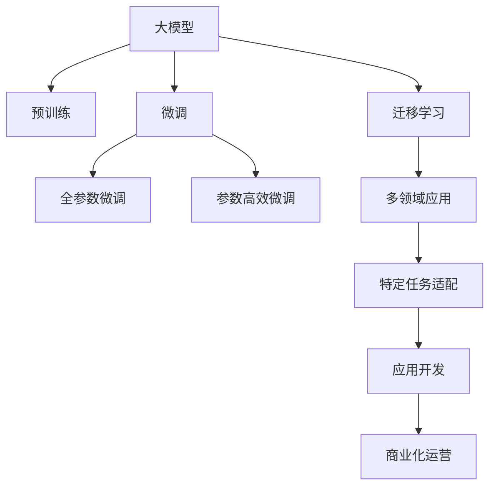

                 

# 市场前景：大模型创业的远大目标

大模型（Large Model）技术是人工智能领域的一次重要革命，正在重塑软件企业的核心竞争力。在市场需求和技术发展的双重驱动下，越来越多的企业开始布局大模型创业，瞄准了未来无限的市场前景。本文将从背景介绍、核心概念与联系、核心算法原理、数学模型与公式、项目实践、实际应用场景、工具与资源推荐、未来发展趋势与挑战等方面，全面解析大模型创业的广阔前景和挑战，为创业者和从业者提供全面的指导。

## 1. 背景介绍

### 1.1 问题由来

近年来，随着深度学习技术的发展，预训练大模型（Pre-trained Large Model）在自然语言处理（NLP）、计算机视觉（CV）、语音识别（ASR）等领域取得了显著进展，展示了强大的泛化能力和解决复杂任务的能力。Google的BERT、OpenAI的GPT-3、DeepMind的AlphaFold等大模型，不仅在学术界引发了广泛关注，也在实际应用中展现了颠覆性的优势。

大模型创业，是指基于预训练大模型的二次开发和应用，旨在提供定制化的解决方案，满足特定场景的需求。从商业模型上看，大模型创业将带动上下游产业链的发展，形成新的商业模式和收入模式，推动AI技术的普及和应用。

### 1.2 问题核心关键点

大模型创业的核心在于选择合适的技术路径，挖掘潜在市场，并根据市场需要进行模型优化和应用部署。关键点包括：

- **技术基础**：掌握预训练大模型的原理和实现，能够进行微调、迁移学习、参数高效微调等操作。
- **市场分析**：了解目标市场的潜在需求，选择合适的应用场景，进行市场需求调研。
- **应用开发**：具备应用开发的能力，能够将大模型应用于实际场景，提供可靠的解决方案。
- **商业化运营**：具备商业化的策略和能力，能够将产品进行市场推广，并实现盈利。

### 1.3 问题研究意义

大模型创业有着广泛的市场前景，对于推动人工智能技术落地应用具有重要意义：

1. **降本增效**：大模型能够显著降低开发成本，提高企业运营效率。
2. **市场创新**：提供定制化解决方案，满足特定市场需求的创新服务。
3. **生态构建**：带动上下游产业链的发展，形成生态闭环。
4. **技术积累**：在实际应用中积累经验，推动技术进步。

## 2. 核心概念与联系

### 2.1 核心概念概述

- **大模型（Large Model）**：指通过在大规模数据集上进行预训练，获得的能够执行复杂任务的高质量模型。常见的包括BERT、GPT、XLNet等。
- **预训练（Pre-training）**：指在大规模无标签数据上，通过自监督学习任务训练模型的过程。例如，语言模型、掩码语言模型等。
- **微调（Fine-tuning）**：指在预训练模型的基础上，通过有监督学习任务进一步优化模型的过程。用于解决特定场景的问题。
- **迁移学习（Transfer Learning）**：指将一个领域学到的知识，迁移到另一个相关领域学习的过程。大模型通过迁移学习，能够适应多个领域和任务。
- **参数高效微调（Parameter-Efficient Fine-tuning）**：指在微调过程中，只更新少量模型参数，减少计算资源消耗。

这些概念之间的联系可以通过以下Mermaid流程图展示：



这个流程图展示了从大模型的预训练到微调，再到迁移学习和特定任务适配，最终应用开发和商业化运营的整个流程。

## 3. 核心算法原理 & 具体操作步骤

### 3.1 算法原理概述

大模型创业的核心算法原理是基于预训练模型的二次开发和应用。预训练模型在处理特定任务时，通常需要进行微调或迁移学习，以适应任务的特点。微调过程涉及到损失函数的定义、优化算法的选择、学习率的设定等关键步骤。

### 3.2 算法步骤详解

大模型创业的算法步骤如下：

1. **数据准备**：收集并预处理目标任务的数据集，划分为训练集、验证集和测试集。
2. **模型选择**：选择适合目标任务的预训练大模型，并进行微调或迁移学习。
3. **参数设置**：根据任务特点，设置优化器、学习率、正则化参数等超参数。
4. **模型训练**：使用训练集对模型进行有监督学习，不断优化模型参数。
5. **模型评估**：在验证集上评估模型性能，根据评估结果调整模型参数。
6. **模型部署**：将训练好的模型应用于实际场景，进行测试和优化。
7. **商业化运营**：将模型集成到应用中，进行市场推广和销售。

### 3.3 算法优缺点

大模型创业的优点包括：

- **技术成熟**：预训练大模型技术相对成熟，容易被理解和应用。
- **快速迭代**：微调和迁移学习可以迅速迭代模型，适应新任务。
- **高效开发**：减少了从头训练模型的需求，节省时间和成本。

缺点包括：

- **数据依赖**：微调和迁移学习依赖于目标任务的数据集，数据集质量直接影响模型性能。
- **模型复杂**：预训练模型参数量庞大，模型部署和优化复杂。
- **技术门槛**：需要一定的技术背景，对于初学者来说有一定门槛。

### 3.4 算法应用领域

大模型创业可以在多个领域进行应用，例如：

- **自然语言处理**：文本分类、命名实体识别、机器翻译等。
- **计算机视觉**：图像识别、目标检测、图像生成等。
- **语音识别**：语音识别、语音合成、情感分析等。
- **推荐系统**：个性化推荐、广告投放、用户行为分析等。
- **医疗健康**：医学影像分析、基因组分析、疾病预测等。
- **金融科技**：风险评估、信用评分、投资分析等。

## 4. 数学模型和公式 & 详细讲解 & 举例说明

### 4.1 数学模型构建

假设目标任务为二分类任务，预训练大模型为BERT，训练数据集为 $D=\{(x_i, y_i)\}_{i=1}^N$。使用交叉熵损失函数 $\ell(\hat{y}, y)$ 作为模型训练的目标函数。

目标函数的表达式为：

$$
\mathcal{L}(\theta) = \frac{1}{N}\sum_{i=1}^N \ell(\hat{y}_i, y_i)
$$

其中 $\theta$ 为模型参数，$\hat{y}_i$ 为模型对输入 $x_i$ 的预测，$y_i$ 为真实标签。

### 4.2 公式推导过程

对于二分类任务，交叉熵损失函数的定义为：

$$
\ell(\hat{y}, y) = -y\log\hat{y} - (1-y)\log(1-\hat{y})
$$

在模型训练中，前向传播计算预测结果 $\hat{y}$，使用反向传播计算梯度 $\nabla_\theta\mathcal{L}(\theta)$。优化算法如AdamW、SGD等，更新模型参数。

### 4.3 案例分析与讲解

以自然语言处理中的文本分类任务为例，使用BERT模型进行微调。具体步骤如下：

1. 收集并预处理文本数据集，将其划分为训练集、验证集和测试集。
2. 选择BERT模型，设置学习率为 $2e-5$，使用AdamW优化器进行训练。
3. 在训练集上前向传播计算预测结果，反向传播计算梯度，更新模型参数。
4. 在验证集上评估模型性能，根据评估结果调整学习率。
5. 在测试集上测试模型，评估其性能。
6. 将训练好的模型集成到应用中，进行市场推广和销售。

## 5. 项目实践：代码实例和详细解释说明

### 5.1 开发环境搭建

为了进行大模型创业的项目实践，需要搭建合适的开发环境。以下是使用Python和PyTorch搭建开发环境的步骤：

1. 安装Anaconda，创建虚拟环境。
2. 使用pip安装PyTorch、Transformers等库。
3. 安装必要的工具和框架，如TensorFlow、Scikit-learn等。

### 5.2 源代码详细实现

以文本分类任务为例，展示如何使用BERT模型进行微调的代码实现。

```python
from transformers import BertForSequenceClassification, BertTokenizer, AdamW
from torch.utils.data import DataLoader
from torch.utils.data.dataset import Dataset
import torch
import torch.nn as nn

class MyDataset(Dataset):
    def __init__(self, texts, labels, tokenizer):
        self.texts = texts
        self.labels = labels
        self.tokenizer = tokenizer

    def __len__(self):
        return len(self.texts)

    def __getitem__(self, item):
        text = self.texts[item]
        label = self.labels[item]

        encoding = self.tokenizer(text, return_tensors='pt', padding=True, truncation=True)
        input_ids = encoding['input_ids']
        attention_mask = encoding['attention_mask']
        label = torch.tensor(label, dtype=torch.long)

        return {'input_ids': input_ids, 'attention_mask': attention_mask, 'labels': label}

# 数据准备
tokenizer = BertTokenizer.from_pretrained('bert-base-uncased')
train_dataset = MyDataset(train_texts, train_labels, tokenizer)
val_dataset = MyDataset(val_texts, val_labels, tokenizer)
test_dataset = MyDataset(test_texts, test_labels, tokenizer)

# 模型选择
model = BertForSequenceClassification.from_pretrained('bert-base-uncased', num_labels=2)

# 参数设置
optimizer = AdamW(model.parameters(), lr=2e-5)

# 模型训练
device = torch.device('cuda' if torch.cuda.is_available() else 'cpu')
model.to(device)

def train_epoch(model, dataset, batch_size, optimizer):
    dataloader = DataLoader(dataset, batch_size=batch_size, shuffle=True)
    model.train()
    total_loss = 0
    for batch in dataloader:
        input_ids = batch['input_ids'].to(device)
        attention_mask = batch['attention_mask'].to(device)
        labels = batch['labels'].to(device)

        outputs = model(input_ids, attention_mask=attention_mask, labels=labels)
        loss = outputs.loss
        total_loss += loss.item()

        optimizer.zero_grad()
        loss.backward()
        optimizer.step()

    return total_loss / len(dataloader)

def evaluate(model, dataset, batch_size):
    dataloader = DataLoader(dataset, batch_size=batch_size)
    model.eval()
    total_loss = 0
    total_correct = 0
    with torch.no_grad():
        for batch in dataloader:
            input_ids = batch['input_ids'].to(device)
            attention_mask = batch['attention_mask'].to(device)
            labels = batch['labels'].to(device)

            outputs = model(input_ids, attention_mask=attention_mask)
            loss = outputs.loss
            total_loss += loss.item()
            predictions = torch.argmax(outputs.logits, dim=1)
            total_correct += (predictions == labels).sum().item()

    acc = total_correct / len(dataset)
    return total_loss / len(dataset), acc

# 模型训练
epochs = 3
batch_size = 16

for epoch in range(epochs):
    train_loss = train_epoch(model, train_dataset, batch_size, optimizer)
    val_loss, val_acc = evaluate(model, val_dataset, batch_size)

    print(f'Epoch {epoch+1}, Train Loss: {train_loss:.4f}, Val Loss: {val_loss:.4f}, Val Acc: {val_acc:.4f}')

print('Test Results:')
test_loss, test_acc = evaluate(model, test_dataset, batch_size)
print(f'Test Loss: {test_loss:.4f}, Test Acc: {test_acc:.4f}')
```

### 5.3 代码解读与分析

在上述代码中，首先定义了自定义数据集类 `MyDataset`，用于处理文本数据。接着，选择BERT模型，设置学习率和优化器，并进行模型训练。在训练过程中，使用 `train_epoch` 函数计算每个epoch的损失，使用 `evaluate` 函数评估模型性能。最后，在测试集上测试模型，输出测试结果。

## 6. 实际应用场景

### 6.1 智能客服系统

大模型创业在智能客服系统中的应用，可以显著提升客服系统的智能化水平。通过微调预训练大模型，系统能够自动理解用户意图，提供个性化的客户服务，处理复杂的咨询问题。

### 6.2 金融风控

在金融领域，大模型创业可以应用于风险评估、信用评分、欺诈检测等任务。通过对大模型的微调和迁移学习，系统能够快速处理海量数据，识别风险点，提高金融决策的准确性。

### 6.3 医疗影像诊断

在医疗领域，大模型创业可以应用于医学影像分析、基因组分析等任务。通过对大模型的微调和迁移学习，系统能够自动分析影像数据，辅助医生进行诊断和治疗决策。

### 6.4 未来应用展望

随着技术的发展，大模型创业将拓展到更多领域，带来更加广阔的市场前景。未来的应用场景可能包括：

- **智能制造**：大模型在智能制造中的应用，可以优化生产流程，提升生产效率。
- **智能交通**：大模型在智能交通中的应用，可以优化交通规划，减少交通拥堵。
- **智能能源**：大模型在智能能源中的应用，可以优化能源分配，提升能源利用效率。
- **智能城市**：大模型在智能城市中的应用，可以优化城市管理，提升城市生活质量。

## 7. 工具和资源推荐

### 7.1 学习资源推荐

1. **《深度学习》课程**：斯坦福大学提供的专业深度学习课程，系统讲解深度学习原理和应用。
2. **Transformers官方文档**：提供详细的模型介绍和应用示例，帮助开发者理解大模型创业的基本原理。
3. **《动手学深度学习》**：介绍深度学习理论和实践，涵盖大模型创业所需的核心技术。

### 7.2 开发工具推荐

1. **PyTorch**：优秀的深度学习框架，支持灵活的动态图计算。
2. **TensorFlow**：由Google开发的深度学习框架，支持大规模分布式训练。
3. **Transformers库**：提供预训练模型的封装和微调功能，简化开发流程。
4. **Jupyter Notebook**：支持交互式编程，方便开发和调试。

### 7.3 相关论文推荐

1. **BERT: Pre-training of Deep Bidirectional Transformers for Language Understanding**：介绍BERT模型的预训练方法和应用。
2. **GPT-3: Language Models are Unsupervised Multitask Learners**：介绍GPT-3模型的预训练方法和应用。
3. **Attention is All You Need**：介绍Transformer模型的预训练方法和应用。

## 8. 总结：未来发展趋势与挑战

### 8.1 研究成果总结

大模型创业是人工智能领域的一次重要变革，通过微调和迁移学习，大模型能够适应特定的应用场景，带来广泛的市场前景。未来，随着技术的发展，大模型创业将不断拓展新的应用领域，带来更多的商业机会。

### 8.2 未来发展趋势

1. **技术升级**：随着技术的不断进步，大模型的性能将进一步提升，能够处理更加复杂和多样化的任务。
2. **场景拓展**：大模型创业将拓展到更多行业和场景，带来新的应用机会。
3. **应用深化**：大模型将与更多的技术进行融合，如知识图谱、自然语言推理等，提供更加全面和精准的解决方案。
4. **生态构建**：大模型创业将构建完整的生态系统，形成多方共赢的局面。

### 8.3 面临的挑战

尽管大模型创业有着广阔的市场前景，但仍然面临诸多挑战：

1. **数据质量**：微调和迁移学习依赖于高质量的数据集，数据集的质量直接影响模型的性能。
2. **计算资源**：大模型需要大量的计算资源进行训练和推理，如何优化资源利用是一个重要问题。
3. **算法优化**：如何在保证性能的前提下，优化模型的计算速度和存储空间，是一个重要研究方向。
4. **应用场景**：如何将大模型应用于特定场景，实现高效和可靠的服务，是一个重要挑战。

### 8.4 研究展望

未来的研究将重点关注以下几个方向：

1. **自监督学习**：通过无监督学习技术，提高大模型的泛化能力和鲁棒性。
2. **小样本学习**：利用少量数据进行高效微调，降低对标注数据的依赖。
3. **跨模态融合**：将视觉、语音等多模态数据与文本数据进行融合，提高模型的全面性。
4. **分布式训练**：通过分布式训练技术，提高大模型的训练效率。

## 9. 附录：常见问题与解答

**Q1：如何选择合适的预训练大模型？**

A: 根据目标任务的特点，选择适合的预训练大模型。例如，对于文本分类任务，可以选择BERT、GPT等；对于图像识别任务，可以选择ResNet、VGG等。

**Q2：大模型创业中的数据依赖问题如何解决？**

A: 可以通过数据增强技术，如数据扩充、数据合成等，提高数据集的多样性，减少数据依赖。

**Q3：大模型创业中的计算资源瓶颈如何解决？**

A: 可以通过分布式训练、模型压缩、模型剪枝等技术，优化计算资源的使用。

**Q4：大模型创业中的算法优化有哪些方法？**

A: 可以采用优化算法如Adam、SGD等，调整学习率、正则化参数等超参数，优化模型性能。

**Q5：大模型创业中的应用场景如何拓展？**

A: 可以通过市场调研和用户反馈，不断拓展大模型的应用场景，满足更多用户需求。

作者：禅与计算机程序设计艺术 / Zen and the Art of Computer Programming

