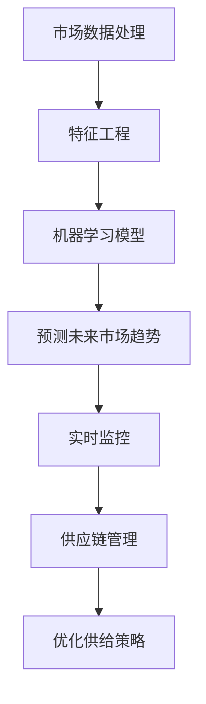

                 

# 市场趋势分析调整供给策略

## 1. 背景介绍

### 1.1 问题由来

在当今数字化时代，市场环境瞬息万变，需求和供应之间的动态关系日益复杂。为了保持竞争力和市场份额，企业需要对市场趋势进行深入分析，并及时调整供给策略。然而，传统的数据分析和统计方法已无法应对实时变化和海量数据的需求。因此，利用人工智能和机器学习技术进行市场趋势分析和供给策略调整成为了一个热门话题。

### 1.2 问题核心关键点

市场趋势分析调整供给策略的核心在于：
1. 收集和处理海量市场数据，从中提取有用信息。
2. 利用机器学习模型预测未来市场趋势。
3. 根据预测结果动态调整供给策略，确保最优的市场表现。
4. 实现实时监控和响应，保证市场策略的及时性和灵活性。

### 1.3 问题研究意义

市场趋势分析调整供给策略对企业的意义重大：
1. 提高市场响应速度，提升市场份额。
2. 降低库存成本，减少浪费。
3. 提高供应链效率，优化资源配置。
4. 增强企业的竞争力和盈利能力。

## 2. 核心概念与联系

### 2.1 核心概念概述

市场趋势分析调整供给策略涉及以下几个关键概念：

- **市场数据处理**：指从原始市场数据中提取有用信息，包括数据清洗、特征工程、数据可视化等步骤。
- **机器学习模型**：指利用统计学习理论构建的模型，用于预测未来市场趋势。
- **供应链管理**：指企业通过优化供应链流程，实现物料的采购、存储、配送等环节的协同管理。
- **实时监控**：指对市场环境进行实时监控，及时捕捉市场变化，做出相应调整。
- **预测与决策**：指利用市场数据和机器学习模型，预测未来市场趋势，并根据预测结果调整供给策略。

这些核心概念之间的逻辑关系可以通过以下Mermaid流程图来展示：



这个流程图展示了大数据处理、机器学习模型、供应链管理等各个环节的相互关系和作用，以及它们对市场趋势分析和供给策略调整的重要影响。

## 3. 核心算法原理 & 具体操作步骤

### 3.1 算法原理概述

市场趋势分析调整供给策略的核心算法原理如下：

1. **市场数据处理**：收集并清洗市场数据，提取出对市场趋势有影响力的特征。
2. **机器学习模型**：使用统计学习理论，建立预测未来市场趋势的模型，如回归模型、时间序列模型、深度学习模型等。
3. **预测与决策**：根据预测结果，动态调整供给策略，如调整库存水平、优化供应链流程、提高物流效率等。
4. **实时监控**：实时监控市场环境变化，及时更新模型参数和预测结果，确保策略的有效性和及时性。

### 3.2 算法步骤详解

市场趋势分析调整供给策略的具体操作步骤如下：

**Step 1: 市场数据收集与清洗**

- 从多个数据源收集市场数据，如电商平台销售数据、社交媒体情绪数据、新闻报道、天气数据等。
- 对数据进行清洗和预处理，包括去重、处理缺失值、数据归一化等。

**Step 2: 特征工程**

- 对清洗后的数据进行特征提取，如商品价格、库存量、季节性因素、节假日效应等。
- 进行特征选择，保留对市场趋势有显著影响的特征。

**Step 3: 模型训练与评估**

- 选择合适的机器学习模型，如线性回归、支持向量机、随机森林、深度学习模型等。
- 将清洗和处理后的数据集分为训练集和测试集，训练模型并评估其性能。

**Step 4: 预测未来市场趋势**

- 使用训练好的模型对未来的市场趋势进行预测，如销售量预测、价格预测、需求预测等。
- 根据预测结果，生成市场趋势报告，供管理层参考。

**Step 5: 调整供给策略**

- 根据市场趋势预测结果，调整库存水平、生产计划、物流配送等供给策略。
- 实时监控市场环境变化，及时更新模型参数和预测结果，确保策略的有效性和及时性。

### 3.3 算法优缺点

市场趋势分析调整供给策略具有以下优点：
1. 基于数据驱动，更具科学性和准确性。
2. 能够实时监控市场变化，及时调整策略。
3. 优化资源配置，提高供应链效率。

同时，该方法也存在一定的局限性：
1. 数据质量和特征提取对模型性能有很大影响。
2. 模型复杂度高，对计算资源和数据量要求较高。
3. 模型参数调整和维护难度较大，需要专业知识和技能。

### 3.4 算法应用领域

市场趋势分析调整供给策略在多个领域得到了广泛应用，例如：

- **电商行业**：利用销售数据、用户行为数据等进行销售预测，优化库存管理和价格策略。
- **制造业**：通过对市场需求和生产成本进行预测，调整生产计划和库存量，减少浪费和成本。
- **零售业**：根据季节性因素和节假日效应进行需求预测，优化库存和物流配送。
- **物流运输**：预测货物运输需求，优化路线和运输计划，提高物流效率。

## 4. 数学模型和公式 & 详细讲解 & 举例说明

### 4.1 数学模型构建

市场趋势分析调整供给策略的数学模型构建如下：

- **时间序列模型**：如ARIMA、指数平滑模型，用于预测未来的销售量、需求量等时间序列数据。
- **回归模型**：如线性回归、逻辑回归、决策树回归等，用于建立特征与目标变量之间的关系。
- **深度学习模型**：如LSTM、RNN、GRU等，用于处理复杂的时间序列数据和捕捉非线性关系。

### 4.2 公式推导过程

以线性回归模型为例，假设市场数据集为 $\{(x_i, y_i)\}_{i=1}^N$，其中 $x_i$ 为特征向量，$y_i$ 为目标变量。线性回归模型的目标是找到线性关系 $y_i = \beta_0 + \beta_1x_{i1} + \ldots + \beta_px_{ip} + \epsilon_i$，其中 $\epsilon_i$ 为误差项。

根据最小二乘法，优化目标函数为：

$$
\min_{\beta} \sum_{i=1}^N (y_i - \hat{y}_i)^2
$$

其中 $\hat{y}_i = \beta_0 + \beta_1x_{i1} + \ldots + \beta_px_{ip}$。求解此优化问题，得到线性回归模型的参数 $\beta = (\beta_0, \beta_1, \ldots, \beta_p)$。

### 4.3 案例分析与讲解

以电商平台销售量预测为例，假设平台历史销售数据为 $\{(t_i, s_i)\}_{i=1}^N$，其中 $t_i$ 为时间戳，$s_i$ 为销售量。通过时间序列模型预测未来的销售量，具体步骤如下：

1. 将历史销售数据分解为趋势项和季节性项，如 $s_i = T_i + S_i$，其中 $T_i$ 为趋势项，$S_i$ 为季节性项。
2. 使用ARIMA模型对趋势项 $T_i$ 进行预测。
3. 使用季节性分解的方法，如X-13ARIMA-SEATS，对季节性项 $S_i$ 进行预测。
4. 将趋势项和季节性项的预测结果进行组合，得到未来的销售量预测值。

## 5. 项目实践：代码实例和详细解释说明

### 5.1 开发环境搭建

在进行市场趋势分析调整供给策略的实践前，需要先准备好开发环境。以下是使用Python进行PyTorch开发的环境配置流程：

1. 安装Anaconda：从官网下载并安装Anaconda，用于创建独立的Python环境。

2. 创建并激活虚拟环境：
```bash
conda create -n market_env python=3.8 
conda activate market_env
```

3. 安装PyTorch：根据CUDA版本，从官网获取对应的安装命令。例如：
```bash
conda install pytorch torchvision torchaudio cudatoolkit=11.1 -c pytorch -c conda-forge
```

4. 安装相关库：
```bash
pip install pandas numpy sklearn matplotlib tqdm jupyter notebook ipython
```

5. 安装W&B（Weights & Biases）：用于实验跟踪和模型监控。
```bash
pip install weidghts-and-biases
```

6. 安装TensorBoard：用于模型可视化。
```bash
pip install tensorboard
```

7. 安装TensorFlow：
```bash
pip install tensorflow
```

完成上述步骤后，即可在`market_env`环境中开始项目实践。

### 5.2 源代码详细实现

以使用LSTM模型进行销售量预测为例，以下是使用Python和TensorFlow进行市场趋势分析调整供给策略的代码实现：

```python
import tensorflow as tf
from tensorflow.keras.layers import LSTM, Dense
from tensorflow.keras.models import Sequential
from tensorflow.keras.optimizers import Adam

# 定义时间序列模型
def create_lstm_model(input_shape, output_shape, hidden_units):
    model = Sequential()
    model.add(LSTM(units=hidden_units, input_shape=input_shape))
    model.add(Dense(output_shape))
    model.compile(optimizer=Adam(lr=0.001), loss='mse')
    return model

# 加载数据
# 假设数据已从原始数据源清洗和处理，并分为训练集和测试集
train_data = ...
test_data = ...

# 创建LSTM模型
model = create_lstm_model(input_shape=train_data.shape[1:], output_shape=1, hidden_units=64)

# 训练模型
model.fit(train_data, train_labels, epochs=100, validation_data=(test_data, test_labels))

# 预测未来销售量
future_sales = model.predict(future_data)

# 实时监控和调整策略
# 假设市场环境发生变化，如节假日或促销活动
new_data = ...
new_labels = ...
model.predict(new_data)
```

### 5.3 代码解读与分析

让我们再详细解读一下关键代码的实现细节：

**create_lstm_model函数**：
- 定义一个基于LSTM的神经网络模型，包括输入层、LSTM层、输出层和编译步骤。

**数据加载**：
- 加载已清洗和处理好的训练集和测试集数据，其中包含时间戳和销售量等特征。

**模型训练**：
- 创建LSTM模型，并使用训练集数据进行训练。
- 设置训练轮数为100，并在验证集上进行评估。

**预测未来销售量**：
- 使用训练好的模型对未来的销售量进行预测。
- 假设市场环境发生变化，如节假日或促销活动，重新加载数据进行预测。

**实时监控和调整策略**：
- 实时监控市场环境变化，如节假日、促销活动等，及时更新模型参数和预测结果。
- 根据预测结果调整供给策略，如调整库存水平、优化物流配送等。

## 6. 实际应用场景

### 6.1 电商行业

电商平台利用市场趋势分析调整供给策略，可以显著提升销售预测和库存管理的准确性。通过销售数据、用户行为数据等，电商平台可以构建时间序列模型，预测未来的销售量和需求量，从而优化库存水平和价格策略，提高客户满意度。

### 6.2 制造业

制造业通过市场趋势分析调整供给策略，可以更好地适应市场需求变化，减少生产浪费和库存成本。利用销售数据、生产成本数据等，制造业可以预测市场需求变化，优化生产计划和库存量，提高供应链效率。

### 6.3 零售业

零售业通过市场趋势分析调整供给策略，可以更准确地预测需求量和补货时间，减少库存积压和缺货情况。利用季节性因素和节假日效应等数据，零售业可以建立时间序列模型，预测未来的需求量，优化库存和物流配送，提升顾客购物体验。

### 6.4 物流运输

物流运输通过市场趋势分析调整供给策略，可以更合理地规划运输路线和时间，提高物流效率和客户满意度。利用货运数据、天气数据等，物流公司可以预测货物运输需求，优化路线和运输计划，降低运输成本。

## 7. 工具和资源推荐

### 7.1 学习资源推荐

为了帮助开发者系统掌握市场趋势分析调整供给策略的理论基础和实践技巧，这里推荐一些优质的学习资源：

1. Coursera上的《Python for Data Science and Machine Learning Bootcamp》：涵盖Python基础和数据科学、机器学习等领域的课程，适合初学者入门。

2. 《Hands-On Machine Learning with Scikit-Learn, Keras, and TensorFlow》：Keras和TensorFlow官方文档，提供了丰富的代码示例和详细解释。

3. 《Time Series Forecasting with Python》：介绍了时间序列预测的常用方法和实现技巧，结合实际案例进行讲解。

4. 《Predictive Analytics with R》：R语言在数据挖掘和预测分析中的应用，适合对R语言感兴趣的学习者。

5. 《Market Basket Analysis with Python》：利用关联规则挖掘进行市场分析，适合电商和零售行业开发者。

通过对这些资源的学习实践，相信你一定能够快速掌握市场趋势分析调整供给策略的精髓，并用于解决实际的业务问题。

### 7.2 开发工具推荐

高效的开发离不开优秀的工具支持。以下是几款用于市场趋势分析调整供给策略开发的常用工具：

1. Jupyter Notebook：用于编写和运行Python代码，支持多种编程语言和库。

2. PyTorch：基于Python的开源深度学习框架，灵活动态的计算图，适合快速迭代研究。

3. TensorFlow：由Google主导开发的开源深度学习框架，生产部署方便，适合大规模工程应用。

4. W&B（Weights & Biases）：模型训练的实验跟踪工具，可以记录和可视化模型训练过程中的各项指标，方便对比和调优。

5. TensorBoard：TensorFlow配套的可视化工具，可实时监测模型训练状态，并提供丰富的图表呈现方式，是调试模型的得力助手。

6. Apache Kafka：用于实时数据流处理和消息队列管理，适合大数据量实时数据处理。

合理利用这些工具，可以显著提升市场趋势分析调整供给策略的开发效率，加快创新迭代的步伐。

### 7.3 相关论文推荐

市场趋势分析调整供给策略的研究源于学界的持续研究。以下是几篇奠基性的相关论文，推荐阅读：

1. A. Hyndman和G. Athanasopoulos的《Forecasting: Principles and Practice》：介绍了时间序列预测的原理、方法和实际应用，是预测分析领域的经典教材。

2. M. G. Nyström和M. H. R. Fox的《Time Series Data Mining and Statistical Learning》：介绍了时间序列数据挖掘和统计学习的方法，结合实际案例进行讲解。

3. Y. Wei和J. P. Howell的《Market Trend Analysis for Supply Chain Management》：介绍了市场趋势分析在供应链管理中的应用，结合实际案例进行讲解。

4. S. P. MacKay的《Bayesian Interpolation》：介绍了贝叶斯插值方法，可以用于预测和调整市场趋势。

5. I. King、P. Giannakoglou和K. Eastman的《A Survey of Machine Learning Techniques for Demand Forecasting》：介绍了机器学习在需求预测中的应用，结合实际案例进行讲解。

这些论文代表了大市场趋势分析调整供给策略的发展脉络。通过学习这些前沿成果，可以帮助研究者把握学科前进方向，激发更多的创新灵感。

## 8. 总结：未来发展趋势与挑战

### 8.1 总结

本文对市场趋势分析调整供给策略进行了全面系统的介绍。首先阐述了市场趋势分析调整供给策略的研究背景和意义，明确了市场趋势分析和供给策略调整在企业管理中的重要性。其次，从原理到实践，详细讲解了市场趋势分析调整供给策略的数学原理和关键步骤，给出了市场趋势分析调整供给策略的完整代码实例。同时，本文还广泛探讨了市场趋势分析调整供给策略在电商、制造业、零售、物流等多个领域的应用前景，展示了市场趋势分析调整供给策略的广阔应用空间。此外，本文精选了市场趋势分析调整供给策略的各类学习资源，力求为读者提供全方位的技术指引。

通过本文的系统梳理，可以看到，市场趋势分析调整供给策略正在成为企业管理的重要范式，极大地提高了企业的市场响应速度和供应链效率，催生了更多的落地场景。得益于深度学习和大数据分析技术的进步，市场趋势分析调整供给策略在企业中的应用将会越来越广泛，为企业的数字化转型和智能化升级提供强有力的技术支持。

### 8.2 未来发展趋势

展望未来，市场趋势分析调整供给策略将呈现以下几个发展趋势：

1. **数据质量提升**：随着数据采集和处理技术的进步，数据的准确性和实时性将大大提升，为市场趋势预测和供给策略调整提供更好的数据支持。

2. **模型多样化**：除了时间序列模型和回归模型，未来将涌现更多先进的模型，如深度学习模型、集成学习模型等，以更好地捕捉市场趋势和需求变化。

3. **预测精度提高**：随着算力和大数据的不断积累，市场趋势预测的精度将进一步提高，企业可以更准确地进行市场分析和策略调整。

4. **实时监控与响应**：随着物联网和5G技术的普及，市场趋势分析调整供给策略将实现实时监控和响应，快速捕捉市场变化，调整策略。

5. **跨领域应用拓展**：市场趋势分析调整供给策略将从电商、制造业等传统领域拓展到更多领域，如金融、医疗、教育等，为不同行业提供智能决策支持。

6. **模型可解释性增强**：未来模型将更加注重可解释性，便于管理层理解和决策，增强模型应用的可信度。

以上趋势凸显了市场趋势分析调整供给策略的广阔前景。这些方向的探索发展，必将进一步提升市场趋势分析和供给策略调整的效果，为企业带来更大的竞争优势和价值。

### 8.3 面临的挑战

尽管市场趋势分析调整供给策略已经取得了瞩目成就，但在迈向更加智能化、普适化应用的过程中，它仍面临着诸多挑战：

1. **数据获取难度大**：高质量的市场数据获取难度较大，尤其是对于小规模企业而言，数据获取成本高。如何降低数据获取难度，提高数据质量，是未来需要解决的问题。

2. **模型复杂度高**：市场趋势预测和供给策略调整模型复杂度高，对计算资源和数据量要求较高。如何简化模型，降低计算成本，是未来需要优化的方向。

3. **模型参数调整难度大**：市场趋势预测模型参数调整难度大，需要专业知识和技术支持。如何提高模型的可操作性，降低参数调整门槛，是未来需要突破的难点。

4. **模型可解释性不足**：市场趋势预测模型往往是"黑盒"系统，难以解释其内部工作机制和决策逻辑。如何提高模型的可解释性，增强模型应用的可信度，是未来需要解决的问题。

5. **模型泛化性不足**：市场趋势预测模型对不同场景的泛化能力不足，面对复杂多变的市场环境，预测结果可能不够准确。如何增强模型的泛化能力，提高预测精度，是未来需要研究的方向。

6. **模型安全性不足**：市场趋势预测模型可能受到恶意攻击，造成预测结果偏差。如何提高模型的安全性，防止模型被恶意篡改，是未来需要保障的方向。

正视市场趋势分析调整供给策略面临的这些挑战，积极应对并寻求突破，将是大数据、人工智能技术在企业管理中的应用走向成熟的必由之路。相信随着学界和产业界的共同努力，这些挑战终将一一被克服，市场趋势分析调整供给策略必将在构建人机协同的智能企业中扮演越来越重要的角色。

### 8.4 研究展望

面向未来，市场趋势分析调整供给策略的研究需要在以下几个方面寻求新的突破：

1. **跨领域数据融合**：将不同领域的数据进行融合，建立多源数据驱动的市场趋势预测模型，提高预测的准确性和鲁棒性。

2. **模型自适应性增强**：开发自适应模型，能够在不同市场环境下快速调整模型参数，提高模型的泛化能力和实时响应能力。

3. **模型压缩与优化**：开发模型压缩和优化算法，降低计算成本，提高模型的实时性和可操作性。

4. **模型可解释性增强**：引入可解释性技术，如LIME、SHAP等，增强模型的可解释性，便于管理层理解和决策。

5. **模型安全性提升**：引入安全机制，如模型加密、数据脱敏等，提高模型的安全性，防止模型被恶意篡改。

6. **模型与决策系统集成**：将市场趋势预测模型与企业决策系统集成，实现智能决策支持，提高企业的市场响应速度和供应链效率。

这些研究方向将为市场趋势分析调整供给策略带来新的突破，为企业的数字化转型和智能化升级提供强有力的技术支持。相信随着技术的不断进步和应用场景的不断拓展，市场趋势分析调整供给策略将发挥更大的作用，为企业带来更大的竞争优势和价值。

## 9. 附录：常见问题与解答

**Q1：市场趋势分析调整供给策略是否适用于所有企业？**

A: 市场趋势分析调整供给策略适用于大多数企业，特别是数据量较大、市场变化较快的企业。但对于一些小规模、数据获取难度大的企业，可能存在一定的挑战。

**Q2：如何降低市场趋势分析调整供给策略的数据获取难度？**

A: 可以通过数据共享、数据联盟、数据众包等手段，降低数据获取难度。同时，可以利用公开发布的数据集，如Kaggle、UCI等，进行市场趋势分析和预测。

**Q3：市场趋势分析调整供给策略对计算资源的要求如何？**

A: 市场趋势分析调整供给策略对计算资源要求较高，特别是对于深度学习和大数据量的模型。可以通过云计算、分布式计算等手段，降低计算成本，提高计算效率。

**Q4：如何提高市场趋势分析调整供给策略的模型可解释性？**

A: 引入可解释性技术，如LIME、SHAP等，可以解释模型的决策过程，提高模型的可解释性。同时，可以建立模型可视化工具，展示模型内部结构和工作机制。

**Q5：市场趋势分析调整供给策略的未来发展方向是什么？**

A: 市场趋势分析调整供给策略的未来发展方向包括数据质量提升、模型多样化、预测精度提高、实时监控与响应、跨领域应用拓展、模型可解释性增强等。这些方向将为市场趋势分析和供给策略调整带来新的突破，为企业的数字化转型和智能化升级提供强有力的技术支持。

---

作者：禅与计算机程序设计艺术 / Zen and the Art of Computer Programming

