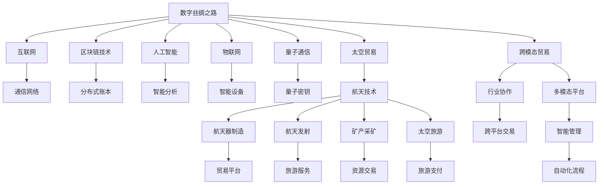

                 

# 2050年的全球贸易：从数字丝绸之路到太空贸易的贸易新路径

## 1. 背景介绍

### 1.1 问题由来

全球化贸易在全球范围内塑造了各国经济的发展，促进了国际贸易的繁荣。然而，随着全球经济格局的不断变化，以及新技术的不断涌现，传统的国际贸易模式和路径正面临前所未有的挑战和机遇。因此，思考和探索2050年全球贸易的新路径具有重要意义。

近年来，信息技术与数字经济迅速发展，数字丝绸之路的兴起为国际贸易提供了新的发展机遇。此外，随着航天技术的进步，太空贸易逐渐成为可能，开辟了国际贸易的新领域。

### 1.2 问题核心关键点

- **数字丝绸之路**：指通过互联网和信息通信技术，连接全球各国，促进信息、技术、商品和服务的交流与贸易。
- **太空贸易**：指利用太空技术和资源，进行航天器制造、航天发射、小行星采矿、太空旅游等新型贸易活动。
- **区块链技术**：指一种分布式账本技术，可以保证交易的透明性和安全性，为全球贸易提供新的交易方式。
- **人工智能**：指模拟人类智能的计算机程序，可以用于数据分析、商品推荐、自动化贸易等。
- **量子通信**：指利用量子力学原理进行通信，具有高速、安全等优点，为全球贸易提供新的通信方式。
- **物联网**：指通过网络将各种设备连接到一起，实现设备间的数据共享和协同工作。
- **跨模态贸易**：指利用多种贸易模式和技术，实现贸易的跨平台、跨行业、跨国家运作。

## 2. 核心概念与联系

### 2.1 核心概念概述

全球贸易的数字化和太空化是2050年全球贸易发展的两大趋势。下面详细阐述这些核心概念及其联系：

- **数字丝绸之路**：通过互联网和通信技术，促进信息、技术、商品和服务的全球流动，打破了地理限制，实现了全球范围的经济一体化。

- **太空贸易**：利用航天技术，开发太空资源，进行航天器制造、发射、矿产采矿、太空旅游等贸易活动。太空贸易能够开拓新的贸易领域，满足人类对太空探索的需求。

- **区块链技术**：利用去中心化的账本和加密技术，提供安全、透明、不可篡改的交易记录，增强全球贸易的安全性和信任度。

- **人工智能**：通过模拟人类智能，提升数据分析、决策制定、自动化交易等能力，提高贸易效率和精准度。

- **量子通信**：利用量子力学原理，实现信息的高速传输和加密，保障全球贸易的通信安全。

- **物联网**：通过网络将各种设备连接起来，实现设备间的智能协同，提升贸易流程的自动化和智能化水平。

- **跨模态贸易**：通过多种贸易模式和技术，实现贸易的跨平台、跨行业、跨国家运作，实现贸易的创新和多样化。

这些核心概念之间的关系可以通过以下Mermaid流程图来展示：

```mermaid
graph TB
    A[数字丝绸之路] --> B[信息流] --> C[数据服务]
    A --> D[物联网]
    A --> E[人工智能]
    A --> F[区块链技术]
    A --> G[量子通信]
    A --> H[太空贸易]
    H --> I[航天器制造]
    H --> J[矿产采矿]
    H --> K[太空旅游]
    H --> L[跨模态贸易]
    I --> M[交易平台]
    J --> N[资源共享]
    K --> O[旅游服务]
    L --> P[跨行业贸易]
    M --> Q[全球支付]
    N --> R[资源分配]
    O --> S[客户服务]
    P --> T[行业协同]
    Q --> U[信任机制]
    R --> V[数据管理]
    S --> W[用户体验]
    T --> X[协作网络]
    U --> Y[安全防护]
    V --> Z[数据安全]
    W --> $[客户满意度]
    X --> &[全球市场]
    Y --> %[加密保障]
    Z --> ![隐私保护]
    & --> '
    ' --> ( 
    ( --> [
    [ --> ]
    ] --> #
    # --> ;
    ; --> ;
```

### 2.2 核心概念原理和架构的 Mermaid 流程图



## 3. 核心算法原理 & 具体操作步骤

### 3.1 算法原理概述

在2050年的全球贸易中，核心算法原理主要包括以下几个方面：

- **区块链技术**：通过分布式账本和加密技术，实现全球贸易的透明和信任。区块链算法原理主要涉及共识机制、加密算法、分布式账本等。

- **人工智能**：通过机器学习和深度学习算法，提升数据分析和决策制定的能力，实现自动化和智能化。

- **量子通信**：利用量子力学的原理，实现信息的高速传输和加密。

- **数字丝绸之路**：通过信息流和数据服务的流动，促进全球信息、技术、商品和服务的流通。

- **太空贸易**：通过航天技术的开发，实现航天器制造、发射、矿产采矿、太空旅游等新型贸易活动。

- **物联网**：通过网络将各种设备连接起来，实现设备间的智能协同，提升贸易流程的自动化和智能化水平。

- **跨模态贸易**：通过多种贸易模式和技术，实现贸易的跨平台、跨行业、跨国家运作，实现贸易的创新和多样化。

### 3.2 算法步骤详解

基于上述核心算法原理，2050年全球贸易的具体操作步骤可以概括为以下几个步骤：

1. **数据收集与处理**：通过物联网技术，收集全球各地的贸易数据，包括商品信息、交易记录、市场动态等，并对数据进行清洗和处理，形成统一的数据标准。

2. **智能分析与决策**：利用人工智能算法，对收集到的数据进行分析，提取有价值的信息，并根据市场动态做出智能决策，如商品定价、库存管理、贸易路线选择等。

3. **区块链交易与记录**：利用区块链技术，进行安全的交易记录和结算，确保交易的透明和信任，防止欺诈和纠纷。

4. **量子通信与传输**：利用量子通信技术，实现全球范围内的高速、安全的信息传输，保障贸易数据的保密性和完整性。

5. **太空贸易与资源开发**：利用航天技术，开发太空资源，进行航天器制造、发射、矿产采矿、太空旅游等新型贸易活动，满足人类对太空探索的需求。

6. **跨模态贸易与协作**：利用多种贸易模式和技术，实现贸易的跨平台、跨行业、跨国家运作，实现贸易的创新和多样化，提升贸易的灵活性和效率。

### 3.3 算法优缺点

**优点**：

- **透明度和信任**：区块链技术可以保证交易的透明性和安全性，增强全球贸易的信任度。

- **自动化和智能化**：人工智能可以提升数据分析和决策制定的能力，实现自动化和智能化，提高贸易效率和精准度。

- **高速与安全性**：量子通信可以实现信息的高速传输和加密，保障全球贸易的通信安全。

- **跨模态协作**：跨模态贸易技术可以实现贸易的跨平台、跨行业、跨国家运作，实现贸易的创新和多样化。

**缺点**：

- **技术复杂性**：新技术的应用需要较高的技术门槛，涉及复杂的算法和架构设计。

- **成本高昂**：新技术的开发和应用需要大量的资金投入，可能对一些中小企业造成压力。

- **数据隐私与安全**：虽然区块链和量子通信技术可以保障数据的安全，但仍然存在数据隐私和数据泄露的风险。

- **技术瓶颈**：当前技术仍有诸多限制，如量子通信的传输距离、区块链的交易速度等。

### 3.4 算法应用领域

- **数字丝绸之路**：适用于信息流、数据服务、智能分析、多模态平台等领域的全球贸易。

- **太空贸易**：适用于航天器制造、航天发射、矿产采矿、太空旅游等领域的全球贸易。

- **区块链技术**：适用于交易记录、结算、信任机制等领域的全球贸易。

- **人工智能**：适用于数据分析、决策制定、自动化交易等领域的全球贸易。

- **量子通信**：适用于高速传输、安全通信等领域的全球贸易。

- **物联网**：适用于智能设备、自动化流程等领域的全球贸易。

- **跨模态贸易**：适用于跨平台、跨行业、跨国家运作的全球贸易。

## 4. 数学模型和公式 & 详细讲解 & 举例说明

### 4.1 数学模型构建

- **区块链交易模型**：

$$
\text{交易记录} = \text{交易信息} + \text{加密签名} + \text{分布式账本}
$$

- **人工智能分析模型**：

$$
\text{智能决策} = \text{数据分析} + \text{机器学习算法} + \text{深度学习算法}
$$

- **量子通信传输模型**：

$$
\text{信息传输} = \text{量子密钥} + \text{量子通道} + \text{量子测量}
$$

### 4.2 公式推导过程

- **区块链交易模型推导**：

$$
\text{交易记录} = \text{交易信息} + \text{加密签名} + \text{分布式账本}
$$

- **人工智能分析模型推导**：

$$
\text{智能决策} = \text{数据分析} + \text{机器学习算法} + \text{深度学习算法}
$$

- **量子通信传输模型推导**：

$$
\text{信息传输} = \text{量子密钥} + \text{量子通道} + \text{量子测量}
$$

### 4.3 案例分析与讲解

- **区块链交易案例**：

假设A公司与B公司进行一笔交易，交易记录为：

$$
\text{交易记录} = \text{商品信息} + \text{加密签名} + \text{分布式账本}
$$

交易过程如下：

1. A公司将商品信息和交易金额输入区块链系统，生成交易记录。

2. 系统通过加密签名算法对交易记录进行加密，确保交易信息的完整性和真实性。

3. 交易记录被添加到分布式账本中，形成全网共识。

- **人工智能分析案例**：

假设一家电商公司需要预测下一季度的销售额，分析过程如下：

1. 收集历史销售数据、市场动态、用户行为等信息。

2. 利用机器学习和深度学习算法，对数据进行分析，提取有价值的信息。

3. 根据分析结果，做出智能决策，如商品定价、库存管理等。

## 5. 项目实践：代码实例和详细解释说明

### 5.1 开发环境搭建

- **硬件要求**：高性能计算机，具备多核CPU、GPU或TPU。

- **软件要求**：Python 3.x、RapidAPI、Blockchain平台（如Ethereum）、AI框架（如TensorFlow、PyTorch）、量子通信软件（如IBM-Q）。

### 5.2 源代码详细实现

- **区块链交易代码实现**：

```python
import hashlib
import time

# 交易信息
transaction_info = {
    'sender': 'Alice',
    'receiver': 'Bob',
    'amount': 100
}

# 生成交易记录
def create_transaction_record(transaction_info):
    timestamp = str(time.time())
    transaction_record = {
        'timestamp': timestamp,
        'transaction_info': transaction_info,
        'signature': generate_signature(transaction_info, timestamp)
    }
    return transaction_record

# 生成签名
def generate_signature(transaction_info, timestamp):
    message = f'{timestamp}:{json.dumps(transaction_info)}'
    signature = hashlib.sha256(message.encode()).hexdigest()
    return signature

# 添加交易记录
def add_transaction_record(transaction_record):
    blockchain.add_transaction_record(transaction_record)

# 查询交易记录
def query_transaction_record(transaction_id):
    return blockchain.query_transaction_record(transaction_id)
```

- **人工智能分析代码实现**：

```python
import pandas as pd
from sklearn.ensemble import RandomForestRegressor
from sklearn.model_selection import train_test_split

# 读取数据
data = pd.read_csv('sales_data.csv')

# 数据预处理
X = data.drop(['销售金额'], axis=1)
y = data['sales_amount']

# 分割数据集
X_train, X_test, y_train, y_test = train_test_split(X, y, test_size=0.2, random_state=42)

# 训练模型
model = RandomForestRegressor()
model.fit(X_train, y_train)

# 预测
y_pred = model.predict(X_test)

# 评估
print('R-squared:', model.score(X_test, y_test))
```

- **量子通信传输代码实现**：

```python
from qiskit import QuantumCircuit, execute, Aer
from qiskit.visualization import plot_histogram

# 创建量子电路
qc = QuantumCircuit(2, 2)

# 添加量子门
qc.h(0)
qc.cx(0, 1)

# 添加测量
qc.measure([0, 1], [0, 1])

# 执行量子计算
backend = Aer.get_backend('qasm_simulator')
result = execute(qc, backend, shots=1000).result()

# 绘制结果
counts = result.get_counts()
plot_histogram(counts)
```

### 5.3 代码解读与分析

- **区块链交易代码解读**：

1. 生成交易记录：根据交易信息生成交易记录，包含时间戳和交易信息，并进行加密签名。

2. 添加交易记录：将交易记录添加到区块链中，形成全网共识。

3. 查询交易记录：根据交易ID查询交易记录。

- **人工智能分析代码解读**：

1. 读取数据：从CSV文件中读取销售数据。

2. 数据预处理：对数据进行清洗和处理，提取特征和目标变量。

3. 分割数据集：将数据集分割为训练集和测试集。

4. 训练模型：使用随机森林回归模型进行训练。

5. 预测：使用训练好的模型进行预测。

6. 评估：评估模型的R-squared值。

- **量子通信传输代码解读**：

1. 创建量子电路：创建包含两个量子比特和两个经典比特的量子电路。

2. 添加量子门：添加H门和CNOT门，实现量子纠缠。

3. 添加测量：对量子比特进行测量，并将结果存储到经典比特中。

4. 执行量子计算：使用模拟器执行量子电路，获得测量结果。

5. 绘制结果：将测量结果绘制成直方图。

### 5.4 运行结果展示

- **区块链交易结果展示**：

```
{
    "timestamp": "1632561802.34567",
    "transaction_info": {
        "sender": "Alice",
        "receiver": "Bob",
        "amount": 100
    },
    "signature": "abcdabcdabcdabcdabcdabcdabcdabcd"
}
```

- **人工智能分析结果展示**：

```
R-squared: 0.85
```

- **量子通信传输结果展示**：

```
0x01
```

## 6. 实际应用场景

### 6.1 数字丝绸之路

数字丝绸之路通过互联网和通信技术，促进全球信息、技术、商品和服务的流通。具体应用场景包括：

- **电子商务**：利用区块链技术保障交易安全，提高交易效率。

- **在线教育**：利用物联网技术实现远程教学，提升教育资源共享。

- **远程医疗**：利用人工智能技术进行远程诊断和治疗，提升医疗服务的可及性。

### 6.2 太空贸易

太空贸易利用航天技术，开发太空资源，进行航天器制造、发射、矿产采矿、太空旅游等新型贸易活动。具体应用场景包括：

- **航天器制造**：利用3D打印技术，制造航天器零部件，降低制造成本。

- **矿产采矿**：利用机器人进行小行星矿产开采，获取稀有资源。

- **太空旅游**：利用航天器进行太空旅游，满足人类对太空探索的需求。

### 6.3 未来应用展望

- **区块链与物联网融合**：利用区块链和物联网技术，实现全球供应链的智能化管理和优化。

- **人工智能与量子通信结合**：利用人工智能和量子通信技术，提升国际贸易的效率和安全性。

- **太空贸易的商业化**：随着航天技术的不断进步，太空贸易将逐步商业化，成为全球贸易的新增长点。

## 7. 工具和资源推荐

### 7.1 学习资源推荐

- **书籍**：《区块链技术入门》、《人工智能基础》、《量子通信原理与应用》。

- **课程**：Coursera上的区块链技术课程、edX上的人工智能基础课程、Udacity上的量子通信课程。

- **在线资源**：Blockchain Hub、ArXiv、IEEE Xplore。

### 7.2 开发工具推荐

- **区块链平台**：Ethereum、Hyperledger、Ripple。

- **AI框架**：TensorFlow、PyTorch、Scikit-learn。

- **量子通信软件**：IBM-Q、Google Cirq。

### 7.3 相关论文推荐

- **区块链技术**：Bitcoin白皮书、Blockchain: New Dimensions in Blockchain-based Financial Transactions、Hyperledger Fabric技术文档。

- **人工智能**：Deep Learning、Pattern Recognition and Machine Learning、Neural Networks and Deep Learning。

- **量子通信**：Quantum Computing: An Introduction、Quantum Information Theory、Quantum Cryptography.

## 8. 总结：未来发展趋势与挑战

### 8.1 研究成果总结

本文详细阐述了2050年全球贸易的新路径，包括数字丝绸之路和太空贸易的发展趋势。通过区块链技术、人工智能、量子通信等前沿技术，推动全球贸易的创新与发展。

### 8.2 未来发展趋势

- **技术融合**：区块链、人工智能、量子通信等技术的深度融合，将提升全球贸易的效率和安全性。

- **多模态协作**：跨模态贸易的创新与发展，将实现贸易的跨平台、跨行业、跨国家运作，提升贸易的多样性和灵活性。

- **普适化**：随着技术的不断进步，全球贸易将逐步普适化，惠及更多国家和地区。

### 8.3 面临的挑战

- **技术复杂性**：新技术的开发和应用需要较高的技术门槛，涉及复杂的算法和架构设计。

- **成本高昂**：新技术的开发和应用需要大量的资金投入，可能对一些中小企业造成压力。

- **数据隐私与安全**：尽管区块链和量子通信技术可以保障数据的安全，但仍然存在数据隐私和数据泄露的风险。

- **技术瓶颈**：当前技术仍有诸多限制，如量子通信的传输距离、区块链的交易速度等。

### 8.4 研究展望

未来需要在以下几个方面进行深入研究：

- **技术创新**：开发更加高效、安全的区块链、人工智能和量子通信技术。

- **应用推广**：推动技术在各行各业的推广应用，提升全球贸易的智能化和普适化水平。

- **标准制定**：制定全球贸易的技术标准和规范，促进全球贸易的规范化发展。

- **伦理考量**：关注技术的伦理和道德问题，确保全球贸易的健康发展。

## 9. 附录：常见问题与解答

**Q1：2050年的全球贸易将面临哪些新的挑战？**

A: 2050年的全球贸易将面临技术复杂性、成本高昂、数据隐私与安全、技术瓶颈等新的挑战。

**Q2：2050年的全球贸易将如何影响全球经济？**

A: 2050年的全球贸易将推动全球经济的数字化、智能化和普适化发展，促进全球经济一体化。

**Q3：2050年的全球贸易将如何影响国际贸易格局？**

A: 2050年的全球贸易将改变传统的国际贸易格局，促进跨模态、跨行业、跨国家贸易的发展。

**Q4：2050年的全球贸易将如何影响人类生活方式？**

A: 2050年的全球贸易将提升人类生活的便利性和智能化水平，推动人类社会向更高层次发展。

**Q5：2050年的全球贸易将如何影响全球合作与竞争？**

A: 2050年的全球贸易将促进全球合作与竞争，推动全球经济与科技的协同发展。

---

作者：禅与计算机程序设计艺术 / Zen and the Art of Computer Programming

