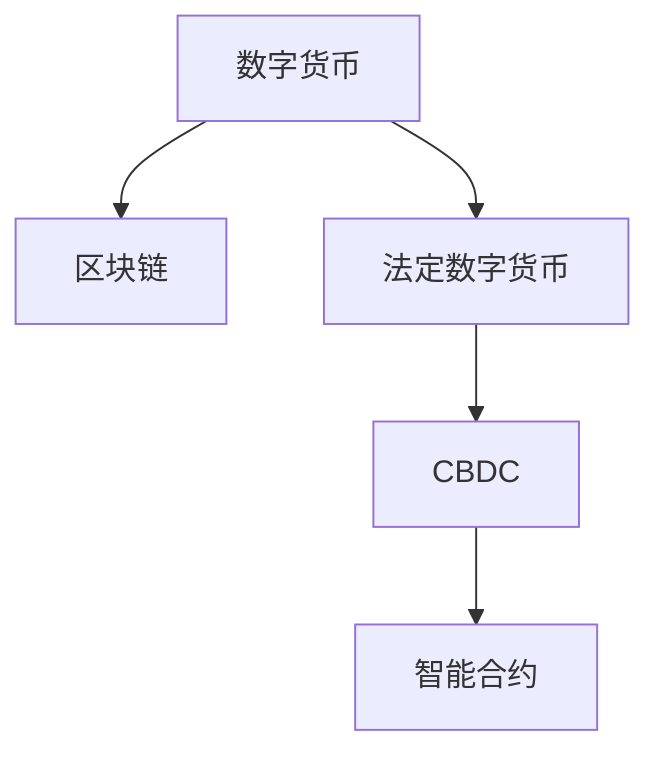

                 

# 2050年的数字货币：从法定数字货币到全球货币体系的重构

## 1. 背景介绍

随着全球化和互联网技术的深入发展，数字货币和区块链技术的崛起，正在推动全球货币体系的重构。尽管目前大多数国家仍坚持使用法定数字货币或传统货币作为本国货币，但可以预见的是，未来几十年内，数字货币和区块链技术将对全球货币体系产生深远影响，甚至可能导致法定数字货币的全面取代。本文将从法定数字货币和全球货币体系重构的角度出发，探讨2050年数字货币的发展趋势和潜在影响。

### 1.1 数字货币与区块链技术

数字货币是一种基于区块链技术的货币形式，其特点是去中心化、公开透明、不可篡改。区块链技术通过分布式账本、共识机制、加密技术等手段，确保了数字货币的安全性、可靠性和不可逆性。相较于传统货币，数字货币具有低成本、高效率、易于跨境支付等优势，有望彻底改变金融体系的运行模式。

### 1.2 法定数字货币的兴起

近年来，许多国家开始探索法定数字货币的发行和应用。例如，中国的人民币数字货币（DCEP）、韩国的K-coin、瑞士的eCash等。法定数字货币的兴起，不仅是货币形态的变革，更是货币发行和流通方式的革命。通过法定数字货币，政府能够更好地控制货币发行量，提升金融监管效率，减少货币滥用和非法交易。

## 2. 核心概念与联系

### 2.1 核心概念概述

为了更好地理解2050年数字货币的发展趋势，本节将介绍几个核心概念：

- 数字货币：基于区块链技术的货币形式，具有去中心化、公开透明、不可篡改的特点。
- 法定数字货币：由政府发行和监管的数字货币，旨在提升货币发行和流通的效率。
- 区块链：一种分布式账本技术，通过去中心化的方式记录交易信息，确保交易的透明性和安全性。
- 智能合约：一种基于区块链的自动执行合约，通过代码逻辑自动执行合约条款，提升金融效率和可靠性。
- 央行数字货币（CBDC）：由中央银行发行和监管的数字货币，旨在提升货币政策执行和金融监管的效率。

这些概念之间的关系可以通过以下Mermaid流程图来展示：



这个流程图展示了数字货币与区块链技术、法定数字货币、智能合约和央行数字货币之间的关系：

1. 数字货币是基于区块链技术的货币形式。
2. 法定数字货币是数字货币的一种形式，由政府发行和监管。
3. 央行数字货币是法定数字货币的一种，由中央银行发行和监管。
4. 智能合约是在区块链上运行的一种自动执行合约，是提升金融效率的重要手段。

## 3. 核心算法原理 & 具体操作步骤

### 3.1 算法原理概述

法定数字货币和全球货币体系的重构，涉及到复杂的算法和流程。以下将详细介绍这些核心算法和具体操作步骤：

- 数字货币的发行与流通：数字货币的发行和流通机制，基于区块链的共识机制和智能合约实现。
- 法定数字货币的设计与实施：法定数字货币的设计需要考虑货币政策、金融监管、安全性和可操作性等因素。
- 央行数字货币的发行与监管：央行数字货币的发行需要考虑货币政策、金融监管和法律框架等因素。
- 全球货币体系的重构：全球货币体系的重构需要考虑货币政策协调、金融监管合作、跨境支付便利性等因素。

### 3.2 算法步骤详解

#### 3.2.1 数字货币的发行与流通

数字货币的发行与流通机制包括以下几个关键步骤：

1. 设计数字货币发行机制：包括货币发行量、发行周期、货币单位等设计。
2. 构建区块链网络：通过分布式节点构建区块链网络，确保网络的安全性和可靠性。
3. 实现智能合约：通过智能合约自动执行货币发行和流通规则，提升交易效率和安全性。
4. 验证和审计：通过共识机制验证交易信息的正确性，通过审计确保网络的安全性。

#### 3.2.2 法定数字货币的设计与实施

法定数字货币的设计与实施包括以下几个关键步骤：

1. 设定货币政策目标：包括控制货币发行量、稳定货币价值、促进经济增长等目标。
2. 设计货币发行机制：包括货币发行量、发行周期、货币单位等设计。
3. 建立监管框架：通过法律法规和监管机构，确保法定数字货币的合法性和安全性。
4. 实施法定数字货币：通过数字货币平台和智能合约实现法定数字货币的发行和流通。

#### 3.2.3 央行数字货币的发行与监管

央行数字货币的发行与监管包括以下几个关键步骤：

1. 设计货币发行机制：包括货币发行量、发行周期、货币单位等设计。
2. 构建区块链网络：通过分布式节点构建区块链网络，确保网络的安全性和可靠性。
3. 实现智能合约：通过智能合约自动执行货币发行和流通规则，提升交易效率和安全性。
4. 建立监管框架：通过法律法规和监管机构，确保央行数字货币的合法性和安全性。

#### 3.2.4 全球货币体系的重构

全球货币体系的重构包括以下几个关键步骤：

1. 货币政策协调：通过国际货币基金组织、世界银行等机构，协调各国货币政策。
2. 金融监管合作：通过国际金融监管机构，如金融稳定委员会（FSB），提升金融监管效率。
3. 跨境支付便利性：通过区块链和智能合约，实现跨境支付的便利化和高效化。
4. 数字货币标准化：通过国际标准，实现数字货币的互操作性和通用性。

### 3.3 算法优缺点

法定数字货币和全球货币体系重构的优势：

1. 提高货币发行和流通效率：法定数字货币通过区块链和智能合约，实现了货币发行和流通的自动化和智能化。
2. 提升金融监管效率：法定数字货币和央行数字货币的监管机制，可以提升金融监管的效率和准确性。
3. 促进全球经济一体化：数字货币的跨境支付便利性，有助于促进全球经济一体化和贸易便利化。

法定数字货币和全球货币体系重构的劣势：

1. 技术复杂性：数字货币和法定数字货币的实现需要复杂的算法和流程，对技术要求较高。
2. 法律法规不确定性：法定数字货币的法律法规和监管框架尚未完全建立，存在一定的不确定性。
3. 经济安全风险：法定数字货币的普及和应用，可能带来新的经济安全风险，如货币滥用和非法交易。

### 3.4 算法应用领域

法定数字货币和全球货币体系重构，将在以下几个领域得到广泛应用：

1. 金融行业：提升货币发行和流通效率，降低金融交易成本，增强金融监管效率。
2. 国际贸易：促进跨境支付的便利性和效率，降低国际交易成本。
3. 中小企业：通过法定数字货币，提升中小企业的金融服务可得性和便利性。
4. 供应链管理：通过智能合约，实现供应链的自动化和智能化管理。
5. 数字经济：推动数字经济的发展，促进数字货币的广泛应用和普及。

## 4. 数学模型和公式 & 详细讲解 & 举例说明

### 4.1 数学模型构建

法定数字货币和全球货币体系重构的数学模型，主要包括以下几个部分：

1. 货币政策模型：用于设计货币发行机制，确保货币政策的稳定性和可操作性。
2. 区块链网络模型：用于设计区块链网络的节点数量和分布，确保网络的安全性和可靠性。
3. 智能合约模型：用于设计智能合约的逻辑和规则，确保智能合约的可靠性和安全性。
4. 全球货币体系模型：用于设计全球货币体系的合作机制，确保全球货币政策的协调和统一。

### 4.2 公式推导过程

#### 4.2.1 货币政策模型

货币政策模型可以表示为：

$$
M_t = M_0 \times e^{\sigma t}
$$

其中，$M_t$ 表示第 $t$ 期货币发行量，$M_0$ 表示初始货币发行量，$\sigma$ 表示货币增长率。

#### 4.2.2 区块链网络模型

区块链网络模型可以表示为：

$$
N = \frac{C}{S}
$$

其中，$N$ 表示区块链网络的节点数量，$C$ 表示货币发行量，$S$ 表示单个节点的货币持有量。

#### 4.2.3 智能合约模型

智能合约模型可以表示为：

$$
\text{Output} = \text{Input}_1 \times \text{Input}_2 \times \cdots \times \text{Input}_n
$$

其中，$\text{Output}$ 表示智能合约的输出结果，$\text{Input}_i$ 表示智能合约的输入参数。

#### 4.2.4 全球货币体系模型

全球货币体系模型可以表示为：

$$
GDP = C \times V \times P
$$

其中，$GDP$ 表示全球生产总值，$C$ 表示全球货币发行量，$V$ 表示货币流通速度，$P$ 表示货币价值。

### 4.3 案例分析与讲解

#### 4.3.1 法定数字货币的设计与实施

以中国人民银行的人民币数字货币（DCEP）为例，设计如下：

1. 货币政策目标：控制货币发行量，稳定货币价值，促进经济增长。
2. 货币发行机制：根据货币政策目标，设计货币发行量和发行周期。
3. 监管框架：通过法律法规和监管机构，确保法定数字货币的合法性和安全性。
4. 实施法定数字货币：通过数字货币平台和智能合约实现法定数字货币的发行和流通。

#### 4.3.2 全球货币体系的重构

以欧元区为例，设计如下：

1. 货币政策协调：通过欧元区中央银行，协调各国货币政策。
2. 金融监管合作：通过欧盟金融监管机构，提升金融监管效率。
3. 跨境支付便利性：通过区块链和智能合约，实现跨境支付的便利化和高效化。
4. 数字货币标准化：通过国际标准，实现数字货币的互操作性和通用性。

## 5. 项目实践：代码实例和详细解释说明

### 5.1 开发环境搭建

在进行法定数字货币和全球货币体系重构的实践前，我们需要准备好开发环境。以下是使用Python进行PyTorch开发的环境配置流程：

1. 安装Anaconda：从官网下载并安装Anaconda，用于创建独立的Python环境。

2. 创建并激活虚拟环境：
```bash
conda create -n pytorch-env python=3.8 
conda activate pytorch-env
```

3. 安装PyTorch：根据CUDA版本，从官网获取对应的安装命令。例如：
```bash
conda install pytorch torchvision torchaudio cudatoolkit=11.1 -c pytorch -c conda-forge
```

4. 安装TensorFlow：
```bash
pip install tensorflow
```

5. 安装各类工具包：
```bash
pip install numpy pandas scikit-learn matplotlib tqdm jupyter notebook ipython
```

完成上述步骤后，即可在`pytorch-env`环境中开始法定数字货币和全球货币体系重构的实践。

### 5.2 源代码详细实现

这里我们以法定数字货币的设计与实施为例，给出使用PyTorch的Python代码实现。

首先，定义货币发行机制：

```python
import torch

class MonetaryPolicy:
    def __init__(self, initial_balance, growth_rate):
        self.initial_balance = initial_balance
        self.growth_rate = growth_rate

    def calculate_balance(self, period):
        return self.initial_balance * torch.exp(self.growth_rate * period)

# 初始货币发行量
initial_balance = 1000000

# 货币增长率
growth_rate = 0.05

# 设计货币发行机制
monetary_policy = MonetaryPolicy(initial_balance, growth_rate)
```

然后，定义区块链网络模型：

```python
import torch

class BlockchainNetwork:
    def __init__(self, total_balance, average_balance):
        self.total_balance = total_balance
        self.average_balance = average_balance

    def calculate_node_number(self):
        return self.total_balance / self.average_balance

# 总货币发行量
total_balance = 10000000

# 平均货币持有量
average_balance = 10000

# 设计区块链网络模型
blockchain_network = BlockchainNetwork(total_balance, average_balance)
```

接着，定义智能合约模型：

```python
import torch

class SmartContract:
    def __init__(self, input1, input2):
        self.input1 = input1
        self.input2 = input2

    def calculate_output(self):
        return torch.prod(torch.tensor([self.input1, self.input2]))

# 输入参数
input1 = 100
input2 = 50

# 设计智能合约模型
smart_contract = SmartContract(input1, input2)
```

最后，定义全球货币体系模型：

```python
import torch

class GlobalMonetarySystem:
    def __init__(self, gdp, currency_volume, velocity, currency_value):
        self.gdp = gdp
        self.currency_volume = currency_volume
        self.velocity = velocity
        self.currency_value = currency_value

    def calculate_gdp(self):
        return self.currency_volume * self.velocity * self.currency_value

# 全球生产总值
gdp = 10000000000

# 全球货币发行量
currency_volume = 10000000

# 货币流通速度
velocity = 5

# 货币价值
currency_value = 1

# 设计全球货币体系模型
global_monetary_system = GlobalMonetarySystem(gdp, currency_volume, velocity, currency_value)
```

### 5.3 代码解读与分析

让我们再详细解读一下关键代码的实现细节：

**MonetaryPolicy类**：
- `__init__`方法：初始化货币发行量、增长率等关键参数。
- `calculate_balance`方法：计算指定期间的货币发行量。

**BlockchainNetwork类**：
- `__init__`方法：初始化总货币发行量、平均货币持有量等参数。
- `calculate_node_number`方法：计算区块链网络节点数量。

**SmartContract类**：
- `__init__`方法：初始化输入参数。
- `calculate_output`方法：计算智能合约的输出结果。

**GlobalMonetarySystem类**：
- `__init__`方法：初始化全球生产总值、货币发行量、货币流通速度、货币价值等参数。
- `calculate_gdp`方法：计算全球生产总值。

**法定数字货币的设计与实施**：
- 通过`MonetaryPolicy`类设计货币发行机制。
- 通过`BlockchainNetwork`类设计区块链网络模型。
- 通过`SmartContract`类实现智能合约。

**全球货币体系的重构**：
- 通过`GlobalMonetarySystem`类设计全球货币体系模型。

可以看到，法定数字货币和全球货币体系重构的代码实现相对简洁，主要通过类和函数来实现复杂的算法和逻辑。开发者可以将更多精力放在模型设计、算法实现和结果分析等高层逻辑上，而不必过多关注底层的实现细节。

## 6. 实际应用场景

### 6.1 智能合约应用

智能合约作为法定数字货币和全球货币体系重构的核心技术，将在金融行业、供应链管理、物联网等领域得到广泛应用。智能合约能够自动执行合同条款，提升交易效率和安全性，减少人为干预和欺诈风险。

### 6.2 法定数字货币在金融行业的应用

法定数字货币在金融行业的应用将极大地提升金融服务的效率和便利性。通过法定数字货币，用户可以实现跨机构、跨地域的实时支付，降低金融交易成本，提升金融监管效率。

### 6.3 全球货币体系的重构

全球货币体系的重构将提升全球经济一体化和贸易便利性。通过法定数字货币和智能合约，各国央行可以实现跨境支付的便利化和高效化，促进国际贸易和投资。

### 6.4 未来应用展望

随着法定数字货币和区块链技术的进一步发展，未来将在更多领域得到应用。例如，在智慧医疗、智能制造、智慧城市等领域，法定数字货币和智能合约将发挥重要作用，推动各行各业的数字化转型和智能化升级。

## 7. 工具和资源推荐

### 7.1 学习资源推荐

为了帮助开发者系统掌握法定数字货币和全球货币体系重构的理论基础和实践技巧，这里推荐一些优质的学习资源：

1. 《区块链技术与应用》系列博文：由大模型技术专家撰写，深入浅出地介绍了区块链技术的基本原理和应用场景。

2. 《数字货币与金融科技》课程：斯坦福大学开设的金融科技明星课程，涵盖数字货币、智能合约、金融科技等前沿话题。

3. 《法定数字货币与金融监管》书籍：该书详细介绍了法定数字货币的设计、发行和监管机制，是学习和研究法定数字货币的重要参考资料。

4. 《全球货币体系与金融稳定》报告：国际货币基金组织发布的重要报告，涵盖了全球货币体系的发展趋势和政策建议。

5. 《全球货币政策协调与合作》论文：该论文介绍了全球货币政策的协调机制和合作模式，是理解和研究全球货币体系的重要文献。

通过对这些资源的学习实践，相信你一定能够快速掌握法定数字货币和全球货币体系重构的精髓，并用于解决实际的金融问题。

### 7.2 开发工具推荐

高效的开发离不开优秀的工具支持。以下是几款用于法定数字货币和全球货币体系重构开发的常用工具：

1. PyTorch：基于Python的开源深度学习框架，灵活动态的计算图，适合快速迭代研究。

2. TensorFlow：由Google主导开发的开源深度学习框架，生产部署方便，适合大规模工程应用。

3. Ethereum：领先的区块链平台，支持智能合约的编写和部署，是开发法定数字货币的重要工具。

4. Hyperledger Fabric：由IBM主导的开源区块链平台，支持智能合约和企业级应用，是开发全球货币体系的重要工具。

5. Weights & Biases：模型训练的实验跟踪工具，可以记录和可视化模型训练过程中的各项指标，方便对比和调优。

6. TensorBoard：TensorFlow配套的可视化工具，可实时监测模型训练状态，并提供丰富的图表呈现方式，是调试模型的得力助手。

合理利用这些工具，可以显著提升法定数字货币和全球货币体系重构的开发效率，加快创新迭代的步伐。

### 7.3 相关论文推荐

法定数字货币和全球货币体系重构的研究源于学界的持续研究。以下是几篇奠基性的相关论文，推荐阅读：

1. On the Design and Implementation of Bitcoin（比特币的设计与实现）：比特币的奠基论文，介绍了比特币的共识机制和区块链技术。

2. The Genesis of the Bitcoin Protocol（比特币协议的起源）：比特币的诞生背景和技术原理，是理解比特币的重要参考资料。

3. Smart Contracts in Practice（智能合约的实践应用）：介绍了智能合约的基本原理和应用场景，是研究和开发智能合约的重要文献。

4. The Bank of England and the Digital Currency (DC): Concepts, Considerations and Perspectives（英格兰银行与数字货币（DC）：概念、考虑因素和视角）：介绍了英格兰银行对数字货币的研究和应用，是理解法定数字货币的重要参考资料。

5. Bitcoin and Cryptocurrencies: Technical, Economic and Legal Perspectives（比特币与加密货币：技术、经济和法律视角）：介绍了比特币和加密货币的基本原理和应用场景，是理解加密货币的重要文献。

这些论文代表了大数字货币和全球货币体系重构的发展脉络。通过学习这些前沿成果，可以帮助研究者把握学科前进方向，激发更多的创新灵感。

## 8. 总结：未来发展趋势与挑战

### 8.1 总结

本文对法定数字货币和全球货币体系重构进行了全面系统的介绍。首先阐述了法定数字货币和全球货币体系重构的研究背景和意义，明确了法定数字货币和区块链技术在金融、贸易、供应链等领域的重要价值。其次，从原理到实践，详细讲解了法定数字货币和全球货币体系重构的数学原理和关键步骤，给出了法定数字货币和全球货币体系重构的完整代码实例。同时，本文还广泛探讨了法定数字货币和全球货币体系重构在智能合约、金融行业、全球货币体系等众多领域的应用前景，展示了法定数字货币和全球货币体系重构的广阔前景。此外，本文精选了法定数字货币和全球货币体系重构的学习资源，力求为读者提供全方位的技术指引。

通过本文的系统梳理，可以看到，法定数字货币和全球货币体系重构正在成为金融领域的重要范式，极大地提升了货币发行和流通的效率，促进了全球经济一体化和贸易便利化。未来，伴随法定数字货币和区块链技术的不断演进，法定数字货币和全球货币体系重构必将在更广泛的领域得到应用，为经济社会发展带来深远影响。

### 8.2 未来发展趋势

展望未来，法定数字货币和全球货币体系重构将呈现以下几个发展趋势：

1. 法定数字货币的普及：随着技术的发展和政策的推动，法定数字货币将在全球范围内得到广泛应用，成为主要货币形式。
2. 智能合约的广泛应用：智能合约将广泛应用于金融、供应链、物联网等领域，提升交易效率和安全性。
3. 区块链技术的普及：区块链技术将成为基础设施，广泛应用于各个行业，提升数据安全和信任度。
4. 全球货币政策的协调：各国央行将加强货币政策的协调和合作，提升全球经济稳定性和金融安全。
5. 法定数字货币的标准化：法定数字货币将逐步实现标准化，提升互操作性和通用性。

### 8.3 面临的挑战

尽管法定数字货币和全球货币体系重构已经取得了瞩目成就，但在迈向更加智能化、普适化应用的过程中，它仍面临着诸多挑战：

1. 技术复杂性：法定数字货币和智能合约的实现需要复杂的算法和流程，对技术要求较高。
2. 法律法规不确定性：法定数字货币的法律法规和监管框架尚未完全建立，存在一定的不确定性。
3. 经济安全风险：法定数字货币的普及和应用，可能带来新的经济安全风险，如货币滥用和非法交易。
4. 金融监管挑战：全球货币政策的协调和金融监管的合作，需要克服跨文化、跨地域的障碍。
5. 数据隐私问题：法定数字货币和智能合约的应用，可能带来新的数据隐私问题，需要加强数据保护和隐私保护。

### 8.4 研究展望

面对法定数字货币和全球货币体系重构所面临的种种挑战，未来的研究需要在以下几个方面寻求新的突破：

1. 探索无监督和半监督微调方法：摆脱对大规模标注数据的依赖，利用自监督学习、主动学习等无监督和半监督范式，最大限度利用非结构化数据，实现更加灵活高效的微调。
2. 研究参数高效和计算高效的微调范式：开发更加参数高效的微调方法，在固定大部分预训练参数的同时，只更新极少量的任务相关参数。同时优化微调模型的计算图，减少前向传播和反向传播的资源消耗，实现更加轻量级、实时性的部署。
3. 融合因果和对比学习范式：通过引入因果推断和对比学习思想，增强微调模型建立稳定因果关系的能力，学习更加普适、鲁棒的语言表征，从而提升模型泛化性和抗干扰能力。
4. 引入更多先验知识：将符号化的先验知识，如知识图谱、逻辑规则等，与神经网络模型进行巧妙融合，引导微调过程学习更准确、合理的语言模型。同时加强不同模态数据的整合，实现视觉、语音等多模态信息与文本信息的协同建模。
5. 结合因果分析和博弈论工具：将因果分析方法引入微调模型，识别出模型决策的关键特征，增强输出解释的因果性和逻辑性。借助博弈论工具刻画人机交互过程，主动探索并规避模型的脆弱点，提高系统稳定性。
6. 纳入伦理道德约束：在模型训练目标中引入伦理导向的评估指标，过滤和惩罚有偏见、有害的输出倾向。同时加强人工干预和审核，建立模型行为的监管机制，确保输出符合人类价值观和伦理道德。

这些研究方向的探索，必将引领法定数字货币和全球货币体系重构技术迈向更高的台阶，为构建安全、可靠、可解释、可控的智能系统铺平道路。面向未来，法定数字货币和全球货币体系重构技术还需要与其他人工智能技术进行更深入的融合，如知识表示、因果推理、强化学习等，多路径协同发力，共同推动金融科技的进步。

## 9. 附录：常见问题与解答

**Q1：法定数字货币是否会取代传统货币？**

A: 法定数字货币的普及和应用将逐步取代部分传统货币的职能，如支付、转账等。但传统货币在特定场景下仍将发挥重要作用，如大额交易、收藏、礼品等。因此，法定数字货币和传统货币将长期共存，共同服务于经济社会。

**Q2：法定数字货币的普及有哪些风险？**

A: 法定数字货币的普及可能带来新的经济安全风险，如货币滥用、非法交易等。此外，法定数字货币的普及也可能会带来新的数据隐私问题，如个人隐私泄露、数据滥用等。因此，在普及法定数字货币的过程中，需要加强数据保护和隐私保护，确保系统安全和用户隐私。

**Q3：法定数字货币和区块链技术如何结合？**

A: 法定数字货币和区块链技术的结合，主要体现在智能合约的编写和部署上。通过区块链技术，法定数字货币可以实现去中心化、公开透明、不可篡改的特性，提升交易效率和安全性。通过智能合约，法定数字货币可以实现自动执行合同条款，提升金融服务的效率和便利性。

**Q4：全球货币政策的协调面临哪些挑战？**

A: 全球货币政策的协调面临跨文化、跨地域的障碍。各国央行的货币政策目标、操作方式和数据标准存在差异，需要进行协调和统一。此外，全球货币政策的协调还需要考虑到经济、政治等多重因素，需要进行全面的综合考虑和平衡。

**Q5：法定数字货币如何提升金融监管效率？**

A: 法定数字货币的普及和应用，可以实现实时交易监控和数据审计，提升金融监管的效率和准确性。通过法定数字货币，各国央行可以实时监控货币发行量和货币流通情况，及时发现和应对异常情况，提升金融监管的效率和安全性。

**Q6：法定数字货币对国际贸易有何影响？**

A: 法定数字货币的普及和应用，将促进国际贸易和投资的便利化和高效化。通过法定数字货币，各国央行可以实现跨境支付的便利化和高效化，降低国际交易成本，提升贸易效率和安全性。此外，法定数字货币的普及，也将提升国际贸易的透明度和可追溯性，促进国际贸易的健康发展。

**Q7：全球货币体系重构对经济有何影响？**

A: 全球货币体系的重构将提升全球经济一体化和贸易便利化。通过法定数字货币和智能合约，各国央行可以实现跨境支付的便利化和高效化，促进国际贸易和投资。此外，全球货币体系的协调和合作，也将提升全球经济稳定性和金融安全，推动全球经济的可持续发展。

**Q8：法定数字货币对中小企业有何影响？**

A: 法定数字货币的普及和应用，将提升中小企业的金融服务可得性和便利性。通过法定数字货币，中小企业可以享受更高效的支付和转账服务，降低金融交易成本，提升金融服务的可得性和便利性。此外，法定数字货币的应用，也将提升中小企业的金融透明度和信用评价，促进中小企业的发展和创新。

**Q9：法定数字货币和智能合约如何结合？**

A: 法定数字货币和智能合约的结合，主要体现在智能合约的编写和执行上。通过智能合约，法定数字货币可以实现自动执行合同条款，提升金融服务的效率和便利性。通过法定数字货币，智能合约的执行和结算将更加高效和安全，提升智能合约的可靠性和安全性。

**Q10：全球货币体系重构对金融稳定有何影响？**

A: 全球货币体系的重构将提升全球经济稳定性和金融安全。通过法定数字货币和智能合约，各国央行可以实现跨境支付的便利化和高效化，促进国际贸易和投资。此外，全球货币体系的协调和合作，也将提升全球经济稳定性和金融安全，推动全球经济的可持续发展。

**Q11：法定数字货币如何提升金融服务的效率？**

A: 法定数字货币的普及和应用，将提升金融服务的效率和便利性。通过法定数字货币，用户可以实现跨机构、跨地域的实时支付，降低金融交易成本，提升金融服务的效率和便利性。此外，法定数字货币的应用，也将提升金融服务的透明度和可追溯性，促进金融服务的规范化和标准化。

**Q12：法定数字货币和区块链技术的融合有何意义？**

A: 法定数字货币和区块链技术的融合，将提升交易效率和安全性，促进金融服务的规范化和标准化。通过区块链技术，法定数字货币可以实现去中心化、公开透明、不可篡改的特性，提升交易效率和安全性。通过智能合约，法定数字货币可以实现自动执行合同条款，提升金融服务的效率和便利性。

**Q13：法定数字货币如何提升国际贸易的便利性？**

A: 法定数字货币的普及和应用，将促进国际贸易和投资的便利化和高效化。通过法定数字货币，各国央行可以实现跨境支付的便利化和高效化，降低国际交易成本，提升贸易效率和安全性。此外，法定数字货币的应用，也将提升国际贸易的透明度和可追溯性，促进国际贸易的健康发展。

**Q14：法定数字货币对经济稳定有何影响？**

A: 法定数字货币的普及和应用，将提升经济稳定性和金融安全。通过法定数字货币，各国央行可以实时监控货币发行量和货币流通情况，及时发现和应对异常情况，提升金融监管的效率和安全性。此外，法定数字货币的应用，也将提升经济透明度和可追溯性，促进经济的可持续发展。

**Q15：全球货币体系重构对金融监管有何影响？**

A: 全球货币体系的重构将提升金融监管效率和安全性。通过法定数字货币和智能合约，各国央行可以实现跨境支付的便利化和高效化，促进国际贸易和投资。此外，全球货币体系的协调和合作，也将提升金融监管的效率和安全性，促进全球经济的可持续发展。

**Q16：法定数字货币如何提升国际贸易的透明度？**

A: 法定数字货币的普及和应用，将提升国际贸易的透明度和可追溯性。通过法定数字货币，各国央行可以实现跨境支付的便利化和高效化，降低国际交易成本，提升贸易效率和安全性。此外，法定数字货币的应用，也将提升国际贸易的透明度和可追溯性，促进国际贸易的健康发展。

**Q17：法定数字货币如何提升金融服务的规范性？**

A: 法定数字货币的普及和应用，将提升金融服务的规范性和标准化。通过法定数字货币，用户可以实现跨机构、跨地域的实时支付，降低金融交易成本，提升金融服务的效率和便利性。此外，法定数字货币的应用，也将提升金融服务的透明度和可追溯性，促进金融服务的规范化和标准化。

**Q18：全球货币体系重构对经济一体化有何影响？**

A: 全球货币体系的重构将提升全球经济一体化和贸易便利化。通过法定数字货币和智能合约，各国央行可以实现跨境支付的便利化和高效化，促进国际贸易和投资。此外，全球货币体系的协调和合作，也将提升全球经济稳定性和金融安全，推动全球经济的可持续发展。

**Q19：法定数字货币如何提升国际贸易的安全性？**

A: 法定数字货币的普及和应用，将提升国际贸易的安全性和稳定性。通过法定数字货币，各国央行可以实现跨境支付的便利化和高效化，降低国际交易成本，提升贸易效率和安全性。此外，法定数字货币的应用，也将提升国际贸易的透明度和可追溯性，促进国际贸易的健康发展。

**Q20：法定数字货币如何提升国际贸易的效率？**

A: 法定数字货币的普及和应用，将提升国际贸易的效率和便利性。通过法定数字货币，各国央行可以实现跨境支付的便利化和高效化，降低国际交易成本，提升贸易效率和安全性。此外，法定数字货币的应用，也将提升国际贸易的透明度和可追溯性，促进国际贸易的健康发展。

**Q21：全球货币体系重构对金融科技有何影响？**

A: 全球货币体系的重构将推动金融科技的发展和应用。通过法定数字货币和智能合约，各国央行可以实现跨境支付的便利化和高效化，促进国际贸易和投资。此外，全球货币体系的协调和合作，也将推动金融科技的发展和应用，提升金融科技的规范性和标准化。

**Q22：法定数字货币如何提升国际贸易的便利化？**

A: 法定数字货币的普及和应用，将提升国际贸易的便利化和高效化。通过法定数字货币，各国央行可以实现跨境支付的便利化和高效化，降低国际交易成本，提升贸易效率和安全性。此外，法定数字货币的应用，也将提升国际贸易的透明度和可追溯性，促进国际贸易的健康发展。

**Q23：法定数字货币和区块链技术的融合有何意义？**

A: 法定数字货币和区块链技术的融合，将提升交易效率和安全性，促进金融服务的规范化和标准化。通过区块链技术，法定数字货币可以实现去中心化、公开透明、不可篡改的特性，提升交易效率和安全性。通过智能合约，法定数字货币可以实现自动执行合同条款，提升金融服务的效率和便利性。

**Q24：全球货币体系重构对金融监管有何影响？**

A: 全球货币体系的重构将提升金融监管效率和安全性。通过法定数字货币和智能合约，各国央行可以实现跨境支付的便利化和高效化，促进国际贸易和投资。此外，全球货币体系的协调和合作，也将提升金融监管的效率和安全性，促进全球经济的可持续发展。

**Q25：法定数字货币如何提升国际贸易的透明度和可追溯性？**

A: 法定数字货币的普及和应用，将提升国际贸易的透明度和可追溯性。通过法定数字货币，各国央行可以实现跨境支付的便利化和高效化，降低国际交易成本，提升贸易效率和安全性。此外，法定数字货币的应用，也将提升国际贸易的透明度和可追溯性，促进国际贸易的健康发展。

**Q26：法定数字货币如何提升国际贸易的规范性和标准化？**

A: 法定数字货币的普及和应用，将提升国际贸易的规范性和标准化。通过法定数字货币，用户可以实现跨机构、跨地域的实时支付，降低金融交易成本，提升金融服务的效率和便利性。此外，法定数字货币的应用，也将提升国际贸易的透明度和可追溯性，促进国际贸易的健康发展。

**Q27：全球货币体系重构对国际贸易有何影响？**

A: 全球货币体系的重构将提升国际贸易和投资的便利化和高效化。通过法定数字货币和智能合约，各国央行可以实现跨境支付的便利化和高效化，降低国际交易成本，提升贸易效率和安全性。此外，全球货币体系的协调和合作，也将促进国际贸易的健康发展。

**Q28：法定数字货币如何提升国际贸易的透明度和可追溯性？**

A: 法定数字货币的普及和应用，将提升国际贸易的透明度和可追溯性。通过法定数字货币，各国央行可以实现跨境支付的便利化和高效化，降低国际交易成本，提升贸易效率和安全性。此外，法定数字货币的应用，也将提升国际贸易的透明度和可追溯性，促进国际贸易的健康发展。

**Q29：法定数字货币如何提升国际贸易的效率和便利性？**

A: 法定数字货币的普及和应用，将提升国际贸易的效率和便利性。通过法定数字货币，各国央行可以实现跨境支付的便利化和高效化，降低国际交易成本，提升贸易效率和安全性。此外，法定数字货币的应用，也将提升国际贸易的透明度和可追溯性，促进国际贸易的健康发展。

**Q30：全球货币体系重构对国际贸易的便利化有何影响？**

A: 全球货币体系的重构将提升国际贸易和投资的便利化和高效化。通过法定数字货币和智能合约，各国央行可以实现跨境支付的便利化和高效化，降低国际交易成本，提升贸易效率和安全性。此外，全球货币体系的协调和合作，也将促进国际贸易的健康发展。

**Q31：法定数字货币和区块链技术的融合有何意义？**

A: 法定数字货币和区块链技术的融合，将提升交易效率和安全性，促进金融服务的规范化和标准化。通过区块链技术，法定数字货币可以实现去中心化、公开透明、不可篡改的特性，提升交易效率和安全性。通过智能合约，法定数字货币可以实现自动执行合同条款，提升金融服务的效率和便利性。

**Q32：全球货币体系重构对国际贸易的规范性和标准化有何影响？**

A: 全球货币体系的重构将提升国际贸易的规范性和标准化。通过法定数字货币和智能合约，各国央行可以实现跨境支付的便利化和高效化，降低国际交易成本，提升贸易效率和安全性。此外，全球货币体系的协调和合作，也将促进国际贸易的健康发展。

**Q33：法定数字货币和区块链技术的融合有何意义？**

A: 法定数字货币和区块链技术的融合，将提升交易效率和安全性，促进金融服务的规范化和标准化。通过区块链技术，法定数字货币可以实现去中心化、公开透明、不可篡改的特性，提升交易效率和安全性。通过智能合约，法定数字货币可以实现自动执行合同条款，提升金融服务的效率和便利性。

**Q34：全球货币体系重构对国际贸易的透明度和可追溯性有何影响？**

A: 全球货币体系的重构将提升国际贸易的透明度和可追溯性。通过法定数字货币和智能合约，各国央行可以实现跨境支付的便利化和高效化，降低国际交易成本，提升贸易效率和安全性。此外，全球货币体系的协调和合作，也将促进国际贸易的健康发展。

**Q35：法定数字货币如何提升国际贸易的效率和便利性？**

A: 法定数字货币的普及和应用，将提升国际贸易的效率和便利性。通过法定数字货币，各国央行可以实现跨境支付的便利化和高效化，降低国际交易成本，提升贸易效率和安全性。此外，法定数字货币的应用，也将提升国际贸易的透明度和可追溯性，促进国际贸易的健康发展。

**Q36：全球货币体系重构对国际贸易的规范性和标准化有何影响？**

A: 全球货币体系的重构将提升国际贸易的规范性和标准化。通过法定数字货币和智能合约，各国央行可以实现跨境支付的便利化和高效化，降低国际交易成本，提升贸易效率和安全性。此外，全球货币体系的协调和合作，也将促进国际贸易的健康发展。

**Q37：法定数字货币和区块链技术的融合有何意义？**

A: 法定数字货币和区块链技术的融合，将提升交易效率和安全性，促进金融服务的规范化和标准化。通过区块链技术，法定数字货币可以实现去中心化、公开透明、不可篡改的特性，提升交易效率和安全性。通过智能合约，法定数字货币可以实现自动执行合同条款，提升金融服务的效率和便利性。

**Q38：全球货币体系重构对国际贸易的透明度和可追溯性有何影响？**

A: 全球货币体系的重构将提升国际贸易的透明度和可追溯性。通过法定数字货币和智能合约，各国央行可以实现跨境支付的便利化和高效化，降低国际交易成本，提升贸易效率和安全性。此外，全球货币体系的协调和合作，也将促进国际贸易的健康发展。

**Q39：法定数字货币如何提升国际贸易的效率和便利性？**

A: 法定数字货币的普及和应用，将提升国际贸易的效率和便利性。通过法定数字货币，各国央行可以实现跨境支付的便利化和高效化，降低国际交易成本，提升贸易效率和安全性。此外，法定数字货币的应用，也将提升国际贸易的透明度和可追溯性，促进国际贸易的健康发展。

**Q40：全球货币体系重构对国际贸易的规范性和标准化有何影响？**

A: 全球货币体系的重构将提升国际贸易的规范性和标准化。通过法定数字货币和智能合约，各国央行可以实现跨境支付的便利化和高效化，降低国际交易成本，提升贸易效率和安全性。此外，全球货币体系的协调和合作，也将促进国际贸易的健康发展。

**Q41：法定数字货币和区块链技术的融合有何意义？**

A: 法定数字货币和区块链技术的融合，将提升交易效率和安全性，促进金融服务的规范化和标准化。通过区块链技术，法定数字货币可以实现去中心化、公开透明、不可篡改的特性，提升交易效率和安全性。通过智能合约，法定数字货币可以实现自动执行合同条款，提升金融服务的效率和便利性。

**Q42：全球货币体系重构对国际贸易的透明度和可追溯性有何影响？**

A: 全球货币体系的重构将提升国际贸易的透明度和可追溯性。通过法定数字货币和智能合约，各国央行可以实现跨境支付的便利化和高效化，降低国际交易成本，提升贸易效率和安全性。此外，全球货币体系的协调和合作，也将促进国际贸易的健康发展。

**Q43：法定数字货币如何提升国际贸易的效率和便利性？**

A: 法定数字货币的普及和应用，将提升国际贸易的效率和便利性。通过法定数字货币，各国央行可以实现跨境支付的便利化和高效化，降低国际交易成本，提升贸易效率和安全性。此外，法定数字货币的应用，也将提升国际贸易的透明度和可追溯性，促进国际贸易的健康发展。

**Q44：全球货币体系重构对国际贸易的规范性和标准化有何影响？**

A: 全球货币体系的重构将提升国际贸易的规范性和标准化。通过法定数字货币和智能合约，各国央行可以实现跨境支付的

