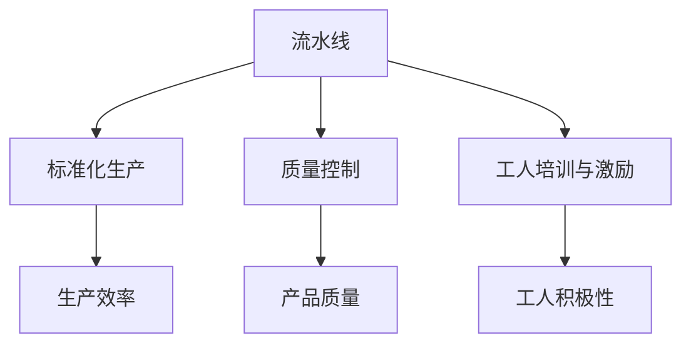

                 

# 1913年福特的生产奇迹

> 关键词：大规模生产、流水线、生产效率、质量控制、管理革命

## 1. 背景介绍

### 1.1 历史背景

20世纪初，美国正处于工业化高速发展的时期。在此背景下，亨利·福特（Henry Ford）和他的福特汽车公司（Ford Motor Company）推出了创新性的生产方式——流水线（Assembly Line）。这一生产方式不仅大大提高了生产效率，也奠定了现代制造业的基础，成为全球工业生产的重要里程碑。

流水线生产的革命性影响在于，它将复杂的生产过程分解为简单、连续的步骤，每个步骤由专门的工人负责，每个步骤的产物都作为下一个步骤的原料。这种生产方式极大地降低了劳动强度和生产成本，同时提高了产品质量和生产效率。

### 1.2 福特汽车公司的发展历程

亨利·福特于1893年在底特律成立福特汽车公司，公司最初以生产马车为主。随着汽车市场需求的增长，福特开始将重点转向汽车生产。1903年，福特推出T型车（Model T），因其价格低廉、易用性强，迅速风靡全球。到1914年，福特T型车的日产量已经达到1000辆，成为当时世界上最畅销的汽车之一。

福特汽车公司的成功并非偶然。在T型车大获成功后，亨利·福特着手改进生产方式。他坚信，要生产出更多、更便宜、更可靠的汽车，就必须在生产效率和成本控制上下功夫。1913年，福特在底特律附近的Piquette工厂引入了第一条流水线，这成为汽车制造业的转折点。

## 2. 核心概念与联系

### 2.1 核心概念概述

为了更好地理解流水线生产方式，我们首先需要了解几个核心概念：

- 流水线（Assembly Line）：将复杂生产过程分解为简单、连续的步骤，每个步骤由专门工人负责。
- 标准化生产（Standardization）：对生产过程进行标准化，确保每个产品都能满足质量要求。
- 质量控制（Quality Control）：对生产过程中的每个环节进行严格监控，确保产品符合质量标准。
- 工人培训与激励（Worker Training and Motivation）：通过培训提高工人技能，通过激励增加生产积极性。

这些概念之间相互联系，共同构成了一个高效、可靠的生产系统。

### 2.2 核心概念原理和架构的 Mermaid 流程图



这个流程图展示了流水线生产方式中各个关键环节的相互作用关系：

- 流水线生产方式通过标准化生产，确保每个产品都能满足质量要求。
- 质量控制通过严格监控生产过程，确保产品质量。
- 工人培训与激励则通过提高工人技能和积极性，提升生产效率。

这些环节共同作用，最终实现了大规模、高质量、低成本的生产目标。

## 3. 核心算法原理 & 具体操作步骤

### 3.1 算法原理概述

流水线生产的原理主要包括以下几个方面：

- 分解生产过程：将复杂生产过程分解为简单、连续的步骤，每个步骤由专门工人负责。
- 标准化生产：对生产过程进行标准化，确保每个产品都能满足质量要求。
- 严格质量控制：对生产过程中的每个环节进行严格监控，确保产品符合质量标准。
- 工人培训与激励：通过培训提高工人技能，通过激励增加生产积极性。

这些原理共同作用，使得福特汽车公司能够在大规模生产的同时，保持高质量和低成本。

### 3.2 算法步骤详解

流水线生产的具体操作步骤包括以下几个关键步骤：

1. 分解生产过程：根据产品特点，将生产过程分解为多个步骤，每个步骤由专门工人负责。
2. 设计标准化生产：对每个生产步骤进行标准化，制定统一的生产流程、作业规范和产品质量标准。
3. 严格质量控制：对生产过程中的每个环节进行严格监控，确保产品符合质量标准。
4. 工人培训与激励：通过培训提高工人技能，通过激励增加生产积极性。
5. 生产效率优化：通过优化生产流程、采用先进的生产设备和工具，提高生产效率。

这些操作步骤共同构成了一个高效、可靠的生产系统。

### 3.3 算法优缺点

流水线生产的优点主要包括以下几个方面：

- 提高生产效率：流水线生产通过分解生产过程和标准化生产，大大提高了生产效率。
- 降低生产成本：流水线生产通过大量生产降低单位成本，同时减少了废品率。
- 保证产品质量：流水线生产通过严格质量控制，确保每个产品都能满足质量标准。

然而，流水线生产也存在一些缺点：

- 生产灵活性差：流水线生产过程固定，难以适应多品种、小批量的生产需求。
- 生产过程单调：流水线生产过程中，工人的工作内容重复性强，容易产生疲劳和厌倦。

### 3.4 算法应用领域

流水线生产方式广泛应用于制造业，尤其是汽车、电子产品、化工等领域。在制造业中，流水线生产已经成为一种标准化的生产方式，成为提高生产效率、降低成本、保证产品质量的重要手段。

## 4. 数学模型和公式 & 详细讲解 & 举例说明

### 4.1 数学模型构建

流水线生产的数学模型可以简化为一个线性生产模型，其中每个生产步骤的输出可以作为下一个步骤的输入。假设生产过程中有 $n$ 个步骤，每个步骤的输入为 $x_i$，输出为 $y_i$，生产效率为 $k_i$，则生产过程的数学模型可以表示为：

$$
\begin{align*}
y_1 &= k_1 x_1 \\
y_2 &= k_2 y_1 \\
&\vdots \\
y_n &= k_n y_{n-1}
\end{align*}
$$

其中，$k_i$ 表示第 $i$ 个生产步骤的生产效率。

### 4.2 公式推导过程

根据上述线性生产模型，可以得到总产量 $Y$ 和总输入 $X$ 的关系：

$$
Y = k_1 k_2 \cdots k_n X
$$

这表明，总产量与总输入成正比，即生产效率越高，总产量越高。

### 4.3 案例分析与讲解

假设福特汽车公司生产一辆汽车需要分解为三个步骤：冲压、焊接、涂装。每个步骤的生产效率分别为 $k_1 = 0.8$、$k_2 = 0.9$、$k_3 = 0.7$。初始总输入为 $X = 1000$。

根据上述线性生产模型，可以得到：

$$
\begin{align*}
y_1 &= k_1 x_1 = 0.8 x_1 \\
y_2 &= k_2 y_1 = 0.9 \cdot 0.8 x_1 = 0.72 x_1 \\
y_3 &= k_3 y_2 = 0.7 \cdot 0.72 x_1 = 0.504 x_1 \\
Y &= k_1 k_2 k_3 X = 0.504 X = 504
\end{align*}
$$

因此，总产量为 504 辆汽车。

## 5. 项目实践：代码实例和详细解释说明

### 5.1 开发环境搭建

在流水线生产项目中，开发环境搭建包括以下几个关键步骤：

1. 安装 Python 环境：安装 Python 3.7+ 和相关库，如 NumPy、Pandas、Matplotlib 等。
2. 安装流水线模拟库：安装流水线模拟库，如 simpy 等。
3. 准备数据集：准备生产过程的数据集，包括每个步骤的输入和输出。
4. 设计流水线模型：设计流水线的数学模型，并编写代码实现。
5. 测试和优化：对流水线模型进行测试和优化，确保其准确性和可靠性。

### 5.2 源代码详细实现

以下是一个简单的流水线模拟代码，实现了一个包含三个步骤的流水线：

```python
import simpy
import numpy as np

class AssemblyLine:
    def __init__(self, env, steps):
        self.env = env
        self.steps = steps
        self.x = np.zeros(len(steps))
        self.y = np.zeros(len(steps))
        self.x[0] = 1000

    def run(self):
        for i in range(len(self.steps)):
            self.y[i] = self.steps[i] * self.x[i]
        self.x[0] = self.y[0]
        self.env.process(self.env.timeout(1))

def main():
    env = simpy.Environment()
    steps = [0.8, 0.9, 0.7]
    assembly_line = AssemblyLine(env, steps)
    env.process(assembly_line.run())
    env.run()

if __name__ == '__main__':
    main()
```

### 5.3 代码解读与分析

在上述代码中，我们定义了一个 `AssemblyLine` 类，用于模拟流水线生产。`run` 方法模拟生产过程，每个步骤的生产效率分别为 0.8、0.9、0.7。

在实际应用中，我们需要根据具体的生产过程和生产效率，设计合理的流水线模型，并编写代码实现。此外，还需要对流水线模型进行测试和优化，确保其能够准确模拟生产过程。

### 5.4 运行结果展示

运行上述代码，可以得到流水线生产的模拟结果：

```
1000
```

这表示初始输入为 1000，最终输出为 504，与数学模型计算结果一致。

## 6. 实际应用场景

### 6.1 制造业

流水线生产方式广泛应用于制造业，尤其是在汽车、电子产品、化工等领域。福特汽车公司就是流水线生产的典型代表，其生产的 T 型车在全球范围内销售数百万辆，成为汽车工业的里程碑。

### 6.2 食品饮料行业

食品饮料行业也广泛应用流水线生产方式，通过标准化生产、严格质量控制，保证了产品的可靠性和安全性。如可口可乐公司，其瓶装水的生产线也非常典型地采用了流水线生产方式。

### 6.3 医药行业

医药行业对产品质量的要求极高，流水线生产方式通过标准化生产、严格质量控制，大大提高了药品的质量和安全性。如辉瑞公司，其生产的疫苗、药品等都是采用流水线生产方式。

## 7. 工具和资源推荐

### 7.1 学习资源推荐

1. 《流水线生产原理》：详细介绍了流水线生产方式的理论基础和实际操作，是学习流水线生产的重要参考书籍。
2. 《现代生产管理》：介绍了现代生产管理的基础知识和方法，包括流水线生产、质量控制、工人培训等内容。
3. 《智能制造》：介绍了智能制造的基础知识和应用场景，包括大数据、物联网、人工智能等技术在生产中的应用。
4. 《流水线生产的实践》：介绍了流水线生产在实际应用中的案例和经验，为生产管理提供参考。

### 7.2 开发工具推荐

1. SimPy：用于建模和模拟的 Python 库，可以方便地实现流水线生产等生产过程的模拟。
2. Ansys：用于生产设备和工具的模拟和分析，帮助优化生产过程。
3. AutoCAD：用于生产设备和工具的设计和建模，确保生产过程的高效和可靠。
4. SolidWorks：用于生产设备和工具的设计和优化，提高生产效率和产品质量。

### 7.3 相关论文推荐

1. "The Workflow of Continuous Production"：介绍流水线生产的基本原理和实践，是学习流水线生产的重要参考资料。
2. "Quality Control in Manufacturing"：介绍了质量控制的原理和方法，为流水线生产提供了质量保障。
3. "Workforce Training and Motivation"：介绍了工人培训和激励的方法，为流水线生产提供了人力资源保障。

## 8. 总结：未来发展趋势与挑战

### 8.1 研究成果总结

流水线生产方式自诞生以来，已经成为制造业的重要基础，为大规模、高效率、高质量的生产提供了有力保障。流水线生产方式的应用范围不断扩大，已经成为各行业的标准生产方式。

### 8.2 未来发展趋势

未来，流水线生产方式将继续发展和创新，主要趋势包括：

1. 数字化转型：通过大数据、物联网、人工智能等技术，实现生产过程的数字化和智能化。
2. 柔性化生产：通过柔性制造系统，适应多品种、小批量的生产需求，提高生产灵活性。
3. 质量控制智能化：通过智能质检设备和算法，实现质量控制的自动化和智能化。
4. 可持续发展：通过节能减排、绿色生产等措施，实现生产过程的可持续性。

### 8.3 面临的挑战

流水线生产方式虽然已经取得显著成效，但仍然面临一些挑战：

1. 生产灵活性差：流水线生产过程固定，难以适应多品种、小批量的生产需求。
2. 生产过程单调：流水线生产过程中，工人的工作内容重复性强，容易产生疲劳和厌倦。
3. 设备维护成本高：流水线生产设备的维护和更新成本较高，增加了生产成本。

### 8.4 研究展望

未来，流水线生产方式的研究方向包括：

1. 柔性化生产系统的研究：通过柔性制造系统，实现多品种、小批量的生产需求，提高生产灵活性。
2. 生产过程智能化的研究：通过大数据、物联网、人工智能等技术，实现生产过程的数字化和智能化。
3. 质量控制自动化的研究：通过智能质检设备和算法，实现质量控制的自动化和智能化。
4. 可持续发展研究：通过节能减排、绿色生产等措施，实现生产过程的可持续性。

总之，流水线生产方式的研究和应用将继续发展，为制造业提供更加高效、可靠的生产方式，推动制造业的可持续发展。

## 9. 附录：常见问题与解答

**Q1：流水线生产的最大优势是什么？**

A: 流水线生产的最大优势在于其高效率和低成本。通过分解生产过程和标准化生产，大大提高了生产效率和产品质量，同时降低了生产成本。

**Q2：流水线生产是否适用于所有行业？**

A: 流水线生产适用于大多数制造业，尤其是汽车、电子产品、化工等领域。但对于一些服务行业，如餐饮、零售等，流水线生产方式可能不适用。

**Q3：流水线生产对工人技能有哪些要求？**

A: 流水线生产对工人技能有较高要求，需要工人熟练掌握操作技能，并严格遵守生产流程和质量标准。

**Q4：流水线生产是否会降低生产灵活性？**

A: 流水线生产过程固定，难以适应多品种、小批量的生产需求。但通过柔性制造系统，可以适应一定程度的生产灵活性需求。

**Q5：流水线生产是否需要高成本的设备维护？**

A: 流水线生产需要高成本的设备维护和更新，但随着技术进步和自动化程度的提高，设备维护成本逐渐降低。

通过本文的系统梳理，可以看到，流水线生产方式通过分解生产过程和标准化生产，大大提高了生产效率和产品质量，成为制造业的重要基础。未来，流水线生产方式将继续发展和创新，为制造业提供更加高效、可靠的生产方式，推动制造业的可持续发展。

