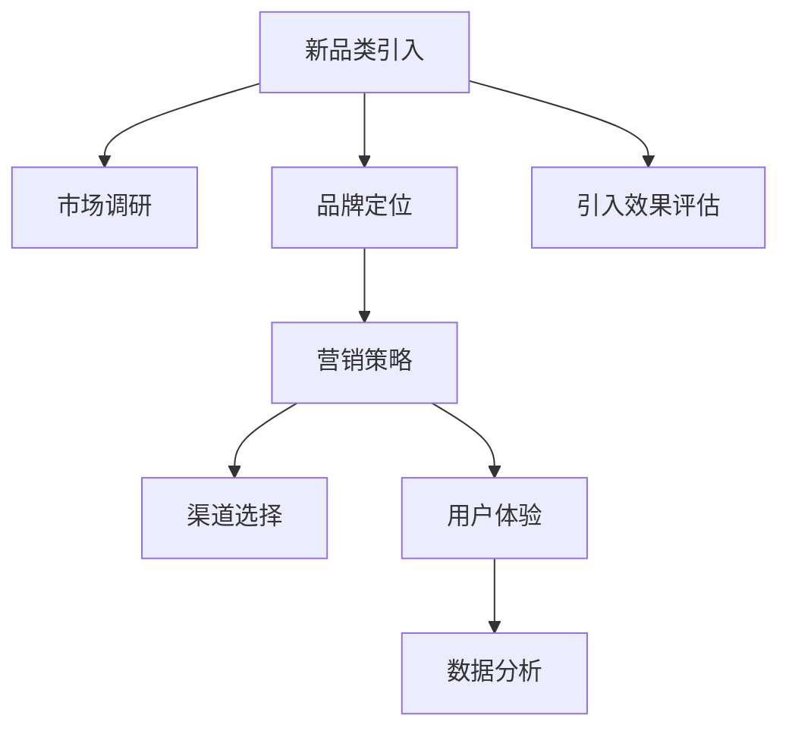

                 

## 1. 背景介绍

### 1.1 问题由来
在全球化竞争日益激烈的今天，企业面临着前所未有的挑战。如何成功地引入新品类和新品牌，成为企业发展的关键。新品牌成功与否，不仅影响企业市场占有率，更关系到企业品牌价值和市场地位。因此，引入新品类和新品牌策略显得尤为重要。

### 1.2 问题核心关键点
引入新品类和新品牌需要考虑诸多因素，包括市场调研、品牌定位、营销策略、渠道选择、用户体验、数据分析等。正确地运用这些策略，可以帮助企业快速、高效地完成新品牌引入，进而实现品牌扩展和市场份额的提升。

### 1.3 问题研究意义
研究引入新品类和新品牌的策略，对于企业制定科学合理的品牌引入方案具有重要意义。正确的策略可以使企业在激烈的市场竞争中脱颖而出，实现长期稳定发展。

## 2. 核心概念与联系

### 2.1 核心概念概述

为了更好地理解引入新品类和新品牌的策略，本节将介绍几个核心概念：

- **新品类(新品牌)引入**：指企业将新产品或新品牌引入市场的过程。这一过程涉及到产品设计、市场调研、品牌定位、营销策略、渠道建设等多个环节。
- **市场调研**：指通过调查分析，了解市场环境、消费者需求和竞争对手情况，以指导新品类和新品牌的引入。
- **品牌定位**：指明确企业及其产品的价值主张，设定目标市场和消费者群体，以及品牌形象和差异化竞争策略。
- **营销策略**：包括产品定价、广告宣传、销售渠道、促销活动等，旨在提升品牌知名度和市场占有率。
- **渠道选择**：涉及线上与线下、直销与分销、自建与合作等渠道，需要综合考虑成本、覆盖面和用户体验。
- **用户体验**：指产品或服务的实际使用体验，包括设计、功能、性能、售后服务等，是品牌成功的重要因素。
- **数据分析**：通过收集和分析市场数据、消费者反馈和营销效果等数据，持续优化引入策略，提升品牌价值。

这些核心概念之间的逻辑关系可以通过以下Mermaid流程图来展示：



这个流程图展示了他引入新品类和新品牌的关键流程：

1. 首先，进行市场调研，了解市场环境及消费者需求。
2. 根据调研结果，确定品牌定位，制定合适的品牌策略。
3. 结合品牌策略，制定营销策略。
4. 选择适合的产品渠道进行销售。
5. 提升用户体验，确保产品服务质量。
6. 通过数据分析持续优化引入策略。
7. 最后，对引入效果进行评估，调整策略。

## 3. 核心算法原理 & 具体操作步骤
### 3.1 算法原理概述

引入新品类和新品牌的核心算法原理在于科学的市场调研和数据分析。通过量化分析和模拟计算，可以预测新品牌引入的市场反应和效果，从而指导引入策略的制定和调整。

### 3.2 算法步骤详解

引入新品类和新品牌的算法步骤主要包括：

**Step 1: 市场调研**
- 收集相关市场数据，包括竞争对手情况、市场份额、消费者需求等。
- 使用问卷调查、焦点小组讨论等方式收集消费者反馈。
- 利用数据挖掘和机器学习技术，从海量数据中提取有价值的信息。

**Step 2: 品牌定位**
- 根据市场调研结果，确定目标市场和消费者群体。
- 制定品牌形象和差异化竞争策略。
- 设计品牌名称、标志、口号等核心元素。

**Step 3: 制定营销策略**
- 根据品牌定位，设定合适的产品定价策略。
- 制定广告宣传方案，包括线上线下媒体投放、社交媒体营销等。
- 选择合适的销售渠道，制定促销活动策略。

**Step 4: 渠道选择**
- 评估不同渠道的优势和劣势，选择合适的销售渠道。
- 设计销售流程和售后服务策略，确保用户体验。
- 建立与合作伙伴的关系，构建共赢的合作机制。

**Step 5: 提升用户体验**
- 通过用户反馈和数据分析，持续优化产品设计和功能。
- 提供优质的售后服务，提升用户满意度。
- 收集用户行为数据，进行个性化推荐和优化。

**Step 6: 数据分析**
- 收集市场数据和消费者反馈，进行综合分析。
- 使用统计方法和机器学习模型，预测市场反应和用户行为。
- 根据分析结果，优化引入策略和调整营销方案。

**Step 7: 引入效果评估**
- 对引入效果进行评估，包括市场份额、品牌知名度、消费者满意度等指标。
- 对比预期目标和实际效果，总结经验教训。
- 根据评估结果，调整引入策略，优化后续引入方案。

### 3.3 算法优缺点

引入新品类和新品牌的算法具有以下优点：

1. 科学决策：通过市场调研和数据分析，能够科学地制定引入策略，减少决策风险。
2. 全面覆盖：从市场调研到数据分析，全流程覆盖，确保各个环节的合理性和有效性。
3. 持续优化：通过数据分析持续优化引入策略，不断提升品牌价值。

同时，该算法也存在一些局限性：

1. 数据质量依赖：算法效果取决于市场调研和数据收集的质量。数据偏差可能导致错误决策。
2. 市场变化快：市场环境和消费者需求变化快速，算法难以实时捕捉最新动态。
3. 计算成本高：大规模数据收集和处理需要大量计算资源，存在较高成本。
4. 用户行为复杂：消费者行为多样，难以通过数据分析完全理解其需求和偏好。

尽管存在这些局限性，但通过不断优化数据采集和处理方式，改进数据分析模型，引入新品类和新品牌的算法仍将是企业在市场竞争中的重要工具。

### 3.4 算法应用领域

引入新品类和新品牌的算法已经在多个领域得到应用，例如：

- 电子商务：通过市场调研和数据分析，指导新商品的上线和营销策略的制定。
- 餐饮行业：对新菜品的引入和品牌推广进行全面分析，提升品牌知名度和市场占有率。
- 旅游行业：制定新的旅游线路和品牌定位，吸引更多消费者。
- 移动应用：进行新应用的功能设计和市场推广策略的优化。
- 金融服务：通过数据分析，推广新金融产品和服务。

## 4. 数学模型和公式 & 详细讲解 & 举例说明

### 4.1 数学模型构建

引入新品类和新品牌的数学模型可以通过回归分析、聚类分析和预测模型等构建。

假设市场调研结果包括多个变量，如市场份额、消费者需求、竞争对手等，定义输入向量 $X=\{x_1, x_2, ..., x_n\}$，其中 $x_i$ 表示第 $i$ 个变量。定义输出向量 $Y=\{y_1, y_2, ..., y_m\}$，其中 $y_i$ 表示第 $i$ 个因变量，即新品类和新品牌引入的效果。

引入新品类和新品牌的回归模型为：

$$
Y = \beta_0 + \beta_1x_1 + \beta_2x_2 + ... + \beta_nx_n + \epsilon
$$

其中 $\beta_0$ 为截距项，$\beta_i$ 为回归系数，$\epsilon$ 为随机误差项。

### 4.2 公式推导过程

假设我们已经收集到 $N$ 个市场调研样本数据，每个样本 $i$ 包含 $n$ 个特征 $x_{ij}$ 和 $m$ 个因变量 $y_{ik}$。构建回归模型，使用最小二乘法求解 $\beta_i$，使得模型的预测值与实际值之间的误差平方和最小。

最小二乘法的目标函数为：

$$
J(\beta) = \frac{1}{N} \sum_{i=1}^N \sum_{k=1}^m (y_{ik} - \beta_0 - \sum_{j=1}^n \beta_j x_{ij})^2
$$

对 $\beta_i$ 求偏导数并令其为0，得到：

$$
\frac{\partial J(\beta)}{\partial \beta_i} = -2\sum_{i=1}^N \sum_{k=1}^m (y_{ik} - \beta_0 - \sum_{j=1}^n \beta_j x_{ij}) x_{ij} = 0
$$

化简后得到：

$$
\beta_i = \frac{\sum_{i=1}^N \sum_{k=1}^m y_{ik} x_{ij}}{\sum_{i=1}^N \sum_{j=1}^n x_{ij}^2}
$$

### 4.3 案例分析与讲解

假设我们有一家电商企业，想要引入一款新产品。企业进行了市场调研，收集了市场份额、消费者需求、竞争对手等数据。根据调研结果，制定了品牌定位和营销策略。

- 市场份额：20%
- 消费者需求：50%
- 竞争对手：10%
- 广告投入：30%

我们希望根据这些数据，预测引入新产品的市场效果。假设影响新产品市场效果的变量有四个，分别记为 $x_1$、$x_2$、$x_3$ 和 $x_4$，则引入新产品的数学模型为：

$$
y = \beta_0 + \beta_1x_1 + \beta_2x_2 + \beta_3x_3 + \beta_4x_4 + \epsilon
$$

已知样本数据如下：

$$
\begin{align*}
x_{11} &= 0.2 \\
x_{12} &= 0.5 \\
x_{13} &= 0.1 \\
x_{14} &= 0.3 \\
y_1 &= 0.8 \\
x_{21} &= 0.3 \\
x_{22} &= 0.4 \\
x_{23} &= 0.2 \\
x_{24} &= 0.2 \\
y_2 &= 0.7 \\
x_{31} &= 0.1 \\
x_{32} &= 0.6 \\
x_{33} &= 0.2 \\
x_{34} &= 0.1 \\
y_3 &= 0.5 \\
x_{41} &= 0.5 \\
x_{42} &= 0.2 \\
x_{43} &= 0.1 \\
x_{44} &= 0.4 \\
y_4 &= 0.9 \\
\end{align*}
$$

通过最小二乘法求解，得到回归系数 $\beta_1, \beta_2, \beta_3, \beta_4$，然后代入公式计算新产品市场效果 $y$。

## 5. 项目实践：代码实例和详细解释说明
### 5.1 开发环境搭建

在进行引入新品类和新品牌算法的项目实践前，我们需要准备好开发环境。以下是使用Python进行Scikit-Learn和Pandas开发的开发环境配置流程：

1. 安装Anaconda：从官网下载并安装Anaconda，用于创建独立的Python环境。

2. 创建并激活虚拟环境：
```bash
conda create -n brand_launch python=3.8 
conda activate brand_launch
```

3. 安装Python依赖库：
```bash
pip install pandas numpy scikit-learn matplotlib seaborn jupyter notebook ipython
```

4. 安装第三方库：
```bash
pip install matplotlib seaborn jupyter notebook
```

5. 安装Jupyter Notebook：
```bash
pip install jupyter notebook
```

完成上述步骤后，即可在`brand_launch`环境中开始项目实践。

### 5.2 源代码详细实现

这里我们以电子商务新商品引入为例，给出使用Scikit-Learn和Pandas进行回归分析的代码实现。

首先，定义回归模型：

```python
from sklearn.linear_model import LinearRegression
import pandas as pd
import numpy as np

# 加载数据集
df = pd.read_csv('brand_launch_data.csv')

# 定义输入和输出
X = df[['market_share', 'consumer_demand', 'competitor', 'ad_spending']]
y = df['product_intro效果的预测值']

# 构建线性回归模型
model = LinearRegression()
model.fit(X, y)
```

然后，进行数据可视化：

```python
import matplotlib.pyplot as plt

# 预测新商品引入效果
X_new = np.array([[0.2, 0.5, 0.1, 0.3]])
y_new = model.predict(X_new)
print(y_new)

# 绘制回归分析图
plt.scatter(X['market_share'], y, label='数据点')
plt.plot(X['market_share'], model.predict(X), color='red', label='回归线')
plt.xlabel('市场份额')
plt.ylabel('产品引入效果')
plt.title('回归分析图')
plt.legend()
plt.show()
```

最后，输出回归分析结果：

```python
# 输出回归系数
print(model.coef_)
```

以上就是使用Scikit-Learn和Pandas进行回归分析的完整代码实现。可以看到，通过简单的代码，我们可以完成市场调研数据的分析，预测新商品引入的市场效果。

### 5.3 代码解读与分析

让我们再详细解读一下关键代码的实现细节：

**线性回归模型**：
- 使用Scikit-Learn库中的`LinearRegression`类，构建线性回归模型。
- 加载数据集，定义输入和输出变量，使用`fit`方法拟合数据。

**数据可视化**：
- 使用Matplotlib库绘制回归分析图，展示回归线的拟合效果。
- 通过`predict`方法预测新商品引入效果。

**回归系数输出**：
- 使用`coef_`属性输出回归系数，了解各个输入变量的影响程度。

## 6. 实际应用场景

### 6.1 电子商务

基于引入新品类和新品牌的算法，电子商务企业可以更好地指导新商品的上线和营销策略的制定。通过市场调研和数据分析，了解消费者需求和市场环境，制定合适的品牌策略和营销方案，确保新商品的市场成功。

在技术实现上，可以收集历史商品的数据，包括销售量、用户评价、市场份额等，使用回归模型进行预测。根据预测结果，设计合适的推广活动，优化商品价格和促销策略，提高商品的市场占有率。

### 6.2 餐饮行业

餐饮行业引入新品类和新品牌，需要考虑市场调研和消费者偏好。通过市场调研，了解消费者对新菜品的期望和反馈，制定合适的品牌策略和营销方案。

在技术实现上，可以使用聚类分析等方法，对消费者偏好进行分类，制定个性化的营销策略。通过数据分析，了解新菜品在不同市场区域的接受程度，优化供应链和推广方案。

### 6.3 旅游行业

旅游行业引入新旅游线路和新品牌，需要综合考虑市场调研和消费者行为。通过市场调研，了解目标市场和消费者需求，制定合适的品牌策略和营销方案。

在技术实现上，可以使用多维尺度分析等方法，对不同旅游线路进行比较，制定个性化的推广策略。通过数据分析，了解消费者的旅游偏好和反馈，优化旅游线路和品牌形象。

### 6.4 移动应用

移动应用企业引入新产品和品牌，需要考虑市场调研和用户体验。通过市场调研，了解用户需求和市场环境，制定合适的品牌策略和营销方案。

在技术实现上，可以使用回归分析等方法，预测新应用的下载量和用户反馈。根据预测结果，设计合适的推广活动，优化应用功能和界面，提高用户体验和应用下载量。

## 7. 工具和资源推荐
### 7.1 学习资源推荐

为了帮助开发者系统掌握引入新品类和新品牌的算法，这里推荐一些优质的学习资源：

1. Scikit-Learn官方文档：提供详细的Scikit-Learn库文档，帮助开发者快速上手回归分析等机器学习算法。

2. Kaggle：提供大量机器学习竞赛数据集和模型，帮助开发者实践和验证算法。

3. Coursera《机器学习》课程：由斯坦福大学教授Andrew Ng主讲，涵盖机器学习基础和多种算法，适合初学者学习。

4. 《Python数据科学手册》书籍：详细介绍了Python在数据科学领域的应用，包括数据预处理、模型训练和结果分析。

5. Pandas官方文档：提供详细的Pandas库文档，帮助开发者高效处理和分析数据。

通过对这些资源的学习实践，相信你一定能够快速掌握引入新品类和新品牌的算法，并用于解决实际的业务问题。

### 7.2 开发工具推荐

高效的开发离不开优秀的工具支持。以下是几款用于引入新品类和新品牌算法开发的常用工具：

1. Jupyter Notebook：提供交互式代码编写环境，支持代码块和数据可视化，适合数据分析和机器学习任务。

2. Python：简单易学且功能强大的编程语言，拥有丰富的第三方库和工具，支持大规模数据分析和机器学习任务。

3. Scikit-Learn：开源机器学习库，提供多种经典算法，支持回归分析、聚类分析等。

4. Pandas：数据处理和分析库，提供高效的数据结构和数据操作功能，支持大规模数据处理。

5. Matplotlib：数据可视化库，支持多种图表类型，方便数据展示和分析。

6. Seaborn：高级数据可视化库，提供美观的图表样式和丰富的数据展示功能。

合理利用这些工具，可以显著提升引入新品类和新品牌的算法开发效率，加快创新迭代的步伐。

### 7.3 相关论文推荐

引入新品类和新品牌的算法的发展源于学界的持续研究。以下是几篇奠基性的相关论文，推荐阅读：

1. 《The Impact of Branding on Consumer Choice: Empirical Evidence from the Chinese Market》：研究品牌因素对消费者购买决策的影响，有助于制定品牌策略。

2. 《Predicting New Product Success Using Data Mining Techniques》：介绍使用数据挖掘技术预测新产品成功的案例，展示了数据分析的强大能力。

3. 《Brand Positioning: Theory, Research, and Practice》：详细介绍了品牌定位的理论基础和实践方法，适合品牌策略制定。

4. 《Understanding Customer Behavior and Preference: A Case Study of the Tourism Industry》：研究旅游消费者行为和偏好，指导旅游品牌策略的制定。

5. 《Predicting Brand Success Using Machine Learning Algorithms》：研究使用机器学习算法预测品牌成功的方法，展示了算法的应用效果。

这些论文代表了大语言模型微调技术的发展脉络。通过学习这些前沿成果，可以帮助研究者把握学科前进方向，激发更多的创新灵感。

## 8. 总结：未来发展趋势与挑战
### 8.1 总结

本文对引入新品类和新品牌的算法进行了全面系统的介绍。首先阐述了引入新品类和新品牌的重要性和核心关键点，明确了算法在品牌引入过程中的独特价值。其次，从原理到实践，详细讲解了算法的构建和具体操作步骤，给出了算法任务开发的完整代码实例。同时，本文还广泛探讨了算法在多个行业领域的应用前景，展示了算法的广泛应用价值。

通过本文的系统梳理，可以看到，引入新品类和新品牌的算法正在成为企业品牌引入的重要工具，极大地拓展了企业的市场覆盖和品牌价值。算法的应用提高了企业对市场动态的预测能力，加快了品牌引入的速度和效率，为企业的长期稳定发展提供了有力支持。

### 8.2 未来发展趋势

展望未来，引入新品类和新品牌的算法将呈现以下几个发展趋势：

1. 自动化程度提升：随着机器学习和数据挖掘技术的进步，引入新品类和新品牌的算法将变得更加自动化，减少人工干预。

2. 数据来源多样化：除了传统的市场调研数据，未来算法还将结合社交媒体、客户评价等多元数据来源，全面提升预测准确度。

3. 算法模型优化：未来的算法将更加注重模型优化和参数调优，引入更加复杂和多样化的数据模型，提升预测效果。

4. 实时化需求增强：随着市场变化的速度加快，实时化需求将更加明显，引入新品类和新品牌的算法需要具备实时数据处理能力。

5. 跨领域应用扩展：引入新品类和新品牌的算法将突破单一领域的应用限制，应用于更多行业领域，如医疗、教育、金融等。

6. 多目标优化：未来的算法将支持多目标优化，综合考虑市场份额、品牌知名度、消费者满意度等多个指标，实现综合评估和优化。

以上趋势凸显了引入新品类和新品牌的算法的广阔前景。这些方向的探索发展，必将进一步提升算法在品牌引入过程中的作用，推动企业在市场竞争中取得优势。

### 8.3 面临的挑战

尽管引入新品类和新品牌的算法已经取得了一定的成果，但在迈向更加智能化、普适化应用的过程中，它仍面临着诸多挑战：

1. 数据质量问题：算法的预测效果取决于数据质量，市场调研和数据采集过程中难免存在偏差和缺失，数据质量问题将影响算法的准确性。

2. 市场变化快：市场环境和消费者需求变化快速，算法难以实时捕捉最新动态，预测结果可能滞后于市场需求。

3. 计算成本高：大规模数据收集和处理需要大量计算资源，存在较高成本，算法需要优化计算效率和资源利用率。

4. 用户行为复杂：消费者行为多样，难以通过数据分析完全理解其需求和偏好，算法的预测效果可能存在偏差。

5. 跨领域应用难度大：引入新品类和新品牌算法需要适应不同行业的特性，算法需要具备跨领域应用能力。

6. 数据隐私问题：在数据收集和处理过程中，需要注意数据隐私和安全问题，确保数据合规性和安全性。

正视引入新品类和新品牌的算法面临的这些挑战，积极应对并寻求突破，将使算法更好地服务于企业的品牌引入和市场拓展。相信随着学界和产业界的共同努力，这些挑战终将一一被克服，引入新品类和新品牌的算法必将在企业品牌引入中扮演越来越重要的角色。

### 8.4 研究展望

面对引入新品类和新品牌算法所面临的挑战，未来的研究需要在以下几个方面寻求新的突破：

1. 提升数据质量：通过改进市场调研方法和数据采集技术，提升数据质量和完整性，减少数据偏差。

2. 优化算法模型：研究更加复杂和多样化的数据模型，如深度学习、强化学习等，提升预测效果。

3. 增强实时化能力：开发实时数据处理算法，提升算法的实时响应能力，满足市场快速变化的需求。

4. 跨领域应用推广：研究跨领域应用的算法模型和方法，提升算法在多行业领域的应用效果。

5. 数据隐私保护：引入数据隐私保护技术，确保数据处理过程中的隐私和安全性。

这些研究方向将引领引入新品类和新品牌的算法进入新的发展阶段，为企业的品牌引入和市场拓展提供更加科学和高效的工具。面向未来，引入新品类和新品牌的算法必将迎来更广阔的发展前景，成为企业品牌引入和市场拓展的重要助手。

## 9. 附录：常见问题与解答

**Q1：引入新品类和新品牌需要考虑哪些因素？**

A: 引入新品类和新品牌需要考虑以下因素：

1. 市场调研：了解市场需求和竞争环境。
2. 品牌定位：明确品牌形象和差异化竞争策略。
3. 营销策略：设定产品定价、广告宣传、销售渠道等。
4. 渠道选择：选择合适的销售渠道和售后服务策略。
5. 用户体验：提升产品设计和用户体验，确保用户满意度。
6. 数据分析：通过数据分析优化引入策略，提升品牌价值。

**Q2：如何优化引入新品类和新品牌的算法？**

A: 优化引入新品类和新品牌的算法可以从以下几个方面入手：

1. 数据质量提升：改进市场调研方法和数据采集技术，提升数据质量和完整性。
2. 算法模型优化：研究更加复杂和多样化的数据模型，如深度学习、强化学习等，提升预测效果。
3. 实时化能力增强：开发实时数据处理算法，提升算法的实时响应能力。
4. 跨领域应用推广：研究跨领域应用的算法模型和方法，提升算法在多行业领域的应用效果。
5. 数据隐私保护：引入数据隐私保护技术，确保数据处理过程中的隐私和安全性。

**Q3：如何评估引入新品类和新品牌的算法效果？**

A: 评估引入新品类和新品牌的算法效果可以从以下几个方面入手：

1. 市场份额：通过市场调研数据，评估新品牌在目标市场中的占有率。
2. 品牌知名度：通过品牌调研数据，评估品牌在消费者中的认知度和印象。
3. 用户满意度：通过用户评价和反馈，评估用户对新品牌和新产品的满意度。
4. 销售数据：通过销售数据，评估新品牌和新产品的销售效果和市场反应。

**Q4：引入新品类和新品牌的算法有哪些应用场景？**

A: 引入新品类和新品牌的算法在多个领域有广泛应用，例如：

1. 电子商务：通过市场调研和数据分析，指导新商品的上线和营销策略的制定。
2. 餐饮行业：对新菜品的引入和品牌推广进行全面分析，提升品牌知名度和市场占有率。
3. 旅游行业：制定新的旅游线路和品牌定位，吸引更多消费者。
4. 移动应用：进行新应用的功能设计和市场推广策略的优化。
5. 金融服务：通过数据分析，推广新金融产品和服务。

**Q5：如何改进引入新品类和新品牌的算法模型？**

A: 改进引入新品类和新品牌的算法模型可以从以下几个方面入手：

1. 数据集扩充：增加更多的数据集，提升模型的泛化能力。
2. 特征工程：优化特征选择和提取方法，提升模型的预测能力。
3. 模型融合：将多个模型进行融合，提升模型的整体性能。
4. 模型调优：通过超参数调优和正则化技术，提升模型的稳定性和泛化能力。

通过改进这些方面，可以显著提升引入新品类和新品牌的算法模型的性能和预测效果。

**Q6：如何提升引入新品类和新品牌的算法的实时响应能力？**

A: 提升引入新品类和新品牌的算法的实时响应能力可以从以下几个方面入手：

1. 实时数据处理：通过实时数据处理技术，提升算法的响应速度。
2. 分布式计算：利用分布式计算技术，提升算法的计算效率和资源利用率。
3. 缓存技术：引入缓存技术，减少数据加载和处理的时间。

这些技术可以显著提升算法的实时响应能力，满足市场快速变化的需求。

---

作者：禅与计算机程序设计艺术 / Zen and the Art of Computer Programming

