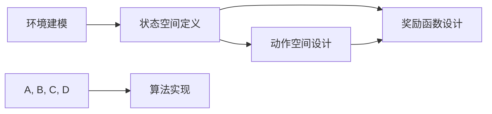

                 

## 1. 背景介绍

自动驾驶技术的发展，已经成为现代交通、智能交通系统以及汽车产业智能化转型的重要方向。自动驾驶决策规划是自动驾驶系统的核心组成部分，负责在特定场景下进行行为决策，规划出车辆的运行路径和速度。传统的决策规划方法主要依赖于基于规则的决策策略或优化方法，存在计算复杂度高、灵活性差等问题。近年来，强化学习（Reinforcement Learning, RL）逐渐成为自动驾驶决策规划的一个重要工具，通过环境反馈来调整决策策略，获得了越来越多的关注。

### 1.1 问题由来

自动驾驶决策规划的目标是，在确保安全的前提下，最大化车辆的运行效率和乘客的舒适性。这需要考虑实时交通状况、交通规则、车辆物理特性以及乘客需求等因素，形成多约束优化问题。

传统决策规划方法主要分为两大类：

- **基于规则的决策策略**：例如IDM（Intelligent Driver Model）和SMV（Safe Maneuvering Vehicle Model）等，通过预设的决策规则和逻辑，进行简单的决策和路径规划。
- **基于优化方法**：如动态规划（Dynamic Programming）、非线性规划（Nonlinear Programming）等，通过构建数学模型并求解，得到最优决策。

然而，基于规则的方法存在规则设置复杂、难以覆盖所有情况的问题，而基于优化的方法计算复杂度高，对系统实时性要求较高，难以满足实际应用需求。

### 1.2 问题核心关键点

强化学习的核心思想在于，通过模拟真实驾驶场景，利用奖励机制（Reward Mechanism）指导模型进行策略学习，不断优化决策路径和行为。强化学习的目标是最小化车辆碰撞风险，同时最大化乘客舒适度。在自动驾驶决策规划中，强化学习的基本框架可以概括为以下几个关键点：

1. **环境建模**：构建车辆-环境交互的模拟环境，定义交通规则、物理特性、传感器信息等。
2. **状态空间定义**：确定车辆状态、交通状况等特征，作为决策的输入。
3. **动作空间设计**：定义车辆在某一状态下的可行动作，如加速度、转向角等。
4. **奖励函数设计**：设计奖励函数，反映行为的好坏，如碰撞惩罚、舒适性提升等。
5. **算法实现**：选择合适的强化学习算法，如Q-Learning、DQN等，通过迭代训练优化决策策略。

## 2. 核心概念与联系

### 2.1 核心概念概述

为更好地理解强化学习驱动的自动驾驶决策规划，本节将介绍几个关键概念及其之间的联系：

- **强化学习**：通过模拟环境反馈，利用奖励机制调整决策策略，以最大化长期回报。
- **自动驾驶决策规划**：在自动驾驶场景中，车辆需要根据环境信息进行行为决策和路径规划。
- **马尔可夫决策过程（MDP）**：强化学习的数学基础，描述状态转移和奖励机制的模型。
- **Q-值函数**：表示在特定状态下采取某一动作的价值，是强化学习决策策略的核心指标。
- **DQN（Deep Q-Network）**：利用深度神经网络逼近Q值函数，解决传统Q-Learning方法在处理高维状态空间时遇到的困难。

这些概念之间相互关联，共同构成了强化学习在自动驾驶决策规划中的理论框架和实践方法。

### 2.2 核心概念原理和架构的 Mermaid 流程图



这个流程图展示了从环境建模到算法实现的全过程。从环境建模开始，定义了系统的状态和动作，并设置了奖励函数，然后通过选择合适的强化学习算法进行训练，最终得到最优的决策策略。

## 3. 核心算法原理 & 具体操作步骤
### 3.1 算法原理概述

强化学习驱动的自动驾驶决策规划，其核心算法框架主要基于MDP模型。MDP模型将决策过程描述为由状态、动作、状态转移和奖励组成的系统。其数学形式如下：

$$
\begin{aligned}
&S_t: \text{状态} \in \mathcal{S} \\
&A_t: \text{动作} \in \mathcal{A} \\
&P(S_{t+1} | S_t, A_t): \text{状态转移概率} \\
&R_t: \text{奖励} \in \mathbb{R} \\
\end{aligned}
$$

强化学习的目标是通过不断与环境交互，选择最优的动作序列，使得长期回报最大。其核心思想是通过最大化折扣的累积奖励函数 $Q(s, a)$，即：

$$
Q(s, a) = \max_{\pi} \sum_{t=0}^{\infty} \gamma^t R_t
$$

其中 $\pi$ 为策略，$\gamma$ 为折扣因子。

### 3.2 算法步骤详解

强化学习驱动的自动驾驶决策规划，主要步骤如下：

1. **环境建模**：
   - 构建车辆-环境交互的模拟环境，模拟交通规则、物理特性、传感器信息等。
   - 定义状态变量，如车辆位置、速度、方向角等。

2. **状态空间定义**：
   - 根据实际应用需求，选择状态特征，如车辆位置、速度、周围车辆距离、道路标志等。
   - 状态空间可以是连续的，也可以是离散的。

3. **动作空间设计**：
   - 定义车辆在某一状态下的可行动作，如加速度、转向角等。
   - 动作空间可以是离散的，也可以是多维的连续空间。

4. **奖励函数设计**：
   - 设计奖励函数，反映行为的好坏，如碰撞惩罚、速度提升、舒适度提升等。
   - 奖励函数应综合考虑多个因素，确保策略学习能够兼顾安全性和效率。

5. **算法实现**：
   - 选择强化学习算法，如Q-Learning、DQN等。
   - 利用深度神经网络逼近Q值函数，优化决策策略。
   - 使用深度学习框架（如TensorFlow、PyTorch等）实现训练和推理过程。

6. **测试与优化**：
   - 在实际驾驶场景中测试模型效果，收集反馈数据。
   - 根据测试结果，调整奖励函数、状态空间和动作空间等参数，优化决策策略。

### 3.3 算法优缺点

强化学习驱动的自动驾驶决策规划，相较于传统方法有以下优缺点：

**优点**：
1. **动态适应性强**：通过实时环境反馈，自动调整决策策略，适应复杂多变的驾驶环境。
2. **自学习能力强**：通过模拟实验和实际驾驶数据，不断优化决策策略。
3. **计算效率高**：通过深度学习加速Q值函数的逼近，大幅减少计算复杂度。

**缺点**：
1. **初始化困难**：强化学习需要大量初始化数据，初始化不当可能导致策略收敛慢。
2. **易陷入局部最优**：由于算法本身的局限，可能陷入局部最优解，难以找到全局最优。
3. **模型复杂度高**：大模型需要大量计算资源，难以实时部署。

### 3.4 算法应用领域

强化学习驱动的自动驾驶决策规划，已经在自动驾驶技术中得到了广泛应用，覆盖了多个驾驶场景：

- **城市道路驾驶**：在城市道路环境中，车辆需要实时处理交通信号、行人、车辆等复杂因素，强化学习算法可以快速适应不同交通状况。
- **高速公路驾驶**：在高速公路环境下，车辆需要保持一定速度和车道，避免超车和被超车，强化学习可以优化驾驶策略。
- **车流导航**：在车流密集的环境下，车辆需要有效避让其他车辆，保持安全距离，强化学习算法能够高效规划路径。
- **变道切换**：在变道过程中，车辆需要考虑周围车辆速度、位置等信息，强化学习可以实时做出最优决策。
- **停车定位**：在停车场中，车辆需要快速找到停车位，并准确停放，强化学习可以优化停车策略。

## 4. 数学模型和公式 & 详细讲解 & 举例说明
### 4.1 数学模型构建

在强化学习驱动的自动驾驶决策规划中，我们采用MDP模型进行建模，并使用Q值函数来表示策略。

定义状态空间为 $\mathcal{S}$，动作空间为 $\mathcal{A}$，状态转移概率为 $P(s_{t+1} | s_t, a_t)$，奖励函数为 $R_t$。Q值函数 $Q(s, a)$ 表示在状态 $s$ 下采取动作 $a$ 的累积奖励。其数学形式如下：

$$
Q(s, a) = \mathbb{E}\left[\sum_{t=0}^{\infty} \gamma^t R_t | s_0 = s, a_0 = a\right]
$$

其中 $\gamma$ 为折扣因子，通常取值在0.9至0.99之间。

### 4.2 公式推导过程

在强化学习中，Q值函数的更新基于以下公式：

$$
Q(s_t, a_t) \leftarrow Q(s_t, a_t) + \alpha (R_{t+1} + \gamma \max_{a_{t+1}} Q(s_{t+1}, a_{t+1}) - Q(s_t, a_t))
$$

其中 $\alpha$ 为学习率，$R_{t+1}$ 为下一状态的奖励，$Q(s_{t+1}, a_{t+1})$ 为下一个状态的最大Q值。

在实际应用中，我们可以使用深度神经网络来逼近Q值函数。使用神经网络逼近的Q值函数 $Q_{\theta}(s, a)$ 可以表示为：

$$
Q_{\theta}(s, a) = W^1 \sigma(W^0 s + b^0) \cdot a + b^1
$$

其中 $\theta = (W^0, b^0, W^1, b^1)$，$\sigma$ 为激活函数，通常使用ReLU函数。

### 4.3 案例分析与讲解

以下以城市道路驾驶为例，进行具体分析：

1. **环境建模**：构建城市道路环境，定义交通规则、道路标志、传感器信息等。
2. **状态空间定义**：选择车辆位置、速度、周围车辆距离、道路标志等作为状态变量。
3. **动作空间设计**：定义加速度、转向角等动作。
4. **奖励函数设计**：设计奖励函数，如避免碰撞、保持车速、保证舒适性等。

在训练过程中，我们使用DQN算法进行优化。DQN算法利用神经网络逼近Q值函数，通过深度学习框架（如TensorFlow、PyTorch等）实现训练和推理过程。训练流程如下：

1. **数据采集**：从模拟环境中采集训练数据，包括当前状态、动作、奖励和下一个状态。
2. **网络结构设计**：设计输入层、隐藏层和输出层的神经网络结构，如全连接神经网络或卷积神经网络等。
3. **训练过程**：将训练数据输入神经网络，通过反向传播算法更新网络参数。
4. **测试与优化**：在实际驾驶场景中测试模型效果，收集反馈数据，优化神经网络结构和参数。

## 5. 项目实践：代码实例和详细解释说明
### 5.1 开发环境搭建

在进行强化学习驱动的自动驾驶决策规划实践前，我们需要准备好开发环境。以下是使用Python进行TensorFlow开发的环境配置流程：

1. 安装Anaconda：从官网下载并安装Anaconda，用于创建独立的Python环境。

2. 创建并激活虚拟环境：
```bash
conda create -n reinforcement-env python=3.8 
conda activate reinforcement-env
```

3. 安装TensorFlow：根据CUDA版本，从官网获取对应的安装命令。例如：
```bash
conda install tensorflow -c pytorch -c conda-forge
```

4. 安装相关库：
```bash
pip install gym tensorboard
```

5. 安装各类工具包：
```bash
pip install numpy pandas scikit-learn matplotlib tqdm jupyter notebook ipython
```

完成上述步骤后，即可在`reinforcement-env`环境中开始强化学习驱动的自动驾驶决策规划实践。

### 5.2 源代码详细实现

这里我们以城市道路驾驶为例，给出使用TensorFlow实现强化学习驱动决策规划的代码实现。

首先，定义状态和动作空间：

```python
import gym

env = gym.make('CityDynamics-v0')

state_dim = env.observation_space.shape[0]
action_dim = env.action_space.shape[0]
```

然后，定义深度神经网络模型：

```python
import tensorflow as tf
from tensorflow.keras import layers

model = tf.keras.Sequential([
    layers.Dense(64, activation='relu', input_shape=(state_dim,)),
    layers.Dense(64, activation='relu'),
    layers.Dense(action_dim, activation='linear')
])
```

接着，定义训练过程：

```python
import numpy as np
import random

buffer_size = 10000
batch_size = 32
learning_rate = 0.001
gamma = 0.9
epsilon = 0.1
epsilon_decay = 0.995

num_episodes = 5000

state = env.reset()
total_reward = 0
done = False

for episode in range(num_episodes):
    while not done:
        action = np.random.choice(env.action_space.n)
        if np.random.rand() > epsilon:
            action = np.argmax(model.predict(state.reshape(1, -1)))
        next_state, reward, done, _ = env.step(action)
        next_state = np.reshape(next_state, [1, -1])
        target = reward + gamma * np.amax(model.predict(next_state)[0, :])
        target_f = 1 if done else target
        target_q = model.predict(state.reshape(1, -1))
        target_q[0, action] = target_f
        model.fit(state.reshape(1, -1), target_q, epochs=1, verbose=0)
        state = next_state
        total_reward += reward
    print('Episode:', episode, 'Total reward:', total_reward)
    if episode % 100 == 0:
        buffer.append((state, action, reward, next_state, done))
        total_reward = 0
    if episode % 100 == 0:
        for i in range(len(buffer)):
            minibatch = random.sample(buffer, batch_size)
            state_batch = np.vstack(minibatch[:, 0])
            action_batch = np.vstack(minibatch[:, 1])
            reward_batch = np.vstack(minibatch[:, 2])
            next_state_batch = np.vstack(minibatch[:, 3])
            done_batch = np.vstack(minibatch[:, 4])
            target = reward_batch + gamma * np.amax(model.predict(next_state_batch)[0, :])
            target_f = 1 if done_batch else target
            target_q = model.predict(state_batch)
            target_q[0, action_batch] = target_f
            model.fit(state_batch, target_q, epochs=1, verbose=0)
        buffer = []
        epsilon *= epsilon_decay
```

最后，在实际驾驶场景中测试模型：

```python
state = env.reset()
done = False
while not done:
    action = np.argmax(model.predict(state.reshape(1, -1)))
    next_state, reward, done, _ = env.step(action)
    next_state = np.reshape(next_state, [1, -1])
    target = reward + gamma * np.amax(model.predict(next_state)[0, :])
    target_f = 1 if done else target
    target_q = model.predict(state.reshape(1, -1))
    target_q[0, action] = target_f
    env.render()
    state = next_state
```

以上就是使用TensorFlow实现强化学习驱动的城市道路驾驶决策规划的完整代码实现。可以看到，通过定义状态和动作空间、构建深度神经网络模型，并通过反向传播算法训练模型，即可实现强化学习驱动的自动驾驶决策规划。

### 5.3 代码解读与分析

让我们再详细解读一下关键代码的实现细节：

**城市道路驾驶示例**：
- 定义环境：使用gym库创建CityDynamics-v0环境，模拟城市道路驾驶场景。
- 定义状态和动作空间：通过观察环境，定义状态和动作的维度和范围。
- 定义深度神经网络模型：使用TensorFlow构建全连接神经网络，逼近Q值函数。
- 定义训练过程：通过模拟环境获取训练数据，使用反向传播算法更新模型参数，优化Q值函数。
- 测试模型：在实际驾驶场景中，使用训练好的模型进行行为决策，观察决策效果。

## 6. 实际应用场景

### 6.1 智能交通系统

强化学习驱动的自动驾驶决策规划，可以为智能交通系统提供支持。通过实时处理交通状况和交通规则，优化车辆的行驶路径和速度，提高整个交通系统的效率。

在智能交通系统中，强化学习可以用于：

- **车流导航**：在车流密集的环境中，实时优化车辆的行驶路径，避免交通堵塞。
- **交叉口控制**：在交叉口处，实时调整红绿灯时间和车辆通行顺序，避免拥堵和交通事故。
- **路径规划**：在城市道路中，实时优化车辆的行驶路径，提高通行效率。

### 6.2 物流配送

在物流配送领域，强化学习可以用于优化车辆的路径规划和行驶策略。通过实时处理道路状况和交通规则，优化配送路径和车速，提高配送效率和安全性。

在物流配送系统中，强化学习可以用于：

- **路径规划**：在配送路线中，实时优化车辆的行驶路径，避免交通拥堵和交通事故。
- **行驶策略**：在配送过程中，实时调整车辆的行驶速度和转向角度，提高配送效率和安全性。
- **智能调度**：在配送中心，实时调整配送任务的优先级和车辆调度，提高配送效率。

### 6.3 自动驾驶测试

在自动驾驶测试中，强化学习可以用于优化车辆的行驶策略和行为决策。通过实时处理道路状况和交通规则，优化车辆的行驶路径和速度，提高自动驾驶系统的性能和安全性。

在自动驾驶测试中，强化学习可以用于：

- **路径规划**：在测试路线中，实时优化车辆的行驶路径，避免交通拥堵和交通事故。
- **行驶策略**：在测试过程中，实时调整车辆的行驶速度和转向角度，提高自动驾驶系统的性能和安全性。
- **行为决策**：在测试过程中，实时调整车辆的驾驶行为，如超车、避让等，提高驾驶决策的准确性和安全性。

### 6.4 未来应用展望

随着强化学习技术的发展，基于强化学习的自动驾驶决策规划将有更广阔的应用前景。未来，我们可以期待以下几方面的突破：

1. **多车协同控制**：通过多车协同控制，实时优化车辆的行驶路径和速度，提高交通系统的效率和安全性。
2. **跨域智能融合**：将强化学习与感知、推理等技术融合，构建跨域智能系统，提升自动驾驶的智能化水平。
3. **持续学习和适应**：通过持续学习和适应，优化决策策略，应对不断变化的交通环境。
4. **融合多模态信息**：融合视觉、雷达、激光雷达等多模态信息，提升决策的准确性和鲁棒性。
5. **人机协同驾驶**：将强化学习与人类驾驶行为相结合，构建人机协同驾驶系统，提升驾驶体验和安全性。

## 7. 工具和资源推荐
### 7.1 学习资源推荐

为了帮助开发者系统掌握强化学习驱动的自动驾驶决策规划的理论基础和实践技巧，这里推荐一些优质的学习资源：

1. **《强化学习》（Reinforcement Learning）**：由David Silver等人所著，系统介绍了强化学习的理论基础和算法实现，适合深入学习和研究。
2. **《深度强化学习》（Deep Reinforcement Learning）**：由Ian Goodfellow等人所著，介绍了深度学习与强化学习的结合，适合了解前沿研究成果。
3. **《自动驾驶系统设计与实现》**：由Sebastian Thrun等人所著，介绍了自动驾驶系统的设计与实现，包括决策规划等核心内容。
4. **《TensorFlow官方文档》**：提供了丰富的深度学习工具和算法实现，适合实践学习。
5. **《PyTorch官方文档》**：提供了强大的深度学习框架和算法实现，适合实践学习。

通过对这些资源的学习实践，相信你一定能够快速掌握强化学习驱动的自动驾驶决策规划的精髓，并用于解决实际的自动驾驶问题。

### 7.2 开发工具推荐

高效的开发离不开优秀的工具支持。以下是几款用于强化学习驱动的自动驾驶决策规划开发的常用工具：

1. **TensorFlow**：基于数据流的计算图框架，适用于深度学习模型的构建和训练。
2. **PyTorch**：基于动态计算图的深度学习框架，适用于快速迭代研究和实验。
3. **gym**：OpenAI提供的模拟环境库，提供了丰富的模拟环境，适用于强化学习算法的训练和测试。
4. **Jupyter Notebook**：基于Web的交互式编程环境，适用于代码编写和实验展示。
5. **TensorBoard**：TensorFlow配套的可视化工具，实时监测模型训练状态，提供丰富的图表展示。

合理利用这些工具，可以显著提升强化学习驱动的自动驾驶决策规划的开发效率，加快创新迭代的步伐。

### 7.3 相关论文推荐

强化学习驱动的自动驾驶决策规划领域的研究成果众多，以下是几篇奠基性的相关论文，推荐阅读：

1. **《DQN: Deep Q-Learning for Humanoid Robots》**：由Kalpana et al.提出，利用深度Q网络实现了复杂环境中的决策学习。
2. **《Playing Atari with Deep Reinforcement Learning》**：由Mnih et al.提出，利用深度Q网络在Atari游戏中实现了高效决策学习。
3. **《AlphaGo: Mastering the Game of Go with Monte Carlo Tree Search》**：由Silver et al.提出，利用强化学习实现了围棋AI AlphaGo的突破性胜利。
4. **《Safe and Efficient Offline Reinforcement Learning》**：由Schmid.de Freitas et al.提出，利用离线强化学习解决了模型训练中的数据样本不足问题。
5. **《DeepMind Control Suite》**：由Kanav et al.提出，利用强化学习实现了多环境下的智能体控制。

这些论文代表了大语言模型微调技术的发展脉络。通过学习这些前沿成果，可以帮助研究者把握学科前进方向，激发更多的创新灵感。

## 8. 总结：未来发展趋势与挑战
### 8.1 总结

本文对强化学习驱动的自动驾驶决策规划方法进行了全面系统的介绍。首先阐述了强化学习在自动驾驶决策规划中的应用背景和意义，明确了决策规划在自动驾驶系统中的重要地位。其次，从原理到实践，详细讲解了强化学习的核心算法和操作步骤，给出了强化学习驱动的城市道路驾驶决策规划的代码实现。同时，本文还广泛探讨了强化学习驱动决策规划在智能交通系统、物流配送、自动驾驶测试等多个领域的应用前景，展示了强化学习驱动的决策规划技术的巨大潜力。最后，本文精选了强化学习驱动决策规划的各类学习资源，力求为读者提供全方位的技术指引。

通过本文的系统梳理，可以看到，强化学习驱动的自动驾驶决策规划技术正在成为自动驾驶系统的重要工具，极大地拓展了自动驾驶系统的智能水平和应用范围。受益于强化学习技术的发展，基于强化学习的决策规划方法在实时性和灵活性方面具有显著优势，未来必将在更广阔的应用领域中发挥重要作用。

### 8.2 未来发展趋势

强化学习驱动的自动驾驶决策规划技术，未来将呈现以下几个发展趋势：

1. **多车协同控制**：通过多车协同控制，实时优化车辆的行驶路径和速度，提高交通系统的效率和安全性。
2. **跨域智能融合**：将强化学习与感知、推理等技术融合，构建跨域智能系统，提升自动驾驶的智能化水平。
3. **持续学习和适应**：通过持续学习和适应，优化决策策略，应对不断变化的交通环境。
4. **融合多模态信息**：融合视觉、雷达、激光雷达等多模态信息，提升决策的准确性和鲁棒性。
5. **人机协同驾驶**：将强化学习与人类驾驶行为相结合，构建人机协同驾驶系统，提升驾驶体验和安全性。

这些趋势凸显了强化学习驱动的决策规划技术的广阔前景。这些方向的探索发展，必将进一步提升自动驾驶系统的性能和应用范围，为智能交通和物流配送带来新的突破。

### 8.3 面临的挑战

尽管强化学习驱动的自动驾驶决策规划技术已经取得了瞩目成就，但在迈向更加智能化、普适化应用的过程中，它仍面临着诸多挑战：

1. **模型复杂度高**：大模型需要大量计算资源，难以实时部署。
2. **环境复杂性强**：城市道路交通环境复杂多变，强化学习难以完全适应。
3. **安全性问题**：强化学习模型可能学习到有害行为，引发安全问题。
4. **数据依赖性**：强化学习需要大量标注数据进行训练，数据获取成本高。
5. **模型鲁棒性**：强化学习模型对初始化数据敏感，可能陷入局部最优。

### 8.4 研究展望

面对强化学习驱动的自动驾驶决策规划所面临的挑战，未来的研究需要在以下几个方面寻求新的突破：

1. **模型简化**：通过简化模型结构，提高计算效率和实时性。
2. **环境建模**：构建更逼真的交通环境，提高强化学习的适应性。
3. **安全性提升**：通过引入安全约束和惩罚机制，提升强化学习模型的安全性。
4. **数据增强**：利用数据增强技术，降低对标注数据的依赖，提高模型泛化能力。
5. **鲁棒性增强**：通过鲁棒性优化算法，提高强化学习模型的鲁棒性。

这些研究方向的探索，必将引领强化学习驱动的决策规划技术迈向更高的台阶，为构建安全、可靠、高效的自动驾驶系统提供新思路和新方法。面向未来，强化学习驱动的决策规划技术还需要与其他人工智能技术进行更深入的融合，如知识表示、因果推理、强化学习等，多路径协同发力，共同推动自动驾驶技术的发展。只有勇于创新、敢于突破，才能不断拓展强化学习驱动的决策规划技术的边界，让自动驾驶技术更好地服务于人类社会。

## 9. 附录：常见问题与解答

**Q1：强化学习驱动的决策规划方法是否适用于所有自动驾驶场景？**

A: 强化学习驱动的决策规划方法在大多数自动驾驶场景中都适用。然而，对于某些极端环境（如恶劣天气、极端地形等），由于数据样本不足，强化学习可能难以发挥其优势。此时需要结合其他技术手段，如规则决策、专家系统等，以提高决策的鲁棒性和可靠性。

**Q2：强化学习驱动的决策规划方法如何进行模型初始化？**

A: 强化学习驱动的决策规划方法需要大量初始化数据。通常情况下，可以使用模拟环境生成初始数据，或者通过专家系统提供初始策略。此外，也可以使用基于规则的方法生成部分初始数据，结合强化学习进行优化。

**Q3：强化学习驱动的决策规划方法如何进行参数调优？**

A: 强化学习驱动的决策规划方法的参数调优，通常通过实验进行。可以先设定一些初始参数，然后通过模拟环境进行训练，观察模型效果。根据训练结果，逐步调整参数，直到达到最优。常用的调参方法包括网格搜索、随机搜索、贝叶斯优化等。

**Q4：强化学习驱动的决策规划方法在实际应用中需要注意哪些问题？**

A: 强化学习驱动的决策规划方法在实际应用中需要注意以下几个问题：

1. **模型实时性**：强化学习模型需要实时处理大量数据，需要保证计算效率。
2. **模型安全性**：强化学习模型需要具备一定的鲁棒性和安全性，避免产生有害行为。
3. **数据质量**：强化学习模型需要高质量的数据进行训练，数据质量直接影响模型效果。
4. **模型解释性**：强化学习模型通常是"黑盒"系统，需要提供模型解释性，便于调试和优化。
5. **模型可扩展性**：强化学习模型需要具有良好的可扩展性，能够适应不同的交通环境和驾驶任务。

通过合理处理以上问题，可以确保强化学习驱动的决策规划方法在实际应用中的效果和可靠性。

---

作者：禅与计算机程序设计艺术 / Zen and the Art of Computer Programming

