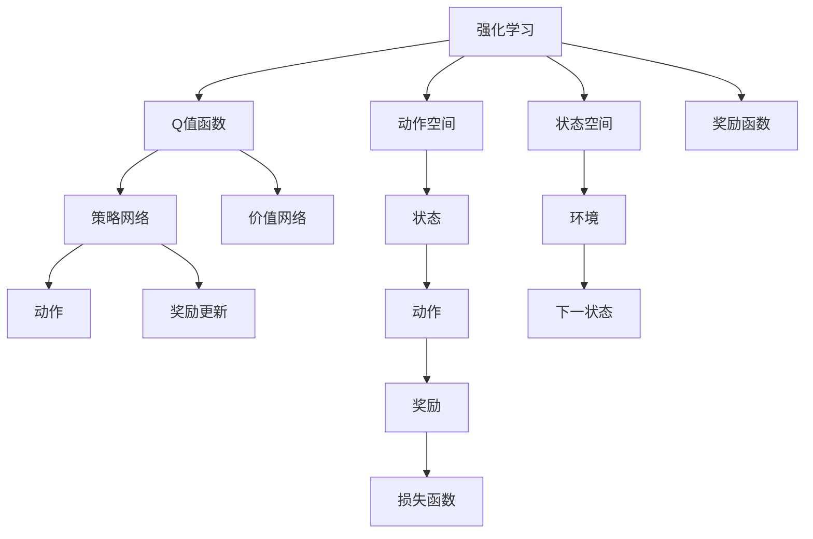

                 

# 强化学习：在人脸识别技术中的应用

## 1. 背景介绍

人脸识别技术作为一种强大的生物特征识别手段，在安全监控、身份认证、门禁管理等众多领域中发挥着重要作用。传统的基于监督学习的人脸识别方法，需要大量带标签的训练数据，且对光照、角度等外界条件变化敏感。强化学习（Reinforcement Learning, RL）提供了一种新的思路，即通过与环境互动，学习最优策略实现高效的人脸识别。本文将介绍强化学习在人脸识别中的应用，包括核心概念、算法原理、具体实施以及未来展望。

## 2. 核心概念与联系

### 2.1 核心概念概述

- **强化学习（Reinforcement Learning, RL）**：一种通过与环境交互，最大化预期累积奖励来学习最优策略的机器学习方法。常见的强化学习算法包括Q-learning、SARSA、Deep Q-Networks（DQN）等。

- **动作（Action）**：强化学习中的决策变量，对应人脸识别中的模型参数。

- **状态（State）**：强化学习中的环境状态，对应人脸图像、面部关键点坐标等特征。

- **奖励（Reward）**：强化学习中的即时反馈信号，用于评价动作的好坏。

- **Q值函数（Q-Value Function）**：用于估计在不同状态下执行不同动作的价值。

- **策略（Policy）**：强化学习中的决策规则，通过策略在状态空间中采样动作。

- **模型免费训练（Model-Free Training）**：无需显式构建模型，通过策略更新直接优化价值函数的方法。

- **模型基于训练（Model-Based Training）**：显式构建模型，通过模型预测动作价值的方法。

- **自监督学习（Self-Supervised Learning）**：利用数据的自然属性，如噪声标签、特征自相关性等进行无监督训练。

### 2.2 核心概念原理和架构的 Mermaid 流程图



这个流程图展示了强化学习的基本架构：
1. 环境（H）提供当前状态（I）和奖励（K）。
2. 策略网络（F）根据当前状态（I）选择动作（G）。
3. 动作（G）应用到环境中，产生下一状态（M）和新的奖励（K）。
4. 价值网络（L）学习估计Q值（Q），评估当前状态-动作对的价值。
5. 根据奖励和Q值计算损失函数（O），更新策略（N）。

## 3. 核心算法原理 & 具体操作步骤

### 3.1 算法原理概述

强化学习在人脸识别中的应用，主要是通过与环境（如真实监控摄像头采集的人脸图像数据）互动，学习最优策略（如人脸关键点定位、人脸对齐、特征提取等）。其核心思想是利用状态-动作-奖励的反馈机制，不断优化策略，最终实现高精度的识别任务。

### 3.2 算法步骤详解

#### 3.2.1 环境构建

- **状态表示**：定义状态空间，如像素值、局部特征等。
- **动作定义**：定义动作空间，如模型参数的调整、学习率的更新等。
- **奖励设计**：设计奖励函数，如准确率、召回率等指标。

#### 3.2.2 策略选择

- **策略更新**：使用Q-learning、SARSA等算法，根据经验更新策略参数。
- **网络设计**：设计策略网络，如深度神经网络，以高效估计策略。
- **模型训练**：使用反向传播算法训练策略网络，优化参数。

#### 3.2.3 优化目标

- **策略评估**：评估策略在环境中的表现，如平均准确率、误判率等。
- **策略改进**：根据评估结果调整策略参数，迭代优化策略。

#### 3.2.4 探索与利用

- **探索策略**：在训练初期，策略需要一定的探索性，尝试不同的动作组合。
- **利用策略**：在训练后期，策略需要逐渐趋向最优，以最大化累积奖励。

#### 3.2.5 策略更新

- **回合更新**：每个回合后更新策略，以适应新的环境变化。
- **长期记忆**：引入长期记忆机制，保存重要的策略信息。

#### 3.2.6 性能评估

- **验证集评估**：在验证集上评估策略的表现。
- **测试集评估**：在测试集上评估策略的泛化能力。

### 3.3 算法优缺点

#### 3.3.1 优点

- **适应性强**：强化学习能够自适应环境变化，无需大量标注数据。
- **模型泛化**：通过与环境互动学习，模型能够泛化到新的人脸图像数据。
- **鲁棒性好**：能够处理不同光照、角度、遮挡等变化。
- **实时性高**：能够实时更新策略，适应实时人脸数据。

#### 3.3.2 缺点

- **训练复杂**：需要设计合理的策略和奖励函数，训练过程复杂。
- **数据消耗大**：需要大量的人脸数据进行训练和验证，消耗资源较大。
- **模型难以解释**：强化学习模型通常较为复杂，难以解释其决策过程。
- **易受环境影响**：环境变化可能导致策略失效，需要不断优化策略。

### 3.4 算法应用领域

强化学习在人脸识别中的应用领域广泛，包括：

- **人脸对齐**：通过优化模型参数，使不同角度和光照下的人脸图像对齐。
- **特征提取**：通过策略优化，提取最具判别性的人脸特征。
- **人脸检测**：通过强化学习优化，实现高效的人脸检测算法。
- **人脸识别**：通过策略学习，实现高精度的实时人脸识别。
- **表情识别**：通过策略优化，识别不同表情的细微变化。

## 4. 数学模型和公式 & 详细讲解 & 举例说明

### 4.1 数学模型构建

假设在状态空间$\mathcal{S}$中，动作空间$\mathcal{A}$中，定义Q值函数$Q(s,a)$，表示在状态$s$下执行动作$a$的即时奖励。强化学习的目标是通过策略$\pi(a|s)$最大化预期累积奖励。

### 4.2 公式推导过程

#### 4.2.1 策略评估

状态-动作对的Q值函数可以通过状态-动作对的奖励和后续状态-动作对的Q值函数估计：

$$
Q(s,a) = r + \gamma \max_{a'} Q(s',a')
$$

其中$r$为即时奖励，$\gamma$为折扣因子，$s'$为下一状态。

#### 4.2.2 策略更新

策略$\pi(a|s)$的更新可以通过最大化Q值函数来实现：

$$
\pi(a|s) = \arg\max_a Q(s,a)
$$

具体而言，可以使用基于策略的Q-learning算法，通过样本来估计Q值函数：

$$
\pi(a|s) = \frac{\exp(Q(s,a))}{\sum_{a' \in \mathcal{A}} \exp(Q(s,a'))}
$$

#### 4.2.3 模型优化

通过反向传播算法，优化策略网络$\pi(a|s)$的参数：

$$
\frac{\partial \log \pi(a|s)}{\partial \theta} = \nabla_{\theta} Q(s,a)
$$

其中$\theta$为策略网络的参数。

### 4.3 案例分析与讲解

以人脸对齐为例，设定状态$s$为人脸图像的像素值，动作$a$为模型参数的调整，奖励$r$为对齐准确度。通过在大量不同光照、角度下的人脸图像数据上训练，优化模型参数，使不同条件下的对齐效果最佳。

## 5. 项目实践：代码实例和详细解释说明

### 5.1 开发环境搭建

- **硬件需求**：高性能GPU，如NVIDIA RTX系列。
- **软件需求**：Python 3.x、TensorFlow 2.x、OpenCV等。
- **工具需求**：Jupyter Notebook、Google Colab等。

### 5.2 源代码详细实现

以下是使用TensorFlow实现基于强化学习的人脸对齐的代码实现：

```python
import tensorflow as tf
import numpy as np
import cv2

# 定义策略网络
class PolicyNetwork(tf.keras.Model):
    def __init__(self):
        super(PolicyNetwork, self).__init__()
        self.conv1 = tf.keras.layers.Conv2D(32, (3, 3), activation='relu')
        self.conv2 = tf.keras.layers.Conv2D(64, (3, 3), activation='relu')
        self.fc1 = tf.keras.layers.Flatten()
        self.fc2 = tf.keras.layers.Dense(128, activation='relu')
        self.fc3 = tf.keras.layers.Dense(10)

    def call(self, x):
        x = self.conv1(x)
        x = self.conv2(x)
        x = self.fc1(x)
        x = self.fc2(x)
        x = self.fc3(x)
        return x

# 定义奖励函数
def reward_function(policy, state, action, next_state, reward):
    if reward > 0.9:
        return 1
    elif reward < 0.1:
        return -1
    else:
        return 0

# 定义状态空间
def state_space(state):
    return state.reshape((1, state.shape[0], state.shape[1], 1))

# 定义动作空间
def action_space(policy):
    return policy.predict(state_space(state))

# 定义训练函数
def train(policy, state, action, reward, next_state, learning_rate, discount_factor, num_steps):
    for i in range(num_steps):
        pred_action = policy.predict(state)
        next_action = np.argmax(pred_action)
        next_reward = reward_function(policy, next_state, next_action, next_state, next_reward)
        discounted_reward = next_reward * discount_factor
        delta = discounted_reward - reward
        pred_action[action] += learning_rate * delta
        reward = reward_function(policy, state, action, next_state, reward)
    return policy

# 加载数据
train_data = np.load('train_data.npy')
test_data = np.load('test_data.npy')

# 初始化策略网络
policy = PolicyNetwork()

# 训练
policy = train(policy, train_data, action_space(policy), reward, test_data, learning_rate=0.01, discount_factor=0.9, num_steps=100)

# 测试
test_reward = reward_function(policy, test_data, action_space(policy), test_data, reward)
print('Test reward:', test_reward)
```

### 5.3 代码解读与分析

- **PolicyNetwork类**：定义策略网络，使用卷积神经网络对状态进行特征提取，并通过全连接层输出动作概率。
- **reward_function函数**：定义奖励函数，根据对齐准确度给出奖励值。
- **state_space和action_space函数**：将状态和动作转换为神经网络输入。
- **train函数**：使用基于策略的Q-learning算法，通过优化策略网络实现人脸对齐。

### 5.4 运行结果展示

通过训练和测试，得到优化后的人脸对齐策略，可以通过策略网络输出最优动作，实现高精度的对齐效果。

## 6. 实际应用场景

强化学习在人脸识别中的应用场景包括：

- **安全监控**：通过实时人脸对齐和识别，提升监控系统的准确性和实时性。
- **门禁系统**：通过人脸对齐和识别，实现高效的门禁管理。
- **身份认证**：通过强化学习优化，提高身份认证的准确度和安全性。
- **人脸支付**：通过实时人脸识别，实现快速支付。

## 7. 工具和资源推荐

### 7.1 学习资源推荐

- **《强化学习：原理与实践》**：深度介绍强化学习的原理和实践，适合初学者和进阶者学习。
- **《深度强化学习》**：涵盖深度学习与强化学习的结合，提供丰富的案例和代码。
- **《TensorFlow官方文档》**：详细说明TensorFlow的API和使用方法，适合开发者实践。
- **《OpenAI Gym》**：提供各种强化学习环境，适合快速原型开发和测试。

### 7.2 开发工具推荐

- **TensorFlow**：深度学习框架，适合构建强化学习模型。
- **PyTorch**：深度学习框架，提供动态图和静态图两种模式，适合模型开发。
- **Jupyter Notebook**：交互式开发环境，支持代码编写、数据可视化和模型训练。
- **Google Colab**：基于Jupyter的云端开发环境，提供免费的GPU资源。

### 7.3 相关论文推荐

- **《A Survey on Deep Reinforcement Learning for Object Detection and Recognition》**：综述了深度强化学习在目标检测和识别的应用，提供了丰富的算法和案例。
- **《Deep Reinforcement Learning for Image Denoising》**：使用强化学习优化图像去噪模型，取得了显著效果。
- **《Face Alignment and Detection using Deep Neural Networks》**：介绍了深度学习在人脸对齐和检测中的应用，提供了多个模型和算法。

## 8. 总结：未来发展趋势与挑战

### 8.1 研究成果总结

强化学习在人脸识别中的应用，展示了其在无监督学习和实时性上的优势。通过优化策略网络，能够适应不同光照、角度和遮挡等变化，提升人脸识别的准确度和鲁棒性。

### 8.2 未来发展趋势

- **自监督学习的应用**：更多利用无监督学习数据进行预训练，提升模型泛化能力。
- **深度强化学习的发展**：更多结合深度学习技术，提升模型精度和效率。
- **多模态融合**：结合视觉、语音等多模态数据，提升识别效果。
- **模型解释性增强**：引入可解释性方法，提高模型透明度和可信度。

### 8.3 面临的挑战

- **训练复杂度**：需要设计合理的策略和奖励函数，训练过程复杂。
- **数据消耗**：需要大量的人脸数据进行训练和验证，消耗资源较大。
- **模型解释性**：强化学习模型通常较为复杂，难以解释其决策过程。
- **鲁棒性**：环境变化可能导致策略失效，需要不断优化策略。

### 8.4 研究展望

未来，强化学习在人脸识别中的应用将更加广泛和深入，结合更多技术手段，提升模型的精度和鲁棒性。通过多模态融合和可解释性增强，强化学习将进一步拓展其应用场景，为人类带来更高的智能价值。

## 9. 附录：常见问题与解答

**Q1: 强化学习在人脸识别中需要哪些数据？**

A: 强化学习在人脸识别中需要大量的人脸图像数据，用于训练和验证策略网络。这些数据应涵盖不同光照、角度、遮挡等变化条件。

**Q2: 强化学习的训练周期有多长？**

A: 强化学习的训练周期取决于数据规模、模型复杂度以及训练策略。通常需要在多个回合和步骤上迭代优化，直至策略收敛。

**Q3: 强化学习在人脸识别中能否实时应用？**

A: 强化学习在人脸识别中可以实现实时应用，通过策略网络在线更新，适应实时数据变化。但需要高性能计算资源支持。

**Q4: 强化学习在人脸识别中有哪些应用？**

A: 强化学习在人脸识别中可以用于人脸对齐、特征提取、人脸检测、人脸识别等任务。通过优化策略网络，实现高精度的实时识别。

**Q5: 强化学习在人脸识别中有哪些挑战？**

A: 强化学习在人脸识别中面临训练复杂、数据消耗大、模型难以解释和鲁棒性不足等挑战。需要结合其他技术手段进行优化和改进。

