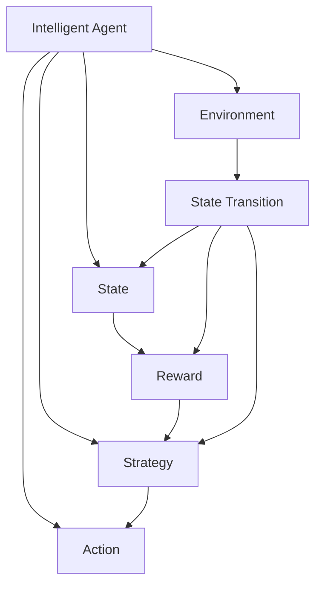

                 

# 强化学习：在陆地自行车中的应用

> 关键词：强化学习, 陆地自行车, 控制决策, 奖励机制, 模型训练, 应用实践

## 1. 背景介绍

### 1.1 问题由来

强化学习(Reinforcement Learning, RL)是一种通过试错、奖励和惩罚机制，使智能体学习如何最大化长期累积奖励的机器学习方法。它广泛应用于游戏、机器人控制、自动驾驶等复杂决策场景，是实现智能决策和优化控制的重要手段。

近年来，随着深度学习技术的快速发展，强化学习在复杂任务上的表现也越来越优秀，成为AI研究的前沿方向之一。但强化学习在实际应用中仍面临诸多挑战，如计算效率低、样本复杂度高、学习效率慢等。如何更高效地训练强化学习模型，提高其在实际场景中的应用效果，是当前研究的热点。

### 1.2 问题核心关键点

强化学习的核心在于智能体如何在不确定的复杂环境中，通过不断试错，学习和优化策略，以获得最优的累积奖励。这一过程需要通过以下关键环节：

1. **环境**：智能体在其中的交互对象，是强化学习的核心。
2. **智能体**：在环境中进行探索和决策的实体，如机器人、无人驾驶车等。
3. **状态**：环境中当前的状态，用于描述环境的特定状态。
4. **动作**：智能体可以采取的行动，如控制转向、加速等。
5. **奖励**：智能体在每个时间步获得的即时反馈，指导其决策行为。
6. **策略**：智能体选择动作的规则，如Q-learning、策略梯度等。

强化学习的效果很大程度上依赖于这三个要素：智能体的策略、环境的反馈（奖励和状态转移）、以及系统的计算能力。

### 1.3 问题研究意义

强化学习在实际应用中展现出巨大潜力，但目前仍面临诸多难题。研究陆地自行车上的强化学习应用，一方面能够探索强化学习在非结构化、高动态环境中的应用；另一方面，可以提出一些通用的方法，为其他复杂系统的优化控制提供参考。

陆地自行车，作为常见且易于控制的物理系统，是强化学习研究的理想实验平台。它不仅具有足够的复杂度，能够测试算法的鲁棒性和泛化能力，而且设备易于获取，实验成本相对较低。通过研究强化学习在陆地自行车上的应用，可以为复杂系统的智能控制和优化提供理论和技术支持。

## 2. 核心概念与联系

### 2.1 核心概念概述

为更好地理解强化学习在陆地自行车中的应用，本节将介绍几个密切相关的核心概念：

- **强化学习**：通过与环境交互，智能体通过不断试错和调整策略，最大化长期累积奖励的机器学习方法。
- **状态转移**：环境在智能体采取动作后的状态变化，通常用于描述环境的动态特性。
- **动作空间**：智能体可采取的动作集合，如陆地自行车上的加速、转向、刹车等。
- **奖励机制**：在每个时间步，智能体根据采取的动作和当前状态，获得即时反馈，指导后续决策。
- **Q函数**：表示在某个状态下，采取某个动作的即时奖励和长期累积奖励的总和。
- **策略**：智能体选择动作的规则，如贪心策略、蒙特卡罗方法等。

这些核心概念之间的逻辑关系可以通过以下Mermaid流程图来展示：



这个流程图展示了一个简单的强化学习系统：

1. 智能体(A)通过感知状态(C)选择动作(D)与环境(B)交互。
2. 环境通过状态转移(E)和奖励(F)对智能体行为进行反馈。
3. 智能体根据策略(G)选择动作。
4. 动作执行后，环境状态和奖励发生变化，并反馈给智能体。
5. 智能体不断更新策略，优化动作选择，以最大化长期累积奖励。

这些概念共同构成了强化学习的学习框架，使得智能体能够在复杂环境中不断学习和优化决策策略。

## 3. 核心算法原理 & 具体操作步骤

### 3.1 算法原理概述

强化学习的基本框架是一个智能体与环境的交互过程。智能体在每个时间步采取一个动作，根据环境反馈得到一个奖励，同时环境的状态也会相应改变。智能体的目标是最大化累积奖励，这一过程称为"学习"。

以陆地自行车为例，假设智能体是骑手，环境是自行车与道路的交互状态。智能体需要根据环境的状态（如速度、路况等），选择加速、转向、刹车等动作，以最大化得分（如通过距离、时间等）。

强化学习的核心在于学习一个策略，使得智能体能够在给定状态下，选择最优动作，最大化长期累积奖励。这一过程通常包括以下几个步骤：

1. **环境建模**：构建环境的数学模型，如状态空间、动作空间、奖励函数等。
2. **智能体设计**：设计智能体的决策策略，如贪心策略、蒙特卡罗方法、Q-learning等。
3. **模型训练**：通过与环境交互，智能体不断试错和调整策略，优化决策行为。
4. **性能评估**：在验证集或测试集上评估智能体的性能，并根据结果进行调整。

### 3.2 算法步骤详解

以陆地自行车为例，以下是使用强化学习进行控制决策的具体步骤：

**Step 1: 环境建模**
- 定义状态空间：如速度、位置、方向等。
- 定义动作空间：如加速、转向、刹车等。
- 定义奖励函数：如距离、时间、路径等。

**Step 2: 智能体设计**
- 选择策略：如Q-learning、策略梯度等。
- 定义策略参数：如Q值表、策略网络等。

**Step 3: 模型训练**
- 初始化智能体参数，随机探索环境。
- 在每个时间步，根据当前状态选择动作，并观察环境反馈。
- 根据状态转移和奖励，更新智能体参数，以优化策略。
- 重复上述过程，直至策略收敛。

**Step 4: 性能评估**
- 在验证集或测试集上，评估智能体的累积得分。
- 根据评估结果，调整智能体策略，以进一步提升性能。

### 3.3 算法优缺点

强化学习的优点在于：

1. 能够处理非结构化、高动态环境，适用于复杂决策任务。
2. 能够在线学习和优化策略，适应环境变化。
3. 能够最大化长期累积奖励，具有较高的预测准确性。

但强化学习也存在一些缺点：

1. 计算复杂度高，训练效率低。特别是在高维状态空间和大规模动作空间下，需要大量的计算资源和时间。
2. 样本复杂度高，需要大量的交互样本才能收敛。
3. 难以保证最优解，存在局部最优解的风险。
4. 需要大量的先验知识，对于无模型环境，往往需要大量的试错才能获得理想的策略。

尽管存在这些局限性，但强化学习在陆地自行车等复杂决策场景中的应用，仍能显著提升智能体的控制性能，为复杂系统的智能控制提供有益参考。

### 3.4 算法应用领域

强化学习在陆地自行车上的应用，可以扩展到多个领域，如：

- 机器人控制：通过强化学习优化机器人动作，提高自主导航和避障能力。
- 无人驾驶：通过强化学习优化车辆控制策略，提升安全性和稳定性。
- 智能交通：通过强化学习优化信号灯控制，提高交通流量和安全性。
- 游戏AI：通过强化学习优化游戏角色的决策，提升游戏智能水平。

这些应用场景中的问题，都可以通过强化学习的方法进行优化和控制，提升系统的性能和鲁棒性。

## 4. 数学模型和公式 & 详细讲解 & 举例说明

### 4.1 数学模型构建

在强化学习中，核心数学模型包括状态转移模型、奖励模型和智能体策略模型。下面以Q-learning为例，构建陆地自行车的强化学习数学模型。

假设在时间步 $t$，智能体处于状态 $s_t$，采取动作 $a_t$，获得即时奖励 $r_{t+1}$，状态转移为 $s_{t+1}$。定义Q值函数 $Q(s_t, a_t)$，表示在状态 $s_t$ 下，采取动作 $a_t$ 的即时奖励和长期累积奖励的总和。

Q值函数的更新公式为：

$$
Q(s_t, a_t) \leftarrow Q(s_t, a_t) + \alpha [r_{t+1} + \gamma \max_{a'} Q(s_{t+1}, a') - Q(s_t, a_t)]
$$

其中，$\alpha$ 为学习率，$\gamma$ 为折扣因子，表示未来奖励的权重。

### 4.2 公式推导过程

Q-learning的推导过程基于贝尔曼方程(Bellman Equation)，以状态 $s_t$ 和动作 $a_t$ 为变量，定义状态值函数 $V(s_t)$，表示在状态 $s_t$ 下的最优值。

贝尔曼方程为：

$$
V(s_t) = \max_{a_t} [r_{t+1} + \gamma V(s_{t+1})]
$$

通过贝尔曼方程，可以得到状态值函数的更新公式：

$$
V(s_t) \leftarrow \max_{a_t} [r_{t+1} + \gamma V(s_{t+1})]
$$

结合状态值函数与动作值函数的关系，可以得到Q-learning的更新公式：

$$
Q(s_t, a_t) \leftarrow Q(s_t, a_t) + \alpha [r_{t+1} + \gamma \max_{a'} Q(s_{t+1}, a') - Q(s_t, a_t)]
$$

这个公式表示，智能体在状态 $s_t$ 下，采取动作 $a_t$ 的即时奖励加上未来最优值，减去当前动作的Q值，通过迭代更新，最终收敛到最优Q值。

### 4.3 案例分析与讲解

以陆地自行车的路径规划为例，假设智能体需要在一条路径上选择最优路径。可以定义状态空间为当前位置，动作空间为转向角度，奖励函数为路径长度。通过Q-learning算法，智能体可以在不断试错和调整策略的过程中，逐步学习到最优路径，最终实现路径规划的目标。

在这个案例中，智能体通过与环境交互，不断更新Q值表，优化路径选择策略。当智能体到达终点时，通过评估路径长度，可以量化其在路径规划上的表现，进一步调整策略，以优化性能。

## 5. 项目实践：代码实例和详细解释说明

### 5.1 开发环境搭建

在进行强化学习实践前，我们需要准备好开发环境。以下是使用Python进行Reinforcement Learning的开发环境配置流程：

1. 安装Anaconda：从官网下载并安装Anaconda，用于创建独立的Python环境。

2. 创建并激活虚拟环境：
```bash
conda create -n reinlearning-env python=3.8 
conda activate reinlearning-env
```

3. 安装Reinforcement Learning库：
```bash
conda install gym
pip install tensorflow numpy gym gymnasium
```

4. 安装各类工具包：
```bash
pip install matplotlib jupyter notebook ipython
```

完成上述步骤后，即可在`reinlearning-env`环境中开始强化学习实践。

### 5.2 源代码详细实现

这里我们以陆地自行车的路径规划为例，给出使用TensorFlow进行Q-learning的PyTorch代码实现。

首先，定义路径规划问题的状态空间和动作空间：

```python
import gymnasium as gym
import numpy as np

# 定义状态和动作空间
env = gym.make('CartPole-v1')
state_dim = env.observation_space.shape[0]
action_dim = env.action_space.n

print(f"状态空间维度：{state_dim}")
print(f"动作空间维度：{action_dim}")
```

然后，定义Q值表和策略：

```python
from tensorflow.keras import layers, models

# 定义Q值表
q_table = np.zeros((state_dim, action_dim))

# 定义策略函数
def choose_action(state):
    if np.random.rand() < epsilon:
        return env.action_space.sample()
    else:
        return np.argmax(q_table[state])

# 定义策略网络
model = models.Sequential([
    layers.Dense(10, input_shape=(state_dim,), activation='relu'),
    layers.Dense(action_dim, activation='linear')
])

# 编译模型
model.compile(optimizer='adam', loss='mse')
```

接着，定义强化学习训练函数：

```python
from tensorflow.keras.optimizers.schedules import ExponentialDecay

# 定义学习率和折扣因子
learning_rate = 0.1
gamma = 0.99
epsilon = 0.1
num_episodes = 1000
batch_size = 32

# 定义折扣因子和学习率衰减
decay_schedule = ExponentialDecay(initial_learning_rate=learning_rate, decay_steps=10000, decay_rate=0.95)

# 定义训练函数
def train(model, env, num_episodes):
    for episode in range(num_episodes):
        state = env.reset()
        state = state[np.newaxis, :]
        done = False
        total_reward = 0
        while not done:
            if np.random.rand() < epsilon:
                action = env.action_space.sample()
            else:
                action = np.argmax(model.predict(state))
            
            next_state, reward, done, _ = env.step(action)
            next_state = next_state[np.newaxis, :]

            # 计算Q值更新
            q_value = q_table[state, action] + learning_rate * (reward + gamma * np.max(model.predict(next_state)) - q_table[state, action])

            # 更新Q值表
            q_table[state, action] = q_value

            state = next_state
            total_reward += reward
        print(f"Episode {episode+1} | Total Reward: {total_reward}")

# 训练模型
train(model, env, num_episodes)
```

最后，进行模型测试和评估：

```python
# 测试模型
test_state = env.reset()
test_state = test_state[np.newaxis, :]
action = choose_action(test_state)
next_state, reward, done, _ = env.step(action)
test_state = next_state[np.newaxis, :]
q_value = q_table[test_state, action] + gamma * np.max(model.predict(test_state))
print(f"Test State: {test_state}, Action: {action}, Q-value: {q_value}")
```

以上就是使用TensorFlow进行陆地自行车路径规划的Q-learning完整代码实现。可以看到，通过TensorFlow的深度学习框架，我们能够高效地实现Q-learning算法，并不断优化路径选择策略。

### 5.3 代码解读与分析

让我们再详细解读一下关键代码的实现细节：

**gymnasium库**：
- 用于创建和管理环境的接口，支持多种强化学习环境，如CartPole、MountainCar等。
- 可以方便地加载、重置、观察环境状态，与智能体进行交互。

**Q值表**：
- 定义智能体在每个状态下，采取每个动作的即时奖励和长期累积奖励的总和。
- 通过不断试错和调整策略，更新Q值表，优化路径选择。

**策略函数**：
- 随机选择动作，或在策略下选择最优动作。
- 通过设置epsilon，平衡探索和利用，以获得更稳定的策略。

**策略网络**：
- 定义了两个全连接层，其中第一个层有10个神经元，使用ReLU激活函数，第二个层有动作空间的大小，使用线性激活函数。
- 通过编译模型，定义了优化器和损失函数，并进行模型训练。

**训练函数**：
- 定义学习率、折扣因子和epsilon，以控制智能体的探索和利用。
- 在每个时间步，选择动作并执行，根据环境反馈更新Q值表，优化路径选择策略。
- 在每集结束时，输出智能体的总奖励，评估学习效果。

**测试函数**：
- 在测试集上，评估智能体的性能，展示最终路径选择策略。
- 通过测试集评估，可以进一步优化Q值表和策略网络，以提升模型性能。

可以看到，通过强化学习框架，我们可以高效地实现智能体在陆地自行车上的路径规划，展示了强化学习在复杂决策场景中的应用潜力。

## 6. 实际应用场景

### 6.1 智能交通系统

智能交通系统是强化学习的典型应用场景之一。通过强化学习，智能交通系统可以根据实时路况、车流量等数据，动态调整信号灯的控制策略，提高交通流量和安全性。

在实际应用中，智能交通系统可以采集车辆位置、速度、加速度等实时数据，定义状态空间和动作空间，通过强化学习优化信号灯控制策略。在每个时间步，系统根据当前状态和动作，观察环境反馈，更新策略，以优化信号灯的控制方案，提升交通效率。

### 6.2 无人驾驶

无人驾驶是强化学习的另一个重要应用领域。通过强化学习，无人驾驶车辆可以学习如何自主导航和避障，提高安全性和稳定性。

在无人驾驶中，车辆的状态包括位置、速度、方向等，动作包括加速、转向、刹车等。通过强化学习，车辆可以在不断试错和调整策略的过程中，逐步学习到最优导航路径和避障策略。当车辆遇到障碍物或其他车辆时，可以通过实时调整动作，优化路径选择，保证安全行驶。

### 6.3 智能机器人

智能机器人是强化学习的另一个重要应用领域。通过强化学习，机器人可以学习如何自主操作，提高任务完成效率。

在智能机器人中，状态空间包括机器人的位置、角度、速度等，动作空间包括机器人的移动、旋转等。通过强化学习，机器人可以在不断试错和调整策略的过程中，逐步学习到最优操作路径和动作选择。当机器人遇到复杂环境时，可以通过实时调整动作，优化路径选择，完成指定任务。

### 6.4 未来应用展望

随着强化学习技术的不断发展，其在复杂系统中的应用前景将更加广阔。未来，强化学习将广泛应用于智能交通、无人驾驶、智能机器人、游戏AI等领域，为这些系统的智能控制和优化提供强有力的支持。

在智能交通领域，强化学习将实现更加智能化的交通管理，提高交通效率和安全性。在无人驾驶领域，强化学习将提升车辆自主导航和避障能力，实现更加安全稳定的自动驾驶。在智能机器人领域，强化学习将实现更加灵活自主的操作，提高任务完成效率。在游戏AI领域，强化学习将提升游戏角色的智能水平，提升游戏体验。

总之，强化学习在复杂系统中的应用将进一步拓展，带来更高的智能水平和更强的环境适应能力。未来，强化学习将成为复杂系统智能控制和优化的重要手段，为人类带来更多的便利和效率。

## 7. 工具和资源推荐

### 7.1 学习资源推荐

为了帮助开发者系统掌握强化学习的理论基础和实践技巧，这里推荐一些优质的学习资源：

1. 《Reinforcement Learning: An Introduction》书籍：由Richard S. Sutton和Andrew G. Barto编写，介绍了强化学习的基本概念、算法和应用。
2. CS221《强化学习》课程：斯坦福大学开设的强化学习课程，有Lecture视频和配套作业，带你入门强化学习的核心内容。
3. DeepMind的《Deep Reinforcement Learning》报告：DeepMind的研究团队深入探讨了深度强化学习的基本原理和应用，提供了很多前沿见解。
4. OpenAI的《Reinforcement Learning》文档：OpenAI的官方文档，提供了丰富的强化学习算法和实际应用案例。
5. Reinforcement Learning in Python：Tomasz Michalek的书籍，详细介绍了如何使用Python实现强化学习算法，涵盖多种经典模型。

通过对这些资源的学习实践，相信你一定能够快速掌握强化学习的基本概念和应用方法，为未来的研究和工作打下坚实基础。

### 7.2 开发工具推荐

高效的开发离不开优秀的工具支持。以下是几款用于强化学习开发的常用工具：

1. OpenAI Gym：OpenAI的强化学习环境库，提供了多种环境，支持PyTorch、TensorFlow等多种框架。
2. TensorFlow：由Google主导开发的深度学习框架，支持强化学习算法实现。
3. PyTorch：由Facebook主导开发的深度学习框架，支持动态图和静态图，适用于强化学习等复杂模型的训练。
4. Gymnasium：Gym的Python接口，提供了更多环境支持的接口，方便开发者进行实验和测试。
5. Weights & Biases：模型训练的实验跟踪工具，可以记录和可视化模型训练过程中的各项指标，方便对比和调优。

合理利用这些工具，可以显著提升强化学习的开发效率，加快创新迭代的步伐。

### 7.3 相关论文推荐

强化学习在过去几年中取得了显著进展，以下是几篇奠基性的相关论文，推荐阅读：

1. Deep Reinforcement Learning：由DeepMind的研究团队撰写，介绍了深度强化学习的基本原理和应用。
2. Deep Q-Networks for Humanoid Robotics：由OpenAI的研究团队撰写，展示了深度强化学习在机器人控制中的应用。
3. Playing Atari with Deep Reinforcement Learning：由OpenAI的研究团队撰写，展示了深度强化学习在游戏AI中的应用。
4. Human-level Control Through Deep Reinforcement Learning：由DeepMind的研究团队撰写，展示了深度强化学习在智能控制中的应用。
5. AlphaGo Zero：由DeepMind的研究团队撰写，展示了深度强化学习在复杂决策游戏中的应用。

这些论文代表了大强化学习研究的发展脉络。通过学习这些前沿成果，可以帮助研究者把握学科前进方向，激发更多的创新灵感。

## 8. 总结：未来发展趋势与挑战

### 8.1 总结

本文对强化学习在陆地自行车中的应用进行了全面系统的介绍。首先阐述了强化学习的基本概念和核心算法，明确了强化学习在复杂决策场景中的应用前景。其次，通过具体案例，展示了如何使用强化学习进行陆地自行车路径规划，并详细解读了代码实现。同时，本文还广泛探讨了强化学习在智能交通、无人驾驶、智能机器人等诸多领域的应用，展示了强化学习在复杂系统中的应用潜力。

通过本文的系统梳理，可以看到，强化学习在复杂决策场景中的应用，能够显著提升系统的智能水平和适应能力。强化学习在陆地自行车等物理系统的成功应用，为未来复杂系统的智能控制和优化提供了新的思路和方法。

### 8.2 未来发展趋势

展望未来，强化学习在复杂系统中的应用将呈现以下几个发展趋势：

1. 深度强化学习的普及：随着深度学习技术的不断发展，深度强化学习将逐渐成为主流。深度Q网络、深度确定性策略梯度等深度学习算法，将在复杂系统控制和优化中发挥重要作用。

2. 多智能体系统的研究：多智能体系统是强化学习的重要研究方向之一，其核心在于智能体之间的协作和竞争。通过多智能体系统，可以实现更加复杂和动态的控制任务。

3. 强化学习与进化算法的结合：强化学习与进化算法（如遗传算法、粒子群优化等）的结合，将进一步提升智能体的学习和优化能力。

4. 强化学习的可解释性：强化学习的可解释性问题一直是学术界和工业界的关注点。通过引入可解释的模型和算法，增强智能体的决策透明性和可解释性。

5. 强化学习与迁移学习的结合：强化学习和迁移学习的结合，将进一步提升智能体的泛化能力和适应性。

6. 强化学习在医疗、金融等领域的应用：强化学习在医疗、金融等领域的应用也将不断拓展，为这些领域的智能化提供新的解决方案。

以上趋势凸显了强化学习在复杂系统中的应用前景。这些方向的探索发展，必将进一步提升智能系统的性能和鲁棒性，为复杂决策任务提供更加智能和可靠的解决方案。

### 8.3 面临的挑战

尽管强化学习在复杂系统中的应用前景广阔，但仍面临诸多挑战：

1. 计算复杂度高：强化学习需要大量的计算资源和时间，特别是在高维状态空间和大规模动作空间下，需要高效的算法和优化策略。

2. 样本复杂度高：强化学习需要大量的交互样本才能收敛，特别是在环境复杂和不确定性高的情况下，需要更多的探索和试错。

3. 学习效率低：强化学习需要大量的训练时间和样本，特别是在复杂决策场景下，需要更多的探索和优化。

4. 学习效率不稳定：强化学习需要稳定的环境条件和数据分布，否则容易发生学习效率不稳定的问题。

5. 可解释性不足：强化学习的决策过程缺乏可解释性，难以理解和调试，特别是在复杂系统中，需要更多的可解释性支持。

6. 安全性问题：强化学习在复杂系统中的应用，存在安全隐患和伦理问题，需要更多的风险控制和道德约束。

正视强化学习面临的这些挑战，积极应对并寻求突破，将是大规模系统智能控制和优化的必由之路。相信随着学界和产业界的共同努力，这些挑战终将一一被克服，强化学习必将在构建人机协同的智能系统中发挥重要作用。

### 8.4 研究展望

面对强化学习面临的挑战，未来的研究需要在以下几个方面寻求新的突破：

1. 开发高效的深度强化学习算法：提高深度强化学习的训练效率和收敛速度，提升复杂系统中的智能控制和优化能力。

2. 研究多智能体系统的协作与竞争：通过多智能体系统，实现更加复杂和动态的控制任务，提升系统整体的智能水平和适应能力。

3. 结合进化算法和强化学习：通过结合进化算法和强化学习，进一步提升智能体的学习和优化能力，实现更加高效和稳定的控制策略。

4. 引入可解释性技术：引入可解释的模型和算法，增强智能体的决策透明性和可解释性，提高系统的可解释性和可操作性。

5. 开发可解释的强化学习算法：开发可解释的强化学习算法，提高系统的可解释性和可操作性，提升系统的智能水平和安全性。

6. 加强风险控制和道德约束：通过引入风险控制和道德约束，确保强化学习在复杂系统中的应用安全可靠，避免潜在的风险和伦理问题。

这些研究方向将进一步推动强化学习技术的发展和应用，为复杂系统的智能控制和优化提供新的思路和方法。

## 9. 附录：常见问题与解答

**Q1：强化学习中的状态转移模型如何构建？**

A: 状态转移模型是强化学习中的核心模型之一，通常用于描述环境中的动态特性。可以通过统计环境数据，或使用神经网络等方法构建状态转移模型。在构建状态转移模型时，需要考虑以下几个要素：

1. 环境特性：状态转移模型的构建需要考虑环境的具体特性，如物理属性、动态特性等。
2. 状态空间：状态转移模型需要定义状态空间，如位置、速度、角度等。
3. 动作空间：状态转移模型需要定义动作空间，如加速、转向、刹车等。
4. 转移概率：状态转移模型需要定义状态转移的概率，如位置变化、速度变化等。
5. 奖励函数：状态转移模型需要定义奖励函数，如路径长度、安全程度等。

通过构建状态转移模型，可以更加准确地描述环境的动态特性，提升智能体的决策能力和控制效果。

**Q2：强化学习中的奖励函数如何设计？**

A: 奖励函数是强化学习中的关键要素，用于指导智能体的决策行为。设计有效的奖励函数，可以加速智能体的学习过程，提升决策效果。

在实际应用中，奖励函数的设计需要考虑以下几个要素：

1. 任务目标：奖励函数需要与任务目标相一致，如路径长度、安全程度、任务完成时间等。
2. 奖励结构：奖励函数需要设计合理的奖励结构，如即时奖励、长期奖励、惩罚等。
3. 奖励尺度：奖励函数需要设计合理的奖励尺度，如奖励值的大小、奖励的分布等。
4. 奖励函数的多样性：奖励函数需要设计多样化的奖励，如即时奖励、阶段性奖励、长期奖励等，以适应不同的任务需求。
5. 奖励函数的可解释性：奖励函数需要设计可解释性奖励，以增强系统的可解释性和可操作性。

通过设计有效的奖励函数，可以引导智能体朝着正确的方向学习，提升系统的智能控制和优化能力。

**Q3：强化学习中的模型训练需要注意哪些关键点？**

A: 模型训练是强化学习中的关键环节，需要注意以下几个关键点：

1. 学习率：学习率需要设置合理，过大会导致模型难以收敛，过小则会导致训练效率低。
2. 折扣因子：折扣因子需要设置合理，过大会导致模型对未来奖励的重视不足，过小则会导致模型对当前奖励的重视不足。
3. 探索与利用：在训练过程中需要平衡探索和利用，避免过度探索和利用，提升训练效果。
4. 样本复杂度：需要考虑样本复杂度，避免过多的探索和试错，提高训练效率。
5. 数据预处理：需要预处理数据，避免数据噪声和异常值的影响，提高训练效果。
6. 模型选择：需要选择适合任务的模型，避免模型选择不当导致训练效果差。
7. 模型优化：需要优化模型，避免模型过拟合或欠拟合，提高训练效果。

通过合理设置关键参数和优化模型，可以提升强化学习的训练效果，加速智能体的学习过程。

**Q4：强化学习中的模型评估需要注意哪些关键点？**

A: 模型评估是强化学习中的关键环节，需要注意以下几个关键点：

1. 评估指标：需要选择合适的评估指标，如路径长度、任务完成时间、安全程度等。
2. 测试集选择：需要选择适合的测试集，避免测试集与训练集分布不一致，影响评估效果。
3. 评估方式：需要选择合适的评估方式，如单次测试、多次测试、交叉验证等，以提高评估效果的可靠性。
4. 模型对比：需要进行模型对比，比较不同模型在测试集上的表现，选择最优模型。
5. 可解释性：需要设计可解释性的评估方式，增强系统的可解释性和可操作性。
6. 鲁棒性评估：需要评估模型的鲁棒性，确保模型在复杂环境中的稳定性。

通过合理设置评估指标和评估方式，可以提升强化学习的评估效果，增强系统的智能控制和优化能力。

**Q5：强化学习中的模型调优需要注意哪些关键点？**

A: 模型调优是强化学习中的关键环节，需要注意以下几个关键点：

1. 超参数调优：需要调优超参数，如学习率、折扣因子、探索与利用等，以提高模型性能。
2. 模型选择：需要选择适合的模型，避免模型选择不当导致训练效果差。
3. 数据预处理：需要预处理数据，避免数据噪声和异常值的影响，提高训练效果。
4. 模型优化：需要优化模型，避免模型过拟合或欠拟合，提高训练效果。
5. 模型评估：需要进行模型评估，选择最优模型。
6. 模型对比：需要进行模型对比，比较不同模型在测试集上的表现，选择最优模型。
7. 鲁棒性评估：需要评估模型的鲁棒性，确保模型在复杂环境中的稳定性。

通过合理设置调优参数和优化模型，可以提升强化学习的训练效果，加速智能体的学习过程。

**Q6：强化学习中的模型部署需要注意哪些关键点？**

A: 模型部署是强化学习的关键环节，需要注意以下几个关键点：

1. 模型裁剪：需要裁剪模型，去除不必要的层和参数，减小模型尺寸，加快推理速度。
2. 量化加速：需要将模型转为定点模型，压缩存储空间，提高计算效率。
3. 服务化封装：需要将模型封装为标准化服务接口，便于集成调用。
4. 弹性伸缩：需要根据请求流量动态调整资源配置，平衡服务质量和成本。
5. 监控告警：需要实时采集系统指标，设置异常告警阈值，确保服务稳定性。
6. 安全防护：需要采用访问鉴权、数据脱敏等措施，保障数据和模型安全。

通过合理设置部署参数和优化模型，可以提升强化学习的推理效果，增强系统的智能控制和优化能力。

**Q7：强化学习中的模型可解释性需要注意哪些关键点？**

A: 模型可解释性是强化学习中的关键要素，需要注意以下几个关键点：

1. 可解释性模型：需要选择可解释性模型，避免使用黑盒模型，增强系统的可解释性。
2. 可解释性算法：需要选择可解释性算法，增强系统的可解释性和可操作性。
3. 可解释性工具：需要引入可解释性工具，如LIME、SHAP等，增强系统的可解释性。
4. 可解释性数据：需要收集可解释性数据，如决策路径、特征重要性等，增强系统的可解释性。
5. 可解释性界面：需要设计可解释性界面，增强系统的可解释性和可操作性。
6. 可解释性训练：需要设计可解释性训练，增强系统的可解释性。

通过合理设置可解释性参数和工具，可以增强系统的可解释性和可操作性，提高系统的智能控制和优化能力。

---

作者：禅与计算机程序设计艺术 / Zen and the Art of Computer Programming

