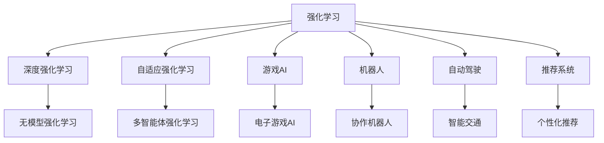

                 

# 强化学习：未来发展动向预测

> 关键词：强化学习, 深度学习, 自适应, 游戏AI, 机器人, 自动驾驶, 推荐系统, 探索与利用平衡

## 1. 背景介绍

### 1.1 问题由来
强化学习（Reinforcement Learning, RL）是一种基于模型（Model-based）和无模型（Model-free）两种路径的机器学习方法。它通过智能体（Agent）与环境（Environment）的交互，获得关于最优策略（Optimal Policy）的信息，进而实现序列决策问题的解决。强化学习在游戏AI、机器人、自动驾驶、推荐系统等多个领域展现了广泛的应用前景。

当前，强化学习领域已取得了诸多重要突破，如AlphaGo在围棋、AlphaStar在星际争霸等领域的胜利，证明了该技术在智能决策方面的强大能力。然而，该技术仍面临诸多挑战，如可解释性、样本效率、泛化能力等。如何在这些方面进一步提升强化学习技术，使之在未来更广泛地应用，成为当前学术界和工业界关注的焦点。

### 1.2 问题核心关键点
强化学习的核心在于智能体如何从环境奖励中学习最优策略。在模型的自监督训练中，通过序列决策的策略优化，智能体可实现任务目标。未来强化学习的核心挑战包括：

- 提高样本效率：当前强化学习的样本效率低，训练一个智能体通常需要海量样本。如何设计更高效的学习策略，降低对样本量的依赖，是未来研究的重要方向。
- 增强泛化能力：当前强化学习算法在特定环境或任务上表现良好，但在新环境或任务上的泛化能力有限。如何构建更通用的学习框架，提升强化学习的泛化性能，仍是一个重要研究课题。
- 提升可解释性：当前强化学习模型的决策过程常常是"黑箱"，难以解释和调试。如何增强强化学习算法的可解释性，使其透明化、可解释化，将成为强化学习理论的重要发展方向。
- 解决多智能体交互：当前强化学习大多考虑单智能体的决策问题，而在实际场景中，多智能体交互频繁，如交通场景、协作任务等。如何设计和优化多智能体交互策略，使之具有协同性和公平性，是强化学习应用的下一个挑战。
- 提高自适应性：当前强化学习算法难以应对环境动态变化，如自动驾驶中的道路状况变化、机器人协作中的团队成员变更等。如何设计具有高度自适应性的学习框架，使智能体能够快速响应环境变化，是强化学习领域的重要课题。

### 1.3 问题研究意义
研究强化学习的未来发展趋势，对于拓展该技术的应用边界，提升智能化决策系统的性能，具有重要意义：

- 扩展应用场景。强化学习不仅可以应用于游戏、机器人等领域，未来有望在医疗、金融、交通等多个领域取得应用突破，提高这些领域的智能化决策水平。
- 提高决策效率。强化学习能从数据中自动学习最优策略，降低人工决策的复杂性和成本，提高决策效率。
- 推动技术革新。强化学习的不断发展将引领新一轮的技术创新，如自适应、多智能体学习、大规模模型等，为未来技术变革奠定基础。
- 促进行业转型。强化学习的应用将推动各行各业数字化转型，提升经济生产效率和运营效率。
- 实现可持续发展。强化学习助力解决环境污染、资源利用、城市交通等问题，有助于实现可持续发展目标。

## 2. 核心概念与联系

### 2.1 核心概念概述

为了更好地理解强化学习的未来发展趋势，本节将介绍几个密切相关的核心概念：

- 强化学习（Reinforcement Learning, RL）：一种基于模型（Model-based）和无模型（Model-free）两种路径的机器学习方法。通过智能体与环境的交互，智能体学习到最优策略，以实现任务目标。

- 深度强化学习（Deep Reinforcement Learning, DRL）：结合深度神经网络的方法，通过学习和优化神经网络，提升强化学习算法的性能。

- 自适应强化学习（Adaptive Reinforcement Learning）：智能体能够根据环境变化，动态调整学习策略，以提高决策的适应性和鲁棒性。

- 游戏AI（Game AI）：通过强化学习技术，在电子游戏、棋类游戏等场景中，使智能体实现高水平游戏策略的自主学习和优化。

- 机器人（Robotics）：在机器人导航、操作、协作等任务中，利用强化学习技术，使机器人实现高效、自适应的决策。

- 自动驾驶（Autonomous Driving）：通过强化学习技术，实现智能车辆在复杂道路环境中的决策和控制。

- 推荐系统（Recommendation System）：利用强化学习技术，优化用户的推荐效果，提升用户体验。

这些核心概念之间的逻辑关系可以通过以下Mermaid流程图来展示：



这个流程图展示了一些强化学习的主要应用领域和相关概念，以及它们之间的关系。

## 3. 核心算法原理 & 具体操作步骤
### 3.1 算法原理概述

强化学习的基本框架包括智能体（Agent）、环境（Environment）和奖励（Reward）。智能体通过与环境的交互，获得环境状态（State），并根据当前状态和策略（Policy）选择行动（Action），环境根据行动返回奖励，并更新状态，如此往复。通过最大化累积奖励，智能体学习到最优策略。

形式化地，设智能体的状态空间为 $S$，动作空间为 $A$，策略为 $\pi(a|s)$，环境状态为 $s_t$，当前行动为 $a_t$，奖励为 $r_t$。强化学习的目标是在策略 $\pi$ 下，最大化累积奖励：

$$
\max_{\pi} \sum_{t=0}^{\infty} \gamma^t r_t
$$

其中 $\gamma$ 为折扣因子。

基于模型的方法（Model-based RL）通过学习环境模型的动态特性，指导智能体的决策。无模型的方法（Model-free RL）则直接从经验中学习策略，无需显式建模环境。

### 3.2 算法步骤详解

强化学习算法的步骤通常包括：

**Step 1: 环境模拟与数据采集**

- 设计环境模拟器，生成环境状态和动作空间。
- 利用强化学习算法生成经验数据集，包括状态、动作、奖励等。

**Step 2: 学习策略**

- 使用深度神经网络或传统算法（如Q-learning、SARSA），学习最优策略 $\pi$。
- 在策略学习过程中，通过探索-利用平衡（Exploration-Exploitation Balance），找到最优决策路径。

**Step 3: 性能评估**

- 使用测试集或真实环境评估学习策略的性能。
- 根据评估结果调整策略参数，进一步优化决策。

**Step 4: 部署应用**

- 将学习好的策略部署到实际应用环境中，实现智能化决策。

### 3.3 算法优缺点

强化学习算法具有以下优点：

- 能处理序列决策问题。强化学习能自动学习最优决策序列，适应动态环境。
- 具有通用性。强化学习算法在多个领域和任务上具有广泛应用。
- 能处理连续状态和动作空间。通过深度学习，强化学习能处理复杂状态空间和动作空间。

同时，该算法也存在一些局限：

- 样本效率低。当前强化学习算法需要大量样本才能收敛。
- 可解释性差。强化学习算法通常为黑盒模型，决策过程难以解释。
- 泛化能力有限。强化学习算法在特定环境或任务上表现良好，但在新环境或任务上泛化能力有限。
- 多智能体问题复杂。多智能体交互的决策问题复杂，难以找到最优策略。

尽管存在这些局限，但强化学习在处理序列决策问题、复杂系统决策等方面仍具有显著优势，广泛应用于多个领域。

### 3.4 算法应用领域

强化学习技术已经在多个领域取得了显著应用，具体包括：

- 游戏AI：AlphaGo在围棋、AlphaStar在星际争霸等领域的胜利，展示了强化学习的强大决策能力。
- 机器人：在机器人导航、操作、协作等任务中，强化学习技术使机器人实现高效、自适应的决策。
- 自动驾驶：强化学习技术在智能车辆在复杂道路环境中的决策和控制中，展现出优异的性能。
- 推荐系统：利用强化学习技术，优化用户的推荐效果，提升用户体验。
- 医疗：强化学习在医疗诊断、手术模拟、药物研发等任务中，具有广泛的应用前景。
- 金融：强化学习在风险控制、投资策略优化等任务中，具有显著优势。
- 工业：在工业自动化、智能制造等任务中，强化学习技术能提高生产效率和产品质量。

这些应用场景展示了强化学习技术的强大潜力，未来在更多领域的应用前景将更加广阔。

## 4. 数学模型和公式 & 详细讲解 & 举例说明

### 4.1 数学模型构建

强化学习的数学模型主要包括以下几部分：

- 状态空间 $S$：环境的当前状态，可以是连续或离散的。
- 动作空间 $A$：智能体可执行的动作集合。
- 奖励函数 $R(s, a)$：智能体执行动作 $a$ 在状态 $s$ 下获得的奖励。
- 策略 $\pi(a|s)$：智能体在状态 $s$ 下选择动作 $a$ 的概率分布。
- 折扣因子 $\gamma$：反映未来奖励的重要程度，0< $\gamma$ < 1。

形式化地，强化学习的目标是在策略 $\pi$ 下，最大化累积奖励：

$$
\max_{\pi} \sum_{t=0}^{\infty} \gamma^t r_t
$$

在无模型强化学习中，通常使用深度神经网络来逼近最优策略 $\pi$。在此基础上，常见的强化学习算法包括：

- Q-learning：使用神经网络逼近Q值函数，优化策略 $\pi$。
- SARSA：基于时序差分学习，更新Q值函数。
- Policy Gradient：直接优化策略 $\pi$，提升决策性能。
- Actor-Critic：结合策略梯度和价值函数，优化决策性能。

### 4.2 公式推导过程

Q-learning算法使用神经网络逼近Q值函数 $Q(s, a)$，通过最大化累积奖励，学习最优策略 $\pi$。其基本步骤包括：

1. 使用神经网络逼近Q值函数：
$$
Q(s, a) = \theta^T(s, a) \phi(s, a)
$$
其中 $\theta$ 为神经网络参数，$\phi(s, a)$ 为神经网络输入。

2. 定义学习目标：
$$
\max_{\theta} Q(s, a) - \gamma \max_{a'} Q(s', a')
$$
3. 使用时序差分学习更新Q值函数：
$$
\theta \leftarrow \theta - \eta \nabla_{\theta} \sum_{t=0}^{\infty} \gamma^t Q(s, a)
$$
其中 $\eta$ 为学习率。

4. 更新策略：
$$
\pi(a|s) \propto \exp(Q(s, a))
$$
通过优化Q值函数，最终得到最优策略 $\pi$。

### 4.3 案例分析与讲解

以下以AlphaGo为例，分析其强化学习过程：

AlphaGo的核心思想是基于蒙特卡洛树搜索（Monte Carlo Tree Search, MCTS）的强化学习。其策略学习过程包括以下几个关键步骤：

1. 策略网络（Policy Network）：AlphaGo使用神经网络逼近当前策略 $\pi$，通过自适应调整策略，提高决策性能。
2. 值网络（Value Network）：AlphaGo使用神经网络逼近价值函数 $V(s)$，通过策略优化，提升决策的合理性。
3. 蒙特卡洛树搜索：AlphaGo通过蒙特卡洛树搜索，在当前状态 $s$ 下，选择最优动作 $a$，计算累积奖励 $r_t$。
4. 逆向搜索：AlphaGo通过逆向搜索，从最优动作出发，逆向计算策略网络参数 $\theta$，更新策略。

通过这种策略学习过程，AlphaGo在围棋等复杂游戏中展现出强大的决策能力。未来，类似的增强学习框架可能会在更多领域和任务中得到应用。

## 5. 项目实践：代码实例和详细解释说明
### 5.1 开发环境搭建

在进行强化学习实践前，我们需要准备好开发环境。以下是使用Python进行TensorFlow开发的Python环境配置流程：

1. 安装Anaconda：从官网下载并安装Anaconda，用于创建独立的Python环境。

2. 创建并激活虚拟环境：
```bash
conda create -n tf-env python=3.8 
conda activate tf-env
```

3. 安装TensorFlow：根据CUDA版本，从官网获取对应的安装命令。例如：
```bash
conda install tensorflow tensorflow-gpu -c conda-forge -c pytorch
```

4. 安装必要的第三方库：
```bash
pip install gym gym[atari] numpy matplotlib pydot
```

5. 下载并准备OpenAI Gym环境：
```bash
python -m pip install gym[atari]
```

完成上述步骤后，即可在`tf-env`环境中开始强化学习实践。

### 5.2 源代码详细实现

下面以DQN算法在Atari游戏上训练为例，给出使用TensorFlow实现DQN算法的完整代码。

首先，定义DQN模型的神经网络结构：

```python
import tensorflow as tf
import numpy as np

class DQN(tf.keras.Model):
    def __init__(self, input_shape, output_shape):
        super(DQN, self).__init__()
        self.input_shape = input_shape
        self.output_shape = output_shape
        self.layers = []
        self.layers.append(tf.keras.layers.Dense(128, input_shape=input_shape, activation='relu'))
        self.layers.append(tf.keras.layers.Dense(128, activation='relu'))
        self.layers.append(tf.keras.layers.Dense(output_shape, activation='linear'))

    def call(self, inputs):
        x = inputs
        for layer in self.layers:
            x = layer(x)
        return x
```

然后，定义DQN算法的核心步骤：

```python
class DQN:
    def __init__(self, input_shape, output_shape, learning_rate=0.001, gamma=0.99, epsilon=1.0):
        self.model = DQN(input_shape, output_shape)
        self.optimizer = tf.keras.optimizers.Adam(lr=learning_rate)
        self.gamma = gamma
        self.epsilon = epsilon
        self.memory = deque(maxlen=2000)
        self.timestep = 0

    def act(self, state):
        if np.random.rand() <= self.epsilon:
            return random.randrange(output_shape)
        act_values = self.model(tf.expand_dims(state, 0))
        return np.argmax(act_values.numpy()[0])

    def train(self, state, action, reward, next_state, done):
        self.memory.append((state, action, reward, next_state, done))
        if len(self.memory) > batch_size:
            minibatch = random.sample(self.memory, batch_size)
            for state, action, reward, next_state, done in minibatch:
                target = reward
                if not done:
                    target = reward + self.gamma * np.amax(self.model(tf.expand_dims(next_state, 0))['output_0'])
                target_f = tf.convert_to_tensor(target)
                q_target_f = tf.convert_to_tensor(self.model(tf.expand_dims(state, 0))['output_0'])
                q_target = target_f - tf.stop_gradient(q_target_f)
                self.optimizer.minimize(tf.losses.mean_squared_error(labels=q_target, predictions=q_target_f))
```

接着，启动训练流程：

```python
env = atari_env.make(env_name)
state_size = (4, 84, 84)
input_size = state_size[1] * state_size[2]
output_size = env.action_space.n
model = DQN(input_size, output_size)

num_episodes = 2000
batch_size = 32
epsilon = 0.5
for episode in range(num_episodes):
    state = env.reset()
    state = np.reshape(state, state_size)
    done = False
    while not done:
        action = model.act(state)
        next_state, reward, done, _ = env.step(action)
        next_state = np.reshape(next_state, state_size)
        model.train(state, action, reward, next_state, done)
        state = next_state
        if done:
            state = env.reset()
            state = np.reshape(state, state_size)
```

以上就是使用TensorFlow实现DQN算法在Atari游戏上训练的完整代码实现。

### 5.3 代码解读与分析

让我们再详细解读一下关键代码的实现细节：

**DQN模型定义**：
- `DQN`类定义了DQN模型的神经网络结构，包括三个全连接层。

**DQN算法实现**：
- `act`方法：根据策略和探索-利用平衡，选择当前动作。
- `train`方法：使用DQN算法更新模型参数，基于样本经验数据。
- `memory`：记录历史状态、动作、奖励等数据，用于训练。

**训练过程**：
- `env`：初始化OpenAI Gym环境。
- `state_size`：定义状态输入的形状。
- `input_size`：计算输入向量维度。
- `output_size`：定义动作输出的维度。
- `model`：实例化DQN模型。
- `num_episodes`：定义训练轮数。
- `batch_size`：定义每次训练的批量大小。
- `epsilon`：定义探索-利用平衡的阈值。

通过这些代码，可以看到DQN算法的实现相对简洁，通过神经网络和经验回放等技术，使智能体能够从经验数据中学习最优策略。

当然，工业级的系统实现还需考虑更多因素，如模型的保存和部署、超参数的自动搜索、更灵活的决策策略等。但核心的强化学习范式基本与此类似。

## 6. 实际应用场景
### 6.1 游戏AI

强化学习在游戏AI中已经取得了重要突破，AlphaGo等算法在围棋、星际争霸等复杂游戏中展现了强大的决策能力。未来，该技术有望进一步应用于更多的电子游戏领域，提升游戏AI的智能化水平。

**应用场景**：
- 策略游戏：如策略游戏《星际争霸》，通过强化学习训练智能体，使其在对战中展现高水平策略。
- 射击游戏：如《使命召唤》系列游戏，利用强化学习训练AI角色，提升游戏体验。
- 角色扮演游戏：如《巫师3：狂猎》，通过强化学习优化NPC行为，丰富游戏内容。

### 6.2 机器人

强化学习在机器人领域也展现出了强大的应用潜力。未来，该技术有望在协作机器人、服务机器人、自主机器人等领域取得更多突破。

**应用场景**：
- 协作机器人：如协作机器人帮助工厂自动化生产，通过强化学习优化操作策略。
- 服务机器人：如扫地机器人，通过强化学习优化路径规划和避障策略。
- 自主机器人：如无人驾驶汽车，通过强化学习优化交通决策，提高安全性和效率。

### 6.3 自动驾驶

自动驾驶技术依赖于复杂的决策系统和感知算法，强化学习技术在该领域中展现了广泛的应用前景。未来，该技术有望在无人驾驶汽车、无人配送等领域取得更多突破。

**应用场景**：
- 无人驾驶汽车：通过强化学习优化车辆行为策略，提高安全性和通行效率。
- 无人配送：如无人配送无人机，通过强化学习优化路径规划和避障策略。

### 6.4 推荐系统

强化学习在推荐系统中也具有广泛应用。通过优化用户推荐效果，提升用户体验。

**应用场景**：
- 视频推荐：如Netflix，通过强化学习优化用户视频推荐。
- 音乐推荐：如Spotify，通过强化学习优化用户音乐推荐。
- 电商推荐：如亚马逊，通过强化学习优化商品推荐。

## 7. 工具和资源推荐
### 7.1 学习资源推荐

为了帮助开发者系统掌握强化学习的理论基础和实践技巧，这里推荐一些优质的学习资源：

1. 《强化学习：一种现代方法》（Reinforcement Learning: An Introduction）：Sutton和Barto的经典之作，详细介绍了强化学习的基本原理和算法。
2. 《深度强化学习》（Deep Reinforcement Learning）：Hands-On课程，通过代码实例，展示了深度强化学习的实际应用。
3. CS285《强化学习》课程：加州大学伯克利分校开设的强化学习课程，涵盖了强化学习的多种算法和技术。
4. OpenAI Gym：一个开源的环境库，用于实验强化学习算法。
5. TensorFlow Agents：TensorFlow的强化学习库，提供了丰富的算法和工具。

通过这些资源的学习实践，相信你一定能够快速掌握强化学习的精髓，并用于解决实际的决策问题。
###  7.2 开发工具推荐

高效的开发离不开优秀的工具支持。以下是几款用于强化学习开发的常用工具：

1. TensorFlow：由Google主导开发的开源深度学习框架，生产部署方便，适合大规模工程应用。
2. PyTorch：基于Python的开源深度学习框架，灵活动态的计算图，适合快速迭代研究。
3. OpenAI Gym：一个开源的环境库，用于实验强化学习算法。
4. TensorFlow Agents：TensorFlow的强化学习库，提供了丰富的算法和工具。
5. Ray：一个分布式深度学习框架，支持多智能体学习、分布式训练等功能。
6. PyBullet：一个物理引擎库，用于模拟机器人、环境交互。

合理利用这些工具，可以显著提升强化学习开发和研究的效率，加快创新迭代的步伐。

### 7.3 相关论文推荐

强化学习领域已取得了诸多重要突破，以下是几篇奠基性的相关论文，推荐阅读：

1. Q-Learning：Tomas P Reinforcement Learning：Q-learning by Exploration：Low-memory Implementation，O(N) with Nearest Neighbor Graphs：Policy Error Bounds and Data Dependent Convergence（1988）：Q-Learning算法，奠定了强化学习的基础。

2. AlphaGo论文：Mastering the Game of Go with Deep Neural Networks and Tree Search（2016）：AlphaGo在围棋中的胜利，展示了强化学习在复杂游戏中的强大决策能力。

3. Soft Actor-Critic：Off-Policy Maximum Entropy Deep Reinforcement Learning with a Stochastic Actor Network（2017）：Soft Actor-Critic算法，进一步提升了强化学习的性能。

4. A3C：Asynchronous Methods for Deep Reinforcement Learning（2016）：A3C算法，利用多线程技术，提升了强化学习的样本效率。

5. GANs for Discrete Values（2016）：通过生成对抗网络（GAN）优化策略，进一步提升了强化学习的性能。

这些论文代表了大强化学习领域的研究进展，通过学习这些前沿成果，可以帮助研究者把握学科前进方向，激发更多的创新灵感。

## 8. 总结：未来发展趋势与挑战

### 8.1 研究成果总结

本文对强化学习的未来发展趋势进行了全面系统的介绍。首先阐述了强化学习的研究背景和意义，明确了强化学习在多个领域和任务上的应用潜力。其次，从原理到实践，详细讲解了强化学习的核心算法和操作步骤，给出了完整的代码实现。同时，本文还探讨了强化学习在多智能体交互、自适应性、可解释性等方面的发展方向，以及未来在电子游戏、机器人、自动驾驶、推荐系统等领域的应用前景。

通过本文的系统梳理，可以看到，强化学习技术在序列决策问题、复杂系统决策等方面具有显著优势，未来在更多领域的应用前景将更加广阔。

### 8.2 未来发展趋势

展望未来，强化学习领域将呈现以下几个发展趋势：

1. 提高样本效率：未来强化学习算法将通过引入更多的探索机制，提升样本利用率，降低对样本量的依赖。
2. 增强泛化能力：未来强化学习算法将更多地借鉴深度学习中的自监督学习、数据增强等技术，提升泛化性能。
3. 提升可解释性：未来强化学习算法将更多地引入可解释性技术，如因果推断、生成对抗网络等，使决策过程透明化。
4. 解决多智能体交互：未来强化学习算法将更多地应用于多智能体交互场景，如交通场景、协作任务等，提升协同性和公平性。
5. 提高自适应性：未来强化学习算法将更多地借鉴自适应控制、多目标优化等技术，提升智能体的自适应能力。

这些发展趋势凸显了强化学习技术的广泛应用前景，必将进一步推动该技术的落地应用。

### 8.3 面临的挑战

尽管强化学习在多个领域取得了重要突破，但仍面临诸多挑战：

1. 可解释性问题：强化学习算法通常为黑盒模型，难以解释和调试。如何增强算法的可解释性，使其透明化、可解释化，将成为未来研究的重要方向。
2. 样本效率低：当前强化学习算法需要大量样本才能收敛，如何设计更高效的学习策略，降低对样本量的依赖，是未来研究的重要课题。
3. 泛化能力有限：强化学习算法在特定环境或任务上表现良好，但在新环境或任务上泛化能力有限。如何构建更通用的学习框架，提升泛化性能，仍是一个重要研究课题。
4. 多智能体问题复杂：多智能体交互的决策问题复杂，难以找到最优策略。如何设计和优化多智能体交互策略，使之具有协同性和公平性，是强化学习应用的下一个挑战。
5. 自适应能力不足：当前强化学习算法难以应对环境动态变化，如自动驾驶中的道路状况变化、机器人协作中的团队成员变更等。如何设计具有高度自适应性的学习框架，使智能体能够快速响应环境变化，是强化学习领域的重要课题。

尽管存在这些挑战，但强化学习在处理序列决策问题、复杂系统决策等方面仍具有显著优势，未来在更多领域的应用前景将更加广阔。

### 8.4 研究展望

面对强化学习所面临的挑战，未来的研究需要在以下几个方面寻求新的突破：

1. 探索无监督和半监督强化学习方法：摆脱对大规模标注数据的依赖，利用自监督学习、主动学习等无监督和半监督范式，最大限度利用非结构化数据，实现更加灵活高效的强化学习。
2. 研究参数高效和计算高效的强化学习范式：开发更加参数高效的强化学习算法，如Soft Actor-Critic、Proximal Policy Optimization等，在固定大部分预训练参数的同时，只更新极少量的任务相关参数。同时优化算法计算图，减少前向传播和反向传播的资源消耗，实现更加轻量级、实时性的部署。
3. 融合因果和对比学习范式：通过引入因果推断和对比学习思想，增强强化学习算法的泛化能力和自适应性，学习更加普适、鲁棒的语言表征，从而提升模型泛化性和抗干扰能力。
4. 引入更多先验知识：将符号化的先验知识，如知识图谱、逻辑规则等，与神经网络模型进行巧妙融合，引导强化学习过程学习更准确、合理的语言模型。同时加强不同模态数据的整合，实现视觉、语音等多模态信息与文本信息的协同建模。
5. 结合因果分析和博弈论工具：将因果分析方法引入强化学习算法，识别出模型决策的关键特征，增强输出解释的因果性和逻辑性。借助博弈论工具刻画人机交互过程，主动探索并规避模型的脆弱点，提高系统稳定性。
6. 纳入伦理道德约束：在模型训练目标中引入伦理导向的评估指标，过滤和惩罚有偏见、有害的输出倾向。同时加强人工干预和审核，建立模型行为的监管机制，确保输出符合人类价值观和伦理道德。

这些研究方向的探索，必将引领强化学习技术迈向更高的台阶，为构建安全、可靠、可解释、可控的智能系统铺平道路。面向未来，强化学习技术还需要与其他人工智能技术进行更深入的融合，如知识表示、因果推理、强化学习等，多路径协同发力，共同推动人工智能技术进步。只有勇于创新、敢于突破，才能不断拓展强化学习模型的边界，让智能技术更好地造福人类社会。

## 9. 附录：常见问题与解答

**Q1：强化学习是否适用于所有决策问题？**

A: 强化学习通常适用于决策问题具有序列性质、环境动态变化的情况。如电子游戏、机器人、自动驾驶等场景，强化学习可以发挥重要作用。但在一些静态决策问题，如数据分析、图像分类等，强化学习可能并不适用。

**Q2：强化学习的收敛速度如何？**

A: 强化学习的收敛速度通常取决于算法的样本效率和探索策略。当前强化学习算法需要大量样本才能收敛。如何设计更高效的学习策略，降低对样本量的依赖，是未来研究的重要方向。

**Q3：强化学习是否需要大量标注数据？**

A: 强化学习通常不需要标注数据，通过与环境的交互，智能体可以自动学习最优策略。但样本效率低，需要大量环境交互才能收敛。未来可以考虑引入自监督学习、主动学习等方法，提升样本利用率。

**Q4：强化学习的泛化能力如何？**

A: 当前强化学习算法在特定环境或任务上表现良好，但在新环境或任务上泛化能力有限。如何构建更通用的学习框架，提升泛化性能，仍是一个重要研究课题。

**Q5：强化学习是否需要高维度状态空间？**

A: 强化学习可以处理高维度状态空间，通过深度神经网络逼近价值函数或策略，实现复杂决策问题的优化。但高维度状态空间可能导致计算开销增加，需要合理设计状态表示方法。

**Q6：强化学习是否具有可解释性？**

A: 当前强化学习算法通常为黑盒模型，难以解释和调试。如何增强算法的可解释性，使其透明化、可解释化，将成为未来研究的重要方向。

通过这些常见问题的解答，相信你对强化学习的基本原理和应用前景有了更清晰的认识。未来，随着强化学习技术的不断发展，其在更多领域的应用前景将更加广阔。相信在学界和产业界的共同努力下，强化学习技术必将取得更多突破，推动人工智能技术进步。

