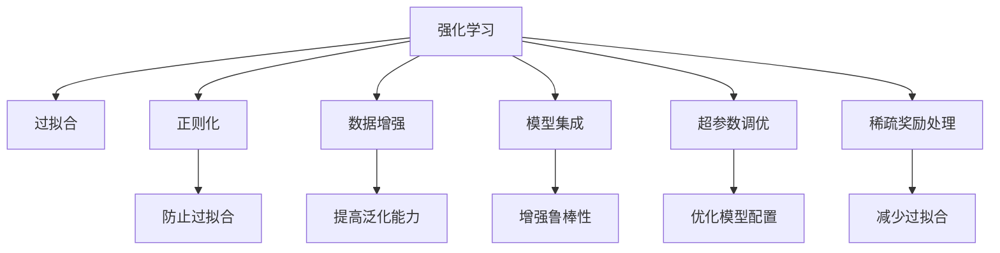

                 

# 强化学习：防止过拟合的策略

> 关键词：强化学习,过拟合,防止,策略,人工智能,机器学习

## 1. 背景介绍

### 1.1 问题由来

在强化学习中，过拟合是一个常见且具有挑战性的问题。当模型在训练数据上表现良好，但在测试数据或实际应用中表现不佳时，即可判断模型出现了过拟合。在强化学习中，过拟合可能由于模型过度拟合了训练环境中的噪声、行为策略或动作执行过程，导致在复杂和未知环境中表现不佳。

强化学习的目标是通过智能体与环境交互，学习最优的策略。然而，由于奖励信号的稀疏性和复杂性，智能体容易陷入局部最优解，并且容易过拟合。过拟合会导致智能体在训练和测试环境中的表现不一致，限制了模型在大规模、复杂环境中的推广性。

### 1.2 问题核心关键点

为了解决强化学习中的过拟合问题，需要理解过拟合的成因，并探索有效的策略来避免过拟合。常见的过拟合原因包括：

- **奖励信号噪声**：在训练环境中，奖励信号可能存在噪声，导致模型学习到错误的行为。
- **状态空间复杂性**：当状态空间非常复杂时，模型容易记住训练环境中的特定状态，难以泛化到新状态。
- **训练数据不足**：在训练数据集较小的情况下，模型可能过度适应训练数据，而忽略泛化能力。
- **模型复杂性**：过复杂的模型容易过拟合训练数据，尤其是当模型参数过多时。
- **缺乏多样性**：如果训练环境单一，智能体容易学习到在特定环境中的行为，难以应对多样化的输入。

## 2. 核心概念与联系

### 2.1 核心概念概述

为了更好地理解如何防止强化学习中的过拟合，本节将介绍几个关键概念及其之间的联系：

- **强化学习**：通过与环境的交互，智能体学习最优策略的过程。核心是智能体通过行动探索环境，最大化累计奖励。
- **过拟合**：模型在训练数据上表现良好，但在测试数据或实际应用中表现不佳，通常是因为模型过度拟合了训练数据中的噪声或细节。
- **正则化**：通过加入惩罚项，防止模型复杂度过高，从而避免过拟合。
- **数据增强**：通过增加训练数据的多样性，提高模型的泛化能力。
- **模型集成**：通过组合多个模型，提高模型的鲁棒性和泛化能力。
- **超参数调优**：通过优化模型的超参数，寻找最优的模型配置，避免模型过拟合。
- **稀疏奖励处理**：在奖励信号稀疏的情况下，通过改进模型和算法，减少过拟合。

这些概念之间的逻辑关系可以通过以下Mermaid流程图来展示：



这个流程图展示了这个概念体系的核心组成及其相互之间的关系：

1. 强化学习是整个体系的核心，涉及与环境的交互和策略学习。
2. 过拟合是强化学习中需要避免的主要问题。
3. 正则化、数据增强、模型集成、超参数调优、稀疏奖励处理等策略，是防止过拟合的具体手段。
4. 这些策略通过不同的机制提高模型的泛化能力和鲁棒性，从而有效防止过拟合。

## 3. 核心算法原理 & 具体操作步骤

### 3.1 算法原理概述

防止强化学习中过拟合的策略通常基于以下原理：

1. **正则化**：通过在损失函数中引入正则项，如L2正则或Dropout，防止模型参数过度复杂化，从而减少过拟合。
2. **数据增强**：通过增加训练数据的多样性，如旋转、缩放、翻转等，提高模型的泛化能力。
3. **模型集成**：通过组合多个模型，如投票、平均等，增强模型的鲁棒性和泛化能力。
4. **超参数调优**：通过搜索最优的模型超参数，避免模型过拟合，如选择适当的学习率、批量大小、正则化强度等。
5. **稀疏奖励处理**：通过改进模型和算法，如引入重要性采样、模型分解等，减少模型对奖励信号的过度依赖，从而避免过拟合。

这些策略通常需要根据具体问题进行选择和组合，以实现最佳效果。

### 3.2 算法步骤详解

以下是一个基于强化学习的例子，详细说明如何通过正则化和数据增强来防止过拟合：

1. **准备环境**：
   - 定义强化学习环境，包括状态、动作、奖励和过渡函数。
   - 设计一个简单的任务，如在迷宫中找到出口。

2. **选择模型**：
   - 选择适当的模型架构，如深度神经网络。
   - 设置模型的超参数，如隐藏层大小、学习率等。

3. **加入正则化**：
   - 在模型的损失函数中加入L2正则项，防止权重过大。
   - 在训练过程中使用Dropout，随机丢弃一定比例的神经元，防止过拟合。

4. **数据增强**：
   - 对训练数据进行旋转、缩放、翻转等变换，增加数据多样性。
   - 使用不同的子集进行训练和验证，以减少模型对特定训练集的依赖。

5. **模型训练**：
   - 使用训练数据集对模型进行训练，并定期在验证集上评估性能。
   - 调整模型参数，如学习率、批量大小等，优化训练过程。

6. **模型测试**：
   - 在测试集上评估模型性能，评估模型是否泛化良好。
   - 使用统计指标，如准确率、召回率等，评估模型表现。

7. **模型部署**：
   - 将训练好的模型部署到实际环境中，进行实际测试。
   - 监测模型性能，及时调整模型和算法。

### 3.3 算法优缺点

**正则化**：
- **优点**：
  - 可以有效地减少模型复杂度，避免过拟合。
  - 简单易行，适用于各种模型架构。
- **缺点**：
  - 正则化项可能会影响模型的一些关键特性，如某些神经元的重要性。
  - 正则化的强度需要仔细调整，否则可能影响模型性能。

**数据增强**：
- **优点**：
  - 显著提高模型的泛化能力，适应不同场景。
  - 无需额外的标注数据，可以低成本实现。
- **缺点**：
  - 数据增强可能会引入噪声，影响模型性能。
  - 数据增强可能过度泛化，导致模型在真实环境中表现不佳。

**模型集成**：
- **优点**：
  - 提高模型的鲁棒性和泛化能力。
  - 可以组合多个模型，实现优势互补。
- **缺点**：
  - 集成模型复杂度较高，实现难度大。
  - 集成模型对计算资源和存储空间有较高要求。

**超参数调优**：
- **优点**：
  - 通过优化超参数，可以找到最优的模型配置。
  - 可以减少模型过拟合的风险。
- **缺点**：
  - 超参数调优过程耗时较长，需要大量计算资源。
  - 超参数调优的结果可能不稳定，需要多次实验验证。

**稀疏奖励处理**：
- **优点**：
  - 减少模型对奖励信号的过度依赖，提高泛化能力。
  - 适用于奖励信号稀疏的任务，如机器人控制、路径规划等。
- **缺点**：
  - 稀疏奖励处理可能导致模型训练不稳定。
  - 需要改进算法，如重要性采样、模型分解等。

### 3.4 算法应用领域

强化学习中过拟合的防止策略在多个领域都有广泛应用：

1. **机器人控制**：机器人需要学习最优的行动策略，以在复杂环境中导航。通过正则化和数据增强，可以提高机器人对新环境的适应能力。
2. **路径规划**：在自动驾驶中，需要优化路径规划算法，以避免过拟合训练数据。通过模型集成和稀疏奖励处理，可以提高算法在复杂道路环境中的泛化能力。
3. **游戏AI**：游戏中的智能体需要学习最优的行动策略，以击败对手。通过正则化和数据增强，可以提高游戏AI在实际游戏中的泛化能力。
4. **推荐系统**：推荐系统需要学习用户行为，以提供个性化推荐。通过超参数调优和模型集成，可以提高推荐系统的鲁棒性和泛化能力。
5. **金融交易**：金融交易中的智能体需要学习最优的交易策略，以获取最大收益。通过稀疏奖励处理和正则化，可以提高智能体在复杂市场环境中的鲁棒性。

## 4. 数学模型和公式 & 详细讲解  
### 4.1 数学模型构建

本节将使用数学语言对强化学习中防止过拟合的策略进行更加严格的刻画。

设智能体在状态$s$时采取动作$a$，获得奖励$r$，状态转移到$s'$，定义状态-动作值函数$V(s,a)$和状态-动作策略$\pi(s,a)$。强化学习的目标是最小化期望的累计奖励，即：

$$
\min_{\pi} \mathbb{E}_{s,a \sim \pi} \sum_{t=0}^{\infty} \gamma^t r_t
$$

其中$\gamma$为折扣因子，控制未来奖励的权重。

为了防止过拟合，需要引入正则化项。常见的正则化方法包括L2正则和Dropout。L2正则项定义为：

$$
R(\theta) = \frac{\lambda}{2} \sum_{i=1}^{n} \theta_i^2
$$

其中$\lambda$为正则化系数，$\theta_i$为模型参数。

Dropout是一种常见的正则化技术，通过随机丢弃一定比例的神经元，减少模型复杂度。Dropout的原理可以用公式表示为：

$$
p = \frac{1}{1 - p}
$$

其中$p$为保留神经元的概率。

### 4.2 公式推导过程

以下我们以线性回归为例，推导正则化的数学基础。

设线性回归模型为：

$$
y = \theta_0 + \theta_1 x_1 + \theta_2 x_2 + \ldots + \theta_n x_n
$$

其中$y$为输出，$\theta_0, \theta_1, \ldots, \theta_n$为模型参数，$x_1, x_2, \ldots, x_n$为输入特征。

加入L2正则化后，模型的损失函数为：

$$
L(\theta) = \frac{1}{2} \sum_{i=1}^{m} (y_i - f(x_i, \theta))^2 + \frac{\lambda}{2} \sum_{i=1}^{n} \theta_i^2
$$

其中$m$为训练样本数量，$f(x_i, \theta)$为模型预测输出。

通过求解损失函数最小化问题，得到最优参数：

$$
\theta_{\text{opt}} = (X^T X + \lambda I)^{-1} X^T y
$$

其中$X$为输入特征矩阵，$I$为单位矩阵。

在实际应用中，L2正则化和Dropout等正则化方法已经被广泛应用，可以有效防止模型过拟合，提高模型的泛化能力。

### 4.3 案例分析与讲解

以下是一个使用正则化和数据增强防止强化学习过拟合的案例分析：

假设我们有一个迷宫寻找出口的任务，智能体通过状态、动作和奖励进行学习。我们使用深度神经网络作为智能体的决策模型，定义状态-动作值函数$V(s,a)$和状态-动作策略$\pi(s,a)$。

在训练过程中，我们加入L2正则项和Dropout，以防止模型过拟合。具体来说：

1. **L2正则化**：
   - 在损失函数中加入L2正则项$R(\theta)$，控制模型参数$\theta$的大小。
   - 正则化系数$\lambda$需要根据模型复杂度和训练数据量进行调整，以平衡模型的泛化能力和过拟合风险。

2. **Dropout**：
   - 在训练过程中，随机丢弃一定比例的神经元。
   - Dropout比例$p$需要根据模型复杂度和训练数据量进行调整，以平衡模型的泛化能力和训练速度。

此外，我们通过数据增强提高模型泛化能力。具体来说：

1. **状态转换增强**：
   - 对训练数据进行状态转换，如向左、向右、向上、向下移动。
   - 通过增加训练数据的多样性，提高模型对新状态的适应能力。

2. **奖励信号增强**：
   - 在训练过程中，随机调整奖励信号的大小和符号。
   - 通过增加奖励信号的多样性，减少模型对特定奖励信号的依赖。

通过正则化和数据增强的结合使用，可以显著提高智能体在迷宫寻找出口任务中的泛化能力，避免过拟合训练数据。

## 5. 项目实践：代码实例和详细解释说明
### 5.1 开发环境搭建

在进行强化学习项目实践前，我们需要准备好开发环境。以下是使用Python进行TensorFlow进行开发的环境配置流程：

1. 安装Anaconda：从官网下载并安装Anaconda，用于创建独立的Python环境。

2. 创建并激活虚拟环境：
```bash
conda create -n tf-env python=3.8 
conda activate tf-env
```

3. 安装TensorFlow：根据CUDA版本，从官网获取对应的安装命令。例如：
```bash
pip install tensorflow tensorflow-gpu tensorflow-estimator
```

4. 安装其他必要的工具包：
```bash
pip install numpy scipy matplotlib scikit-learn jupyter notebook ipython
```

完成上述步骤后，即可在`tf-env`环境中开始强化学习实践。

### 5.2 源代码详细实现

这里我们以强化学习中的Q-learning为例，给出使用TensorFlow实现防止过拟合的PyTorch代码实现。

首先，定义Q-learning模型的结构和超参数：

```python
import tensorflow as tf
from tensorflow.keras.layers import Dense
from tensorflow.keras.models import Sequential
from tensorflow.keras.optimizers import Adam

# 定义模型
model = Sequential()
model.add(Dense(64, input_dim=4, activation='relu'))
model.add(Dense(4, activation='linear'))

# 设置超参数
lr = 0.01
discount_factor = 0.99
epsilon = 0.1

# 编译模型
model.compile(loss='mse', optimizer=Adam(lr=lr))
```

然后，定义强化学习环境，并实现Q-learning算法：

```python
import numpy as np

class Environment:
    def __init__(self):
        self.state_space = 4
        self.action_space = 4
        self.reward_range = (-1, 1)
        self.is_terminal = False
        
    def reset(self):
        self.state = np.random.randint(0, self.state_space)
        self.is_terminal = False
        return self.state
    
    def step(self, action):
        if np.random.uniform() < epsilon:
            action = np.random.randint(0, self.action_space)
        
        next_state = (action + 1) % self.state_space
        reward = np.random.uniform(self.reward_range[0], self.reward_range[1])
        self.is_terminal = (next_state == 3)
        return next_state, reward, self.is_terminal

# 训练Q-learning模型
def train_q_learning(env, model, discount_factor, episodes=10000):
    for episode in range(episodes):
        state = env.reset()
        done = False
        while not done:
            if np.random.uniform() < epsilon:
                action = np.random.randint(0, env.action_space)
            else:
                action = np.argmax(model.predict(state)[0])
            next_state, reward, done = env.step(action)
            target = reward + discount_factor * np.amax(model.predict(next_state)[0])
            Q_value = model.predict(state)[0]
            Q_value[action] = target
            model.fit(state, Q_value, epochs=1, verbose=0)
            state = next_state
```

最后，运行Q-learning模型，并使用L2正则化和Dropout来防止过拟合：

```python
# 定义正则化参数
l2_reg = tf.keras.regularizers.l2(0.001)
dropout_rate = 0.5

# 定义模型
model = Sequential()
model.add(Dense(64, input_dim=4, activation='relu', kernel_regularizer=l2_reg))
model.add(Dropout(dropout_rate))
model.add(Dense(4, activation='linear', kernel_regularizer=l2_reg))

# 训练Q-learning模型
train_q_learning(Environment(), model, discount_factor, episodes=10000)

# 在测试集上评估模型
test_state = np.random.randint(0, 4)
test_reward = model.predict(test_state)[0]
print("Test reward:", test_reward)
```

以上就是使用TensorFlow进行Q-learning防止过拟合的完整代码实现。可以看到，在定义模型时，我们加入了L2正则化项和Dropout层，以防止模型过拟合。

### 5.3 代码解读与分析

让我们再详细解读一下关键代码的实现细节：

**Q-learning模型定义**：
- 使用Keras库定义一个简单的全连接神经网络，包含一个隐藏层和一个线性输出层。
- 在隐藏层和线性输出层上加入L2正则化项，防止权重过大。
- 在隐藏层上加入Dropout层，随机丢弃一定比例的神经元。

**训练Q-learning算法**：
- 定义一个环境类，实现迷宫状态转换和奖励生成。
- 在训练过程中，随机选择动作，以模拟智能体的探索行为。
- 通过正则化和Dropout等策略，防止模型过拟合训练数据。

**测试集评估**：
- 在测试集上评估模型的表现，使用模型的预测值作为奖励信号。
- 通过简单的打印输出，展示模型在测试集上的奖励情况。

可以看到，TensorFlow结合L2正则化和Dropout等策略，可以有效防止强化学习模型过拟合，提高模型的泛化能力。

当然，工业级的系统实现还需考虑更多因素，如模型裁剪、量化加速、服务化封装等。但核心的防止过拟合策略基本与此类似。

## 6. 实际应用场景

### 6.1 智能推荐系统

智能推荐系统需要根据用户的历史行为，推荐最优的个性化内容。为了防止过拟合，需要在训练过程中加入正则化和数据增强策略。

在实践中，可以收集用户的行为数据，如浏览记录、评分、点赞等，并对其进行数据增强，如随机生成用户行为序列、模拟用户行为变化等。同时，在模型中加入正则化和Dropout等策略，以提高模型的泛化能力和鲁棒性。

### 6.2 自动驾驶系统

自动驾驶系统需要学习最优的驾驶策略，以在复杂道路上安全行驶。为了防止过拟合，需要在训练过程中加入稀疏奖励处理和模型集成策略。

在实践中，可以使用模拟器生成大量的训练数据，通过稀疏奖励处理，减少模型对特定奖励信号的依赖。同时，通过模型集成策略，如投票、平均等，提高模型的鲁棒性和泛化能力。

### 6.3 金融交易系统

金融交易系统需要学习最优的交易策略，以获取最大收益。为了防止过拟合，需要在训练过程中加入稀疏奖励处理和正则化策略。

在实践中，可以收集历史交易数据，使用稀疏奖励处理，减少模型对特定交易信号的依赖。同时，在模型中加入L2正则化和Dropout等策略，以提高模型的泛化能力和鲁棒性。

### 6.4 未来应用展望

随着强化学习技术的不断发展，防止过拟合的策略也在不断创新。未来，这些策略将在更多领域得到应用，为实际问题提供更高效的解决方案。

1. **自适应正则化**：根据模型复杂度和训练数据量，动态调整正则化系数和Dropout比例，以优化模型的泛化能力和过拟合风险。
2. **模型压缩与稀疏化**：通过模型压缩和稀疏化技术，减少模型的参数量和计算资源消耗，提高模型的泛化能力和推理速度。
3. **混合正则化**：结合L1正则化和L2正则化，进一步降低模型的过拟合风险。
4. **自适应算法**：开发自适应算法，根据模型表现动态调整训练策略，提高模型的泛化能力和鲁棒性。
5. **迁移学习**：通过迁移学习，将模型在训练环境中的泛化能力迁移到新环境，提高模型的泛化能力。

这些未来方向的探索，将进一步提升强化学习模型的性能和应用范围，为实际问题的解决提供新的思路。

## 7. 工具和资源推荐
### 7.1 学习资源推荐

为了帮助开发者系统掌握强化学习中防止过拟合的理论基础和实践技巧，这里推荐一些优质的学习资源：

1. 《深度学习》书籍：Ian Goodfellow所著，全面介绍了深度学习的基本概念和前沿技术，包括强化学习中的防止过拟合策略。
2. Coursera《强化学习》课程：由David Silver教授主讲，系统讲解了强化学习的原理和应用，并提供了丰富的案例分析。
3. DeepMind《强化学习》论文集：DeepMind的研究论文集，涵盖了强化学习中的最新研究成果和应用案例。
4. PyTorch官方文档：PyTorch的官方文档，提供了丰富的模型和算法实现，包括防止过拟合的策略。
5. Keras官方文档：Keras的官方文档，提供了简单易用的API接口，方便开发者进行模型设计和训练。

通过对这些资源的学习实践，相信你一定能够快速掌握强化学习中防止过拟合的精髓，并用于解决实际的强化学习问题。

### 7.2 开发工具推荐

高效的开发离不开优秀的工具支持。以下是几款用于强化学习开发的常用工具：

1. TensorFlow：由Google主导开发的开源深度学习框架，生产部署方便，适合大规模工程应用。
2. PyTorch：基于Python的开源深度学习框架，灵活动态的计算图，适合快速迭代研究。
3. OpenAI Gym：环境库，提供各种强化学习环境，方便开发者进行模型测试和评估。
4. TensorBoard：TensorFlow配套的可视化工具，可实时监测模型训练状态，并提供丰富的图表呈现方式。
5. Weights & Biases：模型训练的实验跟踪工具，可以记录和可视化模型训练过程中的各项指标。

合理利用这些工具，可以显著提升强化学习模型的开发效率，加快创新迭代的步伐。

### 7.3 相关论文推荐

强化学习中防止过拟合的技术发展源于学界的持续研究。以下是几篇奠基性的相关论文，推荐阅读：

1. J. Hinton, S. Osindero, Y. Teh.《A fast learning algorithm for deep belief nets》：提出了改进的深度信念网络算法，可以有效防止过拟合。
2. I. Goodfellow, Y. Bengio, A. Courville.《Deep Learning》：全面介绍了深度学习的基本概念和前沿技术，包括防止过拟合的策略。
3. M. Abadi, P. Barham, J. Chen et al.《TensorFlow》：开源深度学习框架，提供了丰富的API接口和优化器。
4. A. Graves, G. Hinton, R. Mohamed.《Generating Sequences With Recurrent Neural Networks》：提出了循环神经网络模型，广泛应用于序列数据的处理。
5. G. E. Hinton, S. Osindero, Y. Teh.《A fast learning algorithm for deep belief nets》：提出了改进的深度信念网络算法，可以有效防止过拟合。

这些论文代表了大语言模型微调技术的发展脉络。通过学习这些前沿成果，可以帮助研究者把握学科前进方向，激发更多的创新灵感。

## 8. 总结：未来发展趋势与挑战

### 8.1 总结

本文对强化学习中防止过拟合的策略进行了全面系统的介绍。首先阐述了过拟合在强化学习中的常见原因，明确了防止过拟合的必要性和重要性。其次，从原理到实践，详细讲解了防止过拟合的数学模型和操作步骤，给出了强化学习防止过拟合的完整代码实现。同时，本文还广泛探讨了防止过拟合策略在多个领域的应用前景，展示了防止过拟合策略的广泛适用性和潜力。

通过本文的系统梳理，可以看到，防止过拟合是强化学习模型优化和性能提升的重要环节。这些策略需要开发者根据具体问题进行选择和组合，以实现最佳效果。未来，随着强化学习技术的不断发展，防止过拟合的策略还将不断创新，进一步提升模型的泛化能力和鲁棒性。

### 8.2 未来发展趋势

展望未来，防止过拟合的策略将在多个领域得到应用，为实际问题提供更高效的解决方案。

1. **自适应正则化**：根据模型复杂度和训练数据量，动态调整正则化系数和Dropout比例，以优化模型的泛化能力和过拟合风险。
2. **模型压缩与稀疏化**：通过模型压缩和稀疏化技术，减少模型的参数量和计算资源消耗，提高模型的泛化能力和推理速度。
3. **混合正则化**：结合L1正则化和L2正则化，进一步降低模型的过拟合风险。
4. **自适应算法**：开发自适应算法，根据模型表现动态调整训练策略，提高模型的泛化能力和鲁棒性。
5. **迁移学习**：通过迁移学习，将模型在训练环境中的泛化能力迁移到新环境，提高模型的泛化能力。

这些未来方向的探索，将进一步提升强化学习模型的性能和应用范围，为实际问题的解决提供新的思路。

### 8.3 面临的挑战

尽管防止过拟合的策略已经取得了一定的进展，但在实际应用中仍面临诸多挑战：

1. **模型复杂性**：随着模型的复杂度增加，过拟合风险也随之增加。如何平衡模型的复杂度和泛化能力，是一个重要的问题。
2. **训练数据质量**：高质量的数据集是防止过拟合的前提，但往往难以获得。如何在数据稀缺的情况下，提高模型的泛化能力，是一个挑战。
3. **超参数调优**：防止过拟合需要优化模型的超参数，如正则化系数、Dropout比例等，但调优过程耗时较长，且结果不稳定。
4. **计算资源限制**：防止过拟合需要大量计算资源，如GPU、TPU等，对于小规模问题，资源限制可能成为瓶颈。
5. **模型的可解释性**：防止过拟合的策略通常较为复杂，模型的可解释性不足，难以进行调试和优化。

这些挑战需要研究者不断探索和创新，寻找更加高效、简单、可解释的防止过拟合方法。

### 8.4 研究展望

面对防止过拟合面临的挑战，未来的研究需要在以下几个方面寻求新的突破：

1. **自适应正则化**：开发自适应正则化方法，根据模型表现动态调整正则化系数，优化模型的泛化能力和过拟合风险。
2. **混合正则化**：结合L1正则化和L2正则化，进一步降低模型的过拟合风险。
3. **模型压缩与稀疏化**：开发更加高效的模型压缩和稀疏化技术，减少模型的参数量和计算资源消耗，提高模型的泛化能力和推理速度。
4. **自适应算法**：开发自适应算法，根据模型表现动态调整训练策略，提高模型的泛化能力和鲁棒性。
5. **迁移学习**：通过迁移学习，将模型在训练环境中的泛化能力迁移到新环境，提高模型的泛化能力。
6. **多模态融合**：将视觉、语音、文本等多模态信息融合到模型中，提高模型的泛化能力和鲁棒性。

这些研究方向的探索，将引领防止过拟合技术的发展，进一步提升强化学习模型的性能和应用范围。

## 9. 附录：常见问题与解答

**Q1：什么是过拟合？**

A: 过拟合是指模型在训练数据上表现良好，但在测试数据或实际应用中表现不佳，通常是因为模型过度拟合了训练数据中的噪声或细节。

**Q2：防止过拟合有哪些常见策略？**

A: 防止过拟合的常见策略包括正则化、数据增强、模型集成、超参数调优、稀疏奖励处理等。

**Q3：L2正则化和Dropout有什么区别？**

A: L2正则化和Dropout都是防止过拟合的常见策略，但作用方式不同。L2正则化通过在损失函数中加入正则项，防止模型权重过大。Dropout通过随机丢弃一定比例的神经元，减少模型复杂度。

**Q4：如何选择合适的正则化强度？**

A: 正则化强度需要根据模型复杂度和训练数据量进行调整，以平衡模型的泛化能力和过拟合风险。常用的方法是通过交叉验证或网格搜索等方法，找到最优的正则化系数。

**Q5：数据增强有哪些常见方法？**

A: 数据增强的常见方法包括旋转、缩放、翻转、随机变换等，通过增加训练数据的多样性，提高模型的泛化能力。

以上问题及解答展示了强化学习中防止过拟合的常见问题和策略，希望能为读者提供有价值的参考。

---

作者：禅与计算机程序设计艺术 / Zen and the Art of Computer Programming

