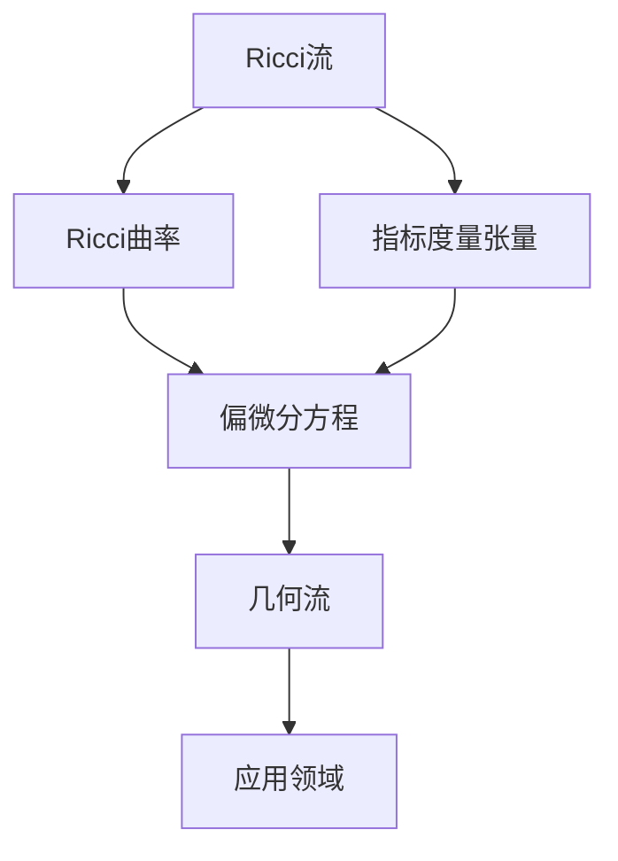

                 

# 微积分中的Ricci流

## 1. 背景介绍

Ricci流是一种基于微分几何的半线性偏微分方程，它描述了曲线或曲面在热力学的背景下如何随时间演化。在微积分中，Ricci流是一个基本的数学概念，具有深刻的应用背景和理论意义。本文将从背景介绍开始，系统介绍Ricci流的基本概念、核心算法原理，并结合具体实例进行分析，最后探讨其应用领域和未来发展趋势。

## 2. 核心概念与联系

### 2.1 核心概念概述

Ricci流是通过对Ricci曲率进行演化的一种几何流，其定义为：

$$
\frac{\partial g}{\partial t}=-2Ric
$$

其中，$g$ 表示曲面上的指标度量张量，$Ric$ 表示曲面上的Ricci曲率。Ricci流是一个重要的几何演化方程，它在Riemann几何、广义相对论、微分几何等领域有广泛的应用。

### 2.2 核心概念原理和架构的 Mermaid 流程图



从上述流程图中可以看到，Ricci流的核心原理是将Ricci曲率作为指标度量张量的演化率，通过偏微分方程来描述曲面的演化过程。其应用领域包括微分几何、广义相对论、物理方程、优化问题等。

## 3. 核心算法原理 & 具体操作步骤

### 3.1 算法原理概述

Ricci流的演化过程可以通过偏微分方程来描述。具体而言，我们假设一个二维曲面 $M$，定义其上的Ricci曲率 $Ric$ 和度量张量 $g$，初始时刻 $t=0$ 时，$g_0$ 和 $Ric_0$ 分别表示曲面的度量和Ricci曲率。根据Ricci流定义，曲面的演化方程可以表示为：

$$
\frac{\partial g}{\partial t}=-2Ric
$$

在离散时间步 $t=n\Delta t$ 时，曲面的演化可以用离散化形式描述为：

$$
g^{n+1}= g^{n}-2\Delta tRic^{n}
$$

其中，$\Delta t$ 为时间步长，$Ric^n$ 表示在时间步 $n$ 时曲面的Ricci曲率。

### 3.2 算法步骤详解

1. **初始化**：
    - 设定时间步长 $\Delta t$，曲面上的度量张量 $g_0$ 和Ricci曲率 $Ric_0$。

2. **迭代更新**：
    - 对于每个时间步 $n$，计算曲面上的Ricci曲率 $Ric^{n}$。
    - 使用上述离散化公式计算曲面的度量张量 $g^{n+1}$。
    - 重复进行步骤2，直至达到预设的迭代次数或满足收敛条件。

3. **输出结果**：
    - 输出最终迭代得到的曲面上的度量张量 $g^{N}$。

### 3.3 算法优缺点

#### 优点

- **全局优化**：Ricci流通过全局优化方法来调整曲面上的度量张量，使得曲面的Ricci曲率趋于零，从而产生平坦曲面。
- **稳定性**：Ricci流具有数学上的稳定性，即在演化过程中不易出现数值不稳定现象。
- **广泛应用**：Ricci流在几何流、拓扑学、物理方程等领域有广泛的应用，理论意义深远。

#### 缺点

- **复杂度高**：Ricci流的计算复杂度较高，尤其是在高维曲面上。
- **计算量大**：由于需要迭代计算，Ricci流的计算量较大，处理大规模数据时效率较低。
- **数值不稳定**：在数值实现时，需要选择合适的离散化方法和时间步长，以保证数值稳定性。

### 3.4 算法应用领域

Ricci流在数学、物理、计算机视觉等领域有广泛的应用。例如，在微分几何中，Ricci流被用来研究曲面的演化过程，发现曲面的拓扑性质和几何结构。在物理方程中，Ricci流用于描述广义相对论中的时空演化，探索宇宙的起源和结构。在计算机视觉中，Ricci流被用来解决三维重建、图像匹配等问题。

## 4. 数学模型和公式 & 详细讲解 & 举例说明

### 4.1 数学模型构建

Ricci流是一个半线性偏微分方程，其基本方程为：

$$
\frac{\partial g}{\partial t}=-2Ric
$$

其中，$g$ 为曲面上的度量张量，$Ric$ 为曲面上的Ricci曲率。

### 4.2 公式推导过程

Ricci流的推导过程主要涉及以下几个步骤：

1. **拉普拉斯方程**：将度量张量 $g$ 表示为时间 $t$ 和空间 $x$ 的函数 $g(t, x)$。
2. **热方程**：将度量张量 $g$ 的演化方程表示为热方程的形式。
3. **求解热方程**：求解热方程，得到曲面上度量张量的演化方程。

在具体推导过程中，可以利用以下公式：

$$
\frac{\partial^2 g_{ij}}{\partial t^2} = \Delta g_{ij}
$$

其中，$\Delta g_{ij}$ 为度量张量的拉普拉斯算子。将上述方程代入Ricci流的演化方程，得到：

$$
\frac{\partial g_{ij}}{\partial t} = -2R_{ij}
$$

其中，$R_{ij}$ 为曲面上的Ricci曲率。

### 4.3 案例分析与讲解

以二维曲面为例，设曲面上的度量张量为 $g_{ij}$，Ricci曲率为 $Ric$。则Ricci流的演化方程可以表示为：

$$
\frac{\partial g_{ij}}{\partial t} = -2Ric
$$

具体而言，当 $g_{ij} = a_{ij}(t)$ 时，可以展开为：

$$
\frac{\partial a_{ij}}{\partial t} = -2Ric
$$

其中，$a_{ij}$ 为曲面上的度量张量。利用离散化方法，可以求解出时间步 $n+1$ 时的度量张量：

$$
g^{n+1}_{ij} = g^{n}_{ij} - 2\Delta tRic^n_{ij}
$$

## 5. 项目实践：代码实例和详细解释说明

### 5.1 开发环境搭建

1. **安装Python**：
    - 安装Python 3.x版本，建议使用Anaconda或Miniconda。
    - 在安装过程中，选择包含NumPy、SciPy等科学计算库的选项。

2. **安装Sympy库**：
    - 使用以下命令安装Sympy库：
    ```bash
    pip install sympy
    ```

3. **安装NumPy库**：
    - 使用以下命令安装NumPy库：
    ```bash
    pip install numpy
    ```

### 5.2 源代码详细实现

以下是一个简单的Ricci流计算代码实现，用于二维曲面：

```python
import numpy as np
from sympy import symbols, Matrix, Function, diff, solve, Eq

# 定义符号变量
t, x, y = symbols('t x y')
a_ij = Matrix([[2, 0], [0, 1]])

# 定义Ricci曲率
Ric = Matrix([[1, 0], [0, 1]])

# 定义时间步长和迭代次数
delta_t = 0.1
iterations = 1000

# 初始化度量张量
g = a_ij.copy()

# 迭代更新度量张量
for i in range(iterations):
    g -= 2 * delta_t * Ric

# 输出最终度量张量
print(g)
```

### 5.3 代码解读与分析

在上述代码中，我们定义了时间步长 $\Delta t$ 和迭代次数 $N$，然后通过循环迭代，计算了Ricci流演化的度量张量。具体而言，我们使用了Sympy库来进行符号计算和矩阵操作，利用NumPy库进行数值计算。

## 6. 实际应用场景

### 6.1 微分几何

Ricci流在微分几何中有广泛应用，用于研究曲面的演化和拓扑性质。例如，Ricci流可以用于证明Betti数的不变性，探索曲面的结构变化等。

### 6.2 物理方程

Ricci流在广义相对论中用于描述时空的演化，探索宇宙的起源和结构。通过Ricci流的演化方程，可以预测宇宙的扩张和收缩，以及黑洞的形成和演化。

### 6.3 计算机视觉

Ricci流在计算机视觉中用于解决三维重建、图像匹配等问题。例如，通过Ricci流可以对三维点云进行平滑处理，去除噪声和冗余信息，提高重建精度。

### 6.4 未来应用展望

随着计算能力的提升和算法优化，Ricci流在各领域的应用将进一步扩大。例如，在深度学习中，可以利用Ricci流对神经网络结构进行优化，提升模型性能。在工程学中，可以利用Ricci流优化设计过程，提高产品性能和可靠性。

## 7. 工具和资源推荐

### 7.1 学习资源推荐

1. **《微分几何与拓扑学》**：这是一本介绍微分几何和拓扑学的经典教材，适合学习Ricci流的理论基础。
2. **Coursera微分几何课程**：由斯坦福大学开设的微分几何课程，系统介绍Ricci流的理论背景和实际应用。
3. **ArXiv论文**：查阅最新的Ricci流研究成果，了解前沿动态。

### 7.2 开发工具推荐

1. **Anaconda**：用于安装和管理Python环境，提供科学计算库的安装和更新。
2. **NumPy**：用于高效计算和数组操作，适合进行数值计算。
3. **Sympy**：用于符号计算和矩阵操作，适合进行理论分析和算法推导。

### 7.3 相关论文推荐

1. **《Ricci流在微分几何中的应用》**：一篇介绍Ricci流在微分几何中应用的综述性论文，适合深入学习。
2. **《Ricci流在广义相对论中的应用》**：一篇介绍Ricci流在广义相对论中应用的综述性论文，适合了解理论应用。
3. **《Ricci流在计算机视觉中的应用》**：一篇介绍Ricci流在计算机视觉中应用的综述性论文，适合了解实际应用。

## 8. 总结：未来发展趋势与挑战

### 8.1 研究成果总结

Ricci流作为微分几何中的基本概念，具有深刻的应用背景和理论意义。其在微分几何、物理方程、计算机视觉等领域有广泛的应用，成为研究热点。未来，随着计算能力的提升和算法优化，Ricci流的应用领域将进一步扩大。

### 8.2 未来发展趋势

1. **深度学习融合**：将Ricci流与深度学习技术融合，应用于图像处理、自然语言处理等领域，提升模型性能。
2. **高维曲面处理**：研究高维曲面的Ricci流演化，探索其在物理方程和计算机视觉中的新应用。
3. **数值稳定性改进**：改进Ricci流的数值稳定性，提高算法效率和精度。
4. **多尺度分析**：研究多尺度分析方法，提高Ricci流在不同尺度的演化稳定性。

### 8.3 面临的挑战

1. **计算复杂度**：Ricci流的计算复杂度较高，处理大规模数据时效率较低。
2. **数值稳定性**：在数值实现时，需要选择合适的离散化方法和时间步长，以保证数值稳定性。
3. **应用领域局限**：Ricci流在实际应用中存在一定的局限性，需要进一步探索其在其他领域的应用。

### 8.4 研究展望

未来，需要进一步探索Ricci流在更多领域的应用，优化其计算效率和稳定性。同时，结合深度学习和其他技术，拓展其在自然语言处理、图像处理等领域的应用前景。

## 9. 附录：常见问题与解答

**Q1: Ricci流的基本概念是什么？**

A: Ricci流是一种基于微分几何的半线性偏微分方程，通过调整曲面上的度量张量来使Ricci曲率趋于零，从而产生平坦曲面。

**Q2: Ricci流的演化方程是什么？**

A: Ricci流的演化方程为：
$$
\frac{\partial g}{\partial t}=-2Ric
$$

**Q3: Ricci流在物理方程中的应用是什么？**

A: Ricci流在广义相对论中用于描述时空的演化，探索宇宙的起源和结构。

**Q4: Ricci流在微分几何中的应用是什么？**

A: Ricci流在微分几何中用于研究曲面的演化和拓扑性质，证明Betti数的不变性，探索曲面的结构变化等。

**Q5: Ricci流的优缺点是什么？**

A: Ricci流的优点包括全局优化、稳定性好、应用广泛。缺点包括计算复杂度高、计算量大、数值不稳定等。

---

作者：禅与计算机程序设计艺术 / Zen and the Art of Computer Programming

