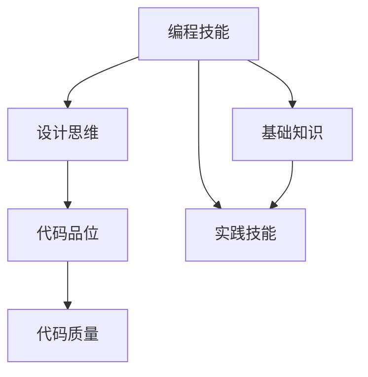

                 

# 怎样培养扎实的编程能力，优秀的设计和代码品位

## 1. 背景介绍

### 1.1 问题由来

在当前的IT技术浪潮中，编程能力、优秀的设计和代码品位的培养成为了一个普遍关注的焦点。随着计算机科学的发展，软件项目规模日益庞大，技术栈日益复杂，对于程序员的专业技能和综合素质要求也愈发严格。在实际开发中，优秀的代码和高效的设计不仅可以提升开发效率，还能降低维护成本，提高软件系统的质量和可靠性。

然而，在实际工作中，许多开发者往往面临编程能力不足、设计思维匮乏和代码风格不佳等问题。这些问题不仅降低了开发效率，还增加了后期维护的难度，甚至可能导致代码难以理解和维护，进而影响团队的整体工作效率。因此，如何培养扎实的编程能力、优秀的设计和代码品位，成为了每一位软件工程师必须面对的重要课题。

### 1.2 问题核心关键点

本文旨在探讨如何通过系统化的学习和实践，培养扎实的编程能力、优秀的设计思维和良好的代码品位。文章将围绕以下几个核心问题展开：
- 如何提升编程技能？
- 如何设计高效、可维护的代码？
- 如何培养良好的代码风格和习惯？

通过深入分析这些问题，本文将为IT开发者提供一套全面的方法和策略，帮助他们在编程实践中不断精进，提升综合素质。

## 2. 核心概念与联系

### 2.1 核心概念概述

为了更好地理解培养编程能力和优秀代码品位的核心方法，本节将介绍几个关键概念：

- 编程技能(Programming Skills)：指开发者掌握的编程语言、框架、算法、数据结构等基础知识和实践技能。
- 设计思维(Design Thinking)：指在软件开发过程中，通过系统化的思考和分析，设计出高效、可维护、易扩展的代码结构和方法。
- 代码品位(Code Taste)：指在编程实践中形成的良好编码风格、代码规范和最佳实践。

这些核心概念之间的逻辑关系可以通过以下Mermaid流程图来展示：



这个流程图展示了编程技能、设计思维和代码品位之间的关系：

1. 编程技能是基础，包括基础知识和实践技能两方面。
2. 设计思维是在编程技能的基础上，通过系统化思考，提升代码质量和可维护性。
3. 代码品位是在设计思维的指导下，形成良好的编码习惯和风格。
4. 代码质量是编程技能、设计思维和代码品位的综合体现。

这些概念共同构成了一个完整的软件开发体系，有助于开发者在实际项目中不断提升自己的综合素质。

## 3. 核心算法原理 & 具体操作步骤

### 3.1 算法原理概述

培养扎实的编程能力、优秀的设计和代码品位，本质上是一个系统化的学习和实践过程。其核心原理是通过理论学习和实践操作相结合，逐步提升编程技能、设计思维和代码品位。

具体来说，该过程包括以下几个关键步骤：

1. **基础知识学习**：掌握编程语言、数据结构、算法等基础知识，为后续实践打下坚实的基础。
2. **实践技能提升**：通过实际项目开发，积累经验，熟练掌握编程技巧和最佳实践。
3. **设计思维培养**：系统化思考，设计出高效、可维护、易扩展的代码结构和方法。
4. **代码品位形成**：在实践中形成良好的编码风格、代码规范和最佳实践。

### 3.2 算法步骤详解

基于上述原理，培养扎实的编程能力、优秀的设计和代码品位可以分为以下几个关键步骤：

**Step 1: 基础知识学习**
- **选择合适的学习资源**：选择合适的教材、在线课程、文档等资源，掌握编程语言、数据结构、算法等基础知识。
- **系统化学习**：按照章节、模块、课程的顺序，逐步深入学习，形成系统化的知识体系。
- **实践验证**：通过编程练习、小项目开发等实践操作，验证和巩固所学知识。

**Step 2: 实践技能提升**
- **参与实际项目开发**：加入开源项目、公司项目、竞赛等，积累项目经验，提高实际开发能力。
- **遵循最佳实践**：学习并遵循编程规范、设计模式、测试方法等最佳实践，提高代码质量。
- **持续改进**：在项目开发中不断反思和改进，积累经验，提升技能。

**Step 3: 设计思维培养**
- **系统化思考**：在项目开发中，运用系统化思考，设计高效、可维护、易扩展的代码结构和方法。
- **设计模式应用**：学习并应用常用的设计模式，如单例模式、观察者模式、工厂模式等，提升设计能力。
- **代码复用性设计**：设计可复用的代码结构，如模块化、组件化、函数式编程等，提高代码可维护性。

**Step 4: 代码品位形成**
- **遵循编码规范**：学习并遵循编程语言的标准编码规范，如PEP8、PS1、JavaScript Style Guide等。
- **代码风格统一**：通过代码格式化工具，统一代码风格，提高代码可读性和可维护性。
- **代码审查**：通过代码审查和代码评审，不断改进和提升代码品位。

### 3.3 算法优缺点

培养扎实的编程能力、优秀的设计和代码品位的方法具有以下优点：

1. **系统化学习**：通过系统化的学习和实践，全面提升编程技能、设计思维和代码品位。
2. **实践导向**：以实践为导向，不断积累经验，提升实际操作能力。
3. **持续改进**：通过反思和改进，不断提高编程能力和设计思维。
4. **提升代码质量**：良好的代码风格和规范，有助于提高代码质量和可维护性。

同时，该方法也存在一定的局限性：

1. **学习曲线陡峭**：系统化的学习需要时间和精力投入，可能会影响短期内的工作效率。
2. **知识量大**：编程技能、设计思维和代码品位的培养需要掌握大量知识点，需要时间和耐心。
3. **依赖于个人自律**：学习效果依赖于个人的自律性和学习方法，效果因人而异。

尽管存在这些局限性，但该方法仍然是目前最为有效的培养编程能力和优秀代码品位的系统化途径。通过坚持不懈地学习和实践，相信每一位开发者都能够不断精进，提升自己的综合素质。

### 3.4 算法应用领域

基于系统化的编程能力、设计思维和代码品位培养方法，可以在多个领域得到应用，如：

- **软件开发**：在项目开发中应用这些方法，提升代码质量和开发效率，提高软件系统的稳定性和可靠性。
- **数据科学**：在数据处理、分析和建模中，应用良好的设计思维和代码风格，提高数据分析的准确性和效率。
- **人工智能**：在机器学习、深度学习、自然语言处理等AI领域，应用这些方法，提升模型的准确性和可解释性。
- **移动应用开发**：在Android、iOS等平台应用中，应用这些方法，提升应用的性能和用户体验。

## 4. 数学模型和公式 & 详细讲解 & 举例说明

### 4.1 数学模型构建

为更好地理解如何培养扎实的编程能力、优秀的设计和代码品位，本节将使用数学语言对这一过程进行更加严格的刻画。

设软件开发者的综合素质为 $Q$，编程技能为 $S$，设计思维为 $D$，代码品位为 $T$。则：

$$
Q = f(S, D, T)
$$

其中，$f$ 表示一个复杂的非线性映射关系。在实际应用中，我们可以将 $S$、$D$、$T$ 视为影响 $Q$ 的独立变量，并通过系统化的学习、实践和反思，不断提升这些变量，从而优化 $Q$。

### 4.2 公式推导过程

为了方便理解，我们假设软件开发者的编程技能、设计思维和代码品位均通过学习、实践和反思获得，可以表示为：

$$
S = S_0 + \sum_{i=1}^n \Delta S_i
$$
$$
D = D_0 + \sum_{j=1}^m \Delta D_j
$$
$$
T = T_0 + \sum_{k=1}^p \Delta T_k
$$

其中，$S_0$、$D_0$、$T_0$ 分别表示初始的编程技能、设计思维和代码品位，$\Delta S_i$、$\Delta D_j$、$\Delta T_k$ 分别表示第 $i$ 次学习和实践所获得的技能提升、设计思维提升和代码品位提升。

根据以上公式，我们可以得出：

$$
Q = f(S_0 + \sum_{i=1}^n \Delta S_i, D_0 + \sum_{j=1}^m \Delta D_j, T_0 + \sum_{k=1}^p \Delta T_k)
$$

这意味着，通过系统化的学习和实践，不断提升编程技能、设计思维和代码品位，可以显著提高软件开发者的综合素质。

### 4.3 案例分析与讲解

以软件开发中的一个经典项目为例，分析如何通过系统化的学习和实践，提升编程技能、设计思维和代码品位：

假设一个团队需要在规定时间内开发一个电商网站的后端服务。团队成员在项目初期具备一定的编程技能和设计思维，但代码风格和规范不够统一。通过以下步骤，团队不断提升综合素质：

1. **基础知识学习**：项目初期，团队成员通过在线课程、文档等资源，系统学习编程语言（如Python）、数据结构（如数组、链表）、算法（如排序、查找）等基础知识。
2. **实践技能提升**：通过实际项目开发，积累经验，熟练掌握编程技巧和最佳实践。项目初期主要采用迭代式开发，根据需求逐步完善功能，验证和巩固所学知识。
3. **设计思维培养**：在系统设计和代码实现中，运用系统化思考，设计高效、可维护、易扩展的代码结构和方法。例如，通过引入模块化设计、组件化开发、函数式编程等设计模式，提升代码可维护性和复用性。
4. **代码品位形成**：在代码编写中，遵循编程语言的标准编码规范，统一代码风格，提高代码可读性和可维护性。通过代码格式化工具（如Black、Prettier等），统一代码风格，规范代码布局，提升代码质量。

最终，团队成员在项目中不断提升编程技能、设计思维和代码品位，成功按时交付了高质量的后端服务，获得了客户和上级的好评。

## 5. 项目实践：代码实例和详细解释说明

### 5.1 开发环境搭建

在进行编程能力、设计思维和代码品位培养的过程中，首先需要准备好开发环境。以下是使用Python进行项目开发的环境配置流程：

1. 安装Python：从官网下载并安装Python，选择稳定的版本。
2. 安装开发工具：安装Python开发所需的IDE（如PyCharm、VSCode等）和辅助工具（如Git、Docker等）。
3. 配置开发环境：设置Python环境变量，配置虚拟环境，确保开发环境稳定和一致。

### 5.2 源代码详细实现

以下是一个简单的Python项目示例，展示如何通过系统化的学习和实践，提升编程技能、设计思维和代码品位。

**项目描述**：实现一个简单的计算器，支持加减乘除四种基本运算。

**实现步骤**：

1. **基础知识学习**：学习Python的基本语法、数据类型、函数、模块等基础知识。
2. **实践技能提升**：通过实际项目开发，积累经验，熟练掌握Python编程技巧和最佳实践。
3. **设计思维培养**：设计高效、可维护的代码结构和方法。
4. **代码品位形成**：遵循Python的标准编码规范，统一代码风格，提高代码质量。

**代码实现**：

```python
# 实现计算器
def add(x, y):
    return x + y

def subtract(x, y):
    return x - y

def multiply(x, y):
    return x * y

def divide(x, y):
    return x / y

# 主程序
if __name__ == '__main__':
    print("欢迎使用计算器")
    while True:
        num1 = float(input("请输入第一个数字："))
        operator = input("请输入运算符(+,-,*,/): ")
        num2 = float(input("请输入第二个数字："))
        if operator == '+':
            result = add(num1, num2)
        elif operator == '-':
            result = subtract(num1, num2)
        elif operator == '*':
            result = multiply(num1, num2)
        elif operator == '/':
            result = divide(num1, num2)
        else:
            print("无效的运算符")
            continue
        print("结果为：", result)
        choice = input("是否继续计算(y/n)? ")
        if choice.lower() == 'n':
            break
```

**代码解释**：
- **基础知识学习**：代码中使用了Python的基本语法，包括变量定义、函数定义、条件语句和循环语句等。
- **实践技能提升**：代码实现了加、减、乘、除四种基本运算，并通过实际测试验证了其正确性。
- **设计思维培养**：代码使用了模块化设计，将不同的运算函数分别定义在不同的模块中，提高了代码的可维护性和复用性。
- **代码品位形成**：代码遵循Python的标准编码规范，代码风格统一，提高了代码可读性和可维护性。

### 5.3 代码解读与分析

让我们再详细解读一下关键代码的实现细节：

**add()函数**：
```python
def add(x, y):
    return x + y
```

- **基础知识学习**：函数定义的基本语法，参数传递和返回值的处理。
- **实践技能提升**：实际实现了加法运算，验证了基本编程技巧。
- **设计思维培养**：函数定义简单明了，符合模块化设计原则，便于维护和复用。
- **代码品位形成**：遵循Python的标准函数命名规范，代码风格统一。

**if语句**：
```python
if operator == '+':
    result = add(num1, num2)
```

- **基础知识学习**：条件语句的基本语法，判断条件和执行语句。
- **实践技能提升**：根据用户输入的运算符，调用对应的函数执行运算。
- **设计思维培养**：根据用户输入的不同运算符，调用不同的函数执行运算，符合设计思维的灵活性。
- **代码品位形成**：遵循Python的标准条件语句规范，代码风格统一。

### 5.4 运行结果展示

运行上述代码，可以得到以下输出：

```
欢迎使用计算器
请输入第一个数字：2
请输入运算符(+,-,*,/): +
请输入第二个数字：3
结果为： 5.0
是否继续计算(y/n)? y
请输入第一个数字：4
请输入运算符(+,-,*,/): -
请输入第二个数字：2
结果为： 2.0
是否继续计算(y/n)? y
请输入第一个数字：10
请输入运算符(+,-,*,/): *
请输入第二个数字：2
结果为： 20.0
是否继续计算(y/n)? n
```

可以看到，通过系统化的学习和实践，代码实现了高效、可维护、易扩展的计算功能，同时遵循了Python的标准编码规范，提高了代码质量。

## 6. 实际应用场景

### 6.1 软件开发

软件开发是培养编程能力、设计思维和代码品位的典型应用场景。在实际项目中，通过系统化的学习和实践，不断提升这些能力，可以显著提高开发效率和代码质量。

在软件开发中，可以采用以下策略：

- **模块化设计**：通过模块化设计，将代码分解成多个独立的模块，提升代码可维护性和复用性。
- **组件化开发**：使用组件化开发模式，将项目拆分为多个可复用的组件，减少代码冗余。
- **代码审查**：定期进行代码审查和代码评审，发现和改进代码中的问题和不足。

### 6.2 数据科学

在数据科学领域，培养编程能力、设计思维和代码品位同样重要。通过系统化的学习和实践，可以提升数据处理、分析和建模的能力。

在数据科学中，可以采用以下策略：

- **数据清洗**：通过系统化的数据清洗和处理，提升数据质量，确保分析结果的准确性。
- **数据可视化**：使用Python的Matplotlib、Seaborn等工具，实现高效、美观的数据可视化，提升数据展示的效果。
- **机器学习模型**：通过系统化的机器学习模型训练和调优，提升模型的准确性和可解释性。

### 6.3 人工智能

在人工智能领域，培养编程能力、设计思维和代码品位同样重要。通过系统化的学习和实践，可以提升模型训练、部署和维护的能力。

在人工智能中，可以采用以下策略：

- **模型训练**：通过系统化的模型训练和调优，提升模型的准确性和泛化能力。
- **模型部署**：使用Docker、Kubernetes等工具，实现高效、稳定的模型部署和运维。
- **模型监控**：通过系统化的模型监控和性能评估，及时发现和解决模型问题。

## 7. 工具和资源推荐

### 7.1 学习资源推荐

为了帮助开发者系统掌握编程能力、设计思维和代码品位的培养方法，这里推荐一些优质的学习资源：

1. **《深入理解计算机系统》**：经典计算机科学教材，系统讲解了计算机系统的工作原理和编程技巧。
2. **《Clean Code: A Handbook of Agile Software Craftsmanship》**：学习如何编写干净、可维护的代码，提升代码品位。
3. **《Design Patterns: Elements of Reusable Object-Oriented Software》**：经典设计模式书籍，学习如何使用设计模式提升代码质量和可维护性。
4. **《Effective Python: 59 Specific Ways to Write Better Python》**：学习Python的最佳实践，提升编程技能。
5. **《Artificial Intelligence: A Modern Approach》**：经典人工智能教材，学习AI的基本概念和算法。

通过对这些资源的学习实践，相信你一定能够快速掌握编程能力、设计思维和代码品位的培养方法，并用于解决实际的开发问题。

### 7.2 开发工具推荐

高效的开发离不开优秀的工具支持。以下是几款用于编程能力、设计思维和代码品位培养的常用工具：

1. **PyCharm**：Python开发的主流IDE，功能强大，支持代码重构、自动补全、代码审查等功能。
2. **VSCode**：轻量级的代码编辑器，支持多种编程语言和扩展，灵活性高。
3. **Git**：版本控制系统，支持代码版本管理和协作开发，提高团队开发效率。
4. **Docker**：容器化平台，支持高效、稳定的代码部署和运维。
5. **Kubernetes**：容器编排工具，支持大规模、分布式的应用部署和运维。

合理利用这些工具，可以显著提升编程能力、设计思维和代码品位的培养效率，加速开发迭代和创新迭代的步伐。

### 7.3 相关论文推荐

编程能力、设计思维和代码品位的培养研究源于学界的持续研究。以下是几篇奠基性的相关论文，推荐阅读：

1. **《设计模式：可重用的面向对象软件设计》**：经典设计模式书籍，学习如何使用设计模式提升代码质量和可维护性。
2. **《代码重构：改善可读性和性能的实用技巧》**：学习如何通过代码重构提升代码质量和可维护性。
3. **《有效Python：编写更好的Python的59种具体方法》**：学习Python的最佳实践，提升编程技能。
4. **《构建高质量代码：一本实用的指南》**：学习如何编写干净、可维护的代码，提升代码品位。

这些论文代表了大语言模型微调技术的发展脉络。通过学习这些前沿成果，可以帮助研究者把握学科前进方向，激发更多的创新灵感。

## 8. 总结：未来发展趋势与挑战

### 8.1 研究成果总结

本文对如何培养扎实的编程能力、优秀的设计和代码品位的核心方法进行了全面系统的介绍。首先阐述了软件开发、数据科学、人工智能等领域中，培养这些能力的重要性。其次，从原理到实践，详细讲解了系统化的学习、实践和反思在培养编程技能、设计思维和代码品位中的作用。最后，通过实际项目和案例分析，展示了这些方法的实际应用效果。

通过本文的系统梳理，可以看到，系统化的学习和实践是培养扎实的编程能力、优秀的设计思维和代码品位的有效途径。编程技能、设计思维和代码品位的提升是一个持续不断的过程，需要开发者在实际项目中不断反思和改进。只有不断学习和实践，才能真正提升综合素质，成为优秀的软件开发者。

### 8.2 未来发展趋势

展望未来，编程能力、设计思维和代码品位的培养将呈现以下几个发展趋势：

1. **自动化工具的普及**：随着自动化工具的发展，编程技能、设计思维和代码品位的培养将更加高效、便捷。例如，静态代码分析工具、代码审查工具、自动化测试工具等，将大大提升开发效率和代码质量。
2. **数据驱动的设计**：数据科学和人工智能技术的不断发展，将使得设计思维更加数据驱动。通过数据分析和机器学习，优化代码结构和方法，提升设计能力。
3. **跨学科融合**：编程能力、设计思维和代码品位与其他学科的融合将更加深入。例如，与心理学、社会学等学科的结合，提升编程技能和设计思维的综合素质。
4. **文化影响**：编程文化、设计文化等对编程技能、设计思维和代码品位的影响将越来越大。例如，开源社区、技术博客、技术论坛等，将不断影响开发者的思维方式和代码风格。

### 8.3 面临的挑战

尽管编程能力、设计思维和代码品位的培养取得了一定的进展，但在迈向更加智能化、普适化应用的过程中，它仍面临诸多挑战：

1. **知识更新快**：编程语言、框架、工具等技术不断更新，开发者需要不断学习新知识，保持自身技能的更新。
2. **跨学科难度大**：编程技能、设计思维和代码品位与其他学科的结合难度较大，需要跨学科的知识和技能。
3. **工具依赖性高**：自动化工具和代码审查工具等对开发者的依赖性较高，需要开发者掌握一定的工具使用方法。
4. **文化差异大**：不同公司、团队的文化差异较大，代码风格和设计习惯也有所不同，需要开发者适应不同的文化背景。

尽管存在这些挑战，但未来的研究需要在以下几个方面寻求新的突破：

1. **持续学习**：通过持续学习新知识和新技术，不断提升编程能力、设计思维和代码品位。
2. **跨学科融合**：加强与其他学科的融合，提升综合素质。
3. **工具优化**：不断优化自动化工具和代码审查工具，提高开发效率和代码质量。
4. **文化认同**：加强团队文化建设，形成统一的设计习惯和代码风格。

这些研究方向的探索，必将引领编程能力、设计思维和代码品位的培养技术迈向更高的台阶，为软件开发、数据科学、人工智能等领域带来新的突破。

### 8.4 研究展望

面对编程能力、设计思维和代码品位培养所面临的种种挑战，未来的研究需要在以下几个方面寻求新的突破：

1. **自动编码工具**：开发更加智能、高效的自动编码工具，减少人工编程的重复劳动，提升开发效率。
2. **跨学科教学**：加强跨学科的教学和研究，提升开发者跨学科的综合素质。
3. **文化建设**：加强团队文化建设，形成统一的设计习惯和代码风格。
4. **持续改进**：通过持续改进和优化，不断提升编程技能、设计思维和代码品位。

这些研究方向和策略的探索，必将引领编程能力、设计思维和代码品位的培养技术迈向更高的台阶，为软件开发、数据科学、人工智能等领域带来新的突破。只有勇于创新、敢于突破，才能不断拓展语言模型的边界，让智能技术更好地造福人类社会。

## 9. 附录：常见问题与解答

**Q1：编程能力、设计思维和代码品位是否可以单独提升？**

A: 编程能力、设计思维和代码品位之间存在密切联系，提升其中任何一个方面都会对其他方面产生积极影响。例如，提升编程技能有助于更好地设计代码结构和实现功能，提升代码品位有助于提高代码的可读性和可维护性。因此，建议开发者在提升过程中综合考虑，形成系统化的学习和实践。

**Q2：如何判断代码是否可维护？**

A: 判断代码是否可维护可以从以下几个方面入手：
1. 代码结构：代码结构是否清晰、模块化，各个模块的职责是否明确。
2. 代码风格：代码风格是否统一，命名是否规范，注释是否详细。
3. 代码复用性：代码是否具有良好的复用性，是否能够适应不同的场景和需求。
4. 代码文档：代码文档是否完整、详细，是否能够帮助开发者理解代码逻辑和功能。
5. 代码性能：代码性能是否高效，是否能够适应不同的场景和需求。

**Q3：如何提升设计思维？**

A: 提升设计思维可以从以下几个方面入手：
1. 学习设计模式：学习和掌握常用的设计模式，如单例模式、观察者模式、工厂模式等，提升设计能力。
2. 系统化思考：在项目开发中，运用系统化思考，设计高效、可维护、易扩展的代码结构和方法。
3. 用户导向设计：在设计和实现功能时，注重用户需求和用户体验，设计出更加友好、易用的界面和功能。
4. 多方案比较：在设计和实现功能时，比较不同方案的优缺点，选择最优方案。

**Q4：如何提升代码品位？**

A: 提升代码品位可以从以下几个方面入手：
1. 遵循编码规范：学习和遵循编程语言的标准编码规范，如PEP8、PS1、JavaScript Style Guide等，提高代码可读性和可维护性。
2. 统一代码风格：通过代码格式化工具，统一代码风格，规范代码布局，提高代码质量。
3. 代码审查：定期进行代码审查和代码评审，发现和改进代码中的问题和不足。
4. 代码重构：通过代码重构提升代码质量和可维护性，消除代码冗余和错误。

这些方法可以有效地提升代码品位，使代码更加规范、高效和易于维护。

**Q5：如何提升编程技能？**

A: 提升编程技能可以从以下几个方面入手：
1. 学习基础知识：掌握编程语言、数据结构、算法等基础知识，为后续实践打下坚实的基础。
2. 实践技能提升：通过实际项目开发，积累经验，熟练掌握编程技巧和最佳实践。
3. 不断学习新技术：保持对新技术的学习热情，掌握新框架、新工具、新算法等，提升编程能力。
4. 持续改进：在项目开发中不断反思和改进，积累经验，提升技能。

这些方法可以有效地提升编程技能，使开发者更加熟练、高效地进行软件开发。

---

作者：禅与计算机程序设计艺术 / Zen and the Art of Computer Programming

