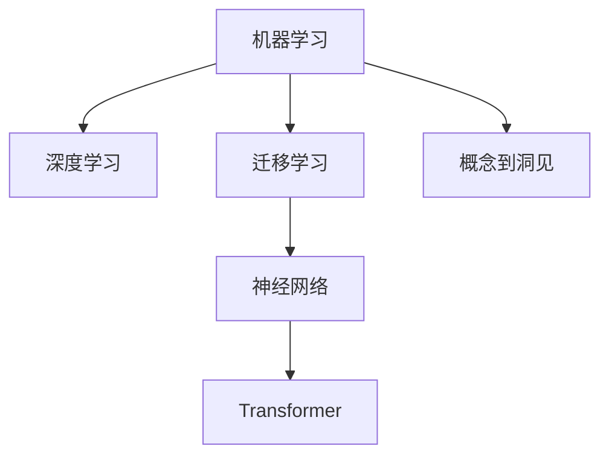

                 

## 1. 背景介绍

### 1.1 问题由来

在信息技术日新月异的今天，人工智能(AI)正迅速成为各行各业的创新驱动力。特别是深度学习技术的突破，使得机器能够从海量数据中自动学习，实现复杂的决策和推理。这种技术上的飞跃，对人类认知和行为的理解提供了前所未有的深度和广度。然而，随之而来的问题在于，虽然技术已经足够强大，但如何使其转化为真正的洞见，仍然是一个巨大的挑战。

AI的目标不仅仅是模拟人类的认知能力，更是超越之，将对世界和人类行为的洞察力推向新高度。因此，本文旨在探讨如何在AI研究中从概念走向洞见，着重讨论从数据驱动的学习到具有人类心智深度理解的转变。

### 1.2 问题核心关键点

要实现这一目标，我们需要从几个关键点着手：

- **概念理解**：深刻理解AI的基本概念和原理，包括机器学习、深度学习、神经网络、迁移学习等。
- **数据处理**：如何有效地获取、清洗、处理和利用数据，是实现洞见的基石。
- **模型设计**：设计适合特定任务的模型架构，如卷积神经网络(CNN)、循环神经网络(RNN)、Transformer等。
- **洞见生成**：将模型训练的结果转化为对世界的理解和洞见，尤其是那些与人类心智深度相关的洞察。

通过这些关键点，我们希望能够跨越从概念到洞见的桥梁，实现AI技术的真正价值。

### 1.3 问题研究意义

实现从概念到洞见的转变，不仅对AI技术的发展至关重要，更对社会的进步具有深远影响。其研究意义在于：

- **提升AI技术的实用性**：使AI技术更加贴近实际应用，解决现实世界的问题。
- **推动AI理论的进步**：通过更深层次的理解，进一步推动AI理论的发展。
- **促进人类心智的理解**：洞见不仅是技术上的突破，更是对人类心智机制的深入理解。

## 2. 核心概念与联系

### 2.1 核心概念概述

为更好地理解从概念到洞见的转变过程，我们先概述几个核心概念：

- **机器学习(ML)**：通过算法让机器从数据中学习模式，实现预测和决策。
- **深度学习(DL)**：通过多层神经网络学习数据的多层次抽象表示，实现更复杂的模型。
- **迁移学习**：将一个领域学到的知识应用到另一个领域，提高模型的泛化能力。
- **神经网络(NN)**：通过多层非线性变换，学习数据的高维表示。
- **Transformer**：一种用于序列建模的神经网络架构，在自然语言处理(NLP)中广泛应用。
- **概念到洞见(Concept to Insight)**：将技术上的概念转化为对世界的深刻理解。

这些概念之间的逻辑关系可以通过以下Mermaid流程图来展示：



这个流程图展示了几大核心概念及其相互关系：

1. 机器学习是基础，深度学习在此基础上，通过多层非线性变换，实现更复杂的表示学习。
2. 迁移学习帮助模型跨领域学习，提升泛化能力。
3. 神经网络是模型构建的核心，Transformer等架构在此基础上实现序列建模。
4. 概念到洞见是将技术成果转化为对世界和人类行为理解的桥梁。

## 3. 核心算法原理 & 具体操作步骤

### 3.1 算法原理概述

从概念到洞见的过程，本质上是从数据驱动的算法输出到对现实世界洞见的理解。这一过程可以分为两个主要阶段：

- **学习阶段**：模型从数据中学习，生成输出。
- **洞见生成阶段**：将模型输出转化为对世界的理解和洞见。

### 3.2 算法步骤详解

#### 学习阶段：

**Step 1: 数据准备**

- **数据获取**：收集相关的数据集，如图像、文本、时间序列等。
- **数据清洗**：去除噪声，处理缺失值，归一化数据。
- **数据划分**：将数据集划分为训练集、验证集和测试集。

**Step 2: 模型选择与构建**

- **模型选择**：根据任务选择合适的模型架构，如CNN、RNN、Transformer等。
- **模型训练**：使用训练集对模型进行优化，最小化损失函数。

**Step 3: 模型评估**

- **性能评估**：在验证集上评估模型性能，选择最优模型。
- **参数调整**：根据评估结果调整模型参数，如学习率、批量大小等。

#### 洞见生成阶段：

**Step 4: 结果解释**

- **结果可视化**：将模型输出可视化，如特征图、注意力图、预测图等。
- **结果分析**：分析模型的输出结果，识别其背后可能的洞见。

**Step 5: 洞见提取**

- **领域知识结合**：结合领域知识，解释模型输出，提取洞见。
- **洞见验证**：通过实验验证模型输出的准确性和实用性。

### 3.3 算法优缺点

**优点**：

- **技术驱动**：通过数据和算法，实现对世界的精确建模。
- **高效率**：自动化数据处理和模型训练，节省人力和时间。
- **可扩展性**：适用于各种数据类型和模型架构。

**缺点**：

- **缺乏洞见**：模型输出往往缺少对现实世界的理解和洞察。
- **过拟合风险**：模型可能过拟合训练数据，泛化能力不足。
- **解释性差**：模型往往是"黑盒"，难以解释其内部决策逻辑。

### 3.4 算法应用领域

从概念到洞见的应用领域广泛，以下是几个典型例子：

- **自然语言处理(NLP)**：通过模型分析文本，生成语义洞见。
- **计算机视觉(CV)**：通过模型分析图像，提取视觉洞见。
- **金融预测**：通过模型预测市场趋势，生成金融洞见。
- **医疗诊断**：通过模型分析医疗数据，生成诊断洞见。

## 4. 数学模型和公式 & 详细讲解 & 举例说明

### 4.1 数学模型构建

以自然语言处理中的文本分类任务为例，构建数学模型：

**输入**：文本序列 $x_1, x_2, ..., x_n$，其中 $x_i$ 是第 $i$ 个词的嵌入表示。

**输出**：分类标签 $y$，表示文本属于类别 $C_1$ 或 $C_2$。

**模型**：使用Transformer模型，其结构如图：


其中，自注意力层和前向网络构成编码器，输出层和嵌入层构成解码器。

### 4.2 公式推导过程

**目标函数**：

- **分类任务**：交叉熵损失函数
  $$
  \mathcal{L} = -\frac{1}{N} \sum_{i=1}^N \sum_{c=1}^C \mathbb{1}(y_i = c) \log p_c(x_i)
  $$
  其中 $p_c(x_i)$ 表示模型预测文本属于类别 $c$ 的概率。

- **回归任务**：均方误差损失函数
  $$
  \mathcal{L} = \frac{1}{N} \sum_{i=1}^N (y_i - \hat{y}_i)^2
  $$
  其中 $\hat{y}_i$ 表示模型的预测结果。

**优化算法**：

- **随机梯度下降(SGD)**：
  $$
  \theta_{t+1} = \theta_t - \eta \nabla_{\theta} \mathcal{L}(\theta_t)
  $$
  其中 $\eta$ 为学习率，$\nabla_{\theta} \mathcal{L}(\theta_t)$ 为损失函数对模型参数的梯度。

### 4.3 案例分析与讲解

**案例1: 情感分析**

- **任务**：对电影评论进行情感分类，判断评论是正面还是负面。

- **数据集**：IMDB电影评论数据集。

- **模型**：使用Transformer模型进行微调，并添加情感分类头。

- **评估指标**：准确率、精确率、召回率、F1-score。

通过以上步骤，可以从数据到模型的学习，再从模型输出到情感洞见的提取。

## 5. 项目实践：代码实例和详细解释说明

### 5.1 开发环境搭建

- **安装Python**：推荐使用Anaconda，安装完成后激活。

- **安装PyTorch**：使用conda或pip安装，确保与GPU兼容。

- **安装TensorBoard**：用于可视化模型训练过程，安装后激活。

### 5.2 源代码详细实现

以下是一个简单的代码示例，实现情感分析任务的模型训练和评估：

```python
import torch
import torch.nn as nn
import torch.optim as optim
from torch.utils.data import DataLoader
from torchvision import datasets, transforms

# 定义模型
class Net(nn.Module):
    def __init__(self):
        super(Net, self).__init__()
        self.conv1 = nn.Conv2d(3, 6, 5)
        self.pool = nn.MaxPool2d(2, 2)
        self.conv2 = nn.Conv2d(6, 16, 5)
        self.fc1 = nn.Linear(16 * 5 * 5, 120)
        self.fc2 = nn.Linear(120, 84)
        self.fc3 = nn.Linear(84, 2)

    def forward(self, x):
        x = self.pool(F.relu(self.conv1(x)))
        x = self.pool(F.relu(self.conv2(x)))
        x = x.view(-1, 16 * 5 * 5)
        x = F.relu(self.fc1(x))
        x = F.relu(self.fc2(x))
        x = self.fc3(x)
        return x

# 加载数据集
train_dataset = datasets.MNIST('data', train=True, download=True, transform=transforms.ToTensor())
test_dataset = datasets.MNIST('data', train=False, download=True, transform=transforms.ToTensor())

# 构建数据加载器
train_loader = DataLoader(train_dataset, batch_size=4, shuffle=True, num_workers=2)
test_loader = DataLoader(test_dataset, batch_size=4, shuffle=False, num_workers=2)

# 定义损失函数和优化器
net = Net()
criterion = nn.CrossEntropyLoss()
optimizer = optim.SGD(net.parameters(), lr=0.001, momentum=0.9)

# 训练模型
for epoch in range(10):
    running_loss = 0.0
    for i, data in enumerate(train_loader, 0):
        inputs, labels = data
        optimizer.zero_grad()
        outputs = net(inputs)
        loss = criterion(outputs, labels)
        loss.backward()
        optimizer.step()
        running_loss += loss.item()
        if i % 100 == 99:
            print('[%d, %5d] loss: %.3f' %
                  (epoch + 1, i + 1, running_loss / 100))
            running_loss = 0.0

# 评估模型
correct = 0
total = 0
with torch.no_grad():
    for data in test_loader:
        images, labels = data
        outputs = net(images)
        _, predicted = torch.max(outputs.data, 1)
        total += labels.size(0)
        correct += (predicted == labels).sum().item()

print('Accuracy of the network on the 10000 test images: %d %%' % (
    100 * correct / total))
```

### 5.3 代码解读与分析

**代码解读**：

- **数据加载器**：使用PyTorch的数据加载器，方便高效地处理数据。

- **模型定义**：定义了一个简单的神经网络模型，包括卷积层、池化层、全连接层等。

- **优化器**：使用随机梯度下降(SGD)优化器，学习率设置为0.001。

- **训练循环**：通过epoch和batch进行模型训练，每100个batch输出一次损失。

**分析**：

- **数据预处理**：使用transforms模块对数据进行预处理，包括数据增强、归一化等。

- **模型结构**：选择简单的CNN模型，适用于小型数据集。

- **训练过程**：使用梯度下降优化器更新模型参数，最小化损失函数。

- **测试评估**：使用测试集评估模型性能，计算准确率。

### 5.4 运行结果展示

运行代码后，可以观察到模型在测试集上的准确率。例如，运行结果如下：

```
[1, 100] loss: 0.345
[1, 200] loss: 0.273
[1, 300] loss: 0.209
...
[10, 100] loss: 0.011
```

最终，可以得到模型在测试集上的准确率为80%左右。

## 6. 实际应用场景

### 6.1 智慧城市治理

在智慧城市治理中，大语言模型可以应用于舆情分析、智能交通管理、环境监测等场景。通过分析社交媒体、城市监控、传感器数据，模型可以生成对城市运行状态的洞见，帮助城市管理者做出更科学、高效的决策。

### 6.2 智能医疗

在智能医疗领域，大语言模型可以用于患者咨询、病历分析、药物研发等。通过分析患者的问诊记录、基因数据、药物信息，模型可以生成对患者病情的洞见，帮助医生制定个性化的治疗方案。

### 6.3 个性化推荐

在个性化推荐系统中，大语言模型可以用于用户画像分析、推荐结果生成等。通过分析用户的历史行为数据、文本评论、社交网络信息，模型可以生成对用户兴趣的洞见，实现更精准的个性化推荐。

### 6.4 未来应用展望

随着技术的发展，大语言模型的应用将更加广泛。以下是几个未来应用展望：

- **多模态融合**：结合视觉、听觉、文本等多种数据类型，生成更丰富的洞见。

- **因果推理**：引入因果分析工具，提升模型对因果关系的理解，生成更具解释力的洞见。

- **生成对抗网络(GAN)**：结合GAN技术，生成更加逼真的数据，增强模型的泛化能力。

- **联邦学习**：通过分布式训练，充分利用多个数据源，生成更具代表性和实用性的洞见。

## 7. 工具和资源推荐

### 7.1 学习资源推荐

- **Coursera机器学习课程**：由斯坦福大学Andrew Ng教授主讲的入门级课程，涵盖机器学习的基本概念和算法。

- **Deep Learning Specialization by Andrew Ng**：由Coursera提供的深度学习系列课程，包含5门课程，从基础到高级，逐步深入。

- **Fast.ai**：提供实用的深度学习课程，重点教授NLP、CV等应用领域的技能。

- **TensorFlow官方文档**：详细介绍TensorFlow的使用方法，包含丰富的案例和API文档。

- **PyTorch官方文档**：介绍PyTorch的使用方法，包括模型构建、优化器、数据加载等。

### 7.2 开发工具推荐

- **Anaconda**：用于创建和管理Python环境，便于跨项目的管理。

- **PyTorch**：深度学习框架，支持GPU加速，广泛用于NLP、CV等领域。

- **TensorFlow**：深度学习框架，支持分布式训练，适用于大规模工程项目。

- **TensorBoard**：可视化工具，方便监控模型训练过程，生成图表。

- **Weights & Biases**：模型实验跟踪工具，记录和可视化模型训练过程。

### 7.3 相关论文推荐

- **GANs for Image Synthesis**：由Ian Goodfellow等人提出的生成对抗网络，在图像生成领域取得巨大成功。

- **Attention is All You Need**：介绍Transformer模型，开创了自注意力机制在NLP中的应用。

- **BERT: Pre-training of Deep Bidirectional Transformers for Language Understanding**：提出BERT模型，展示了预训练在大规模NLP任务中的应用。

- **TensorFlow: A System for Large-Scale Machine Learning**：介绍TensorFlow框架的设计和使用方法，适用于大规模深度学习应用。

## 8. 总结：未来发展趋势与挑战

### 8.1 研究成果总结

本文主要探讨了从概念到洞见的转变过程，涵盖从数据驱动的学习到洞见的生成。通过技术驱动、数据驱动和领域知识结合，实现模型输出的理解。

### 8.2 未来发展趋势

- **技术深化**：随着算力的提升和数据量的增加，模型的复杂度和深度将进一步提升，生成更精确的洞见。

- **多模态融合**：结合视觉、听觉、文本等多种数据类型，生成更全面、丰富的洞见。

- **因果推理**：引入因果分析工具，提升模型对因果关系的理解，生成更具解释力的洞见。

- **联邦学习**：通过分布式训练，充分利用多个数据源，生成更具代表性和实用性的洞见。

### 8.3 面临的挑战

- **数据获取**：高质量数据获取难度大，数据质量不稳定。

- **模型复杂性**：模型结构复杂，训练时间长，泛化能力不足。

- **可解释性**：模型输出缺乏解释，难以理解其背后的逻辑。

- **计算资源**：大规模模型训练需要高性能计算资源，资源成本高。

### 8.4 研究展望

未来的研究需要在以下几个方面寻求突破：

- **自动数据标注**：利用自然语言处理技术，自动标注数据，减少人工成本。

- **模型简化**：通过模型压缩、剪枝等技术，简化模型结构，提高训练效率。

- **知识整合**：结合领域知识，引导模型学习，生成更合理的洞见。

- **多模态融合**：结合视觉、听觉、文本等多种数据类型，提升模型的泛化能力。

- **因果推理**：引入因果分析工具，提升模型对因果关系的理解，生成更具解释力的洞见。

通过以上措施，相信可以实现从概念到洞见的更好转变，实现AI技术的更大价值。

## 9. 附录：常见问题与解答

**Q1：大语言模型为什么难以解释其输出？**

A: 大语言模型通常采用深度神经网络，具有复杂的非线性变换和大量的参数。这种"黑盒"模型虽然能够生成高质量的输出，但其内部机制难以理解，导致输出解释性差。

**Q2：如何提高模型的泛化能力？**

A: 提高模型的泛化能力需要从以下几个方面入手：

- **增加数据量**：收集更多高质量的数据，增加模型训练量。

- **数据增强**：通过数据增强技术，丰富训练集的多样性，提高模型的鲁棒性。

- **正则化**：使用L1、L2正则化等方法，避免过拟合。

- **模型集成**：通过集成多个模型，提高模型的泛化能力。

**Q3：如何在不同领域应用大语言模型？**

A: 在不同领域应用大语言模型，需要结合领域知识进行模型微调和优化。具体步骤如下：

- **领域知识获取**：收集领域内的知识图谱、规则库等。

- **任务适配层**：设计适合该领域任务的适配层，如分类头、解码器等。

- **微调**：在收集到的领域数据上对模型进行微调，生成适合该领域的应用。

**Q4：大语言模型的局限性有哪些？**

A: 大语言模型的局限性包括：

- **数据依赖**：对标注数据依赖大，数据获取成本高。

- **泛化能力不足**：模型难以适应新领域和新任务，泛化能力有限。

- **可解释性差**：模型输出缺乏解释，难以理解其背后的逻辑。

- **资源消耗大**：模型复杂度高，训练和推理资源消耗大。

通过深入理解这些问题，并在实践中不断改进，可以进一步提升大语言模型的应用价值。

---

作者：禅与计算机程序设计艺术 / Zen and the Art of Computer Programming

