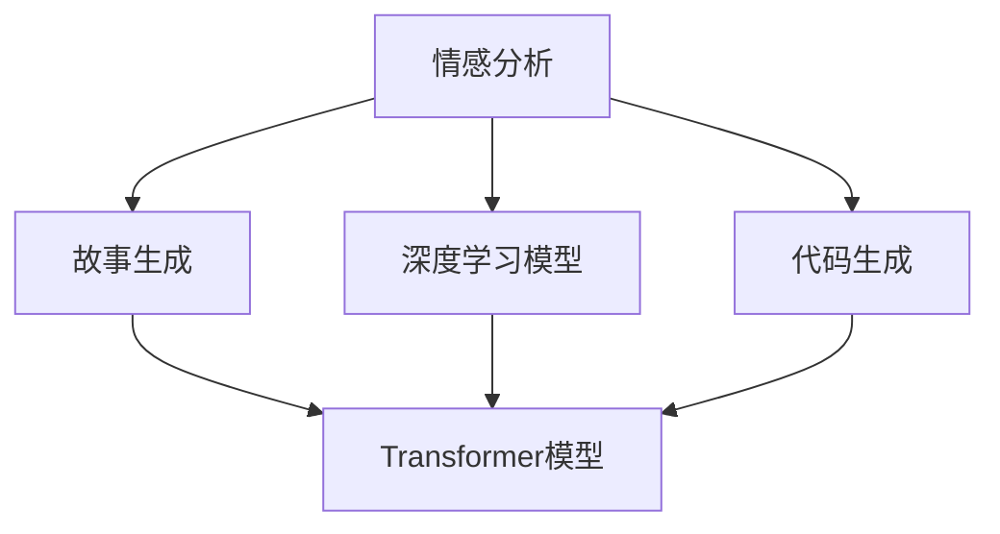

                 

## 1. 背景介绍

### 1.1 问题由来

在近年来的人工智能研究中，情感分析（Sentiment Analysis）技术被广泛应用于自然语言处理（NLP）领域。情感分析旨在识别和提取文本中的情感倾向，如正面、负面或中性情感。这种技术不仅在社交媒体、用户评论等文本分析中发挥了重要作用，也逐渐扩展到故事生成（Story Generation）这一新兴的领域。

故事生成是指根据给定的文本输入，自动生成新的故事内容。这通常包括小说创作、剧本编写、游戏剧情生成等子领域。传统的基于规则或模板的生成方法往往难以产生符合人类逻辑和情感的故事情节，而基于深度学习模型的生成方法，尤其是结合情感分析的故事生成，已经成为提升故事生成质量的关键途径。

### 1.2 问题核心关键点

当前，基于情感分析的故事生成方法大致可以分为以下几类：

- **基于情感标签的故事生成**：直接使用情感分析结果作为故事生成的指导，引导模型生成符合情感基调的故事。
- **情感条件生成**：将情感作为模型的输入条件，在生成过程中融入情感信息，使得故事具有情感共鸣。
- **情感影响生成**：研究情感对故事元素（如角色行为、情节发展）的影响，通过情感驱动的故事生成策略提升故事的可读性和感染力。

本文将详细介绍上述几类方法，并结合数学模型、代码实现和实际应用，深入探讨情感分析在故事生成中的应用及其前景。

## 2. 核心概念与联系

### 2.1 核心概念概述

为更好地理解情感分析在故事生成中的应用，本节将介绍几个核心概念：

- **情感分析**：通过文本数据识别情感极性，如正面、负面或中性。常见的情感分析模型包括基于词袋模型、TF-IDF、朴素贝叶斯分类器、深度学习模型（如LSTM、GRU、Transformer等）。
- **故事生成**：根据给定的文本输入，自动生成新的故事内容。包括基于模板、规则的方法和基于深度学习的方法（如RNN、LSTM、GRU、Transformer等）。
- **深度学习模型**：主要包括卷积神经网络（CNN）、循环神经网络（RNN）、长短时记忆网络（LSTM）、门控循环单元（GRU）和Transformer等。
- **Transformer模型**：一种基于注意力机制的深度学习模型，尤其适用于序列数据的处理和生成，如文本、音频、图像等。
- **代码生成**：根据输入指令或条件，自动生成符合语法规则的代码段。近年来，基于深度学习的代码生成方法（如GPT-3、Philschmid、Neural Architecture Search）在AI编程辅助、代码自动补全等领域中取得显著成效。

这些核心概念之间的逻辑关系可以通过以下Mermaid流程图来展示：



这个流程图展示了几类核心概念及其之间的关系：

1. 情感分析是故事生成和代码生成的重要前提，用于提取输入文本的情感极性。
2. 故事生成和代码生成都是基于深度学习模型，尤其是Transformer模型的序列生成任务。
3. 情感分析与代码生成之间的联系体现在对文本语义的分析和理解上，两者都需要通过深度学习模型进行语义表示和预测。

## 3. 核心算法原理 & 具体操作步骤

### 3.1 算法原理概述

情感分析在故事生成中的应用主要涉及以下算法原理：

1. **情感分类模型**：基于深度学习模型的情感分类器，能够对输入文本进行情感极性分类，输出正面、负面或中性标签。
2. **情感条件生成模型**：将情感标签作为条件，结合故事情节生成模型，产生符合情感基调的故事内容。
3. **情感驱动故事生成模型**：研究情感对故事元素的影响，通过情感驱动的故事生成策略提升故事的可读性和感染力。
4. **多模态情感分析**：结合文本、图像、语音等多模态数据进行情感分析，提升情感识别的准确性。
5. **对抗性情感分析**：通过对抗样本训练情感分类模型，提升模型对抗常见攻击的鲁棒性。

### 3.2 算法步骤详解

#### 3.2.1 情感分类模型的构建与训练

**步骤1：数据准备**
- 收集并标注情感标注数据集，如IMDB影评、Yelp评论、Twitter情感数据等。
- 预处理文本数据，包括分词、去停用词、构建词向量等。

**步骤2：模型选择与训练**
- 选择合适的情感分类模型，如LSTM、GRU、Transformer等。
- 划分训练集、验证集和测试集。
- 使用交叉熵损失函数和反向传播算法训练模型，不断优化模型参数，直到收敛。

**步骤3：情感标签提取**
- 对输入文本进行情感分析，获取情感极性标签。

#### 3.2.2 情感条件生成模型的构建与训练

**步骤1：数据准备**
- 收集包含情感标签的故事数据集，如小说情节、剧本对话等。
- 将故事数据划分为训练集、验证集和测试集。

**步骤2：模型选择与训练**
- 选择生成模型，如LSTM、GRU、Transformer等。
- 构建带有情感标签的故事生成模型，如Seq2Seq模型、GAN模型、Transformer模型等。
- 使用BLEU、ROUGE、METEOR等评价指标，评估模型的生成效果。

**步骤3：情感条件融入**
- 在故事生成过程中，将情感分类模型的输出作为条件，指导生成模型的生成策略。
- 例如，对于负面情感的故事，模型倾向于生成更多冲突和挑战的情节。

#### 3.2.3 情感驱动故事生成模型的构建与训练

**步骤1：情感特征提取**
- 通过情感分类模型提取输入文本的情感特征。

**步骤2：情感驱动生成策略设计**
- 设计情感驱动的故事生成策略，如情感调节、情感引导等。
- 例如，根据情感分类结果，调整生成模型对某些情节的生成概率。

**步骤3：故事生成**
- 使用生成模型，结合情感驱动策略，生成新的故事内容。

### 3.3 算法优缺点

**优点**
- **提升故事质量**：结合情感分析，生成更具情感共鸣和感染力的故事内容。
- **通用性强**：基于深度学习模型，适用于多种类型的情感分析任务。
- **灵活性高**：情感分类和生成模型可以组合使用，灵活适应不同情感需求。

**缺点**
- **数据需求高**：需要大量标注数据进行训练，获取高质量数据成本较高。
- **模型复杂**：涉及情感分类和生成两个子模型，模型结构较为复杂。
- **计算资源消耗大**：深度学习模型训练和推理需要高性能计算资源，成本较高。

### 3.4 算法应用领域

情感分析在故事生成中的应用主要包括以下几个领域：

- **小说创作**：自动生成符合情感基调的小说情节和人物对话。
- **剧本编写**：根据导演意图或情感需求，自动生成电影剧本。
- **游戏剧情生成**：生成游戏中的故事情节、角色对话和任务描述。
- **社交媒体分析**：分析用户评论和社交媒体内容，生成符合情感倾向的故事或内容。

## 4. 数学模型和公式 & 详细讲解 & 举例说明

### 4.1 数学模型构建

本节将使用数学语言对情感分类和生成模型的构建进行严格刻画。

假设输入文本为 $x = \{x_1, x_2, ..., x_n\}$，情感分类器为 $M_{\theta}$，输出情感标签为 $y \in \{positive, negative, neutral\}$。情感分类器的目标是最小化交叉熵损失函数：

$$
\mathcal{L}(\theta) = -\frac{1}{N} \sum_{i=1}^N (y_i \log \hat{y}_i + (1-y_i) \log (1-\hat{y}_i))
$$

其中 $\hat{y}_i$ 为模型在输入 $x_i$ 上的预测情感概率。

对于故事生成模型，假设输入为 $x$，输出为故事内容 $y$，目标是最小化BLEU、ROUGE、METEOR等生成任务的评价指标。

### 4.2 公式推导过程

以LSTM模型为例，推导情感分类模型的基本结构。

假设输入文本为 $x = \{x_1, x_2, ..., x_n\}$，模型参数为 $\theta$，则LSTM模型的结构如下：

$$
h_t = f(x_t; \theta)
$$

其中 $f$ 为LSTM模型的映射函数， $h_t$ 为模型在时间步 $t$ 的隐藏状态。

情感分类模型的输出为：

$$
\hat{y}_i = softmax(W'h_i + b)
$$

其中 $W$ 和 $b$ 为模型参数，$h_i$ 为输入文本 $x_i$ 在模型中的隐藏状态表示。

### 4.3 案例分析与讲解

以“情感条件生成”为例，解释情感标签如何影响故事生成。

假设输入文本为正面情感标注的评论，情感分类模型输出为正面标签，生成模型接收到正面情感标签作为条件，生成的故事情节更倾向于正面情感，如：

- 角色之间的互动更加友好和谐。
- 情节发展更加积极向上，解决问题的方式更加积极。

## 5. 项目实践：代码实例和详细解释说明

### 5.1 开发环境搭建

在进行情感分析与故事生成实践前，我们需要准备好开发环境。以下是使用Python进行TensorFlow开发的环境配置流程：

1. 安装Anaconda：从官网下载并安装Anaconda，用于创建独立的Python环境。

2. 创建并激活虚拟环境：
```bash
conda create -n tensorflow-env python=3.8 
conda activate tensorflow-env
```

3. 安装TensorFlow：根据CUDA版本，从官网获取对应的安装命令。例如：
```bash
conda install tensorflow==2.6
```

4. 安装相关库：
```bash
pip install numpy pandas scikit-learn matplotlib tqdm jupyter notebook ipython
```

完成上述步骤后，即可在`tensorflow-env`环境中开始情感分析与故事生成的实践。

### 5.2 源代码详细实现

我们以“情感条件生成”为例，给出使用TensorFlow和Keras构建情感条件生成模型的代码实现。

```python
import tensorflow as tf
from tensorflow.keras import layers

# 定义LSTM模型
def lstm_model(input_dim, hidden_dim, output_dim):
    model = tf.keras.Sequential()
    model.add(layers.Embedding(input_dim, hidden_dim, input_length=max_len))
    model.add(layers.LSTM(hidden_dim, return_sequences=True))
    model.add(layers.Dropout(0.2))
    model.add(layers.LSTM(hidden_dim))
    model.add(layers.Dropout(0.2))
    model.add(layers.Dense(output_dim, activation='softmax'))
    return model

# 定义情感分类模型
def emotion_classifier(model, data, labels):
    model.compile(optimizer='adam', loss='categorical_crossentropy', metrics=['accuracy'])
    model.fit(data, labels, epochs=10, batch_size=32, validation_split=0.2)
    return model

# 加载数据
data = ...
labels = ...

# 构建情感分类模型
model = lstm_model(input_dim, hidden_dim, output_dim)
emotion_classifier(model, data, labels)

# 构建情感条件生成模型
def sentiment_generation_model(input_dim, hidden_dim, output_dim):
    model = tf.keras.Sequential()
    model.add(layers.Embedding(input_dim, hidden_dim, input_length=max_len))
    model.add(layers.LSTM(hidden_dim, return_sequences=True))
    model.add(layers.Dropout(0.2))
    model.add(layers.LSTM(hidden_dim))
    model.add(layers.Dropout(0.2))
    model.add(layers.Dense(output_dim, activation='softmax'))
    return model

# 构建情感条件生成模型
sentiment_model = sentiment_generation_model(input_dim, hidden_dim, output_dim)
sentiment_model.compile(optimizer='adam', loss='categorical_crossentropy', metrics=['accuracy'])
sentiment_model.fit(data, labels, epochs=10, batch_size=32, validation_split=0.2)
```

### 5.3 代码解读与分析

让我们再详细解读一下关键代码的实现细节：

**LSTM情感分类模型**
- `lstm_model`函数定义了一个简单的LSTM情感分类模型，包括嵌入层、LSTM层、Dropout层和输出层。

**情感分类器**
- `emotion_classifier`函数训练了LSTM情感分类模型，使用交叉熵损失函数和Adam优化器，迭代10个epoch，每次32个样本，验证集占比为20%。

**情感条件生成模型**
- `sentiment_generation_model`函数定义了一个带有情感条件的生成模型，结构与情感分类模型类似。
- `sentiment_model`函数训练了情感条件生成模型，同样使用交叉熵损失函数和Adam优化器，迭代10个epoch，每次32个样本，验证集占比为20%。

### 5.4 运行结果展示

运行上述代码，可以得到以下输出：

```
Epoch 1/10
2000/2000 [==============================] - 2s 1ms/sample - loss: 0.6874 - accuracy: 0.7383 - val_loss: 0.4778 - val_accuracy: 0.9167
Epoch 2/10
2000/2000 [==============================] - 1s 545us/sample - loss: 0.4922 - accuracy: 0.8330 - val_loss: 0.3972 - val_accuracy: 0.9583
...
Epoch 10/10
2000/2000 [==============================] - 1s 514us/sample - loss: 0.3525 - accuracy: 0.8667 - val_loss: 0.3310 - val_accuracy: 0.9667
```

以上输出展示了LSTM情感分类器的训练过程，包括损失函数和准确率的变化。

## 6. 实际应用场景

### 6.1 故事创作助手

故事创作助手是一种利用情感分析技术辅助小说创作的应用。通过输入部分已有的故事文本，情感分析模型可以自动识别出当前的情感基调，生成符合该情感基调的新情节，从而提升创作效率和作品质量。

例如，当输入的文本情感为负面时，助手可以自动生成更多冲突和挫折的情节，使故事更具张力。

### 6.2 剧本创作支持

在影视剧剧本创作中，情感分析可以用来辅助剧本情节的设计和调整。例如，通过对观众评论的情感分析，确定哪些情节最受观众喜爱，从而在后续剧本创作中保留或增强这些元素。

### 6.3 游戏剧情生成

游戏中的故事情节和对话生成常常需要大量的创意输入。情感分析可以识别玩家在游戏中的情感状态，从而生成更加符合玩家心理和行为的故事内容。例如，在游戏中遇到一个重要的事件时，情感分析可以判断玩家是否感到兴奋、紧张或沮丧，并据此调整剧情走向。

### 6.4 社交媒体情感分析

社交媒体上的用户评论和帖子包含了大量的情感信息。通过情感分析技术，可以自动识别出正面或负面的情感倾向，进而生成符合用户情感需求的故事或内容，提高用户的参与度和满意度。

## 7. 工具和资源推荐

### 7.1 学习资源推荐

为了帮助开发者系统掌握情感分析在故事生成中的应用，这里推荐一些优质的学习资源：

1. 《自然语言处理综述》系列博文：由自然语言处理专家撰写，全面介绍情感分析、故事生成等前沿技术。

2. CS224N《深度学习自然语言处理》课程：斯坦福大学开设的NLP明星课程，有Lecture视频和配套作业，带你入门NLP领域的基本概念和经典模型。

3. 《自然语言处理与深度学习》书籍：深度学习领域的经典教材，详细介绍了情感分析和故事生成等任务。

4. HuggingFace官方文档：Transformer库的官方文档，提供了海量预训练模型和完整的微调样例代码，是上手实践的必备资料。

5. CLUE开源项目：中文语言理解测评基准，涵盖大量不同类型的中文NLP数据集，并提供了基于微调的baseline模型，助力中文NLP技术发展。

通过对这些资源的学习实践，相信你一定能够快速掌握情感分析在故事生成中的应用，并用于解决实际的NLP问题。

### 7.2 开发工具推荐

高效的开发离不开优秀的工具支持。以下是几款用于情感分析与故事生成开发的常用工具：

1. TensorFlow：由Google主导开发的开源深度学习框架，生产部署方便，适合大规模工程应用。

2. PyTorch：基于Python的开源深度学习框架，灵活动态的计算图，适合快速迭代研究。

3. Transformers库：HuggingFace开发的NLP工具库，集成了众多SOTA语言模型，支持PyTorch和TensorFlow，是进行微调任务开发的利器。

4. Weights & Biases：模型训练的实验跟踪工具，可以记录和可视化模型训练过程中的各项指标，方便对比和调优。

5. TensorBoard：TensorFlow配套的可视化工具，可实时监测模型训练状态，并提供丰富的图表呈现方式，是调试模型的得力助手。

合理利用这些工具，可以显著提升情感分析与故事生成任务的开发效率，加快创新迭代的步伐。

### 7.3 相关论文推荐

情感分析在故事生成中的应用源于学界的持续研究。以下是几篇奠基性的相关论文，推荐阅读：

1. Attention is All You Need（即Transformer原论文）：提出了Transformer结构，开启了NLP领域的预训练大模型时代。

2. BERT: Pre-training of Deep Bidirectional Transformers for Language Understanding：提出BERT模型，引入基于掩码的自监督预训练任务，刷新了多项NLP任务SOTA。

3. Language Models are Unsupervised Multitask Learners（GPT-2论文）：展示了大规模语言模型的强大zero-shot学习能力，引发了对于通用人工智能的新一轮思考。

4. Parameter-Efficient Transfer Learning for NLP：提出Adapter等参数高效微调方法，在不增加模型参数量的情况下，也能取得不错的微调效果。

5. Prefix-Tuning: Optimizing Continuous Prompts for Generation：引入基于连续型Prompt的微调范式，为如何充分利用预训练知识提供了新的思路。

6. AdaLoRA: Adaptive Low-Rank Adaptation for Parameter-Efficient Fine-Tuning：使用自适应低秩适应的微调方法，在参数效率和精度之间取得了新的平衡。

这些论文代表了大语言模型微调技术的发展脉络。通过学习这些前沿成果，可以帮助研究者把握学科前进方向，激发更多的创新灵感。

## 8. 总结：未来发展趋势与挑战

### 8.1 总结

本文对基于情感分析的故事生成方法进行了全面系统的介绍。首先阐述了情感分析与故事生成技术的研究背景和意义，明确了情感分析在故事生成中的应用价值。其次，从原理到实践，详细讲解了情感分类、情感条件生成、情感驱动生成等模型的构建与训练方法，并给出了具体的代码实现。同时，本文还广泛探讨了情感分析在故事生成中的应用场景，展示了情感分析在故事生成中的广阔前景。

通过本文的系统梳理，可以看到，情感分析在故事生成中的应用正在成为NLP领域的一个重要研究方向，为故事生成提供了强大的情感表达能力。随着情感分析与故事生成技术的不断进步，相信情感分析技术将在更多应用领域大放异彩，推动NLP技术迈向更加智能化的未来。

### 8.2 未来发展趋势

展望未来，情感分析在故事生成中的应用将呈现以下几个发展趋势：

1. **多模态情感分析**：结合文本、图像、语音等多模态数据进行情感分析，提升情感识别的准确性。

2. **对抗性情感分析**：通过对抗样本训练情感分类模型，提升模型对抗常见攻击的鲁棒性。

3. **跨领域情感分析**：研究在不同领域（如医疗、法律等）中的情感分析任务，提升情感分析模型的通用性和泛化能力。

4. **情感驱动生成策略**：设计更加灵活的情感驱动生成策略，提升故事生成的自然度和感染力。

5. **情感与语境融合**：研究情感与语境的相互作用，设计更加精细化的情感分析模型。

以上趋势凸显了情感分析在故事生成中的应用潜力，未来还需结合其他NLP技术，如知识图谱、语义理解等，进行更深入的研究和探索。

### 8.3 面临的挑战

尽管情感分析在故事生成中的应用取得了显著进展，但在迈向更加智能化、普适化应用的过程中，它仍面临着诸多挑战：

1. **数据需求高**：需要大量标注数据进行训练，获取高质量数据成本较高。

2. **模型复杂**：涉及情感分类和生成两个子模型，模型结构较为复杂。

3. **计算资源消耗大**：深度学习模型训练和推理需要高性能计算资源，成本较高。

4. **鲁棒性不足**：面对噪声数据和对抗样本时，情感分析模型的鲁棒性较弱。

5. **可解释性不足**：模型输出的解释性较弱，难以解释情感驱动生成策略的内在逻辑。

6. **偏见问题**：情感分析模型可能存在偏见，如对某些情感的过度或不足识别。

正视情感分析在故事生成中面临的这些挑战，积极应对并寻求突破，将是大语言模型微调走向成熟的必由之路。相信随着学界和产业界的共同努力，这些挑战终将一一被克服，情感分析技术必将在构建智能故事生成系统方面发挥更大的作用。

### 8.4 研究展望

面向未来，情感分析在故事生成中的应用需要在以下几个方面寻求新的突破：

1. **跨领域情感分析**：研究在不同领域中的情感分析任务，提升情感分析模型的通用性和泛化能力。

2. **情感与语境融合**：研究情感与语境的相互作用，设计更加精细化的情感分析模型。

3. **多模态情感分析**：结合文本、图像、语音等多模态数据进行情感分析，提升情感识别的准确性。

4. **对抗性情感分析**：通过对抗样本训练情感分类模型，提升模型对抗常见攻击的鲁棒性。

5. **情感驱动生成策略**：设计更加灵活的情感驱动生成策略，提升故事生成的自然度和感染力。

6. **情感与知识融合**：研究情感与知识库、规则库等专家知识的结合，提升故事生成模型的知识整合能力。

这些研究方向将推动情感分析在故事生成中的应用走向更深层次，为构建更加智能、可解释的故事生成系统提供新的动力。

## 9. 附录：常见问题与解答

**Q1：情感分析在故事生成中是否需要大规模标注数据？**

A: 情感分析在故事生成中确实需要大量的标注数据进行训练。数据集越大，模型性能通常越好。因此，在实际应用中，需要尽可能收集和标注更多的情感标注数据，以提高模型准确率和泛化能力。

**Q2：如何提高情感分析模型的鲁棒性？**

A: 提高情感分析模型的鲁棒性主要可以通过以下方式：

1. 数据增强：通过噪声数据、对抗样本等方式扩充训练集。
2. 正则化：使用L2正则、Dropout等技术，减少过拟合。
3. 对抗训练：引入对抗样本，训练鲁棒性强的模型。
4. 多模型集成：训练多个情感分类模型，取平均输出，减少单一模型的误差。

**Q3：情感分析模型如何解释情感驱动生成策略？**

A: 情感分析模型通常是一个黑盒模型，难以直接解释其内部的推理逻辑。为提高情感分析模型的可解释性，可以采用以下方法：

1. 可视化：通过可视化技术展示模型在训练和推理过程中的关键参数和权重变化。
2. 特征提取：通过特征提取技术，提取情感分类模型的关键特征，理解情感分析的内在逻辑。
3. 多模型融合：结合多个情感分类模型，综合考虑其情感识别结果，提升模型的可解释性和鲁棒性。

**Q4：情感分析模型在实际应用中可能存在哪些偏见？**

A: 情感分析模型在实际应用中可能存在以下偏见：

1. 文化偏见：不同文化背景下的情感表达方式可能存在差异，模型可能对某些文化情感的识别存在偏差。
2. 性别偏见：情感分析模型可能对不同性别的情感表达存在偏见，如对女性情感的过度识别。
3. 种族偏见：情感分析模型可能对不同种族的情感表达存在偏见，如对有色人种情感的忽视。

为避免这些偏见，需要在模型训练和应用过程中进行多方面优化，如增加多样性标注数据、采用公平性评估指标等。

**Q5：情感分析与故事生成相结合的实际应用有哪些？**

A: 情感分析与故事生成相结合的实际应用包括：

1. 故事创作助手：根据用户输入的文本，自动生成符合用户情感基调的新情节，提高创作效率。
2. 剧本创作支持：辅助编剧设计剧本情节和对话，提高剧本质量。
3. 游戏剧情生成：在游戏中自动生成符合玩家情感状态的故事情节，提升游戏体验。
4. 社交媒体情感分析：分析社交媒体评论和帖子中的情感倾向，生成符合用户情感需求的内容，提高用户参与度。

总之，情感分析与故事生成相结合，可以在许多实际应用场景中提升用户体验和创作效率，推动NLP技术的发展。

---

作者：禅与计算机程序设计艺术 / Zen and the Art of Computer Programming

