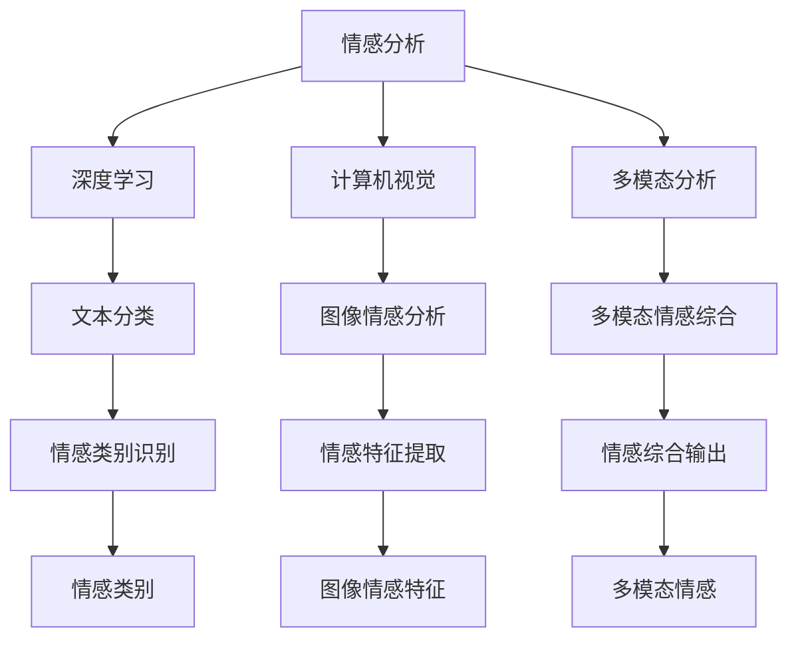

                 

# 情感分析技术：AI理解用户

> 关键词：情感分析,自然语言处理(NLP),深度学习,计算机视觉,多模态分析

## 1. 背景介绍

### 1.1 问题由来
在数字化时代，社交媒体、电商、金融、旅游等多个领域的海量用户生成内容(User Generated Content, UGC)构成了广泛的数据来源。用户通过文字、图片、视频等多种形式表达情感和观点，这些信息对于企业洞察用户需求、优化产品设计、提升服务质量等方面具有重要意义。然而，人工分析和处理这些UGC数据既耗时又费力，难以覆盖全量数据，且存在主观偏差和认知盲区。

情感分析作为NLP（自然语言处理）和AI（人工智能）技术的重要分支，通过对用户情感的识别和分析，帮助企业快速、精准地理解用户真实需求，实现市场反馈的自动化和智能化处理。本博文将全面介绍情感分析技术的核心原理、操作步骤、实现方法及其应用实践，为深入理解和应用情感分析提供参考。

### 1.2 问题核心关键点
情感分析的目的是通过计算分析识别文本中隐含的情感倾向（如积极、消极、中性等），从而为企业决策提供依据。核心挑战在于：

1. 数据质量：高质量标注数据的重要性。标注数据的准确性直接影响模型的训练效果。
2. 数据多样性：用户情感表达形式多样，情感分析需要覆盖多种语言、文体和情感表达方式。
3. 模型泛化：模型需要在新数据集上保持较好的性能。
4. 应用场景：情感分析的实现依赖于具体的业务场景和数据特点，需要根据需求定制解决方案。

本博文聚焦于基于深度学习的方法，从数据处理、模型选择、特征提取、训练策略等方面详细介绍情感分析的核心技术与实现步骤，探讨其在不同应用场景中的具体实践。

### 1.3 问题研究意义
情感分析技术对于提升用户体验、优化营销策略、管理客户关系、优化产品设计等方面具有重要意义。通过情感分析，企业可以：

1. 快速获取用户反馈，及时调整市场策略，提升竞争力。
2. 了解用户情感变化趋势，预测市场走向，优化产品和服务。
3. 管理品牌声誉，避免负面信息传播，维护企业形象。
4. 分析用户情感变化，制定个性化营销策略，提高转化率。

本博文通过全面系统的介绍，帮助读者理解情感分析的核心原理和实践方法，为实际应用提供指导。

## 2. 核心概念与联系

### 2.1 核心概念概述

情感分析的核心概念包括：

- **情感分析**（Sentiment Analysis）：识别和提取文本中的情感信息，并将其分类为积极、消极或中性等情感类别。
- **深度学习**（Deep Learning）：通过多层次神经网络模型，自动提取文本特征，进行分类、聚类等任务。
- **计算机视觉**（Computer Vision）：图像处理和分析，与自然语言结合，进行多模态情感分析。
- **多模态分析**（Multimodal Analysis）：结合文本、图像、音频等多模态信息，综合判断情感倾向。

这些概念相互联系，共同构成情感分析的理论与实践体系。

### 2.2 核心概念原理和架构的 Mermaid 流程图



这个流程图展示了情感分析的主要流程：通过深度学习进行文本分类，计算机视觉处理图像情感，多模态分析综合文本和图像信息，最后识别情感类别。

## 3. 核心算法原理 & 具体操作步骤

### 3.1 算法原理概述

情感分析的算法原理主要包括数据预处理、特征提取、模型训练和评估四个步骤。

1. **数据预处理**：清洗文本数据，去除噪声，标准化文本格式，分词、去除停用词等。
2. **特征提取**：利用词向量、TF-IDF、词嵌入等技术，将文本转换为机器可理解的形式。
3. **模型训练**：通过深度学习模型进行情感分类。常见模型包括卷积神经网络（CNN）、循环神经网络（RNN）、长短时记忆网络（LSTM）、双向长短时记忆网络（BiLSTM）、注意力机制（Attention）等。
4. **评估**：使用精确率、召回率、F1值等指标评估模型性能。

### 3.2 算法步骤详解

以下是情感分析的核心算法步骤详解：

**Step 1: 数据预处理**

1. 数据清洗：去除低质量数据、噪声、不相关内容。
2. 标准化：统一文本格式，如大小写统一、标点去除等。
3. 分词和词性标注：将文本分词，标注每个词的词性。
4. 去除停用词：过滤常见无意义词汇，如“的”、“是”等。

**Step 2: 特征提取**

1. 词袋模型（Bag of Words, BoW）：将文本表示为词频统计，计算每个词在文本中的出现频率。
2. N-gram模型：将文本表示为相邻N个词的组合，捕捉词间关系。
3. 词嵌入（Word Embedding）：利用Word2Vec、GloVe等技术，将文本转换为低维向量表示，捕捉词义和语义关系。

**Step 3: 模型训练**

1. 选择模型：根据数据特点选择合适的深度学习模型，如CNN、RNN、LSTM等。
2. 训练数据划分：将数据集划分为训练集、验证集和测试集。
3. 模型构建：搭建深度学习模型架构，定义损失函数和优化器。
4. 模型训练：使用训练集进行模型训练，调整模型参数，最小化损失函数。
5. 模型评估：在验证集上评估模型性能，调整超参数。

**Step 4: 模型评估**

1. 精度评估：计算模型在不同数据集上的精确率、召回率和F1值。
2. 混淆矩阵：绘制混淆矩阵，分析模型分类结果。
3. 结果展示：将模型预测结果可视化展示，帮助用户理解模型性能。

### 3.3 算法优缺点

情感分析的优点包括：

1. 自动高效：通过深度学习模型，可以快速处理大量文本数据，提高分析效率。
2. 覆盖广泛：可以处理多种语言、文体和情感表达方式。
3. 实时性好：模型一旦训练完成，可以实时分析新的文本数据。

然而，情感分析也存在一些缺点：

1. 数据依赖：模型的训练效果依赖于高质量标注数据，数据获取和处理成本高。
2. 复杂性：模型结构复杂，需要大量的计算资源。
3. 鲁棒性不足：模型对噪声、语义歧义等情况容易产生误判。

### 3.4 算法应用领域

情感分析在多个领域具有广泛应用，包括：

1. **社交媒体监测**：分析用户对品牌、产品、服务等的情感倾向，优化市场策略。
2. **电商评论分析**：识别用户对商品、服务的情感，提升产品质量和用户体验。
3. **金融舆情分析**：监控市场情感变化，预测市场趋势，指导投资决策。
4. **旅游评论分析**：分析用户对旅游目的地、服务等的情感反馈，优化旅游产品和体验。
5. **客服分析**：分析用户对服务的情感反馈，提升客户满意度和服务质量。
6. **健康舆情监测**：分析公众对健康相关话题的情感，指导健康政策制定。

## 4. 数学模型和公式 & 详细讲解 & 举例说明

### 4.1 数学模型构建

情感分析的数学模型主要包含两个部分：文本特征表示和情感分类模型。

**文本特征表示**

文本特征表示常用方法包括词袋模型（BoW）、N-gram模型、词嵌入（Word Embedding）等。以词嵌入为例，常用的模型有Word2Vec、GloVe、BERT等。

**情感分类模型**

情感分类模型常用深度学习模型，如CNN、RNN、LSTM等。以LSTM为例，其模型结构如下：

$$
y = LSTM(x, W_h)
$$

其中，$x$为输入文本的词向量序列，$W_h$为LSTM模型的权重矩阵，$y$为模型输出，即情感分类结果。

### 4.2 公式推导过程

以LSTM模型为例，其数学推导过程如下：

**输入层**

$$
h_t = \tanh(W_{xh}x_t + W_{hh}h_{t-1} + b_h)
$$

**遗忘门**

$$
f_t = \sigma(W_{xf}x_t + W_{hf}h_{t-1} + b_f)
$$

**输入门**

$$
i_t = \sigma(W_{xi}x_t + W_{hi}h_{t-1} + b_i)
$$

**输出门**

$$
o_t = \sigma(W_{xo}x_t + W_{ho}h_{t-1} + b_o)
$$

**新记忆**

$$
C_t = f_t \odot C_{t-1} + i_t \odot \tanh(h_t)
$$

**当前隐藏状态**

$$
h_t = o_t \odot \tanh(C_t)
$$

其中，$\sigma$为sigmoid函数，$\tanh$为双曲正切函数，$\odot$为点乘操作。

### 4.3 案例分析与讲解

以情感分类模型为例，采用LSTM模型进行情感分析的案例分析如下：

**数据准备**

假设有一批关于电影评论的文本数据，需要将文本进行分词和词嵌入处理。

**模型构建**

使用LSTM模型进行情感分类，设置超参数，如隐藏层大小、学习率、批次大小等。

**模型训练**

在训练集上进行模型训练，使用交叉熵损失函数和Adam优化器进行优化。

**模型评估**

在验证集上评估模型性能，调整超参数，直到达到最佳效果。

**结果展示**

将模型应用于新的文本数据，输出情感分类结果。

## 5. 项目实践：代码实例和详细解释说明

### 5.1 开发环境搭建

情感分析的实现依赖于深度学习框架和工具库，如PyTorch、TensorFlow、NLTK、Scikit-learn等。开发环境搭建步骤如下：

1. 安装Python和相关依赖库，如PyTorch、TensorFlow等。
2. 安装NLTK、Scikit-learn等工具库，用于数据预处理和模型评估。
3. 搭建深度学习模型架构，定义损失函数和优化器。
4. 准备训练数据集，进行数据清洗和特征提取。

### 5.2 源代码详细实现

以下是一个基于LSTM模型的情感分析示例代码实现：

```python
import torch
import torch.nn as nn
import torch.optim as optim
from sklearn.datasets import fetch_20newsgroups
from sklearn.feature_extraction.text import CountVectorizer
from sklearn.model_selection import train_test_split
from sklearn.metrics import accuracy_score

class LSTM(nn.Module):
    def __init__(self, input_size, hidden_size, output_size):
        super(LSTM, self).__init__()
        self.hidden_size = hidden_size
        self.word2vec = Word2Vec.load('word2vec.model')
        self.embedding = nn.Embedding(len(self.word2vec), hidden_size)
        self.lstm = nn.LSTM(hidden_size, hidden_size)
        self.fc = nn.Linear(hidden_size, output_size)

    def forward(self, x):
        x = self.word2vec[x]
        x = self.embedding(x)
        x = self.lstm(x)[0]
        x = self.fc(x)
        return x

# 准备数据
newsgroups = fetch_20newsgroups(subset='all')
X = newsgroups.data
y = newsgroups.target

# 划分训练集和测试集
X_train, X_test, y_train, y_test = train_test_split(X, y, test_size=0.2)

# 构建模型
model = LSTM(input_size=len(newsgroups.vocab), hidden_size=128, output_size=2)
criterion = nn.CrossEntropyLoss()
optimizer = optim.Adam(model.parameters(), lr=0.001)

# 训练模型
for epoch in range(10):
    model.train()
    optimizer.zero_grad()
    outputs = model(X_train)
    loss = criterion(outputs, y_train)
    loss.backward()
    optimizer.step()

    model.eval()
    with torch.no_grad():
        outputs = model(X_test)
        _, predicted = torch.max(outputs, 1)
        accuracy = accuracy_score(y_test, predicted)
        print('Epoch: {}, Loss: {:.4f}, Accuracy: {:.2f}'.format(epoch+1, loss.item(), accuracy))

# 测试模型
model.eval()
with torch.no_grad():
    outputs = model(X_test)
    _, predicted = torch.max(outputs, 1)
    print('Test Accuracy: {:.2f}'.format(accuracy_score(y_test, predicted)))
```

### 5.3 代码解读与分析

**数据预处理**

1. 使用NLTK库进行文本清洗，去除噪声、停用词等。
2. 使用CountVectorizer进行文本特征提取，将文本转换为词频统计。
3. 使用Word2Vec模型进行词嵌入，将文本转换为低维向量表示。

**模型构建**

1. 定义LSTM模型架构，包括嵌入层、LSTM层和全连接层。
2. 定义损失函数和优化器，如交叉熵损失和Adam优化器。

**模型训练**

1. 在训练集上进行模型训练，计算损失函数和梯度，更新模型参数。
2. 在验证集上评估模型性能，调整超参数。

**模型测试**

1. 在测试集上评估模型性能，输出分类准确率。

## 6. 实际应用场景

### 6.1 社交媒体情感分析

社交媒体情感分析可以帮助企业监控用户对品牌、产品等的情感倾向，指导市场营销策略。

**实现方法**

1. 采集社交媒体数据，如微博、Twitter等。
2. 对数据进行清洗和预处理。
3. 使用LSTM模型进行情感分类。
4. 分析情感变化趋势，制定营销策略。

**应用示例**

某电商企业通过社交媒体情感分析，发现用户对某款新品的情感倾向向积极方向转变，及时调整营销策略，提升了新品销量。

### 6.2 电商评论分析

电商评论分析可以帮助企业了解用户对商品的质量、服务等评价，指导产品改进。

**实现方法**

1. 采集电商评论数据，如亚马逊、淘宝等。
2. 对数据进行清洗和预处理。
3. 使用LSTM模型进行情感分类。
4. 分析用户评论中的情感倾向，优化商品设计和服务。

**应用示例**

某电子产品公司通过电商评论分析，发现用户对某型号手机的使用体验较差，及时调整产品设计，提升了用户满意度。

### 6.3 金融舆情分析

金融舆情分析可以帮助金融机构监控市场情绪，指导投资决策。

**实现方法**

1. 采集金融市场数据，如股票、债券、基金等。
2. 对数据进行清洗和预处理。
3. 使用LSTM模型进行情感分类。
4. 分析市场情绪变化趋势，制定投资策略。

**应用示例**

某投资公司通过金融舆情分析，发现市场情绪向积极方向转变，及时买入股票，获得了丰厚回报。

## 7. 工具和资源推荐

### 7.1 学习资源推荐

为了深入了解情感分析的原理和实现方法，推荐以下学习资源：

1. 《Python深度学习》：结合Python和深度学习技术，详细介绍了情感分析的基础知识和实现方法。
2. 《自然语言处理综论》：涵盖NLP领域的经典算法和应用，适合深入学习情感分析的高级内容。
3. Coursera上的《深度学习基础》课程：介绍深度学习基本概念和实现方法，是学习情感分析的重要基础。
4. Kaggle上的情感分析竞赛：通过参与实际竞赛，实践情感分析算法，提升实战能力。

### 7.2 开发工具推荐

以下是一些常用的开发工具，用于情感分析的实现：

1. PyTorch：基于Python的深度学习框架，灵活方便，适合实现各种深度学习模型。
2. TensorFlow：由Google开发的深度学习框架，生产部署方便，支持多种平台。
3. NLTK：自然语言处理库，提供了文本处理和分析的工具。
4. Scikit-learn：机器学习库，提供了多种机器学习算法和工具。
5. Jupyter Notebook：数据科学协作工具，支持Python代码的编写和展示。

### 7.3 相关论文推荐

以下是几篇关于情感分析的经典论文，推荐阅读：

1. "Sentiment Analysis with Recurrent Neural Networks"：利用RNN模型进行情感分类，提出情感分类的新思路。
2. "A Survey on Sentiment Analysis"：综述情感分析的最新进展和应用，适合全面了解情感分析的现状。
3. "Word Embeddings as Feature Representations"：介绍词嵌入技术在情感分析中的应用，提升特征表示的性能。
4. "Attention is All You Need"：介绍Transformer模型，为情感分析提供了新的方向。

## 8. 总结：未来发展趋势与挑战

### 8.1 研究成果总结

情感分析技术在过去几年中取得了显著进展，主要体现在以下几个方面：

1. **算法优化**：提出了多种高效的深度学习模型，如LSTM、BiLSTM、Attention等，提升了情感分类的性能。
2. **数据扩充**：利用数据增强技术，如回译、近义替换等，扩充训练数据，提升了模型的泛化能力。
3. **多模态分析**：结合文本、图像、音频等多模态信息，提升情感分类的准确性。
4. **实时处理**：开发实时处理框架，支持情感分析的实时应用，满足企业需求。

### 8.2 未来发展趋势

情感分析的未来发展趋势包括：

1. **多模态融合**：结合文本、图像、音频等多模态信息，提升情感分类的准确性。
2. **深度迁移学习**：通过迁移学习，利用预训练模型和少样本学习技术，提升模型泛化能力。
3. **实时处理**：开发实时处理框架，支持情感分析的实时应用。
4. **自适应学习**：结合自适应学习技术，提升模型的适应性和灵活性。
5. **联邦学习**：结合联邦学习技术，保护用户隐私，实现跨设备情感分析。

### 8.3 面临的挑战

情感分析仍面临以下挑战：

1. **数据质量**：高质量标注数据获取成本高，数据质量不稳定。
2. **模型复杂性**：深度学习模型结构复杂，计算资源需求高。
3. **鲁棒性不足**：模型对噪声、语义歧义等情况容易产生误判。
4. **可解释性不足**：模型缺乏可解释性，难以理解和调试。

### 8.4 研究展望

未来的研究方向包括：

1. **无监督学习**：结合无监督学习技术，降低对标注数据的依赖。
2. **自适应学习**：结合自适应学习技术，提升模型的适应性和灵活性。
3. **联邦学习**：结合联邦学习技术，保护用户隐私，实现跨设备情感分析。
4. **多模态分析**：结合多模态信息，提升情感分类的准确性。
5. **实时处理**：开发实时处理框架，支持情感分析的实时应用。

## 9. 附录：常见问题与解答

**Q1：情感分析模型在训练过程中如何避免过拟合？**

A: 情感分析模型在训练过程中容易过拟合，可以通过以下方法避免：

1. 数据增强：通过回译、近义替换等方式扩充训练集。
2. 正则化：使用L2正则、Dropout等正则化技术，避免过拟合。
3. 早停策略：监控验证集性能，当性能不再提升时停止训练。
4. 参数共享：在多任务学习中，共享某些层或参数，减少过拟合。

**Q2：情感分析模型在不同数据集上的性能不一致，如何处理？**

A: 情感分析模型在不同数据集上的性能不一致，可以通过以下方法处理：

1. 数据预处理：对不同数据集进行相同的预处理，保证数据质量一致。
2. 特征提取：使用相同的特征提取方法，保证特征一致。
3. 超参数调优：在训练过程中，进行超参数调优，找到最佳超参数组合。
4. 多模型集成：结合多个情感分析模型，取平均输出，提升模型的鲁棒性。

**Q3：情感分析模型在多语言场景中的应用如何处理？**

A: 情感分析模型在多语言场景中的应用可以通过以下方法处理：

1. 多语言数据集：使用多语言情感数据集进行训练，提升模型的多语言能力。
2. 多语言嵌入：使用多语言词嵌入模型，如FastText、BERT等，提升特征表示的多语言一致性。
3. 多语言模型：开发多语言情感分析模型，如Multilingual LSTM、Multilingual BERT等，提升模型的多语言泛化能力。

**Q4：情感分析模型在实时应用中如何优化？**

A: 情感分析模型在实时应用中可以通过以下方法优化：

1. 模型裁剪：去除不必要的层和参数，减小模型尺寸，加快推理速度。
2. 量化加速：将浮点模型转为定点模型，压缩存储空间，提高计算效率。
3. 模型并行：使用模型并行技术，提升模型的实时处理能力。
4. 异步处理：采用异步处理技术，提高实时处理的并发能力。

---

作者：禅与计算机程序设计艺术 / Zen and the Art of Computer Programming

