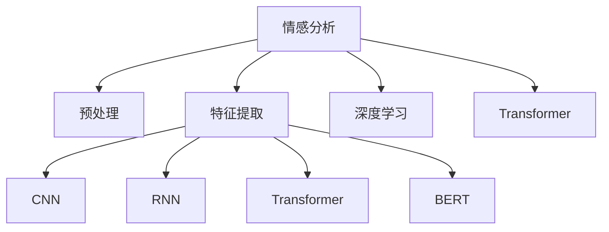

                 

## 1. 背景介绍

### 1.1 问题由来

随着数字化时代的来临，用户在各类平台上的活动数据不断积累，为品牌和商家提供了丰富的用户行为数据。情感分析作为一项重要的用户行为理解技术，能够从用户评论、反馈、评分等文本数据中自动抽取用户的情感倾向，帮助企业理解用户的满意度和需求。

情感分析不仅限于商品和服务的质量评价，其应用场景还涵盖了社交媒体舆情监测、品牌形象管理、市场趋势分析等，是企业数字化转型中的重要工具。随着人工智能技术的进步，情感分析的准确性和应用场景不断扩大，已经成为企业智能决策的关键技术。

### 1.2 问题核心关键点

情感分析的核心在于准确理解用户文本中的情感倾向。传统的基于规则或特征工程的情感分析方法，需要大量手工设计的特征和规则，难以应对自然语言的多样性和复杂性。近年来，基于深度学习的模型逐渐成为主流，其中以Transformer模型为基础的情感分析模型在学术界和工业界均取得了显著效果。

深度学习情感分析的主要流程包括：
1. **预处理**：文本清洗、分词、词性标注、去除停用词等。
2. **特征提取**：使用词向量、卷积神经网络(CNN)、循环神经网络(RNN)等方法提取文本特征。
3. **模型训练**：使用有监督学习方法训练模型，如卷积神经网络(CNN)、循环神经网络(RNN)、Transformer等。
4. **评估与优化**：通过交叉验证等方法评估模型性能，并根据结果进行模型调优。

### 1.3 问题研究意义

情感分析对于企业决策具有重要意义，可以帮助企业及时了解用户需求和满意度，优化产品和服务，提升用户体验，最终带来更好的市场表现。

在技术层面，情感分析也是人工智能领域的一个经典问题，研究情感分析有助于推动自然语言处理(NLP)技术的发展，提升模型在理解人类语言方面的能力，具有较高的学术价值。

## 2. 核心概念与联系

### 2.1 核心概念概述

为更好地理解情感分析的核心原理，我们首先介绍几个关键概念：

- **情感分析**：从文本数据中自动抽取用户的情感倾向，分为正面、中性、负面三种。
- **深度学习**：基于神经网络的学习范式，通过大量数据训练模型，提取高层次的抽象特征。
- **Transformer**：一种神经网络架构，通过自注意力机制在并行计算中高效处理序列数据。
- **词向量**：将单词映射为向量空间中的点，使得计算机能够处理自然语言。
- **卷积神经网络(CNN)**：一种经典的神经网络架构，特别适用于图像处理任务，但也可用于文本特征提取。
- **循环神经网络(RNN)**：一种适用于序列数据处理的神经网络，能够捕捉文本中的时序信息。
- **BERT**：一种预训练语言模型，能够从大规模无标签文本数据中学习语言知识。

这些核心概念之间的逻辑关系可以通过以下Mermaid流程图来展示：



这个流程图展示了一些关键技术的联系：情感分析的任务可以从预处理开始，通过不同的特征提取方法，使用深度学习模型进行训练，并最终通过Transformer和BERT等架构进行建模。

## 3. 核心算法原理 & 具体操作步骤

### 3.1 算法原理概述

基于深度学习的情感分析，主要通过有监督学习方法训练模型，使其能够根据输入文本自动输出情感倾向。情感分析的数学模型通常基于分类问题，即给定输入文本 $X$，输出情感类别 $Y$。常见的分类算法包括逻辑回归、支持向量机、决策树、神经网络等。

情感分析的任务可以分为二分类和多元分类两种：

- 二分类：将文本分为正面和负面两类。
- 多元分类：将文本分为正面、中性和负面三类，或更多类别的情感。

在二分类任务中，目标是最小化模型在训练集上的损失函数，通常使用交叉熵损失。在多元分类任务中，目标是最小化多分类交叉熵损失。

### 3.2 算法步骤详解

基于深度学习的情感分析通常包括以下关键步骤：

**Step 1: 数据准备**
- 收集用户评论、反馈等文本数据。
- 进行文本预处理，如清洗、分词、去除停用词等。
- 将文本数据分为训练集、验证集和测试集。
- 对文本进行标注，生成标注数据集。

**Step 2: 特征提取**
- 使用词向量、卷积神经网络(CNN)、循环神经网络(RNN)等方法提取文本特征。
- 将提取的特征输入到深度学习模型中进行训练。

**Step 3: 模型训练**
- 选择适当的深度学习模型，如卷积神经网络(CNN)、循环神经网络(RNN)、Transformer等。
- 设置模型的超参数，如学习率、批大小、迭代次数等。
- 使用训练集对模型进行训练，使用验证集进行调参。
- 在测试集上评估模型性能。

**Step 4: 模型优化**
- 根据测试集上的性能指标，对模型进行调优，如修改模型结构、调整超参数等。
- 将优化的模型应用于实际场景中的情感分析任务。

### 3.3 算法优缺点

基于深度学习的情感分析具有以下优点：
1. 准确率高。深度学习模型能够自动提取文本中的高层次特征，处理复杂的情感表达。
2. 泛化能力强。深度学习模型能够处理大规模文本数据，学习到通用的情感规律。
3. 可扩展性强。深度学习模型可以轻松地应用到不同的领域和任务。

但同时，基于深度学习的情感分析也存在一些缺点：
1. 需要大量标注数据。深度学习模型需要大量标注数据进行训练，获取高质量标注数据的成本较高。
2. 模型复杂度高。深度学习模型需要较长的训练时间和较大的计算资源。
3. 模型解释性不足。深度学习模型通常是“黑盒”模型，难以解释其内部决策过程。

### 3.4 算法应用领域

基于深度学习的情感分析在多个领域都有广泛应用，例如：

- 电商领域：分析用户对商品的评价和反馈，优化商品推荐和广告投放。
- 社交媒体：监测用户对品牌和产品的情感变化，指导营销策略。
- 金融领域：分析用户对金融产品和服务的态度，评估市场风险。
- 医疗领域：分析患者对治疗效果的评价，优化医疗服务。
- 媒体行业：分析观众对电视节目和电影的评价，指导内容制作。

这些领域中的情感分析应用，不仅能够提升企业的用户体验和满意度，还能够优化企业的决策过程，带来显著的经济效益。

## 4. 数学模型和公式 & 详细讲解 & 举例说明

### 4.1 数学模型构建

假设情感分析的任务是二分类问题，即给定文本 $X$，预测其情感类别 $Y$，其中 $Y \in \{0, 1\}$，$0$ 表示负面情感，$1$ 表示正面情感。模型的输入为文本的词向量表示 $X \in \mathbb{R}^n$，输出为情感类别的概率分布 $P(Y|X)$。

目标是最小化模型在训练集上的交叉熵损失：

$$
\mathcal{L}(\theta) = -\frac{1}{N}\sum_{i=1}^N [y_i\log \sigma(z_i) + (1-y_i)\log(1-\sigma(z_i))]
$$

其中 $\sigma(z) = \frac{1}{1+\exp(-z)}$ 为sigmoid函数，$z_i$ 为模型在输入 $x_i$ 上的输出。

### 4.2 公式推导过程

在二分类问题中，常用的模型包括逻辑回归、支持向量机、决策树、神经网络等。这里以神经网络模型为例进行推导。

假设我们使用卷积神经网络(CNN)进行情感分析，模型的输出为：

$$
z = W_h x + b_h
$$

其中 $W_h$ 和 $b_h$ 分别为卷积核和偏置。在神经网络的最后一层，我们通过 sigmoid 函数将输出转化为情感类别的概率：

$$
\hat{y} = \sigma(z)
$$

模型的损失函数为交叉熵损失：

$$
\mathcal{L}(\theta) = -\frac{1}{N}\sum_{i=1}^N [y_i\log \hat{y_i} + (1-y_i)\log(1-\hat{y_i})]
$$

通过反向传播算法，计算损失函数对模型参数的梯度，并使用优化器进行参数更新。常用的优化器包括随机梯度下降(SGD)、Adam、Adagrad等。

### 4.3 案例分析与讲解

假设我们使用CNN模型进行情感分析，步骤如下：

1. 收集情感标注数据集，包含文本和对应的情感标签。
2. 对文本进行预处理，包括分词、去除停用词等。
3. 将文本转化为词向量，输入到CNN模型中进行特征提取。
4. 使用softmax函数将CNN的输出转化为情感类别的概率分布。
5. 在训练集上最小化交叉熵损失，使用Adam优化器进行参数更新。
6. 在测试集上评估模型性能，使用准确率、F1-score等指标进行评估。

## 5. 项目实践：代码实例和详细解释说明

### 5.1 开发环境搭建

在进行情感分析实践前，我们需要准备好开发环境。以下是使用Python进行TensorFlow开发的环境配置流程：

1. 安装Anaconda：从官网下载并安装Anaconda，用于创建独立的Python环境。

2. 创建并激活虚拟环境：
```bash
conda create -n tensorflow-env python=3.8 
conda activate tensorflow-env
```

3. 安装TensorFlow：根据CUDA版本，从官网获取对应的安装命令。例如：
```bash
conda install tensorflow -c tensorflow -c conda-forge
```

4. 安装Keras：
```bash
pip install keras
```

5. 安装NLP相关库：
```bash
pip install nltk
```

完成上述步骤后，即可在`tensorflow-env`环境中开始情感分析实践。

### 5.2 源代码详细实现

这里我们以二分类情感分析任务为例，给出使用TensorFlow实现CNN模型的代码。

```python
import tensorflow as tf
from tensorflow.keras.models import Sequential
from tensorflow.keras.layers import Embedding, Conv1D, MaxPooling1D, Flatten, Dense
from tensorflow.keras.preprocessing.text import Tokenizer
from tensorflow.keras.preprocessing.sequence import pad_sequences
import numpy as np

# 准备数据集
texts = ['This is a positive review', 'I hate this product', 'I really like this movie', 'This is a terrible product']
labels = [1, 0, 1, 0]

# 构建词汇表
tokenizer = Tokenizer()
tokenizer.fit_on_texts(texts)
sequences = tokenizer.texts_to_sequences(texts)

# 填充序列
maxlen = max([len(seq) for seq in sequences])
data = pad_sequences(sequences, maxlen=maxlen, padding='post')

# 定义模型
model = Sequential([
    Embedding(len(tokenizer.word_index)+1, 32, input_length=maxlen),
    Conv1D(32, 3, activation='relu'),
    MaxPooling1D(pool_size=2),
    Flatten(),
    Dense(1, activation='sigmoid')
])

# 编译模型
model.compile(optimizer='adam', loss='binary_crossentropy', metrics=['accuracy'])

# 训练模型
model.fit(data, labels, epochs=5, batch_size=16)

# 评估模型
test_texts = ['This is a good movie', 'I am not happy with this product']
test_sequences = tokenizer.texts_to_sequences(test_texts)
test_data = pad_sequences(test_sequences, maxlen=maxlen, padding='post')
test_loss, test_acc = model.evaluate(test_data, labels)
print('Test accuracy:', test_acc)
```

### 5.3 代码解读与分析

让我们再详细解读一下关键代码的实现细节：

**数据准备**：
- 定义文本和标签列表。
- 使用`Tokenizer`类构建词汇表。
- 将文本转换为序列，并进行填充。

**模型定义**：
- 使用`Sequential`类定义模型，包括嵌入层、卷积层、池化层、扁平层和输出层。
- 嵌入层将文本序列转换为词向量。
- 卷积层和池化层提取局部特征。
- 扁平层将卷积层的输出展平。
- 输出层为二分类sigmoid函数。

**模型训练**：
- 编译模型，设置优化器和损失函数。
- 使用`fit`方法对模型进行训练，设置迭代次数和批大小。

**模型评估**：
- 使用`evaluate`方法在测试集上评估模型性能。
- 输出测试集的损失和准确率。

## 6. 实际应用场景

### 6.1 电商平台

在电商平台上，情感分析可以帮助商家了解用户对商品和服务的满意度，指导商品推荐和广告投放。例如，电商平台可以使用用户评论和评分数据进行情感分析，找出用户评价较高的商品，并将其推荐给其他用户。

### 6.2 社交媒体

社交媒体上的情感分析可以监测用户对品牌和产品的情感变化，指导营销策略。例如，品牌可以通过监测社交媒体上的评论和反馈，了解用户对品牌的情感倾向，及时调整营销策略，提升用户满意度。

### 6.3 金融领域

金融领域中的情感分析可以分析用户对金融产品和服务的态度，评估市场风险。例如，金融机构可以通过监测用户对金融产品和服务的评价，预测市场趋势，优化产品设计和服务流程。

### 6.4 医疗领域

在医疗领域，情感分析可以分析患者对治疗效果的评价，优化医疗服务。例如，医院可以通过监测患者对治疗效果的评价，找出医疗服务的薄弱环节，优化治疗方案，提升患者满意度。

### 6.5 媒体行业

媒体行业中的情感分析可以分析观众对电视节目和电影的评价，指导内容制作。例如，电视台可以通过监测观众对电视节目的评价，调整节目内容和形式，提升观众满意度。

## 7. 工具和资源推荐

### 7.1 学习资源推荐

为了帮助开发者系统掌握情感分析的理论基础和实践技巧，这里推荐一些优质的学习资源：

1. 《深度学习》课程：斯坦福大学开设的深度学习课程，全面介绍了深度学习的基本概念和算法。

2. 《自然语言处理综论》书籍：由斯坦福大学教授Karpathy所著，介绍了NLP中的经典算法和技术，包括情感分析。

3. TensorFlow官方文档：TensorFlow的官方文档，提供了丰富的教程和示例，是学习TensorFlow情感分析的重要资源。

4. Keras官方文档：Keras的官方文档，介绍了Keras的使用方法，包括构建和训练情感分析模型。

5. Coursera深度学习课程：由Andrew Ng教授主持的深度学习课程，介绍了深度学习的基本概念和算法，并提供了情感分析的实际案例。

通过对这些资源的学习实践，相信你一定能够快速掌握情感分析的精髓，并用于解决实际的NLP问题。

### 7.2 开发工具推荐

高效的开发离不开优秀的工具支持。以下是几款用于情感分析开发的常用工具：

1. TensorFlow：基于Python的开源深度学习框架，灵活动态的计算图，适合快速迭代研究。

2. Keras：TensorFlow的高级API，提供了简单易用的接口，适合快速构建和训练模型。

3. NLTK：Python的NLP库，提供了文本预处理和分词等基本功能。

4. spaCy：Python的NLP库，提供了高效的文本处理和分词功能。

5. Gensim：Python的文本处理库，提供了词向量的生成和文本相似度计算功能。

6. Scikit-learn：Python的机器学习库，提供了各种模型评估和调参工具。

合理利用这些工具，可以显著提升情感分析任务的开发效率，加快创新迭代的步伐。

### 7.3 相关论文推荐

情感分析是人工智能领域的一个重要研究方向，以下是几篇奠基性的相关论文，推荐阅读：

1. Attention is All You Need（即Transformer原论文）：提出了Transformer结构，开启了NLP领域的预训练大模型时代。

2. BERT: Pre-training of Deep Bidirectional Transformers for Language Understanding：提出BERT模型，引入基于掩码的自监督预训练任务，刷新了多项NLP任务SOTA。

3. TextBlob: Simplified Natural Language Processing in Python：介绍了一种简单的Python库TextBlob，提供了情感分析等NLP功能。

4. E sentiment analysis：提出了一种基于情感词典和逻辑回归的情感分析方法。

5. Emotion-aware convolutional neural networks for sentiment analysis：提出了一种基于卷积神经网络的情感分析方法，结合情感词典和句子情感特征。

这些论文代表了大规模语言模型微调技术的发展脉络。通过学习这些前沿成果，可以帮助研究者把握学科前进方向，激发更多的创新灵感。

## 8. 总结：未来发展趋势与挑战

### 8.1 总结

本文对基于深度学习的情感分析方法进行了全面系统的介绍。首先阐述了情感分析的研究背景和意义，明确了情感分析在理解用户情感、改进商品和服务方面的重要性。其次，从原理到实践，详细讲解了情感分析的数学模型和关键步骤，给出了情感分析任务开发的完整代码实例。同时，本文还广泛探讨了情感分析方法在电商平台、社交媒体、金融、医疗等多个行业领域的应用前景，展示了情感分析范式的巨大潜力。

通过本文的系统梳理，可以看到，基于深度学习的情感分析方法已经成为NLP领域的重要工具，能够有效帮助企业提升用户满意度和市场表现。未来，伴随深度学习模型的持续进步，情感分析技术还将进一步拓展应用场景，为各行各业带来更多价值。

### 8.2 未来发展趋势

展望未来，情感分析技术将呈现以下几个发展趋势：

1. 多模态情感分析：结合文本、图像、语音等多模态数据，进行更加全面和准确的情感分析。

2. 自监督情感分析：利用无标签数据进行情感分析，减少对标注数据的依赖。

3. 个性化情感分析：针对不同用户和场景，进行个性化的情感分析，提升用户体验。

4. 实时情感分析：利用流式数据处理技术，进行实时情感分析，及时响应用户反馈。

5. 跨语言情感分析：结合多种语言的情感分析，进行多语言情感分析，拓展全球市场。

6. 嵌入式情感分析：将情感分析技术嵌入到智能设备和应用中，实现无处不在的用户情感监测。

以上趋势凸显了情感分析技术的广阔前景。这些方向的探索发展，将进一步提升情感分析的准确性和应用范围，为各行各业带来更多的创新价值。

### 8.3 面临的挑战

尽管情感分析技术已经取得了显著成效，但在迈向更加智能化、普适化应用的过程中，它仍面临诸多挑战：

1. 数据质量和标注成本：情感分析需要大量标注数据进行训练，高质量标注数据的获取成本较高。

2. 模型复杂性和计算资源：深度学习模型需要较长的训练时间和较大的计算资源。

3. 模型泛化性和鲁棒性：情感分析模型对不同领域的适应性和鲁棒性还需要进一步提升。

4. 模型解释性和可解释性：深度学习模型通常是“黑盒”模型，难以解释其内部决策过程。

5. 模型部署和应用：情感分析模型需要在多种设备和平台上部署，需要考虑模型的适配性和性能优化。

6. 数据隐私和伦理：情感分析涉及用户隐私，需要确保数据安全和隐私保护。

正视情感分析面临的这些挑战，积极应对并寻求突破，将是大规模语言模型情感分析技术迈向成熟的必由之路。相信随着学界和产业界的共同努力，这些挑战终将一一被克服，情感分析技术必将在构建人机协同的智能时代中扮演越来越重要的角色。

### 8.4 研究展望

面对情感分析面临的种种挑战，未来的研究需要在以下几个方面寻求新的突破：

1. 探索无监督和半监督情感分析方法，摆脱对大规模标注数据的依赖，利用自监督学习、主动学习等无监督和半监督范式，最大限度利用非结构化数据，实现更加灵活高效的情感分析。

2. 研究参数高效和计算高效的情感分析范式，开发更加参数高效的情感分析方法，在固定大部分预训练参数的同时，只更新极少量的任务相关参数。同时优化情感分析模型的计算图，减少前向传播和反向传播的资源消耗，实现更加轻量级、实时性的部署。

3. 融合因果和对比学习范式，增强情感分析模型建立稳定因果关系的能力，学习更加普适、鲁棒的语言表征，从而提升模型泛化性和抗干扰能力。

4. 引入更多先验知识，将符号化的先验知识，如知识图谱、逻辑规则等，与神经网络模型进行巧妙融合，引导情感分析过程学习更准确、合理的语言模型。同时加强不同模态数据的整合，实现视觉、语音等多模态信息与文本信息的协同建模。

5. 结合因果分析和博弈论工具，将因果分析方法引入情感分析模型，识别出模型决策的关键特征，增强输出解释的因果性和逻辑性。借助博弈论工具刻画人机交互过程，主动探索并规避模型的脆弱点，提高系统稳定性。

6. 纳入伦理道德约束，在模型训练目标中引入伦理导向的评估指标，过滤和惩罚有偏见、有害的输出倾向。同时加强人工干预和审核，建立模型行为的监管机制，确保输出符合人类价值观和伦理道德。

这些研究方向的探索，必将引领情感分析技术迈向更高的台阶，为构建安全、可靠、可解释、可控的智能系统铺平道路。面向未来，情感分析技术还需要与其他人工智能技术进行更深入的融合，如知识表示、因果推理、强化学习等，多路径协同发力，共同推动自然语言理解和智能交互系统的进步。只有勇于创新、敢于突破，才能不断拓展情感分析的边界，让智能技术更好地造福人类社会。

## 9. 附录：常见问题与解答

**Q1: 深度学习模型是否适用于所有情感分析任务？**

A: 深度学习模型适用于绝大多数情感分析任务，特别是对于文本数据量较大的场景。但对于一些特殊领域或非常规格式的文本数据，可能需要采用更适合的模型或方法。

**Q2: 如何选择合适的深度学习模型？**

A: 在选择深度学习模型时，需要考虑任务的复杂度和数据特点。一般而言，卷积神经网络(CNN)适用于短文本分类任务，循环神经网络(RNN)适用于序列数据，Transformer适用于长文本分类和生成任务。同时，可以根据数据集大小和计算资源，选择参数量适中的模型。

**Q3: 如何优化深度学习模型的训练过程？**

A: 优化深度学习模型的训练过程，可以从以下几个方面进行：
1. 使用数据增强技术，如随机裁剪、回译等，增加训练集的多样性。
2. 使用正则化技术，如L2正则、Dropout等，防止过拟合。
3. 使用学习率调度策略，如学习率衰减、梯度累积等，提高训练效率。
4. 使用GPU或TPU等高性能设备，加速训练过程。

**Q4: 如何评估深度学习模型的性能？**

A: 评估深度学习模型的性能，通常使用准确率、召回率、F1-score等指标。在实际应用中，还可以使用AUC-ROC曲线、混淆矩阵等工具进行可视化评估。同时，需要在验证集和测试集上进行多次实验，以确保模型的稳定性和泛化能力。

**Q5: 如何解释深度学习模型的输出？**

A: 解释深度学习模型的输出，可以使用可解释性工具，如LIME、SHAP等，生成模型的局部解释。同时，可以结合领域知识，分析模型的关键特征和决策逻辑，提升模型的可解释性。

通过本文的系统梳理，可以看到，基于深度学习的情感分析方法已经成为NLP领域的重要工具，能够有效帮助企业提升用户满意度和市场表现。未来，伴随深度学习模型的持续进步，情感分析技术还将进一步拓展应用场景，为各行各业带来更多的价值。

