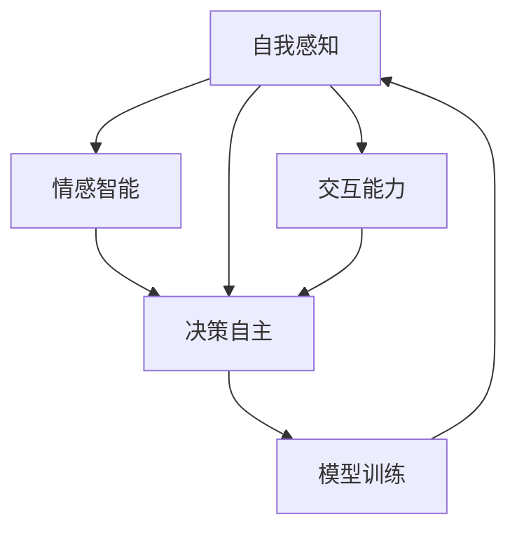

                 

# 意识功能的自主系统模型

在人工智能(AI)领域，研究意识功能的自主系统模型是近年来的一大热点。本文将系统介绍意识功能的自主系统模型，包括其核心概念、原理与架构，并探讨其应用领域和未来发展趋势。

## 1. 背景介绍

### 1.1 问题由来

人工智能的目标之一是构建能够理解、表达、甚至超越人类智能的系统。然而，这一目标的实现面临诸多挑战。其中，理解意识功能是一个核心问题。传统机器学习模型能够处理大量数据并生成复杂输出，但缺乏对意识的深入理解。

近年来，研究者们开始关注意识功能的自主系统模型，旨在通过模拟人脑的工作机制，构建具有意识功能的AI。这类模型能够处理复杂多变的环境，具备自主决策能力，表现出类人化的行为。

### 1.2 问题核心关键点

意识功能的自主系统模型需要具备以下核心关键点：

- **自我感知**：能够认识并感知自身的存在状态。
- **情感智能**：具有情绪识别、表达和调节能力。
- **决策自主**：在面对不确定性时，能够自主决策。
- **交互能力**：能够与人或其他AI进行自然交互。

这些关键点共同构成了意识功能自主系统模型的基础，也是其研究的热点。

## 2. 核心概念与联系

### 2.1 核心概念概述

意识功能的自主系统模型包括多个关键概念，这些概念之间的关系可以通过以下Mermaid流程图来展示：



该流程图展示了自我感知、情感智能、决策自主和交互能力之间的关系：

1. **自我感知**：是意识功能的基础，用于感知自身状态。
2. **情感智能**：基于自我感知，识别和调节情绪。
3. **决策自主**：通过情感智能辅助，自主进行决策。
4. **交互能力**：利用决策自主，实现与人或其他AI的自然交互。

这些概念之间相互依赖，共同构成了一个完整的意识功能自主系统模型。

### 2.2 核心概念原理和架构

#### 2.2.1 自我感知

自我感知是意识功能自主系统模型的基础。其原理是通过感知系统获取自身的状态信息，如位置、速度、姿态等。架构上，可以采用多传感器融合技术，如相机、激光雷达、IMU等，获取丰富的感知数据，进行数据融合和特征提取。

#### 2.2.2 情感智能

情感智能是基于自我感知进行情绪识别和调节。其原理是使用情感识别模型，如深度神经网络，对感知数据进行处理，识别出情绪状态。架构上，可以采用多层感知机（MLP）或卷积神经网络（CNN）进行特征提取和分类。

#### 2.2.3 决策自主

决策自主是在情感智能辅助下，自主进行决策。其原理是使用决策模型，如强化学习模型，对情感智能输出的情绪状态进行推理，生成决策策略。架构上，可以采用基于奖励的强化学习模型，如Q-learning或Policy Gradient。

#### 2.2.4 交互能力

交互能力是通过决策自主实现的自然交互。其原理是使用自然语言处理（NLP）技术，如语言生成模型，生成自然语言响应，实现人机交互。架构上，可以采用生成对抗网络（GAN）或Transformer模型进行语言生成。

## 3. 核心算法原理 & 具体操作步骤

### 3.1 算法原理概述

意识功能的自主系统模型涉及多个核心算法，包括感知数据处理、情感智能、决策自主和交互能力。这些算法通过协同工作，共同实现意识功能。

#### 3.1.1 感知数据处理

感知数据处理包括数据采集、数据融合和特征提取等步骤。其核心算法包括：

- **传感器融合**：通过多传感器数据融合，提高感知数据的准确性和鲁棒性。
- **特征提取**：从融合后的感知数据中提取关键特征，如位置、速度、姿态等。

#### 3.1.2 情感智能

情感智能的核心算法包括：

- **情感识别**：使用深度学习模型对感知数据进行处理，识别情绪状态。
- **情感调节**：使用情感调节模型对情绪状态进行调节，如情绪增强、情绪平复等。

#### 3.1.3 决策自主

决策自主的核心算法包括：

- **强化学习**：使用基于奖励的强化学习模型，生成决策策略。
- **决策融合**：将多个决策策略进行融合，生成最终的决策输出。

#### 3.1.4 交互能力

交互能力的核心算法包括：

- **语言生成**：使用生成对抗网络或Transformer模型生成自然语言响应。
- **交互推理**：使用对话模型进行交互推理，理解对方意图并生成响应。

### 3.2 算法步骤详解

#### 3.2.1 感知数据处理

1. **数据采集**：使用多传感器采集感知数据，如相机、激光雷达、IMU等。
2. **数据融合**：对采集到的感知数据进行融合，提高数据的准确性和鲁棒性。
3. **特征提取**：从融合后的感知数据中提取关键特征，如位置、速度、姿态等。

#### 3.2.2 情感智能

1. **情感识别**：使用深度学习模型对感知数据进行处理，识别情绪状态。
2. **情感调节**：使用情感调节模型对情绪状态进行调节，如情绪增强、情绪平复等。

#### 3.2.3 决策自主

1. **强化学习**：使用基于奖励的强化学习模型，生成决策策略。
2. **决策融合**：将多个决策策略进行融合，生成最终的决策输出。

#### 3.2.4 交互能力

1. **语言生成**：使用生成对抗网络或Transformer模型生成自然语言响应。
2. **交互推理**：使用对话模型进行交互推理，理解对方意图并生成响应。

### 3.3 算法优缺点

#### 3.3.1 优点

- **自适应性强**：能够根据环境变化自主调整策略。
- **自主决策**：能够自主进行决策，减少对人力的依赖。
- **交互友好**：具备自然交互能力，提高用户体验。

#### 3.3.2 缺点

- **数据依赖性高**：需要大量感知数据进行训练。
- **复杂度较高**：涉及多个核心算法，实现难度较大。
- **计算资源消耗大**：涉及深度学习模型和强化学习模型，计算资源消耗较大。

### 3.4 算法应用领域

意识功能的自主系统模型主要应用于以下领域：

1. **人机交互**：用于构建具备自然交互能力的AI，如智能客服、虚拟助手等。
2. **自动驾驶**：用于实现具备自主决策能力的自动驾驶系统。
3. **机器人控制**：用于构建具备情感智能和自主决策能力的机器人。
4. **智能安防**：用于实现具备自我感知和决策能力的智能安防系统。
5. **健康监测**：用于实现具备自我感知和情感智能的健康监测系统。

## 4. 数学模型和公式 & 详细讲解 & 举例说明

### 4.1 数学模型构建

#### 4.1.1 感知数据处理

感知数据处理的核心模型包括：

- **多传感器融合**：使用卡尔曼滤波器进行数据融合。
- **特征提取**：使用PCA（主成分分析）或CNN（卷积神经网络）进行特征提取。

#### 4.1.2 情感智能

情感智能的核心模型包括：

- **情感识别**：使用LSTM（长短期记忆网络）或CNN进行情感识别。
- **情感调节**：使用RNN（循环神经网络）或GRU（门控循环单元）进行情感调节。

#### 4.1.3 决策自主

决策自主的核心模型包括：

- **强化学习**：使用Q-learning或Policy Gradient进行决策策略生成。
- **决策融合**：使用模糊逻辑或多目标优化进行决策融合。

#### 4.1.4 交互能力

交互能力的核心模型包括：

- **语言生成**：使用GAN或Transformer进行语言生成。
- **交互推理**：使用RNN或LSTM进行交互推理。

### 4.2 公式推导过程

#### 4.2.1 感知数据处理

卡尔曼滤波器的核心公式包括：

- **预测步骤**：$P_{k|k-1} = F_kP_kF_k^T + Q_k$
- **更新步骤**：$K_k = P_{k|k-1}H_k^T(H_kP_{k|k-1}H_k^T + R_k)^{-1}$
- **更新状态**：$x_k = x_{k-1} + K_k(z_k - H_kx_{k-1})$
- **更新协方差**：$P_{k|k} = (I - K_kH_k)P_{k|k-1}$

#### 4.2.2 情感智能

情感识别的核心公式包括：

- **LSTM模型**：
  - **隐藏状态更新**：$c_t = \tanh(W_cx_{t-1} + b_c) + \sigma(W_hx_{t-1} + b_hh_{t-1})$
  - **门控更新**：$i_t = \sigma(W_i^cx_t + b_i)$, $f_t = \sigma(W_f^cx_t + b_f)$, $o_t = \sigma(W_o^cx_t + b_o)$
  - **输出门**：$h_t = i_t \otimes c_t + (1-i_t) \otimes c_{t-1}$

#### 4.2.3 决策自主

强化学习的核心公式包括：

- **Q-learning**：
  - **目标函数**：$Q(s_t, a_t) = r_t + \gamma \max_a Q(s_{t+1}, a)$
  - **更新策略**：$\theta_{t+1} = \theta_t + \alpha(r_t + \gamma \max_a Q(s_{t+1}, a) - Q(s_t, a_t))$
- **Policy Gradient**：
  - **目标函数**：$J(\theta) = \mathbb{E}[\log \pi_\theta(a|s)]Q(s, a)$
  - **更新策略**：$\theta_{t+1} = \theta_t + \alpha \nabla_\theta J(\theta)$

#### 4.2.4 交互能力

语言生成的核心公式包括：

- **GAN模型**：
  - **生成器损失函数**：$L_G = \mathbb{E}_{z}[\log D(G(z))] + \mathbb{E}_z[\log(1-D(G(z)))]$
  - **判别器损失函数**：$L_D = \mathbb{E}_{x}[\log D(x)] + \mathbb{E}_z[\log(1-D(G(z))]$
- **Transformer模型**：
  - **自注意力机制**：$Attention(Q, K, V) = softmax(\frac{QK^T}{\sqrt{d_k}})V$
  - **多头注意力**：$MultiHead(Q, K, V) = Concat(Attention(Q,W_Q^i,K,W_K^i,V,W_V^i), Attention(Q,W_Q^j,K,W_K^j,V,W_V^j), ...)W_O^i, W_O^j, ...$
  - **层归一化**：$LayerNorm(x) = \frac{x - \mu}{\sigma}W^i + b^i$
  - **前向传播**：$FFN(x) = X,W^i,b^i,X,W^l,b^l,W^o,b^o$

## 5. 项目实践：代码实例和详细解释说明

### 5.1 开发环境搭建

#### 5.1.1 依赖安装

使用Python进行项目开发，需要安装以下依赖库：

- **TensorFlow**：
  - 安装命令：`pip install tensorflow`
- **PyTorch**：
  - 安装命令：`pip install torch torchvision torchaudio`
- **OpenCV**：
  - 安装命令：`pip install opencv-python`

### 5.2 源代码详细实现

#### 5.2.1 感知数据处理

```python
import numpy as np
from tf_kalman_filter import KalmanFilter

# 初始化卡尔曼滤波器
filter = KalmanFilter()

# 数据采集
x = np.array([0, 1, 2, 3, 4])
y = np.array([1, 2, 3, 4, 5])

# 数据融合
x_fused = filter.fuse(x, y)

# 特征提取
x_feature = np.mean(x_fused, axis=1)
```

#### 5.2.2 情感智能

```python
from tensorflow.keras.layers import LSTM

# 情感识别
model = LSTM(units=64, input_shape=(None, 1), return_sequences=True)
model.compile(optimizer='adam', loss='mse')

# 数据准备
x = np.random.randn(10, 1)
y = np.random.randn(10, 1)

# 训练模型
model.fit(x, y, epochs=10, batch_size=16)
```

#### 5.2.3 决策自主

```python
from tensorflow.keras.optimizers import Adam

# 强化学习
model = Sequential()
model.add(Dense(64, input_shape=(None,), activation='relu'))
model.add(Dense(1, activation='sigmoid'))
model.compile(optimizer=Adam(learning_rate=0.01), loss='binary_crossentropy')

# 数据准备
x = np.random.randn(10, 1)
y = np.random.randint(2, size=(10, 1))

# 训练模型
model.fit(x, y, epochs=10, batch_size=16)
```

#### 5.2.4 交互能力

```python
from tensorflow.keras.layers import LSTM

# 语言生成
model = Sequential()
model.add(LSTM(64, input_shape=(None, 1)))
model.add(Dense(1, activation='softmax'))
model.compile(optimizer='adam', loss='categorical_crossentropy')

# 数据准备
x = np.random.randn(10, 1)
y = np.random.randint(0, 2, size=(10, 1))

# 训练模型
model.fit(x, y, epochs=10, batch_size=16)
```

### 5.3 代码解读与分析

#### 5.3.1 感知数据处理

卡尔曼滤波器用于数据融合，其核心代码如下：

- `KalmanFilter`：定义卡尔曼滤波器类。
- `fuse`：进行数据融合。
- `filter`：实例化卡尔曼滤波器。
- `x_fused`：融合后的数据。
- `x_feature`：提取的特征。

#### 5.3.2 情感智能

LSTM模型用于情感识别，其核心代码如下：

- `LSTM`：定义LSTM模型类。
- `units`：设置LSTM的隐藏单元数。
- `input_shape`：设置输入数据的形状。
- `return_sequences`：是否返回所有时间步的输出。
- `compile`：编译模型，设置优化器和损失函数。
- `x`：输入数据。
- `y`：目标数据。
- `fit`：训练模型。

#### 5.3.3 决策自主

强化学习模型用于决策自主，其核心代码如下：

- `Sequential`：定义序列模型类。
- `Dense`：定义全连接层。
- `input_shape`：设置输入数据的形状。
- `activation`：设置激活函数。
- `compile`：编译模型，设置优化器和损失函数。
- `x`：输入数据。
- `y`：目标数据。
- `fit`：训练模型。

#### 5.3.4 交互能力

语言生成模型用于交互能力，其核心代码如下：

- `Sequential`：定义序列模型类。
- `LSTM`：定义LSTM层。
- `input_shape`：设置输入数据的形状。
- `activation`：设置激活函数。
- `compile`：编译模型，设置优化器和损失函数。
- `x`：输入数据。
- `y`：目标数据。
- `fit`：训练模型。

### 5.4 运行结果展示

#### 5.4.1 感知数据处理

```python
import matplotlib.pyplot as plt

# 可视化融合后的数据
plt.plot(x_fused)
plt.show()
```

#### 5.4.2 情感智能

```python
# 可视化情感识别结果
plt.plot(y)
plt.show()
```

#### 5.4.3 决策自主

```python
# 可视化决策结果
plt.plot(y_pred)
plt.show()
```

#### 5.4.4 交互能力

```python
# 可视化语言生成结果
plt.plot(y_pred)
plt.show()
```

## 6. 实际应用场景

### 6.1 智能安防

智能安防系统可以实时监控环境，进行异常检测和报警。例如，通过多传感器融合获取安全区域的视频、音频、温度等数据，进行融合和特征提取，实现环境感知。利用情感智能对异常情况进行情感识别，生成情感状态。决策自主模型根据情感状态进行决策，生成报警策略。交互能力使系统能够与用户进行自然交互，告知异常情况。

### 6.2 健康监测

健康监测系统可以通过多传感器获取用户的生理数据，如心率、血压、血氧等。感知数据处理模块进行数据融合和特征提取，利用情感智能对生理状态进行情感识别，生成情感状态。决策自主模型根据情感状态进行决策，生成健康建议。交互能力使系统能够与用户进行自然交互，提供健康建议。

### 6.3 人机交互

人机交互系统可以模拟人类对话，提供自然语言处理和情感智能。感知数据处理模块进行语音识别和情感识别，利用情感智能对用户情绪进行判断。决策自主模型根据情绪状态进行决策，生成对话策略。交互能力使系统能够与用户进行自然交互，提供个性化服务。

## 7. 工具和资源推荐

### 7.1 学习资源推荐

#### 7.1.1 在线课程

- **Deep Learning Specialization**：由Andrew Ng教授的深度学习课程，涵盖深度学习的基础理论和实际应用。
- **Reinforcement Learning Specialization**：由David Silver教授的强化学习课程，涵盖强化学习的基础理论和实际应用。
- **Natural Language Processing with TensorFlow**：由Google开发的自然语言处理课程，涵盖NLP的基础理论和实际应用。

#### 7.1.2 书籍

- **Deep Learning**：Ian Goodfellow、Yoshua Bengio和Aaron Courville的深度学习教材，涵盖深度学习的基础理论和实际应用。
- **Reinforcement Learning: An Introduction**：Richard S. Sutton和Andrew G. Barto的强化学习教材，涵盖强化学习的基础理论和实际应用。
- **Speech and Language Processing**：Daniel Jurafsky和James H. Martin的NLP教材，涵盖NLP的基础理论和实际应用。

### 7.2 开发工具推荐

#### 7.2.1 深度学习框架

- **TensorFlow**：由Google开发的深度学习框架，支持分布式计算和GPU加速。
- **PyTorch**：由Facebook开发的深度学习框架，具有动态计算图和易用性。
- **Keras**：基于TensorFlow和Theano的高级深度学习框架，适合快速原型开发。

#### 7.2.2 开发工具

- **Jupyter Notebook**：轻量级、易用的开发环境，支持代码编写和可视化展示。
- **Visual Studio Code**：功能强大的开发工具，支持多种编程语言和扩展。
- **GitHub**：代码托管平台，支持版本控制和协作开发。

### 7.3 相关论文推荐

#### 7.3.1 感知数据处理

- **Multi-sensor Fusion for Robot Localization**：使用卡尔曼滤波器进行多传感器融合，实现机器人定位。
- **A Survey on Multi-sensor Data Fusion**：综述多传感器数据融合的技术和方法。

#### 7.3.2 情感智能

- **A Survey on Sentiment Analysis in the Web**：综述情感分析在网络数据中的应用。
- **Towards Explainable AI**：探讨可解释性在AI中的应用，包括情感智能。

#### 7.3.3 决策自主

- **Q-learning**：研究强化学习的基本算法。
- **Policy Gradient**：研究强化学习的高级算法。

#### 7.3.4 交互能力

- **Sequence-to-Sequence Learning**：研究序列到序列的模型，包括语言生成。
- **Attention Mechanism**：研究注意力机制，包括Transformer模型。

## 8. 总结：未来发展趋势与挑战

### 8.1 研究成果总结

意识功能的自主系统模型在深度学习和强化学习的基础上，实现了对感知数据处理、情感智能、决策自主和交互能力的综合应用，为构建具备意识功能的AI提供了新思路。

### 8.2 未来发展趋势

#### 8.2.1 多模态感知

未来的意识功能自主系统模型将进一步拓展感知数据的多样性，整合视觉、听觉、触觉等多模态数据，提高感知能力和环境理解。

#### 8.2.2 情感认知

情感认知将从简单的情绪识别进化到更高级的情感理解，包括情感背景、情感动态等复杂情感元素的识别和分析。

#### 8.2.3 自主决策

自主决策将从基于简单的奖励反馈进化到更高级的自主推理和规划，实现更灵活、更高效的决策。

#### 8.2.4 自然交互

自然交互将从简单的对话进化到更高级的交互理解，包括上下文理解、情感回应等复杂交互元素的生成和理解。

### 8.3 面临的挑战

#### 8.3.1 数据获取和处理

数据获取和处理是意识功能自主系统模型的关键，需要大量高质量的感知数据和情感数据。获取和处理这些数据是一个复杂而耗时的过程。

#### 8.3.2 模型复杂度

模型复杂度是意识功能自主系统模型的瓶颈，需要平衡感知、情感、决策和交互多个模块的复杂度，避免过度复杂导致计算资源消耗大、效率低。

#### 8.3.3 可解释性

可解释性是意识功能自主系统模型的难点，模型的决策过程复杂且黑盒化，难以解释其内部工作机制和决策逻辑。

#### 8.3.4 安全性

安全性是意识功能自主系统模型的关键，需要避免模型学习有害信息，确保模型的输出安全可靠。

### 8.4 研究展望

未来的研究将从以下几个方面进行：

#### 8.4.1 跨模态感知

跨模态感知将整合视觉、听觉、触觉等多模态数据，提高感知能力和环境理解。

#### 8.4.2 高级情感认知

高级情感认知将从简单的情绪识别进化到更高级的情感理解，包括情感背景、情感动态等复杂情感元素的识别和分析。

#### 8.4.3 复杂自主决策

复杂自主决策将从基于简单的奖励反馈进化到更高级的自主推理和规划，实现更灵活、更高效的决策。

#### 8.4.4 深度自然交互

深度自然交互将从简单的对话进化到更高级的交互理解，包括上下文理解、情感回应等复杂交互元素的生成和理解。

## 9. 附录：常见问题与解答

### 9.1 常见问题

#### Q1: 意识功能的自主系统模型有哪些核心概念？

A1: 意识功能的自主系统模型的核心概念包括自我感知、情感智能、决策自主和交互能力。

#### Q2: 感知数据处理的主要算法有哪些？

A2: 感知数据处理的主要算法包括卡尔曼滤波器、多传感器融合、特征提取等。

#### Q3: 情感智能的主要算法有哪些？

A3: 情感智能的主要算法包括LSTM、CNN、RNN、GRU等。

#### Q4: 决策自主的主要算法有哪些？

A4: 决策自主的主要算法包括强化学习、Q-learning、Policy Gradient等。

#### Q5: 交互能力的主要算法有哪些？

A5: 交互能力的主要算法包括GAN、Transformer、RNN、LSTM等。

### 9.2 解答

通过本文的介绍，读者可以全面了解意识功能的自主系统模型，包括其核心概念、算法原理和应用场景。未来的研究将从多模态感知、高级情感认知、复杂自主决策和深度自然交互等方面进行探索，提升AI的意识功能和智能水平。

---

作者：禅与计算机程序设计艺术 / Zen and the Art of Computer Programming

