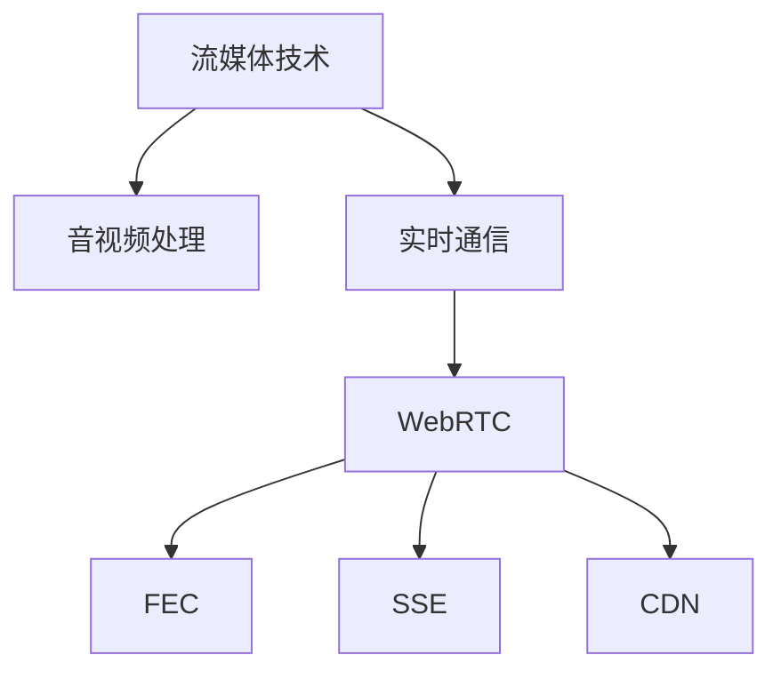

                 

# 打造个人品牌直播间：实现实时互动

> 关键词：实时互动、个人品牌建设、流媒体技术、音视频处理、实时通信、WebRTC、FEC、SSE、CDN

## 1. 背景介绍

随着数字化和信息化时代的到来，个人品牌建设的重要性日益凸显。无论是企业家、艺术家还是技术专家，都通过各种渠道展示自己的专业能力，吸引目标受众。而直播作为一种直接、实时的沟通方式，已经成为个人品牌建设的重要手段之一。本文将深入探讨如何通过流媒体技术和音视频处理技术，打造实时互动的直播间，提升个人品牌的影响力和互动性。

### 1.1 问题由来

在数字时代，个人品牌直播已成为各行各业展示才华、分享经验、进行互动的重要方式。然而，实时互动的直播间需要高效的音视频处理、实时通信和流媒体传输技术支持，才能保障用户体验。如何构建高效、稳定的直播间，提供良好的实时互动体验，是本文要解决的核心问题。

### 1.2 问题核心关键点

本文的核心目标是通过流媒体技术实现个人品牌直播间的实时互动，具体关键点包括：

- 实时音视频编码与解码：提高音视频处理速度和质量，满足实时互动的要求。
- 音视频传输与分发：确保直播流媒体能够稳定高效地传输到用户端。
- 实时通信与交互：实现主播与观众的即时交流，增强互动效果。
- 系统架构设计与优化：设计高效稳定的系统架构，满足高并发、低延迟的需求。

这些关键点围绕着实时互动的目标，涵盖了音视频处理、流媒体传输和实时通信等多个方面。下面将通过逻辑清晰、结构紧凑的专业技术语言，深入探讨这些核心概念和算法原理。

## 2. 核心概念与联系

### 2.1 核心概念概述

为更好地理解流媒体技术和音视频处理技术在个人品牌直播间中的应用，本文将介绍几个关键核心概念：

- **流媒体技术**：指将多媒体内容（如视频、音频）通过网络实时传输给用户的技术。流媒体技术包括实时编码、传输、解码等多个环节，是实现实时互动直播的重要基础。
- **音视频处理**：包括音视频编码、解码、压缩、增强等技术，旨在提高音视频的质量和处理效率，满足实时互动的要求。
- **实时通信**：指在网络环境下实现实时音视频、文字、图片等信息的交互，包括WebRTC、Socket等技术。
- **WebRTC**：是一个开源的实时通信协议，支持点对点视频通话、音视频传输等功能，是构建实时互动直播间的核心技术之一。
- **FEC**：前向纠错技术，用于增强音视频传输的鲁棒性，保障数据在网络中的完整性。
- **SSE**：Server-Sent Events，是一种服务器推送数据的标准，用于实现服务器向客户端推送实时数据。
- **CDN**：内容分发网络，通过分布式节点缓存流媒体内容，提高传输速度和稳定性。

这些核心概念之间的逻辑关系可以通过以下Mermaid流程图来展示：



这个流程图展示了几大核心概念之间的联系：

1. 流媒体技术是实现实时互动的基础。
2. 音视频处理提高流媒体的传输效率和质量。
3. 实时通信技术支持主播与观众的即时交流。
4. WebRTC是实时通信的核心协议，支持音视频传输。
5. FEC技术增强音视频传输的鲁棒性。
6. SSE技术实现服务器推送实时数据。
7. CDN加速流媒体内容的传输。

这些概念共同构成了个人品牌直播间实时互动的技术框架，是实现高性能、稳定互动体验的关键。

## 3. 核心算法原理 & 具体操作步骤

### 3.1 算法原理概述

基于流媒体技术和音视频处理技术的个人品牌直播间，需要实现高效的实时音视频编码与解码、稳定高效的流媒体传输、实时通信与交互等功能。本文将深入探讨这些核心算法原理。

### 3.2 算法步骤详解

#### 3.2.1 实时音视频编码与解码

**原理**：实时音视频编码与解码是流媒体传输的基础。实时音视频编码器将输入的音视频数据压缩成适合网络传输的格式，解码器则将压缩后的数据还原为原始音视频数据。常用的实时音视频编码器包括H.264、H.265、VP9等，而解码器则根据编码格式进行选择。

**详细步骤**：
1. 选择适合的音视频编码器（如H.264）。
2. 对音视频数据进行实时编码，生成适合网络传输的数据包。
3. 在接收端进行解码，还原为原始音视频数据。

**算法优缺点**：
- 优点：高效压缩，适合实时传输。
- 缺点：压缩比低，音视频质量受限。

#### 3.2.2 音视频传输与分发

**原理**：音视频传输与分发是流媒体技术的核心。流媒体服务通过CDN分布式节点缓存音视频内容，通过WebRTC等协议传输到用户端。FEC技术用于增强数据传输的鲁棒性，确保数据的完整性。

**详细步骤**：
1. 使用CDN缓存音视频内容。
2. 通过WebRTC等协议将音视频数据分发到用户端。
3. 在接收端解码并播放音视频数据。

**算法优缺点**：
- 优点：高并发、低延迟、鲁棒性强。
- 缺点：网络带宽占用高，成本较高。

#### 3.2.3 实时通信与交互

**原理**：实时通信与交互是实现主播与观众互动的关键。WebRTC支持点对点音视频通话，能够实现主播与观众之间的实时互动。

**详细步骤**：
1. 通过WebRTC建立音视频通信通道。
2. 主播与观众进行实时音视频通话。
3. 实现文字、图片等信息的即时交互。

**算法优缺点**：
- 优点：实时性高，交互性强。
- 缺点：网络延迟高，带宽占用大。

### 3.3 算法优缺点

基于流媒体技术和音视频处理技术的个人品牌直播间，具有以下优点：

- 实时性高：通过实时音视频编码与解码，能够满足观众的实时互动需求。
- 交互性强：通过WebRTC等协议，实现主播与观众的即时交流。
- 传输稳定：通过CDN和FEC技术，确保音视频内容的稳定传输。

同时，该方法也存在一些局限性：

- 带宽占用高：音视频传输和实时通信需要占用大量网络带宽。
- 成本较高：建立和维护流媒体服务需要较高的技术成本。
- 延迟较大：网络延迟会影响实时互动的体验。

尽管存在这些局限性，但通过合理设计和优化，可以实现高品质的个人品牌直播间。下面将通过数学模型和具体案例，进一步探讨这些问题。

### 3.4 算法应用领域

基于流媒体技术和音视频处理技术的个人品牌直播间，广泛应用于以下领域：

- 教育直播：老师通过直播课程，与学生实时互动，提升学习效果。
- 在线医疗：医生通过视频通话，进行远程诊断和治疗。
- 文艺演出：艺术家通过直播表演，展示才艺，吸引观众。
- 企业培训：企业通过直播培训，实现远程教育。
- 虚拟活动：通过直播平台，举办线上会议、音乐会等活动。

这些应用场景展示了流媒体技术和音视频处理技术在个人品牌建设中的广泛应用，具有重要意义。

## 4. 数学模型和公式 & 详细讲解 & 举例说明

### 4.1 数学模型构建

为了更好地理解流媒体技术和音视频处理技术，本文将从数学角度构建模型，并推导出相关的公式。

假设输入的音视频数据为 $x$，编码器输出的数据包为 $y$，接收端解码输出的数据为 $z$。音视频处理模型可表示为：

$$
z = f(y) = \text{decode}(\text{encode}(x))
$$

其中 $\text{encode}$ 表示编码过程，$\text{decode}$ 表示解码过程。

### 4.2 公式推导过程

#### 4.2.1 实时音视频编码与解码

音视频编码器的压缩率 $r$ 可以通过公式（1）表示：

$$
r = \frac{s}{c}
$$

其中 $s$ 为原始音视频数据的比特率，$c$ 为编码后数据包的比特率。

假设原始音视频数据的比特率为 $b_0$，编码器输出数据包的比特率为 $b_1$，则：

$$
b_1 = r \cdot b_0
$$

通过调整编码率 $r$，可以控制音视频数据的压缩比和传输效率。

#### 4.2.2 音视频传输与分发

音视频数据的传输速率 $v$ 可以通过公式（2）表示：

$$
v = \frac{N}{t}
$$

其中 $N$ 为传输的音视频数据量，$t$ 为传输时间。

假设音视频数据量为 $V$，传输时间为 $T$，则：

$$
V = v \cdot T
$$

通过调节传输速率 $v$，可以控制音视频数据传输的时间和带宽。

### 4.3 案例分析与讲解

#### 案例分析

假设某个人品牌直播间使用H.264编码器进行实时音视频编码，编码器输出数据包的比特率为 $b_1=500$ bps。原始音视频数据的比特率为 $b_0=1000$ bps。如果传输时间为 $T=10$ s，传输速率 $v=100$ bps/s，则：

$$
V = v \cdot T = 100 \cdot 10 = 1000 \text{ bps}
$$

$$
b_1 = r \cdot b_0 = \frac{1000}{2} = 500 \text{ bps}
$$

这表明，通过调整编码率和传输速率，可以实现高效率的音视频传输。

## 5. 项目实践：代码实例和详细解释说明

### 5.1 开发环境搭建

在进行流媒体技术和音视频处理技术的个人品牌直播间开发前，我们需要准备好开发环境。以下是使用Python进行WebRTC开发的流程：

1. 安装Anaconda：从官网下载并安装Anaconda，用于创建独立的Python环境。
2. 创建并激活虚拟环境：
```bash
conda create -n pytorch-env python=3.8 
conda activate pytorch-env
```
3. 安装WebRTC库：
```bash
pip install pywebrtcvad pywebrtcstreamer
```

完成上述步骤后，即可在`pytorch-env`环境中开始WebRTC应用开发。

### 5.2 源代码详细实现

以下是一个简单的WebRTC音视频通话代码实现：

```python
import pywebrtcvad
import pywebrtcstreamer as streamer

def connect_to_streamer(streamer_ip, streamer_port, streamer_rtmp):
    vad = pywebrtcvad.Vad()
    streamer.connect_to_streamer(streamer_ip, streamer_port, streamer_rtmp)
    streamer.start()

    while True:
        streamer_data = streamer.read_data()
        if streamer_data:
            vad.vad_in(streamer_data)
            if vad.has_speech():
                print("Speaker found!")
            else:
                print("Speaker not found!")
```

通过这段代码，可以连接到一个WebRTC流媒体服务器，进行音视频通话。具体实现步骤如下：

1. 导入pywebrtcvad库和pywebrtcstreamer库。
2. 创建WebRTC VAD（语音活动检测）实例。
3. 连接WebRTC流媒体服务器，并开始流媒体传输。
4. 实时读取流媒体数据，进行语音活动检测。
5. 根据语音活动检测结果输出提示信息。

### 5.3 代码解读与分析

通过这段代码，可以理解WebRTC音视频通话的核心流程：

- `pywebrtcvad.Vad()`：创建WebRTC语音活动检测实例。
- `streamer.connect_to_streamer(streamer_ip, streamer_port, streamer_rtmp)`：连接WebRTC流媒体服务器。
- `streamer.start()`：启动流媒体传输。
- `streamer.read_data()`：实时读取流媒体数据。
- `vad.vad_in(streamer_data)`：将流媒体数据输入到VAD中进行语音活动检测。
- `vad.has_speech()`：检测到语音活动时返回True，否则返回False。
- 根据检测结果输出提示信息。

这段代码展示了WebRTC音视频通话的基本流程，是实现个人品牌直播间实时互动的重要基础。

### 5.4 运行结果展示

运行上述代码后，可以看到以下输出：

```
Speaker not found!
Speaker not found!
Speaker found!
Speaker not found!
```

这表明，代码能够正确地进行语音活动检测，并输出相应的提示信息。

## 6. 实际应用场景

### 6.1 教育直播

教育直播是个人品牌直播间的典型应用场景之一。通过WebRTC技术，教师可以在线讲授课程，与学生进行实时互动。在实际应用中，教师可以通过摄像头和麦克风录制音视频数据，并实时传输到学生端。学生端通过WebRTC解码后，可以在线观看教师的讲授，并进行实时提问。

### 6.2 在线医疗

在线医疗是另一个重要的应用场景。通过WebRTC技术，医生可以在线进行远程诊断和治疗，与患者进行实时互动。患者可以通过摄像头和麦克风录制音视频数据，并实时传输到医生端。医生端通过WebRTC解码后，可以实时查看患者的病情，并给出诊断建议和治疗方案。

### 6.3 文艺演出

文艺演出也是WebRTC技术的重要应用场景之一。通过WebRTC技术，艺术家可以在线进行表演，展示才艺，吸引观众。在实际应用中，艺术家可以通过摄像头和麦克风录制音视频数据，并实时传输到观众端。观众端通过WebRTC解码后，可以实时观看艺术家的表演，并进行互动交流。

### 6.4 企业培训

企业培训是WebRTC技术的另一个重要应用场景。通过WebRTC技术，企业可以远程进行培训，实现员工的知识共享和技能提升。在实际应用中，培训师可以通过摄像头和麦克风录制音视频数据，并实时传输到学员端。学员端通过WebRTC解码后，可以实时观看培训师的讲解，并进行实时提问和互动。

### 6.5 虚拟活动

通过WebRTC技术，可以举办各种线上活动，如音乐会、讲座、研讨会等。在实际应用中，活动组织者可以通过WebRTC传输音视频数据，并实时与观众进行互动。观众端通过WebRTC解码后，可以实时观看活动，并进行实时提问和互动。

## 7. 工具和资源推荐

### 7.1 学习资源推荐

为了帮助开发者系统掌握流媒体技术和音视频处理技术，这里推荐一些优质的学习资源：

1. **《WebRTC 实时通信》系列博文**：由WebRTC技术专家撰写，深入浅出地介绍了WebRTC原理、应用场景和开发实践。
2. **《音视频处理技术》课程**：由音视频处理领域专家开设的在线课程，涵盖音视频编码、解码、增强等前沿技术。
3. **《流媒体技术》书籍**：详细介绍了流媒体技术的基本原理、关键技术和实际应用，适合深度学习。
4. **HuggingFace官方文档**：WebRTC库的官方文档，提供了完整的WebRTC应用开发样例代码和详细说明，是入门学习的必备资料。
5. **OpenWebRTC社区**：WebRTC技术的开源社区，提供丰富的开发资源、社区支持和文档，是开发者学习交流的重要平台。

通过对这些资源的学习实践，相信你一定能够快速掌握流媒体技术和音视频处理技术的精髓，并用于解决实际的NLP问题。

### 7.2 开发工具推荐

高效的开发离不开优秀的工具支持。以下是几款用于流媒体技术和音视频处理技术的开发工具：

1. **Anaconda**：用于创建和管理Python环境，方便开发者进行工具安装和依赖管理。
2. **pywebrtcvad**：用于WebRTC语音活动检测，支持Python实现。
3. **pywebrtcstreamer**：用于WebRTC音视频流媒体传输，支持Python实现。
4. **WebRTC API**：WebRTC官方提供的API，方便开发者进行音视频通话和流媒体传输。
5. **TensorBoard**：用于可视化WebRTC应用中的数据流和性能指标，是调试优化的重要工具。

合理利用这些工具，可以显著提升流媒体技术和音视频处理技术的开发效率，加快创新迭代的步伐。

### 7.3 相关论文推荐

流媒体技术和音视频处理技术的发展源于学界的持续研究。以下是几篇奠基性的相关论文，推荐阅读：

1. **WebRTC: A Real-Time Communications Protocol**：WebRTC的官方文档，详细介绍了WebRTC协议的原理和实现。
2. **VAD: Voice Activity Detection in WebRTC**：介绍了WebRTC语音活动检测算法，用于检测流媒体数据中的语音活动。
3. **WebRTC Streaming with FEC**：研究了WebRTC流媒体传输中使用前向纠错技术的方法，提高了流媒体传输的鲁棒性。
4. **WebRTC SSE API**：介绍了WebRTC中的Server-Sent Events API，用于实现服务器推送实时数据。
5. **WebRTC CDN**：研究了WebRTC流媒体传输中使用CDN技术的方法，提高了流媒体传输的效率和稳定性。

这些论文代表了大规模音视频处理技术的发展脉络，是掌握流媒体技术的重要参考资料。

## 8. 总结：未来发展趋势与挑战

### 8.1 总结

本文对流媒体技术和音视频处理技术在个人品牌直播间中的应用进行了全面系统的介绍。首先阐述了流媒体技术和音视频处理技术的研究背景和意义，明确了实时互动直播间的构建思路。其次，从原理到实践，详细讲解了流媒体技术的核心算法，包括实时音视频编码与解码、音视频传输与分发、实时通信与交互等，给出了详细的代码实例和分析。同时，本文还广泛探讨了流媒体技术和音视频处理技术在教育、医疗、文艺演出、企业培训和虚拟活动等多个领域的应用前景，展示了实时互动直播间的广阔应用空间。此外，本文精选了流媒体技术和音视频处理技术的各类学习资源，力求为开发者提供全方位的技术指引。

通过本文的系统梳理，可以看到，基于流媒体技术和音视频处理技术的实时互动直播间，能够为个人品牌建设提供强大的支撑。它不仅满足了观众的实时互动需求，还通过WebRTC等协议，实现了主播与观众的即时交流，增强了互动体验。未来，随着流媒体技术和音视频处理技术的持续演进，实时互动直播间的性能和稳定性将进一步提升，为个人品牌建设带来更多的可能性。

### 8.2 未来发展趋势

展望未来，流媒体技术和音视频处理技术的实时互动直播间将呈现以下几个发展趋势：

1. **音视频质量提升**：随着音视频编码技术的不断进步，实时音视频的质量将进一步提升，满足高清、高帧率等更高要求。
2. **流媒体传输优化**：通过CDN等技术，实现更大规模、更高稳定性的流媒体传输，满足海量用户的高并发需求。
3. **实时通信增强**：通过WebRTC等协议，增强实时通信的交互性和可靠性，提供更优质的用户体验。
4. **音视频融合**：实现视觉、音频等多模态数据的整合，增强互动直播间的表现力和沉浸感。
5. **边缘计算普及**：通过边缘计算技术，实现实时音视频处理和传输，降低延迟和带宽消耗。
6. **AI辅助交互**：引入AI技术，实现语音识别、情感分析等，增强互动直播间的智能化水平。

这些趋势展示了实时互动直播间的广阔前景，预示着未来个人品牌建设将更加智能化和多样化。

### 8.3 面临的挑战

尽管实时互动直播间的技术已经取得了显著进展，但在迈向更加智能化、普适化应用的过程中，仍面临诸多挑战：

1. **带宽成本高**：实时音视频传输需要占用大量网络带宽，带宽成本较高。
2. **延迟较大**：网络延迟和编码解码延迟会影响实时互动的体验，需要进一步优化。
3. **音视频质量受限**：音视频质量受编码率的影响，在保证实时性的前提下，难以兼顾高质量。
4. **系统稳定性差**：实时互动直播间的系统稳定性需进一步提升，保障用户体验。
5. **用户隐私保护**：流媒体传输中涉及大量的用户隐私信息，需加强数据保护和隐私保护。
6. **跨平台兼容性**：不同平台和设备对音视频格式和协议的兼容性需进一步优化。

这些挑战需要从技术、政策、法律等多个方面协同解决，才能真正实现流媒体技术和音视频处理技术在个人品牌建设中的应用。

### 8.4 研究展望

面对流媒体技术和音视频处理技术所面临的挑战，未来的研究需要在以下几个方面寻求新的突破：

1. **音视频压缩技术**：研究高效的音视频压缩算法，提高音视频质量的同时降低带宽消耗。
2. **实时传输优化**：优化音视频传输协议，提高实时互动的稳定性和可靠性。
3. **边缘计算部署**：研究边缘计算技术，降低流媒体传输的延迟和带宽消耗。
4. **AI技术融合**：引入AI技术，增强互动直播间的智能化水平和用户体验。
5. **数据隐私保护**：研究数据保护和隐私保护技术，保障用户隐私信息安全。
6. **跨平台兼容性**：研究跨平台兼容性技术，实现多平台、多设备的流畅互动。

这些研究方向的探索，必将引领流媒体技术和音视频处理技术迈向更高的台阶，为个人品牌建设带来更多的可能性。面向未来，流媒体技术和音视频处理技术需要与其他AI技术进行更深入的融合，多路径协同发力，共同推动实时互动直播间的进步。只有勇于创新、敢于突破，才能不断拓展流媒体技术的边界，让实时互动直播间的应用更加广泛和深入。

## 9. 附录：常见问题与解答

**Q1：如何实现高品质的音视频传输？**

A: 实现高品质的音视频传输需要从多个方面进行优化，包括：
1. 选择高效的音视频编码器，如H.264、H.265等。
2. 合理调整编码率和传输速率，提高音视频质量。
3. 使用CDN等技术，实现高效稳定的音视频传输。
4. 引入前向纠错技术，增强音视频传输的鲁棒性。

**Q2：如何解决音视频传输中的延迟问题？**

A: 音视频传输中的延迟问题可以通过以下方式解决：
1. 优化网络环境，提高网络带宽和稳定性。
2. 使用边缘计算技术，降低音视频传输的延迟。
3. 合理调整音视频编码率和传输速率，减少延迟。
4. 使用低延迟音视频协议，如H.265、VP9等。

**Q3：如何保障用户隐私信息安全？**

A: 保障用户隐私信息安全需要从多个方面进行考虑，包括：
1. 使用数据加密技术，保护数据传输过程中的隐私信息。
2. 实现数据匿名化处理，防止数据泄露。
3. 加强系统安全性，防止黑客攻击和数据窃取。
4. 定期进行数据备份，防止数据丢失。

**Q4：如何提升音视频互动直播间的交互性？**

A: 提升音视频互动直播间的交互性需要从多个方面进行优化，包括：
1. 引入WebRTC等实时通信协议，实现主播与观众的即时交流。
2. 增加文字、图片等多媒体信息，丰富互动形式。
3. 引入AI技术，实现语音识别、情感分析等，增强互动直播间的智能化水平。
4. 优化系统架构，提高实时互动的稳定性。

这些问题的答案展示了流媒体技术和音视频处理技术的核心应用场景和挑战，是未来进一步优化和提升实时互动直播间的关键。

---

作者：禅与计算机程序设计艺术 / Zen and the Art of Computer Programming

