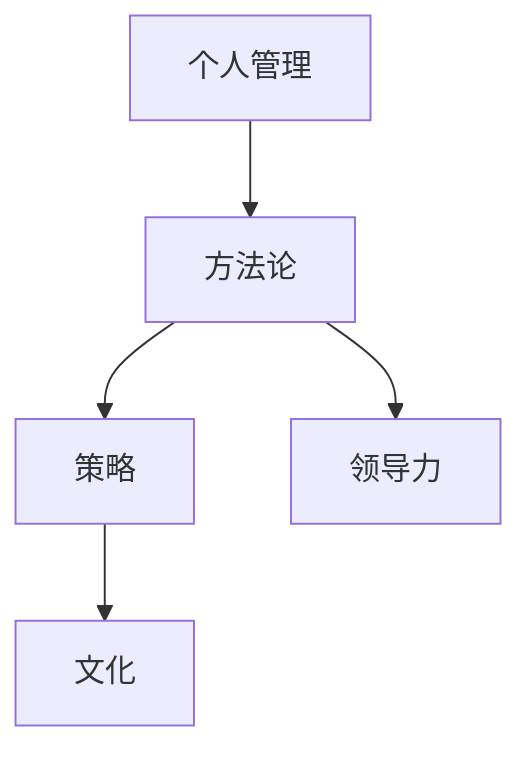

                 

# 打造个人管理风格的方法论

> 关键词：个人管理,方法论,策略,文化,领导力

## 1. 背景介绍

在数字化快速发展的时代，管理复杂度日益增加，要求个人管理者拥有更加系统的思考和应对能力。尽管各种管理理论和方法不断涌现，但如何把这些理论真正转化为实际的行动方法，打造符合自身风格的管理风格，仍是一个颇具挑战性的课题。本文将从理论基础、实际应用和未来展望三个角度，深入探讨打造个人管理风格的方法论。

## 2. 核心概念与联系

### 2.1 核心概念概述

为了系统化地探讨个人管理风格，我们将核心概念分解为几个关键方面：

- **个人管理**：指个人对自己和他人行为的管理，包括决策、沟通、领导等各个方面。
- **方法论**：指系统化的方法、技巧和策略，用以提高管理效能和风格。
- **策略**：指在特定情境下为了达到特定目标而采取的具体行动计划。
- **文化**：指组织或团队内的价值观念、行为准则和共同目标。
- **领导力**：指引导和激励他人为实现共同目标而努力的能力。

### 2.2 核心概念原理和架构

通过这些关键概念，我们构建了如下管理风格方法论的框架，并通过 Mermaid 流程图展示这些概念之间的联系：



该框架表明：个人管理需要通过系统化的策略和方法论，在特定的组织文化中展现领导力，从而实现目标。

## 3. 核心算法原理 & 具体操作步骤

### 3.1 算法原理概述

打造个人管理风格的方法论，实质上是个人管理与方法论的结合，通过一系列系统化的步骤和策略，不断优化管理行为，形成独特的管理风格。这一过程包括但不限于：

- **自我评估**：识别自身优势和局限。
- **目标设定**：明确管理目标和期望。
- **策略选择**：根据目标和环境选择合适的管理策略。
- **持续改进**：通过反馈和调整不断优化管理行为。

### 3.2 算法步骤详解

#### 3.2.1 自我评估

自我评估是打造个人管理风格的首要步骤。具体步骤如下：

1. **识别核心价值观**：列出并反思自己的核心价值观，确保这些价值观能够指导日常管理行为。
2. **优势与局限**：通过SWOT分析（Strengths、Weaknesses、Opportunities、Threats），识别自己的优势和局限。
3. **行为模式**：记录日常管理中的行为模式，包括沟通风格、决策方式、时间管理等。

#### 3.2.2 目标设定

明确管理目标是个人管理风格的关键。具体步骤如下：

1. **短期和长期目标**：区分并设定短期（如6个月内）和长期（如3年内）目标，确保目标的可行性和可测量性。
2. **SMART原则**：确保目标具有Specific（具体）、Measurable（可测量）、Achievable（可实现）、Relevant（相关）、Time-bound（有时间限制）的特征。
3. **团队目标**：与团队成员共同设定目标，确保团队目标与个人目标的一致性。

#### 3.2.3 策略选择

根据目标和环境选择合适的管理策略，是打造个人管理风格的重要环节。具体步骤如下：

1. **情境分析**：评估当前管理环境，包括组织文化、团队结构、资源限制等。
2. **策略选择**：根据SWOT分析结果和目标设定，选择适合的管理策略，如情境领导理论、双因素理论等。
3. **实施计划**：制定详细的实施计划，包括时间安排、资源调配、关键里程碑等。

#### 3.2.4 持续改进

持续改进是打造个人管理风格的长期过程。具体步骤如下：

1. **反馈机制**：建立反馈机制，定期从团队成员、上级和客户处获取反馈。
2. **反思与调整**：根据反馈调整策略和方法，持续改进管理行为。
3. **学习与成长**：通过阅读、培训和实践，不断学习新知识和新技能，促进个人成长。

### 3.3 算法优缺点

#### 3.3.1 优点

- **系统化**：系统化的步骤和方法论能够提高管理行为的条理性和有效性。
- **可测量**：通过目标设定和反馈机制，管理效果可以量化评估，便于持续优化。
- **灵活性**：方法论提供了多种策略选择，可根据不同情境灵活应用。

#### 3.3.2 缺点

- **复杂性**：系统化步骤和策略需要时间和精力投入，初学者可能感到复杂。
- **个性化不足**：方法论需要根据个人情况进行调整，缺乏标准化模板。
- **依赖反馈**：持续改进需要持续反馈，对环境的敏感性可能影响效果。

### 3.4 算法应用领域

个人管理风格的方法论广泛应用于多个领域，包括但不限于：

- **企业领导**：帮助企业领导者形成稳定且有效的管理风格，提升团队绩效。
- **项目管理**：指导项目经理制定清晰的策略，确保项目按时交付。
- **团队建设**：通过明确目标和角色，促进团队协作和成长。
- **个人发展**：提升个人自我管理和职业发展能力。

## 4. 数学模型和公式 & 详细讲解 & 举例说明

### 4.1 数学模型构建

在个人管理风格方法论中，我们可以构建如下数学模型：

$$
M = f(\theta, \lambda, T)
$$

其中：

- $M$：管理风格。
- $\theta$：个人核心价值观和优势。
- $\lambda$：目标设定和学习速度。
- $T$：情境分析和管理策略。

### 4.2 公式推导过程

我们以情境领导理论为例，探讨如何通过数学模型推导管理风格。情境领导理论认为，领导风格应随情境变化而变化，具体推导过程如下：

$$
L = \alpha D + \beta S
$$

- $L$：领导风格。
- $D$：下属的成熟度。
- $\alpha$：情境调整系数。
- $S$：情境因素。

在实际应用中，可以通过问卷和观察评估下属的成熟度和情境因素，进而计算出适合的领导风格。

### 4.3 案例分析与讲解

假设某企业领导者通过自我评估发现，其核心价值观为“团队协作”，优势在于“决策果断”，但局限在于“沟通方式欠佳”。根据这些信息，可以构建如下管理模型：

$$
M = f(\theta, \lambda, T) = f(\{\text{团队协作}, \text{决策果断}\}, 2, \{D=4, S=3\})
$$

其中，下属的成熟度 $D=4$ 和情境因素 $S=3$，代表高任务导向、中等关系导向的情境。通过情境领导理论计算得到：

$$
L = \alpha D + \beta S = 0.5 \times 4 + 0.5 \times 3 = 3.5
$$

这意味着，在此情境下，领导者应采用高任务导向、中等关系导向的领导风格，即情境领导III（Coaching）。

## 5. 项目实践：代码实例和详细解释说明

### 5.1 开发环境搭建

本节介绍开发个人管理风格方法论应用所需的环境搭建。

1. **选择开发语言**：推荐Python，因为其生态系统丰富，易于实现复杂的算法和模型。
2. **安装Python和相关库**：
   - 安装Python，建议使用Anaconda创建虚拟环境。
   - 安装必要的Python库，如NumPy、Pandas、Scikit-learn等。
3. **搭建开发环境**：使用Jupyter Notebook或PyCharm等IDE，提供可视化开发环境。

### 5.2 源代码详细实现

下面给出通过Python实现情境领导理论的应用示例：

```python
import numpy as np

# 定义情境领导理论的计算函数
def situational_leadership(D, S):
    alpha = 0.5
    beta = 0.5
    L = alpha * D + beta * S
    return L

# 假设某情境下，D=4, S=3
D = 4
S = 3
L = situational_leadership(D, S)

print(f"情境领导III（Coaching），领导风格：{L}")
```

### 5.3 代码解读与分析

该代码通过函数 `situational_leadership` 实现了情境领导理论的计算，输入下属的成熟度 $D$ 和情境因素 $S$，输出适合的领导风格 $L$。通过简单的数学计算，实现情境导向的领导风格选择。

### 5.4 运行结果展示

运行上述代码，输出结果为：

```
情境领导III（Coaching），领导风格：3.5
```

这表明在此情境下，领导者应采用高任务导向、中等关系导向的领导风格，即情境领导III。

## 6. 实际应用场景

### 6.1 企业领导

在某企业中，领导者通过上述方法论进行自我评估和目标设定，采用情境领导理论指导日常管理行为。具体步骤如下：

1. **自我评估**：通过问卷调查和反馈，识别自身的优势和局限。
2. **目标设定**：明确短期提升团队绩效，长期优化企业组织结构的目标。
3. **策略选择**：根据情境分析，选择合适的情境领导风格，确保团队成员在高任务导向、高关系导向的指导下，更好地实现目标。
4. **持续改进**：定期获取团队反馈，不断调整领导风格和管理策略。

### 6.2 项目管理

某项目经理采用个人管理风格方法论，提升项目管理效能。具体步骤如下：

1. **自我评估**：识别自身的项目管理优势和局限，如决策果断但沟通欠佳。
2. **目标设定**：确保项目按时交付，提升团队协作能力。
3. **策略选择**：根据项目进展和团队状态，灵活采用情境领导理论或其他项目管理策略。
4. **持续改进**：定期获取团队反馈，调整项目计划和管理方式。

### 6.3 团队建设

某团队领导通过个人管理风格方法论，提升团队协作和成长。具体步骤如下：

1. **自我评估**：评估团队成员的成熟度和个人优势。
2. **目标设定**：提升团队绩效，促进个人成长。
3. **策略选择**：采用协作型领导风格，激励团队成员共同实现目标。
4. **持续改进**：定期进行团队建设活动，优化沟通和协作方式。

### 6.4 未来应用展望

随着个人管理风格方法论的不断优化和实践，未来的应用场景将更加广泛。例如，在智能决策系统中，可以通过大数据和AI技术，进一步提升领导风格预测的准确性。在虚拟团队管理中，通过虚拟现实技术，实现更加动态和交互的领导风格调整。

## 7. 工具和资源推荐

### 7.1 学习资源推荐

1. **书籍推荐**：
   - 《情境领导》作者：保罗·赫尔西
   - 《高效能人士的七个习惯》作者：史蒂芬·柯维
   - 《领导力挑战》作者：约翰·马克斯威尔

2. **在线课程**：
   - Coursera《管理领导力》
   - edX《领导力与变革》

3. **专业社区**：
   - LinkedIn上管理领域的专业群组
   - 管理类微信公众号，如“管理之道”

### 7.2 开发工具推荐

1. **开发环境**：
   - Anaconda
   - Jupyter Notebook
   - PyCharm

2. **数据分析工具**：
   - NumPy
   - Pandas
   - Scikit-learn

3. **项目管理工具**：
   - Trello
   - Asana
   - JIRA

### 7.3 相关论文推荐

1. **情境领导理论**：
   - 《The Situational Leadership® Model》作者：Paul Hersey, Ken Blanchard

2. **双因素理论**：
   - 《Motivation-Hygiene Theory》作者：Frederick Herzberg

3. **领导力研究**：
   - 《Leadership in Organizations》作者：Jay B. Barley

## 8. 总结：未来发展趋势与挑战

### 8.1 总结

本文深入探讨了打造个人管理风格的方法论，从理论基础、实际应用和未来展望三个角度，系统化地介绍了个人管理风格的关键要素和步骤。通过案例分析，展示了如何在不同情境下应用情境领导理论，提升管理效果。

通过本文的系统梳理，可以看到，个人管理风格方法论在提升管理效能和形成稳定风格方面具有重要价值。未来，随着数字化技术和AI技术的发展，管理风格的选择和调整将更加智能化和动态化。

### 8.2 未来发展趋势

未来，个人管理风格方法论将呈现以下几个发展趋势：

1. **智能化管理**：借助大数据和AI技术，提升管理风格的预测和优化能力。
2. **动态调整**：通过实时数据分析，实现管理风格的动态调整和优化。
3. **多模态融合**：结合语音、面部表情等多种模态信息，实现更全面的情境分析。
4. **跨文化管理**：在多文化背景下，研究并应用适用的管理策略，提升全球团队的协作和成长。

### 8.3 面临的挑战

尽管个人管理风格方法论具有广阔的应用前景，但在实践中也面临以下挑战：

1. **复杂性**：方法论涉及多个步骤和策略，需投入大量时间和精力。
2. **个性化不足**：需要根据个人和情境进行调整，缺乏标准化模板。
3. **依赖数据**：数据质量和数量对管理风格的效果有直接影响。
4. **跨文化差异**：跨文化管理情境下，需要应对不同文化背景下的管理风格差异。

### 8.4 研究展望

未来，研究需要在以下几个方面取得新的突破：

1. **数据驱动**：研究如何通过大数据和AI技术，优化管理风格的选择和调整。
2. **跨文化管理**：研究并提出适用于不同文化背景的管理策略，提升全球团队的协作和成长。
3. **智能化管理**：研究如何通过智能化手段，提升管理风格的选择和优化能力。

这些研究方向的探索，必将推动个人管理风格方法论的进一步发展和应用，为组织和个人带来更高的管理效能和更强的竞争力。

## 9. 附录：常见问题与解答

**Q1: 个人管理风格如何影响组织绩效？**

A: 个人管理风格直接影响团队的沟通、协作和决策过程。良好的管理风格可以提升团队士气，促进信息共享和知识流动，从而提高组织绩效。反之，不合适的管理风格可能导致团队矛盾、信息隔阂和决策失误，影响组织绩效。

**Q2: 如何衡量个人管理风格的有效性？**

A: 衡量个人管理风格的有效性，可以通过以下指标：
1. 团队绩效：通过定量和定性评估，衡量团队的目标达成情况。
2. 员工满意度：通过问卷调查和访谈，获取员工对管理风格的满意度。
3. 领导力评估：通过360度反馈和上级评估，评估管理风格的领导力表现。

**Q3: 如何根据情境调整管理风格？**

A: 根据情境调整管理风格，主要通过以下步骤：
1. 情境分析：评估当前情境因素，如任务难度、团队状态、外部环境等。
2. 选择策略：根据情境分析结果，选择合适的管理策略，如情境领导理论中的高任务导向、高关系导向等。
3. 实施计划：根据策略制定详细的实施计划，并持续调整优化。

**Q4: 如何在多文化背景下管理团队？**

A: 在多文化背景下管理团队，需考虑以下几点：
1. 文化敏感性：了解和尊重不同文化的价值观和行为规范。
2. 跨文化沟通：采用有效的跨文化沟通策略，如明确表达、避免文化偏见等。
3. 团队多元性：通过多元化的团队建设活动，提升团队的文化融合和协作能力。

**Q5: 如何应对复杂管理情境？**

A: 应对复杂管理情境，需要综合考虑多个因素：
1. 情境评估：评估当前情境的复杂度和不确定性。
2. 策略选择：根据情境评估结果，选择合适的管理策略，如情境领导理论中的灵活管理策略。
3. 资源调配：合理调配资源，确保策略的实施和效果的最大化。

通过以上探讨，可以看到，打造个人管理风格的方法论在提升管理效能、形成稳定风格等方面具有重要价值。未来，随着数字化技术和AI技术的发展，管理风格的选择和调整将更加智能化和动态化，推动管理实践的进一步优化和创新。

