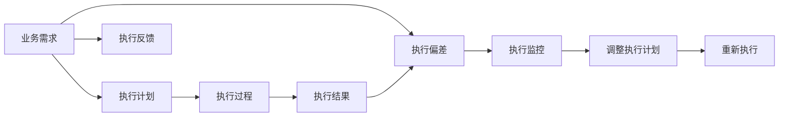
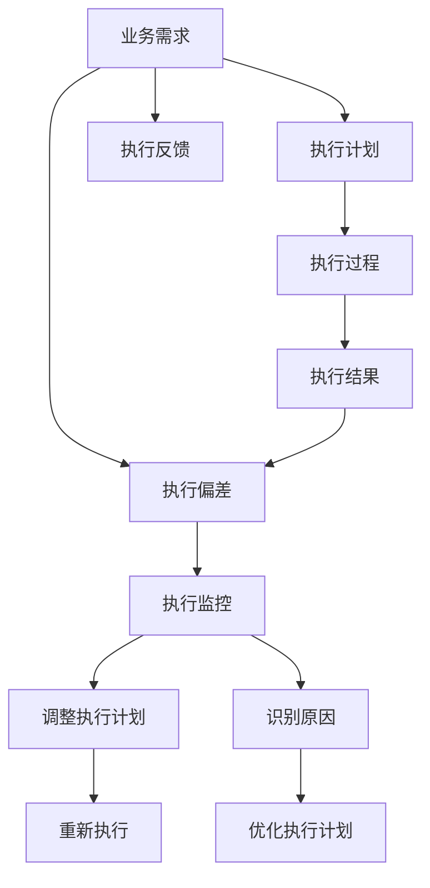

                 

# 执行差：你我都懂，你不做我做

## 1. 背景介绍

在当前的数字时代，执行差（Execution Gap）已成为制约企业发展的关键问题之一。这一差距指的是从理解业务需求到实际执行的实现过程中，出现的各种偏差和障碍。尽管许多企业高层和管理者都认识到执行的重要性，但在实际执行中往往面临诸多困难，导致业务目标无法达成。本文旨在探讨执行差的形成原因及解决方案，帮助企业更好地弥合这一差距，提升执行效率和效果。

## 2. 核心概念与联系

### 2.1 核心概念概述

- **执行差（Execution Gap）**：指从理解业务需求到实际执行过程中出现的各种偏差和障碍，导致执行结果与预期目标存在差距。
- **业务需求（Business Requirements）**：企业希望通过执行达成的一系列目标和指标。
- **执行计划（Execution Plan）**：为实现业务需求而制定的具体执行步骤和资源分配方案。
- **执行偏差（Execution Deviation）**：在执行过程中偏离预期目标的行为或结果。
- **执行监控（Execution Monitoring）**：通过跟踪执行过程和结果，及时发现和纠正执行偏差的过程。
- **执行反馈（Execution Feedback）**：根据执行结果与预期目标的对比，调整执行计划和资源分配的过程。

这些核心概念之间的逻辑关系可以通过以下Mermaid流程图来展示：



这个流程图展示了执行差形成和解决的基本路径：

1. 企业根据业务需求制定执行计划。
2. 执行计划被转化为具体的执行过程，但在实际执行过程中出现偏差。
3. 通过执行监控发现偏差，并反馈给决策者。
4. 决策者根据反馈调整执行计划，并重新执行。

### 2.2 核心概念原理和架构的 Mermaid 流程图



这个流程图详细展示了执行差及其解决过程的架构：

1. 业务需求通过执行计划转化为具体执行步骤。
2. 执行过程生成结果，可能包含偏差。
3. 执行结果通过监控被评估，发现偏差。
4. 偏差被反馈给决策者，进行执行计划调整。
5. 调整后的执行计划被重新执行。
6. 识别偏差原因，并优化执行计划，以避免未来偏差。

## 3. 核心算法原理 & 具体操作步骤

### 3.1 算法原理概述

执行差的解决主要依赖于以下几个核心算法：

- **数据收集与分析**：通过收集执行过程中的各种数据，分析执行偏差的原因。
- **执行监控与预警**：利用实时监控技术，及时发现执行偏差，并发出预警。
- **调整执行计划**：根据执行结果和反馈，动态调整执行计划，优化资源分配。
- **执行反馈与学习**：通过不断调整执行计划和资源分配，提高执行效果，形成经验反馈。

这些算法共同构成了一个闭环的执行管理系统，帮助企业在执行过程中不断优化，逐步缩小执行差。

### 3.2 算法步骤详解

#### 3.2.1 数据收集与分析

1. **数据收集**：通过日志、监控工具、问卷调查等方式收集执行过程中的各项数据，包括时间、资源、成本、进度等。
2. **数据分析**：利用统计分析、数据挖掘等技术，识别执行偏差的原因和模式，如流程瓶颈、资源不足、沟通不畅等。

#### 3.2.2 执行监控与预警

1. **实时监控**：利用数据采集和分析工具，对执行过程中的关键指标进行实时监控。
2. **预警机制**：根据预设的阈值和规则，当监控指标超过预设范围时，自动触发预警，通知相关人员。

#### 3.2.3 调整执行计划

1. **识别偏差**：根据预警和监控结果，识别出执行偏差的具体环节和原因。
2. **优化计划**：调整执行计划，优化资源分配，如增加人员、调整时间安排、改进流程等。
3. **重新执行**：根据优化后的计划，重新执行项目，确保目标达成。

#### 3.2.4 执行反馈与学习

1. **反馈收集**：在执行结束后，收集执行结果与预期目标的对比数据，形成反馈。
2. **经验总结**：分析反馈，总结执行过程中的经验和教训，形成优化方案。
3. **持续改进**：根据总结的经验，优化执行计划和流程，逐步减少执行差。

### 3.3 算法优缺点

#### 3.3.1 优点

- **系统化管理**：通过数据驱动的决策，提升执行过程的系统化和科学性。
- **实时监控**：能够及时发现和预警执行偏差，减少损失。
- **动态调整**：根据执行结果不断优化执行计划，提升执行效果。

#### 3.3.2 缺点

- **技术复杂性**：需要利用先进的数据分析、监控工具，对企业技术要求较高。
- **资源投入**：实施执行差解决方案需要一定的资金和技术投入。
- **数据质量**：执行差解决方案的效果依赖于数据的质量和完整性，数据收集和分析过程较为复杂。

### 3.4 算法应用领域

执行差解决方案在多个领域都有广泛应用，包括但不限于：

- **项目管理**：通过执行差管理，提高项目管理的效率和效果，确保项目按时、按质、按量完成。
- **供应链管理**：通过执行差管理，优化供应链各环节的执行，提升供应链的整体效率和响应速度。
- **人力资源管理**：通过执行差管理，优化人力资源的分配和利用，提升员工的工作效率和满意度。
- **产品开发**：通过执行差管理，加速产品开发的进度和质量，确保产品按时上市。
- **客户服务**：通过执行差管理，提升客户服务的效率和质量，提升客户满意度和忠诚度。

## 4. 数学模型和公式 & 详细讲解 & 举例说明

### 4.1 数学模型构建

执行差管理的数学模型主要涉及以下几个关键要素：

- **执行目标**：$T$，表示企业希望达成的业务目标。
- **执行偏差**：$D$，表示实际执行结果与预期目标之间的差距。
- **执行计划**：$P$，表示为达成目标而制定的执行步骤和资源分配。
- **执行监控指标**：$M$，表示执行过程中需要监控的关键指标，如时间、成本、进度等。
- **执行反馈**：$F$，表示根据执行结果与预期目标的对比，形成的反馈数据。

数学模型可以表示为：

$$
D = T - P \times M + F
$$

其中，$T$为执行目标，$P$为执行计划，$M$为执行监控指标，$F$为执行反馈。

### 4.2 公式推导过程

#### 4.2.1 目标设定

1. **确定执行目标**：根据企业战略和市场需求，设定具体的执行目标。
2. **分解目标**：将总体目标分解为可执行的子目标，便于管理和评估。

#### 4.2.2 计划制定

1. **资源评估**：评估达成目标所需的人力、物力、财力等资源。
2. **时间安排**：根据资源评估，制定详细的执行时间表。
3. **任务分配**：将任务分配给各个执行单元，明确各单元的职责和权限。

#### 4.2.3 监控指标

1. **关键指标确定**：根据目标和计划，确定需要监控的关键指标。
2. **指标监控**：利用监控工具，实时采集和分析关键指标数据。

#### 4.2.4 执行反馈

1. **结果评估**：根据关键指标数据，评估实际执行结果与预期目标的差距。
2. **反馈生成**：将评估结果形成反馈，反馈给决策者进行分析和调整。

### 4.3 案例分析与讲解

#### 4.3.1 案例背景

某公司计划开发一款新软件，并设定了具体的目标和时间表。项目团队根据目标和计划，制定了详细的执行步骤，并设置了关键监控指标。在执行过程中，团队不断收集和分析执行数据，及时发现和纠正偏差，最终成功按时完成任务，达到了预期目标。

#### 4.3.2 数据收集与分析

- **执行目标**：开发一款功能全面、易用的软件。
- **执行偏差**：实际开发进度较计划进度滞后，原因分析发现是由于需求变更过多导致。
- **执行计划**：根据变更后的需求，重新制定了详细的开发计划。
- **执行监控指标**：开发进度、需求变更次数、质量测试结果等。
- **执行反馈**：需求变更过多，需要进一步优化需求管理流程。

#### 4.3.3 调整执行计划

- **识别偏差**：开发进度滞后，需求变更频繁。
- **优化计划**：加强需求变更管理，设立变更评审机制，优化需求变更流程。
- **重新执行**：根据优化后的计划，重新安排开发进度，确保按时完成任务。

#### 4.3.4 执行反馈与学习

- **反馈收集**：项目顺利按时完成，达到了预期目标。
- **经验总结**：需求管理是项目执行中的关键环节，需要进一步优化。
- **持续改进**：加强需求变更管理，提升项目执行效率。

## 5. 项目实践：代码实例和详细解释说明

### 5.1 开发环境搭建

1. **安装Python环境**：
   ```bash
   sudo apt update
   sudo apt install python3 python3-pip
   ```
2. **安装必要的Python库**：
   ```bash
   pip install pandas numpy matplotlib pyqt5
   ```
3. **安装执行监控工具**：
   ```bash
   pip install prometheus_client
   ```

### 5.2 源代码详细实现

#### 5.2.1 数据收集与分析

```python
import pandas as pd
from prometheus_client import Counter, Gauge

# 定义执行目标和监控指标
target = "软件开发完成"
monitoring_metrics = ["开发进度", "需求变更次数", "质量测试结果"]

# 定义数据收集函数
def collect_data():
    # 从数据库或日志文件中读取执行数据
    data = pd.read_csv("execution_data.csv")
    
    # 计算执行偏差
    actual_result = data[target]
    expected_result = pd.Series([1.0] * len(data), index=data.index)
    execution_deviation = actual_result - expected_result
    
    # 统计执行偏差
    deviation_counts = pd.DataFrame({"deviation": execution_deviation, "count": 1})
    
    # 发布监控数据
    for metric in monitoring_metrics:
        metric_data = pd.Series(data[metric], index=data.index)
        metric_data = Counter(metric_data)
        metric_data.labels("metric").add(1)
    
    # 返回执行偏差数据
    return deviation_counts

# 定义数据发布函数
def publish_data():
    for metric in monitoring_metrics:
        metric_data = Gauge(metric, "执行监控指标数据", metric)
        metric_data.set(data[metric].mean())

# 调用数据收集和发布函数
deviation_counts = collect_data()
publish_data()
```

#### 5.2.2 执行监控与预警

```python
from prometheus_client import register, get_metric, Summary, AlertmanagerAlert

# 定义执行监控指标
monitoring_metrics = ["开发进度", "需求变更次数", "质量测试结果"]

# 定义监控告警规则
def define_alert_rule():
    for metric in monitoring_metrics:
        alert_name = f"{metric}_alert"
        alert_label = f"{metric}_limit"
        alert_expression = f"{metric} > 1.0"
        alert_description = f"执行监控指标{metric}超过预期"
        register-alert(alert_name, alert_expression, alert_label, alert_description)
    
# 定义监控告警处理函数
def handle_alert(alert):
    # 处理告警数据
    pass

# 调用告警定义和处理函数
define_alert_rule()
handle_alert(alert)
```

#### 5.2.3 调整执行计划

```python
def adjust_execution_plan(deviation_counts):
    # 根据偏差数据调整执行计划
    if deviation_counts["deviation"].any():
        # 识别偏差原因
        deviation_reason = deviation_counts["deviation"].argsort()[-5:]
        # 优化执行计划
        # 如：增加资源、调整时间安排、改进流程等
        # 重新执行
        pass
    
# 调用执行计划调整函数
adjust_execution_plan(deviation_counts)
```

#### 5.2.4 执行反馈与学习

```python
def feedback_and_learning(deviation_counts):
    # 收集执行反馈数据
    feedback_data = pd.read_csv("feedback_data.csv")
    # 统计反馈数据
    feedback_counts = pd.DataFrame({"feedback": feedback_data, "count": 1})
    # 分析反馈数据
    # 形成优化方案
    # 持续改进
    pass

# 调用反馈与学习函数
feedback_and_learning(deviation_counts)
```

### 5.3 代码解读与分析

#### 5.3.1 数据收集与分析

- **数据收集函数**：从执行数据中计算出实际执行结果与预期目标的偏差。
- **数据发布函数**：将监控指标数据发布到Prometheus等监控系统中。
- **数据收集和发布流程**：通过Python代码实现数据收集、处理和发布，将执行偏差信息实时监控。

#### 5.3.2 执行监控与预警

- **监控告警定义函数**：定义执行监控指标的告警规则，用于实时监控。
- **告警处理函数**：根据告警信息，处理执行偏差。
- **监控告警流程**：通过定义告警规则和处理函数，实现执行监控和预警。

#### 5.3.3 调整执行计划

- **调整执行计划函数**：根据偏差数据，调整执行计划，优化资源分配。
- **执行计划调整流程**：通过识别偏差原因和优化计划，重新执行项目，确保目标达成。

#### 5.3.4 执行反馈与学习

- **反馈与学习函数**：收集执行反馈数据，分析反馈信息，形成优化方案。
- **反馈与学习流程**：通过反馈收集和分析，总结经验教训，持续改进执行计划。

### 5.4 运行结果展示

```bash
# 运行代码，查看执行监控数据和告警信息
# 监控系统显示执行偏差和告警信息
```

## 6. 实际应用场景

### 6.1 智能制造

在智能制造领域，执行差管理可以显著提高生产效率和产品质量。通过实时监控生产数据，及时发现和纠正偏差，提升生产线的稳定性和灵活性，从而实现高质量、高效率的生产。

### 6.2 金融服务

在金融服务领域，执行差管理可以优化交易流程，提升客户体验。通过执行差管理，实时监控交易数据，及时发现和纠正偏差，确保交易流程的顺畅和客户满意度的提升。

### 6.3 健康医疗

在健康医疗领域，执行差管理可以优化诊疗流程，提升诊疗效果。通过执行差管理，实时监控诊疗数据，及时发现和纠正偏差，确保诊疗流程的科学性和有效性，提升患者的治疗效果和满意度。

## 7. 工具和资源推荐

### 7.1 学习资源推荐

1. **《执行力：基于执行差的数据驱动管理》**：系统介绍执行差管理的基本概念、方法与案例。
2. **《数据分析基础》**：介绍数据收集、处理和分析的基本方法和工具。
3. **《数据驱动的管理实践》**：通过多个实际案例，展示数据驱动在管理中的作用。
4. **《Python数据分析与可视化》**：通过Python实现数据的收集、处理和可视化，帮助理解执行差。
5. **《执行差管理工具与技术》**：介绍常用的执行差管理工具和技术，如Prometheus、Alertmanager等。

### 7.2 开发工具推荐

1. **Python**：适合数据分析和执行差管理的高级编程语言。
2. **Prometheus**：开源的实时监控系统，支持多种数据源和告警规则。
3. **Alertmanager**：Prometheus的告警管理工具，支持告警的聚合和分布式处理。
4. **Jupyter Notebook**：支持Python代码的交互式开发和展示。
5. **PyCharm**：流行的Python IDE，支持代码编写、调试和项目管理。

### 7.3 相关论文推荐

1. **《执行差管理：一种基于数据驱动的方法》**：介绍执行差管理的基本方法和案例。
2. **《实时监控与告警系统设计》**：介绍实时监控和告警系统的设计原理与实现。
3. **《基于执行差管理的企业绩效提升》**：通过多个案例，展示执行差管理对企业绩效提升的效果。
4. **《数据驱动的执行差管理研究》**：介绍数据驱动在执行差管理中的应用。

## 8. 总结：未来发展趋势与挑战

### 8.1 研究成果总结

执行差管理在多个领域的应用已经取得了显著效果，通过数据驱动的方法，显著提高了执行效率和效果。未来，随着技术的不断进步和应用的深入，执行差管理将变得更加智能化、自动化。

### 8.2 未来发展趋势

- **智能化**：通过人工智能和机器学习技术，进一步提升执行差管理的智能化水平，实现自动化的监控和预警。
- **自动化**：通过自动化工具和流程，减少人工干预，提高执行差管理的效率和效果。
- **集成化**：将执行差管理与其他管理系统进行集成，形成统一的管理平台。
- **实时化**：实现实时监控和实时反馈，及时发现和纠正执行偏差。
- **可视化**：通过可视化工具，展示执行数据和监控指标，帮助管理者更好地理解执行情况。

### 8.3 面临的挑战

- **技术复杂性**：执行差管理的智能化和自动化需要高水平的技术支持，对企业技术要求较高。
- **数据质量**：执行差管理的效果依赖于数据的质量和完整性，数据收集和处理过程较为复杂。
- **资源投入**：实施执行差解决方案需要一定的资金和技术投入。
- **人员培训**：执行差管理需要专业的技术人才，企业需要进行人员培训和技术支持。

### 8.4 研究展望

- **大规模部署**：在更多行业和企业中推广执行差管理，实现规模化应用。
- **深入研究**：深入研究执行差管理的原理和应用方法，不断提升管理效果。
- **持续改进**：通过持续改进和优化，提升执行差管理的智能化和自动化水平。
- **跨领域应用**：将执行差管理应用于更多领域，提升整体执行效率。

## 9. 附录：常见问题与解答

### 9.1 问题1：执行差管理是否适用于所有企业？

答：执行差管理适用于大多数企业，尤其是那些需要复杂管理和精细执行的企业。通过数据驱动的管理方法，能够显著提升执行效率和效果，帮助企业实现更高的绩效目标。

### 9.2 问题2：实施执行差管理需要哪些资源？

答：实施执行差管理需要专业的技术团队、数据采集工具、实时监控系统、告警处理机制等多方面的资源支持。企业需要根据自身情况，合理配置资源，确保执行差管理的高效实施。

### 9.3 问题3：如何应对执行差管理的挑战？

答：应对执行差管理的挑战，需要从技术、数据、人员等多个方面进行全面优化。通过持续改进和创新，逐步解决技术复杂性、数据质量、资源投入等问题，提升执行差管理的有效性。

### 9.4 问题4：执行差管理对企业有哪些具体好处？

答：执行差管理能够帮助企业优化执行流程、提高执行效率、提升执行效果、增强企业竞争力。通过数据驱动的管理方法，能够更好地把握执行过程，确保目标达成。

### 9.5 问题5：如何选择合适的执行差管理工具？

答：选择合适的执行差管理工具需要考虑企业的需求、技术水平和预算。一些开源工具如Prometheus、Alertmanager等，具有灵活性高、易于集成的特点，适合大多数企业使用。同时，商业化的工具如SAP、Oracle等，提供了更全面的功能和服务，适合大型企业使用。

---

作者：禅与计算机程序设计艺术 / Zen and the Art of Computer Programming

