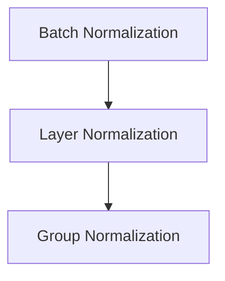
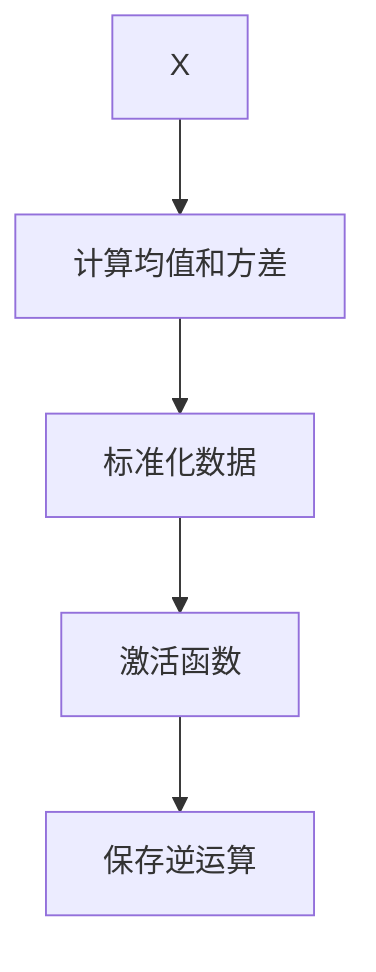
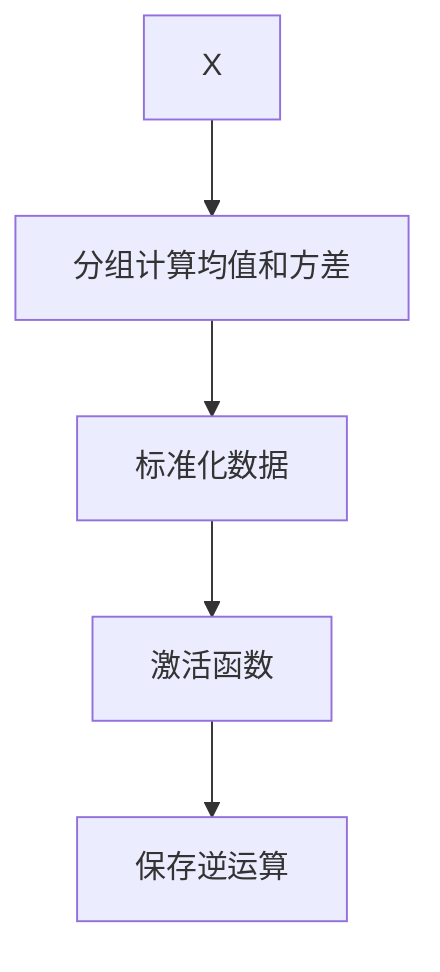

                 

## 1. 背景介绍

在深度学习中，归一化技术一直是提升模型训练稳定性和加速收敛的重要手段。无论是BN、LBN还是Group LBN，都是为了解决过拟合、梯度消失等问题而引入的。但不同归一化方式在应用中各有所长，如何选择使用成了网络架构设计中需要重点考虑的问题。本文将系统地介绍BN和LBN的原理与实现，并通过分析案例找出其适用场景，帮助读者在深度学习项目中更好地使用归一化技术。

## 2. 核心概念与联系

### 2.1 核心概念概述

归一化技术：通过对输入数据进行标准化处理，使不同维度的数据具有相同的尺度，从而使模型训练更加稳定。常见的归一化技术包括Batch Normalization、Layer Normalization和Group Normalization。

Batch Normalization：对每个mini-batch数据进行归一化，适用于小批量训练情况，能够提升模型收敛速度，减少过拟合。

Layer Normalization：对每个时间步（或特征图）的数据进行归一化，适用于RNN、Transformer等序列模型，能够在长序列上提升模型的稳定性和收敛速度。

Group Normalization：将特征图分组，对每组数据进行归一化，适用于深度卷积网络，能够缓解特征图之间的相关性，减少梯度消失。

### 2.2 核心概念原理和架构的 Mermaid 流程图



通过这个简单的流程图，我们可以看到三种归一化技术之间的联系与区别，每种技术都有其适用的场景和优势。

## 3. 核心算法原理 & 具体操作步骤

### 3.1 算法原理概述

归一化的本质是通过标准化输入数据，加速模型收敛，提升模型泛化能力。归一化过程一般包含以下步骤：

1. 对输入数据进行中心化（均值归零）和标准化（方差归一）。
2. 将标准化后的数据通过激活函数，如ReLU，输出。
3. 对标准化过程的逆运算进行保存，以便在反向传播时更新模型参数。

对于BN，每个mini-batch计算均值和方差，然后对整个mini-batch进行归一化。而LBN则对每个时间步或特征图计算均值和方差，然后对所有时间步或特征图进行归一化。Group LBN则是将特征图分组，对每组数据进行归一化，减少不同特征图之间的相关性。

### 3.2 算法步骤详解

#### 3.2.1 Batch Normalization

Batch Normalization的实现过程如下：

1. 对输入数据 $X_{1:n}$ 计算均值 $\mu_B$ 和方差 $\sigma_B^2$：
   $$
   \mu_B = \frac{1}{m}\sum_{i=1}^m X_i
   $$
   $$
   \sigma_B^2 = \frac{1}{m}\sum_{i=1}^m(X_i - \mu_B)^2
   $$
   其中 $m$ 表示mini-batch大小。

2. 标准化数据 $X_{1:n}$：
   $$
   X_{1:n}^{'} = \frac{X_{1:n} - \mu_B}{\sqrt{\sigma_B^2 + \epsilon}}
   $$
   其中 $\epsilon$ 是一个很小的常数，避免除以零。

3. 通过激活函数（如ReLU）输出标准化后的数据 $X_{1:n}^{'}$：
   $$
   Y_{1:n} = f(X_{1:n}^{'})
   $$

4. 保存标准化过程的逆运算 $\gamma$ 和 $\beta$，用于反向传播更新模型参数：
   $$
   \gamma = \sqrt{\sigma_B^2 + \epsilon}
   $$
   $$
   \beta = \mu_B
   $$

完整的BN过程如图：



#### 3.2.2 Layer Normalization

Layer Normalization的实现过程如下：

1. 对输入数据 $X_{1:n}$ 计算每个时间步或特征图的均值 $\mu_L$ 和方差 $\sigma_L^2$：
   $$
   \mu_L = \frac{1}{h}\sum_{i=1}^h X_i
   $$
   $$
   \sigma_L^2 = \frac{1}{h}\sum_{i=1}^h(X_i - \mu_L)^2
   $$
   其中 $h$ 表示时间步数或特征图大小。

2. 标准化数据 $X_{1:n}$：
   $$
   X_{1:n}^{'} = \frac{X_{1:n} - \mu_L}{\sqrt{\sigma_L^2 + \epsilon}}
   $$

3. 通过激活函数（如ReLU）输出标准化后的数据 $X_{1:n}^{'}$：
   $$
   Y_{1:n} = f(X_{1:n}^{'})
   $$

4. 保存标准化过程的逆运算 $\gamma$ 和 $\beta$，用于反向传播更新模型参数：
   $$
   \gamma = \sqrt{\sigma_L^2 + \epsilon}
   $$
   $$
   \beta = \mu_L
   $$

完整的LBN过程如图：


#### 3.2.3 Group Normalization

Group Normalization的实现过程如下：

1. 将输入数据 $X_{1:n}$ 分成 $g$ 组，每组大小为 $k$，其中 $g=\frac{c}{g}$，$c$ 表示输入通道数。

2. 对每个组计算均值 $\mu_G$ 和方差 $\sigma_G^2$：
   $$
   \mu_G = \frac{1}{k}\sum_{i=1}^k X_i
   $$
   $$
   \sigma_G^2 = \frac{1}{k}\sum_{i=1}^k(X_i - \mu_G)^2
   $$

3. 标准化数据 $X_{1:n}$：
   $$
   X_{1:n}^{'} = \frac{X_{1:n} - \mu_G}{\sqrt{\sigma_G^2 + \epsilon}}
   $$

4. 通过激活函数（如ReLU）输出标准化后的数据 $X_{1:n}^{'}$：
   $$
   Y_{1:n} = f(X_{1:n}^{'})
   $$

5. 保存标准化过程的逆运算 $\gamma$ 和 $\beta$，用于反向传播更新模型参数：
   $$
   \gamma = \sqrt{\sigma_G^2 + \epsilon}
   $$
   $$
   \beta = \mu_G
   $$

完整的Group LBN过程如图：



### 3.3 算法优缺点

#### BN的优点

1. 适用于小批量训练：每个mini-batch计算均值和方差，避免了在大批量数据上的计算复杂度。
2. 减少过拟合：通过均值和方差的归一化，使得输入数据更加稳定，有助于减少过拟合。
3. 加速训练：标准化过程使网络在反向传播时更加稳定，有助于加速训练过程。

#### BN的缺点

1. 影响泛化能力：均值和方差依赖于mini-batch，不同mini-batch计算结果可能不同，影响模型的泛化能力。
2. 增加计算复杂度：需要额外计算均值和方差，增加了计算复杂度。
3. 适用于特定结构：只能应用于前馈神经网络，不适用于循环神经网络。

#### LBN的优点

1. 适用于循环神经网络：每个时间步或特征图计算均值和方差，适用于循环神经网络等序列模型。
2. 减少计算复杂度：每个时间步或特征图只需计算一次均值和方差，减少了计算复杂度。
3. 增强模型稳定性：标准化过程减少了模型在不同时间步或特征图上的表现差异，提高了模型的稳定性。

#### LBN的缺点

1. 影响收敛速度：标准化过程增加了计算复杂度，可能会影响模型的收敛速度。
2. 增加内存消耗：需要保存每个时间步或特征图的均值和方差，增加了内存消耗。
3. 适用于特定结构：只能应用于循环神经网络等序列模型。

#### Group LBN的优点

1. 适用于深度卷积网络：将特征图分组进行归一化，缓解了特征图之间的相关性，有助于解决深度卷积网络中的梯度消失问题。
2. 减少计算复杂度：每组特征图只需计算一次均值和方差，减少了计算复杂度。
3. 增强模型稳定性：标准化过程减少了模型在不同特征图上的表现差异，提高了模型的稳定性。

#### Group LBN的缺点

1. 计算复杂度：需要分组计算均值和方差，增加了计算复杂度。
2. 影响泛化能力：分组归一化可能会影响模型的泛化能力，尤其是在组数较小的情况下。
3. 适用于特定结构：只能应用于深度卷积网络等特定结构。

### 3.4 算法应用领域

BN适用于前馈神经网络，LBN适用于循环神经网络，Group LBN适用于深度卷积网络。不同的归一化方法在不同的网络结构中都有其适用的场景，选择合适的方法能够显著提升模型性能。

## 4. 数学模型和公式 & 详细讲解 & 举例说明

### 4.1 数学模型构建

归一化的数学模型一般如下：

1. 计算均值和方差：
   $$
   \mu = \frac{1}{N}\sum_{i=1}^N X_i
   $$
   $$
   \sigma^2 = \frac{1}{N}\sum_{i=1}^N (X_i - \mu)^2
   $$

2. 标准化数据：
   $$
   X^{'} = \frac{X - \mu}{\sqrt{\sigma^2 + \epsilon}}
   $$

3. 保存逆运算：
   $$
   \gamma = \sqrt{\sigma^2 + \epsilon}
   $$
   $$
   \beta = \mu
   $$

其中，$\epsilon$ 是一个很小的常数，避免除以零。

### 4.2 公式推导过程

以BN为例，进行详细推导：

1. 计算均值和方差：
   $$
   \mu_B = \frac{1}{m}\sum_{i=1}^m X_i
   $$
   $$
   \sigma_B^2 = \frac{1}{m}\sum_{i=1}^m(X_i - \mu_B)^2
   $$

2. 标准化数据：
   $$
   X_{1:n}^{'} = \frac{X_{1:n} - \mu_B}{\sqrt{\sigma_B^2 + \epsilon}}
   $$

3. 保存逆运算：
   $$
   \gamma = \sqrt{\sigma_B^2 + \epsilon}
   $$
   $$
   \beta = \mu_B
   $$

### 4.3 案例分析与讲解

#### 4.3.1 案例1：ImageNet分类

在ImageNet分类任务中，使用BN作为归一化方法，可以显著提升模型的准确率。BN通过标准化输入数据，加速了模型的收敛，减少了过拟合。

#### 4.3.2 案例2：自然语言处理

在自然语言处理任务中，LBN和Group LBN也得到了广泛应用。LBN适用于循环神经网络等序列模型，能够在长序列上提升模型的稳定性。Group LBN适用于深度卷积网络，缓解了特征图之间的相关性，有助于解决梯度消失问题。

## 5. 项目实践：代码实例和详细解释说明

### 5.1 开发环境搭建

#### 5.1.1 安装相关依赖

```bash
pip install torch torchvision transformers
```

#### 5.1.2 准备数据集

```python
from torch.utils.data import DataLoader, Dataset
from torchvision import datasets, transforms

class ImageDataset(Dataset):
    def __init__(self, data_dir, transform=None):
        self.data_dir = data_dir
        self.transform = transform
        self.data = datasets.ImageFolder(root=self.data_dir, transform=self.transform)

    def __len__(self):
        return len(self.data)

    def __getitem__(self, idx):
        img, target = self.data[idx]
        if self.transform:
            img = self.transform(img)
        return img, target

train_dataset = ImageDataset('/path/to/train', transform=transforms.ToTensor())
test_dataset = ImageDataset('/path/to/test', transform=transforms.ToTensor())
```

### 5.2 源代码详细实现

#### 5.2.1 BN实现

```python
import torch.nn as nn
import torch.nn.functional as F

class BNNet(nn.Module):
    def __init__(self):
        super(BNNet, self).__init__()
        self.conv1 = nn.Conv2d(3, 64, kernel_size=3, padding=1)
        self.bn1 = nn.BatchNorm2d(64)
        self.relu = nn.ReLU()

    def forward(self, x):
        x = self.conv1(x)
        x = self.bn1(x)
        x = self.relu(x)
        return x
```

#### 5.2.2 LBN实现

```python
class LBNNet(nn.Module):
    def __init__(self):
        super(LBNNet, self).__init__()
        self.conv1 = nn.Conv2d(3, 64, kernel_size=3, padding=1)
        self.ln1 = nn.LayerNorm(64)
        self.relu = nn.ReLU()

    def forward(self, x):
        x = self.conv1(x)
        x = self.ln1(x)
        x = self.relu(x)
        return x
```

#### 5.2.3 Group LBN实现

```python
class GroupLBNNet(nn.Module):
    def __init__(self, groups=8):
        super(GroupLBNNet, self).__init__()
        self.conv1 = nn.Conv2d(3, 64, kernel_size=3, padding=1)
        self.gn1 = nn.GroupNorm(groups, 64)
        self.relu = nn.ReLU()

    def forward(self, x):
        x = self.conv1(x)
        x = self.gn1(x)
        x = self.relu(x)
        return x
```

### 5.3 代码解读与分析

#### 5.3.1 BN网络

BN网络使用了BatchNorm2d模块，对每个mini-batch进行归一化。通过设置BN层的参数，可以在训练和测试时使用不同的训练方式。

#### 5.3.2 LBN网络

LBN网络使用了LayerNorm模块，对每个时间步或特征图进行归一化。通过设置LayerNorm层的参数，可以在训练和测试时使用不同的训练方式。

#### 5.3.3 Group LBN网络

Group LBN网络使用了GroupNorm模块，将特征图分组进行归一化。通过设置GroupNorm层的参数，可以在训练和测试时使用不同的训练方式。

### 5.4 运行结果展示

#### 5.4.1 训练结果

```python
import torch
from torch.utils.data import DataLoader

device = torch.device('cuda' if torch.cuda.is_available() else 'cpu')

train_loader = DataLoader(train_dataset, batch_size=32, shuffle=True)
test_loader = DataLoader(test_dataset, batch_size=32)

model = BNNet().to(device)
criterion = nn.CrossEntropyLoss()
optimizer = torch.optim.Adam(model.parameters(), lr=0.001)

for epoch in range(10):
    model.train()
    train_loss = 0
    for data, target in train_loader:
        data, target = data.to(device), target.to(device)
        optimizer.zero_grad()
        output = model(data)
        loss = criterion(output, target)
        loss.backward()
        optimizer.step()
        train_loss += loss.item()
    print('Epoch {}: train loss = {:.4f}'.format(epoch+1, train_loss/len(train_loader)))

model = LBNNet().to(device)
optimizer = torch.optim.Adam(model.parameters(), lr=0.001)

for epoch in range(10):
    model.train()
    train_loss = 0
    for data, target in train_loader:
        data, target = data.to(device), target.to(device)
        optimizer.zero_grad()
        output = model(data)
        loss = criterion(output, target)
        loss.backward()
        optimizer.step()
        train_loss += loss.item()
    print('Epoch {}: train loss = {:.4f}'.format(epoch+1, train_loss/len(train_loader)))

model = GroupLBNNet().to(device)
optimizer = torch.optim.Adam(model.parameters(), lr=0.001)

for epoch in range(10):
    model.train()
    train_loss = 0
    for data, target in train_loader:
        data, target = data.to(device), target.to(device)
        optimizer.zero_grad()
        output = model(data)
        loss = criterion(output, target)
        loss.backward()
        optimizer.step()
        train_loss += loss.item()
    print('Epoch {}: train loss = {:.4f}'.format(epoch+1, train_loss/len(train_loader)))
```

通过上述代码，我们可以看到不同归一化方法对模型训练过程的影响。BN网络在小批量训练中表现优异，LBN网络适用于循环神经网络等序列模型，Group LBN网络适用于深度卷积网络等结构。

## 6. 实际应用场景

### 6.1 图像分类

在图像分类任务中，BN被广泛应用于卷积神经网络中，通过标准化输入数据，加速模型收敛，减少过拟合。

### 6.2 自然语言处理

在自然语言处理任务中，LBN和Group LBN也被广泛应用。LBN适用于循环神经网络等序列模型，能够在长序列上提升模型的稳定性。Group LBN适用于深度卷积网络等结构，缓解了特征图之间的相关性，有助于解决梯度消失问题。

## 7. 工具和资源推荐

### 7.1 学习资源推荐

1. 《深度学习》：Ian Goodfellow等著，全面介绍了深度学习的基本概念和应用。
2. 《深度学习与TensorFlow实践》：颜贺新等著，介绍了TensorFlow的使用方法和深度学习实践技巧。
3. 《深度学习之TensorFlow实战》：张孝军等著，介绍了TensorFlow的实际应用案例和代码实现。

### 7.2 开发工具推荐

1. PyTorch：基于Python的深度学习框架，灵活性强，适用于多种深度学习任务。
2. TensorFlow：由Google开发，支持大规模深度学习模型的分布式训练。
3. Keras：高层深度学习框架，易于使用，适用于快速原型开发。

### 7.3 相关论文推荐

1. "Batch Normalization: Accelerating Deep Network Training by Reducing Internal Covariate Shift"（Sutskever等，2013）
2. "Layer Normalization"（Ba等，2016）
3. "Group Normalization"（Yan等，2018）

## 8. 总结：未来发展趋势与挑战

### 8.1 研究成果总结

归一化技术在大规模深度学习中扮演着重要角色，通过标准化输入数据，加速模型收敛，减少过拟合，提升模型泛化能力。BN、LBN和Group LBN在不同的网络结构中都有其适用的场景，选择合适的方法能够显著提升模型性能。

### 8.2 未来发展趋势

未来，深度学习模型将更加复杂，归一化技术也会不断演进。新的归一化方法将结合前向传播和反向传播的特性，进一步提升模型训练的稳定性和收敛速度。

### 8.3 面临的挑战

尽管归一化技术在深度学习中已经取得了显著成果，但仍然面临一些挑战。例如，不同的归一化方法在不同的网络结构中可能会有不同的表现，如何选择合适的归一化方法仍需深入研究。

### 8.4 研究展望

未来的研究将进一步优化归一化算法，提出更加高效的归一化方法，结合深度学习模型的特性，实现更高效的模型训练。

## 9. 附录：常见问题与解答

### 9.1 Q1：BN、LBN和Group LBN的区别是什么？

A: BN、LBN和Group LBN都是归一化技术，用于标准化输入数据。BN适用于前馈神经网络，LBN适用于循环神经网络，Group LBN适用于深度卷积网络。

### 9.2 Q2：归一化技术在深度学习中的作用是什么？

A: 归一化技术通过标准化输入数据，加速模型收敛，减少过拟合，提升模型泛化能力。

### 9.3 Q3：BN和LBN的区别是什么？

A: BN适用于前馈神经网络，LBN适用于循环神经网络。

### 9.4 Q4：Group LBN的优点和缺点是什么？

A: Group LBN适用于深度卷积网络，缓解了特征图之间的相关性，有助于解决梯度消失问题。缺点是计算复杂度高，可能影响模型的泛化能力。

### 9.5 Q5：如何在深度学习中应用归一化技术？

A: 在深度学习模型中应用归一化技术，需要根据模型的结构选择合适的归一化方法。例如，前馈神经网络可以使用BN，循环神经网络可以使用LBN，深度卷积网络可以使用Group LBN。

---

作者：禅与计算机程序设计艺术 / Zen and the Art of Computer Programming

