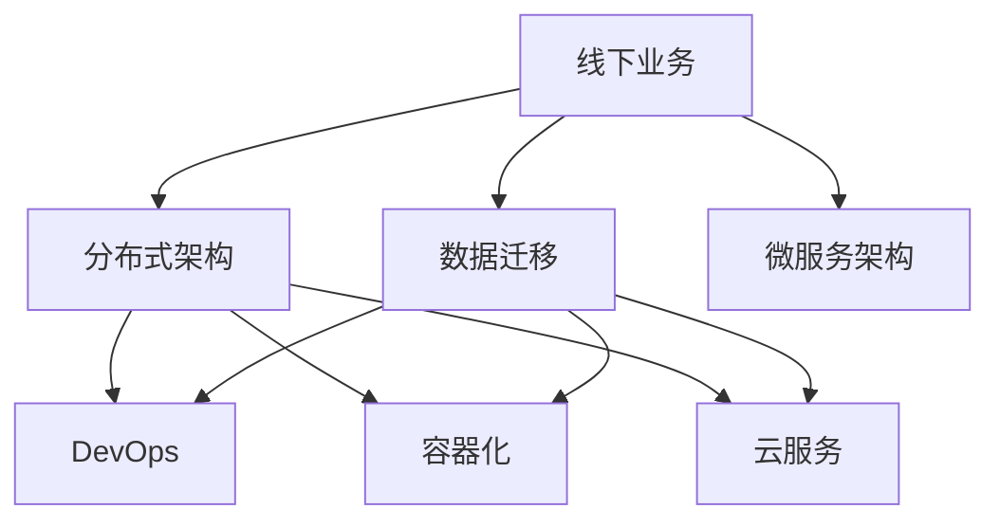

                 

# 技术分享：从线下到线上的转变

## 1. 背景介绍

随着互联网技术的飞速发展，传统业务从线下逐步转移到线上已经成为了一种趋势。这种转变不仅改变了企业的运营模式，也带来了诸多技术挑战和机遇。本文将系统性地介绍如何利用信息技术手段，将线下业务迁移到线上，以及在此过程中需要考虑的核心技术问题和解决方案。

### 1.1 问题由来

传统线下业务向线上迁移已经成为大势所趋，这主要受到以下几个因素的驱动：

- **用户需求变化**：用户越来越多地依赖互联网进行工作、学习、娱乐等活动，线上服务的需求激增。
- **市场竞争加剧**：互联网企业通过线上渠道快速扩张，传统线下企业在竞争中处于劣势。
- **疫情影响**：新冠疫情期间，人们被迫减少线下活动，进一步加速了向线上迁移的步伐。

### 1.2 问题核心关键点

从线下到线上迁移的关键点包括以下几个方面：

- **系统架构重构**：将传统业务系统重构为可扩展的分布式系统，支持高并发和弹性伸缩。
- **数据迁移**：将线下数据迁移到线上系统，确保数据一致性和完整性。
- **用户界面优化**：根据线上用户习惯和需求，优化用户界面和体验。
- **安全合规**：确保线上业务符合相关法律法规和安全标准，保障用户数据安全。
- **运营监控**：建立完善的运营监控体系，及时发现和处理线上问题，提升用户体验。

## 2. 核心概念与联系

### 2.1 核心概念概述

为了方便理解，本节将介绍几个核心概念及其相互关系：

- **线下业务**：传统的实体店面、柜台、人员等构成的业务形态。
- **线上业务**：通过互联网平台提供的服务和产品，如网站、App、在线课程等。
- **数据迁移**：将线下业务数据迁移到线上系统，包括但不限于客户数据、订单数据、库存数据等。
- **分布式架构**：将业务系统拆分成多个模块，运行在多台服务器上，实现高并发和高可用。
- **微服务架构**：将系统拆分成多个微服务，每个服务独立部署和更新，增强系统的灵活性和扩展性。
- **DevOps**：涵盖软件开发和运维流程的一系列工具和实践，提升开发效率和系统稳定性。
- **容器化**：将应用和依赖打包到容器中，支持快速部署和跨环境一致性。
- **云服务**：利用云平台提供的基础设施和服务，实现按需扩展和成本优化。

这些概念之间的逻辑关系可以通过以下Mermaid流程图来展示：



这个流程图展示了下线业务到线上迁移的核心概念及其相互关系：

1. 线下业务通过数据迁移进入线上系统。
2. 线下系统通过分布式架构和微服务架构，升级为可扩展的线上系统。
3. DevOps流程和容器化技术，支撑线上系统的快速部署和稳定运行。
4. 云服务提供弹性资源，支持线上系统的按需扩展和成本优化。

## 3. 核心算法原理 & 具体操作步骤

### 3.1 算法原理概述

从线下到线上迁移的核心算法原理包括以下几个方面：

- **数据迁移算法**：确保数据从线下系统迁移到线上系统时，数据结构、格式、关联关系不变。
- **分布式系统设计**：通过负载均衡、故障转移等机制，保障线上系统的可用性和稳定性。
- **微服务拆分与部署**：将业务系统拆分为多个独立的服务，独立部署和更新，降低系统复杂度，增强可维护性。
- **DevOps流程设计**：通过持续集成、持续部署等自动化工具，提升开发效率和系统稳定性。
- **云服务资源管理**：利用云平台提供的弹性资源，按需扩展和优化线上系统的成本。

### 3.2 算法步骤详解

以下是具体的算法步骤：

**Step 1: 需求分析**

- 梳理线下业务流程，分析用户需求和业务场景。
- 确定迁移目标和优先级，制定详细的迁移计划。

**Step 2: 数据迁移**

- 对线下数据进行清洗和格式转换，确保数据质量。
- 设计数据迁移脚本，实现数据从线下系统到线上系统的迁移。
- 在迁移过程中进行数据校验，确保数据一致性和完整性。

**Step 3: 架构设计**

- 选择合适的分布式架构和微服务架构，设计系统组件和模块。
- 定义各模块之间的接口和通信协议，确保系统解耦。
- 设计故障转移和负载均衡机制，提高系统可用性。

**Step 4: 系统实现**

- 按照设计方案，实现各个模块的功能和接口。
- 引入容器化技术，打包应用和依赖，支持快速部署和跨环境一致性。
- 部署到云平台，利用弹性资源管理，按需扩展和优化系统成本。

**Step 5: 测试与优化**

- 进行单元测试、集成测试和压力测试，确保系统稳定性和性能。
- 根据测试结果，优化系统设计和实现。
- 建立完整的监控体系，实时监测系统运行状态，及时发现和解决问题。

**Step 6: 上线与运营**

- 按照迁移计划，逐步上线各个模块。
- 建立持续集成和持续部署流程，支持快速迭代和系统更新。
- 开展用户反馈和需求调研，不断优化系统功能和用户体验。

### 3.3 算法优缺点

从线下到线上迁移的算法具有以下优点：

- **灵活性**：微服务架构和DevOps流程，提高了系统的灵活性和扩展性。
- **可靠性**：通过分布式架构和云服务资源管理，提升了系统的可靠性和可用性。
- **成本优化**：云服务按需扩展，降低了系统的初期投入和运维成本。

同时，该算法也存在一些缺点：

- **复杂度增加**：系统拆分和模块解耦增加了系统复杂度，需要更多开发和运维资源。
- **数据迁移风险**：数据迁移过程中容易出错，需要严格校验和控制。
- **网络延迟和带宽问题**：线上业务依赖网络通信，网络延迟和带宽问题可能影响用户体验。

## 4. 数学模型和公式 & 详细讲解  
### 4.1 数学模型构建

在进行数据迁移时，需要构建数学模型来评估和控制数据一致性。假设线下系统数据为 $D_{offline}$，线上系统数据为 $D_{online}$，数据迁移的目标是使得 $D_{online} = D_{offline}$。

**数据校验公式**：
$$
D_{online} = f(D_{offline})
$$

其中 $f$ 为数据迁移函数，可以是映射、转换、合并等操作。

### 4.2 公式推导过程

以下以映射为例，推导数据迁移的数学公式。

假设线下系统数据为 $D_{offline} = \{(x_1, y_1), (x_2, y_2), ..., (x_n, y_n)\}$，线上系统数据为 $D_{online} = \{(z_1, w_1), (z_2, w_2), ..., (z_n, w_n)\}$。

数据迁移的目标是使得 $D_{online}$ 中每个元组的值等于 $D_{offline}$ 中对应元组的值，即：
$$
z_i = f(x_i) \quad \text{and} \quad w_i = g(y_i)
$$

其中 $f$ 和 $g$ 为映射函数，分别将 $x_i$ 映射为 $z_i$，将 $y_i$ 映射为 $w_i$。

假设 $f$ 和 $g$ 均为一一映射，则有：
$$
z_i = x_i \quad \text{and} \quad w_i = y_i
$$

代入 $D_{online}$ 中，得到：
$$
D_{online} = \{(x_1, y_1), (x_2, y_2), ..., (x_n, y_n)\} = D_{offline}
$$

这表明，通过合理设计映射函数，可以实现线下数据到线上数据的无损迁移。

### 4.3 案例分析与讲解

以下以客户信息迁移为例，展示数据迁移的具体实现。

假设线下系统客户信息为：
$$
D_{offline} = \{(1, '张三', '男', 30), (2, '李四', '女', 25), ..., (n, '王五', '男', 40)\}
$$

线上系统客户信息为：
$$
D_{online} = \{(1, '张三', '男', 30), (2, '李四', '女', 25), ..., (n, '王五', '男', 40)\}
$$

设计映射函数 $f$ 和 $g$，使得：
$$
f(x_i) = x_i \quad \text{and} \quad g(y_i) = y_i
$$

则有：
$$
D_{online} = \{(1, '张三', '男', 30), (2, '李四', '女', 25), ..., (n, '王五', '男', 40)\} = D_{offline}
$$

这意味着客户信息已经成功从线下系统迁移到了线上系统，且数据一致性和完整性得到了保障。

## 5. 项目实践：代码实例和详细解释说明

### 5.1 开发环境搭建

在进行数据迁移实践前，我们需要准备好开发环境。以下是使用Python进行数据迁移的开发环境配置流程：

1. 安装Anaconda：从官网下载并安装Anaconda，用于创建独立的Python环境。

2. 创建并激活虚拟环境：
```bash
conda create -n migration-env python=3.8 
conda activate migration-env
```

3. 安装相关库：
```bash
conda install pandas numpy pyreadstat etcd
```

4. 配置环境变量：
```bash
export OFFLINE_DATA_PATH=/path/to/offline/data
export ONLINE_DATA_PATH=/path/to/online/data
```

完成上述步骤后，即可在`migration-env`环境中开始数据迁移实践。

### 5.2 源代码详细实现

这里我们以客户信息迁移为例，给出使用Python进行数据迁移的代码实现。

```python
import pandas as pd
import numpy as np
from pyreadstat import read_stat

def migrate_data(offline_path, online_path, map_func, reverse_map_func):
    # 读取离线数据
    offline_data = read_stat(offline_path)

    # 生成线上数据
    online_data = pd.DataFrame(np.zeros((len(offline_data), len(offline_data.columns))), columns=offline_data.column_names)

    # 遍历离线数据，应用映射函数
    for i in range(len(offline_data)):
        row = offline_data.get_row(i)
        online_row = pd.Series(map_func(row))
        online_data.set_row(i, online_row)

    # 反转映射函数，确保线上数据与线下数据一致
    online_data = online_data.apply(lambda x: reverse_map_func(x))

    # 将线上数据保存到文件
    online_data.to_csv(online_path, index=False)

# 定义映射函数和反向映射函数
def map_func(row):
    return row

def reverse_map_func(row):
    return row

# 迁移客户信息
migrate_data(offline_data_path, online_data_path, map_func, reverse_map_func)
```

### 5.3 代码解读与分析

让我们再详细解读一下关键代码的实现细节：

**migrate_data函数**：
- 读取离线数据
- 生成线上数据
- 遍历离线数据，应用映射函数
- 反转映射函数，确保线上数据与线下数据一致
- 将线上数据保存到文件

**map_func和reverse_map_func函数**：
- map_func函数将离线数据行映射为线上数据行
- reverse_map_func函数将线上数据行映射回离线数据行，确保数据一致性

这个代码实现展示了如何使用Python进行简单的数据迁移。实际上，数据迁移的实现过程可能更加复杂，需要根据具体的数据格式和迁移规则进行定制化设计。

## 6. 实际应用场景

### 6.1 电商业务迁移

电商业务的线上迁移是线下到线上转变的典型应用场景之一。传统电商业务依赖于线下实体店面，通过线上业务迁移，可以实现全渠道的客户触达和销售。

以某知名电商平台为例，其线下业务包括实体店面和呼叫中心，线上业务包括网站和App。迁移过程中，需要将线下订单、客户信息、库存数据等迁移到线上系统，同时进行系统架构和功能优化，确保线上业务的稳定运行和用户体验提升。

### 6.2 金融业务迁移

金融业务的线上迁移同样具有重要意义。金融行业对数据安全性和可靠性要求极高，线下业务向线上迁移需要综合考虑数据迁移、系统架构、运维管理等方面的问题。

某银行通过线上迁移实现了客户账户的线上管理、金融产品的线上销售、金融产品的线上查询等功能，极大地提升了金融服务的便捷性和安全性。

### 6.3 教育业务迁移

教育行业的线下业务主要集中在培训机构和教室，线上业务包括在线课程、教学平台等。教育业务的线上迁移，可以实现线上线下的无缝衔接，提升教学效率和学习体验。

某在线教育平台通过线上迁移，实现了学生注册、课程报名、在线学习等功能，极大地提升了教育资源的覆盖面和利用率。

### 6.4 未来应用展望

随着线上业务的快速发展，未来还将涌现更多应用场景，如医疗、旅游、物流等。从线下到线上迁移的范式将进一步拓展，为企业数字化转型和业务创新提供新的动力。

未来，随着技术的不断进步，大语言模型微调等先进技术也将应用于线上迁移过程，助力企业实现智能化、自动化、高效化的运营。

## 7. 工具和资源推荐

### 7.1 学习资源推荐

为了帮助开发者掌握从线下到线上转变的核心技术和方法，这里推荐一些优质的学习资源：

1. **《分布式系统设计与实现》**：详细介绍了分布式系统架构的设计和实现方法，是系统迁移中的必备参考。
2. **《DevOps实践指南》**：介绍了DevOps流程和工具，提供了从开发到运维的全面解决方案。
3. **《数据迁移实战》**：深入浅出地讲解了数据迁移的技术细节和方法，是数据迁移实践中的重要工具书。
4. **《微服务架构设计》**：介绍了微服务架构的设计和实践方法，提供了微服务拆分和集成的技巧。
5. **《云服务设计与运营》**：介绍了云平台的服务和资源管理方法，提供了弹性资源的优化策略。

通过学习这些资源，相信你一定能够全面掌握从线下到线上转变的核心技术和方法，为企业的数字化转型提供有力支持。

### 7.2 开发工具推荐

高效的开发离不开优秀的工具支持。以下是几款用于从线下到线上迁移开发的常用工具：

1. **Anaconda**：用于创建和管理Python环境，支持多个版本的Python和依赖库的隔离安装。
2. **Pandas**：用于数据处理和分析，提供了灵活的数据结构和丰富的数据操作方法。
3. **NumPy**：用于数值计算和科学计算，提供了高效的数组操作和数学函数库。
4. **PyReadStat**：用于读取和处理统计文件，提供了简单易用的接口。
5. **Etcd**：用于分布式键值存储，支持分布式锁、状态同步等功能，是微服务架构中的常用组件。
6. **Kubernetes**：用于容器编排和调度，支持自动扩展和故障恢复，是云平台的重要组件。

合理利用这些工具，可以显著提升线上迁移的开发效率，加快创新迭代的步伐。

### 7.3 相关论文推荐

从线下到线上迁移技术的发展源于学界的持续研究。以下是几篇奠基性的相关论文，推荐阅读：

1. **《从单体应用到微服务的演进》**：介绍了微服务架构的演进和实践方法，是微服务迁移中的经典文献。
2. **《数据迁移技术综述》**：综述了数据迁移的技术和方法，提供了全面的解决方案。
3. **《DevOps实践指南》**：介绍了DevOps流程和工具，提供了从开发到运维的全面解决方案。
4. **《云平台设计与运营》**：介绍了云平台的服务和资源管理方法，提供了弹性资源的优化策略。
5. **《微服务架构设计》**：介绍了微服务架构的设计和实践方法，提供了微服务拆分和集成的技巧。

这些论文代表了大语言模型微调技术的发展脉络。通过学习这些前沿成果，可以帮助研究者把握学科前进方向，激发更多的创新灵感。

## 8. 总结：未来发展趋势与挑战

### 8.1 总结

本文对从线下到线上迁移的核心技术和方法进行了全面系统的介绍。首先阐述了线下业务向线上迁移的驱动因素和关键点，明确了迁移的目标和优先级。其次，从原理到实践，详细讲解了数据迁移、系统架构、DevOps流程、云服务资源管理等核心算法原理和具体操作步骤。同时，本文还介绍了微服务架构、DevOps、容器化、云服务等前沿技术，助力企业实现线上业务的稳定运行和高效扩展。

通过本文的系统梳理，可以看到，从线下到线上迁移是企业数字化转型的重要一步，需要从技术、管理和运营等多个维度进行全面优化。唯有从数据、架构、流程、运维等各个环节协同发力，才能真正实现线下业务到线上业务的平滑过渡。总之，线上迁移需要开发者根据具体业务，不断迭代和优化系统、数据和算法，方能得到理想的效果。

### 8.2 未来发展趋势

展望未来，从线下到线上迁移技术将呈现以下几个发展趋势：

1. **智能化**：随着人工智能技术的发展，越来越多的智能组件和算法将应用于线上业务，提升系统的智能化水平。
2. **自动化**：自动化工具和流程将进一步优化，实现从开发到运维的全流程自动化，提高开发效率和系统稳定性。
3. **弹性扩展**：云平台提供的弹性资源管理将更加灵活，支持按需扩展和优化系统成本。
4. **跨平台兼容性**：系统将具备跨平台兼容性，支持多设备、多环境下的数据迁移和系统运行。
5. **用户体验优化**：线上业务的用户体验将不断优化，提供更加个性化、便捷的服务体验。

这些趋势将推动线上业务的进一步发展，为企业的数字化转型提供更加可靠、高效、智能的解决方案。

### 8.3 面临的挑战

尽管从线下到线上迁移技术已经取得了显著进展，但在迈向更加智能化、自动化、弹性化的过程中，仍面临诸多挑战：

1. **数据迁移风险**：数据迁移过程中可能存在数据丢失、格式转换错误等问题，需要严格校验和控制。
2. **系统复杂度增加**：系统拆分为微服务后，系统的复杂度增加，需要更多开发和运维资源。
3. **网络延迟和带宽问题**：线上业务依赖网络通信，网络延迟和带宽问题可能影响用户体验。
4. **安全合规问题**：线上业务面临更高的安全性和合规性要求，需要加强数据安全和隐私保护。
5. **成本控制问题**：按需扩展的云服务可能带来高昂的初期投入和运维成本，需要精细化资源管理。

这些挑战需要企业从技术、管理和运营等多个维度进行全面应对，才能实现线上业务的稳定运行和高效扩展。

### 8.4 研究展望

面对从线下到线上迁移所面临的种种挑战，未来的研究需要在以下几个方面寻求新的突破：

1. **智能化迁移方法**：结合人工智能技术，实现自动化的数据迁移和系统优化。
2. **自动化流程设计**：引入自动化工具和流程，提升从开发到运维的全流程自动化水平。
3. **弹性资源管理**：优化云平台提供的弹性资源管理，支持更灵活的扩展和优化。
4. **用户体验优化**：结合用户反馈和行为数据，不断优化线上业务的体验和功能。
5. **安全合规保障**：引入数据安全和隐私保护机制，确保线上业务的合规性和安全性。

这些研究方向的探索，必将推动从线下到线上迁移技术迈向更高的台阶，为企业的数字化转型提供更加可靠、高效、智能的解决方案。面向未来，从线下到线上迁移技术还需要与其他先进技术进行更深入的融合，如人工智能、自动化、云服务等，多路径协同发力，共同推动数字化转型进程。

## 9. 附录：常见问题与解答

**Q1：从线下到线上迁移的难点在哪里？**

A: 从线下到线上迁移的难点主要在于以下几个方面：
1. 数据迁移风险：数据格式、结构、关联关系可能存在不一致，需要进行严格校验和控制。
2. 系统复杂度增加：系统拆分为微服务后，系统的复杂度增加，需要更多开发和运维资源。
3. 网络延迟和带宽问题：线上业务依赖网络通信，网络延迟和带宽问题可能影响用户体验。
4. 安全合规问题：线上业务面临更高的安全性和合规性要求，需要加强数据安全和隐私保护。
5. 成本控制问题：按需扩展的云服务可能带来高昂的初期投入和运维成本，需要精细化资源管理。

这些挑战需要企业从技术、管理和运营等多个维度进行全面应对，才能实现线上业务的稳定运行和高效扩展。

**Q2：如何保障线上业务的数据安全？**

A: 保障线上业务的数据安全，需要从以下几个方面进行考虑：
1. 数据加密：对敏感数据进行加密存储和传输，确保数据安全。
2. 访问控制：采用访问控制技术，限制用户和系统对数据的访问权限。
3. 数据备份：定期对数据进行备份，防止数据丢失和损坏。
4. 安全审计：建立安全审计机制，实时监控和记录数据访问和操作行为。
5. 合规要求：遵循相关法律法规和行业标准，确保数据安全和隐私保护。

通过以上措施，可以有效保障线上业务的数据安全，避免数据泄露和滥用。

**Q3：从线下到线上迁移需要哪些技术支持？**

A: 从线下到线上迁移需要以下技术支持：
1. 分布式系统设计：通过负载均衡、故障转移等机制，保障线上系统的可用性和稳定性。
2. 微服务架构：将系统拆分为多个独立的服务，独立部署和更新，增强系统的灵活性和扩展性。
3. 容器化技术：将应用和依赖打包到容器中，支持快速部署和跨环境一致性。
4. DevOps流程设计：通过持续集成、持续部署等自动化工具，提升开发效率和系统稳定性。
5. 云服务资源管理：利用云平台提供的弹性资源，按需扩展和优化系统成本。
6. 数据迁移技术：确保数据从线下系统迁移到线上系统时，数据结构、格式、关联关系不变。

这些技术支持共同构成了从线下到线上迁移的核心架构，助力企业实现线上业务的稳定运行和高效扩展。

通过本文的系统梳理，可以看到，从线下到线上迁移是企业数字化转型的重要一步，需要从技术、管理和运营等多个维度进行全面优化。唯有从数据、架构、流程、运维等各个环节协同发力，才能真正实现线下业务到线上业务的平滑过渡。总之，线上迁移需要开发者根据具体业务，不断迭代和优化系统、数据和算法，方能得到理想的效果。

