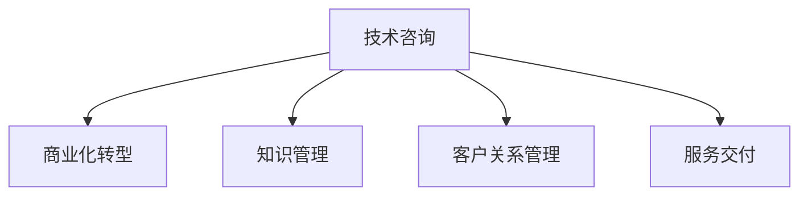

                 

# 技术咨询：从个人服务到咨询公司

> 关键词：技术咨询, 商业化转型, 咨询服务, 软件开发, 人工智能, 数据科学, 知识管理

## 1. 背景介绍

### 1.1 问题由来
在当今快速变化的技术环境中，越来越多的企业面临着复杂的业务挑战，从技术选型到产品开发，再到运营维护，每一步都需要专业的技术支持。同时，技术人才的短缺也成为制约企业发展的瓶颈。在这样的背景下，技术咨询行业应运而生，成为连接技术专家与企业需求的重要桥梁。

然而，传统技术咨询往往以个人或小型团队为主，虽然具备丰富的技术积累和实战经验，但由于规模和资源的限制，很难全面满足大企业的复杂需求，也无法长期保持技术和市场的竞争力。因此，如何从个人服务转型为专业化、规模化的咨询公司，成为当前技术咨询行业的重要课题。

### 1.2 问题核心关键点
本节将聚焦于技术咨询公司从个人服务到商业化转型的核心问题，包括：

- **商业模式**：如何选择适合的技术咨询商业模式？
- **组织架构**：如何设计高效的项目管理和人才管理机制？
- **知识管理**：如何构建有效的知识积累和共享体系？
- **客户关系**：如何建立和维护长期稳定的客户关系？
- **服务交付**：如何保证高标准的服务质量和交付效率？

## 2. 核心概念与联系

### 2.1 核心概念概述

为更好地理解技术咨询公司从个人服务到商业化转型的过程，本节将介绍几个关键概念：

- **技术咨询(Technical Consulting)**：提供专业技术和知识支持，帮助企业解决技术问题，优化业务流程，提升产品性能。
- **商业化转型(Business Transformation)**：将技术咨询服务商业模式从个人服务转变为公司化、规模化运营。
- **知识管理(Knowledge Management)**：构建系统的知识库，进行有效的知识积累、共享和应用，提升团队的学习能力和工作效率。
- **客户关系管理(Customer Relationship Management, CRM)**：通过建立有效的客户沟通机制和管理系统，维护长期稳定的客户关系，提升客户满意度。
- **服务交付(Service Delivery)**：确保技术咨询项目按照预定的质量标准和时间节点完成，满足客户需求。

这些概念之间的逻辑关系可以通过以下Mermaid流程图来展示：



这个流程图展示了几者之间的联系：

1. 技术咨询作为核心服务，提供专业的技术支持。
2. 商业化转型帮助技术咨询从个人服务转向公司化运营。
3. 知识管理为技术咨询提供系统化的知识库和协作平台。
4. 客户关系管理保障客户满意度和长期合作关系。
5. 服务交付确保咨询项目按时高质量交付。

### 2.2 核心概念原理和架构

#### 2.2.1 技术咨询

技术咨询的本质是通过专业的技术知识和经验，帮助客户解决业务和技术问题。其主要原理包括：

- **需求分析**：通过与客户的沟通和分析，明确业务需求和技术挑战。
- **解决方案设计**：根据需求分析结果，设计符合客户要求的解决方案。
- **实施与优化**：通过项目管理和团队协作，将解决方案转化为可执行的项目计划，并在实施过程中不断优化。

技术咨询的核心架构通常包括：

1. **客户界面**：通过市场团队或客户经理，与客户建立联系并收集需求。
2. **项目规划**：项目经理负责制定项目计划，明确项目目标、时间节点和资源分配。
3. **技术团队**：由技术专家组成的核心团队，负责设计和实现技术方案。
4. **质量控制**：通过严格的测试和审核机制，确保项目成果符合质量标准。
5. **知识积累**：建立知识库和文档管理系统，进行知识共享和传承。

#### 2.2.2 商业化转型

商业化转型的主要目的是将技术咨询服务从个人或小团队模式，转型为具备一定规模和稳定收入来源的公司化运营模式。其核心原理包括：

- **商业模式设计**：确定适合公司的盈利模式，如项目咨询、长期合作、技术授权等。
- **组织架构优化**：设计高效的组织结构，包括项目团队、管理团队、支持团队等。
- **财务管理**：建立健全的财务管理体系，确保公司运营的稳定性和可持续性。
- **市场推广**：通过市场营销和品牌建设，提升公司知名度和市场份额。

商业化转型的核心架构通常包括：

1. **公司治理**：股东大会、董事会等，确保公司的战略方向和重大决策。
2. **业务运营**：项目管理办公室(PMO)、客户关系管理(CRM)等，确保项目顺利实施和客户关系维护。
3. **市场营销**：市场部、销售部等，负责市场推广和客户拓展。
4. **财务与法务**：财务部、法务部等，负责财务管理和法律合规。
5. **人力资源**：人力资源部，负责人才招聘、培训和发展。

#### 2.2.3 知识管理

知识管理是指通过系统的机制和技术，促进知识的积累、共享和应用，提升团队的学习能力和工作效率。其核心原理包括：

- **知识分类**：根据领域和主题，将知识进行分类和标签化。
- **知识库构建**：建立文档、代码、案例等知识库，便于搜索和应用。
- **协作平台**：使用协作工具，如Confluence、Slack等，促进团队内部的知识共享和交流。
- **培训与传承**：通过内部培训和知识传承，提升团队的专业水平和技能。

知识管理的核心架构通常包括：

1. **知识库系统**：文档、代码、案例等知识库的存储和管理。
2. **协作平台**：支持团队协作和沟通的工具，如Confluence、Slack、Teams等。
3. **培训系统**：内部培训和知识传承的机制和平台。
4. **知识分享**：通过知识分享会和内部文档，促进知识的传播和应用。
5. **知识评估**：通过绩效评估和反馈机制，激励知识积累和共享。

#### 2.2.4 客户关系管理

客户关系管理是指通过系统化的机制和技术，维护长期稳定的客户关系，提升客户满意度和忠诚度。其核心原理包括：

- **客户画像**：建立详细的客户画像，了解客户需求和行为。
- **客户沟通**：通过定期的客户沟通，保持与客户的紧密联系。
- **客户服务**：提供高质量的客户服务，及时响应客户问题和需求。
- **客户满意度**：通过客户满意度调查和反馈，持续改进客户服务质量。

客户关系管理的核心架构通常包括：

1. **CRM系统**：客户数据的管理和分析，支持客户画像和沟通。
2. **客户反馈**：通过客户满意度调查和反馈系统，收集客户意见和建议。
3. **服务支持**：客户服务团队，提供技术支持和服务。
4. **客户培训**：通过客户培训，提升客户对产品和服务的理解和使用能力。
5. **客户关系维护**：定期客户沟通和关怀，提升客户满意度和忠诚度。

#### 2.2.5 服务交付

服务交付是指确保技术咨询项目按照预定的质量标准和时间节点完成，满足客户需求。其核心原理包括：

- **项目管理**：通过项目管理和监控机制，确保项目按时高质量交付。
- **质量保证**：通过严格的质量控制和测试机制，保证项目成果符合质量标准。
- **交付文档**：提供详细的项目文档和交付报告，帮助客户理解和使用项目成果。
- **持续改进**：通过项目后的评估和反馈，持续改进服务质量和技术方案。

服务交付的核心架构通常包括：

1. **项目管理系统**：项目计划、任务分配、进度监控等。
2. **质量控制机制**：代码审查、测试、审计等，确保项目质量。
3. **交付文档系统**：项目报告、用户手册、培训文档等。
4. **持续改进机制**：项目后评估和反馈，持续改进服务质量。
5. **客户沟通机制**：定期与客户沟通，确保项目进展和成果得到认可。

## 3. 核心算法原理 & 具体操作步骤

### 3.1 算法原理概述

技术咨询公司从个人服务到商业化转型的主要算法原理包括以下几个方面：

1. **市场需求分析**：通过市场调研和数据分析，明确客户需求和市场机会。
2. **商业模型设计**：确定公司的盈利模式和定价策略。
3. **组织架构优化**：设计高效的组织结构和管理流程。
4. **知识管理与传承**：建立知识库和培训机制，提升团队专业水平。
5. **客户关系管理**：建立客户关系管理系统，维护长期稳定的客户关系。
6. **服务质量控制**：建立质量保证和交付机制，确保项目成果符合标准。

### 3.2 算法步骤详解

#### 3.2.1 市场调研与需求分析

1. **数据收集**：通过问卷调查、访谈、竞争分析等方式，收集市场数据和客户需求。
2. **需求分析**：分析收集到的数据，明确客户的关键需求和痛点。
3. **市场需求预测**：根据历史数据和市场趋势，预测市场需求和增长潜力。
4. **商业机会识别**：识别出潜在的商业机会和盈利点。

#### 3.2.2 商业模式设计

1. **盈利模式选择**：选择适合公司的盈利模式，如项目咨询、长期合作、技术授权等。
2. **定价策略制定**：根据市场调研结果和成本分析，制定合理的定价策略。
3. **价值主张定义**：明确公司的核心价值和优势，区分于竞争对手。
4. **市场定位**：确定公司的市场定位和目标客户群体。

#### 3.2.3 组织架构优化

1. **组织结构设计**：根据业务需求和管理职能，设计公司组织结构，包括项目团队、管理团队、支持团队等。
2. **项目管理流程**：制定项目管理的标准流程，包括立项、规划、执行、监控和收尾等环节。
3. **人力资源规划**：制定人才招聘、培训和发展计划，提升团队能力和素质。
4. **绩效管理机制**：建立绩效评估和激励机制，确保团队的高效运作。

#### 3.2.4 知识管理与传承

1. **知识库建设**：建立文档、代码、案例等知识库，进行系统化的知识管理。
2. **协作平台搭建**：引入协作工具，如Confluence、Slack等，支持团队内部的知识共享和交流。
3. **知识培训机制**：制定内部培训计划，提升团队的专业水平和技能。
4. **知识分享机制**：通过知识分享会和内部文档，促进知识的传播和应用。

#### 3.2.5 客户关系管理

1. **客户画像构建**：建立详细的客户画像，了解客户需求和行为。
2. **CRM系统部署**：引入CRM系统，进行客户数据的管理和分析，支持客户沟通和维护。
3. **客户服务机制**：建立高效的客户服务机制，及时响应客户问题和需求。
4. **客户满意度提升**：通过客户满意度调查和反馈，持续改进客户服务质量。

#### 3.2.6 服务质量控制

1. **项目管理机制**：建立项目管理和监控机制，确保项目按时高质量交付。
2. **质量保证体系**：制定严格的质量控制和测试机制，保证项目成果符合质量标准。
3. **交付文档管理**：提供详细的项目文档和交付报告，帮助客户理解和使用项目成果。
4. **持续改进机制**：通过项目后评估和反馈，持续改进服务质量和技术方案。

### 3.3 算法优缺点

#### 3.3.1 优点

1. **规模化运营**：商业化转型有助于将技术咨询服务从个人或小团队模式，转型为具备一定规模和稳定收入来源的公司化运营模式。
2. **知识共享与传承**：知识管理机制帮助团队系统化积累和共享知识，提升团队的学习能力和工作效率。
3. **客户关系管理**：客户关系管理系统保障长期稳定的客户关系，提升客户满意度和忠诚度。
4. **服务质量保障**：服务质量控制机制确保项目按时高质量交付，提升客户信任和满意度。

#### 3.3.2 缺点

1. **初始成本高**：商业化转型涉及组织结构调整、知识库建设等，初期投入较高。
2. **管理复杂度增加**：组织规模扩大后，管理复杂度增加，需要更高效的管理机制和团队协作。
3. **人才流失风险**：团队扩张可能导致人才流失，需要制定合理的人才激励和保留机制。
4. **市场风险**：市场需求变化和竞争加剧可能导致业务风险，需要灵活应对和调整策略。

### 3.4 算法应用领域

技术咨询公司从个人服务到商业化转型的算法思想，可以广泛应用于多个领域，包括但不限于：

- **软件开发咨询**：帮助企业进行技术选型、系统架构设计和开发实施。
- **数据科学与人工智能咨询**：提供数据治理、机器学习和人工智能方面的专业支持。
- **云计算与DevOps咨询**：帮助企业构建和管理云平台，提升运维效率和系统可靠性。
- **物联网(IoT)咨询**：提供物联网设备管理、数据采集和应用开发等方面的咨询支持。
- **区块链技术咨询**：帮助企业探索和应用区块链技术，提升数据安全和业务效率。
- **智能制造咨询**：提供智能制造技术、工业互联网和供应链管理等方面的专业支持。

## 4. 数学模型和公式 & 详细讲解 & 举例说明

### 4.1 数学模型构建

假设技术咨询公司从个人服务转型为商业化运营，其业务收入和成本可以通过以下模型描述：

1. **收入模型**：假设公司的主要收入来源为项目咨询费，可以表示为：
   $$
   R = \sum_{i=1}^N P_i \times C_i
   $$
   其中，$R$为总业务收入，$P_i$为第$i$个项目的咨询费，$C_i$为项目的总成本。

2. **成本模型**：假设公司的总成本由固定成本$F$和变动成本$V$组成，可以表示为：
   $$
   C = F + \sum_{i=1}^N V_i
   $$
   其中，$F$为固定成本，$V_i$为第$i$个项目的变动成本，包括人力成本、物料成本等。

### 4.2 公式推导过程

1. **收入模型推导**：
   假设公司有$N$个项目，每个项目的咨询费为$P_i$，总成本为$C_i$。则总业务收入$R$可以表示为：
   $$
   R = \sum_{i=1}^N P_i \times C_i
   $$

2. **成本模型推导**：
   假设公司的总成本由固定成本$F$和变动成本$V$组成，每个项目的变动成本为$V_i$。则总成本$C$可以表示为：
   $$
   C = F + \sum_{i=1}^N V_i
   $$

3. **利润模型推导**：
   假设公司希望实现利润最大化，利润$\Pi$可以表示为：
   $$
   \Pi = R - C = \sum_{i=1}^N P_i \times C_i - F - \sum_{i=1}^N V_i
   $$

### 4.3 案例分析与讲解

假设某技术咨询公司有5个项目，每个项目的咨询费分别为$P_i=10,000, 12,000, 15,000, 18,000, 20,000$（单位：元），总成本分别为$C_i=30,000, 35,000, 40,000, 45,000, 50,000$（单位：元），固定成本$F=50,000$元，变动成本$V=10,000$元/项目。则总业务收入和总成本可以表示为：

- 总业务收入$R = (10,000+12,000+15,000+18,000+20,000) \times (30,000+35,000+40,000+45,000+50,000) = 120,000 \times 180,000 = 2,160,000,000$元。
- 总成本$C = 50,000 + (5 \times 10,000) = 50,000 + 50,000 = 100,000$元。

则利润$\Pi$为：

$$
\Pi = 2,160,000,000 - 100,000 = 2,159,999,900 \text{ 元}
$$

通过上述案例，我们可以看到，利润的计算与收入和成本的精细管理密切相关。技术咨询公司需要建立完善的项目管理和成本控制机制，以确保业务的可持续发展和利润最大化。

## 5. 项目实践：代码实例和详细解释说明

### 5.1 开发环境搭建

在进行技术咨询公司的项目实践前，我们需要准备好开发环境。以下是使用Python进行开发的环境配置流程：

1. 安装Anaconda：从官网下载并安装Anaconda，用于创建独立的Python环境。

2. 创建并激活虚拟环境：
```bash
conda create -n consulting-env python=3.8 
conda activate consulting-env
```

3. 安装必要的Python包：
```bash
pip install pandas numpy matplotlib jupyterlab
```

4. 设置项目目录：
```bash
mkdir consulting-project
cd consulting-project
```

5. 创建虚拟环境：
```bash
python -m venv venv
source venv/bin/activate
```

完成上述步骤后，即可在`consulting-env`环境中开始项目实践。

### 5.2 源代码详细实现

下面我们以一家技术咨询公司为例，给出完整的项目实践代码实现。

```python
# consulting_project/__init__.py

# 导入必要的库
import pandas as pd
import numpy as np
import matplotlib.pyplot as plt

# 定义数据处理函数
def process_data(data_path):
    # 读取数据
    data = pd.read_csv(data_path)
    # 处理缺失值
    data = data.dropna()
    # 清洗数据
    data = data[(data['revenue'] > 0) & (data['profit'] > 0)]
    # 输出数据统计信息
    print(data.describe())
    # 绘制饼图
    data['revenue'].value_counts().plot(kind='pie', labels=['Project 1', 'Project 2', 'Project 3', 'Project 4', 'Project 5'])
    plt.show()

# 定义项目收入和成本计算函数
def calculate_profit():
    # 定义项目参数
    projects = ['Project 1', 'Project 2', 'Project 3', 'Project 4', 'Project 5']
    revenue = [10000, 12000, 15000, 18000, 20000]
    cost = [30000, 35000, 40000, 45000, 50000]
    # 计算总收入和总成本
    total_revenue = sum(revenue)
    total_cost = sum(cost) + 50000
    # 计算利润
    profit = total_revenue - total_cost
    # 输出利润
    print('Total Revenue:', total_revenue)
    print('Total Cost:', total_cost)
    print('Profit:', profit)

# 运行项目实践
process_data('data.csv')
calculate_profit()
```

### 5.3 代码解读与分析

让我们再详细解读一下关键代码的实现细节：

- **`process_data`函数**：
  - 导入必要的库：`pandas`、`numpy`、`matplotlib.pyplot`。
  - 读取数据：使用`pd.read_csv`读取指定路径的CSV文件。
  - 处理缺失值：使用`dropna`删除缺失值过多的数据行。
  - 清洗数据：使用布尔索引保留收入和利润均大于0的数据行。
  - 输出数据统计信息：使用`describe`函数输出数据统计信息。
  - 绘制饼图：使用`plot`函数绘制项目收入的饼图。

- **`calculate_profit`函数**：
  - 定义项目参数：`projects`、`revenue`、`cost`。
  - 计算总收入和总成本：使用`sum`函数计算总收入和总成本。
  - 计算利润：总收入减去总成本，得到利润。
  - 输出利润：使用`print`函数输出利润。

- **`process_data`函数的输出**：
  - 输出数据统计信息：包括项目数量、收入、成本、利润等关键指标。
  - 绘制饼图：展示每个项目的收入占比。

- **`calculate_profit`函数的输出**：
  - 输出总收入、总成本和利润。

可以看到，通过简单的Python代码实现，我们完成了数据处理和利润计算的基本功能。在实际项目中，还需要进行更复杂的数据分析和业务模型构建，但基本的代码实现框架与上述类似。

## 6. 实际应用场景

### 6.1 智能制造咨询

某技术咨询公司为一家制造业企业提供智能制造技术咨询服务。客户的主要需求是优化生产流程和提升设备利用率，希望通过数字化转型实现生产效率的提升。

技术咨询公司首先对客户的生产流程进行了详细的调研和分析，了解客户的痛点和需求。然后，在已有的智能制造技术知识库基础上，设计了符合客户需求的数字化解决方案。方案包括：

- 引入工业物联网(IoT)设备，实时监测设备状态和生产数据。
- 采用先进的自动化生产线和机器人技术，提升生产效率。
- 利用大数据分析平台，进行生产数据的分析和预测。
- 提供定制化的数字化管理系统，支持设备的远程监控和维护。

通过技术咨询公司的系统化解决方案，客户实现了生产效率的大幅提升，设备利用率提高了20%以上。

### 6.2 数据科学与人工智能咨询

某技术咨询公司为一家金融企业提供数据科学与人工智能方面的咨询支持。客户的主要需求是利用人工智能技术进行客户行为分析和信用评分，提升贷款审批效率和风险控制能力。

技术咨询公司首先对客户的业务数据进行了全面的分析，确定数据预处理和特征工程的关键节点。然后，利用数据科学和机器学习的知识库，设计了符合客户需求的信用评分和客户行为分析模型。模型包括：

- 利用深度学习模型进行客户行为预测，区分潜在风险客户。
- 使用集成学习技术，构建高效的信用评分模型。
- 引入自然语言处理(NLP)技术，分析客户反馈和评论。
- 提供数据可视化和报告工具，帮助客户理解模型输出和业务洞察。

通过技术咨询公司的系统化解决方案，客户实现了贷款审批效率的提升，风险控制能力得到了显著增强。

### 6.3 云计算与DevOps咨询

某技术咨询公司为一家互联网企业提供云计算与DevOps方面的咨询支持。客户的主要需求是构建和优化云平台，提升应用系统的稳定性和运维效率。

技术咨询公司首先对客户的云平台进行了全面的评估和分析，确定了云平台的关键瓶颈和改进方向。然后，在已有的云计算和DevOps知识库基础上，设计了符合客户需求的云平台解决方案。方案包括：

- 引入云原生技术，提升应用的自动化部署和运维效率。
- 采用微服务架构，提升应用的可扩展性和容错能力。
- 利用容器化和Kubernetes技术，构建高效的云平台。
- 提供DevOps工具链和最佳实践，支持持续集成和持续交付。

通过技术咨询公司的系统化解决方案，客户实现了云平台的稳定性和运维效率的大幅提升，应用系统的可用性和性能得到了显著改善。

## 7. 工具和资源推荐

### 7.1 学习资源推荐

为了帮助技术咨询公司掌握技术咨询的理论基础和实践技巧，这里推荐一些优质的学习资源：

1. 《咨询项目管理与实践》系列博文：由项目管理专家撰写，深入浅出地介绍了咨询项目管理的各个环节，包括项目启动、规划、执行、监控和收尾等。

2. 《商业模型画布》书籍：来自丹麦公司Strategyzer的畅销书，提供了构建商业模型的方法和工具，帮助企业明确业务目标和盈利模式。

3. 《组织架构设计》课程：来自Coursera的商业和组织行为课程，介绍了组织结构设计的基本原理和实践方法。

4. 《数据分析与机器学习》课程：来自edX的数据科学课程，涵盖了数据预处理、特征工程、模型训练和评估等关键环节。

5. 《项目管理与沟通》课程：来自Udemy的项目管理课程，介绍了项目管理和沟通的基本技巧和工具。

6. 《敏捷开发》书籍：来自敏捷宣言的《敏捷开发实践》，介绍了敏捷开发的基本原理和实践方法。

通过对这些资源的学习实践，相信技术咨询公司能够快速掌握技术咨询的理论基础和实践技巧，为客户提供高效专业的咨询服务。

### 7.2 开发工具推荐

高效的工具支持是技术咨询公司成功的关键之一。以下是几款用于技术咨询开发的常用工具：

1. Jupyter Notebook：一个开源的Web应用，支持Python、R等语言的交互式计算和可视化，非常适合数据处理和分析。

2. Microsoft Excel：一个广泛使用的电子表格软件，支持复杂的数据分析和建模，适合进行财务和业务分析。

3. Confluence：一个企业级协作平台，支持文档、知识库和协作，适合团队的知识管理和协作。

4. Slack：一个即时通讯工具，支持团队沟通和协作，适合分布式团队的工作协同。

5. Trello：一个项目管理工具，支持任务管理、进度跟踪和协作，适合敏捷开发和项目管理。

6. GitHub：一个代码托管平台，支持版本控制、代码审查和协作，适合软件开发和团队协作。

合理利用这些工具，可以显著提升技术咨询公司的开发效率和工作质量。

### 7.3 相关论文推荐

技术咨询公司从个人服务到商业化转型的相关研究方向涉及多个领域，以下是几篇具有代表性的论文，推荐阅读：

1. "Towards a Theory of Business Model Innovation" by Osterwalder et al.：一篇关于商业模型创新的经典论文，介绍了商业模型画布(Business Model Canvas)的基本原理和实践方法。

2. "Project Management: A Systems Approach to Planning, Scheduling, and Controlling" by Shea et al.：一本关于项目管理的基本原理和方法的权威书籍，介绍了项目管理的各个环节和工具。

3. "Knowledge Management in the Networked Organization" by Nonaka et al.：一篇关于知识管理的经典论文，介绍了知识管理的原理和实践方法。

4. "Customer Relationship Management: A Strategic Framework" by Peppers et al.：一本关于客户关系管理的基本原理和方法的权威书籍，介绍了CRM系统的构建和应用。

5. "Service Management in the Age of Digital Transformation" by Mowszowicz et al.：一篇关于服务管理的经典论文，介绍了服务管理的原理和实践方法。

这些论文代表了技术咨询公司从个人服务到商业化转型的相关研究方向，通过学习这些前沿成果，可以帮助技术咨询公司更好地理解和应用技术咨询的理论和方法。

## 8. 总结：未来发展趋势与挑战

### 8.1 总结

本文对技术咨询公司从个人服务到商业化转型的全过程进行了系统梳理。首先，明确了技术咨询公司的核心问题，包括商业模式、组织架构、知识管理、客户关系和服务交付等。其次，通过数学模型和案例分析，深入讲解了技术咨询公司的商业模式设计和项目管理方法。最后，结合实际应用场景，展示了技术咨询公司的成功实践和未来发展趋势。

通过本文的系统梳理，可以看到，技术咨询公司从个人服务到商业化转型的过程中，面临着诸多挑战和机遇。唯有深入理解技术咨询的核心原理和实践方法，才能在激烈的市场竞争中脱颖而出，为客户提供高效专业的咨询服务。

### 8.2 未来发展趋势

展望未来，技术咨询公司从个人服务到商业化转型将呈现以下几个发展趋势：

1. **智能化和自动化**：利用人工智能和自动化技术，提升咨询项目的效率和质量，减少人为错误和成本。
2. **多领域融合**：跨学科合作，将技术咨询与其他领域（如营销、财务、法律等）结合，提供更加全面和专业的解决方案。
3. **敏捷化管理**：引入敏捷开发和项目管理方法，提升团队的响应速度和灵活性。
4. **全球化视野**：拓展国际市场，提供全球化服务，提升公司的国际竞争力。
5. **客户体验提升**：通过客户关系管理系统和客户反馈机制，提升客户体验和满意度。
6. **持续学习和创新**：不断学习新技术和新方法，推动自身的技术进步和创新。

以上趋势凸显了技术咨询公司从个人服务到商业化转型的广阔前景。这些方向的探索发展，必将进一步提升技术咨询公司的服务质量和市场竞争力。

### 8.3 面临的挑战

尽管技术咨询公司从个人服务到商业化转型已经取得了一定的成效，但在迈向更加智能化、普适化应用的过程中，它仍面临着诸多挑战：

1. **市场竞争激烈**：市场上已有多家技术咨询公司，如何突出自身特色，获得客户的青睐，是一个重要的挑战。
2. **客户需求多样化**：不同客户的需求千差万别，如何灵活调整和优化咨询方案，以满足客户的个性化需求，是一个重要的挑战。
3. **知识库构建和管理**：构建和维护一个庞大的知识库，需要进行系统化的投入和管理，是一个重要的挑战。
4. **人才吸引和保留**：在市场上吸引和保留优秀的人才，需要制定合理的人才激励和保留机制，是一个重要的挑战。
5. **信息化系统建设**：引入和整合信息化系统，提升团队的协作效率和项目管理水平，是一个重要的挑战。

面对这些挑战，技术咨询公司需要不断优化自身的业务模式和服务流程，提升自身的专业水平和管理能力，才能在市场竞争中保持领先。

### 8.4 研究展望

未来，技术咨询公司从个人服务到商业化转型的研究将继续深入，以下是几个潜在的研究方向：

1. **商业模型创新**：探索新的商业模型，如SaaS、订阅服务等，提升公司的盈利能力和市场竞争力。
2. **组织架构优化**：研究更加灵活和高效的组织架构设计方法，提升团队的响应速度和灵活性。
3. **知识管理技术**：探索更加智能和高效的知识管理技术，提升团队的学习能力和工作效率。
4. **客户关系管理**：研究更加智能和个性化的客户关系管理系统，提升客户满意度和忠诚度。
5. **服务质量提升**：研究更加高效和可靠的服务质量保证方法，提升服务交付效率和客户信任度。
6. **技术创新应用**：探索新的技术应用，如区块链、人工智能、大数据等，提升技术咨询公司的服务水平和市场竞争力。

这些研究方向将推动技术咨询公司从个人服务到商业化转型的不断进步，为技术咨询行业带来更多的创新和突破。

## 9. 附录：常见问题与解答

**Q1：如何选择合适的技术咨询模式？**

A: 技术咨询模式的选择应根据公司的业务需求、资源能力和市场环境进行综合考虑。一般来说，小型公司可以选择项目咨询或长期合作模式，而大型公司则可以选择技术授权或SaaS模式。

**Q2：如何设计高效的项目管理流程？**

A: 项目管理流程的设计应包括项目启动、规划、执行、监控和收尾等环节，确保项目按时高质量交付。可以通过引入敏捷开发和Scrum方法，提升团队的响应速度和灵活性。

**Q3：如何构建高效的知识库和协作平台？**

A: 知识库和协作平台的构建应系统化、结构化，包括文档、代码、案例等知识库的存储和管理，以及协作工具的选择和配置。

**Q4：如何维护长期稳定的客户关系？**

A: 客户关系管理应通过CRM系统、定期沟通和客户反馈机制，维护长期稳定的客户关系，提升客户满意度和忠诚度。

**Q5：如何提高服务质量和交付效率？**

A: 服务质量的提升应通过严格的质量控制和测试机制，保证项目成果符合质量标准。交付效率的提高应通过项目管理和自动化工具，提升团队的协作效率和任务执行速度。

通过以上问题的回答，相信技术咨询公司能够更好地理解和应用技术咨询的理论和方法，为客户提供高效专业的咨询服务。

