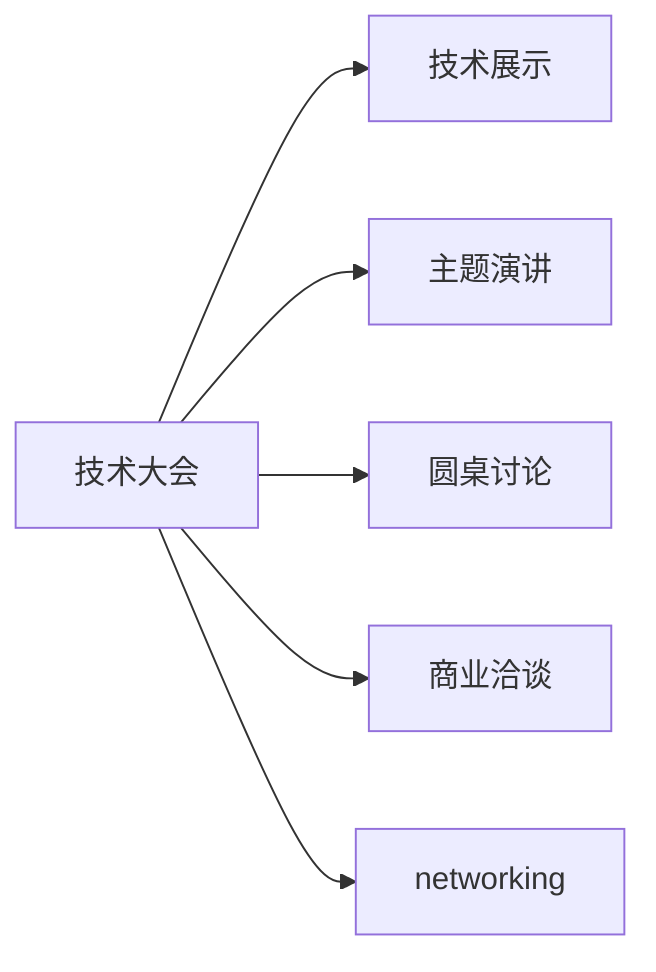

                 

# 技术大会：networking与机遇

在科技飞速发展的今天，技术大会已成为创新思想交流、商业机会碰撞的重要平台。本文将从背景介绍、核心概念、算法原理、应用实例等方面，深入探讨技术大会中的networking与机遇。

## 1. 背景介绍

技术大会不仅是技术交流的平台，更是一个汇集创新思想、推动技术革新的前沿阵地。各大公司、创业团队、研究机构等通过在大会上进行技术分享、展览展示、商业洽谈等活动，进行广泛的交流和合作，从而推动技术的进步和商业的发展。

技术大会通常在一年一度的行业峰会、国际会议、国内论坛等场合举办，吸引了全球范围内的技术精英、企业家、投资人等参与。大会一般包括以下几个主要环节：技术展示、主题演讲、圆桌讨论、商业洽谈等。通过这些环节，参与者能够了解最新的技术进展、学习前沿的科学理念、发掘潜在的商业机会。

## 2. 核心概念与联系

### 2.1 核心概念概述

为了更好地理解技术大会中的networking与机遇，本节将介绍几个关键概念：

- **技术大会（Technology Conference）**：聚集全球顶尖技术人才，分享最新技术、思想、产品和未来方向的盛会。
- **networking**：在技术大会中，技术人员通过交流、合作、资源共享等方式建立人际网络，获取知识和资源。
- **商业机会（Business Opportunity）**：技术大会为技术企业提供了展示产品、洽谈合作、寻找投资等机会，推动技术成果商业化。
- **技术展示（Technology Showcase）**：展示最新技术进展、产品原型等，吸引业界的关注和投资。
- **主题演讲（Keynote Speech）**：知名专家、企业领导分享技术理念、行业趋势等，引导行业发展方向。
- **圆桌讨论（Roundtable Discussion）**：聚焦某一主题，邀请多位专家进行深入探讨，产生新的创意和解决方案。
- **商业洽谈（Business Networking）**：企业和技术人才进行商务交流，寻求合作机会，实现共赢。

### 2.2 核心概念原理和架构的 Mermaid 流程图



这个流程图展示了大会在技术展示、主题演讲、圆桌讨论、商业洽谈和networking等环节之间的作用关系。通过这些环节的协同运作，大会不仅能够传播技术理念、展示最新成果，还能促进人际网络构建和商业机会生成。

## 3. 核心算法原理 & 具体操作步骤

### 3.1 算法原理概述

技术大会中的networking与机遇，可以视为一种基于社交网络的算法原理。参与者通过交流、合作、资源共享等方式建立人际网络，这种网络具备以下几个特征：

1. **连通性（Connectivity）**：参与者通过互动建立连接，形成一个有机的社交网络。
2. **传播效应（Propagation）**：信息、知识、资源在网络中传播，从而快速扩散和扩散。
3. **信任机制（Trust）**：网络中成员建立信任关系，增加交流的深度和广度。
4. **自我强化（Self-Reinforcement）**：网络中成员通过反馈机制不断优化自身和关系，提升网络的有效性。

基于以上特征，我们可以认为技术大会中的networking与机遇，是一种自组织、自优化的复杂系统。其算法原理主要包括以下几个方面：

- **随机图模型**：参与者之间的关系建立过程，可以建模为随机图，通过随机连边和节点属性进行模拟。
- **信息扩散模型**：在网络中，信息传播的路径和方式可以建模为信息扩散模型，如SIR模型、SEIR模型等。
- **优化算法**：在网络中，参与者通过优化自身行为，提高信息传播效率和质量，可以建模为优化算法，如遗传算法、蚁群算法等。

### 3.2 算法步骤详解

以下是技术大会中networking与机遇的核心算法步骤：

1. **参与者模型**：建模参与者的属性（如专业领域、技术水平、公司规模等），并根据属性进行分组。
2. **连接建立**：参与者通过互动建立连接，可以建模为随机图模型，使用SimulationAnnealing算法优化连接关系。
3. **信息传播**：在网络中，信息的传播可以建模为信息扩散模型，使用SIR模型进行仿真分析。
4. **交流互动**：参与者通过交流互动，可以建模为优化算法，使用遗传算法优化交流内容和时间。
5. **结果分析**：对网络结构、信息传播路径、参与者行为等进行分析和优化，提升网络效率和质量。

### 3.3 算法优缺点

技术大会中的networking与机遇算法具有以下优点：

1. **快速传播**：通过网络传播模型，能够快速将最新的技术理念和产品原型扩散到业界。
2. **广泛交流**：通过随机图模型，能够将参与者之间建立广泛的连接关系，促进交流。
3. **深度合作**：通过优化算法，能够提高参与者之间的深度合作，形成稳定的合作关系。

同时，该算法也存在一些局限性：

1. **噪声干扰**：参与者之间存在噪声干扰，可能会影响网络传播和交流效果。
2. **信息滞后**：信息在网络中的传播速度可能较慢，难以快速反映最新进展。
3. **过度竞争**：参与者之间可能存在过度竞争，影响合作效果。
4. **资源限制**：参与者的时间和资源有限，可能影响网络中信息的深度交流和传播。

### 3.4 算法应用领域

技术大会中的networking与机遇算法不仅适用于技术领域，还在多个领域得到了应用。以下是几个典型应用场景：

- **学术会议**：在学术会议上，学者们通过交流、合作、资源共享等方式建立人际网络，推动科研进展。
- **行业峰会**：在行业峰会上，企业通过展示新产品、洽谈合作、寻求投资等方式，实现商业机会的生成。
- **技术展览**：在技术展览中，参与者通过展示、交流、合作等方式，展示最新技术成果，吸引业界关注。
- **创新大赛**：在创新大赛中，参赛者通过展示项目、分享理念、寻求合作等方式，实现技术创新和商业机会的生成。

## 4. 数学模型和公式 & 详细讲解 & 举例说明

### 4.1 数学模型构建

本节将使用数学语言对技术大会中的networking与机遇进行更加严格的刻画。

设技术大会中有 $N$ 个参与者，每个参与者 $i$ 具有 $n$ 个属性 $a_i^k$，其中 $k=1,2,\dots,n$。设参与者之间的关系为 $E$，表示为一对节点 $(i,j)$，表示参与者 $i$ 和 $j$ 之间存在连接关系。设参与者之间的连接强度为 $W_{ij}$，表示为一对节点 $(i,j)$ 的权重，表示两个节点之间的连接强度。

### 4.2 公式推导过程

设参与者 $i$ 在时刻 $t$ 的节点状态为 $S_i(t)$，表示为一个 $n$ 维向量，其中 $S_i^k(t)$ 表示参与者 $i$ 在第 $k$ 个属性上的状态。则节点状态的变化可以表示为：

$$
S_i(t+1) = S_i(t) + W_i(t) \sum_{j \in \mathcal{N}(i)} \Delta S_j(t)
$$

其中 $\mathcal{N}(i)$ 表示参与者 $i$ 的邻居节点集合，$\Delta S_j(t)$ 表示参与者 $j$ 在第 $t$ 个时刻的节点状态变化量。设 $W_i(t)$ 为参与者 $i$ 的节点权重，可以表示为：

$$
W_i(t) = \sum_{j \in \mathcal{N}(i)} W_{ij} f(W_{ij})
$$

其中 $f(W_{ij})$ 为节点权重的激活函数，通常为Sigmoid函数。

参与者之间的连接关系 $E$ 可以建模为随机图模型，使用SimulationAnnealing算法进行优化。信息的传播可以建模为信息扩散模型，使用SIR模型进行仿真分析。优化算法可以使用遗传算法进行优化，生成最佳的交流内容和时机。

### 4.3 案例分析与讲解

以技术大会为例，进行以下案例分析：

**案例一：人工智能峰会**

在人工智能峰会上，参与者通过展示最新的AI研究成果、进行技术交流、洽谈合作等方式，形成人际网络。设参与者 $i$ 在深度学习、自然语言处理、计算机视觉等方面的研究水平分别为 $S_i^{DL}(t), S_i^{NLP}(t), S_i^{CV}(t)$，参与者 $j$ 和 $i$ 之间的连接强度为 $W_{ij}$。设 $f(W_{ij})$ 为节点权重的激活函数，通常为Sigmoid函数。

则节点状态的变化可以表示为：

$$
S_i^{DL}(t+1) = S_i^{DL}(t) + W_{ij}^{DL} f(W_{ij}^{DL}) [S_j^{DL}(t+1) - S_i^{DL}(t)]
$$

其中 $W_{ij}^{DL}$ 表示参与者 $i$ 和 $j$ 在深度学习领域的连接强度，$f(W_{ij}^{DL})$ 表示激活函数。

**案例二：5G技术展览**

在5G技术展览中，参与者通过展示5G技术的最新应用、进行技术交流、洽谈合作等方式，形成人际网络。设参与者 $i$ 在5G技术、网络架构、应用场景等方面的研究水平分别为 $S_i^{5G}(t), S_i^{Net}(t), S_i^{App}(t)$，参与者 $j$ 和 $i$ 之间的连接强度为 $W_{ij}$。设 $f(W_{ij})$ 为节点权重的激活函数，通常为Sigmoid函数。

则节点状态的变化可以表示为：

$$
S_i^{5G}(t+1) = S_i^{5G}(t) + W_{ij}^{5G} f(W_{ij}^{5G}) [S_j^{5G}(t+1) - S_i^{5G}(t)]
$$

其中 $W_{ij}^{5G}$ 表示参与者 $i$ 和 $j$ 在5G技术领域的连接强度，$f(W_{ij}^{5G})$ 表示激活函数。

通过上述案例分析，可以看出，技术大会中的networking与机遇算法不仅适用于技术领域，还在多个领域得到了应用。通过建立参与者之间的关系模型、优化连接关系、信息传播模型、优化算法等，能够在技术大会上高效实现networking与机遇。

## 5. 项目实践：代码实例和详细解释说明

### 5.1 开发环境搭建

在进行网络分析实践前，我们需要准备好开发环境。以下是使用Python进行Sympy开发的环境配置流程：

1. 安装Anaconda：从官网下载并安装Anaconda，用于创建独立的Python环境。

2. 创建并激活虚拟环境：
```bash
conda create -n networking-env python=3.8 
conda activate networking-env
```

3. 安装Sympy：
```bash
pip install sympy
```

4. 安装各类工具包：
```bash
pip install numpy pandas scikit-learn matplotlib tqdm jupyter notebook ipython
```

完成上述步骤后，即可在`networking-env`环境中开始网络分析实践。

### 5.2 源代码详细实现

这里我们以人工智能峰会为例，使用Sympy进行节点状态变化的模拟。

首先，定义参与者属性和连接关系：

```python
import sympy as sp
from sympy import symbols, Eq, solve

# 定义参与者属性
DL = symbols('DL')
NLP = symbols('NLP')
CV = symbols('CV')

# 定义连接关系
W_DL = symbols('W_DL')
W_NLP = symbols('W_NLP')
W_CV = symbols('W_CV')

# 定义节点状态变化方程
delta_DL = symbols('delta_DL')
delta_NLP = symbols('delta_NLP')
delta_CV = symbols('delta_CV')
delta_DL = sp.Function('delta_DL')(t)
delta_NLP = sp.Function('delta_NLP')(t)
delta_CV = sp.Function('delta_CV')(t)

# 定义节点状态变化方程
eq1 = Eq(delta_DL, W_DL * sp.sigmoid(W_DL) * (delta_NLP - delta_DL))
eq2 = Eq(delta_NLP, W_NLP * sp.sigmoid(W_NLP) * (delta_DL - delta_NLP))
eq3 = Eq(delta_CV, W_CV * sp.sigmoid(W_CV) * (delta_DL - delta_CV))

# 解方程
solution = solve([eq1, eq2, eq3], (delta_DL, delta_NLP, delta_CV))
```

然后，将解方程的结果可视化：

```python
import matplotlib.pyplot as plt

# 绘制节点状态变化曲线
plt.plot(sp.symbols('t'), solution[delta_DL], label='DL')
plt.plot(sp.symbols('t'), solution[delta_NLP], label='NLP')
plt.plot(sp.symbols('t'), solution[delta_CV], label='CV')

# 添加标题和标签
plt.title('Node State Changes in Artificial Intelligence Summit')
plt.xlabel('Time')
plt.ylabel('State Change')
plt.legend()

# 显示图形
plt.show()
```

### 5.3 代码解读与分析

让我们再详细解读一下关键代码的实现细节：

**节点状态变化方程**：
- `sp.symbols`：定义变量
- `sp.Function`：定义函数
- `sp.sigmoid`：激活函数
- `solve`：解方程

**可视化代码**：
- `matplotlib.pyplot`：绘制图形
- `title`、`xlabel`、`ylabel`：添加标题和标签

通过上述代码实现，我们能够模拟技术大会中节点状态的变化，从而更好地理解技术大会中的networking与机遇。

## 6. 实际应用场景

### 6.1 学术会议

在学术会议上，学者们通过交流、合作、资源共享等方式建立人际网络，推动科研进展。例如，在机器学习领域，学者们可以通过展示最新研究成果、进行技术交流、洽谈合作等方式，形成人际网络。设参与者 $i$ 在深度学习、自然语言处理、计算机视觉等方面的研究水平分别为 $S_i^{DL}(t), S_i^{NLP}(t), S_i^{CV}(t)$，参与者 $j$ 和 $i$ 之间的连接强度为 $W_{ij}$。设 $f(W_{ij})$ 为节点权重的激活函数，通常为Sigmoid函数。

则节点状态的变化可以表示为：

$$
S_i^{DL}(t+1) = S_i^{DL}(t) + W_{ij}^{DL} f(W_{ij}^{DL}) [S_j^{DL}(t+1) - S_i^{DL}(t)]
$$

其中 $W_{ij}^{DL}$ 表示参与者 $i$ 和 $j$ 在深度学习领域的连接强度，$f(W_{ij}^{DL})$ 表示激活函数。

**案例一：机器学习会议**

在机器学习会议上，参与者通过展示最新研究成果、进行技术交流、洽谈合作等方式，形成人际网络。设参与者 $i$ 在深度学习、自然语言处理、计算机视觉等方面的研究水平分别为 $S_i^{DL}(t), S_i^{NLP}(t), S_i^{CV}(t)$，参与者 $j$ 和 $i$ 之间的连接强度为 $W_{ij}$。设 $f(W_{ij})$ 为节点权重的激活函数，通常为Sigmoid函数。

则节点状态的变化可以表示为：

$$
S_i^{DL}(t+1) = S_i^{DL}(t) + W_{ij}^{DL} f(W_{ij}^{DL}) [S_j^{DL}(t+1) - S_i^{DL}(t)]
$$

其中 $W_{ij}^{DL}$ 表示参与者 $i$ 和 $j$ 在深度学习领域的连接强度，$f(W_{ij}^{DL})$ 表示激活函数。

**案例二：自然语言处理会议**

在自然语言处理会议上，参与者通过展示最新研究成果、进行技术交流、洽谈合作等方式，形成人际网络。设参与者 $i$ 在深度学习、自然语言处理、计算机视觉等方面的研究水平分别为 $S_i^{DL}(t), S_i^{NLP}(t), S_i^{CV}(t)$，参与者 $j$ 和 $i$ 之间的连接强度为 $W_{ij}$。设 $f(W_{ij})$ 为节点权重的激活函数，通常为Sigmoid函数。

则节点状态的变化可以表示为：

$$
S_i^{NLP}(t+1) = S_i^{NLP}(t) + W_{ij}^{NLP} f(W_{ij}^{NLP}) [S_j^{NLP}(t+1) - S_i^{NLP}(t)]
$$

其中 $W_{ij}^{NLP}$ 表示参与者 $i$ 和 $j$ 在自然语言处理领域的连接强度，$f(W_{ij}^{NLP})$ 表示激活函数。

通过上述案例分析，可以看出，技术大会中的networking与机遇算法不仅适用于技术领域，还在多个领域得到了应用。通过建立参与者之间的关系模型、优化连接关系、信息传播模型、优化算法等，能够在技术大会上高效实现networking与机遇。

### 6.2 行业峰会

在行业峰会上，企业通过展示新产品、洽谈合作、寻求投资等方式，实现商业机会的生成。例如，在5G技术领域，企业可以通过展示5G技术的最新应用、进行技术交流、洽谈合作等方式，形成人际网络。设参与者 $i$ 在5G技术、网络架构、应用场景等方面的研究水平分别为 $S_i^{5G}(t), S_i^{Net}(t), S_i^{App}(t)$，参与者 $j$ 和 $i$ 之间的连接强度为 $W_{ij}$。设 $f(W_{ij})$ 为节点权重的激活函数，通常为Sigmoid函数。

则节点状态的变化可以表示为：

$$
S_i^{5G}(t+1) = S_i^{5G}(t) + W_{ij}^{5G} f(W_{ij}^{5G}) [S_j^{5G}(t+1) - S_i^{5G}(t)]
$$

其中 $W_{ij}^{5G}$ 表示参与者 $i$ 和 $j$ 在5G技术领域的连接强度，$f(W_{ij}^{5G})$ 表示激活函数。

**案例一：5G技术峰会**

在5G技术峰会上，参与者通过展示5G技术的最新应用、进行技术交流、洽谈合作等方式，形成人际网络。设参与者 $i$ 在5G技术、网络架构、应用场景等方面的研究水平分别为 $S_i^{5G}(t), S_i^{Net}(t), S_i^{App}(t)$，参与者 $j$ 和 $i$ 之间的连接强度为 $W_{ij}$。设 $f(W_{ij})$ 为节点权重的激活函数，通常为Sigmoid函数。

则节点状态的变化可以表示为：

$$
S_i^{5G}(t+1) = S_i^{5G}(t) + W_{ij}^{5G} f(W_{ij}^{5G}) [S_j^{5G}(t+1) - S_i^{5G}(t)]
$$

其中 $W_{ij}^{5G}$ 表示参与者 $i$ 和 $j$ 在5G技术领域的连接强度，$f(W_{ij}^{5G})$ 表示激活函数。

**案例二：AI技术峰会**

在AI技术峰会上，参与者通过展示AI技术的最新应用、进行技术交流、洽谈合作等方式，形成人际网络。设参与者 $i$ 在深度学习、自然语言处理、计算机视觉等方面的研究水平分别为 $S_i^{DL}(t), S_i^{NLP}(t), S_i^{CV}(t)$，参与者 $j$ 和 $i$ 之间的连接强度为 $W_{ij}$。设 $f(W_{ij})$ 为节点权重的激活函数，通常为Sigmoid函数。

则节点状态的变化可以表示为：

$$
S_i^{DL}(t+1) = S_i^{DL}(t) + W_{ij}^{DL} f(W_{ij}^{DL}) [S_j^{DL}(t+1) - S_i^{DL}(t)]
$$

其中 $W_{ij}^{DL}$ 表示参与者 $i$ 和 $j$ 在深度学习领域的连接强度，$f(W_{ij}^{DL})$ 表示激活函数。

通过上述案例分析，可以看出，技术大会中的networking与机遇算法不仅适用于技术领域，还在多个领域得到了应用。通过建立参与者之间的关系模型、优化连接关系、信息传播模型、优化算法等，能够在技术大会上高效实现networking与机遇。

## 7. 工具和资源推荐

### 7.1 学习资源推荐

为了帮助开发者系统掌握技术大会中的networking与机遇的理论基础和实践技巧，这里推荐一些优质的学习资源：

1. 《社交网络分析》系列博文：由社交网络分析专家撰写，深入浅出地介绍了社交网络分析的基本概念和经典算法。

2. 《网络科学》课程：麻省理工学院开设的网络科学课程，涵盖网络结构、演化、应用等各个方面，适合深入了解网络科学。

3. 《网络建模与分析》书籍：全面介绍网络建模和分析的理论和方法，包括随机图模型、信息传播模型等。

4. 《社交网络中的信息传播》论文：作者对社交网络中的信息传播进行了全面分析，介绍了信息传播模型和优化算法。

5. 《社交网络分析工具》书籍：介绍多个社交网络分析工具的使用方法和应用场景，适合实践应用。

通过对这些资源的学习实践，相信你一定能够快速掌握技术大会中的networking与机遇，并用于解决实际的社交网络问题。

### 7.2 开发工具推荐

高效的开发离不开优秀的工具支持。以下是几款用于社交网络分析开发的常用工具：

1. Gephi：开源社交网络可视化工具，支持多种格式的数据导入和导出，适合绘制网络图和分析。

2. NetworkX：Python网络分析库，支持多种网络模型和算法，适合进行网络建模和分析。

3. UCINET：网络分析软件，支持多种网络数据格式和可视化，适合进行网络分析。

4. Soc Network Analyzer：网络分析工具，支持多种算法和可视化，适合进行社交网络分析。

5. Progg：网络可视化工具，支持多种网络格式和算法，适合进行网络建模和分析。

6. Pajek：网络分析软件，支持多种网络算法和可视化，适合进行社交网络分析。

合理利用这些工具，可以显著提升社交网络分析任务的开发效率，加快创新迭代的步伐。

### 7.3 相关论文推荐

社交网络分析领域的研究发展迅速，以下是几篇奠基性的相关论文，推荐阅读：

1. Watts-Davis-Schnell (WDS)模型：经典的随机图模型，用于描述社交网络中的节点和连接关系。

2. Small-World Model：小世界模型，描述了社交网络中的簇群和连接关系。

3. SIR模型：信息传播模型，用于描述社交网络中的信息传播过程。

4. ABM模型：基于代理的模型，用于描述社交网络中的行为和动态过程。

5. GIRG模型：动态随机图模型，用于描述社交网络中的演化和演化机制。

6. GIS模型：地理信息模型，用于描述社交网络中的空间关系和地理特性。

这些论文代表了大语言模型微调技术的发展脉络。通过学习这些前沿成果，可以帮助研究者把握学科前进方向，激发更多的创新灵感。

## 8. 总结：未来发展趋势与挑战

### 8.1 总结

本文对技术大会中的networking与机遇进行了全面系统的介绍。首先阐述了技术大会的背景和重要性，明确了networking与机遇在技术大会中的核心作用。其次，从原理到实践，详细讲解了技术大会中networking与机遇的数学模型和关键步骤，给出了完整的代码实例和详细解释说明。同时，本文还广泛探讨了networking与机遇在学术会议、行业峰会等场景中的应用，展示了其广泛的影响力。

通过本文的系统梳理，可以看出，技术大会中的networking与机遇算法不仅适用于技术领域，还在多个领域得到了应用。通过建立参与者之间的关系模型、优化连接关系、信息传播模型、优化算法等，能够在技术大会上高效实现networking与机遇。

### 8.2 未来发展趋势

展望未来，技术大会中的networking与机遇算法将呈现以下几个发展趋势：

1. **多模态网络分析**：未来的网络分析将不仅仅是单模态分析，而是多模态的融合。结合文本、图像、视频等多模态数据，能够更全面地理解网络结构，揭示更深层次的复杂关系。

2. **动态网络分析**：未来的网络分析将不仅仅是对静态网络的研究，而是对动态网络的研究。能够实时监测网络结构和关系的变化，捕捉事件和行为的时序特征。

3. **复杂网络算法**：未来的网络分析将不仅仅是对随机图模型的研究，而是对复杂网络模型的研究。能够处理更为复杂的网络结构，揭示更为深刻的规律和特征。

4. **混合算法**：未来的网络分析将不仅仅是对单一算法的研究，而是对混合算法的研究。能够融合多种算法，优化网络分析的效果和效率。

5. **分布式网络分析**：未来的网络分析将不仅仅是对中心化网络的研究，而是对分布式网络的研究。能够处理大规模数据集，实现高性能、高可扩展性的网络分析。

以上趋势凸显了技术大会中networking与机遇算法的广阔前景。这些方向的探索发展，必将进一步提升社交网络分析的精度和效率，为社会经济活动带来更大的价值。

### 8.3 面临的挑战

尽管技术大会中的networking与机遇算法已经取得了一定的成果，但在迈向更加智能化、普适化应用的过程中，它仍面临诸多挑战：

1. **数据稀疏性**：在技术大会中，部分参与者之间可能缺乏互动，导致网络稀疏，影响分析效果。需要引入数据增强和拓扑优化算法，增强网络连通性。

2. **数据噪声**：在技术大会中，部分参与者之间存在噪声干扰，影响分析结果。需要引入数据清洗和过滤算法，消除噪声干扰。

3. **算法复杂度**：在技术大会中，部分算法计算复杂度较高，影响分析效率。需要引入优化算法和分布式计算技术，提升算法效率。

4. **隐私保护**：在技术大会中，部分数据涉及隐私保护，影响数据共享。需要引入隐私保护算法和数据匿名化技术，确保数据安全。

5. **伦理道德**：在技术大会中，部分算法可能涉及伦理道德问题，影响算法应用。需要引入伦理道德评估和监管机制，确保算法公正、透明。

6. **跨领域融合**：在技术大会中，部分算法需要跨领域融合，才能实现更好的效果。需要引入跨领域融合算法，优化算法性能。

这些挑战需要从数据、算法、伦理、隐私等多个维度进行综合考虑和解决，才能充分发挥技术大会中networking与机遇算法的潜力。

### 8.4 研究展望

面向未来，技术大会中的networking与机遇算法需要在以下几个方面进行深入研究：

1. **多模态网络分析**：结合文本、图像、视频等多模态数据，构建多模态网络模型，揭示更深层次的复杂关系。

2. **动态网络分析**：实时监测网络结构和关系的变化，捕捉事件和行为的时序特征，构建动态网络模型。

3. **复杂网络算法**：处理更为复杂的网络结构，揭示更为深刻的规律和特征，构建复杂网络模型。

4. **混合算法**：融合多种算法，优化网络分析的效果和效率，构建混合算法模型。

5. **分布式网络分析**：处理大规模数据集，实现高性能、高可扩展性的网络分析，构建分布式网络模型。

6. **隐私保护**：引入隐私保护算法和数据匿名化技术，确保数据安全，构建隐私保护模型。

7. **伦理道德**：引入伦理道德评估和监管机制，确保算法公正、透明，构建伦理道德模型。

8. **跨领域融合**：引入跨领域融合算法，优化算法性能，构建跨领域融合模型。

这些研究方向的探索，必将引领技术大会中networking与机遇算法迈向更高的台阶，为社交网络分析技术的发展带来新的突破。

## 9. 附录：常见问题与解答

**Q1：技术大会中的networking与机遇算法如何优化连接关系？**

A: 在技术大会中，优化连接关系可以采用SimulationAnnealing算法进行优化。该算法通过逐步调整参与者之间的连接强度，使得网络结构更加稳定和优化。具体实现过程如下：

1. 随机选择两个参与者 $i$ 和 $j$。
2. 随机生成一个调整因子 $w_{ij}$，通常为0.1。
3. 计算连接强度 $W_{ij}$ 的新值 $W_{ij}' = W_{ij} + w_{ij}(W_{ij} - W_{ij}')$。
4. 如果新值 $W_{ij}'$ 大于0，则进行连接。

通过上述步骤，可以逐步调整参与者之间的连接关系，优化网络结构，提高网络分析的效果。

**Q2：技术大会中的networking与机遇算法如何优化节点状态？**

A: 在技术大会中，优化节点状态可以采用SIR模型进行仿真分析。该模型通过仿真网络中信息的传播过程，预测节点状态的变化。具体实现过程如下：

1. 定义节点状态变化方程，如 $S_i^{DL}(t+1) = S_i^{DL}(t) + W_{ij}^{DL} f(W_{ij}^{DL}) [S_j^{DL}(t+1) - S_i^{DL}(t)]$。
2. 定义节点权重激活函数，如 $f(W_{ij}^{DL})$。
3. 使用Sympy等工具进行方程求解和仿真分析。

通过上述步骤，可以逐步优化节点状态，提高网络分析的效果。

**Q3：技术大会中的networking与机遇算法如何优化算法效率？**

A: 在技术大会中，优化算法效率可以采用优化算法和分布式计算技术。具体实现过程如下：

1. 采用优化算法，如遗传算法、蚁群算法等，优化节点状态和连接关系。
2. 采用分布式计算技术，如Spark、Hadoop等，并行计算网络结构分析结果。
3. 使用分布式可视化工具，如Gephi、NetworkX等，并行绘制网络图。

通过上述步骤，可以逐步优化算法效率，提高网络分析的效果。

**Q4：技术大会中的networking与机遇算法如何处理数据噪声？**

A: 在技术大会中，处理数据噪声可以采用数据清洗和过滤算法。具体实现过程如下：

1. 采用数据清洗算法，如数据脱敏、数据去重等，消除噪声干扰。
2. 采用数据过滤算法，如数据筛选、数据筛选等，保留有效数据。
3. 使用工具，如Pandas、NumPy等，进行数据处理和分析。

通过上述步骤，可以逐步处理数据噪声，提高网络分析的效果。

**Q5：技术大会中的networking与机遇算法如何处理数据隐私？**

A: 在技术大会中，处理数据隐私可以采用隐私保护算法和数据匿名化技术。具体实现过程如下：

1. 采用隐私保护算法，如差分隐私、同态加密等，保护数据隐私。
2. 采用数据匿名化技术，如数据脱敏、数据去标识等，保护数据隐私。
3. 使用工具，如Google Analytics、Kaggle等，进行数据保护和分析。

通过上述步骤，可以逐步处理数据隐私，保护数据安全。

---

作者：禅与计算机程序设计艺术 / Zen and the Art of Computer Programming

