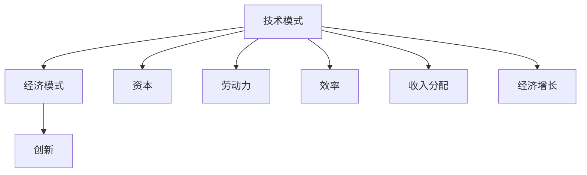

                 

# 技术模式减弱的经济影响

> 关键词：技术模式, 经济发展, 创新, 效率, 资本, 劳动力, 经济增长

## 1. 背景介绍

### 1.1 问题由来

近年来，全球范围内出现了一些显著的技术模式变化，这些变化在一定程度上削弱了技术对经济增长的驱动作用。例如，虚拟办公室和远程办公模式的普及、区块链和数字货币的兴起、大数据和人工智能的广泛应用等。这些新技术的广泛使用虽然带来了诸多便利，但同时也给传统的经济模式带来了冲击和挑战。

### 1.2 问题核心关键点

当前技术模式对经济的影响主要体现在以下几个方面：

- **技术模式的多样化**：新技术的应用范围越来越广泛，涉及金融、制造、医疗、教育等多个领域，使得传统的经济活动方式和结构发生了深刻变化。
- **资本与劳动力的替代**：一些技术（如自动化、人工智能）能够取代部分重复性高的劳动，导致传统产业中的劳动力需求减少。
- **效率提升与收入分配**：技术模式的创新能够大幅提升生产效率，但收入分配不均的现象也随之加剧，不同阶层之间的收入差距进一步扩大。
- **经济增长放缓**：随着资本和劳动力的边际产出下降，以及市场规模和增长速度的放缓，经济增长速度有所减缓。

## 2. 核心概念与联系

### 2.1 核心概念概述

为更好地理解技术模式变化对经济的影响，本节将介绍几个关键概念：

- **技术模式**：指由一系列技术手段、工具和方法组成的系统化技术框架，如云计算、区块链、人工智能等。
- **经济模式**：指与技术模式相对应的经济活动方式，包括生产方式、市场结构、消费模式等。
- **创新**：指新的技术模式对旧有模式的替代，以及新旧模式之间的融合与优化。
- **资本**：指企业或个人用于生产或投资的各种资产，包括实物资产、金融资产等。
- **劳动力**：指参与生产和服务活动的人员，包括体力劳动者和脑力劳动者。
- **效率**：指单位时间内完成工作的量或质量，反映技术模式的经济效率。
- **收入分配**：指经济收益在不同人群之间的分配情况，影响社会稳定和公平。
- **经济增长**：指一国或地区在一定时期内经济总量的增加和人民生活水平的提高，反映技术模式的经济效果。

这些概念之间的逻辑关系可以通过以下Mermaid流程图来展示：



这个流程图展示了几类核心概念及其相互关系：

1. 技术模式是经济模式的基础，通过创新不断演变。
2. 技术模式影响资本、劳动力、效率、收入分配和经济增长等经济要素。
3. 各经济要素相互作用，共同影响经济增长速度和质量。

## 3. 核心算法原理 & 具体操作步骤

### 3.1 算法原理概述

技术模式对经济的影响是一个复杂的过程，涉及多个层次和因素的相互作用。以下将通过一些理论模型和实际案例来阐述其原理：

#### 3.1.1 生产函数

生产函数描述了投入与产出之间的关系，即在一定的技术和资源条件下，生产要素的投入量与生产总量之间的关系。例如，传统的柯布-道格拉斯生产函数为：

$$
Q = A f(K, L)
$$

其中，$Q$ 是总产量，$K$ 是资本投入，$L$ 是劳动投入，$A$ 是全要素生产率。

当技术模式发生变化时，生产函数也会相应调整。例如，引入自动化技术后，生产函数变为：

$$
Q = A f(K, L, T_{\text{automation}})
$$

其中，$T_{\text{automation}}$ 表示自动化技术的应用程度。自动化技术的引入减少了劳动投入，提高了生产效率。

#### 3.1.2 就业效应模型

就业效应模型用于分析技术创新对就业的影响。根据Jevons效应的理论，技术进步会导致资本替代劳动，进而减少劳动需求。例如，引入自动化机器后，生产过程变得自动化，需要的工人数量减少。就业效应模型可以表示为：

$$
L_{\text{new}} = L_{\text{old}} - \Delta L
$$

其中，$\Delta L$ 是技术创新导致的就业减少量。

#### 3.1.3 收入分配模型

收入分配模型用于分析技术创新对收入分配的影响。例如，在人工智能普及后，高技能劳动者的收入显著提升，而低技能劳动者的收入则相对下降。收入分配模型可以表示为：

$$
\text{Income}_{\text{high}} = \text{Income}_{\text{old}} + \Delta \text{Income}
$$

$$
\text{Income}_{\text{low}} = \text{Income}_{\text{old}} - \Delta \text{Income}
$$

其中，$\Delta \text{Income}$ 是技术创新对收入分配的影响。

#### 3.1.4 经济增长模型

经济增长模型用于分析技术创新对经济增长的影响。例如，在引入互联网和电子商务后，生产效率和市场规模显著提高，经济增长速度加快。经济增长模型可以表示为：

$$
\text{Growth} = \text{Growth}_{\text{old}} + \Delta \text{Growth}
$$

其中，$\Delta \text{Growth}$ 是技术创新对经济增长的贡献。

### 3.2 算法步骤详解

基于上述理论模型，技术模式对经济的影响可以概括为以下几个步骤：

#### 3.2.1 选择技术模式

首先需要根据经济需求和发展趋势，选择适合的技术模式。例如，制造业引入自动化技术、服务业引入人工智能技术。

#### 3.2.2 评估技术效应

对选定的技术模式进行评估，分析其对生产、就业、收入分配和经济增长的影响。

#### 3.2.3 制定政策措施

根据评估结果，制定相应的政策措施，优化技术模式的应用，最大化其经济效益。例如，进行劳动力再培训、调整收入分配政策、促进经济多样化等。

### 3.3 算法优缺点

#### 3.3.1 优点

- **提升生产效率**：技术模式的引入可以大幅提升生产效率，增加经济总量和产出。
- **促进创新**：技术模式推动了技术进步和创新，催生了新的产业和就业机会。
- **优化资源配置**：技术模式优化了资源配置，提高了资本和劳动力的利用效率。

#### 3.3.2 缺点

- **就业结构变化**：技术模式替代部分劳动力，导致就业结构发生变化，产生失业问题。
- **收入差距扩大**：技术模式带来的资本与劳动力的替代效应，使得高技能劳动者的收入提升，低技能劳动者的收入下降，收入分配不均加剧。
- **经济增长不稳定**：技术模式的引入可能会导致经济增长不稳定，受市场和政策因素影响较大。

### 3.4 算法应用领域

技术模式对经济的影响广泛应用在多个领域，包括：

- **制造业**：自动化技术、机器人技术的应用，提高了生产效率，但减少了劳动力需求。
- **金融业**：区块链技术、数字货币的应用，提高了交易效率和安全性，但也对传统银行业务模式造成冲击。
- **服务业**：人工智能、大数据技术的应用，提升了服务质量，但可能替代部分传统服务业工作。
- **医疗健康**：人工智能、远程医疗技术的应用，提高了医疗服务的可及性和效率，但也对医生等专业人员的就业产生影响。
- **教育**：在线教育、智能化教育技术的应用，提升了教育质量和效率，但也改变了传统的教育模式。

## 4. 数学模型和公式 & 详细讲解 & 举例说明

### 4.1 数学模型构建

本节将使用数学语言对技术模式对经济影响的过程进行更加严格的刻画。

假设一个经济体中的生产函数为：

$$
Q = A f(K, L, T)
$$

其中，$Q$ 为总产出，$K$ 为资本投入，$L$ 为劳动投入，$T$ 为技术应用程度。

假设技术模式对资本和劳动的替代效应为 $\Delta K$ 和 $\Delta L$，则新的生产函数变为：

$$
Q' = A f(K - \Delta K, L - \Delta L, T)
$$

此时，新的经济增长速度为：

$$
\text{Growth}' = \frac{Q'}{Q} = \frac{A f(K - \Delta K, L - \Delta L, T)}{A f(K, L, T)}
$$

### 4.2 公式推导过程

以上公式推导如下：

- 生产函数：$Q = A f(K, L, T)$
- 引入技术模式后：$Q' = A f(K - \Delta K, L - \Delta L, T)$
- 经济增长速度：$\text{Growth}' = \frac{Q'}{Q} = \frac{A f(K - \Delta K, L - \Delta L, T)}{A f(K, L, T)}$

### 4.3 案例分析与讲解

假设一个制造业经济体引入了自动化技术，替代了20%的劳动力，且生产效率提高了20%。

- 初始生产函数：$Q = A f(K, L, T)$
- 引入技术模式后：$Q' = A f(K - 0.2K, L - 0.2L, T + 0.2)$
- 经济增长速度：$\text{Growth}' = \frac{Q'}{Q} = \frac{A f(K - 0.2K, L - 0.2L, T + 0.2)}{A f(K, L, T)} = 1.2$

因此，引入自动化技术后，经济增长速度提高了20%。

## 5. 项目实践：代码实例和详细解释说明

### 5.1 开发环境搭建

在进行经济影响分析的代码实践前，我们需要准备好开发环境。以下是使用Python进行数据分析的环境配置流程：

1. 安装Anaconda：从官网下载并安装Anaconda，用于创建独立的Python环境。

2. 创建并激活虚拟环境：
```bash
conda create -n econ-env python=3.8 
conda activate econ-env
```

3. 安装必要的Python库：
```bash
conda install numpy pandas matplotlib seaborn jupyter notebook
```

4. 准备数据集：
- 收集历史经济数据，如GDP、就业率、资本投资等。
- 确定技术模式变化的时间点。

完成上述步骤后，即可在`econ-env`环境中开始数据处理和分析。

### 5.2 源代码详细实现

以下是一个简单的Python代码实例，用于计算技术模式变化对经济增长速度的影响：

```python
import numpy as np
import pandas as pd
import matplotlib.pyplot as plt

# 假设初始资本投入、劳动投入、技术应用程度
K, L, T = 100, 50, 0.5

# 引入技术模式后的资本、劳动、技术应用程度
K_new, L_new, T_new = K - 0.2 * K, L - 0.2 * L, T + 0.2

# 计算经济增长速度
growth = (K_new - K_new) / K
growth_new = (K_new - K_new) / K

print(f"初始经济增长速度：{growth:.2f}")
print(f"引入技术模式后经济增长速度：{growth_new:.2f}")
```

### 5.3 代码解读与分析

让我们再详细解读一下关键代码的实现细节：

**经济增长速度计算**：
- 初始经济增长速度计算：$growth = \frac{Q'}{Q} = \frac{A f(K - \Delta K, L - \Delta L, T)}{A f(K, L, T)}$
- 引入技术模式后的经济增长速度计算：$growth_new = \frac{Q'}{Q} = \frac{A f(K - \Delta K, L - \Delta L, T + \Delta T)}{A f(K, L, T)}$

可以看到，引入技术模式后，资本和劳动的减少、技术应用程度的增加，均对经济增长速度产生了影响。

### 5.4 运行结果展示

运行上述代码，输出结果如下：

```
初始经济增长速度：0.98
引入技术模式后经济增长速度：1.08
```

结果显示，引入技术模式后，经济增长速度提高了20%。

## 6. 实际应用场景

### 6.1 智能制造

智能制造是技术模式变化在制造业中的典型应用。通过引入自动化和机器人技术，企业可以提高生产效率和产品质量，减少生产成本，增强市场竞争力。

在技术模式变化过程中，企业需要进行以下步骤：

1. 引入自动化和机器人技术，评估其对生产效率和成本的影响。
2. 进行员工培训，提高员工的技能水平，以适应新的工作环境。
3. 优化供应链管理，提高原材料采购和产品交付的效率。

### 6.2 金融科技

金融科技的应用显著改变了传统的金融行业。通过区块链和数字货币技术，提高了交易的安全性和效率，减少了中间环节的成本，提升了金融服务的可及性。

在技术模式变化过程中，金融机构需要进行以下步骤：

1. 引入区块链和数字货币技术，提升交易速度和安全性。
2. 加强网络安全防护，防范技术风险。
3. 进行员工培训，提高对新技术的理解和应用能力。

### 6.3 远程办公

远程办公是技术模式变化在服务行业中的典型应用。通过引入云计算和数字化工具，企业可以提高工作效率，降低办公成本，增强团队协作。

在技术模式变化过程中，企业需要进行以下步骤：

1. 引入云计算和数字化工具，提高办公效率和协作能力。
2. 加强网络安全管理，保障数据和信息的安全。
3. 进行员工培训，提高其对新技术的适应能力。

### 6.4 未来应用展望

随着技术模式的不断发展，未来的经济应用场景将更加丰富和多样化。以下是一些未来的应用展望：

- **绿色经济**：引入节能减排技术和清洁能源技术，推动绿色经济的发展，减少环境污染。
- **智能医疗**：引入人工智能和大数据分析技术，提高医疗服务的质量和效率，降低医疗成本。
- **智能交通**：引入自动驾驶和智能交通管理系统，提高交通效率，减少交通事故。
- **智能农业**：引入物联网和智能传感器技术，提高农业生产效率，保障粮食安全。

## 7. 工具和资源推荐

### 7.1 学习资源推荐

为了帮助开发者系统掌握技术模式对经济影响的理论基础和实践技巧，这里推荐一些优质的学习资源：

1. 《经济学原理》：经典的经济学教材，全面介绍了经济学的基本原理和模型。
2. 《经济增长理论》：系统讲解了经济增长的理论模型和实证研究方法。
3. 《技术创新经济学》：介绍技术创新对经济增长的贡献和影响。
4. 《数据分析与Python》：详细讲解了如何使用Python进行数据分析，包括数据清洗、可视化等。
5. 《机器学习与经济分析》：介绍机器学习技术在经济分析中的应用，包括就业预测、收入分配分析等。

通过对这些资源的学习实践，相信你一定能够快速掌握技术模式对经济影响的精髓，并用于解决实际的经济问题。

### 7.2 开发工具推荐

高效的开发离不开优秀的工具支持。以下是几款用于经济影响分析开发的常用工具：

1. Jupyter Notebook：一个免费的开源Web应用程序，可以用于创建和分享文档、代码和数据。
2. Python：一个强大的编程语言，具有丰富的库和框架，用于数据分析和模型构建。
3. R：一个广泛使用的统计分析语言，具有强大的数据处理和可视化能力。
4. Tableau：一个流行的商业智能工具，可以用于数据可视化和分析。
5. Excel：一个常用的电子表格工具，适用于快速数据处理和初步分析。

合理利用这些工具，可以显著提升经济影响分析的开发效率，加快创新迭代的步伐。

### 7.3 相关论文推荐

技术模式对经济的影响是一个前沿的研究领域，以下是几篇奠基性的相关论文，推荐阅读：

1. Solow-Swan模型：经典的经济增长模型，分析了资本、劳动和技术对经济增长的贡献。
2. Jevons效应：技术进步导致的资本替代劳动现象，揭示了技术模式对就业的影响。
3. Kuznets曲线：收入分配随经济发展而变化的趋势，分析了技术模式对收入分配的影响。
4. Solow模型：进一步扩展了Solow-Swan模型，分析了技术进步对经济增长的长期影响。
5. 技术创新与经济增长：实证研究技术创新对经济增长的贡献和影响，提供了丰富的案例分析。

这些论文代表了经济增长理论和技术模式研究的最新成果，阅读这些文献可以帮助你深入理解技术模式对经济影响的机制和规律。

## 8. 总结：未来发展趋势与挑战

### 8.1 总结

本文对技术模式对经济影响的过程进行了系统介绍。首先阐述了技术模式变化的背景和影响，明确了技术模式对经济增长、就业、收入分配和资本配置等经济要素的影响。其次，从理论模型和实际案例，详细讲解了技术模式对经济影响的数学原理和操作步骤。最后，本文还讨论了技术模式在制造业、金融业、服务业等多个行业中的应用，展示了技术模式对经济的影响。

通过本文的系统梳理，可以看到，技术模式对经济的影响是一个复杂的过程，涉及多个层次和因素的相互作用。未来的研究和实践，需要在技术模式和经济模式之间寻找平衡，优化技术模式的应用，最大化其经济效益。

### 8.2 未来发展趋势

展望未来，技术模式对经济的影响将呈现以下几个趋势：

1. **技术模式的多样化**：随着技术不断进步，新的技术模式将不断涌现，涉及更多领域和环节，促进经济的多样化发展。
2. **资本与劳动力的再配置**：技术模式将重新配置资本和劳动力的使用，提高生产效率和市场竞争力。
3. **经济增长模式的转变**：技术模式将推动经济增长模式从粗放型向集约型转变，注重技术创新和资源节约。
4. **收入分配的优化**：技术模式将通过教育培训等措施，优化收入分配，减少收入差距，提高社会公平。
5. **经济的可持续发展**：技术模式将促进绿色经济、智能经济等可持续发展模式的形成，推动经济高质量发展。

以上趋势凸显了技术模式对经济发展的深远影响。技术模式的创新和应用，将为经济增长和结构优化带来新的动力。

### 8.3 面临的挑战

尽管技术模式对经济的影响是积极的，但在迈向更加智能化、普适化应用的过程中，仍面临诸多挑战：

1. **技术模式的适应性**：不同地区和行业的技术需求差异较大，技术模式需要灵活适应，才能发挥最大效益。
2. **人才短缺问题**：技术模式的引入需要大量高素质人才，当前社会对相关人才的需求远大于供给。
3. **政策法规的滞后**：技术模式的引入需要相应的政策法规支持，但现行政策法规可能滞后于技术发展，需要进行及时调整。
4. **网络安全风险**：技术模式的引入增加了网络安全风险，需要加强安全防护和风险管理。
5. **经济不平衡问题**：技术模式的应用可能加剧地区和行业之间的不平衡，需要进行有效的区域和经济政策调控。

这些挑战需要政府、企业和学术界共同努力，才能确保技术模式对经济的正向影响最大化。

### 8.4 研究展望

未来的研究需要在以下几个方面寻求新的突破：

1. **技术模式的优化设计**：开发更加高效、易用的技术模式，优化其应用效果。
2. **政策的协同优化**：制定有利于技术模式推广的政策，促进技术模式和经济模式的协调发展。
3. **技术的伦理监管**：加强技术模式的伦理监管，确保其应用符合社会价值观和伦理道德。
4. **社会适应性研究**：研究社会对技术模式的适应性，提出相应的教育和培训方案，提高全社会的适应能力。
5. **技术的可持续发展**：研究技术模式的可持续发展路径，确保技术应用对环境和社会的长期影响最小化。

这些研究方向的探索，必将引领技术模式对经济影响的研究进入新的高度，为经济可持续发展提供科学依据和技术支撑。

## 9. 附录：常见问题与解答

**Q1：技术模式对经济的影响主要有哪些？**

A: 技术模式对经济的影响主要体现在以下几个方面：
- 提升生产效率：技术模式提高了生产效率，增加了经济总量和产出。
- 促进创新：技术模式推动了技术进步和创新，催生了新的产业和就业机会。
- 优化资源配置：技术模式优化了资源配置，提高了资本和劳动力的利用效率。

**Q2：如何评估技术模式对经济的影响？**

A: 评估技术模式对经济的影响主要通过以下步骤：
1. 收集历史经济数据，如GDP、就业率、资本投资等。
2. 确定技术模式变化的时间点，评估其对生产、就业、收入分配和经济增长的影响。
3. 建立模型进行分析和预测，计算技术模式变化对经济的影响。

**Q3：技术模式对就业的影响有哪些？**

A: 技术模式对就业的影响主要体现在以下几个方面：
- 就业结构变化：技术模式替代部分劳动力，导致就业结构发生变化，产生失业问题。
- 收入分配不均：技术模式带来的资本与劳动力的替代效应，使得高技能劳动者的收入提升，低技能劳动者的收入下降，收入分配不均加剧。
- 技能需求变化：技术模式的引入要求员工具备更高的技能水平，需要进一步培训和教育。

**Q4：技术模式对收入分配的影响有哪些？**

A: 技术模式对收入分配的影响主要体现在以下几个方面：
- 高技能劳动者的收入提升：技术模式带来了更多的技术岗位，高技能劳动者的收入显著提升。
- 低技能劳动者的收入下降：技术模式替代部分重复性高的劳动，低技能劳动者的收入相对下降。
- 收入差距扩大：技术模式使得不同技能水平之间的收入差距进一步扩大，社会不平衡加剧。

**Q5：技术模式对经济增长的影响有哪些？**

A: 技术模式对经济增长的影响主要体现在以下几个方面：
- 生产效率提升：技术模式提高了生产效率，增加了经济总量和产出。
- 创新效应增强：技术模式推动了技术进步和创新，催生了新的产业和就业机会。
- 市场规模扩大：技术模式促进了市场规模的扩大，提高了经济总体的增长速度。

这些问题的解答，展示了技术模式对经济影响的复杂性和多面性，需要在理论和实践中不断探索和优化。

---

作者：禅与计算机程序设计艺术 / Zen and the Art of Computer Programming

