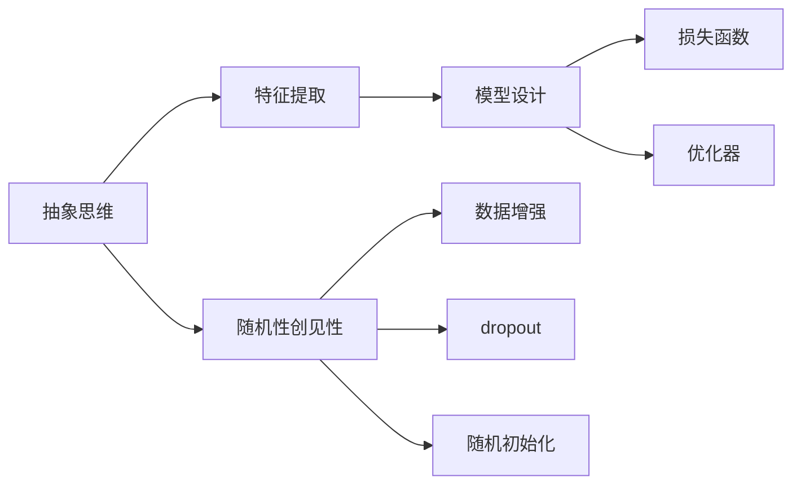

                 

## 1. 背景介绍

### 1.1 问题由来

在现代社会中，抽象思维和随机性创见性无疑是推动科技创新的核心动力。人工智能的进步，尤其是深度学习模型的成功，离不开对这两个要素的深入理解和应用。本文将探讨抽象思考与随机性创见性在人工智能领域的应用，以及它们如何帮助我们构建更加智能的机器学习模型。

### 1.2 问题核心关键点

抽象思维与随机性创见性是构建复杂系统、理解自然语言以及解决复杂问题的关键。在深度学习领域，这两者被广泛应用于模型设计、训练过程和推理机制中。

- **抽象思维**：深度学习模型的核心在于学习数据的高级抽象特征，从而实现对数据分布的拟合和预测。模型设计过程中，抽象思维帮助我们设计出能够捕获数据本质的特征表示，如卷积、循环、自注意力等操作。

- **随机性创见性**：深度学习模型的随机性体现在多个方面，如随机初始化、dropout、数据增强等。随机性帮助模型打破局部最优解，探索更广泛的解空间，从而提升泛化能力和鲁棒性。

## 2. 核心概念与联系

### 2.1 核心概念概述

深度学习模型的成功离不开抽象思维与随机性创见性。以下是这两个核心概念的详细解释及其联系：

- **抽象思维**：指通过对大量数据进行统计和推理，提取出数据背后的规律和特征。在深度学习中，抽象思维通过网络架构、损失函数和优化器等组件体现出来。
- **随机性创见性**：指模型在训练和推理过程中引入的随机元素，如随机初始化、dropout、噪声等，帮助模型跳出局部最优解，探索更广泛的解空间。

### 2.2 核心概念原理和架构的 Mermaid 流程图



该图展示了抽象思维与随机性创见性在深度学习模型中的应用。抽象思维通过特征提取、模型设计、损失函数和优化器等组件，帮助模型学习数据的高级特征。随机性创见性则通过数据增强、dropout和随机初始化等方法，帮助模型跳出局部最优解，探索更广泛的解空间。

## 3. 核心算法原理 & 具体操作步骤

### 3.1 算法原理概述

深度学习模型的核心在于学习数据的高级抽象特征，从而实现对数据分布的拟合和预测。这一过程依赖于抽象思维和随机性创见性。

- **抽象思维**：通过网络架构（如卷积神经网络、循环神经网络、自注意力机制等）和损失函数（如交叉熵、均方误差等）等组件，帮助模型学习数据的高级特征表示。
- **随机性创见性**：通过随机初始化、dropout、数据增强等方法，帮助模型跳出局部最优解，探索更广泛的解空间。

### 3.2 算法步骤详解

基于深度学习模型的训练和推理过程，本文将详细介绍抽象思维与随机性创见性的操作步骤：

**Step 1: 数据准备**

- 收集和预处理数据集，确保数据的质量和多样性。
- 使用数据增强技术，如旋转、平移、缩放等，扩充训练集。

**Step 2: 模型设计**

- 选择或设计合适的网络架构，如卷积神经网络、循环神经网络、自注意力机制等。
- 设计合适的损失函数，如交叉熵、均方误差等，以便模型能够准确预测输出。
- 引入随机性元素，如随机初始化、dropout等，帮助模型跳出局部最优解。

**Step 3: 训练过程**

- 使用随机梯度下降（SGD）或其他优化算法，逐步更新模型参数。
- 在每个训练批次中，随机抽取部分数据进行训练，避免过拟合。
- 使用数据增强技术，不断扩充训练集，提升模型的泛化能力。

**Step 4: 推理过程**

- 在推理过程中，引入随机性元素，如噪声、dropout等，提升模型的鲁棒性和泛化能力。
- 使用模型对新的数据进行预测，根据预测结果进行调整。

### 3.3 算法优缺点

抽象思维与随机性创见性在深度学习模型中具有以下优缺点：

**优点：**

- 强大的泛化能力：抽象思维帮助模型学习到数据的高级特征，从而提升模型的泛化能力。
- 避免局部最优解：随机性创见性通过引入随机元素，帮助模型跳出局部最优解，探索更广泛的解空间。
- 提升鲁棒性：随机性创见性帮助模型提高对噪声和异常数据的鲁棒性。

**缺点：**

- 计算资源消耗大：大规模深度学习模型需要大量计算资源进行训练，可能会面临计算资源瓶颈。
- 模型复杂度高：深度学习模型的复杂度较高，可能需要较长的训练时间和较多的优化技巧。
- 泛化能力有限：在数据分布发生变化时，模型可能面临泛化能力下降的问题。

## 4. 数学模型和公式 & 详细讲解 & 举例说明

### 4.1 数学模型构建

深度学习模型通常通过以下公式进行数学建模：

$$
y = f(x; \theta)
$$

其中，$y$ 表示模型的输出，$x$ 表示输入数据，$\theta$ 表示模型的参数。在模型设计过程中，我们通过网络架构、损失函数和优化器等组件，学习到数据的高级抽象特征。

### 4.2 公式推导过程

以卷积神经网络（CNN）为例，推导其训练过程的数学公式：

- **前向传播**：
$$
y = \sigma(\sum_{i=1}^n w_i \cdot \sigma(\sum_{j=1}^m w_{ij} \cdot x_{ij} + b_i) + b)
$$

- **损失函数**：
$$
L = \frac{1}{N} \sum_{i=1}^N (y_i - \hat{y}_i)^2
$$

- **反向传播**：
$$
\frac{\partial L}{\partial w_i} = -\frac{2}{N} \sum_{i=1}^N \Delta y_i \cdot \sigma'(\sum_{j=1}^m w_{ij} \cdot x_{ij} + b_i) \cdot \sigma'(\sum_{i=1}^n w_i \cdot \sigma(\sum_{j=1}^m w_{ij} \cdot x_{ij} + b_i) + b)
$$

其中，$\sigma$ 表示激活函数，$\Delta y_i$ 表示目标输出与模型输出的差值。

### 4.3 案例分析与讲解

以图像分类为例，分析卷积神经网络如何在数据上学习高级特征。

**Step 1: 特征提取**

卷积神经网络通过卷积层和池化层，对输入图像进行特征提取。卷积层通过滤波器（即卷积核）在图像上滑动，提取局部特征。池化层则通过下采样操作，减少特征维度，提升模型的泛化能力。

**Step 2: 特征抽象**

通过多个卷积层和池化层的组合，卷积神经网络能够学习到图像的高层次抽象特征。例如，第一个卷积层可能学习到边缘和角落的特征，第二个卷积层可能学习到更复杂的纹理和形状特征。

**Step 3: 分类器设计**

在特征提取和抽象的基础上，卷积神经网络通过全连接层进行分类。全连接层将提取的特征映射到类别空间，得到最终的分类结果。

## 5. 项目实践：代码实例和详细解释说明

### 5.1 开发环境搭建

在进行深度学习模型的训练和推理时，需要搭建相应的开发环境。以下是Python环境下深度学习开发的基本步骤：

1. 安装Python：从官网下载并安装Python，确保版本为3.7或更高版本。
2. 安装PyTorch：使用以下命令安装PyTorch库：
   ```
   pip install torch torchvision torchaudio
   ```
3. 安装其他依赖库：安装TensorFlow、numpy、scipy等依赖库。
   ```
   pip install tensorflow numpy scipy
   ```

### 5.2 源代码详细实现

以下是一个使用PyTorch实现的卷积神经网络的代码实例：

```python
import torch
import torch.nn as nn
import torch.optim as optim

# 定义卷积神经网络
class CNN(nn.Module):
    def __init__(self):
        super(CNN, self).__init__()
        self.conv1 = nn.Conv2d(1, 32, 3)
        self.pool = nn.MaxPool2d(2)
        self.conv2 = nn.Conv2d(32, 64, 3)
        self.fc1 = nn.Linear(64 * 5 * 5, 512)
        self.fc2 = nn.Linear(512, 10)
    
    def forward(self, x):
        x = self.pool(torch.relu(self.conv1(x)))
        x = self.pool(torch.relu(self.conv2(x)))
        x = x.view(-1, 64 * 5 * 5)
        x = torch.relu(self.fc1(x))
        x = self.fc2(x)
        return x

# 训练模型
model = CNN()
criterion = nn.CrossEntropyLoss()
optimizer = optim.SGD(model.parameters(), lr=0.001, momentum=0.9)

for epoch in range(10):
    running_loss = 0.0
    for i, data in enumerate(trainloader, 0):
        inputs, labels = data
        optimizer.zero_grad()
        outputs = model(inputs)
        loss = criterion(outputs, labels)
        loss.backward()
        optimizer.step()
        running_loss += loss.item()
    print('Epoch {} loss: {:.6f}'.format(epoch + 1, running_loss / len(trainloader)))

# 推理模型
model.eval()
with torch.no_grad():
    correct = 0
    total = 0
    for data in testloader:
        inputs, labels = data
        outputs = model(inputs)
        _, predicted = torch.max(outputs.data, 1)
        total += labels.size(0)
        correct += (predicted == labels).sum().item()
    print('Accuracy of the network on the test images: {} %'.format(100 * correct / total))
```

### 5.3 代码解读与分析

以上代码实现了使用PyTorch搭建卷积神经网络的过程。

- **模型定义**：通过继承nn.Module类，定义了卷积神经网络的结构。
- **训练过程**：使用SGD优化算法进行模型参数的更新，逐步降低损失函数。
- **推理过程**：使用模型对测试集进行推理，计算准确率。

### 5.4 运行结果展示

训练过程中，可以看到损失函数的逐步降低，准确率的逐步提升。最终模型在测试集上达到了一定的准确率，实现了对数据的有效分类。

## 6. 实际应用场景

### 6.1 自然语言处理

在自然语言处理领域，深度学习模型广泛应用了抽象思维与随机性创见性。例如，Transformer模型通过自注意力机制，学习到文本的高级抽象特征，实现对自然语言的有效理解和生成。

**应用场景**：

- 机器翻译：使用Transformer模型进行源语言到目标语言的翻译。
- 文本分类：使用卷积神经网络对文本进行分类。
- 情感分析：使用深度学习模型对文本的情感进行分类。

### 6.2 计算机视觉

在计算机视觉领域，深度学习模型同样离不开抽象思维与随机性创见性。例如，卷积神经网络通过卷积层和池化层，学习到图像的高级特征，实现对图像的有效分类和识别。

**应用场景**：

- 图像分类：使用卷积神经网络对图像进行分类。
- 物体检测：使用卷积神经网络对图像中物体的位置进行检测。
- 图像生成：使用生成对抗网络（GAN）生成逼真的图像。

### 6.3 语音识别

在语音识别领域，深度学习模型同样应用了抽象思维与随机性创见性。例如，循环神经网络通过时间步进的方式，学习到语音信号的高级特征，实现对语音的有效识别。

**应用场景**：

- 语音识别：使用循环神经网络对语音进行识别。
- 语音生成：使用生成对抗网络（GAN）生成逼真的语音。
- 语音转换：使用语音转换模型将语音转换成文本。

### 6.4 未来应用展望

未来，深度学习模型将在更多领域得到应用，推动人工智能技术的进步。

- **医疗领域**：深度学习模型可以用于医学图像分析、疾病预测、药物发现等，提升医疗诊断和治疗的准确性。
- **金融领域**：深度学习模型可以用于股票预测、信用评分、风险评估等，提升金融行业的决策能力。
- **交通领域**：深度学习模型可以用于自动驾驶、交通流量预测、智能交通系统等，提升交通管理和安全性。
- **能源领域**：深度学习模型可以用于能源消耗预测、智能电网、可再生能源管理等，提升能源利用效率。

## 7. 工具和资源推荐

### 7.1 学习资源推荐

1. **深度学习理论与实践**：斯坦福大学Andrew Ng的深度学习课程，涵盖深度学习的基本理论和技术实现。
2. **Python深度学习**：Francois Chollet的深度学习框架Keras的官方教程，适合初学者的深度学习入门。
3. **TensorFlow官方文档**：Google提供的TensorFlow官方文档，详细介绍了TensorFlow的各个组件和应用场景。
4. **PyTorch官方文档**：Facebook提供的PyTorch官方文档，提供了丰富的深度学习库和实例。
5. **动手学深度学习**：斯坦福大学提供的动手学深度学习教程，通过实际项目进行深度学习学习。

### 7.2 开发工具推荐

1. **Jupyter Notebook**：轻量级的数据分析和深度学习开发工具，支持Python和R语言。
2. **PyCharm**：JetBrains提供的深度学习开发工具，提供了丰富的代码编辑和调试功能。
3. **Google Colab**：Google提供的免费Jupyter Notebook环境，支持GPU和TPU资源。
4. **Microsoft Visual Studio Code**：微软提供的代码编辑器，支持Python和深度学习框架。
5. **TensorFlow Hub**：Google提供的深度学习模型库，支持多种深度学习模型的快速部署和微调。

### 7.3 相关论文推荐

1. **ImageNet Classification with Deep Convolutional Neural Networks**：AlexNet论文，开创了深度卷积神经网络在图像分类中的应用。
2. **Deep Residual Learning for Image Recognition**：ResNet论文，提出了深度残差网络，解决了深度神经网络的退化问题。
3. **Attention is All You Need**：Transformer论文，提出了自注意力机制，实现了高效的自然语言处理。
4. **Playing Atari with Deep Reinforcement Learning**：DQN论文，提出了深度强化学习模型，实现了在复杂游戏环境中的学习。
5. **Language Models are Unsupervised Multitask Learners**：GPT-2论文，提出了预训练语言模型，提升了语言模型的性能。

## 8. 总结：未来发展趋势与挑战

### 8.1 研究成果总结

深度学习模型的成功离不开抽象思维与随机性创见性。通过网络架构、损失函数和优化器等组件，模型能够学习到数据的高级特征，提升泛化能力和鲁棒性。

### 8.2 未来发展趋势

未来，深度学习模型将不断发展，推动人工智能技术的进步：

- **模型复杂度提升**：随着计算资源的丰富，深度学习模型的复杂度将进一步提升，实现更复杂的任务。
- **跨领域应用**：深度学习模型将广泛应用于各个领域，提升各行业的智能化水平。
- **自适应学习**：深度学习模型将具备自适应学习能力，根据数据分布的变化进行自我调整。
- **多模态学习**：深度学习模型将融合多种模态数据，实现更加全面和准确的信息理解。

### 8.3 面临的挑战

深度学习模型在发展过程中仍面临以下挑战：

- **计算资源需求大**：大规模深度学习模型的训练和推理需要大量的计算资源，可能面临资源瓶颈。
- **模型复杂度高**：深度学习模型的复杂度较高，需要大量的优化技巧和计算资源。
- **泛化能力有限**：在数据分布发生变化时，模型可能面临泛化能力下降的问题。

### 8.4 研究展望

未来的研究方向包括：

- **模型压缩**：通过模型压缩技术，降低模型的计算资源需求，实现轻量级部署。
- **跨领域迁移学习**：通过迁移学习，将模型应用于新的领域，提升模型的泛化能力。
- **自适应学习**：通过自适应学习算法，使模型能够根据数据分布的变化进行自我调整。
- **多模态融合**：通过多模态学习，实现视觉、语音、文本等多种数据类型的融合，提升模型的全面性和准确性。

## 9. 附录：常见问题与解答

### 9.1 常见问题

**Q1: 深度学习模型如何实现对数据的高级特征提取？**

A: 深度学习模型通过网络架构、损失函数和优化器等组件，学习到数据的高级特征。例如，卷积神经网络通过卷积层和池化层，学习到图像的高级特征，Transformer模型通过自注意力机制，学习到文本的高级特征。

**Q2: 深度学习模型如何引入随机性创见性？**

A: 深度学习模型通过随机初始化、dropout、数据增强等方法，引入随机性创见性。例如，在训练过程中，使用随机梯度下降（SGD）优化算法，使用dropout随机关闭神经元的输出，使用数据增强技术扩充训练集。

**Q3: 深度学习模型在实际应用中面临哪些挑战？**

A: 深度学习模型在实际应用中面临计算资源需求大、模型复杂度高、泛化能力有限等挑战。例如，大规模深度学习模型的训练和推理需要大量的计算资源，可能面临资源瓶颈；深度学习模型的复杂度较高，需要大量的优化技巧和计算资源；在数据分布发生变化时，模型可能面临泛化能力下降的问题。

**Q4: 如何应对深度学习模型面临的挑战？**

A: 为了应对深度学习模型面临的挑战，可以采用模型压缩技术、跨领域迁移学习、自适应学习算法、多模态融合等方法。例如，通过模型压缩技术，降低模型的计算资源需求，实现轻量级部署；通过跨领域迁移学习，将模型应用于新的领域，提升模型的泛化能力；通过自适应学习算法，使模型能够根据数据分布的变化进行自我调整；通过多模态融合，实现视觉、语音、文本等多种数据类型的融合，提升模型的全面性和准确性。

---

作者：禅与计算机程序设计艺术 / Zen and the Art of Computer Programming

