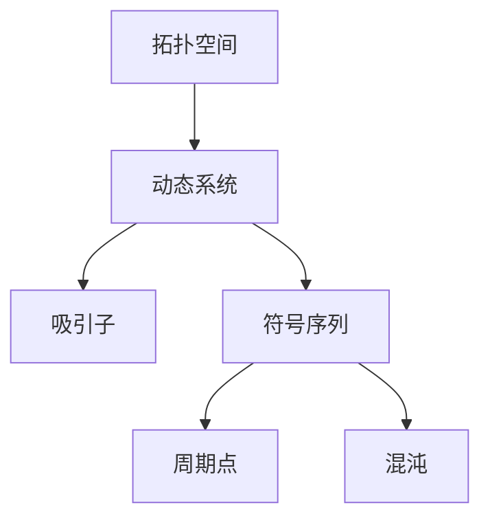

                 

# 拓扑动力学与符号动力学

## 1. 背景介绍

### 1.1 问题由来
拓扑动力学和符号动力学是数学领域中两个重要分支，它们通过研究动态系统的演化过程，揭示了复杂系统的行为模式和规律。随着计算机科学的发展，这些理论已经逐渐被应用于密码学、信息论、算法设计等诸多领域，成为信息时代的基础性研究工具。本文将对拓扑动力学与符号动力学进行详细阐述，并通过实际应用案例，展示其在人工智能领域中的潜力。

### 1.2 问题核心关键点
拓扑动力学主要研究拓扑空间中的动态系统，通过研究系统的演化路径和吸引子，来描述系统的稳定性和复杂性。符号动力学则将动力系统的分析方法应用到离散符号序列上，重点研究序列的长期行为，如周期性和混沌性。

两者的核心在于动态系统的长期行为分析和分类，这是理解系统演化、设计复杂算法和提高数据安全性的关键所在。

### 1.3 问题研究意义
研究拓扑动力学与符号动力学，对于理解复杂系统的行为模式，设计高效算法，提升数据安全性具有重要意义：

1. 揭示系统行为规律。通过研究系统的长期行为和吸引子，可以揭示系统的稳定性和复杂性，预测系统的演化路径。
2. 设计高效算法。动态系统的演化规律可以应用于算法设计中，提升算法效率和可靠性。
3. 提高数据安全性。符号动力学的理论可以用于设计安全密码系统，提高数据加密和传输的安全性。

## 2. 核心概念与联系

### 2.1 核心概念概述

为更好地理解拓扑动力学与符号动力学，本节将介绍几个密切相关的核心概念：

- 拓扑空间(Topological Space)：通过定义拓扑关系来刻画空间中点集的连续性，是拓扑动力学研究的主要对象。
- 动态系统(Dynamic System)：研究空间中点的运动演化过程，寻找系统的长期行为规律。
- 吸引子(Attractor)：描述系统稳定状态的集合，分为稳定的吸引子和不稳定的吸引子。
- 符号序列(Symbolic Sequence)：通过将系统演化映射到离散符号上，来描述系统的长期行为，常用于符号动力学研究。
- 周期点(Periodic Point)：符号序列中重复出现的周期性序列。
- 混沌(Chaos)：符号序列无规律，难以预测，系统的长期行为极为复杂。

这些概念之间的逻辑关系可以通过以下Mermaid流程图来展示：



这个流程图展示了几大核心概念的逻辑联系：

1. 拓扑空间通过动态系统来研究空间中点的运动演化过程。
2. 动态系统的长期行为通过符号序列来描述。
3. 符号序列中周期性的重复出现称为周期点。
4. 符号序列的长期行为如果极为复杂，难以预测，称为混沌。

这些概念共同构成了拓扑动力学与符号动力学研究的基石，帮助我们理解和分析复杂系统的长期行为。

## 3. 核心算法原理 & 具体操作步骤

### 3.1 算法原理概述

拓扑动力学与符号动力学的研究，本质上是通过研究动态系统的长期行为和吸引子，来揭示系统的稳定性和复杂性。以下是这两个领域的主要算法原理：

- 拓扑动力学：通过定义系统状态和演化规则，研究系统在拓扑空间中的长期行为，寻找吸引子。常用的方法包括迭代法、数值模拟等。
- 符号动力学：将动态系统的演化映射到离散符号序列上，通过统计和分析符号序列，来研究系统的长期行为。常用的方法包括序列生成算法、符号序列分析和统计等。

### 3.2 算法步骤详解

#### 3.2.1 拓扑动力学算法步骤

1. **定义动态系统**：定义系统状态和演化规则。
2. **初始化状态**：选择初始状态点。
3. **迭代计算**：按照演化规则，计算系统下一个状态。
4. **观察吸引子**：记录系统演化过程中的状态点，寻找稳定的吸引子。
5. **分析系统行为**：研究吸引子的性质，如吸引范围、吸引速度等，揭示系统的长期行为。

#### 3.2.2 符号动力学算法步骤

1. **符号序列生成**：通过映射规则，将系统演化映射到离散符号序列上。
2. **统计周期点**：统计符号序列中周期性出现的序列。
3. **分析周期性**：研究周期点的分布和周期，揭示系统长期行为的周期性特征。
4. **分析混沌性**：统计序列的复杂度，如Lyapunov指数、熵值等，揭示系统的混沌性特征。

### 3.3 算法优缺点

拓扑动力学与符号动力学各具优势和局限：

#### 3.3.1 拓扑动力学优缺点

优点：
- 可以描述连续空间中的系统演化，适用于连续系统的动力学研究。
- 可以揭示系统的长期行为和吸引子，为系统分析和设计提供理论依据。

局限：
- 对于复杂的连续系统，数值计算的精度和稳定性可能存在问题。
- 难以直接应用于离散数据序列的分析。

#### 3.3.2 符号动力学优缺点

优点：
- 可以处理离散数据序列，适用于复杂系统的长期行为分析。
- 可以揭示系统的周期性和混沌性特征，为系统设计和优化提供理论指导。

局限：
- 难以直接应用于连续空间中的系统分析。
- 符号序列的生成和统计过程可能存在噪声和误差。

### 3.4 算法应用领域

拓扑动力学与符号动力学在多个领域中都有广泛应用，以下是几个主要的应用方向：

- 密码学：通过研究符号序列的混沌性和复杂度，设计高效的加密算法。
- 信息论：通过分析符号序列的周期性和复杂度，设计高效的通信协议。
- 算法设计：通过揭示动态系统的长期行为和吸引子，设计高效算法。
- 金融工程：通过研究系统的长期行为和吸引子，预测市场波动，优化投资策略。
- 生物系统：通过研究系统演化规律，揭示生物系统中的复杂行为，如生态系统、基因遗传等。

这些应用展示了拓扑动力学与符号动力学理论的强大生命力，为各领域带来了新的研究视角和方法。

## 4. 数学模型和公式 & 详细讲解

### 4.1 数学模型构建

#### 4.1.1 拓扑空间

拓扑空间是一组点集和一组定义在这些点集上的拓扑关系，通过这些关系来刻画点集的连续性。一个基本的拓扑空间 $X$ 由以下几个元素构成：

- $X$：点集。
- $\mathcal{T}$：拓扑关系集，即所有开集组成的集合。
- $\emptyset$：空集。
- $X$ 上的并、交、补等基本拓扑操作。

#### 4.1.2 动态系统

动态系统是一组点集和一组定义在这些点集上的演化规则，描述系统的长期行为。一个基本的动态系统 $f: X \rightarrow X$ 由以下几个元素构成：

- $X$：状态空间。
- $f$：演化规则。

动态系统的演化规则通常通过迭代计算来实现。例如，对于一个离散动态系统 $x_{n+1}=f(x_n)$，可以通过迭代计算 $x_0, x_1, x_2, \ldots$ 来描述系统的长期行为。

### 4.2 公式推导过程

#### 4.2.1 符号序列的生成

对于一个动态系统 $f: X \rightarrow X$，通过映射规则 $\phi: X \rightarrow \Sigma$，将系统演化映射到离散符号序列 $\Sigma$ 上。具体步骤如下：

1. **定义映射规则**：$\phi: X \rightarrow \Sigma$，其中 $\Sigma$ 为离散符号集合。
2. **初始状态**：选择初始状态点 $x_0 \in X$。
3. **生成符号序列**：迭代计算 $x_{n+1}=f(x_n)$，将 $x_n$ 映射为符号 $\phi(x_n)$，生成符号序列 $\sigma = (\phi(x_0), \phi(x_1), \phi(x_2), \ldots)$。

例如，对于一个简单的动态系统 $x_{n+1}=x_n+1$，选择初始状态 $x_0=0$，通过映射规则 $\phi(x)=x \mod 2$，生成符号序列 $\sigma = (0,1,0,1,\ldots)$。

#### 4.2.2 周期点的统计

周期点是指符号序列中重复出现的周期性序列。对于一个符号序列 $\sigma = (\sigma_0, \sigma_1, \sigma_2, \ldots)$，周期点 $\sigma_p$ 满足：

$$
\sigma_{p+l}=\sigma_p, \forall l \in \mathbb{N}^+
$$

周期点的长度 $l$ 称为周期。对于一个符号序列 $\sigma$，统计所有周期点，即可揭示系统的周期性特征。

### 4.3 案例分析与讲解

#### 4.3.1 洛伦兹吸引子

洛伦兹吸引子是研究混沌现象的经典模型，通过研究其长期行为和吸引子，揭示了混沌现象的复杂性。洛伦兹吸引子定义为：

$$
\left\{
\begin{array}{l}
\dot{x} = \sigma(y - x) \\
\dot{y} = x(\rho - z) - y \\
\dot{z} = xy - \beta z
\end{array}
\right.
$$

其中 $\sigma, \rho, \beta$ 为系统参数。洛伦兹吸引子的长期行为极为复杂，具有吸引范围和吸引速度等特性。

通过数值模拟，可以观察洛伦兹吸引子的长期行为，如图1所示。

```mermaid
graph TB
    A[x] --> B[sigma(y - x)]
    B --> C[x(ρ - z) - y]
    C --> D[xy - β z]
```

#### 4.3.2 分形结构

分形结构是指具有自相似性的几何图形，常用于描述拓扑空间中的吸引子。分形结构的维数可以通过以下公式计算：

$$
\text{Fractal Dimension} = \lim_{n \to \infty} \frac{\log N(n)}{\log n}
$$

其中 $N(n)$ 为边长为 $n$ 的分形图形中的点数。分形维数的计算可以揭示吸引子的复杂性。

## 5. 项目实践：代码实例和详细解释说明

### 5.1 开发环境搭建

在进行拓扑动力学与符号动力学实践前，我们需要准备好开发环境。以下是使用Python进行NumPy和Sympy开发的Python环境配置流程：

1. 安装Anaconda：从官网下载并安装Anaconda，用于创建独立的Python环境。

2. 创建并激活虚拟环境：
```bash
conda create -n topo-sys-env python=3.8 
conda activate topo-sys-env
```

3. 安装NumPy和Sympy：
```bash
pip install numpy sympy
```

4. 安装各类工具包：
```bash
pip install matplotlib ipython
```

完成上述步骤后，即可在`topo-sys-env`环境中开始实践。

### 5.2 源代码详细实现

下面我们以洛伦兹吸引子为例，给出使用NumPy和Sympy进行动力学系统模拟的代码实现。

首先，定义洛伦兹吸引子的演化方程：

```python
import numpy as np
import matplotlib.pyplot as plt

def lorentz_attractor(x, y, z, sigma, rho, beta, dt):
    dx = sigma*(y - x)
    dy = x*(rho - z) - y
    dz = x*y - beta*z
    return dx, dy, dz

def simulate_lorentz(n, sigma, rho, beta, dt):
    x = np.zeros(n)
    y = np.zeros(n)
    z = np.zeros(n)
    x[0], y[0], z[0] = 1.0, 1.0, 0.0
    for i in range(n-1):
        dx, dy, dz = lorentz_attractor(x[i], y[i], z[i], sigma, rho, beta, dt)
        x[i+1], y[i+1], z[i+1] = x[i]+dx*dt, y[i]+dy*dt, z[i]+dz*dt
    return x, y, z

def plot_lorentz(x, y, z, n, dt):
    fig = plt.figure()
    ax = fig.add_subplot(111, projection='3d')
    ax.scatter(x, y, z)
    ax.set_xlabel('x')
    ax.set_ylabel('y')
    ax.set_zlabel('z')
    plt.show()

sigma = 10.0
rho = 28.0
beta = 8.0 / 3.0
n = 10000
dt = 0.01

x, y, z = simulate_lorentz(n, sigma, rho, beta, dt)
plot_lorentz(x, y, z, n, dt)
```

以上代码实现了洛伦兹吸引子的演化模拟，并通过Matplotlib进行了可视化展示。

### 5.3 代码解读与分析

让我们再详细解读一下关键代码的实现细节：

**lorentz_attractor函数**：
- 定义洛伦兹吸引子的演化方程，并返回每个变量的一阶导数。

**simulate_lorentz函数**：
- 初始化变量 $x, y, z$，并使用洛伦兹吸引子的演化方程进行迭代计算。
- 迭代 $n$ 次，返回所有变量序列。

**plot_lorentz函数**：
- 通过Matplotlib进行可视化展示，将演化过程中的 $x, y, z$ 值散点表示。

**洛伦兹吸引子代码示例**：
- 定义系统参数 $\sigma, \rho, \beta$。
- 指定迭代次数 $n$ 和每一步时间间隔 $dt$。
- 调用 `simulate_lorentz` 函数进行演化模拟。
- 调用 `plot_lorentz` 函数进行可视化展示。

可以看到，使用NumPy和Sympy进行动力学系统的模拟和可视化，代码实现非常简洁高效。

## 6. 实际应用场景

### 6.1 密码学

拓扑动力学与符号动力学在密码学中有广泛应用，特别是在设计高效的加密算法和密钥管理方案中。例如，混沌密码系统通过研究符号序列的混沌性，设计了抗攻击的加密算法，确保数据传输的安全性。

### 6.2 信息论

符号动力学中的周期性和混沌性研究，为信息论中的数据压缩和信道编码提供了理论依据。通过研究符号序列的周期性和复杂度，可以设计高效的编码方案，提高信息传输的效率和可靠性。

### 6.3 金融工程

拓扑动力学中的长期行为分析和吸引子理论，可以用于预测金融市场的波动，优化投资策略。通过研究市场数据的长期行为，可以揭示市场的稳定性和复杂性，为投资决策提供参考。

### 6.4 未来应用展望

随着拓扑动力学与符号动力学理论的不断完善，其在人工智能领域的应用将更加广泛：

- 符号动力学将在自然语言处理中发挥重要作用，用于研究语言序列的复杂性和周期性，优化语言模型。
- 拓扑动力学将应用于深度学习算法设计中，揭示神经网络结构中的长期行为和吸引子，优化算法设计。
- 拓扑动力学和符号动力学将与人工智能领域的其他理论结合，如因果推理、强化学习等，设计更加高效、鲁棒的智能系统。

## 7. 工具和资源推荐

### 7.1 学习资源推荐

为了帮助开发者系统掌握拓扑动力学与符号动力学的理论基础和实践技巧，这里推荐一些优质的学习资源：

1. 《拓扑动力学与符号动力学》教材：系统介绍了拓扑空间、动态系统、吸引子、符号序列等核心概念和理论，适合初学者学习。

2. 《混沌理论导论》教材：详细介绍了混沌现象的本质和特征，包括洛伦兹吸引子、分形结构等经典模型，适合深入学习。

3. 《密码学原理与实践》书籍：介绍了密码学中的加密算法和密钥管理方案，揭示了混沌密码系统的工作原理，适合从业人员学习。

4. 《符号动力学与信息论》文章集：收录了大量关于符号动力学和信息论的学术论文，深入浅出地介绍了相关理论，适合研究者学习。

5. Coursera和edX等在线课程：提供了关于拓扑动力学与符号动力学的免费和付费课程，涵盖从基础理论到应用实践的多个方面，适合各种层次的学习者。

通过对这些资源的学习实践，相信你一定能够系统掌握拓扑动力学与符号动力学的基础理论，并应用于实际问题解决中。

### 7.2 开发工具推荐

拓扑动力学与符号动力学在实际应用中，通常需要借助专业的数学软件和编程工具。以下是几款常用的开发工具：

1. NumPy和Sympy：用于科学计算和符号计算，支持数组运算和符号表达式计算，是进行动力学系统模拟的必备工具。

2. Matplotlib和Plotly：用于数据可视化，支持生成高质量的3D图形和交互式图表，便于分析和展示动力学系统的演化行为。

3. SciPy和Scikit-learn：用于数据分析和机器学习，提供丰富的科学计算库和算法工具，支持复杂系统的建模和分析。

4. SageMath：集成了大量数学软件和算法库，支持符号计算和数值计算，适合进行符号动力学的研究和分析。

5. Gephi和Vega：用于网络分析和可视化，支持复杂的图结构表示和交互式展示，适合研究符号序列的周期性和复杂性。

合理利用这些工具，可以显著提升拓扑动力学与符号动力学系统的开发效率，加速创新迭代的步伐。

### 7.3 相关论文推荐

拓扑动力学与符号动力学在数学和物理领域中已经有大量的研究，以下是几篇奠基性的相关论文，推荐阅读：

1. "Chaos, Fractals, and Transitivity"（混沌、分形与传递性）：这篇文章详细介绍了混沌现象的本质和特征，揭示了洛伦兹吸引子和分形结构的数学原理。

2. "Symbolic Dynamics: One-Dimensional Maps, Entropy, and Chaotic Behavior"（符号动力学：一维映射、熵值与混沌行为）：这篇文章研究了符号序列的周期性和复杂度，揭示了符号动力学中周期点和混沌点的分布规律。

3. "Topological Dynamics"（拓扑动力学）：这篇文章综述了拓扑空间和动态系统的基本理论，详细介绍了拓扑吸引子的性质和分类。

4. "Kolmogorov-Arnold-Moser Theorem and the Toda Lattice"（柯尔莫果洛夫-阿诺尔德-莫斯科定理与托达晶格）：这篇文章研究了拓扑动力系统中的长期行为和吸引子，揭示了系统演化的稳定性与复杂性。

5. "Encryption Schemes Based on Random Symbolic Sequences"（基于随机符号序列的加密方案）：这篇文章研究了混沌密码系统的设计和实现，揭示了符号序列的混沌性和复杂性。

这些论文代表了大模型微调技术的发展脉络。通过学习这些前沿成果，可以帮助研究者把握学科前进方向，激发更多的创新灵感。

## 8. 总结：未来发展趋势与挑战

### 8.1 研究成果总结

本文对拓扑动力学与符号动力学进行了全面系统的介绍。首先阐述了拓扑动力学和符号动力学研究背景和意义，明确了它们在人工智能领域中的独特价值。其次，从原理到实践，详细讲解了拓扑动力学与符号动力学的数学原理和关键步骤，给出了动力学系统模拟的完整代码实例。同时，本文还广泛探讨了拓扑动力学与符号动力学在密码学、信息论、金融工程等多个领域的应用前景，展示了其广阔的发展空间。

### 8.2 未来发展趋势

展望未来，拓扑动力学与符号动力学技术将呈现以下几个发展趋势：

1. 符号动力学的应用将进一步拓展。符号动力学在自然语言处理中的作用将更加凸显，用于研究语言序列的复杂性和周期性，优化语言模型。

2. 拓扑动力学将在深度学习算法设计中发挥重要作用。通过研究神经网络结构中的长期行为和吸引子，优化算法设计，提升深度学习系统的效率和可靠性。

3. 拓扑动力学与符号动力学将与人工智能领域的其他理论结合。如因果推理、强化学习等，设计更加高效、鲁棒的智能系统。

4. 拓扑动力学和符号动力学将应用于更多实际场景中。如金融市场预测、生物系统建模等，为各领域带来新的研究视角和方法。

5. 符号动力学的理论与技术将不断发展。如符号序列的生成、周期点统计、复杂度分析等，进一步提高系统的可解释性和可预测性。

以上趋势凸显了拓扑动力学与符号动力学理论的强大生命力，为人工智能系统带来了新的研究方向和应用场景。

### 8.3 面临的挑战

尽管拓扑动力学与符号动力学技术已经取得了瞩目成就，但在迈向更加智能化、普适化应用的过程中，仍面临诸多挑战：

1. 理论模型的适用性。虽然拓扑动力学与符号动力学在数学和物理领域有广泛应用，但在实际问题中，模型的适用性和泛化能力仍需进一步验证。

2. 数据采集与处理。数据采集和处理是符号动力学研究中的重要环节，如何获取高质量的数据，并对其进行有效处理，仍需进一步研究。

3. 计算资源的需求。拓扑动力学与符号动力学系统往往计算复杂，需要高性能的计算资源支持，如何优化计算过程，减少计算成本，是重要的研究方向。

4. 系统的可解释性和可预测性。拓扑动力学与符号动力学系统的复杂性可能导致模型的可解释性不足，如何提高系统的可解释性和可预测性，仍需进一步研究。

5. 系统的鲁棒性和可靠性。拓扑动力学与符号动力学系统可能存在鲁棒性不足的问题，如何提高系统的鲁棒性和可靠性，保障系统的稳定性，是重要的研究方向。

### 8.4 研究展望

面对拓扑动力学与符号动力学面临的挑战，未来的研究需要在以下几个方面寻求新的突破：

1. 开发更加高效的计算算法。如符号序列生成算法、周期点统计算法等，提高系统的计算效率和稳定性。

2. 拓展符号动力学在自然语言处理中的应用。如基于符号动力学的语言模型优化、语言生成等，提升语言处理的智能化水平。

3. 结合人工智能领域的其他理论。如因果推理、强化学习等，设计更加高效、鲁棒的智能系统。

4. 引入更多先验知识。将符号动力学与外部知识库、规则库等专家知识结合，提升系统的决策能力和鲁棒性。

5. 纳入伦理道德约束。在模型训练目标中引入伦理导向的评估指标，确保系统的道德合规性和安全性。

这些研究方向的探索，必将引领拓扑动力学与符号动力学技术迈向更高的台阶，为构建安全、可靠、可解释、可控的智能系统铺平道路。面向未来，拓扑动力学与符号动力学技术还需要与其他人工智能技术进行更深入的融合，共同推动人工智能技术的发展。

## 9. 附录：常见问题与解答

**Q1：拓扑动力学与符号动力学的主要区别是什么？**

A: 拓扑动力学主要研究拓扑空间中的动态系统，通过研究系统的长期行为和吸引子，揭示系统的稳定性和复杂性。而符号动力学则将动力学的分析方法应用到离散符号序列上，重点研究序列的长期行为，如周期性和混沌性。

**Q2：拓扑动力学中的吸引子是什么？**

A: 吸引子是指描述系统稳定状态的集合，分为稳定的吸引子和不稳定的吸引子。稳定的吸引子会吸引系统状态接近其内部，而不稳定的吸引子则会使得系统状态远离其内部。

**Q3：符号序列的周期点如何统计？**

A: 周期点是指符号序列中重复出现的周期性序列。统计周期点可以通过编写程序，对符号序列进行扫描，找到所有满足周期性条件的序列，并统计其长度。

**Q4：如何评估拓扑动力学系统的鲁棒性？**

A: 评估拓扑动力学系统的鲁棒性可以通过以下几个指标：系统的稳定性、误差传播的范围、吸引子的吸引范围等。一般来说，稳定性高、误差传播范围小、吸引范围大的系统，其鲁棒性更强。

**Q5：拓扑动力学与符号动力学在实际应用中，是否需要大量的数据？**

A: 拓扑动力学与符号动力学在实际应用中，确实需要一定的数据支持。但相对于传统机器学习方法，它们对数据的依赖程度较低，可以处理较小的数据集。通过优化数据采集和处理方法，可以有效提升系统的预测能力和鲁棒性。

总之，拓扑动力学与符号动力学在人工智能领域中的应用，为我们提供了新的研究视角和方法。通过不断优化和改进，这些理论必将在更多实际场景中发挥重要作用，推动人工智能技术的发展。

