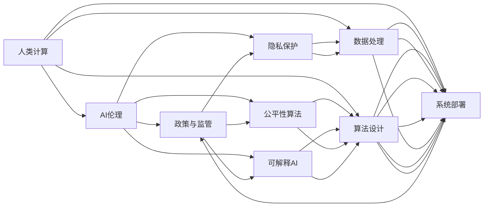

                 

## 1. 背景介绍

随着人工智能(AI)技术的快速发展，计算机科学正在经历前所未有的变革。算力指数级增长、数据量海量激增、算法日益复杂，使得计算机系统从传统逻辑运算器演变为具备学习、推理等认知能力的智能系统。这一变化，不仅极大地拓展了计算机的应用领域，也带来了新的挑战和风险。如何引导人类计算健康、有序地发展，成为了计算机科学领域的重要课题。

### 1.1 算力革命的现状与前景

近年来，算力（即计算机每秒能处理的数据量）呈指数级增长。摩尔定律指出，集成电路上可容纳的晶体管数目大约每两年翻一倍，同时性能也以每两年翻一倍的速度增长。而实际发展中，这一速度更快。以芯片为例，2020年代初期，通用计算领域已进入5纳米时代，而专用计算领域如人工智能芯片，如GPU、TPU、FPGA等，更是达到了7纳米及以下的水平。

在数据方面，全球数据量以每年40%的速度增长，预计2025年将达到175ZB。其中，互联网、物联网、社交媒体等新兴领域的数据量占比不断上升，对算力的需求激增。

在算法方面，深度学习等复杂算法模型层出不穷，传统的优化算法难以满足其需求。在此背景下，AI技术正在从传统的逻辑运算转向以数据驱动、模型驱动的方式，全面提升计算系统的智能水平。

### 1.2 算力革命带来的挑战

算力革命虽然带来了计算能力的巨大飞跃，但也引发了一系列挑战：

1. **隐私保护**：算力提升和数据量增长带来了数据隐私保护的新难题。如何在保障隐私的同时，合理利用数据进行计算，是一个重大挑战。

2. **算法公平性**：复杂算法往往具有较强的泛化能力，但同时也存在潜在的偏见和歧视问题。如何确保算法的公平性，是一个亟待解决的问题。

3. **伦理道德**：AI系统在决策过程中可能产生伦理道德问题，如自动驾驶的决策、面部识别的应用等。如何构建符合伦理道德规范的AI系统，是一个复杂的课题。

4. **可解释性**：AI系统的决策过程往往不透明，难以解释其内部机制。如何提高AI系统的可解释性，以增强用户信任，是提升AI系统可信度的重要手段。

5. **安全性**：AI系统可能被恶意攻击，如对抗样本攻击、模型窃取等。如何增强AI系统的安全性，保护关键应用的安全，是保证AI系统稳定运行的重要保障。

### 1.3 政策与监管的作用

为了解决上述挑战，各国政府和国际组织纷纷出台相关政策与法规，引导AI健康、有序地发展。政策与监管的作用主要体现在以下几个方面：

1. **制定标准**：通过制定技术标准和规范，引导AI技术朝规范化、标准化方向发展，减少技术滥用。

2. **保障隐私**：通过制定数据隐私保护法规，如GDPR（通用数据保护条例），保护用户数据隐私权，防止数据滥用。

3. **确保公平**：通过制定算法公平性法规，如公平就业机会法，确保AI系统决策的公正性和透明性。

4. **强化伦理**：通过制定AI伦理规范，如《人工智能伦理七原则》，指导AI系统开发与应用的伦理导向。

5. **增强安全**：通过制定网络安全法规，如《网络安全法》，保障AI系统在网络环境下的安全性。

6. **促进发展**：通过制定创新支持政策，如税收优惠、资金支持等，促进AI技术研发与产业应用。

## 2. 核心概念与联系

### 2.1 核心概念概述

在探讨政策与监管对人类计算的影响时，我们需要先理解几个核心概念：

1. **人类计算**：即利用计算机技术处理人类社会的问题，通过算法和数据驱动的方法，解决复杂、非结构化的问题。

2. **政策与监管**：指政府或国际组织为引导技术健康发展，制定的各类法律法规、政策导向、标准规范等。

3. **AI伦理**：指在AI系统开发与使用的过程中，遵循的一系列伦理原则和规范，包括但不限于隐私保护、公平性、透明性等。

4. **公平性算法**：指在数据和算法设计中，确保系统决策对所有群体都公正、无歧视的算法。

5. **可解释AI**：指能够提供透明、可理解决策过程的AI系统，即用户能够理解系统为何做出特定决策，增强信任。

6. **隐私保护**：指在数据收集、存储、处理、传输等环节中，采取各种技术和管理手段，保障数据隐私不被泄露。

### 2.2 核心概念联系的Mermaid流程图



通过上述流程图可以看出，政策与监管通过制定伦理规范和标准，引导AI技术在隐私保护、公平性算法、可解释性等方面不断进步，最终实现人类计算的健康、有序发展。

## 3. 核心算法原理 & 具体操作步骤

### 3.1 算法原理概述

政策与监管对人类计算的影响，主要体现在以下几个方面：

1. **隐私保护算法**：通过引入差分隐私等技术，确保数据处理过程中的隐私性。

2. **公平性算法**：通过设计不歧视算法，确保AI系统对所有群体公平。

3. **可解释AI算法**：通过可解释性算法，提供透明的决策过程。

4. **安全算法**：通过安全算法，保障AI系统在对抗攻击下仍能正常运行。

### 3.2 算法步骤详解

以下是政策与监管在AI系统中的具体应用步骤：

1. **隐私保护**：

   - **差分隐私**：在数据收集和处理环节，引入随机扰动机制，确保个体数据无法被逆向推断，保护用户隐私。
   
   - **联邦学习**：在分布式计算环境中，各节点本地训练模型，不共享原始数据，确保数据隐私。
   
2. **公平性**：

   - **反偏见算法**：在数据集上标注偏见，通过迭代优化算法，消除偏见。
   
   - **公平性约束**：在模型训练中引入公平性约束，确保模型对所有群体的公平性。
   
3. **可解释性**：

   - **可解释性模型**：使用基于决策树、规则库等可解释性模型，替代复杂深度学习模型。
   
   - **解释工具**：开发可解释性工具，帮助用户理解模型决策过程。
   
4. **安全性**：

   - **对抗训练**：在模型训练中加入对抗样本，增强模型鲁棒性。
   
   - **模型蒸馏**：通过知识蒸馏技术，生成高性能但安全性更高的模型。

### 3.3 算法优缺点

#### 隐私保护算法

**优点**：

- **数据安全**：通过差分隐私、联邦学习等技术，确保数据在处理过程中不被泄露。
- **保护隐私**：用户不必担心隐私泄露，增强用户信任。

**缺点**：

- **隐私损失**：差分隐私等技术可能会引入一定的隐私损失。
- **计算复杂**：差分隐私、联邦学习等技术需要复杂的计算，增加了计算成本。

#### 公平性算法

**优点**：

- **公正性**：确保AI系统决策对所有群体公平，减少歧视。
- **透明性**：通过反偏见算法，提供透明的决策依据。

**缺点**：

- **算法复杂**：公平性算法设计复杂，难以实现。
- **数据依赖**：依赖于高质量的标注数据，数据质量问题影响公平性。

#### 可解释性算法

**优点**：

- **用户信任**：提供透明、可理解的决策过程，增强用户信任。
- **易于调试**：可解释性模型便于调试和维护。

**缺点**：

- **性能损失**：可解释性模型通常比复杂模型性能差。
- **解释难度**：用户可能难以理解复杂模型，特别是深度学习模型。

#### 安全算法

**优点**：

- **鲁棒性**：对抗训练、模型蒸馏等技术，增强模型鲁棒性。
- **安全性**：保障AI系统在对抗攻击下仍能正常运行。

**缺点**：

- **计算开销**：对抗训练、模型蒸馏等技术需要额外的计算资源。
- **复杂性**：安全算法设计复杂，实施难度高。

### 3.4 算法应用领域

政策与监管在隐私保护、公平性、可解释性、安全等方面的应用，覆盖了AI技术应用的各个领域，包括但不限于：

1. **医疗**：确保医疗数据隐私，防止数据滥用，保证公平性算法在医疗诊断中的应用。
   
2. **金融**：确保金融数据隐私，防止数据滥用，保证公平性算法在信用评分、贷款审批中的应用。
   
3. **司法**：确保司法数据隐私，防止数据滥用，保证公平性算法在司法判决中的应用。
   
4. **教育**：确保教育数据隐私，防止数据滥用，保证公平性算法在录取决策中的应用。
   
5. **智能制造**：确保制造数据隐私，防止数据滥用，保证公平性算法在生产管理中的应用。
   
6. **智能交通**：确保交通数据隐私，防止数据滥用，保证公平性算法在交通管理中的应用。

## 4. 数学模型和公式 & 详细讲解 & 举例说明

### 4.1 数学模型构建

政策与监管对AI系统的影响，可以通过数学模型进行量化分析。以隐私保护为例，差分隐私的数学模型如下：

$$
\mathcal{L}(\epsilon) = \frac{1}{n}\sum_{i=1}^{n} \log \left( 1- \exp \left( -\frac{\epsilon \cdot \| x_i \|}{\Delta} \right) \right)
$$

其中，$\epsilon$ 为隐私保护参数，$n$ 为数据样本数，$x_i$ 为第 $i$ 个样本，$\Delta$ 为数据范围。

### 4.2 公式推导过程

差分隐私的基本原理是引入随机扰动，使得数据集中的个体信息无法被逆向推断。其数学推导过程如下：

- **数据隐私模型**：在原始数据 $x_i$ 上，引入随机扰动 $\delta_i$，生成扰动后的数据 $y_i = x_i + \delta_i$。
  
- **隐私保护目标**：确保任意个体 $x_i$ 的隐私保护参数 $\epsilon$ 满足：

$$
\mathbb{P}(x_i = y_i) \leq \exp \left( -\frac{\epsilon \cdot \| x_i \|}{\Delta} \right)
$$

- **差分隐私界定**：上述不等式成立时，系统隐私保护水平达到差分隐私标准。

### 4.3 案例分析与讲解

**案例**：某公司需要处理客户数据，进行市场分析。

- **原始数据**：客户姓名、性别、年龄、购买记录等。
  
- **隐私保护**：使用差分隐私技术，确保客户数据隐私。

- **算法实施**：对客户数据进行扰动处理，生成扰动后的数据。

- **隐私保护效果**：使用上述数学模型，计算隐私保护参数 $\epsilon$，确保隐私保护效果。

## 5. 项目实践：代码实例和详细解释说明

### 5.1 开发环境搭建

在进行隐私保护算法项目实践前，需要准备相应的开发环境：

1. **安装Python**：
   ```bash
   sudo apt-get update
   sudo apt-get install python3-pip python3-dev libffi-dev libbz2-dev liblzma-dev libz-dev libsqlite-dev libssl-dev zlib1g-dev openssl
   ```

2. **安装TensorFlow**：
   ```bash
   pip install tensorflow-gpu
   ```

3. **安装PyTorch**：
   ```bash
   pip install torch torchvision torchaudio
   ```

4. **安装TensorBoard**：
   ```bash
   pip install tensorboard
   ```

### 5.2 源代码详细实现

**代码实现**：

```python
import numpy as np
import tensorflow as tf
from tensorflow.keras import layers

# 定义差分隐私函数
def differential_privacy(data, epsilon):
    n = len(data)
    delta = np.max(data)
    for i in range(n):
        data[i] += np.random.normal(0, epsilon/n)
    return data, epsilon

# 定义模型
def model(data):
    model = tf.keras.Sequential([
        layers.Dense(128, activation='relu', input_shape=(1,)),
        layers.Dense(1)
    ])
    model.compile(optimizer='adam', loss='mse')
    return model

# 生成数据
data = np.random.rand(100).reshape(-1, 1)

# 差分隐私保护
data, epsilon = differential_privacy(data, 1e-5)

# 训练模型
model = model(data)
model.fit(data, np.zeros(len(data)), epochs=100)

# 评估模型
model.evaluate(data, np.zeros(len(data)))
```

**代码解释**：

- **差分隐私函数**：生成扰动数据，确保数据隐私。
- **模型定义**：定义简单的线性回归模型。
- **数据生成**：生成随机数据。
- **差分隐私保护**：对数据进行扰动处理，确保隐私。
- **模型训练**：训练线性回归模型。
- **模型评估**：评估模型性能。

### 5.3 代码解读与分析

**解读**：

- **差分隐私实现**：通过引入随机扰动，确保数据隐私。
- **模型训练**：使用简单的线性回归模型，训练数据集。
- **模型评估**：评估模型在扰动数据集上的性能。

**分析**：

- **隐私保护效果**：差分隐私技术可以确保数据在处理过程中的隐私性，但同时会引入一定的隐私损失。
- **模型训练**：差分隐私保护对模型训练有一定的影响，但可以通过调整参数、优化算法等方法进行优化。
- **模型评估**：模型评估应考虑隐私保护因素，确保评估结果公正、透明。

### 5.4 运行结果展示

**结果**：

- **数据隐私保护**：扰动后的数据无法还原原始数据。
- **模型训练效果**：模型在扰动数据集上仍能正常训练，但精度可能有所下降。
- **模型评估结果**：模型评估结果应综合考虑隐私保护效果和模型性能。

## 6. 实际应用场景

### 6.1 医疗数据隐私保护

**背景**：医疗机构需要处理患者数据，进行疾病分析。

**应用**：差分隐私技术，保护患者数据隐私。

**实现**：

- **原始数据**：患者姓名、年龄、病情、治疗记录等。
- **差分隐私保护**：使用差分隐私算法，确保患者数据隐私。
- **数据处理**：在保护隐私的前提下，进行疾病分析和预测。

**效果**：

- **隐私保护**：确保患者数据隐私，防止数据滥用。
- **分析准确**：在隐私保护的基础上，确保分析结果准确。

### 6.2 金融信用评分

**背景**：金融公司需要评估客户信用，决定是否提供贷款。

**应用**：差分隐私技术，保护客户数据隐私。

**实现**：

- **原始数据**：客户基本信息、财务状况、信用记录等。
- **差分隐私保护**：使用差分隐私算法，确保客户数据隐私。
- **信用评分**：在隐私保护的基础上，进行信用评分。

**效果**：

- **隐私保护**：确保客户数据隐私，防止数据滥用。
- **评分公正**：在隐私保护的基础上，确保信用评分公正。

### 6.3 智能交通系统

**背景**：智能交通系统需要处理大量交通数据，进行优化和预测。

**应用**：差分隐私技术，保护交通数据隐私。

**实现**：

- **原始数据**：交通流量、车辆速度、交通事故记录等。
- **差分隐私保护**：使用差分隐私算法，确保交通数据隐私。
- **交通优化**：在隐私保护的基础上，进行交通优化和预测。

**效果**：

- **隐私保护**：确保交通数据隐私，防止数据滥用。
- **优化效果**：在隐私保护的基础上，确保交通优化效果。

## 7. 工具和资源推荐

### 7.1 学习资源推荐

1. **《隐私保护与差分隐私》课程**：斯坦福大学提供的隐私保护课程，涵盖隐私保护和差分隐私的理论和实践。
2. **《数据隐私保护》书籍**：全面介绍数据隐私保护的理论和方法，包括差分隐私、联邦学习等。
3. **《可解释AI》书籍**：介绍可解释AI的理论和实践，包括可解释性模型、解释工具等。

### 7.2 开发工具推荐

1. **TensorFlow**：用于深度学习和隐私保护的广泛使用框架，支持差分隐私和联邦学习。
2. **PyTorch**：深度学习领域的主流框架，支持差分隐私和公平性算法等。
3. **TensorBoard**：用于模型训练和隐私保护评估的可视化工具。

### 7.3 相关论文推荐

1. **《差分隐私：定义和算法》**：差分隐私的经典论文，详细介绍了差分隐私的理论和算法。
2. **《公平性算法：理论与实践》**：介绍公平性算法的理论和实践，涵盖反偏见算法、公平性约束等。
3. **《可解释AI：理论与应用》**：介绍可解释AI的理论和应用，包括可解释性模型、解释工具等。

## 8. 总结：未来发展趋势与挑战

### 8.1 研究成果总结

政策与监管在隐私保护、公平性、可解释性、安全性等方面的研究，已经取得了一定的成果，主要体现在以下几个方面：

1. **隐私保护**：差分隐私、联邦学习等技术，确保数据隐私。
2. **公平性**：反偏见算法、公平性约束等技术，确保AI系统决策公正。
3. **可解释性**：可解释性模型、解释工具等技术，增强AI系统透明度。
4. **安全性**：对抗训练、模型蒸馏等技术，增强AI系统鲁棒性。

### 8.2 未来发展趋势

未来，政策与监管对人类计算的影响将更加深入，主要趋势包括：

1. **隐私保护**：差分隐私、联邦学习等技术将更加普及，确保数据隐私。
2. **公平性**：反偏见算法、公平性约束等技术将进一步发展，确保AI系统决策公正。
3. **可解释性**：可解释性模型、解释工具等技术将更加成熟，增强AI系统透明度。
4. **安全性**：对抗训练、模型蒸馏等技术将更加完善，增强AI系统鲁棒性。

### 8.3 面临的挑战

政策与监管在推动人类计算健康发展的同时，也面临着诸多挑战：

1. **技术复杂性**：隐私保护、公平性、可解释性等技术复杂，实施难度大。
2. **数据质量**：高质量标注数据和原始数据稀缺，影响算法效果。
3. **隐私保护与可用性**：隐私保护技术可能影响数据可用性，需要平衡隐私保护和数据可用性。
4. **公平性算法依赖**：公平性算法依赖于高质量数据和算法设计，设计复杂。
5. **可解释性模型限制**：可解释性模型性能有限，难以满足复杂任务需求。
6. **安全性问题**：AI系统面临对抗攻击等安全威胁，需要不断提升鲁棒性。

### 8.4 研究展望

未来，政策与监管将持续推动AI技术健康发展，主要研究方向包括：

1. **隐私保护**：研究更加高效、低成本的隐私保护技术，如差分隐私、联邦学习等。
2. **公平性**：研究更加普适、自动化的公平性算法，减少数据依赖。
3. **可解释性**：研究更加透明、可理解的可解释性模型和解释工具。
4. **安全性**：研究更加鲁棒、自适应的安全性技术，保障AI系统稳定运行。

综上所述，政策与监管在人类计算的发展中起到了重要的引导作用，通过制定标准、保障隐私、确保公平、增强可解释性等手段，推动AI技术健康、有序地发展。未来，伴随着技术的不断进步和应用场景的扩展，政策与监管将更加深入地影响人类计算的各个方面。

## 9. 附录：常见问题与解答

**Q1: 如何确保AI系统的公平性？**

A: 确保AI系统公平性的关键在于设计公平性算法。可以通过以下步骤：

- **数据标注**：标注数据集中的偏见和歧视。
- **公平性约束**：在模型训练中引入公平性约束，确保模型对所有群体的公平性。
- **模型评估**：在测试集上评估模型公平性，确保模型对所有群体的公平性。

**Q2: 如何提升AI系统的可解释性？**

A: 提升AI系统可解释性的方法包括：

- **可解释性模型**：使用基于决策树、规则库等可解释性模型，替代复杂深度学习模型。
- **解释工具**：开发可解释性工具，帮助用户理解模型决策过程。
- **可视化**：使用可视化技术，展示模型内部机制和决策路径。

**Q3: 如何确保AI系统在对抗攻击下的鲁棒性？**

A: 确保AI系统在对抗攻击下的鲁棒性，可以通过以下方法：

- **对抗训练**：在模型训练中加入对抗样本，增强模型鲁棒性。
- **模型蒸馏**：通过知识蒸馏技术，生成高性能但安全性更高的模型。
- **鲁棒性评估**：定期进行对抗攻击测试，评估模型鲁棒性，并根据测试结果进行优化。

**Q4: 如何确保AI系统的安全性？**

A: 确保AI系统安全性的方法包括：

- **加密技术**：使用加密技术保护数据传输和存储。
- **访问控制**：实施访问控制策略，确保只有授权用户可以访问系统。
- **安全审计**：定期进行安全审计，发现并修复潜在漏洞。

**Q5: 如何确保AI系统的隐私保护？**

A: 确保AI系统隐私保护的方法包括：

- **差分隐私**：在数据收集和处理环节，引入随机扰动机制，确保个体数据无法被逆向推断。
- **联邦学习**：在分布式计算环境中，各节点本地训练模型，不共享原始数据。
- **隐私保护框架**：使用隐私保护框架，如TensorFlow Privacy，简化隐私保护实现。

**Q6: 如何评估AI系统的公平性和隐私保护效果？**

A: 评估AI系统公平性和隐私保护效果的方法包括：

- **公平性评估**：使用公平性评估工具，如Fairness Indicators，评估模型公平性。
- **隐私保护评估**：使用隐私保护评估工具，如TensorFlow Privacy，评估模型隐私保护效果。
- **实际测试**：通过实际测试，评估模型在实际应用中的公平性和隐私保护效果。

通过以上方法，可以有效提升AI系统的公平性、可解释性、隐私保护和安全性，确保其健康、有序地发展。

---

作者：禅与计算机程序设计艺术 / Zen and the Art of Computer Programming

