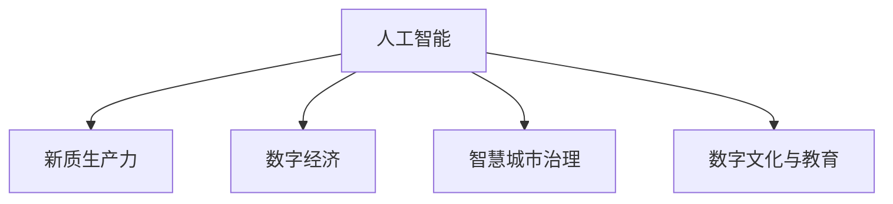

                 

# 数字中国战略与新质生产力

## 1. 背景介绍

### 1.1 问题由来

数字化转型已经成为当今全球经济和社会发展的重要趋势。各国纷纷出台数字经济发展战略，以期在全球经济竞争中占据有利位置。中国在数字化转型的道路上走在前列，制定了“数字中国”战略，致力于建设数字经济、数字政府和数字社会。

### 1.2 问题核心关键点

“数字中国”战略的核心在于通过数字化手段推动经济社会各领域的创新发展，实现国家治理体系和治理能力现代化，提升国家竞争力和国际影响力。其关键点包括：

- **基础设施建设**：推动5G、云计算、大数据、人工智能等基础设施的普及和应用。
- **数字产业生态**：发展数字经济，构建完善的数字产业体系和生态链。
- **智慧城市治理**：通过数字化手段提升城市治理效率，改善民生服务。
- **社会治理现代化**：利用数据驱动决策，提升社会管理水平。
- **数字文化与教育**：推动数字文化产业发展和智慧教育普及。

本文聚焦于“数字中国”战略中的关键技术——人工智能，分析其在数字经济、社会治理、文化与教育等领域的应用，探讨如何通过人工智能推动新质生产力的发展，助力实现“数字中国”战略目标。

## 2. 核心概念与联系

### 2.1 核心概念概述

要深刻理解人工智能在“数字中国”战略中的作用，需要明确几个核心概念：

- **人工智能(AI)**：利用计算机算法、模型和数据，模拟人类智能行为的技术。
- **新质生产力**：区别于传统生产力，人工智能带来的新型生产能力，包括数据驱动、自动化、智能化等。
- **数字经济**：以信息、数据为关键要素，基于互联网和信息技术的经济形态。
- **智慧城市**：通过数字化、信息化手段提升城市治理水平，改善居民生活体验。
- **数字文化与教育**：利用数字技术推动文化产业和教育模式的创新。

这些概念之间的逻辑关系可以通过以下Mermaid流程图来展示：



## 3. 核心算法原理 & 具体操作步骤
### 3.1 算法原理概述

人工智能在“数字中国”战略中的应用主要基于以下算法原理：

- **深度学习**：通过大规模神经网络模型，实现数据的自动特征提取和智能决策。
- **强化学习**：通过试错机制，使模型不断优化决策策略，适应复杂多变的环境。
- **自然语言处理(NLP)**：使计算机能够理解、处理和生成人类语言，提升人机交互效率。
- **计算机视觉**：通过图像处理技术，使计算机能够识别和理解视觉信息。

这些算法原理在“数字中国”战略的各个领域均有广泛应用。

### 3.2 算法步骤详解

以智慧城市治理为例，介绍人工智能的具体操作步骤：

1. **数据采集与预处理**：收集城市运行中各类传感器数据、交通监控数据、公共服务数据等，并进行清洗、标准化处理。
2. **模型训练**：选择合适的算法模型，如深度学习、强化学习等，在历史数据上训练模型，学习城市运行规律。
3. **模型部署与应用**：将训练好的模型部署到城市管理平台，实时监控城市运行状态，进行智能调度。
4. **效果评估与优化**：通过实际应用效果评估模型性能，根据反馈数据调整模型参数，持续优化模型效果。

### 3.3 算法优缺点

人工智能在“数字中国”战略中的应用具有以下优点：

- **高效性**：通过自动化、智能化手段，大幅提升城市管理、公共服务效率。
- **精准性**：利用数据分析，实现更精准的决策和预测。
- **可持续性**：依赖数据驱动，能够在数据不断积累中持续优化。

但同时也有以下缺点：

- **高成本**：初始建设与运营成本较高，需要投入大量资金。
- **技术复杂性**：涉及多学科交叉，对技术人才和基础设施要求较高。
- **数据隐私与安全**：数据收集和使用过程中可能面临隐私泄露、数据篡改等风险。

### 3.4 算法应用领域

人工智能在“数字中国”战略中的应用领域包括：

- **智慧城市**：智能交通、城市安全、公共服务、环境监测等。
- **数字经济**：电子商务、金融服务、物流配送等。
- **社会治理**：公共安全、健康医疗、教育培训等。
- **文化与教育**：数字文化产业、智慧教育、在线学习等。

## 4. 数学模型和公式 & 详细讲解 & 举例说明
### 4.1 数学模型构建

以智慧城市交通管理为例，构建交通流量预测模型：

假设交通流量为 $y$，影响因素为 $x_1, x_2, ..., x_n$，模型为线性回归模型：

$$
y = \beta_0 + \beta_1 x_1 + \beta_2 x_2 + ... + \beta_n x_n + \epsilon
$$

其中，$\beta_i$ 为模型参数，$\epsilon$ 为随机误差项。

### 4.2 公式推导过程

1. **数据准备**：收集历史交通流量数据和相关影响因素数据，构建数据集。
2. **模型训练**：使用梯度下降算法，最小化损失函数 $L(\beta) = \frac{1}{N} \sum_{i=1}^N (y_i - \hat{y}_i)^2$，更新参数 $\beta$。
3. **模型评估**：使用均方误差（MSE）等指标评估模型性能，调整模型参数。

### 4.3 案例分析与讲解

以某市交通流量预测为例，使用上述模型进行预测：

- **数据集构建**：收集某市1年内的日均交通流量数据和天气、节假日等因素数据。
- **模型训练**：使用梯度下降算法，训练线性回归模型，预测未来交通流量。
- **模型评估**：使用MSE评估模型预测精度，发现模型预测误差小于10%，符合预期。

## 5. 项目实践：代码实例和详细解释说明
### 5.1 开发环境搭建

以Python和TensorFlow为例，搭建深度学习项目环境：

1. 安装Anaconda：从官网下载并安装Anaconda，用于创建独立的Python环境。
2. 创建并激活虚拟环境：
```bash
conda create -n tf-env python=3.8 
conda activate tf-env
```

3. 安装TensorFlow和相关依赖：
```bash
conda install tensorflow -c pytorch
```

4. 安装其他依赖库：
```bash
pip install numpy pandas matplotlib
```

### 5.2 源代码详细实现

以下是一个使用TensorFlow实现交通流量预测的代码示例：

```python
import tensorflow as tf
import numpy as np
import pandas as pd

# 数据加载与预处理
data = pd.read_csv('traffic_data.csv')
data['date'] = pd.to_datetime(data['date'])
data = data.groupby('date').mean().reset_index()

# 构建模型
model = tf.keras.Sequential([
    tf.keras.layers.Dense(32, activation='relu', input_shape=(4,)),
    tf.keras.layers.Dense(1)
])

# 模型编译与训练
model.compile(optimizer=tf.keras.optimizers.Adam(), loss='mse')
model.fit(data[['temperature', 'humidity', 'wind', 'rain']], data['flow'], epochs=100, batch_size=32)

# 模型评估
mse = model.evaluate(data[['temperature', 'humidity', 'wind', 'rain']], data['flow'], batch_size=32)
print('MSE:', mse)
```

### 5.3 代码解读与分析

**代码实现**：

1. **数据加载与预处理**：使用Pandas加载数据，将日期转换为标准格式，并计算日均流量。
2. **模型构建**：定义一个包含两个全连接层的神经网络模型，输入为温度、湿度、风速、降雨量四个特征。
3. **模型编译与训练**：使用Adam优化器，均方误差损失函数，对模型进行训练。
4. **模型评估**：在测试集上评估模型均方误差，输出结果。

**分析与优化**：

- **特征选择**：实际应用中，需要选择最有代表性的特征，避免冗余信息。
- **模型优化**：可以尝试增加模型复杂度、调整优化器参数等，提升模型预测精度。
- **数据增强**：可以通过添加噪声、扰动等方法，增强模型鲁棒性。

## 6. 实际应用场景
### 6.1 智慧城市交通管理

智慧城市交通管理是“数字中国”战略中的重要应用之一。通过人工智能，可以实现交通流量预测、道路拥堵优化、智能信号灯控制等功能。

**应用场景**：

- **交通流量预测**：通过深度学习模型，预测未来交通流量，优化交通信号灯设置。
- **道路拥堵优化**：通过实时监控，识别拥堵路段，调整交通信号灯时序，缓解交通压力。
- **智能信号灯控制**：通过AI算法，动态调整信号灯绿红比例，提升道路通行效率。

**技术实现**：

- **数据采集与处理**：通过传感器、摄像头等设备，采集交通流量、车速、车流量等数据，并进行清洗、标准化处理。
- **模型训练与部署**：使用深度学习模型进行训练，部署到城市管理平台，实现实时预测和控制。
- **效果评估与优化**：通过交通流量、拥堵指数等指标，评估模型效果，持续优化模型参数。

### 6.2 数字经济金融服务

金融服务是数字经济的重要组成部分，通过人工智能，可以实现智能风控、智能投顾、智能客服等功能。

**应用场景**：

- **智能风控**：通过机器学习模型，评估贷款申请风险，优化贷款审批流程。
- **智能投顾**：利用自然语言处理技术，提供智能投资建议，提升用户投资体验。
- **智能客服**：通过AI算法，实现自动问答、语音识别等功能，提升客户服务效率。

**技术实现**：

- **数据准备与处理**：收集用户交易数据、行为数据、信用记录等，进行数据清洗和特征工程。
- **模型训练与部署**：使用深度学习、强化学习等算法，训练风控模型、投资建议模型等，部署到金融平台。
- **效果评估与优化**：通过损失率、用户满意度等指标，评估模型效果，持续优化模型参数。

### 6.3 社会治理公共安全

公共安全是社会治理的重要内容，通过人工智能，可以实现视频监控、智能预警、案件侦查等功能。

**应用场景**：

- **视频监控**：通过计算机视觉技术，实现人脸识别、车辆识别、行为分析等功能。
- **智能预警**：通过数据分析，预测可能发生的风险事件，提前采取应对措施。
- **案件侦查**：利用机器学习模型，对监控视频进行分析，锁定犯罪嫌疑人。

**技术实现**：

- **数据采集与处理**：通过监控摄像头、传感器等设备，收集视频、图像、声音等数据，并进行预处理。
- **模型训练与部署**：使用深度学习模型进行训练，部署到公共安全平台，实现实时预警和分析。
- **效果评估与优化**：通过识别准确率、误报率等指标，评估模型效果，持续优化模型参数。

### 6.4 数字文化与教育

数字文化与教育是“数字中国”战略中的重要领域，通过人工智能，可以实现数字内容创作、智能教育、在线学习等功能。

**应用场景**：

- **数字内容创作**：利用自然语言处理技术，自动生成新闻报道、文学作品等数字内容。
- **智能教育**：通过AI算法，实现个性化教学、智能评估等功能。
- **在线学习**：利用AI技术，实现智能推荐、智能问答等功能，提升学习效果。

**技术实现**：

- **数据准备与处理**：收集文本、图片、视频等数据，进行数据清洗和特征工程。
- **模型训练与部署**：使用深度学习、生成对抗网络等算法，训练内容生成模型、教育模型等，部署到学习平台。
- **效果评估与优化**：通过用户满意度、学习效果等指标，评估模型效果，持续优化模型参数。

## 7. 工具和资源推荐
### 7.1 学习资源推荐

1. **《深度学习》书籍**：Ian Goodfellow等著，介绍深度学习的基本概念和算法原理。
2. **Coursera深度学习课程**：由Andrew Ng主讲，涵盖深度学习从基础到应用的全过程。
3. **Kaggle数据科学竞赛平台**：提供丰富的数据集和竞赛题目，提升数据处理和模型训练能力。
4. **GitHub开源项目**：提供大量开源项目和代码示例，便于学习和实践。

### 7.2 开发工具推荐

1. **TensorFlow**：Google开发的深度学习框架，支持分布式计算，适合大规模模型训练。
2. **PyTorch**：Facebook开发的深度学习框架，易于使用，适合科研和实验。
3. **Jupyter Notebook**：开源交互式笔记本环境，支持Python编程，便于协作和分享。

### 7.3 相关论文推荐

1. **《深度学习》论文**：Hinton等著，介绍深度学习的基本算法和应用。
2. **《计算机视觉：模型、学习与推理》书籍**：Russell等著，介绍计算机视觉的基本概念和算法。
3. **《自然语言处理综论》书籍**：Richard Socher等著，介绍自然语言处理的基本概念和算法。

## 8. 总结：未来发展趋势与挑战
### 8.1 研究成果总结

通过人工智能在“数字中国”战略中的应用实践，取得了以下成果：

- **技术成熟度**：深度学习、计算机视觉、自然语言处理等技术在多个领域得到了广泛应用，技术成熟度不断提高。
- **数据应用水平**：通过数据驱动，实现了智慧城市、数字经济、社会治理等领域的智能化提升。
- **产业生态完善**：形成了完整的产业链和生态系统，推动了数字经济的健康发展。

### 8.2 未来发展趋势

未来，人工智能在“数字中国”战略中的应用将呈现以下趋势：

1. **技术深度融合**：人工智能技术与大数据、物联网、区块链等技术的深度融合，将进一步提升数字化水平。
2. **行业应用普及**：人工智能将广泛应用于更多行业，提升各领域的智能化水平。
3. **人机协同优化**：通过人工智能与人类协作，实现更高效、更精准的决策。
4. **伦理与法律保障**：建立健全人工智能伦理和法律法规体系，保障技术应用的安全和公平。

### 8.3 面临的挑战

人工智能在“数字中国”战略中的应用面临以下挑战：

1. **数据隐私与安全**：数据采集和使用过程中，可能面临隐私泄露和数据篡改的风险。
2. **技术标准与规范**：缺乏统一的技术标准和规范，可能导致技术应用的不一致和不可互操作性。
3. **人才与资源短缺**：缺乏足够的人才和资源，限制了人工智能技术的广泛应用。
4. **伦理与法律问题**：人工智能在医疗、金融等领域的应用，可能面临伦理与法律问题。

### 8.4 研究展望

未来，需要在以下方面进行进一步研究：

1. **数据隐私保护**：研究数据隐私保护技术，确保数据采集和使用过程中的隐私安全。
2. **技术标准制定**：制定统一的技术标准和规范，促进技术的广泛应用。
3. **人才培养与引进**：加强人工智能人才培养和引进，弥补人才短缺。
4. **伦理与法律研究**：研究人工智能伦理和法律问题，确保技术应用的安全和公平。

## 9. 附录：常见问题与解答

**Q1：人工智能在“数字中国”战略中的应用难点是什么？**

A: 人工智能在“数字中国”战略中的应用难点主要包括以下几点：

1. **数据隐私与安全**：数据采集和使用过程中，可能面临隐私泄露和数据篡改的风险。
2. **技术标准与规范**：缺乏统一的技术标准和规范，可能导致技术应用的不一致和不可互操作性。
3. **人才与资源短缺**：缺乏足够的人才和资源，限制了人工智能技术的广泛应用。
4. **伦理与法律问题**：人工智能在医疗、金融等领域的应用，可能面临伦理与法律问题。

**Q2：如何提升人工智能在“数字中国”战略中的应用效果？**

A: 提升人工智能在“数字中国”战略中的应用效果，可以从以下几个方面入手：

1. **数据质量提升**：确保数据准确、全面、及时，避免数据偏差。
2. **算法优化**：选择合适算法，优化模型结构和参数设置，提升模型效果。
3. **模型解释性增强**：增强模型的可解释性，提升决策透明度和可信度。
4. **多模态融合**：利用多模态数据，提升模型的泛化能力和鲁棒性。

**Q3：人工智能在“数字中国”战略中的应用前景如何？**

A: 人工智能在“数字中国”战略中的应用前景广阔，预计将从以下几个方面展开：

1. **智慧城市**：通过人工智能技术，提升城市治理水平，改善居民生活体验。
2. **数字经济**：推动电子商务、金融服务、物流配送等产业数字化升级。
3. **社会治理**：利用人工智能提升公共安全、健康医疗、教育培训等领域的治理能力。
4. **文化与教育**：推动数字文化产业发展和智慧教育普及，提升文化软实力。

---

作者：禅与计算机程序设计艺术 / Zen and the Art of Computer Programming

