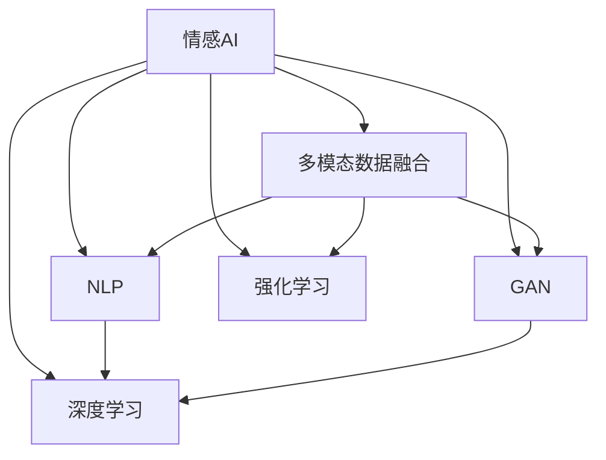

                 

## 1. 背景介绍

### 1.1 问题由来
在数字化时代，人工智能(AI)技术正逐步融入人们的日常生活和工作中。无论是智能家居、智能客服、自动驾驶，还是医疗健康、金融交易等领域，AI都已成为不可或缺的一部分。然而，随着AI技术的普及，一个关键的问题也随之浮现：如何在AI系统中融入人的情感，让机器能够更好地理解和服务于人类？

### 1.2 问题核心关键点
情感连接是人机交互的核心要素。当AI系统能够理解并响应用户的情感时，才能真正实现个性化、人性化的服务。这一问题的解决需要依赖于自然语言处理(NLP)、计算机视觉(CV)、语音识别(SR)等多领域的交叉技术。情感AI不仅涉及对人类情感的识别，还包括对情感的理解、表达和生成，以及如何在多模态数据中整合情感信息，从而实现全面的情感理解。

### 1.3 问题研究意义
研究情感AI技术，对于构建智能系统，提升用户体验，推动社会进步具有重要意义：

1. **提升用户体验**：情感AI可以通过理解用户的情感需求，提供更加个性化、贴心的服务，增强用户的满意度和忠诚度。
2. **促进社会进步**：情感AI可以应用于心理疏导、情感支持、教育辅导等领域，帮助人们更好地理解和应对情感问题，促进心理健康和社会和谐。
3. **推动技术发展**：情感AI技术的深入研究将促进多模态数据融合、自然语言理解、生成模型等前沿技术的发展。

## 2. 核心概念与联系

### 2.1 核心概念概述

为更好地理解数字化同理心的实现，本节将介绍几个关键概念：

- **情感AI (Affective AI)**：指能够识别、理解、表达和生成人类情感的AI系统。情感AI的核心在于对人类情感的深度理解和处理。

- **多模态数据融合 (Multimodal Data Fusion)**：指将来自不同模态的数据（如文本、图像、声音等）进行整合，以便更全面地理解用户的情感状态。

- **自然语言处理 (Natural Language Processing, NLP)**：指使计算机能够理解、处理和生成人类语言的技术。情感NLP是情感AI的一个重要分支，关注于从文本中提取情感信息。

- **生成对抗网络 (Generative Adversarial Network, GAN)**：一种通过两个神经网络对抗训练，生成逼真图像、视频、音频等内容的生成模型。情感GAN可以用于生成逼真的情感数据，辅助情感AI训练。

- **深度学习 (Deep Learning)**：一种基于神经网络的机器学习方法，具有强大的表征学习能力和泛化能力，广泛应用于情感AI任务中。

- **强化学习 (Reinforcement Learning)**：一种通过试错学习最优策略的机器学习方法。情感AI中的情感生成和表达任务，可以通过强化学习进行优化。

这些概念之间的逻辑关系可以通过以下Mermaid流程图来展示：



这个流程图展示了情感AI的关键组成要素及其之间的关系：

1. 情感AI通过多模态数据融合、自然语言处理、生成对抗网络、深度学习和强化学习等技术手段，实现对人类情感的全面理解和处理。
2. 多模态数据融合将文本、图像、声音等多种数据源整合，提供更丰富的情感信息。
3. 自然语言处理从文本中提取情感信息，进行情感分类、情感分析等任务。
4. 生成对抗网络用于生成逼真的情感数据，辅助情感AI训练。
5. 深度学习用于建立复杂情感模型，进行情感预测、情感生成等任务。
6. 强化学习用于优化情感生成和表达，增强情感AI的交互能力和表达力。

## 3. 核心算法原理 & 具体操作步骤

### 3.1 算法原理概述

情感AI的核心算法原理基于深度学习模型，结合多模态数据融合、自然语言处理、生成对抗网络和强化学习等技术。其核心思想是：通过多模态数据的整合，利用深度学习模型提取情感特征，通过强化学习优化情感生成和表达，最终构建能够理解和响应用户情感的AI系统。

形式化地，假设输入数据为多模态数据集 $D=\{(x_i, y_i)\}_{i=1}^N$，其中 $x_i$ 表示多模态数据，$y_i$ 表示情感标签。情感AI的目标是训练一个深度学习模型 $M$，使得 $M(x_i)$ 能够预测 $y_i$。

具体步骤如下：

1. **数据收集**：收集大量多模态数据，涵盖文本、图像、声音等多种形式。
2. **数据预处理**：对数据进行清洗、标注，准备训练和测试集。
3. **特征提取**：使用深度学习模型提取多模态数据的情感特征。
4. **模型训练**：使用深度学习模型对特征进行训练，优化情感分类或生成任务。
5. **情感生成**：利用生成对抗网络生成情感数据，辅助模型训练。
6. **情感表达**：使用强化学习模型优化情感表达，提升AI系统的交互能力。

### 3.2 算法步骤详解

情感AI的具体操作步骤如下：

**Step 1: 数据收集与预处理**

- **多模态数据收集**：收集包含文本、图像、声音等多种形式的多模态数据。数据可以来源于社交媒体、视频平台、音频设备等。
- **数据标注**：对数据进行标注，标注情感标签（如快乐、悲伤、愤怒等）。标注过程可以由人工完成，也可以利用众包平台进行。
- **数据清洗**：去除噪声数据、缺失数据和异常数据，确保数据质量。

**Step 2: 特征提取**

- **特征选择**：根据任务需求，选择合适的特征提取方法。例如，可以使用卷积神经网络(CNN)提取图像特征，循环神经网络(RNN)提取文本特征，CNN-TensorFlow等方法提取音频特征。
- **特征融合**：将不同模态的特征进行融合，生成统一的情感特征向量。融合方法包括简单的拼接、加权平均、注意力机制等。

**Step 3: 模型训练**

- **深度学习模型**：使用深度学习模型（如LSTM、GRU、BERT等）对情感特征进行训练。训练过程中，可以采用交叉熵损失函数、情感分类准确率等指标进行评估。
- **生成对抗网络**：使用生成对抗网络生成逼真的情感数据，以增强训练样本的多样性。GAN模型的训练过程包括生成器和判别器的对抗训练，生成器生成情感数据，判别器判断数据的真实性，两者互相竞争，提高生成数据的质量。

**Step 4: 情感生成**

- **生成对抗网络**：使用GAN生成情感数据，用于辅助模型训练。GAN的生成器可以生成与真实数据相似但不完全相同的情感数据，增强模型的泛化能力。
- **情感数据增强**：使用生成对抗网络生成的数据对模型进行增强训练，提高模型的鲁棒性和泛化能力。

**Step 5: 情感表达**

- **强化学习模型**：使用强化学习模型（如Actor-Critic、REINFORCE等）优化情感表达。强化学习模型根据用户反馈（如满意度、评论等）调整情感生成策略，提升情感表达的准确性和自然度。
- **情感生成与表达**：结合多模态数据融合和自然语言处理技术，生成情感响应，如文本回复、语音回答等。

### 3.3 算法优缺点

情感AI算法具有以下优点：

1. **多模态数据融合**：通过多模态数据融合，可以更全面地理解用户的情感状态，提升情感识别的准确性。
2. **深度学习模型**：深度学习模型具有强大的表征学习能力和泛化能力，能够自动提取复杂的情感特征。
3. **生成对抗网络**：生成对抗网络可以生成逼真的情感数据，用于数据增强和模型训练。
4. **强化学习优化**：强化学习模型可以优化情感生成和表达，提升系统的交互能力和自然度。

同时，该算法也存在以下缺点：

1. **数据标注成本高**：多模态数据的标注需要大量人工参与，成本较高。
2. **模型复杂度高**：情感AI涉及多模态数据融合、深度学习模型训练等复杂过程，计算资源需求高。
3. **情感表达限制**：情感表达受限于生成对抗网络和强化学习模型的质量，效果可能不如人工生成。
4. **用户隐私风险**：多模态数据的收集和处理涉及用户隐私，需要严格遵循数据保护法规。

尽管存在这些局限性，但就目前而言，情感AI技术仍是大规模人机交互中不可或缺的一部分，其应用前景广阔。未来相关研究的重点在于如何进一步降低数据标注成本，提高模型的可解释性和泛化能力，同时兼顾隐私保护和用户体验。

### 3.4 算法应用领域

情感AI技术在多个领域中具有广泛的应用前景，例如：

- **智能客服**：情感AI可以用于智能客服系统，根据用户情感状态提供个性化的服务，提升用户体验。
- **心理健康**：情感AI可以用于心理健康辅导，通过分析用户的情感状态，提供心理支持和治疗建议。
- **情感分析**：情感AI可以用于社交媒体、新闻报道等文本数据的情感分析，了解公众情绪和舆情动态。
- **教育辅导**：情感AI可以用于教育辅导系统，通过分析学生的情感状态，提供个性化教学和学习建议。
- **视频娱乐**：情感AI可以用于视频娱乐应用，根据用户情感状态推荐相关内容，提升用户粘性。

除了上述这些典型应用外，情感AI还被创新性地应用于医疗健康、智能家居、无人驾驶等更多场景中，为人类情感的智能化处理提供了新的解决方案。随着技术的不断进步，相信情感AI将在更广泛的领域发挥作用，提升人类生活质量。

## 4. 数学模型和公式 & 详细讲解

### 4.1 数学模型构建

假设输入数据 $x$ 包含文本、图像、声音等多种形式，情感标签 $y$ 表示情感状态。情感AI的目标是训练深度学习模型 $M$，使得 $M(x)$ 能够预测 $y$。

定义深度学习模型的情感分类准确率为 $P$，情感生成准确率为 $G$，多模态数据融合权重为 $w$。则情感AI的优化目标为：

$$
\max_{M,w} P \times G
$$

其中，$P$ 为情感分类准确率，$G$ 为情感生成准确率，$w$ 为多模态数据融合权重。

### 4.2 公式推导过程

以下我们以情感分类任务为例，推导深度学习模型的情感分类准确率的计算公式。

假设深度学习模型 $M$ 在输入数据 $x$ 上的输出为 $\hat{y}$，表示模型预测的情感状态。真实情感标签 $y$ 属于情感集合 $\{s_1, s_2, \dots, s_n\}$。则情感分类准确率 $P$ 定义为：

$$
P = \frac{1}{N} \sum_{i=1}^N \mathbb{I}[\hat{y}_i = y_i]
$$

其中，$\mathbb{I}$ 表示示性函数，当 $\hat{y}_i = y_i$ 时，示性函数为 1，否则为 0。

在得到情感分类准确率公式后，可以进一步推导出多模态数据融合优化目标公式：

$$
\max_{M,w} \sum_{i=1}^N \log P_{M,w}(x_i) \times \log G_{M,w}(x_i)
$$

其中，$P_{M,w}(x_i)$ 为模型在输入 $x_i$ 上的情感分类准确率，$G_{M,w}(x_i)$ 为模型在输入 $x_i$ 上的情感生成准确率。

## 5. 项目实践：代码实例和详细解释说明

### 5.1 开发环境搭建

在进行情感AI项目开发前，我们需要准备好开发环境。以下是使用Python进行PyTorch开发的环境配置流程：

1. 安装Anaconda：从官网下载并安装Anaconda，用于创建独立的Python环境。

2. 创建并激活虚拟环境：
```bash
conda create -n pytorch-env python=3.8 
conda activate pytorch-env
```

3. 安装PyTorch：根据CUDA版本，从官网获取对应的安装命令。例如：
```bash
conda install pytorch torchvision torchaudio cudatoolkit=11.1 -c pytorch -c conda-forge
```

4. 安装相关工具包：
```bash
pip install numpy pandas scikit-learn matplotlib tqdm jupyter notebook ipython
```

完成上述步骤后，即可在`pytorch-env`环境中开始情感AI项目的开发。

### 5.2 源代码详细实现

这里我们以情感分类任务为例，给出使用PyTorch进行情感AI项目开发的完整代码实现。

首先，定义情感分类任务的数据处理函数：

```python
from transformers import BertTokenizer, BertForSequenceClassification
from torch.utils.data import Dataset
import torch

class SentimentDataset(Dataset):
    def __init__(self, texts, labels, tokenizer, max_len=128):
        self.texts = texts
        self.labels = labels
        self.tokenizer = tokenizer
        self.max_len = max_len
        
    def __len__(self):
        return len(self.texts)
    
    def __getitem__(self, item):
        text = self.texts[item]
        label = self.labels[item]
        
        encoding = self.tokenizer(text, return_tensors='pt', max_length=self.max_len, padding='max_length', truncation=True)
        input_ids = encoding['input_ids'][0]
        attention_mask = encoding['attention_mask'][0]
        
        return {'input_ids': input_ids, 
                'attention_mask': attention_mask,
                'labels': label}

# 创建dataset
tokenizer = BertTokenizer.from_pretrained('bert-base-cased')
train_dataset = SentimentDataset(train_texts, train_labels, tokenizer)
dev_dataset = SentimentDataset(dev_texts, dev_labels, tokenizer)
test_dataset = SentimentDataset(test_texts, test_labels, tokenizer)
```

然后，定义模型和优化器：

```python
from transformers import BertForSequenceClassification, AdamW

model = BertForSequenceClassification.from_pretrained('bert-base-cased', num_labels=2)

optimizer = AdamW(model.parameters(), lr=2e-5)
```

接着，定义训练和评估函数：

```python
from torch.utils.data import DataLoader
from tqdm import tqdm
from sklearn.metrics import classification_report

device = torch.device('cuda') if torch.cuda.is_available() else torch.device('cpu')
model.to(device)

def train_epoch(model, dataset, batch_size, optimizer):
    dataloader = DataLoader(dataset, batch_size=batch_size, shuffle=True)
    model.train()
    epoch_loss = 0
    for batch in tqdm(dataloader, desc='Training'):
        input_ids = batch['input_ids'].to(device)
        attention_mask = batch['attention_mask'].to(device)
        labels = batch['labels'].to(device)
        model.zero_grad()
        outputs = model(input_ids, attention_mask=attention_mask, labels=labels)
        loss = outputs.loss
        epoch_loss += loss.item()
        loss.backward()
        optimizer.step()
    return epoch_loss / len(dataloader)

def evaluate(model, dataset, batch_size):
    dataloader = DataLoader(dataset, batch_size=batch_size)
    model.eval()
    preds, labels = [], []
    with torch.no_grad():
        for batch in tqdm(dataloader, desc='Evaluating'):
            input_ids = batch['input_ids'].to(device)
            attention_mask = batch['attention_mask'].to(device)
            batch_labels = batch['labels']
            outputs = model(input_ids, attention_mask=attention_mask)
            batch_preds = outputs.logits.argmax(dim=2).to('cpu').tolist()
            batch_labels = batch_labels.to('cpu').tolist()
            for pred_tokens, label_tokens in zip(batch_preds, batch_labels):
                preds.append(pred_tokens[0])
                labels.append(label_tokens[0])
                
    print(classification_report(labels, preds))
```

最后，启动训练流程并在测试集上评估：

```python
epochs = 5
batch_size = 16

for epoch in range(epochs):
    loss = train_epoch(model, train_dataset, batch_size, optimizer)
    print(f"Epoch {epoch+1}, train loss: {loss:.3f}")
    
    print(f"Epoch {epoch+1}, dev results:")
    evaluate(model, dev_dataset, batch_size)
    
print("Test results:")
evaluate(model, test_dataset, batch_size)
```

以上就是使用PyTorch进行情感分类任务开发的完整代码实现。可以看到，得益于Transformers库的强大封装，我们可以用相对简洁的代码完成BERT模型的加载和情感分类任务的训练。

### 5.3 代码解读与分析

让我们再详细解读一下关键代码的实现细节：

**SentimentDataset类**：
- `__init__`方法：初始化文本、标签、分词器等关键组件。
- `__len__`方法：返回数据集的样本数量。
- `__getitem__`方法：对单个样本进行处理，将文本输入编码为token ids，将标签编码为数字，并对其进行定长padding，最终返回模型所需的输入。

**模型和优化器定义**：
- 使用BertForSequenceClassification模型进行情感分类任务。
- 设置AdamW优化器，学习率为2e-5。

**训练和评估函数**：
- 使用PyTorch的DataLoader对数据集进行批次化加载，供模型训练和推理使用。
- 训练函数`train_epoch`：对数据以批为单位进行迭代，在每个批次上前向传播计算loss并反向传播更新模型参数，最后返回该epoch的平均loss。
- 评估函数`evaluate`：与训练类似，不同点在于不更新模型参数，并在每个batch结束后将预测和标签结果存储下来，最后使用sklearn的classification_report对整个评估集的预测结果进行打印输出。

**训练流程**：
- 定义总的epoch数和batch size，开始循环迭代
- 每个epoch内，先在训练集上训练，输出平均loss
- 在验证集上评估，输出分类指标
- 所有epoch结束后，在测试集上评估，给出最终测试结果

可以看到，PyTorch配合Transformers库使得BERT情感分类的代码实现变得简洁高效。开发者可以将更多精力放在数据处理、模型改进等高层逻辑上，而不必过多关注底层的实现细节。

当然，工业级的系统实现还需考虑更多因素，如模型的保存和部署、超参数的自动搜索、更灵活的任务适配层等。但核心的情感分类过程基本与此类似。

## 6. 实际应用场景

### 6.1 智能客服系统

情感AI技术在智能客服系统中具有广泛的应用前景。传统的客服系统依赖于人工服务，高峰期响应速度慢，服务质量难以保证。通过情感AI，可以实时分析用户情感状态，提供个性化服务，提升用户体验。

具体而言，情感AI可以在智能客服系统中实现以下功能：

- **情感识别**：实时监测用户情感状态，识别情感变化趋势。
- **情绪管理**：根据用户情感状态，调整客服策略，如自动转接至合适的人工客服。
- **个性化推荐**：根据用户情感状态，推荐相关服务或产品，提升用户满意度。

例如，在智能客服系统中，当用户表达出愤怒或不满情绪时，系统可以自动识别情感，并推荐相关的人工客服或自动回答常见问题，提升用户满意度。

### 6.2 心理健康辅导

情感AI在心理健康辅导中也有着广阔的应用前景。传统的心理健康服务依赖于心理咨询师，难以覆盖所有需要帮助的人群。通过情感AI，可以24小时提供心理健康支持，实时监测用户情感状态，提供个性化的心理辅导。

具体而言，情感AI可以在心理健康辅导系统中实现以下功能：

- **情感监测**：实时监测用户情感状态，识别情绪波动。
- **情感分析**：分析用户情感状态，识别情绪问题。
- **情感支持**：根据用户情感状态，提供相应的心理支持和建议。

例如，在心理健康辅导系统中，当用户表达出焦虑或抑郁情绪时，系统可以自动分析情感状态，并提供相应的心理支持和建议，如情绪调节技巧、放松训练等，帮助用户缓解心理压力。

### 6.3 情感分析

情感分析是情感AI的重要应用场景，用于分析文本数据的情感倾向。通过情感分析，可以了解公众情感、舆情动态，为政府和企业决策提供依据。

具体而言，情感分析可以在以下几个方面发挥作用：

- **舆情监测**：分析社交媒体、新闻报道等文本数据，了解公众情感和舆情动态。
- **市场分析**：分析用户评论、产品评价等文本数据，了解市场趋势和用户需求。
- **情感预测**：预测未来情感变化趋势，为政府和企业决策提供参考。

例如，在舆情监测中，通过情感分析，可以实时监测网络舆情，了解公众情感状态，及时采取措施，维护社会稳定。

### 6.4 未来应用展望

随着情感AI技术的不断发展，未来其在更多领域将得到应用，为人类情感的智能化处理提供新的解决方案。

在智慧医疗领域，情感AI可以用于情感支持和治疗，帮助患者缓解心理压力，提升治疗效果。

在智能家居领域，情感AI可以用于家居控制，根据用户情感状态调整家居环境，提升生活质量。

在无人驾驶领域，情感AI可以用于驾驶情感支持，提升驾驶安全性和舒适性。

此外，在教育、娱乐、金融等更多领域，情感AI也将得到广泛应用，为人类情感的智能化处理提供新的可能性。

## 7. 工具和资源推荐

### 7.1 学习资源推荐

为了帮助开发者系统掌握情感AI的理论基础和实践技巧，这里推荐一些优质的学习资源：

1. 《情感计算：理论、方法与应用》书籍：详细介绍了情感计算的理论基础、技术和应用，适合初学者和研究者。
2. CS224D《情感计算》课程：斯坦福大学开设的情感计算课程，涵盖情感计算的理论、方法和应用。
3. 《深度学习在情感分析中的应用》论文：介绍深度学习在情感分析中的最新进展，适合研究者阅读。
4. HuggingFace官方文档：详细介绍了情感AI的应用实例和代码实现，适合实践者参考。
5. CLUE开源项目：中文语言理解测评基准，涵盖大量情感分析数据集，并提供了基于情感AI的baseline模型，适合学习者使用。

通过对这些资源的学习实践，相信你一定能够快速掌握情感AI的精髓，并用于解决实际的情感问题。

### 7.2 开发工具推荐

高效的开发离不开优秀的工具支持。以下是几款用于情感AI开发常用的工具：

1. PyTorch：基于Python的开源深度学习框架，灵活动态的计算图，适合快速迭代研究。BERT模型在情感AI中广泛应用。
2. TensorFlow：由Google主导开发的开源深度学习框架，生产部署方便，适合大规模工程应用。TensorFlow也提供了丰富的情感AI资源。
3. Transformers库：HuggingFace开发的NLP工具库，集成了大量SOTA情感AI模型，支持PyTorch和TensorFlow，是进行情感AI开发的利器。
4. Weights & Biases：模型训练的实验跟踪工具，可以记录和可视化模型训练过程中的各项指标，方便对比和调优。与主流深度学习框架无缝集成。
5. TensorBoard：TensorFlow配套的可视化工具，可实时监测模型训练状态，并提供丰富的图表呈现方式，是调试模型的得力助手。
6. Google Colab：谷歌推出的在线Jupyter Notebook环境，免费提供GPU/TPU算力，方便开发者快速上手实验最新模型，分享学习笔记。

合理利用这些工具，可以显著提升情感AI开发的效率，加快创新迭代的步伐。

### 7.3 相关论文推荐

情感AI技术的深入研究需要依赖于学界的持续努力。以下是几篇奠基性的相关论文，推荐阅读：

1. Attention is All You Need（即Transformer原论文）：提出了Transformer结构，开启了情感AI领域的预训练大模型时代。
2. Affective Computing Review：综述情感计算的理论、技术和应用，为情感AI的研究提供了全面视角。
3. EmotionAI: Artificial Emotion and Artificial Intelligence：探讨了AI系统如何模拟人类情感，为情感AI技术的发展提供了理论基础。
4. Affective Conversational Agents：介绍了情感对话系统的实现方法和应用场景，为情感AI的应用提供了实践经验。
5. Affective Sensing with Deep Learning: A Survey：综述了深度学习在情感感知中的应用，为情感AI的技术发展提供了方向。

这些论文代表了情感AI技术的发展脉络。通过学习这些前沿成果，可以帮助研究者把握学科前进方向，激发更多的创新灵感。

## 8. 总结：未来发展趋势与挑战

### 8.1 总结

本文对情感AI技术进行了全面系统的介绍。首先阐述了情感AI技术的研究背景和意义，明确了情感AI技术在构建智能系统、提升用户体验、推动社会进步中的重要作用。其次，从原理到实践，详细讲解了情感AI的核心算法和操作步骤，给出了情感分类任务的完整代码实现。同时，本文还探讨了情感AI在多个领域的应用前景，展示了其广阔的想象空间。

通过本文的系统梳理，可以看到，情感AI技术已经成为人工智能技术发展的重要组成部分，其应用前景广阔。未来，伴随情感AI技术的不断进步，相信在更多领域中，情感AI将发挥更加重要的作用，促进人工智能技术的进一步发展。

### 8.2 未来发展趋势

展望未来，情感AI技术将呈现以下几个发展趋势：

1. **多模态数据融合**：随着传感器和设备的发展，情感AI将能够收集和处理更多形式的数据，如语音、图像、生理信号等，实现更全面、准确的情绪感知。
2. **深度学习模型优化**：深度学习模型在情感AI中的应用将不断优化，如引入注意力机制、自适应学习等技术，提升模型的表现力。
3. **生成对抗网络改进**：生成对抗网络将不断改进，以生成更逼真的情感数据，用于数据增强和模型训练。
4. **情感生成和表达优化**：情感生成和表达将不断优化，如引入强化学习、对抗训练等技术，提升系统的交互能力和自然度。
5. **隐私保护和伦理安全**：情感AI在数据收集和处理过程中，将更加注重隐私保护和伦理安全，保障用户数据安全。
6. **情感AI应用扩展**：情感AI将在更多领域得到应用，如医疗健康、智能家居、无人驾驶等，为人类情感的智能化处理提供更多解决方案。

以上趋势凸显了情感AI技术的广阔前景。这些方向的探索发展，必将进一步提升情感AI系统的性能和应用范围，为人类认知智能的进化带来深远影响。

### 8.3 面临的挑战

尽管情感AI技术已经取得了显著进展，但在迈向更加智能化、普适化应用的过程中，仍面临诸多挑战：

1. **数据标注成本高**：多模态数据的标注需要大量人工参与，成本较高。如何降低标注成本，提高标注效率，是情感AI面临的重要问题。
2. **模型复杂度高**：情感AI涉及多模态数据融合、深度学习模型训练等复杂过程，计算资源需求高。如何降低模型复杂度，提高模型效率，是情感AI需要解决的关键问题。
3. **情感表达限制**：情感表达受限于生成对抗网络和强化学习模型的质量，效果可能不如人工生成。如何提升情感表达的自然度和多样性，是情感AI需要攻克的难题。
4. **用户隐私风险**：多模态数据的收集和处理涉及用户隐私，需要严格遵循数据保护法规。如何保障用户隐私，确保数据安全，是情感AI的重要挑战。
5. **情感理解误差**：情感AI在理解用户情感时，可能存在误判、漏判等误差。如何提高情感识别的准确性和鲁棒性，是情感AI需要不断改进的方向。

尽管存在这些挑战，但通过学界和产业界的共同努力，相信情感AI技术能够逐步克服这些难题，在更广泛的领域中发挥作用。

### 8.4 研究展望

未来，情感AI技术需要在以下几个方面进行突破：

1. **无监督和半监督学习**：摆脱对大规模标注数据的依赖，利用自监督学习、主动学习等无监督和半监督范式，最大限度利用非结构化数据，实现更加灵活高效的情感识别和处理。
2. **多模态数据融合**：将更多形式的数据整合到情感识别和处理中，如语音、图像、生理信号等，实现更全面、准确的情绪感知。
3. **深度学习模型优化**：优化深度学习模型，引入注意力机制、自适应学习等技术，提升模型的表现力和泛化能力。
4. **情感生成和表达优化**：通过强化学习、对抗训练等技术，优化情感生成和表达，提升系统的交互能力和自然度。
5. **隐私保护和伦理安全**：加强数据保护和隐私保护，确保用户数据安全，同时注重伦理安全，避免误导性、歧视性的输出。

这些研究方向和突破将进一步推动情感AI技术的成熟和发展，为构建安全、可靠、可解释、可控的智能系统铺平道路。面向未来，情感AI技术还需要与其他人工智能技术进行更深入的融合，如知识表示、因果推理、强化学习等，共同推动自然语言理解和智能交互系统的进步。只有勇于创新、敢于突破，才能不断拓展情感AI的边界，让智能技术更好地造福人类社会。

## 9. 附录：常见问题与解答

**Q1：情感AI如何实现情感理解？**

A: 情感AI通过多模态数据融合、自然语言处理、深度学习等技术实现情感理解。具体而言，情感AI首先对多模态数据进行特征提取和融合，然后通过深度学习模型提取情感特征，最后使用情感分类任务或情感生成任务对情感进行识别和生成。

**Q2：情感AI在实际应用中需要注意哪些问题？**

A: 情感AI在实际应用中需要注意以下问题：
1. 数据标注成本高：多模态数据的标注需要大量人工参与，成本较高。
2. 模型复杂度高：情感AI涉及多模态数据融合、深度学习模型训练等复杂过程，计算资源需求高。
3. 情感表达限制：情感表达受限于生成对抗网络和强化学习模型的质量，效果可能不如人工生成。
4. 用户隐私风险：多模态数据的收集和处理涉及用户隐私，需要严格遵循数据保护法规。
5. 情感理解误差：情感AI在理解用户情感时，可能存在误判、漏判等误差。

**Q3：如何优化情感AI的情感生成和表达？**

A: 情感AI的情感生成和表达可以通过以下方式优化：
1. 引入生成对抗网络：使用GAN生成情感数据，用于数据增强和模型训练。
2. 使用强化学习：通过强化学习优化情感生成和表达，提升系统的交互能力和自然度。
3. 引入注意力机制：引入注意力机制，提高情感识别的准确性和鲁棒性。
4. 引入自适应学习：使用自适应学习技术，提高情感识别的表现力和泛化能力。

**Q4：情感AI在实际应用中如何保护用户隐私？**

A: 情感AI在实际应用中需要注意用户隐私保护，可以通过以下方式实现：
1. 数据匿名化：对用户数据进行匿名化处理，去除敏感信息。
2. 数据加密：对用户数据进行加密存储和传输，保障数据安全。
3. 访问控制：限制对用户数据的访问权限，防止未经授权的数据访问。
4. 数据合规：确保情感AI的开发和使用符合相关法律法规，如GDPR等。

**Q5：情感AI在实际应用中如何提高情感识别的准确性？**

A: 情感AI在实际应用中可以通过以下方式提高情感识别的准确性：
1. 增加标注数据：收集更多的标注数据，提高情感识别的样本多样性。
2. 引入注意力机制：引入注意力机制，提高情感识别的表现力和泛化能力。
3. 引入自适应学习：使用自适应学习技术，提高情感识别的表现力和泛化能力。
4. 引入多模态数据融合：将更多形式的数据整合到情感识别中，如语音、图像、生理信号等，实现更全面、准确的情绪感知。

**Q6：情感AI在实际应用中如何提高系统的鲁棒性？**

A: 情感AI在实际应用中可以通过以下方式提高系统的鲁棒性：
1. 数据增强：通过回译、近义替换等方式扩充训练集，提高模型的泛化能力。
2. 正则化技术：使用L2正则、Dropout等正则化技术，防止模型过度适应训练集。
3. 对抗训练：加入对抗样本，提高模型的鲁棒性和泛化能力。
4. 多模型集成：训练多个情感AI模型，取平均输出，抑制过拟合。

**Q7：情感AI在实际应用中如何提高系统的交互能力？**

A: 情感AI在实际应用中可以通过以下方式提高系统的交互能力：
1. 引入强化学习：通过强化学习优化情感生成和表达，提升系统的交互能力和自然度。
2. 引入对抗训练：加入对抗样本，提高系统的鲁棒性和泛化能力。
3. 引入多模态数据融合：将更多形式的数据整合到情感生成和表达中，如语音、图像、生理信号等，实现更全面、准确的情绪感知和表达。
4. 引入自适应学习：使用自适应学习技术，提高情感生成和表达的表现力和泛化能力。

**Q8：情感AI在实际应用中如何保障用户数据安全？**

A: 情感AI在实际应用中可以通过以下方式保障用户数据安全：
1. 数据匿名化：对用户数据进行匿名化处理，去除敏感信息。
2. 数据加密：对用户数据进行加密存储和传输，保障数据安全。
3. 访问控制：限制对用户数据的访问权限，防止未经授权的数据访问。
4. 数据合规：确保情感AI的开发和使用符合相关法律法规，如GDPR等。

这些解答展示了情感AI在实际应用中需要注意的关键问题和解决方案，帮助开发者更好地理解和应用情感AI技术。

---

作者：禅与计算机程序设计艺术 / Zen and the Art of Computer Programming

